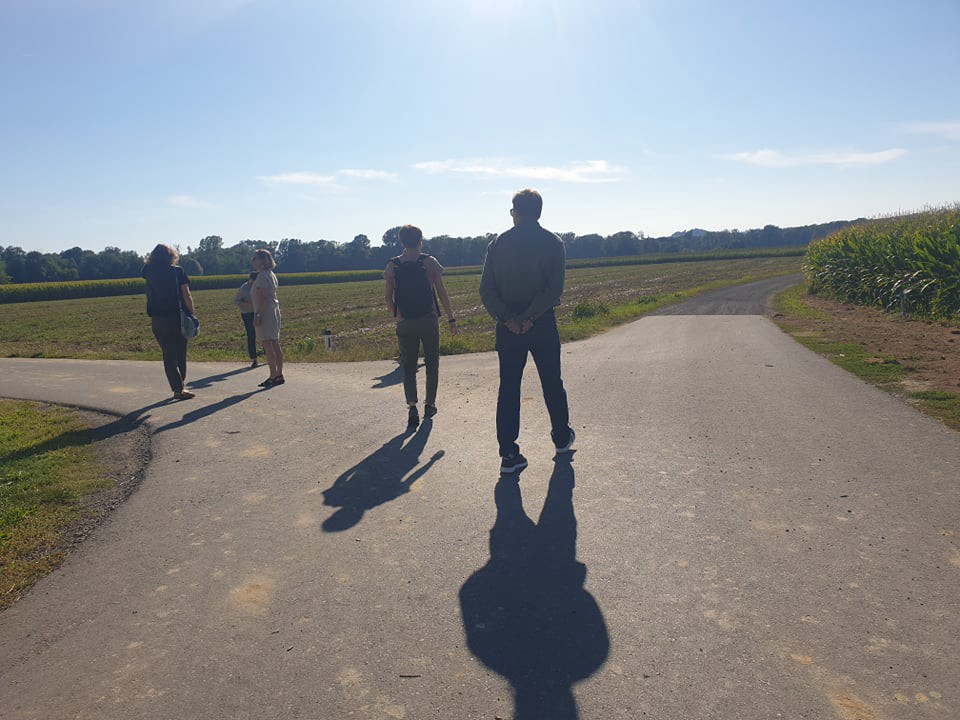
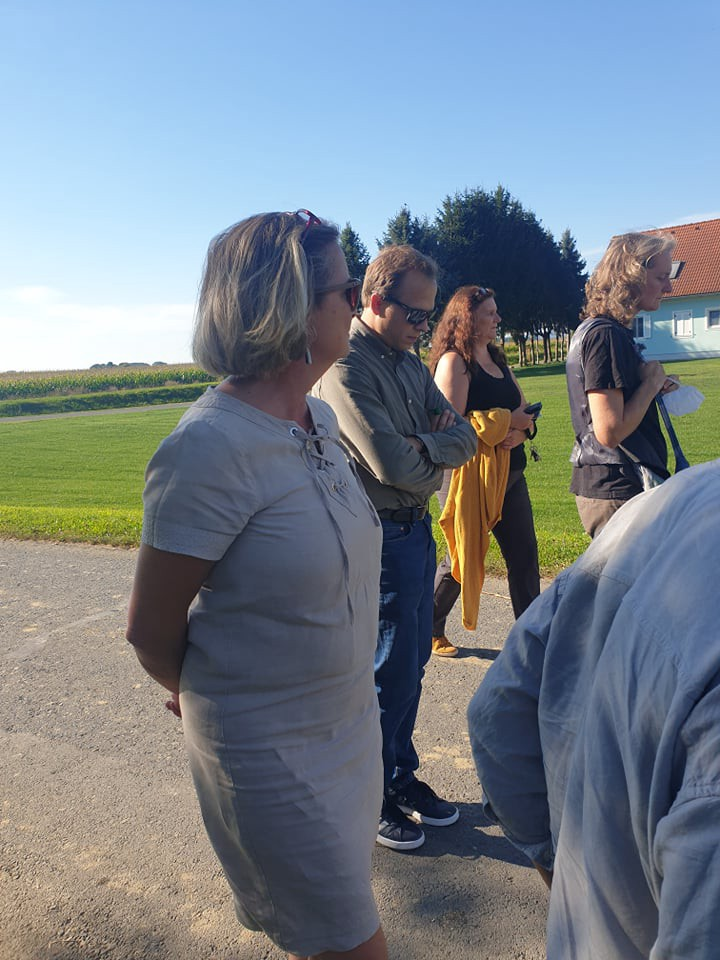
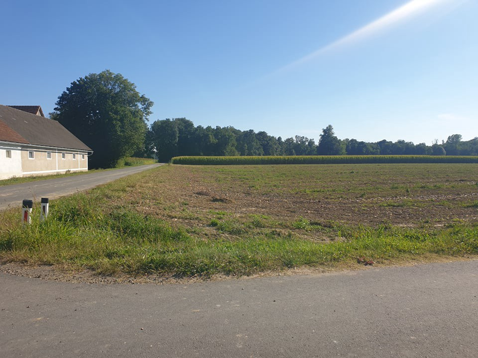
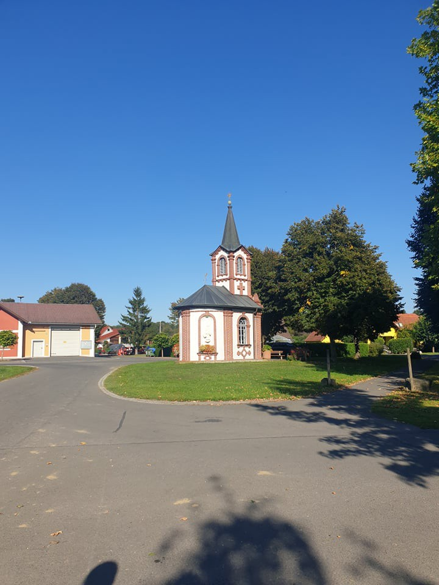

### AYS Daily Digest 10/09/21: A visit to the Austrian border police — “doing what they are told” at the initial point of chain pushbacks
#### Lithuania ignores court decision, expells Afghans / Report on Lebanon — new government, same issues? / Dodgy collaboration of Malta and Lybia / No care for the 48 unaccompanied minors stuck in quarantine on Leros / recommended reads and reports

A visit to the most frequent pushback site at the Austrian border \(Photo: AYS\)
#### FEATURE

The [judgment](http://asyl.at/files/514/3_000686_jv_sig_xx.pdf) of the Regional Administrative Court of Styria that [concluded](https://mailchi.mp/ecre/elena-weekly-legal-update-16-july-2021?e=989a4aebdd#11) “pushbacks are to some extent methodically applied in Austria” seems to have been a tipping point for border practices to some extent\. Following the [documentation](http://www.asyl.at/de/info/presseaussendungen/systematicbreachoflawattheborderconfirmed/) of [another pushback case](https://steiermark.orf.at/stories/3120357/) involving an underage Somalian national, ECRE member asylkoordination österreich calls for the Public Prosecutor’s Office to open an investigation into the Ministry of Interior\. The Court of Justice of the EU \(CJEU\) [ruled](https://curia.europa.eu/juris/document/document.jsf?text=&docid=245748&pageIndex=0&doclang=FR&mode=req&dir=&occ=first&part=1&cid=7050543) on 9 September in favor of a rejected Iraqi asylum seeker, allowing him a new chance to apply for asylum in Austria, as ECRE writes\. However, the border police and police officials still deny any official court decision was made that would force them to change the way they work, that would prove these practices really do take place, nor that the people who appear on the Austrian border actually ask for asylum, our visit to the Austrian border today shows\. Supporting a LIBE Committee Member and members of the Austrian Pushback Alarm and Border Spielfeld group, together with InfoKolpa, Are You Syrious visited the Slovenian\-Austrian border in the point that marks the most used route, but that also had most pushback testimonies documented\.

Member of the European Parliament Bettina Vollath, who is a member of the Committee on Civil Liberties, Justice and Home Affairs \(LIBE\) visited the pushback area and the local border police point, together with members of organisations from Austria, Slovenia and Croatia, who follow, document and advocate against pushback practices, particularly chan pushbacks that, in this case, start in AUstria and end in Bosnia and Herzegovina\. \(Photo: AYS\)

If the area is monitored with drones, it means the entire population of small villages is also under surveillance, so the people are wondering if and for who are they being monitored, what is being done with the footage and if they can have any say in the whole matter\.
The people who come this area have to walk for a long time, after already having walked for a month or so, no public transport is at their disposal in the area, so they need to keep walking\. After Šentilj, the next place people have a possibility to cross to Austria is 10km up, there is a little ferry boat, another tight possibility is 5km further, and afterwards for more than 20km there is no way for people to cross Mura\. That is why this particular area is often used by the people on the move\.

This church is one of the landmarks mentioned in some of the pushback testimonies from the area\.

A group of boys who had arrived to Austria on foot, while retelling their experience that eventually ended up wit a pushback, said they didn’t want to walk through the villages during the night because they didn’t want to frighten anyone, but rather wanted to come out in the morning so people in the village “would know we come in peace”, one of the boys said, think that would work for them to get a chance to ask for asylum\. However, they were pushed back, even if they had already entered one of the towns, way beyond the infamous 10km border area the police often refer to\.

Some of the questions brought in front of the police officials were:
- In light of the recent court finding, are persons apprehended asked about their reasons for entering Austria? Are officers instructed not to ask this question? If yes, why?
- In light of the recent court finding, are persons apprehended asked if they want to ask for asylum in Austria? Are officers instructed not to ask this question? If yes, why?
- Do you think that it is within the remit of police to keep asylum numbers low?
- Do you think it is potentially dangerous if individual officers consider this to be their duty?
- Is there any quality control, debriefing process in place? Is the recent court finding mentioned/used during training of officers?
- Has the recent court finding led to any instructions to officers? If yes, what are they?
- How many people were apprehrnded in the Radkersburg section of the border in 2021? How many in Styria? What percentage asked for asylum?
- Are officers informed that Slovenia pushes people back further to Croatia?
- Are officers informed that their rejections lead to chain pushbacks by Croatian officers on the border to Bosnia and Herzegovina, and that these are extremely violent?
- What is your legal assessment of rejections to Slovenia if people not filing for asylum there are in danger of getting pushed back and subjected to violence?
- Are questions like these aiming at human rights education part of education and continued training of the officers?

After having spoken to the police, the Austrian LIBE Committee Member, as well as the activists from the groups present today, no new insights into the reasons or changes in the way people are treated were brought to fore, but the police representatives did, however, say that they are “doing what they are told”\. They insisted that their priorities are within the police law and that their understanding is they would be doing unlawful things if they were to decide for themselves in any given case, and not do as they are told\.

Also, the court ruling \(resulting from courageous and valuable activist work of Austrian groups\) seemed to be of little to no importance to them, even though since the ruling, some of the elements of the treatment have changed \(people are reportedly no longer being strip searched and they are given food\), but the core issue remains — their right to express the intention to seek asylum is denied and they are still being pushed back, even if it seems to be in smaller percentage, to the understanding and knowledge of the activist and legal groups\. 
Given the tightened and unified policies and practice of the police force along the route, and a similarly tight approach to any questioning of the securitisation policies and border mechanisms in the light of human rights, it seems there is a common ground among the EU ministries of interior, who are determined not only to look the other way when it comes to abuse and violation of rights, but also to push for the agenda of \(violently\) refusing those seeking protection, as well as EU citizens seeking answers to very simple and clear questions, something that should be alarming to everyone across the EU\.
#### LEBANON

It’s been two years that Lebanon has been in a devastating economic crisis \(an economic crisis that the World Bank has called one of the top 10 most severe crises globally since the 19th century\), and 13 months since the explosions of unclear origin took place in Beirut’s main port, reaching and destroying big parts of the country and it’s connection to global trade\. These 13 months have been marked by a missing cabinet as the former one withdrew shortly after the explosion and could reform legally — thus accepted by all three religious decision\-makers — just now\.

13 months with only a minimally working government in emergency status means 13 months of not tackling structural problems\. The majority of the population is living [below the poverty line](https://taz.de/Der-Libanon-ein-Jahr-nach-der-Explosion/!5786497/) , food prize stay high, fuel is nearly impossible to get and even medicine is now getting scarce\. Electricity is available for one hour per day\. Furthermore, employment and salaries have both declined which leads to citizens leaving the country for good, including doctors — the basic needs can less and less be met\.

Lebanon has taken in the most refugees [in comparison to it’s own population worldwide](https://www.uno-fluechtlingshilfe.de/hilfe-weltweit/libanon) , and it is [estimated](https://www.wfp.org/countries/lebanon) that 40 percent of the overall population are refugees\. More than a third of those are minors — while in 2020, 89% of Syrian refugee families lived below the extreme poverty line\. The majority is lacking legal status, [which is heightening risks of exploitation and abuse and restricting refugees’ access to work, education, and healthcare\.](https://www.hrw.org/world-report/2021/country-chapters/lebanon) Many of the people live in temporary shelters in harsh weather conditions of hot summers and cold, wet winters\.

This collapsing country and all it’s people have been waiting for a new government for over a year, unrealized due to political and religious games of power\. Now, under prime minister Nadschib Mikati, a [new cabinet has formed](https://www.lorientlejour.com/article/1274345/qui-sont-les-nouveaux-ministres-du-gouvernement-mikati.html) — consisting mainly of the old elite sadly infamous for corruption and embezzling money\. Also, consisting of 23 men and 1 woman in total\. Though the disappointment in the population is deep and hope can only be kept until official elections in may 2022, a positive turn in the first days:

In 2019, t [he authorities in Beirut began forcibly returning some Syrian refugees but halted this in 2020 due to border closures linked to the pandemic](https://www.infomigrants.net/en/post/32823/lebanon-expells-syrian-refugees-pushed-back-by-cyprus) ; now this would have happened again to 6 Syrian men, but as a “welcome statement” the General Security Office of the new found government declared the men to be safe to stay in Lebanon\. What that will mean for internal asylum politics has to be seen\. We are awaiting news about the cooperation between Cyprus and Lebanon, which has so far resulted in pushbacks by the Cypriot state forces and a following expulsion from Lebanon\. [Find out more](https://www.amnesty.org/en/latest/press-release/2021/09/lebanon-general-security-must-halt-imminent-deportation-of-six-syrians/) on the case and Amnesty International’s pressure on Lebanon as well as other countries to continuously suspend expulsion to Syria, where returnees are threatened with torture, sexual abuse and worse\.

Lebanon will hardly see any changes in internal struggles in the close future\. Western countries have been halting aid for as long as there hasn’t been a control on corruption, so there are few possibilites for people on the move to get support\.
#### AFGHANISTAN
### **Human Rights Watch urging Japanese government to protect Afghans with ties with Japan**

[Japan’s](https://nam02.safelinks.protection.outlook.com/?url=https%3A%2F%2Fwww.hrw.org%2Fasia%2Fjapan&data=04%7C01%7Challt%40hrw.org%7Ceb2843572d44414dc6ba08d97425b43f%7C2eb79de4d8044273a6e64b3188855f66%7C0%7C0%7C637668527557331003%7CUnknown%7CTWFpbGZsb3d8eyJWIjoiMC4wLjAwMDAiLCJQIjoiV2luMzIiLCJBTiI6Ik1haWwiLCJXVCI6Mn0%3D%7C1000&sdata=hL5GVpMiYP9dtC5afE23N5fb5bGjra7kyikM4afYiO8%3D&reserved=0) government should urgently protect Afghan civilians who are at risk under the new Taliban authorities, Human Rights Watch said today in a [letter](https://nam02.safelinks.protection.outlook.com/?url=https%3A%2F%2Fwww.hrw.org%2Fnews%2F2021%2F09%2F10%2Fletter-prime-minister-suga-human-rights-crisis-afghanistan-0&data=04%7C01%7Challt%40hrw.org%7Ceb2843572d44414dc6ba08d97425b43f%7C2eb79de4d8044273a6e64b3188855f66%7C0%7C0%7C637668527557340949%7CUnknown%7CTWFpbGZsb3d8eyJWIjoiMC4wLjAwMDAiLCJQIjoiV2luMzIiLCJBTiI6Ik1haWwiLCJXVCI6Mn0%3D%7C1000&sdata=kErNm%2FD5rhpyJ5GBIzK8hQArRNMko0xb7YUP9Uuw0fY%3D&reserved=0) to Prime Minister Yoshihide Suga\.

> The Japanese government, which has not even offered help to all Afghans with past ties to Japan, should urgently scale up its protection and support to Afghans at risk\. Japan should also offer to relocate and resettle at\-risk Afghans in numbers commensurate with the crisis\. Japan’s long involvement in Afghanistan and its leadership role as a donor underscores its responsibility to help Afghans now fleeing for their lives\. — [Kanae Doi, Japan director at Human Rights Watch](https://www.hrw.org/news/2021/09/10/japan-protect-fleeing-afghans-risk) 

So far, the Japanese government has not announced any plans to facilitate family reunion or pledges for resettlement, HRW reports\.

At the same time, there have been many testimonies on incidents of violence towards protesters and journalists\. [The most recent media covered incident concerned two reporters present at the Panjshir protests](https://www.theguardian.com/world/2021/sep/09/violent-attacks-on-afghan-journalists-by-taliban-prompt-growing-alarm) , who were being arrested and beaten until losing consciousness\.

In just two days this week, the Taliban detained and later released at least 14 journalists covering protests in Kabul, with at least six of these journalists subject to violence during their arrests or detention, the Committee to Protect Journalists reported\.

UNHCR [has reportedly urged the Taliban to “put aside the use of force](http://The spokeswoman for the UN High Commissioner for Human Rights, Ravina Shamdasani, has urged the Taliban to put aside the use of force against protesters and journalists who are covering protests in Afghanistan in recent weeks.) against protesters and journalists who are covering protests in Afghanistan in recent weeks”\. The Reporters Without Borders \(RSF\) warn over a sharp increase in violence against journalists and reporters in Afghanistan and says in the past two days dozens of violence cases against journalists have been recorded by RSF\. Find a recorded discussion \(in Persian\) of Afghan News channel TOLO News on the subject [here](https://www.youtube.com/watch?v=jtLpB7EtahI) \. Also one of [TOLO News journalists had briefly been detained](https://www.theguardian.com/world/2021/sep/09/violent-attacks-on-afghan-journalists-by-taliban-prompt-growing-alarm) , had been prevented from filming earlier this week and had his camera confiscated\.
#### LIBYA
### **Drone strike hits illegal boat\-building factory**

An illegal factory in Sabratha dedicated for building boats to transfer migrants has been targeted by two drone strikes\. According to local sources the drones which targeted the industrial district did not result in any casualties, but a huge explosion was heard throughout the city\. No party has yet claimed responsibility for these two strikes, which occurred on Sunday, [Libya Observer](https://www.libyaobserver.ly/inbrief/drone-strike-hits-illegal-boat-building-factory-sabratha) reported\.
#### SEA
### **Geo Barents Rescue Vessel back to sea**

■■■■■■■■■■■■■■ 
> **[MSF Sea](https://twitter.com/MSF_Sea) @ Twitter Says:** 

> > The #GeoBarents is getting ready to sail back to the central #Med to save lives. NGOs are left with no other choice than to fill the deadly gap created by states who have shamefully abandoned vulnerable people on the world's deadliest migration route. https://t.co/5a2THMw7XR 

> **Tweeted at [2021-09-10 16:16:47](https://twitter.com/msf_sea/status/1436363029717950464).** 

■■■■■■■■■■■■■■ 

#### MALTA
### **High power delegation of the Lybian government visiting Malta**

Libyan Prime Minister and other top officials were welcomed pompously by armed forces, red carpet and Maltesian Prime minister Robert Abela, purpose of the visit being the [“discussion of bilateral trade relations”](https://www.maltatoday.com.mt/news/national/111958/watch_malta_lays_out_red_carpet_for_libyan_national_unity_pm_dbeibah#.YTuax50zZPY) \. Both countries are well known for their so called coast guards either carrying out [illegal pushbacks costing lives for many years](https://ecre.org/med-100-lives-lost-at-sea-malta-paid-for-pushbacks-to-libya-eu-seeks-to-enhance-cooperation-in-north-africa/) \(Malta\) or even purposefully resulting in illegal pullbacks to Libya\. People returned to Libya definitely face [years of prison, forced labour, physical violence, sexual abuse and blackmail of their families money](https://www.amnesty.org.uk/press-releases/libya-new-testimonies-reveal-horrors-inflicted-refugees-and-migrants-traffickers) , if they find no other way to escape, so boats in international waters should not be returned to Libya at all\.

The statement of discussions on this matter has been short\. [Libyan PM said that the respective defence ministers agreed to resolve several issues faced by the Libyan community in Malta, and discussed issues of smuggling, migration, and “all illegal activities”\.](https://www.maltatoday.com.mt/news/national/111963/flights_between_malta_and_libya_to_resume_)
#### GREECE
### **Alarm Phone pushback near Evros**

■■■■■■■■■■■■■■ 
> **[Alarm Phone](https://twitter.com/alarm_phone) @ Twitter Says:** 

> > UPDATE: We lost contact to the 5 people at 16:38CEST and fear that police found them and facilitated a #pusback to #Turkey. On the phone the police officer claimed that they did not find the group yet but are still searching. 

> **Tweeted at [2021-09-10 16:27:49](https://twitter.com/alarm_phone/status/1436365809035747332).** 

■■■■■■■■■■■■■■ 

**Uncertainty in asylum procedures of Afghan refugees**

■■■■■■■■■■■■■■ 
> **[Parwana Amiri پروانه اميري](https://twitter.com/parwana_amiri) @ Twitter Says:** 

> > In Afghan Embassy many were waiting for their documents and passport.
“New government of #Afghanistan may change everything, there is no guarantee.” said one of them.
 
The current condition in #Afghansitan has a had a big implement on asylum procedure of #AfghanRefugees . https://t.co/I72H72p0vZ 

> **Tweeted at [2021-09-10 19:18:43](https://twitter.com/parwana_amiri/status/1436408816023838736).** 

■■■■■■■■■■■■■■ 

### **48 minors not receiving support and procedure**

The 48 unaccompanied minor refugees who were recently “washed away” in Kythira are being held in the quarantine structure in Leros, [without any special care, together with the adults\.](https://www.efsyn.gr/politiki/paraskinia/309646_tha-idrosei-kapoio-ayti) While it may be due in part to technical reasons, it is firstly a matter of concern that the competent authorities systematically avoid informing the prosecutors who are legally responsible and are obliged to appoint representatives\.
### **Limiting rightful access to education for people in Lesvos camp**

■■■■■■■■■■■■■■ 
> **[#EULesvos](https://twitter.com/EULesvos) @ Twitter Says:** 

> > #Announcement by the #RICLesvos (#MavrovouniCamp) stating specific hours at which people may be allowed to leave the #camp according to #DIKA number!! Why??

Restricting access to #education!

#NoClosedCamps #NoMoreMorias!

#EUWalls #EULesvos #RefugeesGr #MigrationEU https://t.co/KYezMEAPXJ 

> **Tweeted at [2021-09-10 09:33:05](https://twitter.com/eulesvos/status/1436261435697508352).** 

■■■■■■■■■■■■■■ 

**According to Greek Minister of Interior, the [“conditions \[of camps and refugees\] have much improved”](https://twitter.com/lk2015r/status/1436372220293623810) , meanwhile celebrating Greeks harsh border policy**

“There will be no more Moria”, was the promise made by Greek and European authorities after a fire destroyed the overcrowded camp on Lesbos in September 2020\. A year later, living conditions on the island are still disastrous and Greece is creating new laws to restrict access to international protection\. — Find full articles on people’s situation more than one year after the big fire [here](https://www.infomigrants.net/en/post/34965/a-year-after-the-moria-fire-migrants-lose-hope-of-better-conditions) and [here](https://www.brusselstimes.com/belgium/184522/belgiums-oldest-belgian-man-passes-away-aged-107/) \.

■■■■■■■■■■■■■■ 
> **[Vassilis Tsarnas](https://twitter.com/VassilisTsarnas) @ Twitter Says:** 

> > #Greece: The Minister of Migration celebrates the results of a survey, acc. to which 73,5% supports his illegal policy of not allowing #RefugeesGr from #Afghanistan to "massively" enter the country. Respect for #HumanRights is an obligation, not a thing for the majority to decide 

> **Tweeted at [2021-09-10 11:01:04](https://twitter.com/vassilistsarnas/status/1436283578527137794).** 

■■■■■■■■■■■■■■ 

#### HUNGARY
### **One testimony too much on violence of pushbacks**

Increasingly intensive attempts, but also an increasing number of violent pushbacks by Hungary\. Hamza from Syria, testified that soldiers and policemen put a chain around his waist tied with handcuffs on his hands\. So they knelt for a long time, while they insulted them and broke their mobile phones with their feet, [APC](https://twitter.com/APC_CZA/status/1436244622527901698) reports\.
#### GERMANY
### **Protest against the government’s contribution to the Libyan coast guard and to the patrols at the EU outer borders**

Thursday 16/09/21–5pm — area in front of Reichstag building

■■■■■■■■■■■■■■ 
> **[Seebrücke](https://twitter.com/_Seebruecke_) @ Twitter Says:** 

> > Kommt am 16.09.2021 um 17:00 Uhr zu unserer Kundgebung auf die Wiese vor dem Reichstagsgebäude. Kurz vor der Bundestagswahl möchten wir unseren Protest nochmals in die Öffentlichkeit bringen, denn Menschenrechte sind #unverhandelbar. 

> **Tweeted at [2021-09-10 16:32:34](https://twitter.com/_seebruecke_/status/1436367001816125450).** 

■■■■■■■■■■■■■■ 

#### FRANCE
### **Calling out for the need of empty housing**

A public park had been evicted, where [1200 migrants and supporters had collected for five days](https://www.infomigrants.net/en/post/34839/le-camp-du-parc-andrecitroen-evacue-1-200-migrants-mis-a-labri) to protest for a dignified housing\. The protest had been initiated by the collective\. While some of the protesters without papers had been brought to some random place in France, others were moved to detention centers possibly facing expulsion\. [They had not been informed on what was happening and where they were being taken\.](https://www.liberation.fr/societe/logement/parc-andre-citroen-des-sans-abri-deplaces-sans-le-savoir-hors-de-paris-20210907_RMSXT7OTDJGZ5O3VVBAPF4WUZI/)

> We associations, trade unions, organizations, collective signatories, denounce the conditions for the evacuation of the camp of 1200 homeless people settled in \[park\] André Citroën from September 1 to 4\. This evacuation was carried out in the presence of the Prefect of Paris Police and the Prefect of the region Ile de France\. 

### **Utopia56 in need of support for the new school year**

The France based group is looking for volunteers to do homework help and accompany classes and is collecting school supplies, technical devices and clothes\. Find out how to take part [here](https://www.facebook.com/U56ParisIDF/posts/2730245067274936) \.
#### UK
### **Young asylum seeker threatening to kill himself on roof of detention hotel Crowne Plaza and eventually jumping from roof**

Movement for justice is reporting about the tension and months of waiting of people in hotel detention\. In this case, a young boy is concerned who is staying in hotel Crowne Plaza with 400 other people\.

> neglect of asylum seekers in these hotels & extreme isolation of places like Crowne Plaza make deaths inevitable / 

> hotel full of people who’ve been through deeply traumatic experiences yet zero mental health support & waiting months just to be registered with a GP\. There have been at least 3 deaths in this [@CrownePlaza](https://twitter.com/CrownePlaza) hotel in just one year — blood is on hands of [@ukhomeoffice](https://twitter.com/ukhomeoffice) 

People in hotel detention are missing out on a reasonable waiting time for their procedure and medical & mental health support, to not speak about school, work and income\. [MfJ](https://twitter.com/followmfj?lang=de) for more detailed information…

#### LITHUANIA
### **Five Afghan migrants expelled despite court order**

Around 4100 people on the move have entered Lithuania, Latvia and Poland this year, due to the Belarussian government purposefully redirecting people on the move towards the borders to use them as a matter of political pressure and as an answer on EU sanctions earlier\. All three EU states have been turning people away since early August\.

Five of the people have gone to Court with their case\. The Afghan men arrived in Belarus in August with the wish to seek asylum in Lithuania because, as western and educated Afghan nationals, they are especially vulnerable to Taliban reprisals\.

The case had been brought to the European Court of Human Rights \(ECHR\) on the basis that they faced the risk of ill\-treatment if returned to Belarus, in breach of the European Convention on Human Rights\. Belarus is not a signatory to the Convention\. The **ECHR ruled that the men should not be returned because of risk of deportation in an unsafe country endangering their lives** and considering that they are already on Lithuanian territory\.

Nevertheless, chief Border Guard of Lithuania declares that the country is “not obliged by the court to allow the migrants to enter from Belarus” and “to not allow the illegal migrants into Lithuanian territory” — the country’s Interior minister states that **Lithuania would be open to refugees “if they arrive legally”** but that it would “not allow anyone to abuse our asylum system and to turn Lithuanian into a thoroughfare for illegal migration”\. Though the political intentions of Belarus are obvious, it seems like Lithuania didn’t get a grip yet on what asylum means, considering that it’s main purpose is to grant safety that people can not find elsewhere, and that “illegal migration” is just a way of saying that people didn’t choose an uncertain procedure of months of waiting while remaining where they are; or that people didn’t choose a violent and risky way through South\-East European borders in the complete absence of European Law\.

[The lawyer for the five Afghans, Asta Astrauskiene, told _Reuters_ that she would ask the ECHR to tell Lithuania to let the five Afghan men back in\.](https://www.infomigrants.net/en/post/34977/lithuania-expels-afghan-migrants-despite-court-order)

Find a short article of individual Lithuanian voices on refugees, positive and negative, [here](https://www.euronews.com/2021/09/10/we-need-to-help-them-in-lithuania-locals-say-afghan-refugees-are-welcome) \.
#### **EU & FRONTEX**
### **“As Frontex, at least, we act legally\!”**

Frontex is already screening refugees from Afghanistan who have flown out and grants indirect access to EU databases\. Now horror director Leggeri is having “talks about a collaboration”\. And again Leggeri uses the narrative that legal pushbacks exist \(in addition to Morocco and Greece also in Lithuania\) \.

> As far as Greece is concerned, I wouldn’t just talk about “pushbacks”\. There are situations in the sea between Turkey and Greece that are not distress situations because the boats are not out of control\. They are trying to evade border controls and are presumably being used for the purpose of cri _minal activities\. Then the legal framework of intercepting boats applies\. — Leggeri_ 

Find [here](https://digit.site36.net/2021/07/22/border-drones-part-1-unmanned-surveillance-of-the-eus-external-borders-by-frontex/) all the details about manned and unmanned surveillance of the EU’s external borders by [\#Frontex](https://www.facebook.com/hashtag/frontex?__eep__=6&__cft__[0]=AZXnVcdSYhwp0F8qJPT6EjBvYxwG9YgRd9CFar_51u-bvwxVfd4RQGm_e__mUkjE6VDTBpb5UPB4JPD04UntWgTrvI7MCFqo8G46GSS8wnTc09NX-WbUAx_GjC23GWfwWfIBshQ5NsBjrrcLIhD4IbAiVcPxwfrjWludaHpOhtMfC-m4NkslOCx5Are0lfhy1AM&__tn__=R]-R) , all contracts and companies involved\.
#### WORTH READING
- “Death can have many different shapes, the worst one is when you are alive”: [Amin’s personal story](https://www.facebook.com/care4calais/posts/4699325026767084) about his journey\.
- ECRE \(European Council on Refugees and Exiles\) [weekly bulletin](https://mailchi.mp/ecre/ecre-weekly-bulletin-10092021?e=989a4aebdd) has been released, this week covering Austria, Bulgaria, France, Greece, Poland and the UK\.
- You can also find the ELENA [weekly legal update](https://us1.campaign-archive.com/?u=8e3ebd297b1510becc6d6d690&id=4b54b4a486) on asylum law online\.
- Nadia Nadim fled Afghanistan when she was just a toddler\. Today, she plays football for the Danish national team\. Now, she’s worried what the Taliban takeover might mean for her birth country: “You cannot let cavemen run a country and then expect it to be a modern country\.”

■■■■■■■■■■■■■■ 
> **[InfoMigrants](https://twitter.com/InfoMigrants) @ Twitter Says:** 

> > Nadia Nadim fled Afghanistan when she was just a toddler. Today, she plays football for the Danish national team. 

Now, she's worried what the Taliban takeover might mean for her birth country: "You cannot let cavemen run a country and then expect it to be a modern country." https://t.co/7k3UCOap70 

> **Tweeted at [2021-09-10 20:00:43](https://twitter.com/infomigrants/status/1436419385347002368).** 

■■■■■■■■■■■■■■ 

- [Article on Los Angeles Police Department \(LAPD\)](https://www.heise.de/news/Los-Angeles-Polizei-sammelt-Social-Media-Daten-aller-gestoppten-Personen-6188437.html) ordering its officers to collect the social media information and email addresses of all civilians they interviewed, including those who are not arrested or accused of a crime\. This is accompanied by a comprehensive analysis of contributions that users post on social networks\. To do this, the LAPD relies on special software for evaluating large amounts of data\.
- “Turning back migrant boats: What does the international law of the sea say?” Following today’s content about Frontex and the reunion of Malta and Libya, an [article](https://theconversation.com/turning-back-migrant-boats-what-does-the-international-law-of-the-sea-say-167679) depicting the dirty matter\.
- \- and an [article](https://lloydslist.maritimeintelligence.informa.com/LL1138160/UK-boat-pushback-plan-risks-playing-roulette-with-migrants-lives) on the planned UK boat pushbacks: “playing roulette with migrants’ lives”

**Find daily updates and special reports on our [Medium page](https://medium.com/are-you-syrious) \.**

**If you wish to contribute, either by writing a report or a story, or by joining the info gathering team, please let us know\.**

**We strive to echo correct news from the ground through collaboration and fairness\. Every effort has been made to credit organisations and individuals with regard to the supply of information, video, and photo material \(in cases where the source wanted to be accredited\) \. Please notify us regarding corrections\.**

**If there’s anything you want to share or comment, contact us through Facebook, Twitter or write to: areyousyrious@gmail\.com**

_Converted [Medium Post](https://medium.com/are-you-syrious/ays-daily-digest-10-09-21-a-visit-to-the-austrian-border-police-doing-what-they-are-told-at-d61f88d8b2e5) by [ZMediumToMarkdown](https://github.com/ZhgChgLi/ZMediumToMarkdown)._
