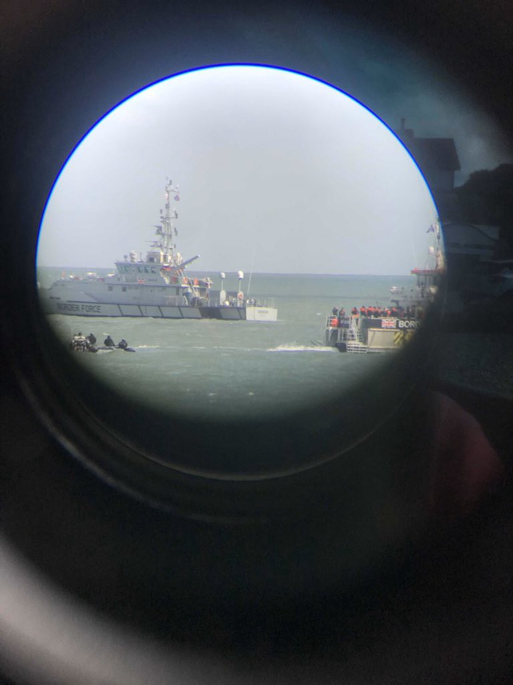

### AYS Daily Digest 13/09/2021: British Border Forces train to push back people

Amid criticism, the UK proceeds with its pushback plans // Amnesty urges UNHCR to halt plans to repatriate Syrians // school about to start in Greece — also for children living in camps? // Rescues and landings // Updates on the situation in Poland, Lithuania and Latvia

Copyright: Channel Rescue
### FEATURE: British Border Forces practice Pushbacks

In a new low of the UK’s shameless, open and illegal conduct against People on the Move in the channel between the UK and France: the human rights monitoring NGO Channel Rescue witnessed and documented an event that seems to have been a drill by Border Forces, replicating the pushback of a dinghy\. The footage shows a dinghy full of people in life vests, being circled by three jet skies which seemed to try and push the dinghy off course by driving close and producing waves\. At one point, one of the jet ski drivers bumped the rear of a dinghy and turned it around\.

■■■■■■■■■■■■■■ 
> **[Channel Rescue](https://twitter.com/ChannelRescue) @ Twitter Says:** 

> > LIVE UPDATE: We're currently witnessing what looks like pushback drills by Border Force jet skis in the Channel. We're not 100% sure but two jet skis appear to be doing circling manoeuvres around dinghies with Border Force vessels full of people looking on. We’re 👀 @[ukhomeoffice](https://twitter.com/ukhomeoffice) https://t.co/c2kgciTLMp 

> **Tweeted at [2021-09-13 11:30:27](https://twitter.com/channelrescue/status/1437378134261780481).** 

■■■■■■■■■■■■■■ 

The practice of driving close to a dinghy and forcing it to change direction \(and putting the people on board at extreme risk through high waves\! \) is a common pushback practice in the Mediterranean and the Aegean Sea\. The drill was documented only days after British Home Secretary Priti Patel announced that pushbacks to France are now an official state tactic, and introduced plans to conduct training for Border Forces and develop skills for executing these pushbacks\. [According to The Guardian,](https://www.theguardian.com/uk-news/2021/sep/09/priti-patel-to-send-boats-carrying-migrants-to-uk-back-across-channel)

> “Training, which is weather dependent, is due to conclude this month, with use of the tactics ready to deploy as soon as practical and safe\.”

The French government, as well as human rights groups, are sure that there is no such a thing as a “safe” pushback\. [French Minister of Interior Gérald Darmanin rejected Patel’s plans, stating that](https://www.infomigrants.net/en/post/34956/france-rejects-uk-plan-to-turn-back-migrant-boats) :

> “ [safeguarding human lives at sea](https://www.theguardian.com/uk-news/2021/sep/06/record-numbers-of-migrants-picked-up-crossing-channel) takes priority over considerations of nationality, status and migratory policy”\. 

Beside putting people at extreme risk, pushbacks are also illegal\. [In a statement from January concerning the increasing numbers of pushbacks from Europe, UNHCR’s Assistant High Commissioner for Protection, Gillian Triggs, said](https://www.unhcr.org/uk/news/press/2021/1/601121344/unhcr-warns-asylum-under-attack-europes-borders-urges-end-pushbacks-violence.html)

> “Respecting human lives and refugee rights is not a choice, it’s a legal and moral obligation\.”

According to UNHCR,

> “The 1951 Refugee Convention, the European Convention on Human Rights and EU law require states to protect the right of people to seek asylum and protection from refoulement, even if they enter irregularly\. Authorities cannot automatically deny entry to or return people without undertaking an individual assessment of those in need of protection\.”

In 2021, 14,100 people have so far crossed the channel by boat\. There are basically no legal options for people to reach the UK, forcing them to take the risky boat journey\. With late summer weather, crossings are very high these days, with a record of 828 people crossing on one day in late August\. In the past few days French authorities rescued 126 people from the Channel\. [According to media](https://www.infomigrants.net/en/post/34998/france-rescues-126-migrants-attempting-channel-boat-crossing-to-the-uk?fbclid=IwAR0CTs5LxfRfHsgCv_TklNd5q-OPTGBhPEQFaxVmnFuGzCh5wpZ-xRzQjwo) , French authorities let boats pass into British waters and do not intercept them, unless they are in distress\.

### SYRIA
#### Plans to repatriate Syrians are met with criticism from Human Rights Observers

[The UNHCR together with host countries like Jordan and Turkey is working on plans to repatriate Syrians\.](https://www.infomigrants.net/en/post/35001/turkey-working-with-un-to-return-syrian-refugees?fbclid=IwAR17A39lORWSJdvWEh78YNkeET3qkUzGOoEz0JD6gFJTNds8V8L9DIx3hY0)

Amnesty International is reporting about a plan from UNHCR together with Syrian Arab Red Cross to repatriate Syrians from Rukban, an informal camp in an inhospitable area of Jordan, close to the Syrian border\. According to the plans, the residents should be repatriated to shelters in Homs where they will have to undergo 14 days of quarantine\. However, it will be at the discretion of the Assad regime whether they will then be able able to leave the shelters\. In the past, these shelters have been used to detain returnees arbitrarily\. [According to a press release from Amnesty International:](https://www.amnesty.org/en/latest/news/2021/09/syria-jordan-un-led-return-operation-puts-refugees-at-risk-of-abuses-in-syria/)

> “Some of these returnees were then transferred to intelligence centres where they were arbitrarily detained and in some cases, tortured and forcibly disappeared\.”

[Only last week, Amnesty International published a report on the situation of returnees\.](https://www.amnesty.org/en/latest/news/2021/09/syria-former-refugees-tortured-raped-disappeared-after-returning-home/) In the report they

> “documented a catalogue of horrific violations committed by Syrian intelligence officers against 66 returnees, including 13 children\. Among these violations, Amnesty International documented five cases whereby detainees had died in custody after returning to Syria, while the fate of 17 forcibly disappeared people remains unknown\.”

According to researcher Marie Forestier, people from Rukban camp have especially been targeted by Syrian authorities\. Amnesty International calls on UNHCR and SARC to halt their plans\.
### GREECE
#### Will all children in Greece finally be able to attend school this year?

For many children whose parents are applying for asylum in Greece, school and education have been beyond reach\. Access to education is a fundamental right — however, Greece denies this right to children on a regular basis\. Officially, Greece has offered special Greek language programs for refugee children since 2015\. In reality these programs often started very late in the year or not at all\. With the pandemic and online teaching, access was even more limited, as many camps do not have Wi\-Fi nor are tablets provided for the children in camps\. According to Human Rights Watch, less than 1 out of 7 children living in camps attended school at all last year\. Yet, there is hope that the situation might get better: Greece committed to follow a plan developed by UNICEF and funded by the EU that allows access to school for all children living in Greece\. Let’s see how it goes\. \.

This report from April 2021 provides a very good overview of the educational situation of children living in camps:

#### Whereabouts of 5 people unknown

Alarm Phone was in contact with 4 women and one girl who arrived in Chios and were in urgent need of assistance\. The NGO contacted the authorities, who claimed they were searching for the group\. Alarm Phone lost contact with the group at 14 CEST\. There is no update on their whereabouts yet; an illegal pushback can’t be ruled out\.

■■■■■■■■■■■■■■ 
> **[Alarm Phone](https://twitter.com/alarm_phone) @ Twitter Says:** 

> > 🆘on Chios island!

4 women and 1 girl are stranded on #Chios. They need urgent medical assistance for a pregnant woman and a the girl who are very sick. Authorities are informed. They need assistance now! 

> **Tweeted at [2021-09-13 12:03:18](https://twitter.com/alarm_phone/status/1437386401402793986).** 

■■■■■■■■■■■■■■ 

#### Demonstration in Ritsona camp

■■■■■■■■■■■■■■ 
> **[Parwana Amiri پروانه اميري](https://twitter.com/parwana_amiri) @ Twitter Says:** 

> > Approving Turkey as an unsafe country for #Refugeesgr has forced many families to pass the borders and enter the center of Europe.
In today’s demonstration, refugees in #RitsonaCamp are asking for their asylum documents and fair system, mainly #Kurdish and #Afghan community. https://t.co/SEosdJ5urS 

> **Tweeted at [2021-09-13 19:47:04](https://twitter.com/parwana_amiri/status/1437503112764432399).** 

■■■■■■■■■■■■■■ 

A demonstration has been held in Ritsona camp, where people were asking for their asylum documents to be processed and protested against the decision that proclaimed Turkey a safe country for refugees\. Documented by the impressive young journalist and writer Parwana Amiri\.
#### Report on Greek emergency responses to Moria fire published

The NGO Fenix published a report on the Greek emergency responses to the fire in Moria one year ago\. While Greek Minister for Migration Notis Mitarachis praised himself for his emergency responses, the report shows that the actions taken were in fact inadequate\.

■■■■■■■■■■■■■■ 
> **[Fenix - Humanitarian Legal Aid](https://twitter.com/FenixAid) @ Twitter Says:** 

> > INADEQUATE EMERGENCY RESPONSE TO THE MORIA FIRE
(1/4) 

Last Friday, @AidFenix published a report that shows an inadequate response from the Greek Government after the Moria Fires. https://t.co/ICf2OEwhkH 

> **Tweeted at [2021-09-13 13:10:18](https://twitter.com/aidfenix/status/1437403265637957634).** 

■■■■■■■■■■■■■■ 

> “It becomes clear that the majority of asylum seekers and refugees staying on the streets of Lesvos were deprived of food, water, and access to sanitation facilities\.”

For the full report, see:

### SEA
#### Rescues near the Canary Islands

Salvamento Maritimo rescued two boats, one with 25 people and another one with [53 people on board close to the Canary Islands](https://www.cronicasdelanzarote.es/articulo/sucesos/salvamar-rescata-otra-patera-cerca-lanzarote-52-inmigrantes-bordo/20210913180558298429.html?fbclid=IwAR230n9U0GrBAZjdM_FuBkXt8EVTE-oIkKiIS86HhuSvJwBUZZz-P1q-J04) \. The whereabouts of at least one more boat with 28 people on board are unknown, [according to media reports\.](https://www.europapress.es/sociedad/noticia-salvamento-maritimo-rescata-patera-25-migrantes-aguas-canarias-busca-otras-dos-20210913171357.html?fbclid=IwAR1VxaIH9QK96MeJ-8hjup5Jxpv9J7tWD41lCaJkggWMpN06awzWxFwXv6k)
#### Landings at Lampedusa

A boat with 15 people arrived at Lampedusa, [according to media reports\.](https://www.grandangoloagrigento.it/primo-piano/mini-sbarco-a-lampedusa-15-migranti-sullisola-2?fbclid=IwAR2FDF6PRTdEkmPSCxVM_X-nSIkrAvyjjAWqcCQ7EdDjVKVdWfKvr6EIrPc)
### POLAND
#### Insight into restricted area at the border

Journalist Franziska Grillmeier gives us an insight into the situation at the Poland\-Belarusian border\. According to her, there is a large military and police presence close to the 3 km restricted area along the border\. Residents in the area feel insecure, but some continue to secretly provide food and assistance to the people hiding in the forests\. Poland does not allow them to enter the country and apply for asylum but instead pushes them back to Belarus\.

■■■■■■■■■■■■■■ 
> **[Franziska Grillmeier](https://twitter.com/f_grillmeier) @ Twitter Says:** 

> > Journalists & independent human rights observers are not allowed to enter security zone in #Poland to document recent developments at #EU-border. To be frank, I do not understand why this is not causing more serious outrage, with #refugees trapped in life-threatening situation. 

> **Tweeted at [2021-09-13 16:31:46](https://twitter.com/f_grillmeier/status/1437453965709430788).** 

■■■■■■■■■■■■■■ 

### LITHUANIA

An anonymous employee working in the registration process for asylum applicants in Lithuania provided insight into the process, disclosing shocking practices\.

> “We were cheating them during this process, because \[…\] the main goal is to get rid of them,”

he said\.

Lithuanian Foreign Minister Gabrielius Landsbergis stated last week in a Facebook post addressing People on the Move that

> “virtually no\-one of you will receive an asylum”

The anonymous informant said that people were told they could either return voluntarily or by force\. The outcome of the 20 minutes long assessment depended completely on the interviewers morals and empathy\. The interviewees were not informed about their rights but instead told lies of receiving better conditions if they agreed to voluntary returns\.

> “People are taking part in the interviews like in a game where they do not know the rules,”

said the informant\.

### LATVIA

According to information published by the Latvian Border Guards, 80 people were deterred from crossing the Latvian\-Belarusian border over the weekend\.

### UK

[According to an article published by The Guardian](https://www.theguardian.com/world/2021/sep/13/afghan-refugees-in-uk-quarantine-hotels-treated-like-prisoners?fbclid=IwAR1VxaIH9QK96MeJ-8hjup5Jxpv9J7tWD41lCaJkggWMpN06awzWxFwXv6k) , many Afghans, who arrived in the UK through the resettlement scheme following the Taliban invasion of Kabul, are kept in quarantine conditions for much longer than the necessary 10 days\. They speak about having to book an appointment to leave the hotel, in which they can’t even open a window\. When they’re allowed to, they’re usually given no more than 20 minutes to spend in a car park, accompanied by security personal\. Nobody provides them with any information on what is going to happen and how long they will have to stay in this situation\. Amongst the people hosted in hotels are many children\. Some people the Guardian spoke to have been held like this for 20 days, without any information about what will happen next\.
### SWEDEN

The European Committee for the prevention of torture \(CPT\) just published its report of a routine visit to Sweden, which took place in January 2021\. The committee regularly visits member states in order to observe places of imprisonment and their compliance with the European Convention for the Prevention of Torture and Inhuman or Degrading Treatment or Punishment\. The last visit to Sweden took place in 2015\. For the first time, the visit in 2021 also included two closed migration detention centres run by the Swedish Migration Agency, in Åstorp and Ljungbyhed\. Regarding the situation of foreign nationals, the committee criticised a lack of access to the provision of health care, including access to psychiatric care and psychological assistance\.

The committee further stated their concerns that,

> despite its long\-standing recommendation, foreign nationals detained pursuant to aliens legislation could still be held in prisons\. The CPT must stress once again that, in those cases where it is considered necessary to deprive persons of their liberty under the aliens legislation, they should be accommodated in centres specifically designed for that purpose, offering material conditions and a regime appropriate to their legal situation\. 

Sweden has often been criticised for holding people in pre\-removal detention in regular prisons\.

For the full report, see:

### EVENTS
#### Online event on Fortress Europe and its profiteers

An online event with our frequently quoted Matthias Monroy and Özlem Alev Demirel, MEP will take place on Thursday 23th of September \(presumably in German\):

■■■■■■■■■■■■■■ 
> **[Özlem Alev Demirel](https://twitter.com/OezlemADemirel) @ Twitter Says:** 

> > Schon mal vormerken. Am Donnerstag, den 23.9., diskutiere ich mit @[matthimon](https://twitter.com/matthimon) und Jacqueline Andres über die #FestungEuropa und ihre Profiteure. Weitere Infos und Einwahldaten gibt es hier: [oezlem-alev-demirel.de/2021/09/08/die…](https://oezlem-alev-demirel.de/2021/09/08/die-festung-europa-und-ihre-profiteure/)
#seebrücke #RefugeesWelcome https://t.co/1QN7DBOJIr 

> **Tweeted at [2021-09-13 12:59:36](https://twitter.com/oezlemademirel/status/1437400570520866817).** 

■■■■■■■■■■■■■■ 

**Find daily updates and special reports on our [Medium page](https://medium.com/are-you-syrious) \.**

**If you wish to contribute, either by writing a report or a story, or by joining the info gathering team, please let us know\.**

**We strive to echo correct news from the ground through collaboration and fairness\. Every effort has been made to credit organisations and individuals with regard to the supply of information, video, and photo material \(in cases where the source wanted to be accredited\) \. Please notify us regarding corrections\.**

**If there’s anything you want to share or comment, contact us through Facebook, Twitter or write to: areyousyrious@gmail\.com**

_Converted [Medium Post](https://medium.com/are-you-syrious/ays-daily-digest-13-09-2021-british-border-forces-train-how-to-push-back-people-c527d6471469) by [ZMediumToMarkdown](https://github.com/ZhgChgLi/ZMediumToMarkdown)._
