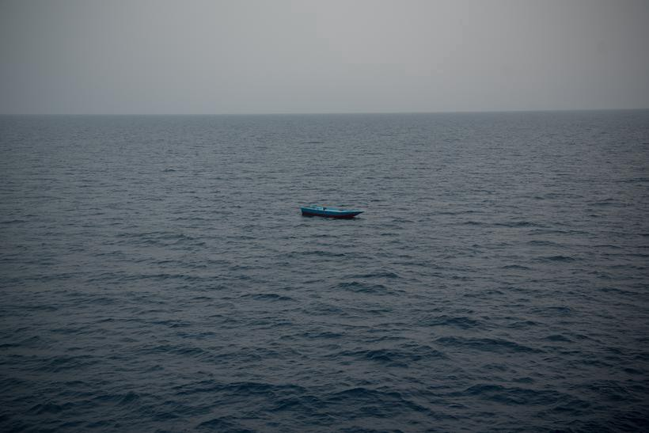

### AYS Daily Digest 14/09/21 — Will the EU Continue Deporting Afghan People?

[Are You Syrious?](?source=post_page-----f0935aeb3e7d--------------------------------)

[Sep 15](ays-daily-digest-14-09-21-will-the-eu-continue-deporting-afghan-people-f0935aeb3e7d?source=post_page-----f0935aeb3e7d--------------------------------) · 10 min read

Worrying Nationalist Rhetoric and Relations With Taliban Concerning Many//Tunisian Fishermen Protest Against Libyan Coast Guard//Journalists Protest Polish State of Emergency

An empty boat drifts past the rescue ship the Geo Barents, the fate of the people on board is unknown\. Photo credit: Vincent Haiges via [Zeit\.de](https://www.zeit.de/gesellschaft/zeitgeschehen/2021-09/seenotrettung-mittelmeer-aerzte-ohne-grenze-geo-barents-libyen-italien?utm_referrer=https%3A%2F%2Fl.facebook.com%2F)
### FEATURE
### As UN, EU Reach Out to Taliban, Observers Fear Future Deportations

Despite pledges not to normalize the Taliban’s rule, it seems as if Western leaders are bending over backwards to establish relations\. This is leading many to fear that the powers that be will attempt to carry out deportations to the country despite clear evidence that any place controlled by the Taliban is not a safe place for women, religious and ethnic minorities, returnees, and any form of dissent\.

UNHCR commissioner [Filippo Grandi met](https://www.europapress.es/internacional/noticia-taliban-reunen-jefe-acnur-defienden-relaciones-positivas-todos-paises-20210914151533.html?fbclid=IwAR23ZgZkgwHv8y4__I2ku7GKpdT1Gsi2wt7OwHAS-LkThet4AKtQcrVexVE) with the Taliban Foreign Minister in Kabul\.

The Taliban representative said that his government’s wish is that displaced Afghans return to the country and that the Taliban is interested in maintaining good relationships with other countries to allow this to happen\. This is stoking fears many Afghans already had, that foreign governments would use good relationships with the Taliban as an excuse to deport people despite clear indications of the danger this would put them in\.

Allegedly, Frontex will station a [migration liaison officer](https://twitter.com/matthimon/status/1437701672701157377?fbclid=IwAR2n9WD2_6OuDv0wsR2He3OabS6aav0dI3vhsQ5HySu9wRkCHOW4kBhHAOY) for Afghanistan in Pakistan, which raises questions both about the expanding scope of Frontex \(Pakistan is hardly close to Europe’s borders\) and about the intentions of such an operation\.

The European Commission’s existing plan for Afghan people already raises grave concerns for the safety of people on the move\. Although it says that the agreement allowing deportations to Afghanistan is suspended, the Commission still encourages individual EU states to deport Afghan people to “ [safe third countries](https://www.statewatch.org/news/2021/september/european-commission-suspend-deportations-to-afghanistan-but-deport-afghans-to-other-third-countries/?fbclid=IwAR1bE7fMdfTZS_oFoqx63vHUlAygexKOCB7GBNAINELISJV2hoNLp6jfAKg) ,” a criteria that is always open to interpretation and abuse\.

Despite the Taliban’s words at the press conference, there have already been reports of violence against returnees\.

Meanwhile, rhetoric in the EU is not getting any less violent even with clear evidence of the dangers that people are fleeing\. At the European Police Conference, Austrian interior minister Nehammer received a [rousing round of applause](https://twitter.com/matthimon/status/1437708069807525890?fbclid=IwAR2FEA6svodNNRiqIKLjzsmlY5ulFTaS2GjeVonLNID0EPmP2LleLYk3nXg) for calling on the EU to finance deportation centers and more fencing at the borders\. Meanwhile, his boss, Chancellor Kurz, said that Austria will not [take any Afghan refugees](https://tg24.sky.it/mondo/2021/09/14/kurz-austria-rifugiati-afghanistan?fbclid=IwAR1ScOOVNKNRMAuqLzKs4LdWJrgAzXcC1LO5vwy8H1k2r1ZX03swzZmnwSo) , citing that they already have too many people from Afghanistan \(Austria is home to about 44,000 Afghans\. For comparison, neighboring Pakistan is home to 1\.4 million registered Afghan refugees alone, not counting people in legal limbo\), and making up ridiculous statistics about “differences in values\.” The rousing applause Nehammer received as well as Kurz’s [open citation of Denmark](https://twitter.com/TihomirSabchev/status/1437779958437490688?fbclid=IwAR113TnBNLqv_KYe7J74x3qAnp34b99r3mRQ4s7cJ7nSfirU-Klh56oKBYY) as inspiration for his asylum policy shows how well the xenophobic elements of European policy reinforce each other and shape the continent’s collective policy\.

In the face of such policies, we must be vigilant against any attempt to vacillate about the situation in Afghanistan and harm our friends who are people on the move\. Afghanistan is not safe for returns and nobody should be forced to go there against their will, even as the political climate looks as if it might still allow deportations\.
### TUNISIA
### Fishermen Protest Against Actions of Libyan Coast Guard

For the past week, fishermen in Zarzis, southeastern Tunisia, have been [blocking the fishing port](https://www.globalproject.info/it/mondi/tunisia-blocco-del-porto-di-zarzis-in-protesta-contro-la-guardia-costiera-libica/23667?fbclid=IwAR3kdepKY-KdHYiDNVF7sYY8KQPO7VfoWhQrDnyiSmHBmx-FwFszg0cmXoI) to pressure their government to take action against the so\-called Libyan Coast Guard\. The fishermen, who often go into international waters and rescue people on the move in distress, have been experiencing increasing hijackings and attacks by the Coast Guard, even in Tunisian waters, which has impeded their ability to help others in distress and make a living\.

The Libyan Coast Guard is able to act with so much impunity thanks to agreements that the Tunisian government signed with it, Italy, and Malta agreeing to cooperate in pushbacks, with no regard about how that would affect people on the move or its own citizens relying on the once\-free sea to live\.

Meanwhile, the Libyan authorities are enjoying consistent support from European states, as shown by recent [visits to Malta](https://www.libyaherald.com/2021/09/13/aldabaibas-visit-to-malta-leads-to-several-agreements/?fbclid=IwAR3JxLz7ef5C_vmxoQuxIpsjjfJXtHjBA2vFUpvm07FIptnrRinj2v89gyM) , despite reports of their brutality towards ordinary people, including their own citizens, neighbors, and people on the move\.
### SEA
### Photojournalist Joins Rescue Ship

If you click on only one link from the digest, make it this one\. The photojournalist Vincent Haiges joined the rescue ship the _Geo Barents_ on its mission in the Mediterranean to understand why people make the dangerous crossing and the situation for NGO rescuers\. [The article](https://www.zeit.de/gesellschaft/zeitgeschehen/2021-09/seenotrettung-mittelmeer-aerzte-ohne-grenze-geo-barents-libyen-italien?utm_referrer=https%3A%2F%2Fl.facebook.com%2F) is a must\-read, and the photos Haiges took are haunting\.

One of the most striking incidents from the story is the reaction of people when the rescuers announced “We won’t take you back to Libya\.” For many exhausted people, this is not their first attempt to make the crossing, but pullbacks and pushbacks to Libya are sadly all too common\.

Landing Updates

Lampedusa saw 13 separate landings\. More details can be found [here](https://www.rainews.it/dl/rainews/articoli/migranti-13-sbarchi-lampedusa-oltre-400-contrada-imbriacola-c69c2ab4-a18e-4b6a-877f-e1db2e88d4db.html?fbclid=IwAR1F7KpIyu1Ha69Uk93ddVmfwDAKMGR2nIB-hqy5LztH1JLa8vR8KwHs1fU) \.

Sadly, tragedy struck near Lanzarote\. Salvamento Maritimo rescued a boat carrying 30 people, but one man had sadly [passed away](https://www.europapress.es/islas-canarias/noticia-fallece-migrante-viajaba-patera-rescatada-otros-30-varones-cerca-lanzarote-20210914143447.html?fbclid=IwAR1ib9rVHIFySixW38ZiYk-FGk60FjSCC_nWPZJMq6DTJr2sMcoWrrrfW0A) before the rescue\.

Resqship is returning to the Mediterranean for its fifth mission\. You can support their work by donating\. Learn more [here](https://www.facebook.com/resqship/posts/919154662015751) \.
### GREECE
### Commission Holding on to Funds, Asking for Transparency

Last week, [we shared the news](ays-daily-digest-09-09-21-home-office-announces-intention-to-carry-out-pushbacks-6e6d28fa3091) that there are tensions between the EU and Greece over the funding of Frontex missions\. This week, the European Commission has confirmed that it is withholding millions of euros in funding for the external border that Greece has requested\.

The Commission says that it will not release the extra money until Greece sets up an [independent monitoring mechanism](https://www.euractiv.com/section/justice-home-affairs/news/commission-asks-greece-for-transparency-on-pushbacks-to-release-migration-funds/?fbclid=IwAR1p-zLtWcJIUeK2lBaHY9OvwNZd52-DuD8Nl4BM2Js0SyA-sLSD7QkQvos) to address pushbacks — which the Greek government is still refusing to admit are happening\. Moreover, they have made no effort to set up a monitoring mechanism \(although the UN’s Human Rights office for Europe already [tweeted its support](https://twitter.com/UNHumanRightsEU/status/1437696866309873665?fbclid=IwAR2X44zLBCSAE_FY_VjN_XIUHUkDKfCGoj_ksc2801A6oHJP3BdwIokHJKI) for Greece’s so\-called decision\) \. There have also been issues [with the statistics](https://twitter.com/lk2015r/status/1437801442639851525?s=20&fbclid=IwAR03Ne4OlYDbA-aqee1HEcELxw5vmZBN6xdIdGnNSZ9Q_64J9m97vE0LECw) tweeted by Frontex and the Greek Migration Ministry, which raises the question of how a monitoring mechanism would function if neither the government nor the EU can provide accurate numbers\. Mitsotakis is bragging about “ [90% reduction in flows](https://twitter.com/PrimeministerGR/status/1437030429400383490?fbclid=IwAR220GjHaN8fivMtEYxtBnazK5qZH0v7UEUn3Y1jOpUHlLoxtzkuBEOX130) ” without addressing the accuracy of that number, or the violence his government has perpetrated with the goal of reducing migration\. That does not bode well for any monitoring mechanism his government would set up\.

To be clear, this is the bare minimum, and the ideal amount of funding that murderous border regimes receive should be 0 euros, and even if Greece set up a monitoring mechanism, there would be questions over its true transparency and independence\. Croatia was required to set up a similar mechanism before receiving EU funds, but the transparency mechanism never worked properly\.
### Dire Conditions for Children on the Move

Reports have shown that many children on the move are blocked from accessing an education in Greece\. Many do not even have a safe home\. In Mavrovouni camp, built to replace Moria, children are [blocked in the camp](https://twitter.com/NikolajNielsen/status/1437450790415839242?fbclid=IwAR2n9WD2_6OuDv0wsR2He3OabS6aav0dI3vhsQ5HySu9wRkCHOW4kBhHAOY) that is no better than a dusty construction site, and they need permission to leave\. Children do not have access to school or enrichment activities, many of which require negative Covid tests that those living in the camp cannot access\. Although the government should allow children on the move to attend local public schools, most only [receive an education](https://www.infomigrants.net/en/post/35023/lack-of-schooling-constant-stress-and-nightmares-child-refugees-are-the-first-victims?fbclid=IwAR2X44zLBCSAE_FY_VjN_XIUHUkDKfCGoj_ksc2801A6oHJP3BdwIokHJKI) from hastily organized NGO schools\.

This is by no means a problem that is exclusive to Moria, as children across Greece do not have access to public schools\. The few from foreign backgrounds that make it to school are still not safe\. Recently, a xenophobic Greek news site published a [preschool class list](https://twitter.com/ninarei/status/1437870406954897408?fbclid=IwAR0lr5soKHAmQKylSKUs8OeFa1yLReWdGakgsV0RSa6-EYCr9_nzNN0G2hY) with the children’s names to complain about the lack of Greek\-sounding names, potentially exposing very young children to xenophobic abuse and violence\. Although the site removed the names following an outcry, the disgusting framing of the story stayed up and the damage was already done\.
### BOSNIA & HERZEGOVINA
### Authorities Forcing People Into Lipa Camp

Authorities are expanding Lipa camp near Bihać in Bosnia & Herzegovina, while simultaneously diminishing people’s alternative options\. This has led to increased evictions of squats in Bihać\. [This video](http://Bihać) from our friends at No Name Kitchen expands on the situation\.
### ITALY
### Salvini Trial Starts

Matteo Salvini’s trial [starts in Palermo](https://taz.de/Matteo-Salvini-in-Italien-vor-Gericht/!5800946/) this Wednesday, September 15th\. Italy’s former Interior Minister is facing charges of deprivation of liberty and abuse of office for blocking the [rescue ship the Open Arms](https://www.spiegel.de/ausland/italien-matteo-salvini-wegen-blockade-von-fluechtlingsschiff-vor-gericht-a-9b9c2d68-56eb-4fbd-b862-471f102747c8?fbclid=IwAR2cldO1KkGfCN2QUlIOxOz3SSdWodtjDhWsiDN4lX0DzyFskcDuxLEcMzw) from finding a safe harbor in Italy\.

Salvini’s defense is arguing that he cannot be on trial because he did not act in isolation and like a broken clock, this time they are right\. It is not just Salvini that is guilty of this gross deprivation of liberty as the standoffs with rescue ships have continued happening even after he left office, and are not restricted just to Italy\.

Still, the harmful impact of Salvini’s xenophobic actions and rhetoric should not be understated\. We hope that justice will be served\. It is unfair that someone like Salvini faces no consequence for his actions, while brave advocates such as Lorena Fornasir, who is [continuing her work](https://www.facebook.com/lorena.fornasir/posts/4268452913271773) with people on the move in Trieste, are harassed and brutalized by the state\.
### FRANCE
### Eviction in Calais

In yet another heavy\-handed eviction in Calais, police [ripped 80 people](https://www.facebook.com/collectiveaidfrance/posts/381439196935807) from the homes that they were able to make for themselves\. Authorities destroyed people’s tents, arrested 3 people, and prevented people from taking their personal belongings\. The eviction violated several laws\.

Important Volunteer Updates

Barbers from [Solidarite Migrants Wilson](https://www.facebook.com/watch/?v=182460563995693) showed up and gave young people in Pali Kao free haircuts\. The 7 barbers gave 35 young people haircuts\. A fresh cut is about more than appearance, it helps maintain people’s sense of dignity and shows that others care, while also bringing the convivial atmosphere of a barber shop for people to enjoy\.

If you are interested in volunteering in Paris, Utopia 56 is hosting an apero for interested people Wednesday, September 15th, starting at 18h30\. More information can be found [here](https://www.facebook.com/U56ParisIDF/posts/2732839933682116) \.
### GERMANY
### Confusion About Status of Afghans in Germany

Germany evacuated about 5,300 people from Afghanistan, 4,000 of whom were Afghan nationals\. However, their legal situation is still unclear\. Here is an [explainer from InfoMigrants](https://www.infomigrants.net/en/post/35020/what-is-the-status-of-afghans-evacuated-to-germany?fbclid=IwAR3B6M2PNwjDC4CvSilU6O--Au290Ps5yy73IXRLHj8pUWvL3SlDtC3L3Uc) attempting to clarify the situation\.

ProAsyl is advising everyone to seek legal representation before applying, as the system can be convoluted even for people with very strong cases for asylum\. More information is [on their website](https://www.proasyl.de/news/achtung-nach-evakuierung-aus-afghanistan-keinen-uebereilten-asylantrag-stellen/?fbclid=IwAR2OEnwuaiTT7Bz3EtUniq3rodj4YStpo1aNy6x9BMlzjshKgJg56XX-XGI) \.
### POLAND
### Media Issues Statement Calling for Press Freedom at the Border

The Polish government has used the emergency zone near the border as an excuse to crack down on media freedoms and to prevent reporters from working in the area\. There are several groups of people on the move trapped in the border area with no access to shelter or urgent medical care, and the government’s wall of silence is preventing journalists or activists from sharing their situation\. Not even [members of parliament](https://www.facebook.com/franzi.grillmeier/posts/4327798530673449) can go in to observe, and nobody knows for sure what treatment the people are experiencing\.

The editors\-in\-chief of almost 30 of Poland’s biggest media outlets put together a statement called “J [ournalists at the border](https://oko.press/dziennikarze-na-granicy-najwieksze-polskie-media-solidarnie-bronia-prawa-do-pracy-i-prawdy/?fbclid=IwAR06wkoF1IVaOcbnpR9_mzIBQKzmx--T96Cq8H_7voStlpx1-F6kvLnGtoM) ” calling for the government to stop getting in the way of the public’s right to information and the free press\. Their fight is supported by [Reporters Without Borders](https://rsf.org/en/news/rsf-declares-press-freedom-state-emergency-poland?fbclid=IwAR2cldO1KkGfCN2QUlIOxOz3SSdWodtjDhWsiDN4lX0DzyFskcDuxLEcMzw) \. You can read the statement translated into English [here](https://wyborcza.pl/7,173236,27568458,journalists-at-the-border-the-statement-of-polish-media.html?fbclid=IwAR21H7Gvz-tN3k2AszibS7gCyqCTt3BAQVGlXYIJGYONfknXLul6_WgHZvE&disableRedirects=true) \. Two Onet journalists have [already been charged](https://twitter.com/RSF_inter/status/1437760543109095430?fbclid=IwAR113TnBNLqv_KYe7J74x3qAnp34b99r3mRQ4s7cJ7nSfirU-Klh56oKBYY) for violating the state of emergency, meaning that the concern of the media about press freedom is justified\.
### UK
### Despite “Warm Welcome” Rhetoric, Actual Home Office Policies Would Criminalize Afghan People on the Move

Priti Patel and other UK officials were quick to take photos and use Afghan families to serve their rhetoric, but, thanks to the government’s policies, the actual future Afghan people in the UK face is far from rosy\.

The new UK borders bill that automatically criminalizes people traveling by “illegal” routes, even though international law does not make asylum applications conditional on the right means of entry, could affect many Afghans\. As the grip of the Taliban tightens on the country, people have fewer opportunities to apply for visas and wait for evacuation flights, and will be forced to take their safety into their own hands\. For the crime of saving themselves and their families, the bill would punish people with up to [four years in jai](https://www.theguardian.com/uk-news/2021/sep/14/uk-borders-bill-could-criminalise-afghan-refugees-un-representative-warns?fbclid=IwAR0GJeZzApUAnfUgxFuD64md0IkcILwB9m_aVSTv3IzpKa9Tz9UQ5xjRY3A) l and deportation to a third country if their own is unsafe\. If the government actually cared about Afghan people, it would not continue pushing this bill\.

However, the government clearly does not care about Afghan people as even its existing resettlement plan is still restrictive\. The government will not waive increasingly unreachable [income requirements](https://bylinetimes.com/2021/09/14/operation-cold-shoulder-the-home-office-outlines-plans-for-afghan-people-coming-to-the-uk/?fbclid=IwAR309oHuh5uCsY-FYG4nyffBhFLqPJSetvVQkleHsdRiqYX5J8fhFllZHk8) for family members of British citizens\. The government is also keeping fees and biometric requirements in place, even though 90% of Afghan families cannot find regular food for their families and there have been concerns about the Taliban taking biometric data\.
### WORTH READING

For those interested in more academic sources, [this article](https://twitter.com/non_signatory/status/1437755388741423104?fbclid=IwAR3JxLz7ef5C_vmxoQuxIpsjjfJXtHjBA2vFUpvm07FIptnrRinj2v89gyM) examines the relationship that Arab states have with people on the move and international policy\.

[This blog](https://blogs.lse.ac.uk/europpblog/2021/09/14/tensions-over-afghan-refugees-will-lead-to-ever-more-transactional-eu-turkey-ties/?fbclid=IwAR1XgizUlNCGesCKGyMHDB5dy8UI1BpmShXBvUfGreOFgNKlWhL_vC4nVqg) analyzes the future of EU\-Turkey relations in the context of the rhetoric around people fleeing Afghanistan\.

[This analysis](https://ipc.sabanciuniv.edu/Content/Images/CKeditorImages/20210913-23092252.pdf?fbclid=IwAR0lr5soKHAmQKylSKUs8OeFa1yLReWdGakgsV0RSa6-EYCr9_nzNN0G2hY) of the border landscape in eastern Turkey following the situation in Afghanistan is slightly outside of our geographic scope but still worth a read\.
### WORTH ATTENDING

On September 28th, Transnational Institute is [hosting a discussion](https://twitter.com/TNInstitute/status/1437681911825149953?fbclid=IwAR3L6lJLi_T_CZrwxFg6HltoCZi59qG6KlE09xs3cQO4X3o9mb6iDcXtOJ0) on the contribution of European arms exports to displacement\. You can attend via Zoom\.

Our friends at Border Violence Monitoring Network released a legal toolkit for people involved with migration, whether you are someone on the move or a volunteer\. They are hosting a webinar with the creators of the toolkit\. You can find more information [here](https://twitter.com/Border_Violence/status/1437675202205339651?fbclid=IwAR3QpwjuI-vjmzgl0rAEa3ZQzggaEwqP_4au3WQwfEJdVVDM1bgcSyHlXu0) \.

**Find daily updates and special reports on our [Medium page](https://medium.com/are-you-syrious) \.**

**If you wish to contribute, either by writing a report or a story, or by joining the info gathering team, please let us know\.**

**We strive to echo correct news from the ground through collaboration and fairness\. Every effort has been made to credit organisations and individuals with regard to the supply of information, video, and photo material \(in cases where the source wanted to be accredited\) \. Please notify us regarding corrections\.**

**If there’s anything you want to share or comment, contact us through Facebook, Twitter or write to: areyousyrious@gmail\.com**

_Converted [Medium Post](https://medium.com/are-you-syrious/ays-daily-digest-14-09-21-will-the-eu-continue-deporting-afghan-people-4ab11aad789d) by [ZMediumToMarkdown](https://github.com/ZhgChgLi/ZMediumToMarkdown)._
