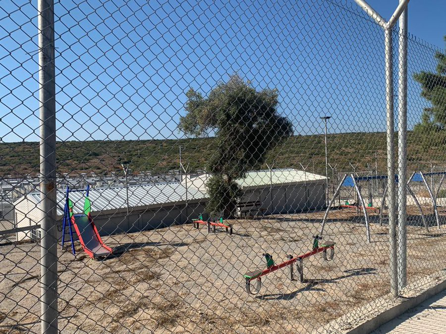
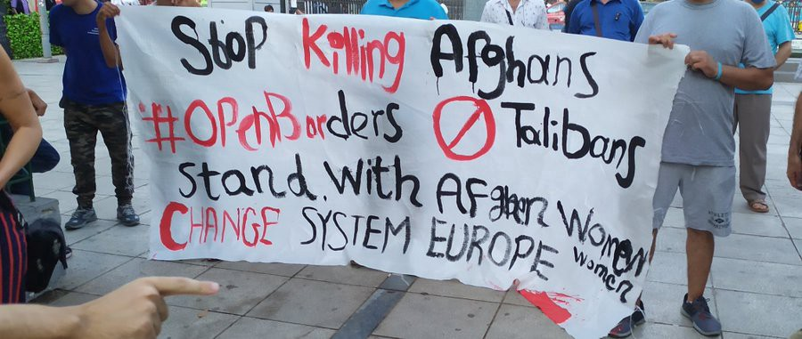

### AYS Digest 16\.09\.21: Greece’s Hostile Environment

[Are You Syrious?](?source=post_page-----a3cc76c97f0c--------------------------------)

[Sep 17](ays-digest-17-09-21-greeces-hostile-environment-a3cc76c97f0c?source=post_page-----a3cc76c97f0c--------------------------------) · 7 min read

_No new camps in Pakistan for Afghanis / 45 people rescued in med / In August 12 people per day died on way to Canaries / Student visas to Italy / Concerns for Afghans in Kosovo / Reports released on UK immigration policy and more…_

\(Photo Credit: [MSF Sea](https://twitter.com/MSF_Sea/status/1438439734628528128?s=20&fbclid=IwAR01leuAFtFHnameKe4dQABz6FumXQR6t0t0Y3Wn_2kQ65K-KCWGnFFxVqc) \. Would you like your child to grow and play behind barbed wires? No one would\. Yet, this is how child refugees will be trapped soon in the new [\#EU](https://twitter.com/hashtag/EU?src=hashtag_click) funded center in [\#Samos](https://twitter.com/hashtag/Samos?src=hashtag_click) , [\#Greece](https://twitter.com/hashtag/Greece?src=hashtag_click) \. Their only crime? Seeking safety\. \)

**FEATURED: GREECE’S HOSTILE ENVIRONMENT**

As many EU countries publicly welcome Afghan people displaced and forced to flee due to the Taliban takeover, Greece ramps up it’s anti immigration rhetoric with full support of the EU Commission\. The government campaign is taking several forms — from trying to convince Afghanis not to come to Greece with [advertising campaigns in Afghan newspapers](https://twitter.com/TihomirSabchev/status/1438533055031959556?s=20&fbclid=IwAR2dlwCEWdaBZKn17cigzctVc5Yz2Dpuc0LHgYdTkcjdvvoYeIjXMTuZt9g) to more broadly targeting people on the move through exclusionary policies of containment\.

\(Photo Credit: [@MigrantsSoli](https://twitter.com/MigrantsSoli/status/1438542656519483394?s=19&fbclid=IwAR0GDdc3FMR-ebFLI-vSPRsDy96Nlx7O3IGyDTVYvihowS-V0IEC23_YTPE) \. Protest in Viktoria Square, Athens, 16\.9\.21\)

This week the government revealed a [73,000 Euro payment](https://twitter.com/maledictus/status/1438467865787707393?fbclid=IwAR21Pw0MDhfQQsLkE8EB_8qrzHpopdkOPl3_v6JYQAntErC6j713ZNKRwGA) to a private company to produce a campaign to prevent Afghani people making the journey to Greece\. Their international campaign against migration is [75% funded by the EU](https://twitter.com/g_christides/status/1438543664318386180?s=20&fbclid=IwAR1irYJZzpwJHVHNWYGy5IaOaM8G5uShwaLOZkNAHTbOIzUjKE8ZoEnz-oA) \(of course\) \. Even if people do attempt to reach Greece both the land and sea borders are increasingly dangerous\.

> _While trying to cross the border into Greece, people encounter the Greek military, [Frontex](https://www.dw.com/de/frontex-verst%C3%A4rkt-litauens-grenzschutz-an-der-grenze-zu-belarus/a-58243786) employees, unidentified masked men, unofficial prisons and so on\. All these elements go hand in hand to enforce a very well\-developed and systematic [pushback](https://www.dw.com/de/amnesty-wirft-griechenland-push-back-politik-vor/a-58008822) regime in which people fleeing are repeatedly pushed back across the border into Turkey\. — [Hope Barker of BVMN interviewed by DW\.](https://www.dw.com/de/griechenland-fl%C3%BCchtlinge-abwehren-um-jeden-preis/a-59198493?fbclid=IwAR21Pw0MDhfQQsLkE8EB_8qrzHpopdkOPl3_v6JYQAntErC6j713ZNKRwGA)_ 

But their use of anti\-immigration rhetoric is almost as dangerous as the physical barriers they put in place\. [While continuing to deny that pushbacks are happenin](https://twitter.com/lk2015r/status/1438414476940877829?s=20&fbclid=IwAR28zAp9xBfIF1rrzOcdEwPl67ji1zzFtsCTiE_6WWuVLLRbvc3WXDDawvQ) g they accuse anyone who disagrees with their methods of being funded by ‘smuggling networks,’ allowing no room for dissent or discussion\. Government appointments also show a clear trajectory towards the extreme right as [Thanos Plevris, the new health minister](https://www.vice.com/en/article/7kv3za/its-ok-to-want-to-exterminate-people-greeces-new-health-minister-once-argued) , in known to have previously argued in court that calling for Auschwitz to reopen was not incitement, also previously suggested that migrants [at the border with Turkey](https://www.vice.com/en/article/5dmkjq/thousands-of-syrians-are-trying-to-storm-the-border-into-greece-and-its-getting-deadly) should be shot\.

In a particularly concerning incident, [a member of parliament for the ruling new Democracy Party, Konstantinos Bogdanos](https://www.keeptalkinggreece.com/2021/09/16/nd-mp-expel-migrants-children/) , tweeted a list of children’s names from a local kindergarten\. They were mainly children on the move and retweet was from an extreme right wing website\. The minister has since called this a mistake and there are no plans to remove him from office\. The opposition party, SYRIZA, has called for his dismissal as the tweet targeted children and incited violence against them\.

This systemic violence continues despite [an 80% drop in the numbers](https://www.ansamed.info/ansamed/it/notizie/rubriche/cronaca/2021/09/16/migranti-in-grecia-crollo-verticale-degli-arrivi-in-un-anno_73492af9-e1cb-42a9-a78d-4d5d5642026c.html?fbclid=IwAR1bl2UdSMoYbj08qthbW7KnO-SzpDm9oVHB7YZ2ptyeVFA_1zcEdYwi89o) of those hosted in island hotspots in the last year, and a decrease of 49% for the mainland structures during the same time period\. Pushbacks mean that arrivals to the Aegean islands have fallen by as much as 78%\.

Meanwhile, walls and fences continue to put up around the remaining camps throughout Greece\. In recent [parliamentary questions](https://www.europarl.europa.eu/doceo/document/E-9-2021-003592_EN.html) regarding their specifications and the reasons for their construction, Ms Johansson on behalf of the European Commission, made their stance clear\. They focussed on the fire safety regulations, five metre distance between the fence and the nearest container, and building materials\. They did not see fit to mention their prison like nature, concerns over movement restrictions and containments, or the effect on people’s mental health as they watch these walls built up around them\. The diabolical standard of living conditions, nor the fact that people have now been forced to stay in these government run structures or face losing their cash assistance, were also not brought up\. Silence on behalf of the EU is complicity\.

PAKISTAN
### No camps in Pakistan for Afghanis

[Foreign Minister Shah Mahmood Qureshi](https://www.brecorder.com/news/40120523/qureshi-says-no-refugee-camps-being-set-up-for-people-from-afghanistan) , in an interview with the Independent, rejected the claim that refugee camps or resettlement processing facilities will be built on Pakistani soil for people coming from Afghanistan\. Instead he will allow Afghani people with the correct documents to pass through the country while en route to their destination\. Pakistan has been hosting over 3 million people in the move for many years\.

SEA
### 45 people rescued

[45 people](https://twitter.com/alarm_phone/status/1438536201376575495?s=20&fbclid=IwAR1fw-9YfTuqFIjTMr3V9vgMJ2uhSeRDlNN_wQNvdcQTVLkZNuQ_XQ31FaM) are thought to have been rescued by the Italian Coast Guard and taken to Lampedusa\.
### Award for Sea Rescue
### Remembering to be cautious over numbers of reported deaths at Sea

SPAIN
### Canary islands call for support

[The Deputy Minister of the Presidency of the Government of the Canary Islands](https://www.eldiario.es/canariasahora/migraciones/canarias-espera-aumento-llegada-migrantes-otono-pide-gobierno-central-acuerdo-atender-menores_1_8310304.html?fbclid=IwAR3zNUS4Ym1HiNGiRDwxPD_XQ6sWQxgej6thRYVbAUApfRVv2jOO-C3EHEo) , Antonio Olivera, has stated that the Islands are more prepared than last year to provide reception facilities, but is concerned about their ability to care for children on the move\. Arrivals so far in 2021, 11,060 people, are 117% higher than in 2020\. Deaths at sea have also increased drastically, in August alone, [at least 379 people died](https://www.infomigrants.net/en/post/35093/hundreds-rescued-trying-to-reach-spains-canary-islands?fbclid=IwAR0hN5hxXU7vWd_l15beWE_lSMuk_PlXGELEUi7_B23SjOhBrwjm12MXLmE) on the Canary Islands route, which equals 12 deaths per day\. Yet, EU border policies continue to lead desperate people to pay up to [6000 euro](https://cadenaser.com/programa/2021/09/16/hoy_por_hoy/1631778400_120845.html?ssm=tw&fbclid=IwAR0456rkETQm_T9tZWRVGoxv-HDzkfI5I48x_md-lFw5ij6A2lU5MqYza4w) in order to reach safety despite the risks\.

[The president of Tenerife](https://www.europapress.es/islas-canarias/noticia-cabildo-lanza-servicio-atencion-migrantes-traves-sinpromi-tenerife-isla-solidaria-20210916174613.html?fbclid=IwAR0hN5hxXU7vWd_l15beWE_lSMuk_PlXGELEUi7_B23SjOhBrwjm12MXLmE) has called for greater solidarity and inclusion of new arrivals while condemning xenophobic discourses\. [While on Lanzarote they have run out of reception space\.](https://cadenaser.com/emisora/2021/09/16/ser_lanzarote/1631792997_985490.html?fbclid=IwAR0d8Zi_8o5EqX_3caLJEdh2Ovoguj2hei7-GU-ODqxXYSm4ZE29lK1Z1Xk) The last 90 people to arrive on Thursday are being held in the old commercial pier of Arrecife\. There are five children and two new\-borns with the group\.

ITALY
### Student Visa Pathways

[37 refugee students](https://twitter.com/TihomirSabchev/status/1438537243266850825?s=20&fbclid=IwAR1ZkGqF-4_c1l3hnUIbs_8Gawiu0V3s5iba4lSqbLzk6eFAw8xzXIXC3z4) arrived from Ethiopia to Italy to continue their studies in 23 Italian universities\. In the next days 8 more will join them through [UNICORE — University Corridors for Refugees project](https://www.unhcr.org/it/notizie-storie/comunicati-stampa/arrivati-in-italia-i-rifugiati-vincitori-di-borse-di-studio-dei-corridoi-universitari/) \. This scholarship programme takes students fleeing persecution in Eritrea, Somalia, Sudan, South Sudan and the Democratic Republic of Congo\.

KOSOVO
### The fate of Afghan people in Kosovo unclear

Approximately [1000 Afghan people](https://kosovotwopointzero.com/en/afghan-evacuees-in-kosovo-de-facto-detained/?fbclid=IwAR3hPno0d1_B1EcCoyrSAyn-aoLH_CmY1aF-_uDOv-e5Aqr4j87nUeRkcUY) have been brought to Kosovo by NATO but little is know of their fate even by large Human Rights Groups like Amnesty\. On arrival they are given temporary protection lasting one year\. During this time they should receive their special “Immigrant visa” to travel to their destination country\.

> _Since arriving, the evacuees have been housed at two camps referred to as Camp Bechtel and Camp Liya, located on the premises of the Bechtel Enka company and inside the U\.S\. military base Bondsteel\. NATO’s international command is running Camp Bechtel and the U\.S\. is running Camp Liya inside Bondsteel\._ 

And it seems that they are not able to travel outside until they are relocated\. The first group of 117 “NATO\-affiliated” Afghan were evacuated from Camp Bechtel for [the UK](https://twitter.com/UKinKosovo/status/1438484371951038465?s=20) on September 16\.

UK
### 2 Major Reports Released

The [Migration Observatory has published a briefing](https://migrationobservatory.ox.ac.uk/resources/briefings/immigration-detention-in-the-uk/) on immigration detention in the UK on the same day that the Independent Chief Inspector of Borders and Immigration has released their [Annual Report for the period 1 April 2020 to 31 March 2021](https://assets.publishing.service.gov.uk/government/uploads/system/uploads/attachment_data/file/1017995/ICIBI_Annual_Report_for_the_period_1_April_2020_to_31_March_2021_Standard.pdf?fbclid=IwAR3hPno0d1_B1EcCoyrSAyn-aoLH_CmY1aF-_uDOv-e5Aqr4j87nUeRkcUY) \.

Both are damning of the Home Office’s immigration policies yet despite these broadly held concerns Home secretary, Priti Patel, did not have a single meeting with David Bolt, independent chief inspector of borders & immigration, during 2020–21\.

EU and FRONTEX
### 25 human rights organisations issue joint statement

Ahead of the European Union Relocation Forum in early October, 25 human rights organisations issued a [joint statement](https://www.amnesty.it/lunione-europea-non-puo-sottrarsi-alle-proprie-responsabilita-nei-confronti-degli-afgani-che-necessitano-di-protezione-internazionale/?fbclid=IwAR1wTrX2ciC6WCqA8J8CNNzvwUrCsYQTQE8cPY4xKu_rsaAuRSnTZHJQl9o) in regards to protection measures for Afghani people calling for safe pathways and condemning thealarmist and misleading rhetoric of some European leaders:

> _1\.Make concrete commitments for a significant increase in the refugee relocation scheme during the upcoming Relocation Forum_ 

> _2\.Leverage all possibilities to ensure the urgent access of Afghan refugees to protection_ 

> _3\.Strengthen access to fair and comprehensive asylum procedures for Afghans and people of other nationalities in Europe, fostering their inclusion, integration and participation in society\._ 

18 million people — almost half of Afghanistan’s population — are currently in urgent need of humanitarian assistance\.

Perhaps the EU should take some inspiration from Canada…
### Frontex Firearm Tender Discontinued

The tender for Semi\-automatic Pistols, Ammunition and Accessories for Frontex has been discontinued, the question remain as to why\.

Meanwhile a private Portuguese company are equipping drones with [deployable life raft](https://twitter.com/matthimon/status/1438445444477116417?s=20&fbclid=IwAR3QGbWjoD4vUVgDSs_KN2NJiyQ9AxEMDEhiiPgX_Jj73xQHtTInyMaU00o) \. Some have suggested these new drones will be used as a further tool in [returning people to Libya](https://twitter.com/matthimon/status/1438445448461701121?s=20&fbclid=IwAR0uGrOVyTxW72HuLg2M8peluHL6RTp3Tmq-yla4E4RK1KmvukBu0l6kc7A) \.

WORTH READING

[Border Violence Monitoring Network Submission to the Committee on the Rights of the Child](https://www.borderviolence.eu/submission-to-the-un-committee-on-the-rights-of-the-child/?fbclid=IwAR3kmTDkbgCsXjVIPJr0PZiZT8zXrzEI6625X276RBc2y7ln0vDp0o0cCrY) — Key points — Pushbacks disrupting intact families through separation and death, Death to family members, Torture, trauma and the inability to fulfil familial care responsibilities, Subsequent long\-lasting impacts, including trauma and PTSD, Identification of unaccompanied or separated children and access to procedure, Use of extra legal detention of minors during pushbacks\.

New [ECRE press review](https://mailchi.mp/ecre/ecre-press-review-16092021) — Recent International and EU developments\.

[Updating the global refugee regime](https://english.alaraby.co.uk/opinion/updating-global-refugee-regime?fbclid=IwAR3pkjq-6p8w0T2y6xxvl2EBUmbahZQ2hzMlJfvyE1JCYSOzDiUn-1IFKRw) — “The crisis in Afghanistan, like recent crises elsewhere, has exposed weaknesses within the global system governing refugees\. The international community should amend it in at least four ways, writes Sinan Ülgen\.”

[The Turkish wall built to keep out refugees from Afghanistan](https://www.ft.com/content/49d85b11-4bbe-4518-b6d8-d532e30c373c?fbclid=IwAR11Gx3nE_OUyok3z6ZAUbUyUP989AZFNKCBj8P3fykvDkJhchCqYiTSYrw) — “After fleeing Afghanistan, Hamit, his wife and one\-year\-old daughter faced mountains, thieves and finally a concrete wall built to keep them and other refugees out of Turkey and ultimately Europe\.”

WORTH WATCHING

[Video of working conditions](https://www.youtube.com/watch?v=6v01jgO7Ddc) in sweat shops in Turkey whose worker are [currently striking](https://twitter.com/ErcmentAkdeniz/status/1438566011406536707?s=20&fbclid=IwAR3IgtRgbRYJk0BrTbuyD2biTfP0uDA1a_qaGsdIOTHWxS6tXuY1jsGpFrI) \. In Turkish\.

[The Cruel Sea: The Mission to Save Lives on the Mediterranean](https://www.youtube.com/watch?v=6ncgXVFfmSc) by Foreign Correspondent\. In English\.

WORTH ATTENDING

[Shedia Cafe, Athens, is hosting ‘Caesura’](https://www.ekathimerini.com/culture/1167953/from-the-life-raft-refugee-images-find-fitting-home/?fbclid=IwAR3CuydtXuVGKIr2eMsZBU0h-rHxhYxsRuZen1ZYgOGdtTYTcLcWLwAV2n0) , a collection of images exploring the transitory state of the people who crossed into Europe from Turkey, fleeing conflicts in the Middle East and beyond\.

**Find daily updates and special reports on our [Medium page](https://medium.com/are-you-syrious) \.**

**If you wish to contribute, either by writing a report or a story, or by joining the info gathering team, please let us know\.**

**We strive to echo correct news from the ground through collaboration and fairness\. Every effort has been made to credit organisations and individuals with regard to the supply of information, video, and photo material \(in cases where the source wanted to be accredited\) \. Please notify us regarding corrections\.**

**If there’s anything you want to share or comment, contact us through Facebook, Twitter or write to: areyousyrious@gmail\.com**
### [Are You Syrious?](/are-you-syrious?source=post_sidebar--------------------------post_sidebar-----------)

Daily news digests from the field, mainly for volunteers…

Following

_Converted [Medium Post](https://medium.com/are-you-syrious/ays-digest-16-09-21-greeces-hostile-environment-c70273f2cb5) by [ZMediumToMarkdown](https://github.com/ZhgChgLi/ZMediumToMarkdown)._
