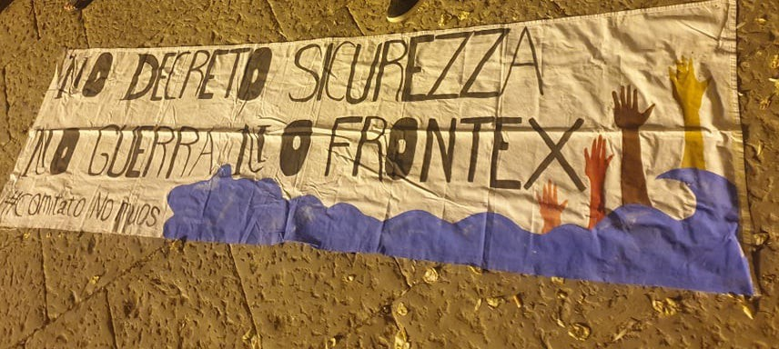
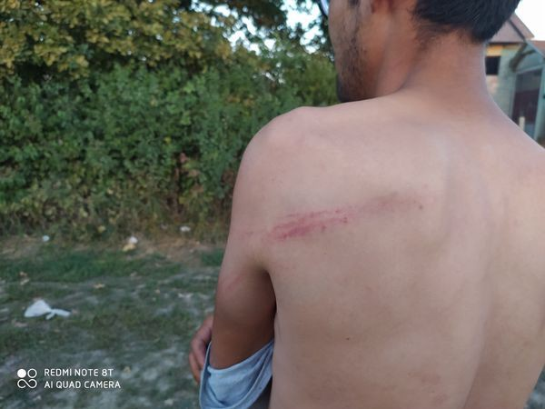
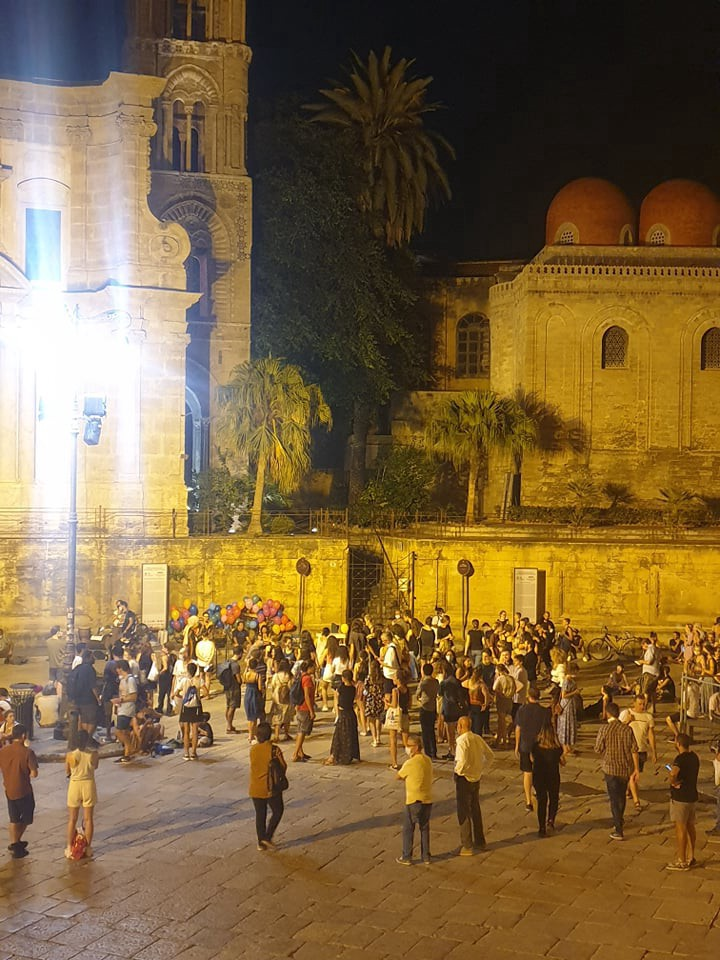
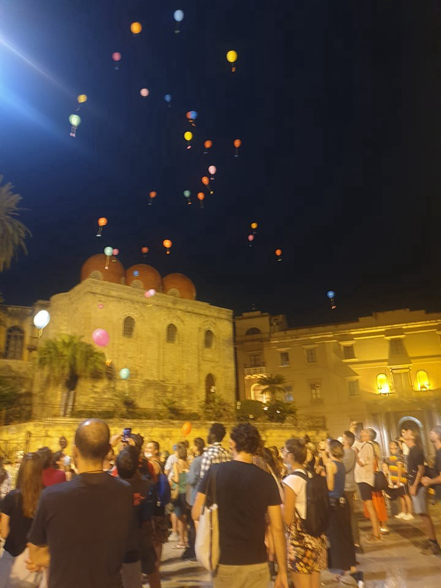

### AYS Daily Digest 17/9/21: Old suffering in a new camp, while Frontex steps up their securitization game
### Voices against the new Samos camp / On the possible dangers of new technologies about to be put in use / Individual stories of people on the move / Sights from border areas in BiH / Denmark and UK put pressure on women and mothers / Recommended media coverage of what has been reported from the ground & other news

[Are You Syrious?](?source=post_page-----8604b2f205c--------------------------------)

[Sep 18](ays-daily-digest-17-9-21-old-suffering-in-a-new-camp-while-frontex-tops-up-their-securitization-8604b2f205c?source=post_page-----8604b2f205c--------------------------------) · 12 min read

One of the banners at the CommemorAction held in Palermo by activists from different places \(Photo: AYS\)

**Two leading drone manufacturers report readiness to equip their aircraft with life rafts\. These can be dropped with pinpoint accuracy over a maritime emergency\. But perhaps this would also encourage violations of the Geneva Refugee Convention,** Matthias Monroy writes, covering the latest development in the securitization \(obsession\) mission of the EU, made possible through the, sadly uninterrupted and poorly evaluated, work of the Frontex agency\.

With the help of on\-board computers, the system calculates the optimal drop point\. The rescue device is to be placed at a sufficient distance from the emergency at sea so that those affected are not put at additional risk, it is [reported](https://digit.site36.net/2021/09/17/new-unmanned-capabilities-when-will-the-eu-use-drones-for-practical-sea-rescue/?fbclid=IwAR2FGLLKFx_Tgc55NuWr3AJ-fOTGjmDgSwG0slPqUeFQrRUiL1tY_EaEam0) \. It is, however, still unclear which countries will be receiving this equipment, how it will be used and whether it will remain within the announced framework of SAR activities, or rather be used to uphold the pullback and pushback practices by the criminal collaborative networks, as in the case of the so\-called Coast Guard operations of Libya, for example\.

In the meantime, Frontex director Leggieri is continuing his tours around Europe, promoting the resurged issue of the danger of “hybrid attacks”, [offering](https://twitter.com/Frontex/status/1438844843057422338?fbclid=IwAR3xTQNqK6GvmP9uYd1pK_OsyBjyAoRkY_yHthX2sqNcSI2FekOtQdvlPII) Lithuania full support at the border as the situation with people on the move arriving from Belarus develops\.

At the same time, the Slovenian Presidency of the Council is planning to accelerate negotiations on a vast expansion of the Eurodac database, which will hold sensitive data on millions of asylum seekers and migrants in an irregular situation, by ‘delinking’ the proposed rules from the other EU asylum and migration laws under discussion, Statewatch [reports](https://www.statewatch.org/news/2021/september/eu-eurodac-council-seeks-swift-agreement-on-expanded-migrant-biometric-database/?fbclid=IwAR3m_5VDqwqOLSeSh0xcldlJ-K41UsWAbtVoxIXA7XX8fyqjyr9QHaQ0ZqU) \.

> _Under the new Eurodac rules, records held in the system could also be linked, making it possible to track peoples’ journeys within the EU \(known in official discourse as “secondary movements”\), and the data held would also be used for [checks against visa and travel authorisation applications](https://www.statewatch.org/automatedsuspicion) \._ 

> _Some of the data gathered under the Eurodac rules would be held in the new ‘Common Identity Repository’, a vast biometric database that will be able to hold up to 300 million individual records on non\-EU nationals, [currently under construction in accordance with the EU’s ‘interoperability’ initiative](https://www.statewatch.org/publications/reports-and-books/data-protection-immigration-enforcement-and-fundamental-rights-what-the-eu-s-regulations-on-interoperability-mean-for-people-with-irregular-status/) \._ 

### SEARCH AND RESCUE AT SEA

In Italy, it is [reported](https://www.rainews.it/dl/rainews/articoli/lampedusa-migranti-hotspot-4bd981d4-e09f-49a8-92e7-1346c17bd532.html?fbclid=IwAR0xuQW9Mrz31Df2tIHmKj5sawcRAZ4n7ae6Ft8fHD1DfcSijSc8QCZqdBw&refresh_ce) that 108 people arrived in three disembarkations, with 880 people now present at the hotspot of Lampedusa\. One of the groups \(27 people, of whom 14 women and three minors\) have been blocked 34 miles off the coast before they were eventually placed at the hotspot\.
### SLOVENIA
### They were attacking us one by one

by [No Name Kitchen](https://www.facebook.com/NoNameKitchenBelgrade/?__cft__[0]=AZXbi80JiTwSqZ3LMvyOrvRHpadlywLISLnLdKjMnXNweEri6cW_rulOwKfOn1zHskp--Th8209MXybMvljpLqV1yqTMBqpPDzol_vTOUndzw-9-xKvNcbwqAB0kLzUlmPiRqsqTJp7O60liM_k_rbtvvYUJFfaohMxcPE7I0GCH_gzo3XSmul2eKKqxfRYvPNJe8EyxbshYVLBWGo6zzjJd&__tn__=-UC*F)

NNK has published one of the many life stories of people on the move who are currently experiencing torture and \(not only\) border violence in the EU — “Mohammad is 25 years old and from Afghanistan\. He left his country four years ago, since he was working for the Afghan army as a taxi driver and for this reason started to be threatened by the Taliban and feared for his own security and /that/ of his family\.
He started his long trip going through Afghanistan, Iran, Turkey, Greece, Montenegro, Serbia and Bosnia\-Herzegovina\. According to what he told us, he arrived here in Velika Kladusa around one month ago and, as he told us, almost directly “went on game” — the attempt to reach some European countries by crossing borders, walking through forests or swimming deadly rivers due to the lack of safe and legal pathways, trying to cross the Bosnian, Croatian and Slovenian borders on foot to finally reach Italy\.
As he said, he was pushed back on Wednesday, 15 September, after 22–23 days of walking through the mountains, hills and forests that stretch across these countries\. As Mohammad told us, he was 10 kilometers away from the Italian\-Slovenian border when two Slovenian policemen saw and stopped him and his group\. They were brought to the police station in Slovenia where they were forced to give their fingerprints\. This means that if they reach or want to ask for asylum in a different country, they’ll risk — due to the Dublin Regulation — being deported back to Slovenia, which usually denies the right to start the procedure of asylum seeking, but deports people to Croatia, which again pushes people back to Bosnia or Serbia, outside of the EU\.
Mohammad and his group were transferred to a Slovenian camp and spent the night there\. As he told us, the day after the Slovenian police took them to the border with Croatia where they were handed over — together with all their possessions in a bag — to the Croatian police\. As Mohammed said, they waited inside the police car for around four hours for other PoM \(People on the Move\) to be brought into the car and then were driven to the border with Bosnia\. When they arrived at the border, Mohammad and the group of PoM were ordered to get out of the car and to take off their shoes, jumpers and jackets\. Then the Croatian police officers started to beat Mohammad, his friends and the other PoM \(in total 10 people\) one by one\. As he says, they were beating every person with their police baton for around 5–7 minutes each, hitting /them/ in the back, the arms, the legs\. The policemen were screaming in English and threatened /them, telling them/ not to come back to their country and to quickly go back to Velika Kladusa\. On the other side of the border \(inside Bosnia\) were two other Croatian policemen already waiting, one with a stick and another with a dog, to beat and attack them even more\.
One by one they came back to the place they had left around 22–23 days ago, which they hoped not to see again\. Mohammad was separated, once in Bosnia, from one of his friends due to such severe injuries from the beating on the feet that he needed to go to the Sarajevo camp to be treated and to recover\.
Nevertheless, when we met him one day after the violent pushback and the hard walk, he was strong enough and so kind to help during all the afternoon building the tents that were meant as a shelter for his group and another seven families that were pushed back the same day\. Moreover, he was able to tell and give details of the long game he did and the brutal verbal, psychological and physical violence he and his friends faced\.
How much sweetness and endurance he showed while preparing some Afghani sweets, he confided that he would have moved from Velika Kladusa to another part of the border to try a different game, strong in his decision and his right to move to a different country to find work to sustain his family and a place to feel safe, after many years of fears and uncertainties\.”
### GREECE
### Voices against the new camp on Samos

As the new camp on Samos opens and treatment of people very likely remains the same, the suffering continues in a new facility, an idea that many are opposing, though from different perspectives, positions and for different reasons\. Whom do the system fortifications work for, then?

MSF has issued an opinion that clearly states the failure to change — anything\.
### [We can only help refugees to survive new camp on Greek island \| MSF](https://www.msf.org/we-can-only-help-refugees-survive-new-camp-greek-island)
### [Tomorrow, the European Union and the Greek government will open a new centre for asylum seekers in a remote location…](https://www.msf.org/we-can-only-help-refugees-survive-new-camp-greek-island)

[www\.msf\.org](https://www.msf.org/we-can-only-help-refugees-survive-new-camp-greek-island)

Europe Must Act also [decried the new camp and called for it to close](https://www.facebook.com/europemustact/posts/374765834136117), and a collective group of activists and organizations are staging a protest against the opening of the new camp (https://twitter.com/AdvocacySamos/status/1438801738014863369?fbclid=IwAR30tRy_LZ5jTpuRYm6RUeo97BvhrzSJHrhGqssF3i8vtNz_B9DIvvIP6m8) , citing its isolation from the rest of the area and the restrictions it will put on residents’ freedom of movement to access services or exit the area for work or leisure\. 
A reporter visiting the camp [drew attention anew to its distance](https://www.medico.de/en/a-place-in-the-middle-of-nowhere-18360?fbclid=IwAR37gHk0xeLxmCjZk0pICrM62z4jg3Cn7S5y99rVSnoCBUSKvQSUiCMRJVA) from everything else on the island and the undignified state it appears built to enforce\.

At the same time, the mayor of East Samos, George Stantzos, and members of his local government have put out a [joint statement stating their clear disapproval](https://samosvoice.gr/2021/09/16/%ce%b3-%cf%83%cf%84%ce%ac%ce%bd%cf%84%ce%b6%ce%bf%cf%82-%ce%b4%ce%b5%ce%bd-%ce%b8%ce%b1-%cf%80%ce%ac%ce%bc%ce%b5-%cf%83%cf%84%ce%b1-%ce%b5%ce%b3%ce%ba%ce%b1%ce%af%ce%bd%ce%b9%ce%b1/?fbclid=IwAR2RTwAA3LZSlJNUFspjQb4quLzV-MQ-dMLhLSJbe6vdNbdvnVSJDR7354g) of the new camp being opened in Zervos and, as very much expected, calling for more restrictions on migration\.
### Grant residence permits\!

Stand by me Lesvos and Medico International are [calling for Greece to grant immediate residence permits to all asylum seekers](https://www.medico.de/en/recognition-and-admission-now-18350?fbclid=IwAR1PDzVRAZXE8O1rfCZAgu32ruQmMMVDqEmPmJwmRl-d8lfpHCbd9taa4P4) currently within its borders, and for Europe as a whole to work with Greece to accept groups of refugees to their own cities more readily and efficiently in the name of human rights and human dignity\.

In 2020, the Ministry of the Interior set new criteria for the continued employment of those who work as custodians in municipal schools, requiring them to present documentation of Greek language proficiency if they are not citizens, as opposed to the former requirement of a high school diploma\. Dozens of school custodians are now facing unemployment, some having spent more than two decades working in their roles, because they cannot provide proof of language capacity, and they stood in front of the building of the Ministry of the Interior until it was agreed that Makis Voridis would meet with them on Thursday 23rd \(https://www\.efsyn\.gr/ellada/koinonia/310728\_skoypa\-kai\-farasi\-ratsismos\-kai\-ypokrisia\) \.

A [73,532 Euros **campaign**](https://www.keeptalkinggreece.com/2021/09/17/greece-launches-international-campaign-against-afghan-migration-with-eu-funding/) **with the goal of deterring Afghan civilians from fleeing to Greece** through concentrated messaging on social media and in Afghan newspapers, financed at 75% with funding from the Asylum, Immigration and Integration Fund of the European Union, has selected a Greek company to head it\.
### BOSNIA AND HERZEGOVINA
### Images from Velika Kladusa

A [video](http://youtube.com/watch?v=Ycmtv8Dt9Jo) local volunteers published shows the current situation in the area around Velika Kladusa in the border region of Bosnia and Herzegovina with Croatia, under which they explain:

“Several hundreds of people, by and large families from Afghanistan, have found a temporary shelter in a makeshift camp in Velika Kladusa\. Most of the people arrived in Bosnia and Herzegovina over the last couple of months\. Some were living for a long time in Greece, and not being able to obtain a regular status or at least a chance to start some kind of normal life, they left and started their journey towards other parts of the EU\. On the way, they got stuck in Bosnia and Herzegovina\. Their attempts to cross the borders with the EU are prevented by the violence of the border guards\. Each person in this makeshift camp was pushed back from the EU border at least once\. In Kladusa, they get little help\. Local people are trying to provide support, but after so many years of assisting tens of thousands of people who passed through this area, it is becoming harder and harder\. International organisations that are supposed to help the state to provide adequate protection, accommodation and assistance to people on the move in Bosnia and Herzegovina, are — in general — more interested in finding ways to stop them from moving further on towards the EU than anything else \(except in donations\) \. They do that while strengthening the security sector in the country and weakening civil society\. As local activists and refugees are reporting, the IOM and other organisations are coming and visiting this area, mostly observing, and assisting the police when they come to forcefully move people to some of the “temporary reception centres”, places where often not even basic human rights are respected\. People who are removed in this way from these temporary shelters often leave the camps and go back\. The reason is that the camps and the way they are managed in Bosnia are degrading, and rather places that serve the purpose of keeping people away from crossing the borders than providing humanitarian assistance\. Soon, IOM and local authorities, as well as state authorities, will start moving people to the camp Lipa, a faraway location, with no regular electricity and water supply, no infrastructure needed for any kind of normal life, no public transport, no possibility for children to go to schools, far away from shops, institutions, and local people\. They will be forced to stay in containers, behind barbed wires, surrounded by security officers\. The winters are harsh in that part of the country but it looks like nobody cares\. It is far away and it will be much harder for people to leave the place\. During the winter almost impossible\. This is a video we received from one of the residents of the camp, showing images of everyday life\. To open the borders is the only solution to this insane situation\. For those who want to stay, even temporarily, access to the asylum system has to be provided, as well as humane and dignified accommodation, that is not a camp\. Everything else will not mean a real, life, change\. “ — Volonteri BiH
### GERMANY
### Drawing drastic attention to the situation in the Mediterranean

An intersectional, anti\-racist and activist collective from Cologne is behind an action that draws attention to the inhumane conditions in the Mediterranean region — A floating coffin in the middle of the Aachen pond\.

No one can draw more drastic attention to the situation of refugees in the Mediterranean region\. 
Around the Aachener Weiher there are [signs that show the death rates of refugees in the Mediterranean in the past 33 months\.](https://l.facebook.com/l.php?u=https%3A%2F%2Fwww.report-k.de%2FKoeln-Nachrichten%2FKoeln-Nachrichten%2FSarg-im-Aachener-Weiher-mit-europaeischer-Flagge-und-Parteilogos-verdeutlicht-Versagen-in-der-Migrationspolitik-149082%3Ffbclid%3DIwAR0FVefukZfKertr3eqLJm9DxiU1dTdl9zt3x8UA_1Q1Wsn3VwfVuKzXkoE&h=AT1m683PCRo5QjG7c5zpJlIJEH0sy-pGdF0RPTI9BqxvHCVvUGr_zlGdYwFfO6uYBs6IugKrdrMMtxM6rzlBODB2MTOb6QIV59kd626z7iSN8--PKdoaxfpE-x9RitQXmA&__tn__=%2CmH-R&c[0]=AT2BsC0gju_gjStS9P4Lsa9gmc5QC1ikksEsZuzn-nemudOh9ztOlD8955NZJG2FWQ-8xQCtnCOGmINdCrlPafe6PsNj2rWhg1FjwwTDfemlBAELefOA0OSzA9oO3IcG5bd_mB7Cdz54Jpd8bcMy-X6JhdHdj9aKl5YrBXMtaKEQGlJsMWRk3nnWUQws16RUsApu3VaIBlOQsk91Wh8)

> _More than 48,000 pictures of people who have contributed significantly to the sealing off borders of Germany and Europe over the last few years, for example through their statements or their voting behaviour, form a large picture that is representative of the inhumane consequences of these years of sealing\-off borders policies\._ 

> _Just like the individual pieces of the mosaic, every decision and every vote of the individual members of parliament in recent years has led to human rights violations at Europe’s external borders on a daily basis\. Politicians and decision\-makers must finally take responsibility, because human rights are [\#nonnegotiable](https://web.facebook.com/hashtag/nonnegotiable?__eep__=6&__cft__[0]=AZWMp0iGdi-nY9F2z92YlZfEDSF-gypDbz8EiiWXNptJLgXHM2nCjJjep1Vdfg2ieGvvHXAXmB70hOhLpvhYB83jP4ocxIEv-lnyFvCBJ2ucpMGkueHpb7O-NGI8FYNrlu2U0NlvD20E7-JY41Th1TrkH-XtIj2H1R5OkEvpjxjYPC_6HG6n8XDRYDCn_0nZc_Q&__tn__=R]-R) \! — Seebrücke writes, saying:_ 

> _Together with Leavenoonebehind and Sea\-Watch, we have made sure that those responsible in the German Bundestag can no longer overlook the consequences of their policies\._ 

### DENMARK
### Second Danish minister to quit over Afghanistan evacuation issues

Defence Minister Ank Bijleveld has stepped down following censure in parliament that also previously prompted the foreign minister to quit\. They were criticised for failing to prepare the safe passage of thousands of Afghans who could have been eligible for asylum in the Netherlands following the Taliban’s takeover, as [reported](https://www.aljazeera.com/news/2021/9/17/second-dutch-minister-resigns-over-afghanistan-evacuation-scandal?fbclid=IwAR2J-LdLp6KQW3Xvd4rkehCrDj6KCj9mwtHqdaA7XixGL13F6ngcYT2By2U) by the media\.
### UK & DENMARK
### Failings or intentional policies against women?

The Danish government intends to make migrant women work at least 37 hours a week to continue receiving welfare benefits, allegedly “to help them assimilate into society” but actually spreading misjudged and discriminatory ideas on refugees and turning rights into privileges you need to earn and deserve, Euro\-Med Human Rights Monitor [reported](https://www.scoop.co.nz/stories/WO2109/S00183/denmarks-forcing-of-refugee-women-to-work-for-welfare-is-soaked-in-misjudgment-and-discrimination.htm?fbclid=IwAR268ndwrZJohKbZbcLhD_RF_l5L779KuDCO0Ng_MM8UB8qPmpywto0wX6I) \. The Danish Prime Minister stated they want to introduce “a new work logic where people have a duty to contribute and be useful, and if they can’t find a regular job, they have to work for their allowance”\.

UK Maternity Action has published a new report containing findings that NHS trusts are wrongfully charging vulnerable migrant women thousands of pounds for maternity visits and sending debt collectors to their homes when they [lack the economic means to pay for them\.](https://www.theguardian.com/society/2021/sep/17/nhs-trusts-wrongly-billing-vulnerable-migrants-for-maternity-care-says-charity?fbclid=IwAR3oc5NcalzJGL1KAfGklSGB08rZ-q6CQ4drfZV-paXQgH5c3gmcD3pYR14)
### [‘Worrying failings’ in the administration of the NHS maternity charging programme](https://maternityaction.org.uk/2021/09/worrying-failings-in-the-administration-of-the-nhs-maternity-charging-programme/)
### [by Catherine Pellegrino, Senior Policy Officer Maternity Action’s new research has found worrying failings in the…](https://maternityaction.org.uk/2021/09/worrying-failings-in-the-administration-of-the-nhs-maternity-charging-programme/)

[maternityaction\.org\.uk](https://maternityaction.org.uk/2021/09/worrying-failings-in-the-administration-of-the-nhs-maternity-charging-programme/)
### SAHARA

Yesterday French president Emmanuel Macron [announced](https://www.vice.com/en/article/bvze3d/leader-of-islamic-state-in-sahara-killed-by-french-drone-strike?fbclid=IwAR02uAr5vsZGqYo-eoKOeRDEPCUUWJOO4x1DIFHT5jos85bUvGC_uui-G6o) (https://www.bbc.com/news/world-africa-58581122?fbclid=IwAR2rK_OZnID5gXxBc5QfTkbyuxk8asLewEh6wOqZfzPmUj-URRcwEVh5VJs) that drone strikes had killed Adnan Abu Walid al\-Sahrawi, a member and leader of the Islamic State in the Sahel\.

Images from a commemoration action that took place in Palermo in the evening, during the transborder convergence in Palermo and Dakar, commemorating the victims of the EU external border policies\. Paying respect to the victims through our daily work is complemented with these symbolic actions that keep us all from forgetting them\.

Photo: AYS
### WORTH READING
- [From Taliban Terror to Beach Resort: A Strange Journey for Some Refugees Albania, which has committed to taking in up to 4,000 refugees from Afghanistan, is housing several hundred in resorts on the Adriatic coast\.](https://l.facebook.com/l.php?u=https%3A%2F%2Fwww.nytimes.com%2F2021%2F09%2F13%2Fworld%2Feurope%2Fafghanistan-refugees-albania.html%3Ffbclid%3DIwAR2TVct2AXZaHbD21EnNDSLm9UF7IsQ-2-YmIUZT6Llv0KI2MyCh9t8W19Q&h=AT0dlgRI1Jx4PjqWYNz5D6FphZUSPLPiE4yhqwKCpffU4WXsehhDT2sYGpaRN2f4P35uKbX2IT2pUKVYxRYK4Txuw7qGE9NBMGYhCzC763kkAjICfGM0wVCj3K7kFfd56sz29cA&__tn__=%2CmH-R&c[0]=AT3kDToLpTB4fcYeZ616MnVdZzaCTv5LTKi18vNUJlOOUiNFWZ3VRBGHob0PbOvydeCmg_d3i9Zt33uNOOLq1QUB2Nffr6PnnWG02mTYLPi4C5dIFS-UnRb5gEmFeJ1M9nNfvTu-Ef8Ag-Udio8MhqJjEUcGftOaCPixuLfXo7NGOPYNPFepl0eW6gxEzEGSnpSq89lf-M2vlUoYjSY)
- A [new Lipa is under construction: with some delay from the scheduled deadlines, it will soon be operational\. The European Union has put up the money for a camp with a larger capacity, from 1,000 to 1,500, which will have water and electricity\.](https://global.ilmanifesto.it/nearly-a-year-after-the-fire-at-europes-doorstep-conditions-remain-miserable-for-refugees/?fbclid=IwAR2L3g6kKDvIILLPQBlYFqmbFh0K0jiMWr1hZjteAKu0LcZDpVBXU_sf4uk)
- [EU approach to refugees and migrants in Greece a ‘total failure,’ says Medecins Sans Frontieres](https://www.brusselstimes.com/news/eu-affairs/184445/eu-approach-to-refugees-and-migrants-in-greece-a-total-failure-says-medecins-sans-frontieres/)

**Find daily updates and special reports on our [Medium page](https://medium.com/are-you-syrious) \.**

**If you wish to contribute, either by writing a report or a story, or by joining the info gathering team, please let us know\.**

**We strive to echo correct news from the ground through collaboration and fairness\. Every effort has been made to credit organisations and individuals with regard to the supply of information, video, and photo material \(in cases where the source wanted to be accredited\) \. Please notify us regarding corrections\.**

**If there’s anything you want to share or comment, contact us through Facebook, Twitter or write to: areyousyrious@gmail\.com**

_Converted [Medium Post](https://medium.com/are-you-syrious/ays-daily-digest-17-9-21-old-suffering-in-a-new-camp-while-frontex-steps-up-their-securitization-82f3854136ae) by [ZMediumToMarkdown](https://github.com/ZhgChgLi/ZMediumToMarkdown)._
