### AYS Special from **Samos: Nobody Is Welcome — A New Hotspot to Keep Refugees Out of Sight, Out of Mind\.**

_“In December 2020, the European Commission and the Greek government published a memorandum of understanding establishing plans for the construction of Multi\-Purpose Reception and Identification Centres \(MPRICs\) to replace the infamous refugee camps on five Greek islands\.”_ \( [Walling Off Welcome](https://reliefweb.int/report/greece/walling-welcome-new-reception-facilities-greece-reinforce-policy-refugee-containment) , 2021\) \.

This is [Samos Advocacy Collective](https://twitter.com/AdvocacySamos#) ’s report on the situation one day after the centre’s inauguration\.

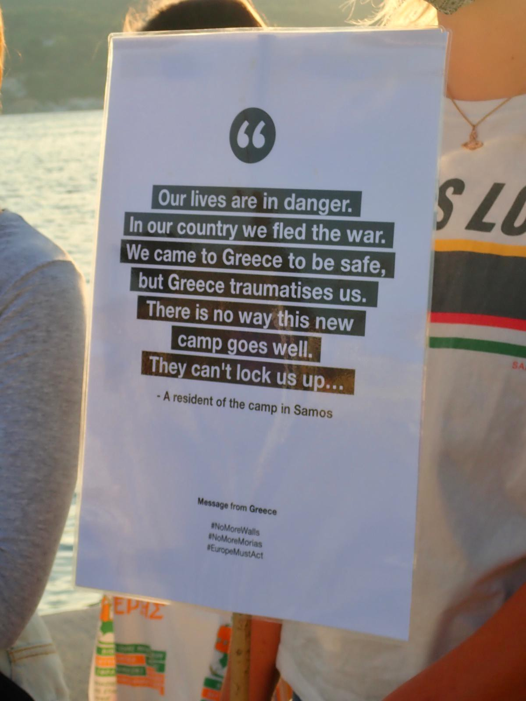

The long\-announced MPRIC was officially inaugurated yesterday, Saturday 18th of September, on Samos — the first of the five Aegean islands where these facilities will become operational\. The Samos MPRIC, [entirely funded by the EU Commission,](https://www.theguardian.com/global-development/2021/mar/29/eu-announces-funding-for-five-new-refugee-camps-on-greek-islands) is located in Zervou, a far\-removed area on the island\. The camp is approximately 7km from Vathy town, the place on the island most of the people seeking asylum are familiar with, and 5km away from Mytilinioi, the closest village to the new facility\. The remote location of the camp also implies that the residents will be isolated from both local communities, external services and solidarity networks\.

In many aspects, the opening of this large\-scale, highly controlled, isolated facility represents a new chapter in EU migration policy\. This policy has been a long\-time in the making — initiated with the 2015 ‘hotspot approach’ and [consolidated in last year’s Migration Pact](https://www.asileproject.eu/the-impact-of-the-new-eu-pact-on-europes-external-borders-the-case-of-greece/) signed by the Von der Leyen Commission\.

This very Commission, under the lead of DG Home Commissioner Ylva Johansson, sponsored and funded the construction of these five ‘super\-structures’ in the Aegean islands, bestowing on Greece [about 250 million Euros](https://www.ekathimerini.com/news/1158076/eu-s-johansson-in-greece-to-inspect-progress-in-building-new-island-camps/) to this purpose\. Being the figurehead of a containment policy on the reception of displaced people that many reckon as unlawful under EU acquis and Asylum Law, the Commissioner has been the [target of many criticisms](https://ecre.org/greece-millions-of-eu-euros-for-fenced-structures-in-the-aegean-preventable-deaths-in-detention-and-pushbacks-dismissed-as-fake-news-by-greece/) in the months since the signing of the [MoU for the construction of the five new hotspots](https://www.statewatch.org/media/1581/eu-com-lesvos-memorandum-1.pdf) \.

Surprisingly enough, Commissioner Johansson was not among the audience that attended the ceremony, together with Greek Migration Ministry Notis Mitarakis and Secretary\-General of Asylum Reception Manos Logothetis\. On her behalf, Deputy Director of Home Affair Beate Gminder, who proudly was tasked with the [raising of the EU flag](https://twitter.com/g_christides/status/1439141498398953476?s=19) at the entrance of the facility where a [large blue sign clearly marked the spot as ‘Closed Controlled Access Center of Samos’](https://twitter.com/AdvocacySamos/status/1439143084449800195?s=19) , was representing the EU during the opening ceremony\.

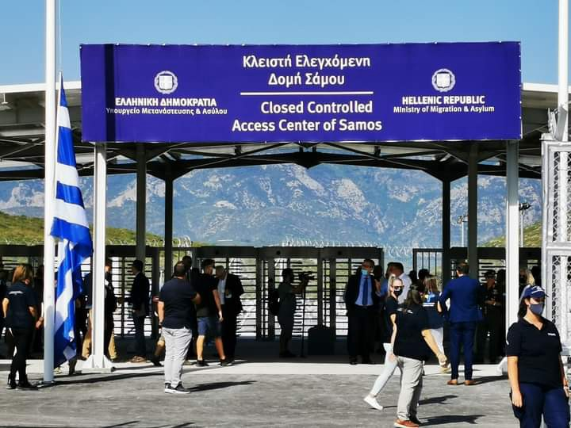

Source: Samos24\.gr
#### **Opposition at the doorstep of the camp**

The festive spirit of the inauguration was perhaps spoiled by the noticeable absence of two central figures of local politics: Mayor of Eastern Samos Georgios Stantzos and Regional Governor of North Aegean Kostas Moutzouris\. Both dismissed the official invitation and expressed stark opposition to the overall project of the Samos MPRIC\.

In the [words of Mayor Stantzos](https://samosvoice.gr/2021/09/16/%ce%b3-%cf%83%cf%84%ce%ac%ce%bd%cf%84%ce%b6%ce%bf%cf%82-%ce%b4%ce%b5%ce%bd-%ce%b8%ce%b1-%cf%80%ce%ac%ce%bc%ce%b5-%cf%83%cf%84%ce%b1-%ce%b5%ce%b3%ce%ba%ce%b1%ce%af%ce%bd%ce%b9%ce%b1/) , the refusal to join the inauguration by the Municipality of Eastern Samos was motivated because such ceremony _‘is not a celebration’_ as he and the local faction he represent ‘ _strongly disagree with the size of the structure’_ \. He further stated that MPRIC exceeds what is tolerable by the local community, and protested that the EU is neglecting its duty to ‘ _preserve above all the rights of its citizens’\._

On a more striking note, Regional Governor Moutzouris declared, in his [official refusal to the Ministry’s invitation](https://www.limnosreport.gr/limnos/181498/ochi-moytzoyri-stis-yperdomes-mitaraki-den-tha-parasto-sta-egkainia-sti-zervoy/) , that the local community ‘ _never agreed on structures imposed by Europeans with a capacity of 300 acres like the one in Zervou and for this reason I will not attend the inauguration\._ ’

Adding on to this widespread discontent was the expected protests from the local opposition, including the municipal party ‘Samos AllaZEI’ who [demanded](https://samosvoice.gr/2021/09/15/%CE%B4%CE%B7%CE%BC%CE%BF%CF%84%CE%B9%CE%BA%CE%BF-%CF%83%CF%85%CE%BC%CE%B2%CE%BF%CF%85%CE%BB%CE%B9%CE%BF/) the Ministry to completely dismantle the camp facility and _‘to return the private lands to the owners’\._ Additionally, Labour Centre Samos — the local Communist Party — [organised a protest](https://samosvoice.gr/2021/09/11/%CF%83%CF%85%CE%B3%CE%BA%CE%AD%CE%BD%CF%84%CF%81%CF%89%CF%83%CE%B7-%CE%BA%CE%B1%CF%84%CE%AC-%CF%84%CE%B7%CF%82-%CE%BB%CE%B5%CE%B9%CF%84%CE%BF%CF%85%CF%81%CE%B3%CE%AF%CE%B1%CF%82-%CF%84%CE%B7%CF%82/) outside of the premises of the camp facility and on the morning of the inauguration\. Together, they voiced out the disapproval of an EU policy that, despite the façade of innovation and change, has [remained unchanged](https://twitter.com/AdvocacySamos/status/1439143523945746435?s=20) across long years of containment and neglect of asylum seekers’ rights\.

Hailing from similar stances, the Pan\-Samian Peace Committee [called for another mobilisation](https://www.samos24.gr/archives/73780) , following the first [demonstration march](https://www.pressenza.com/2021/05/samos-marches-for-peace-and-solidarity/) back in June this year\. In their statement, the group stressed that the construction of this new facility was undoubtedly motivated by reasons of deterrence, rather than humanitarian concerns for the hundreds of residents: a manoeuvre that puts its proponents ‘ _on the verge of violating any rule of international law’\._

> I want to tell you that there has been a very strong opposition to the structures in the last year\. In the municipal councils in all the islands there was a strong reaction, although everyone saw that the situation had changed\. \[…\] I want to say to the citizens of Samos: ‘yes, indeed, Samos will calm down and I think that with the help of the god of time on such a day we will not even discuss the word ‘immigrant’ in our islands’\. _\(Minister of Immigration and Asylum, Notis Mitarakis, [interviewed on Radio Harmony](https://www.samos24.gr/archives/73838) \)_ 

#### **Opposition back in Vathy town**

While [Greek and EU authorities](https://www.facebook.com/24samos/videos/893499314902187) were attempting to concentrate the international media’s attention onto the positive improvements compounded in the camp facility in Zervou, back in Vathy town throughout the weekend, a spontaneous wave of support was speaking against the authorities’ deceit of such ‘closed controlled centre’ as a ‘solution’ to solidarity crisis\.

> First, the new camp is not a camp, it’s a prison\. And then, for example around the new camp there is nothing\. If someone… you want to buy something\. You want to buy food\. You want to cut your hair\. If you want to buy shoes\. If you want to buy a t\-shirt\. I know the refugees they don’t have the money to do all the stuff, but some people keep all the money to buy shoes or to buy a t\-shirt\. If they want to go outside the camp, there is no car, no bus to go to Vathy or to Mitilinii\. So after like 5 km or 3 km from Mitilinii maybe\. I’m not sure, but it’s so far…There is barbed wire all around it\. There is even a deportation and prison camp within the camp, so and I think the island is already some kind of a camp, because it is so remote, so in a way it is like a camp in a camp in a camp\. _\(Future resident of the new MPRIC\)_ 

For two consecutive nights, in the main square of the city, an independent group of individuals — Greek locals, asylum seekers and solidarity workers — [called for a dignified and humane reception](https://twitter.com/AdvocacySamos/status/1439143523945746435?s=20) of people seeking asylum in Europe\.

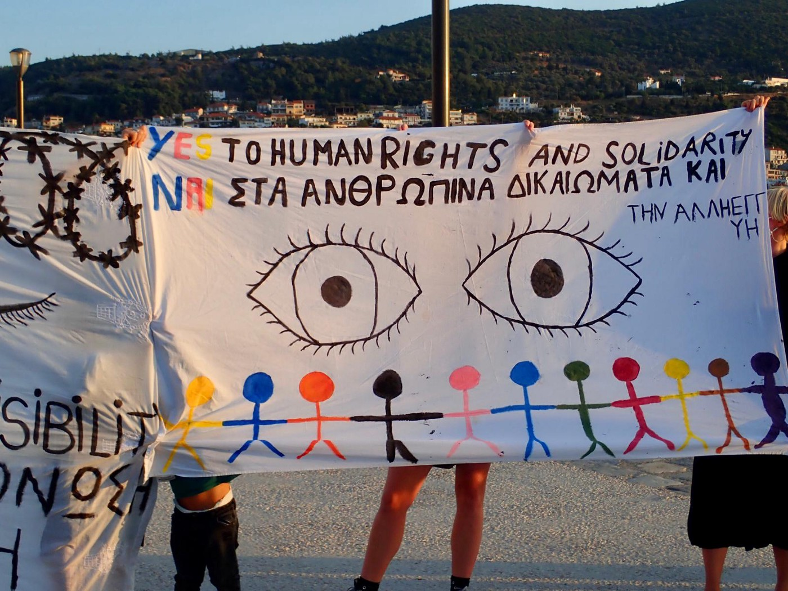

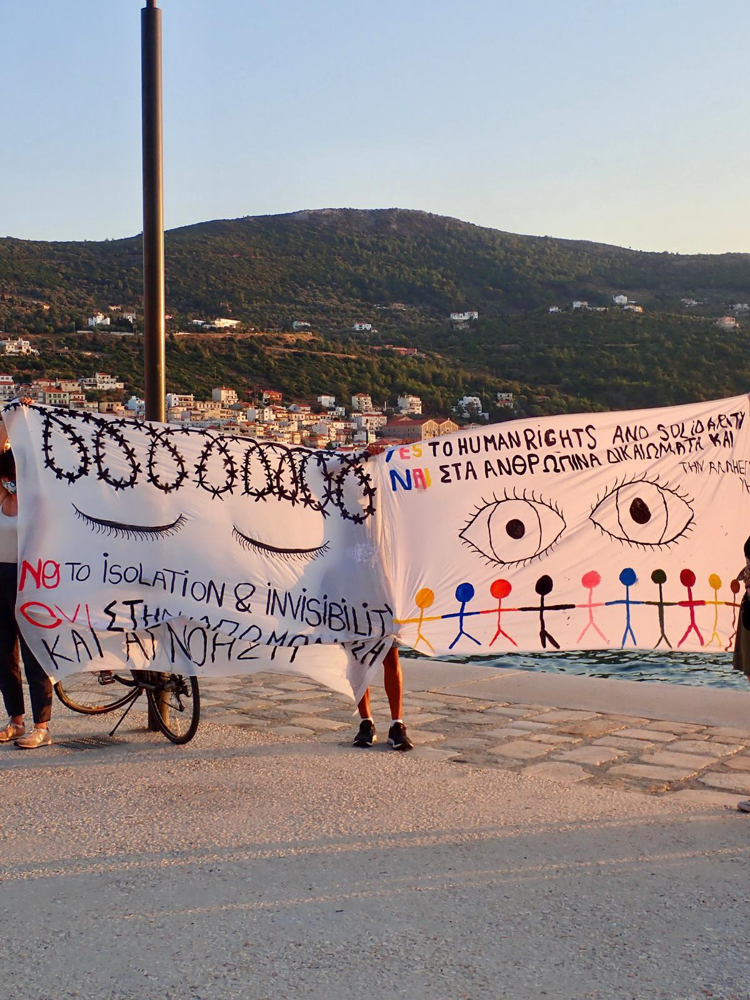

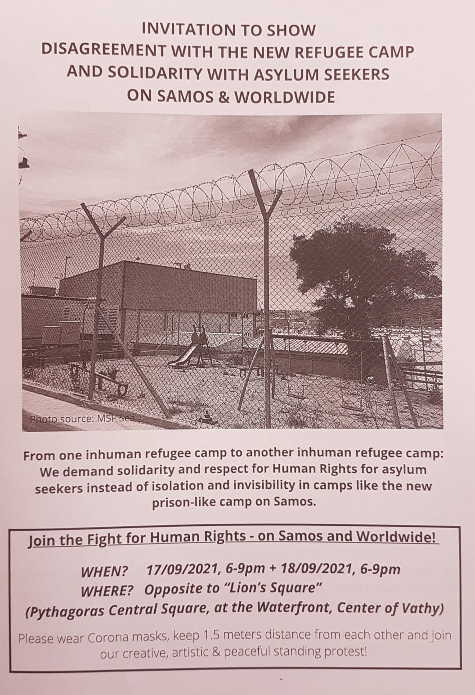

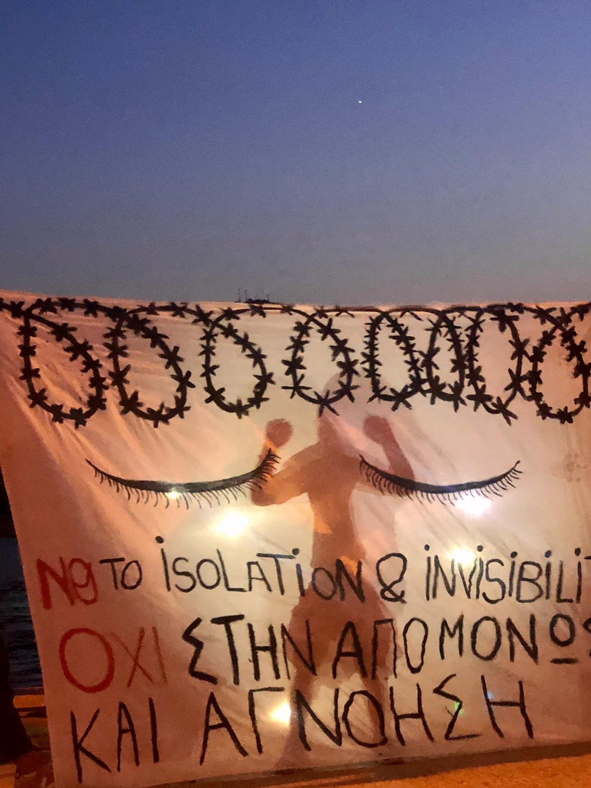

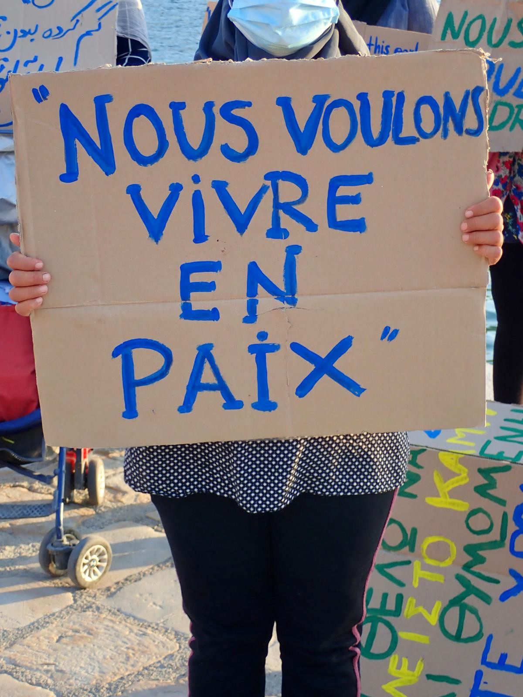

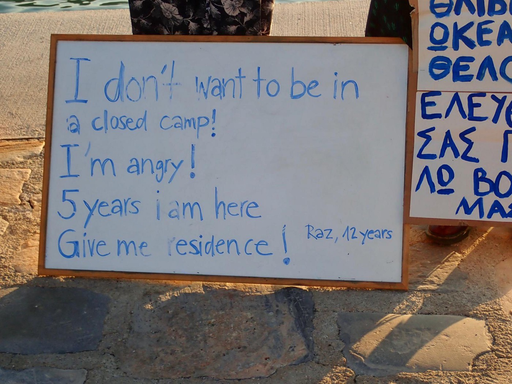

A [second day of the protest](https://twitter.com/StopFences/status/1439311276212162561?s=19) followed with, among other things, the screening of a short documentary titled _‘Samos, New Camp’_ and including three testimonies of people currently residing in the Vathy RIC and bound to move to the new location in Zervou\. The three respondents stressed their general fear of being confined in a remote area surrounded by barbed wire\.

[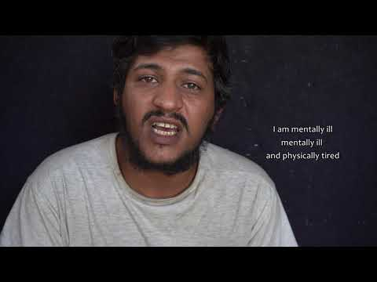](https://www.youtube.com/watch?v=UvNSBiLyVBY)

The criticisms raised by the spontaneous protests were matched by many humanitarian organisations working on the island, speaking of the many ​​​​reasons why, once again, to confine people seeking asylum in an isolated, highly controlled, large\-scale camp facility does not count as a ‘solution’ to five years of unspeakable living conditions and systematic neglect\.

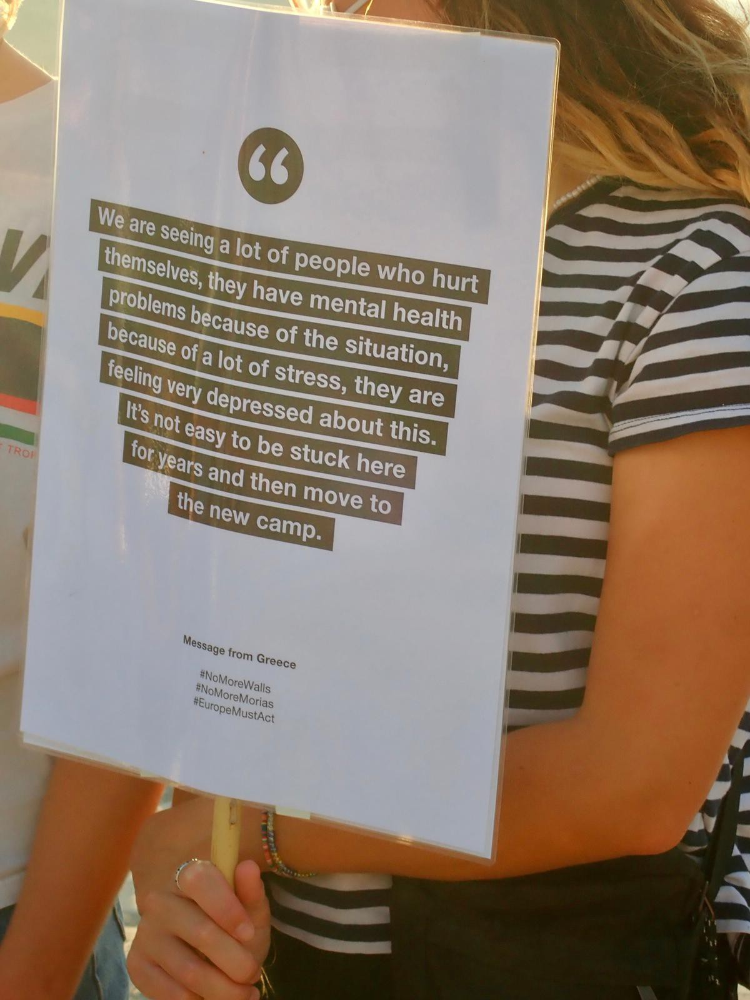

In the [statement released](https://www.samosvolunteers.org/s/Press-release-Zervou-2.pdf) by Samos Volunteers it is highlighted how the marginalisation, isolation and curtailment of agency in the new MPRIC will further increase the detrimental impact on people’s mental health\. Not to mention the impact on the prospect of protection from sex\- and gender\-based violence in the absence of reliable protection mechanisms and safe space areas inside the facility\.

On the same day, Just Action also [released a statement](https://www.facebook.com/100637111645870/posts/383244686718443/?d=n) stressing that,

> _‘instead of frightening, imprisoning, torturing and discriminating people who are constantly moving, the European Union should begin to comply with its own values and introduce an inclusive strategy, beneficial to the wider part of society in the long\-term\.’_ 

Finally, the Samos Advocacy Collective published a symbolic [open letter](https://twitter.com/AdvocacySamos/status/1439174029697560577) addressed from Samos to the other Aegean islands, reiterating that the reality being witnessed today in this one island will soon replicate for people seeking asylum elsewhere in Greece\.

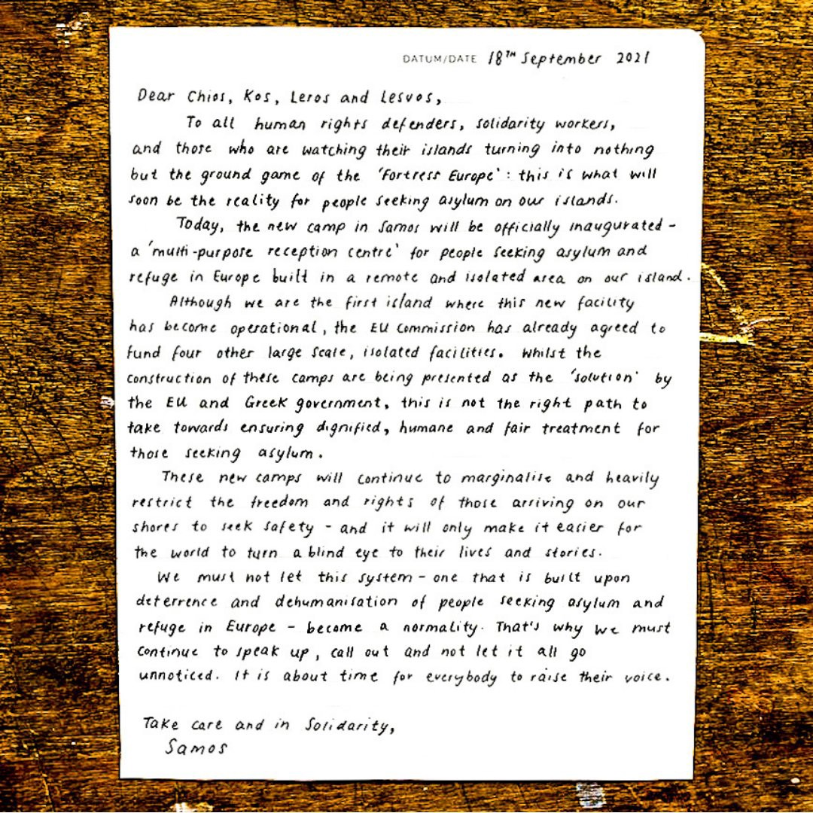

#### **What comes next?**

> With financial and technical support from the European Commission, Greek authorities are constructing fences and concrete walls around existing camps, building closed camps in remote locations on the Aegean islands, and introducing legislation to further restrict the freedom of movement in and access to camps\. These walls are a physical manifestation of containment policies adopted by the EU and its Member States to isolate asylum seekers away from local communities\. By reinforcing such policies, they seriously risk impeding the effective identification and protection of vulnerable people; limiting access to services and assistance for asylum seekers hindering independent monitoring of conditions inside facilities; and exacerbating the harmful effects of displacement and containment on individuals’ mental health\. Moreover, these policies are likely to preclude displaced people’s integration in local communities, to their detriment and that of Greece\. _\( [Walling Off Welcome](https://reliefweb.int/report/greece/walling-welcome-new-reception-facilities-greece-reinforce-policy-refugee-containment)_ , _2021\)_ 

According to information provided by the authorities, starting from 9am on Monday 20th September, the first residents of Vathy camp are supposed to be transferred to the new location in Zervou\. The transfer is expected to be completed by Tuesday 21st evening\.

Moreover, the residents of the new structure will presumably be free to leave the camp during daytime, but have to respect a 12\-hours night curfew\. This last detail — together with the inconspicuous sign posted on the entry gate of the MPRIC — definitely calls into question the [vague promise](https://ecre.org/greece-moria-fire-thousands-sleeping-rough-chaos-prevails-calls-for-structural-solutions/) made by the Commissioner Johansson herself a year ago, in the aftermaths of Moria fire, that the Commission would not have funded any construction of closed camps, or her [own claim](https://www-samos24-gr.translate.goog/archives/66705?_x_tr_sl=el&_x_tr_tl=en&_x_tr_hl=en-US&_x_tr_pto=nv) that the camp in Zervou would have definitely been ‘not closed’\.

For what is worth, the new camp facility in Samos puts into question the relevance of terms like ‘closed’ or ‘open camp’ — as well as the very accountability of DG Home Directors\.

To further highlight the discrepancies of the promises made by the EU Commission and the actual reality of the MPRIC, Médecins Sans Frontières released a video compilation plainly showcasing the inconsistencies\.

■■■■■■■■■■■■■■ 
> **[MSF Sea](https://twitter.com/MSF_Sea) @ Twitter Says:** 

> > During the last 5 years, we have heard many nice words, but what we continue to see is just increasingly restrictive policies &amp; camps designed to further isolate people. Are the #EU leaders deaf to the harm they are causing to #people seeking asylum in #Greece? 👇🏻👇🏻👇🏻 https://t.co/GzZJAIsjjA 

> **Tweeted at [2021-09-17 11:25:36](https://twitter.com/i/status/1438826466104467459).** 

■■■■■■■■■■■■■■ 

As [reported by](https://twitter.com/_PMolnar/status/1439155857950916613?s=19) Petra Molnar, researcher for Migration & Technology Monitor’, visitors and residents will be ‘welcomed’ to the centre by an entry gate with _‘two factor access control system, turnstiles, magnetic gates with kilometres of double NATO\-type security fence, and smart software to notify the Local Event Centre and the Control Centre in Athens’_ \.

In two days from today, it will be _International Day of Peace_ \. In Samos, on that same day, hundreds of people that have fled the war and conflict from their homelands and, seeking asylum in Europe will find themselves behind a double, barbed wire fence\.
#### **_What do you think about the new camp?_**

To conclude, we urge you to listen to the words of M\., a camp resident in Vathy, who took part in an interview a few weeks ago, and asked for his testimony to be shared\.

> Yeah, that’s an important question you asked about the new camp\. You know, I’ve been in the old camp in Vathy for almost 2 years, you understand? So, you are moving me to, because I am in a prison, you are moving me to a new prison again\. I’ve already, you know, served two years in the old prison, you are moving me to a new prison, without causing any crime\. 

> So, I don’t know, like, where to… if it is a prison or it’s community… or if it’s to have a better life there, you know\. Because when I was here, since I lived in Samos almost two years, I never sat in the bus, I never drove a car, I never sat in the taxi, or went somewhere, you know\. And that place I think is the bush, so to say that it is the bush\. 

> If you want to …compare it to \[domesticated\] animals, you not cannot send animals far away from the city\. You need to bring them close to the human beings, where they can see human beings\. Though, these are animals\. So now me, as a human being, like you — you know — and without causing any crime, killing anybody — they are moving me in the bush\. Though if it is better than here \[in Vathy\] it is that I need to live with people, not with animals\. 

> Because I know, according to the news that we hear, like… it’s like to put red animals, close to the sea you know\. Fishes live in the sea\. Meaning, we are going to live with animals\. **Meaning that they are transferring us, like human beings, like “human beings animals”\.** You understand me? 

> So I know, the Europeans, Europeans, you know, from moving us from a prison to another prison, you understand me, and I don’t think it’s right\. So, you are moving me, I spent almost two years here\. So I don’t know when I am getting out or, you know, to get out from the camp and live a better life and pursue my dream\. So if you are moving me there, I can cause suicide or cause harm for myself, because all over is closed — police and security\. There are many at the camp\. And those who are causing crime in Europe, they are walking away free\. And we, that do not cause any crime, we are locked up\. 

> So I don’t think that the new camp is a new or a good thing to Europeans\. I think it is a shame to do that kind of\. **It’s a shame, yeah\.** Yeah, those who are behind that kind of criminalisation, sorry to use that word, like criminalizing or this kind of, I don’t know\. It is a shame to keep human beings like us in that kind of situation\. 

> If they speak to me like, “oh, we have a nice bed, nice kitchen, nice big…” It’s not about a nice bed or nice sleeping place that I want, just give me the freedom to move, to cooperate with people\. This is what I want\. It’s not like you keep me in one place\. But if you, as a European, if I keep you in that kind of condition, without causing any crime, would you be happy about that? No\! So, I don’t think it is a good idea\. So, the Europeans must act\. That is very necessary\. 

#### **By Samos Advocacy Collective**

**Find daily updates and special reports on our [Medium page](https://medium.com/are-you-syrious) \.**

**If you wish to contribute, either by writing a report or a story, or by joining the info gathering team, please let us know\.**

**We strive to echo correct news from the ground through collaboration and fairness\. Every effort has been made to credit organisations and individuals with regard to the supply of information, video, and photo material \(in cases where the source wanted to be accredited\) \. Please notify us regarding corrections\.**

**If there’s anything you want to share or comment, contact us through Facebook, Twitter or write to: areyousyrious@gmail\.com**

_Converted [Medium Post](https://medium.com/are-you-syrious/ays-special-from-samos-a-new-hotspot-to-keep-refugees-out-of-sight-out-of-mind-bf2013202840) by [ZMediumToMarkdown](https://github.com/ZhgChgLi/ZMediumToMarkdown)._
