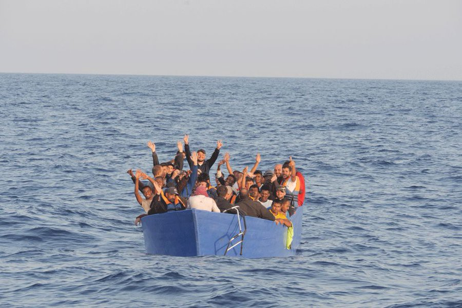
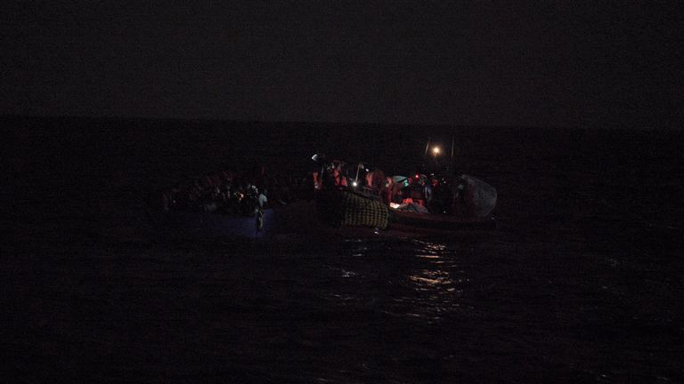
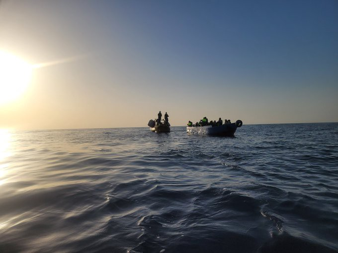
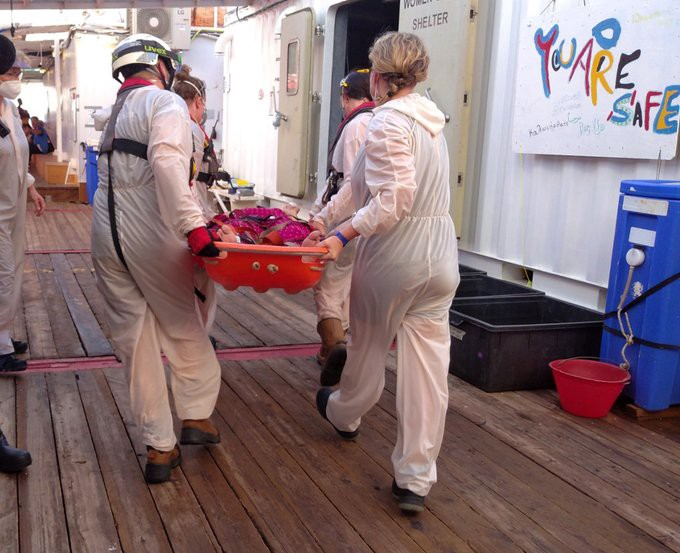

### AYS Weekend Digest 18–19/9/21: Will the deaths at the Belarus border provoke action to protect people on the move?
#### Expected and predicted tragic development of the situation at the border with Belarus // Pushbacks and other causes for concern in the Aegean and Evros // Actions across Germany // New arrivals and more deterrence in the Mediterranean // Recommended media articles, calls for action and more…

 , after one of their SAR missions we report about in this news digest](assets/3e74b8e72e66/0*V_Dx-NA_6HP_OSmz)

Featured photo of this weekend is by [**SOS MEDITERRANEE**](https://twitter.com/SOSMedIntl) , after one of their SAR missions we report about in this news digest
#### FEATURED

A body of an Iraqi woman has been reported at the Polish\-Belarus border\. Beside her was her family who claimed they were pushed back to Belarus\. Bodies of three other people were noticed at three different border points with Belarus on Sunday, reportedly by locals who went mushroom picking, as the local media wrote\. They then informed the police and ambulance services\. Along with one of those who died, an Iraqi man, were two other people who suffered consequences of hypothermia and are currently in hospital\. 
There are reasons to believe that one of those stuck in the border area and who sadly died there previously tried to reach solidarity networks, different organisations, and individuals who, due to not being present in the area and not having the means to reach out to them, couldn’t help prevent this tragic ending\. This begs the question how can we make sure such things don’t happen, that organisations and journalists are allowed in the area to report and inform the people, but also for humanitarian assistance to be provided for the people passing? It is obvious that the issues at the border will Belarus will not go away any time soon\. We invite everyone to focus efforts into advocacy for support to the local solidarity movements, for the international community to not make the same mistakes as in other parts of Europe, and for everyone to provide help and assistance to the activists in the area\. We stand in support of our Polish friends as they deal with the exacerbation of this situation\.

Polish border guards are currently reporting around 300 daily attempts to cross the border and claim they have arrested over 1,400 people since January, with thousands of others “prevented from entering”\. The pushback procedure is being used as a regular process at the border\. As it has [been reported](https://www.onet.pl/informacje/onetbialystok/sytuacja-na-granicy-migranci-probuja-przekroczyc-granice-kolejne-ofiary-smiertelne/h8v59vk,79cfc278) , a [state of emergency has been in force](https://wiadomosci.onet.pl/stan-wyjatkowy) since September 2 in the border zone with Belarus, in part of the Podlaskie and Lubelskie provinces\. This has made it impossible for organisations to have any access to the area and to take any action\. People are constantly getting stuck in limbo, in the swamps of the Supraśl River, and at risk of hypothermia as the Suwałki region now has temperatures dropping to 0 degrees Celsius during the night, and will continue to have colder weather\.
#### SEARCH AND RESCUE AT SEA
### A bizarre pushback to Morocco

Alarm Phone was alerted to a couple of people stranded on Congreso Island, part of the Chafarinas archipelago in Spain\. They informed the authorities, and afterwards received confirmation from Salvamento Maritimo that the Guardia Civil transferred them to an unknown location\. With the Guardia Civil in Melilla having difficulties receiving updates from their own colleagues on the archipelago, they were ultimately informed that both persons in question had been transferred to a vessel of the Moroccan Navy\.

More than 11,000 people have arrived in the Canary Islands by sea so far this year, which is 117\.3% more than in 2020, [reports](https://l.facebook.com/l.php?u=https%3A%2F%2Fwww.europapress.es%2Fislas-canarias%2Fnoticia-mas-11000-migrantes-llegado-canarias-manera-irregular-va-ano-1173-mas-2020-20210917135926.html%3Ffbclid%3DIwAR1hruyJyJT0BcTHzv9uc1o7N_vfpaWSw6pzcG-M0RfQ7L0WuUEntJDHt5w&h=AT3kJ8dsnGOEg2kbqXnjX-wR9qk_fIsrKO6Kuyw9qIDcjRBnTceU8yGgjXpMnpoDoB7bNozNLQJdsp8OElNYUbPtmZ0NZn03C6z5ttPWdQzB-cYxL_kYhgnjiKsDARryQX4UML-8JIq-AAEJMuw4W0BScTppTw&__tn__=R]-R&c[0]=AT1n8VlxnPzx4wRcNSERNK0-41EcAV6MNFMsUDAumnhYU4_XOkifwMYFvykuri0CMZahIlnTMris6qkgOYhr2HktsBoFFzqs1eqN1FW-1hY1yua-e1tKKjFg31EogY952kb7PjBIgnNd1Zy8Y_tfDcFtMpJdxRVzcZPpF7BAljIMvTGURR93zML8xStYO-7khtbOTFqrzSIR) say\.

Many people have lost their lives here\. The most recent reported one is the man who [died trying to reach Playa de los Muertos](https://www.lavozdealmeria.com/noticia/3/provincia/222156/muere-un-migrante-cuando-intentaba-llegar-en-patera-a-la-playa-de-los-muertos?fbclid=IwAR3mthPCi2u97h3xutIXr2HVHxautOX-oqB0VCAoLL1q6p_e0WcqbOq7qjA) by boat, in the Almeria municipality of Carboneras, where another person died falling off a cliff just a week ago\.
### On board the Ocean Viking

Photos: resqship

After @resqship monitoring vessel Nadir encountered an overcrowded wooden boat with approximately 60 people in distress drifting in the Maltese Search and Rescue \(SAR\) zone, they provided first aid and alerted all responsible authorities\. Following that, since the Maltese MRCC denied its responsibility once again and Nadir had no capacities for the rescue, they alerted the nearest SAR crew and finally, the Ocean Viking rescued the 58 people\.

Following the two rescue missions of this weekend, Ocean Viking was alerted to 2 other wooden boats in distress in the Libyan SAR Region by Colibri2 aircraft\. Both were intercepted by the Libyan coastguard as witnessed from afar by their teams\. 
More than 800 people were intercepted this week and returned to Libya by the coastguard\.

Of course, the UN has [“expressed concern](https://l.facebook.com/l.php?u=https%3A%2F%2Fwww.libyaobserver.ly%2Fnews%2Fun-concerned-over-thousands-immigrants-vanishing-libya%3Ffbclid%3DIwAR10S-j-97BQsUdxIXdJvyowbvLJ5pGTG4SvFP68CynD9rJw3V42Es_YKIE&h=AT3QUTJdnR7jRITzTuYnzs5LqSbcNzE3p0GTlD3o91wZHHLZhWyy4LhPTyaD_t3q7ir254A0ZAal1uBieUapQdKo_PBdZyFuo9QpuQKWhk0Y-u0qwYm4QEmD3SxNmFbzMKGGvvq4iPtrsMilRkM0NLU5ppoySQ&__tn__=R]-R&c[0]=AT1ni8aP8ioNZrkvMAbA8-3MZhu_ca8utgdbiy4IhjUtZ0MQUI7eYuWpjDirbl53f_7A-f4oXXBgpgLH8SjMMopq3s1M-ZYQk_v5eDlOuCqi4nWusSqQAcNz4lPzvtq6nxy58FT8jMFOJmNMOahu9PotTmZc4n4EAFBEHUcPuTcfoL49vloeUrC_m34JqKuqVXt0OBEZ0nRMfYQcQkw) ”, but given their lack of action and complicity in the returns, there is not much to be expected from them\.

During the second rescue operation they encountered 33 people on a wooden boat in distress in international waters off Libya, who were safely brought onboard, including 8 women and 13 children\.

Two survivors with chronic medical conditions are under close observation\.
#### GREECE
### Fire and pushbacks on Samos

19 asylum seekers from Somalia and Sierra Leone were pushed back from Samos, despite the fact that they were officially announced to all competent authorities, including the UNHCR\. They also applied for asylum, but, as we know, that fact means less and less across the EU\.

■■■■■■■■■■■■■■ 
> **[joel hernàndez](https://twitter.com/joelhdz) @ Twitter Says:** 

> > 🇬🇷 couldn't have better illustrated how it intends to implement this new day for 🇪🇺 migration mgmt than with the brazen #pushback of 19 #asylum seekers—including a pregnant woman &amp; an amputee—with the DG-HOME Task Force #Migration Management &amp; a full press court on the island... 

> **Tweeted at [2021-09-19 14:11:23](https://twitter.com/joelhdz/status/1439592964343353345).** 

■■■■■■■■■■■■■■ 

As the new closed prison camp opens on Samos, the [outrage](https://l.facebook.com/l.php?u=https%3A%2F%2Fwww.dw.com%2Fen%2Fgreece-opens-first-refugee-holding-camp-on-samos-island%2Fa-59225924%3Ffbclid%3DIwAR2X4HeLAms2T1_h5aomCOaxH_2drS1wMHI00QJYLwjfTa5cRlNA0GH3xEg&h=AT1O-lJkjVZi5RGUJdKln276lW5cjCcVGBxR6fmSIjsh8qpf29W3psFPYajk8mxXfhv7xGJdbUYu7V0sJak5vrlzh2hFf_drdntZe8ZE2-bShlfsFWImSVTzT78EmG0hqRF_UmFm69my-YN8SCQwNsMsiBJcZA&__tn__=R]-R&c[0]=AT08WUZpDDG0hxLOzEr-ZTiYTATWmiwcSeGKw0jQqZS7-wXtw9VnzOA7iOpR4y28PQpHwqgJihDVan1Evmhbq1sbZDv5IApM2uJjkP_zPnXE12f_yaOvM6-WQ5WCRpIUMFsZwnpewEszn5W43K1H-vqLVLN6BHYDA3iEQqAYtM5v2wuoZbAChJ0-6icIDB0Ya8v7w1fgmQmN) over the fact it is in fact a detention centre in the open, continues, in many [reports](https://t.co/17surwCalV?amp=1) \.

■■■■■■■■■■■■■■ 
> **[Samos Advocacy Collective](https://twitter.com/AdvocacySamos) @ Twitter Says:** 

> > A letter from #Samos to the Aegean.

Confining #RefugeesGr in isolated, highly controlled camps is not a 'solution' to 5 years of systematic neglect. 

Please reshare, speak out against the construction of these camps and this system of deterrence.

We cannot let it go unnoticed. https://t.co/fFP52e4bb2 

> **Tweeted at [2021-09-18 10:26:41](https://twitter.com/advocacysamos/status/1439174029697560577).** 

■■■■■■■■■■■■■■ 

> “The new camp is not a camp, it’s a prison\. There’s barbed wire all around it\. There’s even a \[…\] prison camp within the camp\. I think the island is already some kind of a camp, because it’s so remote\. So, in a way, it’s a camp in a camp in a camp\.” 

[](https://l.facebook.com/l.php?u=https%3A%2F%2Fwww.politico.eu%2Farticle%2Feu-funds-migrant-camp-greece-samos-vathy%2F%3Ffbclid%3DIwAR09UrfIlX-GemL_Zm4JRhnEKOXQmPFjTNnp2kI5X1BcOeCCJEoXbZnwXcA&h=AT2tKqynsVBly03YPyh9rHEwmB7mkE_EoNFjRAtWKwhblLTUsgq6K34UAxzX3zI8ibXwkFTwMPkVH2otfp5NjIqpu2vl_gSA0E09-VTOtAJbAjF98P0nn17fjwVwBtlS3ucVnvVdjA4PIfxGQDftkw6lzDvxQA&__tn__=R]-R&c[0]=AT08WUZpDDG0hxLOzEr-ZTiYTATWmiwcSeGKw0jQqZS7-wXtw9VnzOA7iOpR4y28PQpHwqgJihDVan1Evmhbq1sbZDv5IApM2uJjkP_zPnXE12f_yaOvM6-WQ5WCRpIUMFsZwnpewEszn5W43K1H-vqLVLN6BHYDA3iEQqAYtM5v2wuoZbAChJ0-6icIDB0Ya8v7w1fgmQmN)

_“Billed as a state\-of\-the\-art facility, authorities told us it’ll be a model for other countries\. Yet the people we spoke with awaiting transfer there tomorrow don’t want to move to a closed camp”,_ writes Petra Molnar\. Securitisation also plays a big and important role in the whole setting of the new camp:

■■■■■■■■■■■■■■ 
> **[Petra Molnar](https://twitter.com/_PMolnar) @ Twitter Says:** 

> > 🚨The new “closed controlled access centre” of Samos, a securitized and secluded refugee camp is officially open. According to official press conference “Samos is back to normality.” Normality which includes surveillance and geographic segregation of people seeking protection 🧵 https://t.co/R5d7pwz6Qd 

> **Tweeted at [2021-09-18 09:14:03](https://twitter.com/_pmolnar/status/1439155751256272897).** 

■■■■■■■■■■■■■■ 

The move didn’t go without protests:

■■■■■■■■■■■■■■ 
> **[Franziska Grillmeier](https://twitter.com/f_grillmeier) @ Twitter Says:** 

> > Girl (12y old) from #Afghanistan drawing a bird on the pavement next to a small demonstration showing “disagreement with the new refugee camp” on the main square of Lions Square, in #Samos just now. /1 https://t.co/SkJvB1EnKB 

> **Tweeted at [2021-09-18 17:08:52](https://twitter.com/f_grillmeier/status/1439275239851143176).** 

■■■■■■■■■■■■■■ 

All of this was followed by a fire that broke out in part of the old camp at 11pm\. Reportedly nobody was hurt\.

■■■■■■■■■■■■■■ 
> **[Franziska Grillmeier](https://twitter.com/f_grillmeier) @ Twitter Says:** 

> > Das #Feuer scheint in einem Teil des Lagers zu bleiben. /5 https://t.co/GK1HYq8dee 

> **Tweeted at [2021-09-19 20:28:31](https://twitter.com/f_grillmeier/status/1439687870306992135).** 

■■■■■■■■■■■■■■ 

On Lesvos, protests in support of Afghan women have taken place\.

](assets/3e74b8e72e66/0*ixe8txLNJ5ST9vWA)

[Moria Corona Awareness Team](https://www.facebook.com/MoriaCoronaAwarenessTeam/?__cft__[0]=AZViA0QIEsASn_zGyBDPJDOMZczdnmISjnmGPw_0fNFGaOzYcHrw2PaGXOUJ9WosksH5Smrf38pnsu7GRZQ0ieCJKDJ0LggIxBDoqukCRqNSGWLYVM6FzUq1RSpsUYIA-Sy8-D7xaWNDe9FwkxaSBTNB&__tn__=-UC*F)

■■■■■■■■■■■■■■ 
> **[Katy Fallon](https://twitter.com/katymfallon) @ Twitter Says:** 

> > “I lied to her,” says this father from Afghanistan as he waits to enter new camp in Samos with his 4 year old daughter, “I told her we were going to Athens - it’s like a prison,” he says looking at the camp. https://t.co/o7r3sixTH6 

> **Tweeted at [2021-09-20 08:15:26](https://twitter.com/katymfallon/status/1439865773661491204).** 

■■■■■■■■■■■■■■ 

### Some unpleasant characters likely to run in next elections

Back on the mainland, as reported by the local media, the Greek Solution is preparing their candidates in Evros in the next elections\. Among the possible candidates, apart from K\. Velopoulos as president of the party, are former Golden Dawn candidate Ilias Iliakopoulos and lawyer Paris Papadakis\.

■■■■■■■■■■■■■■ 
> **[Lena K.](https://twitter.com/lk2015r) @ Twitter Says:** 

> > Both Papadakis &amp; Iliakopolos were actively involved in the protests against the expansion of the Fylakio detention site. More importantly, a sign that last year's border spectacle &amp; the protests against Fylakio have strengthened the power &amp; legitimacy of far right actors locally. 

> **Tweeted at [2021-09-19 17:16:46](https://twitter.com/lk2015r/status/1439639616710234118).** 

■■■■■■■■■■■■■■ 

#### GERMANY
### Berlin pays tribute to Ella

■■■■■■■■■■■■■■ 
> **[Michele Majidi](https://twitter.com/herr_majidi) @ Twitter Says:** 

> > Last Tuesday afternoon Ella, a 40-year-old trans woman from Iran, set herself on fire in front of a shopping centre in #Berlin's Alexanderplatz. Ella was hospitalized and died of her injuries on the same day. Dozens of people gathered to pay tribute to her today. https://t.co/pQymya6KuJ 

> **Tweeted at [2021-09-19 20:58:09](https://twitter.com/mcmajidi/status/1439695327850795011).** 

■■■■■■■■■■■■■■ 

### Demo against deaths in Mediterranean

Human chains were used to demonstrate for the reception of refugees\. Around 2,000 people took part in Duisburg alone\. [The chain they formed ran through the city for up to ten miles from north to south](https://www.deutschlandfunk.de/seebruecke-menschenketten-gegen-das-sterben-von.1939.de.html?drn%3Anews_id=1302841&fbclid=IwAR3c3DAUAd5pUUdp7FYHcl62MfPwVZb-niG6ClW1ap5Tzl19aT1t4mrNOEY) and people were connected with banners and scarfs, due to corona regulations\.

](assets/3e74b8e72e66/1*DSo7RYZnuzmde3i5l-RuTw.png)

Photo: [**MartineBallinger**](https://twitter.com/martine_balling)
### Day of action — make the human rights deniers visible

 for more details](assets/3e74b8e72e66/0*f7-hyv6sKKIw0hmo)

Visit [**Seebrücke**](https://twitter.com/_Seebruecke_) for more details
#### FRANCE

Evictions of provisional campsites in the north of the country continue…

■■■■■■■■■■■■■■ 
> **[Human Rights Observers](https://twitter.com/HumanRightsObs) @ Twitter Says:** 

> > Après la mise à l'abri forcée de plusieurs dizaines de personnes #exilées mardi, ce matin a eu lieu la 4ème opération d'expulsion de la semaine à #Calais. 

Comme à chaque fois, des #tentes pleines d'effets personnels sont prises et seront détruites dans quelques jours. https://t.co/cbUcBSgPPG 

> **Tweeted at [2021-09-19 13:51:12](https://twitter.com/humanrightsobs/status/1439587884202405891).** 

■■■■■■■■■■■■■■ 

### Paris needs volunteers\!

#### DENMARK
### Police detains Iraqi women as they are preparing deportations

Two Iraqi women were picked up by the police from the exit center Kærshovedgård on Monday, 13 September, at 4am in the morning and detained in Ellebæk prison\. At the same time, 4 Iraqi women from Avnstrup Hjemrejsecenter were picked up by the police and detained in Ellebæk\. A total of 10 Iraqis have [reportedly](https://l.facebook.com/l.php?u=https%3A%2F%2Fkonfront.dk%2F10-irakiske-flygtninge-er-den-sidste-uge-blevet-faengslet-i-ellebaek%2F%3Ffbclid%3DIwAR353xgx4KBQHJ60v_v4-w7pZOkJD5slgFmbQIIBkcrq29HVT6J2U-OU82c&h=AT21CaetqqOxUJN7HmGHWscMd0R8RMNnpIu8ePJ_oFzhq1VzBVb-c-LmS5MiEZ4tWSDWQx103AiM3wXiJl_VxT9GxagiR_iW_bhxYJFB19Si6TlP99rIWQWktMuJvkRVQ6Pn3mvyblMh-c0OSg&__tn__=%2CmH-R&c[0]=AT3HLt0gfyaL3DI5oqYixJl3Jj1phvlHYbEbgoHHEyGtJdrE_A7AjIGCY5mIS4VU-0fDiU8YMHam5dI8_I21gCr7d3STM1qQXyDEvcYtQhyC8tljUysyw7GyKlc96TmLwQMnFgyKaHYQoh0IOqzVPBO4RpRcLJ0OmgfjnrSLGTO2QsJB_56XMGR1AkKNnkNGr11SrmUAbnmdPL1_RfQ) been picked up by police in recent days\.

> There has never before been a deportation agreement between the Danish government and Iraq, so the government has not been able to legally deport Iraqi refugees without the individual signing deportation papers\. Whether this remains practice is uncertain in light of the fact that an Iraqi delegation is coming to Denmark\. The delegation plans to talk to the detainees, with a view to deportation, but it is unknown what the consequences will be\. The precarious situation creates fear among the prisoners and their families as well as in the camps in general\. “What’s going to happen now?” is a thought that weighs heavily on everyone’s mind\. 

Read more about this topic in the upcoming AYS Special on women in the Danish asylum system\.
#### UK
### Solidarity with Simba

Protesters gathered in front of the Sheffield hospital, demonstrating against the injustice of the NHS system that resulted in a young man having to pay 100,000 pounds for emergency medical help that he received during a stroke \(at the age of 29\! \) in 2019\. As a rejected asylum seeker, he had been rejected for a reportedly simple and inexpensive medication that could have prevented him from suffering the stroke\. Now, many people and organisations in Sheffield and across the UK are protesting for an end to the charging of people on the move and asylum seekers for NHS treatments\. These practices are only a part of a range of “hostile environment” policies rolled out between 2014 and 2017 that aimed to restrict access to public services and make life in the UK more difficult for undocumented people\.

■■■■■■■■■■■■■■ 
> **[Medact](https://twitter.com/Medact) @ Twitter Says:** 

> > We heard from Simba outside @[SheffieldHosp](https://twitter.com/SheffieldHosp):
"I didn't do this only for me, but to make sure people can have the strength to fight injustices like this, people who didn't feel like they had a voice to fight back. I will always try my best to fight against this sort of injustice." https://t.co/GiJvshFOxe 

> **Tweeted at [2021-09-18 17:13:54](https://twitter.com/medact/status/1439276507516522502).** 

■■■■■■■■■■■■■■ 

Simba is spending his prime young years of life going through unimaginable difficulties and, as [he said, living in an open prison](https://www.theguardian.com/uk-news/2021/sep/18/asylum-seeker-given-100000-hospital-bill-after-suffering-stroke?fbclid=IwAR0XFN0O7GNHsQu4cW4HRfKoMSFgbVuSj4eVcqzXdqdwLgLpbbSVSpIklaI) \.

■■■■■■■■■■■■■■ 
> **[Mount Pleasant Park FC](https://twitter.com/MPP_FC) @ Twitter Says:** 

> > Marching through Sheffield today demanding #JusticeForSimba and an end to the hostile environment in the NHS https://t.co/GQb3bP50YU 

> **Tweeted at [2021-09-18 16:10:29](https://twitter.com/mpp_fc/status/1439260547921362944).** 

■■■■■■■■■■■■■■ 

> “Thee walls must fall” 

> “No borders in our NHS” 

At the same time, voicing concerns over the treatment of people who came to the UK in need of protection and are now victims of a ruthless policy by the government, the Home Secretary Priti Patel is being taken to court over plans to keep asylum seekers at Napier Barracks for another four years — despite being “unfit for habitation”, as we have been reporting earlier\. Find out more in a [local media](https://l.facebook.com/l.php?u=https%3A%2F%2Fwww.kentlive.news%2Fnews%2Fkent-news%2Fpriti-patel-faces-high-court-5938483%3Ffbclid%3DIwAR13BJcTeNcUR81BBCRaBmEIroS0yqvyLCfKnQSXL1Ocdpy_4dmTIJ6w0dc&h=AT2kP94XVp0_TeuVX-KKqIzk1e8p95FNgupV-Y0AhvpPoAN31WJWwwD-8N165TQFbe5C5oYLLy-dMN9PYc9ynF3OgKVvJmtAKudbr32tJe21yQpnX6jyWF2rzVkoAnOWidilJ4Exq9fSOvNBAsgaNxrycC78ZA&__tn__=R]-R&c[0]=AT3Mi5EY0sTX8uz87iQTXVVSqcCCz24KaYRb-uZwt9jHJMT4gFcTeBYQknDHUc2GCCie33f_M0msKPIimJ2i2LrV0RP7mtOSxp5_cjJ6DdBIqmNL6C_4XTAHS_Qx-Lgs7nTiJd-Kt96lh93IR1hY_AMA-KJWUNmVw1eZvEduiG_auBIXuIwvPWNJD8IH4ul-moPQJ5M3C8FA) story\.
#### WORTH READING
- Profiteers of human rights violations — How a Dutch shipowner ‘pushed’ people back to Libya — Migration Commercial ships are increasingly involved in _pushbacks_ of people coming to Europe via the Mediterranean Sea\. Dutch shipowners also collaborated with the Libyan coastguard, with deadly consequences\. Read the story, originally in Dutch, by Bram Vermeulen:

[/s3/static.nrc.nl/bvhw/files/2021/09/data76362995-bc276b.jpg)](https://www.nrc.nl/nieuws/2021/09/17/hoe-een-nederlandse-reder-illegaal-migranten-terugduwde-naar-libie-a4058738?fbclid=IwAR3UqAmApxlUxxnU-e2yF5m7q_79J3k_u2FMxL14i3-NZd10pGi4DLpqL38)

- Across the Alps: Refugees between Italy and France — People who want to go to Europe risk their lives not only in the daring crossing of the Mediterranean\. But also on other, no less dangerous escape routes that are hardly mentioned\. There are thousands who cross the high mountains every year\. And their escape routes are becoming more and more dangerous\. A life\-threatening undertaking, especially at night in the Alps\. A story originally in German:

[](https://l.facebook.com/l.php?u=https%3A%2F%2Fwww.br.de%2Fnachrichten%2Fdeutschland-welt%2Fueber-die-alpen-fluechtlinge-zwischen-italien-und-frankreich%2CSjL7F47%3Ffbclid%3DIwAR2MkyzCIvBDZp79V_MZWstYyIIEakm7OK1cJq0KG9ostD1eW8HpyCbkj-M&h=AT0cTKPHhRDlH2WpQ8qU3cwSfycRW1w_1kFOKr474Ue8-E690ygU8xnxygBwpmC4y9td_nE0Tx3sLVgqkbr1XvacUbASUfxvLy8T69I8JDng-3DleW1A_mK4W8JrDwWyFI7FjvpD7P8v6Kz6vmEJrAQ0iVW5CA&__tn__=R]-R&c[0]=AT0b4OMqx0k5NQpyb1aSyjrLOLV5PmshME3qkjhaR7k5h8uP61q99vkCPRu95YWG96mkudJ1va3szoryglDTmhLizIWoKnbNO9cT8p0DXN-E9zrRqL7AHRTy0du-NdsVJoHlhGgf_tqzwXfXwL0cC5MseZYSI81qTBNMrEKsuw4h0x11Q1b2co0VH8X4K9BvbZxHupT4-MDwho9Ylxw)

- Thousands of Afghans have landed at the Ramstein US Air Base in Germany\. The huge tent city is to be evacuated by the end of September\. But where they end up is often a question of luck…

- Why undocumented people went on hunger strike in Belgium — Now, as the weeks pass and the protesters regain their health, many of Belgium’s estimated 150,000 undocumented migrants are left asking what exactly has been achieved, and what comes next…

- Children were given old analogue cameras and taught the art of photography:

**Find daily updates and special reports on our [Medium page](https://medium.com/are-you-syrious) \.**

**If you wish to contribute, either by writing a report or a story, or by joining the info gathering team, please let us know\.**

**We strive to echo correct news from the ground through collaboration and fairness\. Every effort has been made to credit organisations and individuals with regard to the supply of information, video, and photo material \(in cases where the source wanted to be accredited\) \. Please notify us regarding corrections\.**

**If there’s anything you want to share or comment, contact us through Facebook, Twitter or write to: areyousyrious@gmail\.com**

_Converted [Medium Post](https://medium.com/are-you-syrious/ays-weekend-digest-18-19-9-21-will-the-deaths-at-the-border-with-belarus-provoke-action-to-protect-3e74b8e72e66) by [ZMediumToMarkdown](https://github.com/ZhgChgLi/ZMediumToMarkdown)._
