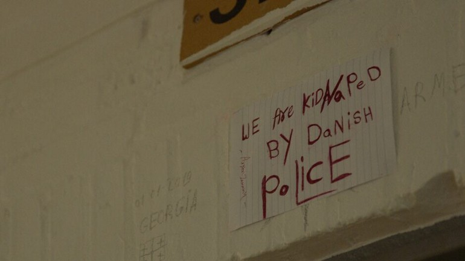
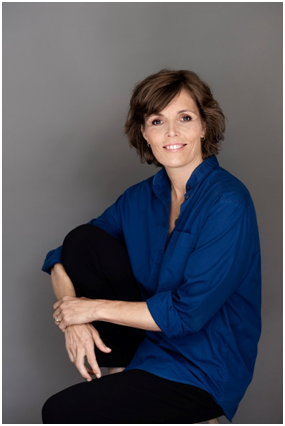
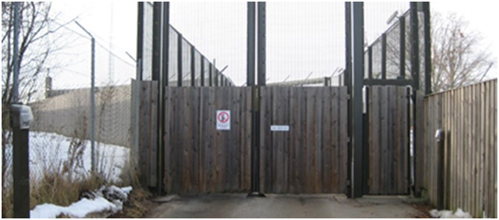
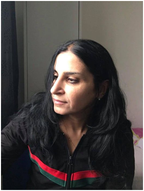

### AYS Special from Denmark: Women Without Rights

_During the last weeks, the Danish author and human rights activist AnneLise Marstrand\-Jørgensen published on her Facebook wall five stories under the common headline “Women without rights” \(Kvinder uden rettigheder\) \. The common theme and thread in these stories is the Danish asylum system and the practices and conditions for women who have had their residence permit revoked\._

\(‘We are kidnapped by danish police’\. Photo Credit: Ole Jakobsen / TV 2\)

At the beginning of the week, at least seven women were picked up by the police early in the morning from the family departure centres at Avnstrup, Sjælsmark and Kærshovedgaard around Denmark\. Some of them with children and husbands, one of the women is pregnant with her third child\.

\(AnneLise Marstrand\-Jørgensen — photo from FB\)
#### Xafsa from Somalia\.

[Xafsa is a young woman](https://www.facebook.com/permalink.php?story_fbid=10159722115602299&id=536777298) who has done everything Denmark wants refugees to do — Learned Danish, made friends, graduated from school and she has been supporting herself for most of the time she has been here\. She is now about to start the social and health care \(SOSU\) education and has already found an internship position\. She does not even want to take a stipend from the state as she prefers to continue to support herself\. Her colleagues in the nursing home describe her as the sweetest, most smiley and caring person\.

Xafsa has no family in Denmark at all, and yet she has managed to find her way\. She fled Somalia because Al\-Shabaab was after her\. Because they came again and again to the house and asked her mother about the whereabouts of Xafsa\. Her father was killed, and her brother disappeared\.

The Danish authorities revoked her residence permit because they think it is safe for her to travel back to Mogadishu\. They obviously also think that such a nice person is not needed in the Danish care system, even though elderly homes are always lacking personnel\.

But Xafsa does not dare to travel\. She does not want to marry against her will and definitely not the man who killed her father and who belongs to a terrorist organization\. Most people — except for the Danish authorities — understand that\.

A few weeks ago, Xafsa received the mail attached below\. Informing her that she has to move to Kærshovedgaard departure centre as she does not want to travel back to Somalia\. At Kærshovedgaard she will be unable to study, to earn her own money, and will not get even an allowance\. The destruction of her life will cost the state 300,000 DKR \(app\. 40\.000€\) a year\.

Doesn’t make much sense, does it?

 \)](assets/d4aa8f782789/1*VtNZ9gIkneI0NpdzgJu0XA.jpeg)

\(Photo credit: [AnneLise Marstrand\-Jørgensen](https://www.facebook.com/permalink.php?story_fbid=10159722115602299&id=536777298) \)
#### Regini from Iraq

[One of the women is called Regini](https://www.facebook.com/permalink.php?story_fbid=10159722286367299&id=536777298) and she lives at the Kærshovedgaard centre\. She has been living in Denmark for more than half of her life\. She has a husband and three small children with whom the Danish authorities will not let her live\. Both Regini’s husband and the kids are Iraqi citizens like herself, but contrary to Regini, they all have a permanent residence permit in Denmark\.

Now Regini has been detained and locked up without her family in the departure center Ellebæk\. She has not committed any offences\. That is, other than being scared to travel back to a very insecure and unstable country that she saw last when she was a girl and to be horrified at the thought of being separated from her husband and children\.

\(Ellebaek Prison\. Photo credit: Refugees\.dk\)

There is nothing new in the fact that the Danish state separates families and, for example, transfers one of the adults to the departure centre, Ellebæk\. The purpose of this is to put additional pressure on people and get them to leave the country\. But this practice has usually been restricted to the detention of men — the new twist is that the authorities now purposefully target women with children\.

Children are not allowed to stay in Ellebæk or in other prison\-like centres\. So it is a really cunning move by the hardliners\. Expecting mothers to give in more quickly when they are deprived of the ability to see and be with their kids for weeks or even months\.

The children, of course, are also suffering\. Many of them are used to their mum being the one taking care of them for most of the time\. Some of them are very young\. They had to witness their mother being picked up by the police before dawn\. You must be an extremely unempathetic human being in order not to be able to understand what this does to a child\.

The women will have to remain in Ellebæk until they face a diplomatic Iraqi delegation\. This is a double pressure — because if they could just be sent home, Denmark would already have done just that — even if this will mean confining them in a straitjacket and with a helmet\. This has already happened several times\.

There is no bottom anymore\. Anything can happen and be tolerated\.
#### Tanya from Iraq

[Monday morning at 5\.30](https://www.facebook.com/permalink.php?story_fbid=10159722610082299&id=536777298) 6 police officers arrived at the family departure centre Avnstrup\. They woke up Tanya and her husband and their three children by banging on the door, and they wanted her to come with them\.

The family’s teenage daughter acted as an interpreter, the youngest kid is only 4 years old and was obviously very disturbed by the sight of the officers grabbing their mother\. When she started crying, she was told harshly to go into the other room and stay quiet together with her brother — who is twelve\.

The eldest daughter kept asking where her mother was going and the officers replied that they just had to talk with her, after then she would come back\.

But Tanya did not return\. She was brought before a judge, was temporarily detained for four weeks, and placed in the departure centre Ellebæk\. The family came to Denmark from Iraq 6 years ago and they are for many reasons terribly afraid of returning\.

Tanya has recently been through a very aggressive case of breast cancer, has had her breast removed as well as several lymph nodes and she has been through a very heavy chemotherapy\. One of her arms is very swollen because of the surgery, and she continues to go for hospital check\-ups\. Tanya is still recovering both mentally and physically from the cancer and subsequent therapy\. However, she has not received any psychological support, that kind of luxury is not offered to rejected asylum seekers\. We also do not find compression sleeves or group therapy for children in the asylum system\.

The judge did not believe that Tanya should be transferred to Ellebæk when she is so unwell\. In court, it was discussed that the father might be transferred instead\. Not that this would be much better, since he had a brain haemorrhage six months ago which resulted in paralysis on one side of his body and subsequent rehabilitation\. No matter what, she was the one to be locked up, the judge obviously did not consider the condition all too disqualifying after all\.

The children are terrified and deeply unhappy\. They are already traumatized by the flight, moving from asylum centre to asylum center and by the very real fear of losing their parents having seen both of them seriously ill\. The small girl is not able to fall asleep without her mum, the older kids are consumed by worry\.

Congratulations to the government hardliners\. Women like Tanya, who has already had to live with the fear of dying while her children are still so young, are guaranteed to be easy to crack and to give up\. And that is exactly what this is about — Tanya must accept to be repatriated to violence, unrest and insecurity\. Whatever it takes\.

And it costs: Human life, the life of kids, life\.

Denmark, you have truly sold your soul to xenophobia and contempt for human life\.

The bottom has disappeared, that’s the truth\. We should raise a monument of shame to our politicians\. Let them be held accountable for their misdeeds\.
#### Nagham from Iraq

\(Nagham\)

[In Nagham’s home country](https://www.facebook.com/permalink.php?story_fbid=10159725090182299&id=536777298) , at the age of fifteen, she married an extremely violent man\. She took care of the home and the children and at the same time worked for several years for an American company\. As a result, she received several threats, but even though she did not feel safe neither in nor outside her home, she hung on so as not to lose her children\.

As they grew up, she started thinking seriously about escape\. But only when her eldest son was murdered, she knew she had to leave\. She does not have a clear memory of the time after she lost her son\. It was as if everything went black inside\.

She came to Denmark six years ago\. Two years later, she received her first refusal of asylum\. The Danish authorities did not consider that her previous job or the general situation in her home country were sufficient to endanger her life\.

> And violence against women does not trigger a right to asylum\. Not even if a rejection means they are sent directly back to a violent husband\. A woman is not considered to be personally persecuted if she wakes up to beatings and rape every day, it is probably just considered what a woman has to endure\. 

She appealed the decision, but last year she received a final refusal\. Under no circumstances does she dare go back to Iraq\. Since then, she has been staying in the departure center Sjælsmark\.

Wednesday morning, she was picked up without notice by the police at 5\.30 in the morning, brought before a judge and locked up inside Ellebæk\. It’s like a theatre: The police wish to detain, the judge never refuses, the lawyer has often not even read the case\.

Nagham is one of the women who will have to face an Iraqi delegation over the next month\. Invited by the Danish authorities, who would like to know if it will soon again be an option to forcibly deport women to Iraq\.

Her boyfriend sent me a video of the police car leaving Sjælsmark\. He is a Palestinian and also lives in the centre\. In the video, he talks all the while the car drives away\. “Now she’s gone,” he says at last\. Away, behind the barbed wire fence of the place\. Gone\. Gone\. Gone\.
#### Nawal from Iraq

[Nawal came to Denmark in 2015](https://www.facebook.com/permalink.php?story_fbid=10159729876577299&id=536777298) because her sister lives in the provincial city of Vejle with her family\. Nawal suffers from a chronic illness which makes it difficult for her to be on her own as she gets frequent fainting spells\. In her home country, her mother cared for her, but when both parents died, she felt like a wild animal that was hunted down\.

Throughout her life there have been wars and conflicts in her home country\. She has been living with bombings and explosions as a part of everyday life, and by the time she fled the situation had become particularly bad\.

She was relieved as she arrived in Denmark and happy to be close to her sister\. Two years after her arrival, her asylum claim was refused\. To repeat: Denmark does not provide asylum based on you as a woman fearing abuse, forced marriage, exclusion or violence from your partner\. And regarding wars, these must be really extreme to entitle you to gain asylum on that ground\.

She was not happy to live at Kærshovedgaard, this goes without saying\. It bothered her that her life had completely come to a halt, and that she was no longer able to live with her sister\. Also, that she felt that the neighbours looked down on the residents of the departure centre and suspected them of being criminals\. But at least she was still alive and close to her only living family member\.

Last Monday, the police arrived early in the morning\. It happens occasionally at Kærshovedgaard, but of course the residents never get used to it\. Especially not when they have seen friends and acquaintances being crammed into police cars and never seen again\.

This time they knocked on Nawal’s door\. She could not make any resistance, and that would not have helped her anyway\. Now she is detained in center Ellebæk, as another one of the women who will have to face the Iraqi delegation\.

We do not decide for ourselves where we are born or who we are born to\. We do not decide on having a chronic disease or on what access we have to treatment\. We usually do not decide when others die\.

But in this case, the state of Denmark decides on people’s lives, on whether they keep them or not\. 
 
 I think Nawal should be with her sister\. Most of the population obviously does not think so\.
#### Further Reading
- [Information about the Danish Asylum System](https://drc.ngo/our-work/what-we-do/asylum-and-repatriation/the-danish-asylum-system/) — by DRC;
- [Asylum Centres and prison in Denmark](http://refugees.dk/en/facts/the-asylum-procedure-in-denmark/asylum-centers-and-prison/) — By Michala Clante Bendixen \(refugees\.dk\);
- [Denmark’s immigrants forced out by government policies](https://www.chathamhouse.org/2021/06/denmarks-immigrants-forced-out-government-policies) — By professor Michelle Pace \(Chatham House\)
- [AYS Special from Denmark, 2018: _Once a fairy tale country_](ays-special-denmark-once-a-fairy-tale-country-98604c09492a) ;
- [AYS Special from Denmark, March 2019: _Ellebæk deportation camp, Denmark’s forgotten prison_](ays-special-from-elleb%C3%A6k-deportation-camp-denmarks-forgotten-closed-prison-bc7b5aa587f8) ;
- [AYS Special from Denmark, June 2019: _Trapped in Ellebæk, everyday life marked by fear and powerlessness_](ays-special-trapped-in-elleb%C3%A6k-everyday-life-marked-by-fear-and-powerlessness-c9996e3756dd) ;
- [AYS Special from Denmark, December2021: Don’t worry, you’ll go back to Iraq soon](ays-special-from-denmark-dont-worry-you-ll-go-back-to-iraq-soon-1a8b5fb87d44) ;
- [Ellebæk: 10 Iraqi refugees have been imprisoned in Ellebæk in the last week](https://konfront.dk/10-irakiske-flygtninge-er-den-sidste-uge-blevet-faengslet-i-ellebaek) — By Danish solidarity platform Konfront \(in Danish\):

> Two Iraqi women were picked up by the police from the exit center Kærshovedgård on Monday, 13 September, at 4 in the morning and detained in Ellebæk prison\. At the same time, 4 Iraqi women from Avnstrup Hjemrejsecenter were also picked up by the police and detained in Ellebæk\. A total of 10 Iraqis have been picked up by police in recent days\. 

> There has never before been a deportation agreement between the Danish government and Iraq, so the government has not been able to legally deport Iraqi refugees without the individual signing deportation papers\. Whether this remains practice is uncertain in light of the fact that an Iraqi delegation is coming to Denmark\. The delegation plans to talk to the detainees, with a view to deportation, but it is unknown what the consequences will be\. The precarious situation creates fear among the prisoners and their families as well as in the camps in general\. “What’s going to happen now?” is a thought that weighs heavily on everyone’s mind\. 

Ellebaek Prison\. Photo credit: Refugees\.dk

Cell in Ellebæk\. Photo: Ole Jakobsen, TV2

**Conference & launch of report in English**

“A firm hand — Denmark’s policy on rejected asylum seekers and return” by Michala Clante Bendixen, Refugees Welcome\.

The English version will be presented at a conference held at the Danish Parliament, with a fine panel of researchers, practitioners and refugees\.
 
 **September 28th, 5–7pm** 
 Christiansborg, Copenhagen

[See the full program here\.](https://refugeeswelcome.dk/media/1222/program.pdf)

Participation is free, but you must register before Sept 23\. by writing to: kontakt@refugeeswelcome\.dk
 
 The English version can be downloaded from Sept\. 28th, and the Danish is already available [here\.](https://refugeeswelcome.dk/rapporter/)

**_Research and Translation by AYS Info Team_**

**Find daily updates and special reports on our [Medium page](https://medium.com/are-you-syrious) \.**

**If you wish to contribute, either by writing a report or a story, or by joining the info gathering team, please let us know\.**

**We strive to echo correct news from the ground through collaboration and fairness\. Every effort has been made to credit organisations and individuals with regard to the supply of information, video, and photo material \(in cases where the source wanted to be accredited\) \. Please notify us regarding corrections\.**

**If there’s anything you want to share or comment, contact us through Facebook, Twitter or write to: areyousyrious@gmail\.com**

_Converted [Medium Post](https://medium.com/are-you-syrious/ays-special-from-denmark-women-without-rights-d4aa8f782789) by [ZMediumToMarkdown](https://github.com/ZhgChgLi/ZMediumToMarkdown)._
