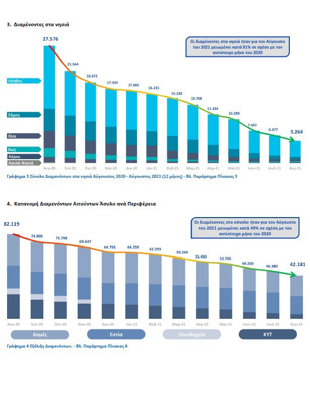

### AYS Weekend Digest 25–26/09/2021: More money for Turkey

[Are You Syrious?](?source=post_page-----c0cd109c4be3--------------------------------)

[Sep 27](ays-weekend-digest-25-26-09-2021-more-money-for-turkey-c0cd109c4be3?source=post_page-----c0cd109c4be3--------------------------------) · 6 min read

Call for all EU members to share refugee responsibilities//Actor Richard Gere to testify in Italian court//Vaccines for more people in Greece//Another confirmed death at Poland\-Belarus border//More evictions in northern France//Dutch Government accused of abandoning people in Afghanistan//Arrivals from Afghanistan abandoned in UK hotels

A young refugee girl from Syria stands in a square in the Turkish border town of Edirne\. [Source: DPA/PA Images](https://www.thejournal.ie/doubtful-that-eu-learned-lessons-turkey-deal-renewed-5555485-Sep2021/?fbclid=IwAR3tFkk0viux-XerJIY0QBKdRjXiRdvXpL_IRdKA3xFHpXj-uGOMArrW3Es)
### FEATURED: More Money for Turkey
### [The deal](https://www.thejournal.ie/doubtful-that-eu-learned-lessons-turkey-deal-renewed-5555485-Sep2021/?fbclid=IwAR3tFkk0viux-XerJIY0QBKdRjXiRdvXpL_IRdKA3xFHpXj-uGOMArrW3Es) between Turkey and the EU has been ‘refreshed’, despite damning criticisms by NGOs\.

Described as “absolutely catastrophic” and “atrocious”, the 2016 deal ensured that people who arrive to the EU have been resettled in Turkey\. The result has been people waiting in sub\-standard camps whilst processing takes place\. Described by an EU Commissioner as having “worked well”, the deal, which sees the EU pay €6 billion to Turkey, reduced the number of arrivals in 2016\.

Despite other political tensions due to energy exploration in the Mediterranean, the European Commission [is giving €3 billion](https://www.thejournal.ie/eu-turkey-billions-syrian-refugees-5477453-Jun2021/) to Turkey from the EU’s budget until 2024\.

Fiona Finn of Irish NGO Nasc [said](https://www.thejournal.ie/doubtful-that-eu-learned-lessons-turkey-deal-renewed-5555485-Sep2021/?fbclid=IwAR3tFkk0viux-XerJIY0QBKdRjXiRdvXpL_IRdKA3xFHpXj-uGOMArrW3Es) :

> _“Does ‘working well for Europe’ mean over 1,000 people die in the Mediterranean trying to make it across to Europe?”_ 

### EU and FRONTEX

[Rescue Ship Ocean Viking](https://www.puls24.at/news/politik/fuenf-mittelmeer-staaten-fuer-faire-eu-fluechtlings-verteilung/244916?fbclid=IwAR0pYDYLwc3a78_krXnwmi0-oZYqS4bzPNTQv7oyAQ04V4pTeknNO3MY7H0)
### Call for all EU members to share refugee responsibilities

Five Mediterranean countries have called on the rest of the EU to enable a fair distribution of refugees amongst other member states\. Spain, Italy, Cyprus, Malta and Greece made this statement after a meeting in Malaga, southern Spain on Saturday\. EU member states such as Poland, Hungary and the Czech Republic have always rejected such a proposal\.

The EU Commission has [failed to condemn](https://twitter.com/lk2015r/status/1442150721860915203?fbclid=IwAR33rZW_Uaq6Ig38tzMT1svQqyEKsHq1IxiZZlMl5Hzp1v82xi0ynyNO1KA) Poland for its illegal pushbacks at the border with Belarus, whilst [this video](https://www.bbc.com/news/av/world-europe-58671941) from the BBC is clear evidence of the law\-breaking that is taking place\. People are used as [‘political pawns’](https://twitter.com/Beaking_News/status/1441364808381583368?fbclid=IwAR33rZW_Uaq6Ig38tzMT1svQqyEKsHq1IxiZZlMl5Hzp1v82xi0ynyNO1KA) in the argument between Belarus and its neighbours\.
### SEA
### Actor Richard Gere to testify in Italian court

Actor Richard Gere [is to testify](https://www.heraldo.es/noticias/ocio-y-cultura/2021/09/26/richard-gere-testificara-en-el-juicio-a-salvini-por-el-caso-open-arms-1522019.html?autoref=true) at the former Italian Interior Minister’s trial\.
### Rescues

A boat carrying 204 passengers [was evacuated](https://www.lasiciliaweb.it/2021/09/maxi-sbarco-di-migranti-dopo-lincendio-su-un-barcone/?fbclid=IwAR103OgywqvtKLIjNCh-hXx5FTfYxW7myCKtqk4BiSBd7z1bWVpg_o6moyg) on to Navy vessels on the way to the port of Messina in Italy\. The fishing vessel had left Libya and was escorted by the Italian Coast Guard, but was evacuated due to a fire on board\. All passengers have now entered quarantine\.

112 people were rescued in a 36 hour period by ship [Ocean Viking](https://www.facebook.com/SOSMEDITERRANEE/posts/4385116698262271) in the Central Mediterranean\. The women, children and men were rescued during four operations\.

9 people [were reported](https://twitter.com/alarm_phone/status/1442207215176269829?fbclid=IwAR0pYDYLwc3a78_krXnwmi0-oZYqS4bzPNTQv7oyAQ04V4pTeknNO3MY7H0) to be in need of rescue between Algeria and Sardinia\. The authorities were informed but the group had already waited at least one day\.
### GREECE
### Vaccines for more people in Greece

Minister of Health [**Thanos Plevris**](https://www.cnn.gr/tag/thanos-pleyrhs) [has announced](https://www.cnn.gr/politiki/story/282987/pleyris-prosorinos-amka-kai-anastoli-apelasis-gia-osoys-metanastes-emvoliazontai?fbclid=IwAR0LRdrroOdvxKL7vaLlkdsKcLf_uT5sSAxLJEmYvbUPrTNGber5xFy7zlo) that refugees in Greece will be granted a temporary AMKA \(healthcare number\) in order to receive a COVID\-19 vaccination\. “D **eportation measures** will be **lifted** for the moment of their arrival at a vaccination center” but this measure [won’t remain in place](https://twitter.com/BrunoTersago/status/1442121900465942530?s=03&fbclid=IwAR0GUodHQpd0xniXqxGcgyp2Jc58c_pw4wIfq2bZtTNejgNz1Bo6zAPvCIo) if they decide to get the jab\. Greece is lagging behind other EU countries in providing vaccinations\.

[This Twitter thread](https://twitter.com/lk2015r/status/1442116628901154822?fbclid=IwAR3pZAFyYgcWL0XqaAuQV3hsIe6jcVM5eohgF-dLPIX4e6U4AEB4IKLeyfk) investigates a Greek man who seems to be assisting authorities in pushing back people who attempt to enter Greece\.

[Infographic from Greek Ministry of Migration and Asylum](https://twitter.com/EleniKonstanto/status/1442107270666592258?fbclid=IwAR3NXYqNoJljc2LUjH48UNz2amZ_j11U4OiL-f1XeIR7pjU0zFKGaRVSktk)

This infographic shows the latest figures from the Greek Ministry of Migration and Asylum\. The top graph shows the number of residents in the Greek island camps and centers, showing one color for each island\. The decreasing figures are designed to instil confidence within the public\. The second graph shows the distribution of residents within the different categories of accommodation/centers on the Greek mainland\.
### ITALY

Photo Credit: Hafiz Kavosh

[A performanc](https://www.facebook.com/eleonorapuyade/posts/10161312303703989) e has taken place in Trieste based around poetry, including the poems that pass between Afghan women as they wash their clothes at the river\.
### POLAND
### Another confirmed death at Poland\-Belarus border

There has been a [5th confirmed death](https://www.facebook.com/NoNameKitchenBelgrade/posts/1324798681251746) at the border between Poland and Belarus\. People are trapped between the border guards of the two countries in dense forest, without access to food, water or shelter\. As the weather turns more wintery, concerns for the safety of the people trapped here are rising\.

[Poland/Belarus Border\. Photo Jakub Bieniasz /No Name Kitchen](https://www.facebook.com/NoNameKitchenBelgrade/posts/1324798681251746)
### France
### More evictions in northern France

On Saturday, approximately [800 people were evicted](https://www.facebook.com/utopia56grandesynthe/posts/399364855110066) from a site in Grand Synthe, near to Dunkirk, in Northern France\. Of those people, only 70 were directed towards alternative accommodation, with the remaining more than 700 people were left without their belongings, water or food, only to be resettled in the evening, just 500 metres from their previous camp location\.

Organisations are continually calling on the authorities to stop these cruel evictions, which leave people without any security\. “5 years after the Jungle evacuation in Calais, the situation in the north still remains as violent and serious\.” [Utopia 56](https://www.facebook.com/utopia56grandesynthe/posts/399364855110066)

[Solidarité migrants Wilson](https://www.facebook.com/Solidarit%C3%A9-migrants-Wilson-598228360377940/?__cft__[0]=AZXUTpJA64raHOvZF3r2upYr3hQoSNHPi5dQeg7O07cn5GHIa9TDDlNVL8FyS4EqVw7ypfewnebu8-ddbYmYJYF0l7zp-Jexp2BcwcyGhcpnfE-CefApglVb9zkqPYZRwsuR8BX_MjuchToXvxY4syFR&__tn__=-UC%2CP-R) are calling for volunteers\. On Tuesday, Thursday and Saturday they require people to help prepare 2000 meals as well as other tasks\. They are based in St Denis\. [Contact them here\.](https://www.facebook.com/Solidarit%C3%A9-migrants-Wilson-598228360377940/)
### NETHERLAND
### Dutch Government accused of abandoning people in Afghanistan

The Dutch government [has been accused](https://nltimes.nl/2021/09/26/dutch-goverment-left-afghan-refugees-defense-lawyers-say?fbclid=IwAR33rZW_Uaq6Ig38tzMT1svQqyEKsHq1IxiZZlMl5Hzp1v82xi0ynyNO1KA) of avoiding contact from those Afghan citizens whose names are on the evacuation list from Afghanistan\.

Afghan people who helped the Dutch army have been abandoned in Afghanistan without any contact\. Lawyer Vivian Oliana has tried to contact the government regarding her client:

> _“It seems as if the government is trying to look away for as long as possible, to debate and to evaluate in hopes the problem will solve itself,”_ 

### UK
### Arrivals from Afghanistan abandoned in hotels

One month after evacuations took place from Afghanistan, people who arrived by air from Kabul are being abandoned in UK hotels\. Families have been placed in hotels without guidance on language courses, schooling or housing\. [The Independent](https://www.independent.co.uk/news/uk/home-news/afghan-special-forces-stuck-language-barrier-b1926406.html?fbclid=IwAR33rZW_Uaq6Ig38tzMT1svQqyEKsHq1IxiZZlMl5Hzp1v82xi0ynyNO1KA) reported that one hotel resident had struggled to get medical help for his baby\. Concerns have been raised by volunteers which highlight the situation for many asylum seekers who have been in the country for a longer time\.

Conservative MP Maggie Thorpe has challenged the use of a hotel in Nottingham for its planned use to house those who arrived from Afghanistan\. Mrs Thorpe [reported concerns](https://www.nottinghampost.com/news/local-news/mp-calls-hotel-stop-housing-5969548?fbclid=IwAR380NJHg6Vl9qFBiMtfDhT9LqFlR7iLOR1gIvrOu1r0FIunBCxFaed8l-Q) by local residents over ‘security’, due to the location of the hotel near to a nursing home and a school\.

[Risley Hall, Nottinghamshire, UK\.](https://www.nottinghampost.com/news/local-news/mp-calls-hotel-stop-housing-5969548?fbclid=IwAR380NJHg6Vl9qFBiMtfDhT9LqFlR7iLOR1gIvrOu1r0FIunBCxFaed8l-Q)

In more positive news, local residents in the south of England are warmly welcoming the new additions to their community\. [Sevenoaks Welcomes Refugees](https://www.kentlive.news/news/kent-news/brilliant-sevenoaks-people-helping-refugees-5948607?fbclid=IwAR2KbD77Y52W7HjfqsliE4p5eVbDx9ZFenBGNZeI2R6QiNcalkK_MZgsHMw) is a volunteer group that was formed in response to the arrival of people from Syria in 2015\. They discovered that their town was the only area NOT to volunteer to host people\. The group worked to change this, and now helps find secure housing and whatever else arriving people may need\.
### WORTH READING AND WATCHING

This essay: [**Refugees, migrants and people on the move\. What’s the difference?**](https://publicseminar.org/essays/can-refugee-scholars-hold-the-line/) by [Alex Aleinikoff](https://publicseminar.org/author/aaleinikoff/) , the Director of the Zolberg Institute on Migration and Mobility\.

**Reform, control or abolish?** [This video](https://www.youtube.com/watch?v=O5iEpmQrxCU) is a panel discussion on the illegal activities of the EU border agency and its glaring accountability deficit\.

**Find daily updates and special reports on our [Medium page](https://medium.com/are-you-syrious) \.**

**If you wish to contribute, either by writing a report or a story, or by joining the info gathering team, please let us know\.**

**We strive to echo correct news from the ground through collaboration and fairness\. Every effort has been made to credit organisations and individuals with regard to the supply of information, video, and photo material \(in cases where the source wanted to be accredited\) \. Please notify us regarding corrections\.**

**If there’s anything you want to share or comment, contact us through Facebook, Twitter or write to: areyousyrious@gmail\.com**

_Converted [Medium Post](https://medium.com/are-you-syrious/ays-weekend-digest-25-26-09-2021-more-money-for-turkey-3873d879fecb) by [ZMediumToMarkdown](https://github.com/ZhgChgLi/ZMediumToMarkdown)._
