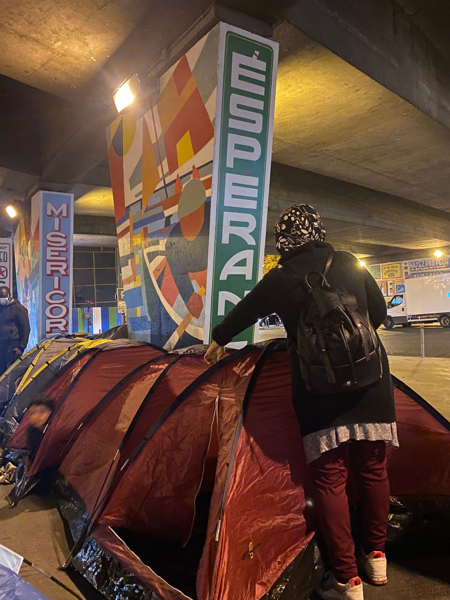
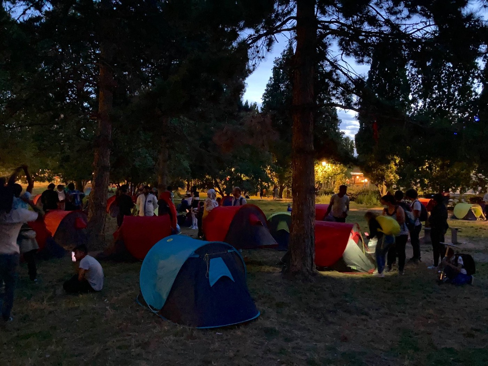

### AYS Weekend Digest 02–03\.10\.21: Horrific Detention Conditions for People Rounded\-Up in Libya

Lampedusa Day / 57 lives lost at sea / Pushbacks, Prisons and drug smuggling in Greece / Far\-right attack in Athens / Homelessness in Paris / Fake news in the UK and more …

 \. Invisible\. Thus 368 people died a few miles [\#Lampedusa](https://twitter.com/hashtag/Lampedusa?src=hashtag_click) that October 3rd 2013, without anyone helping them\. One of the most serious humanitarian catastrophes [\#Mediterranean](https://twitter.com/hashtag/Mediterranean?src=hashtag_click) in the 21st century, an open wound for those who still believe in humanity\. [\#3October](https://twitter.com/hashtag/3October?src=hashtag_click) [\#3ottobre](https://twitter.com/hashtag/3ottobre?src=hashtag_click) \)](assets/97d911e6a2e8/1*Q-8BloYcCyX5_zc3A7Q84g.jpeg)

\(Photo Credit: [Open Arms](https://twitter.com/openarms_found/status/1444661712809046018) \. Invisible\. Thus 368 people died a few miles [\#Lampedusa](https://twitter.com/hashtag/Lampedusa?src=hashtag_click) that October 3rd 2013, without anyone helping them\. One of the most serious humanitarian catastrophes [\#Mediterranean](https://twitter.com/hashtag/Mediterranean?src=hashtag_click) in the 21st century, an open wound for those who still believe in humanity\. [\#3October](https://twitter.com/hashtag/3October?src=hashtag_click) [\#3ottobre](https://twitter.com/hashtag/3ottobre?src=hashtag_click) \)
#### FEATURED: Horrific Detention Conditions for People Rounded\-Up in Libya

■■■■■■■■■■■■■■ 
> **[Andrea Gagne](https://twitter.com/AndreaGagne) @ Twitter Says:** 

> > Tripoli's Gargaresh area, home to a large community of asylum seekers and migrants, was raided yesterday by Libyan authorities. 4,000 people were arrested, as part of a crackdown on "illegal" immigrants. https://t.co/rnLq9GXT1V 

> **Tweeted at [2021-10-02 14:28:39](https://twitter.com/andreagagne/status/1444308352767496195).** 

■■■■■■■■■■■■■■ 

As we [reported on Friday](ays-daily-digest-01-10-21-while-eu-tussles-with-poland-over-pushbacks-commission-makes-deal-with-598e369c4bb0) , 4000 people have been detained in Libya\. During the roundup at least [1 person was killed and 2 more are in a critical condition](https://unsmil.unmissions.org/statement-united-nations-assistant-secretary-general-resident-and-humanitarian-coordinator-libya?fbclid=IwAR3ZJu6oKGTxfdadwS6guM5M1FF5rSKacumLMxqQFcLUn4z07LKsuZm9Imw) in hospital, many more are injured\. The operation, during which unarmed people were harassed in their homes, beaten and shot, also targeted women and children\.

Most people are now being arbitrarily detained in Al\-Mabani detention centre where they are not receiving medical care or being given adequate food or water\. Warning: The video below shows distressing images\.

■■■■■■■■■■■■■■ 
> **[Giulia Tranchina](https://twitter.com/GiuliaRastajuly) @ Twitter Says:** 

> > 2/ Some are suicidal. In this room there are many #Zintan survivors,dear friends of mine from years,who already spent 3-4 years in detention in [Libya.In](http://Libya.In) the other rooms there are also lots of #women and #children.Sick &amp; traumatised refugees registered with #UNHCR.. https://t.co/hKzySXauS8 

> **Tweeted at [2021-10-03 18:18:18](https://twitter.com/giuliarastajuly/status/1444728531746017292).** 

■■■■■■■■■■■■■■ 

Libya’s Directorate for Combatting Illegal Migration \(DCIM\) officers [have previously received human rights training from IOM](https://www.iom.int/news/libyan-government-officials-receive-human-rights-training-un-migration-agency) \.

■■■■■■■■■■■■■■ 
> **[Sara Creta](https://twitter.com/saracreta) @ Twitter Says:** 

> > #Libya 🎥 New evidence of harrowing violations, including violence &amp; abuses against #refugees &amp; #migrants trapped in Al-Mabani detention center. These are the DCIM officers &amp; militia supported + trained + legitimised by the EU to reduce migration to the continent. https://t.co/0SryBl7QPV 

> **Tweeted at [2021-10-03 10:17:45](https://twitter.com/saracreta/status/1444607598506938375).** 

■■■■■■■■■■■■■■ 

On the 8th of April 2021, guards in Al\-Mabani shot into the detention cells indiscriminately killing one and injuring two teenagers\. In [their report at the time MSF](https://www.msf.org/people-dead-and-injured-following-libya-detention-centre-shooting) stated they had treated 36 detainees for fractures, blunt trauma, abrasions, eye injuries, gunshot wounds and limb weakness in various detention centres in just one month\. All injuries had been sustained while in detention\. They described the conditions in Al\-Mabani as diabolical:

> As in many other detention centres, people detained in Al\-Mabani have minimal natural light and ventilation, insufficient food and clean drinking water, and a lack of hygiene facilities\. Severe overcrowding — with as many as three people per square metre — often leaves no space even to lie down\. Infectious diseases such as scabies and tuberculosis are rife\. Physical distancing in relation to COVID\-19 is impossible\. 

At the the start of last year, tensions in the centre in the build up to the shooting were high due to an increased number of returns leading to overcrowding\. A rise from 300 to 1000 occurred in just a few days\. The returns were obviously carried out by the Libyan Coast Guard, funded and trained by the EU\. The LCG were accused in July of [firing shots at a boat full of people](https://www.dw.com/en/ngo-accuses-libyan-coast-guard-of-shooting-at-migrant-boat/a-58131432) \. This did not deter the EU from funding them\. Just as IOMs understanding of DCIM practices did not stop them from training and therefore legitimising them\.

Who then, is responsible for these latest deaths?

SEA
#### Lampedusa Day

On the 3rd of October 2013 at least 368 people lost their lives in a terrible shipwreck off Lampedusa\. Today we have to report on more deaths\. [Lisa, a rescuer on that day](https://sosmediterranee.com/commemoration-of-lampedusas-shipwreck-how-many-more-words-will-have-to-be-written-before-a-european-search-and-rescue-operation-is-re-established-lisa-rescuer-at-sea/?fbclid=IwAR3KlQtF5lYhc_Vz36wpoqNJhivzJWBpqdoMazE80VQ7Vk9UDDnrcq6p388) asks:

> How many more words will be said? How much will we have to write about children, women and men trapped in Libya being repeatedly beaten, facing physical and sexual violence and being arbitrarily held captive? H **ow many more reports will be published of those dying in the central Mediterranean while trying to escape sufferings and brutalities we, as Europeans, can’t even imagine?** 

And so do we\.
#### French police fire at people trying to get to UK

On the subject of state bodies firing at civilians, the [French police were accused](https://www.dailymail.co.uk/news/article-10050681/Horror-Dunkirk-beach-French-police-open-fire-migrants-dinghy-rubber-bullets.html?fbclid=IwAR0mkSnSCTGVzxkJ16aKV_9LBSf7RSXmwgTRJWioZRJVz65uLKrD7i4p7Ts) this weekend of firing rubber bullets at 8 young men, putting two of them in hospital on September 22nd\. One young person suffered a fractured leg, the other a broken hand\.
#### Another Shipwreck, 57 lives lost

The boat was on route to the Canary Islands from Dakhla, in the Western Sahara\. Just before the shipwreck they had decided to turn back because they were lost\. 16 of the dead have been found and returned to Dakhla to be identified\. 12 of those who lost their lives were children\. Only five people from the boat survived\.

■■■■■■■■■■■■■■ 
> **[Alarm Phone](https://twitter.com/alarm_phone) @ Twitter Says:** 

> > ⚫️Another tragedy on #Canary route!

A boat with 62 people shipwrecked, leaving behind only 5 survivors. Among the dead are several children. These deaths could be avoided but European migration policies force people onto these deadly migration routes.

[nytimes.com/2021/10/01/wor…](https://www.nytimes.com/2021/10/01/world/europe/african-migrants-drown-canary-islands.html) 

> **Tweeted at [2021-10-02 16:46:12](https://twitter.com/alarm_phone/status/1444342967544819717).** 

■■■■■■■■■■■■■■ 

#### Arrivals

[Thirteen Tunisians](https://palermo.repubblica.it/cronaca/2021/10/02/news/lampedusa_mini-sbarco_di_13_migranti_e_una_pecora-320374101/?fbclid=IwAR15IImgOxadZiuK7R9N816DvB58zaIYi4lxq-gv87fampYbsCsOlnHb5Ps) , including two women, three children and **a sheep** , landed on Saturday night at the Favaloro pier in Lampedusa\.

[70 people](https://twitter.com/alarm_phone/status/1444358829244825602?fbclid=IwAR3Dret7tCDPwRhsYxx6bMp7vENRQ1szGClpxJSzWUW-AL817HHnCYwkXYg) are believed to have been transferred from Asso29, an Italian supply ship, to port at Lampedusa on Saturday\.

[On Sunday](https://www.huffingtonpost.it/entry/lampedusa-ricorda-il-giorno-piu-buio-altri-18-sbarchi-con-600-persone_it_6159b233e4b0487c85600fc2?fbclid=IwAR3u59rVFiUpxsgTeU_hX-zpYJyqX13uylRBkOrxOgv2VVL0YRMHP_TEdEI) , the anniversary of the shipwreck that killed at least 368 people, over 600 people arrived safely\.
#### Returns

[A further 70 people](https://twitter.com/alarm_phone/status/1444222596812247041?fbclid=IwAR2Bbv-HWbEHRf8sZ-WwCcqYGNZnG5trlBaDm8ZHsWGFTjDEoHtMcIjPpuI) who had been in Maltese waters have not been heard of for four days, but are thought to have been returned to Libya\.

Also on Saturday, [UNHCR report that 89 people](https://twitter.com/UNHCRLibya/status/1444270377748865028?fbclid=IwAR0n11Ha8BgL0tEvW6sPYaIJBUVtXq398BEkYJLfi07GCpyjtstsdk80WbU) , including 8 women and 3 children, were brought back to Tripoli along with 2 bodies\.

On Sunday, [LCG returned](https://apnews.com/article/business-middle-east-africa-libya-migration-7b53aa26118937f0c0c88e3297d59bcd?fbclid=IwAR2blwEai8zvV4uWDtCLi5kWV-s5HneI8f3DTO5aoVqtnPbh-689-biTIHw) two boats carrying more than 550 people\.
#### Missing/in need of rescue

[40 people are missing](https://twitter.com/UNHCRLibya/status/1444270377748865028?fbclid=IwAR0n11Ha8BgL0tEvW6sPYaIJBUVtXq398BEkYJLfi07GCpyjtstsdk80WbU) after the group set off on the hazardous journey from Libya\.

[49 people are in an overcrowded boat](https://www.facebook.com/watchthemed.alarmphone/posts/3051869708420585) , adrift & in need of immediate rescue\! They also gave us an updated position showing they are deep in \#Malta’s SAR zone\.

> 16h since our first alert to authorities, ~49 people are still drifting in the Mediterranean Sea\. No rescue has been launched yet\. We urge [\#Malta](https://www.facebook.com/hashtag/malta?__eep__=6&__cft__[0]=AZWJUtiSRfiOTGQ4Q4eBfDccFdgF1g7Oyi7hW2S-A5AiQbX0ifO1wBpC84SF9M2JMzv0WxN5jLV28TdBf90QGCVcZuz5rjgifZ2utlNkjFpah8wD1iRv_w7tqXxRptVdcA_8oZmgVe37yMpO_06bDd3D&__tn__=*NK-R) and [\#Italy](https://www.facebook.com/hashtag/italy?__eep__=6&__cft__[0]=AZWJUtiSRfiOTGQ4Q4eBfDccFdgF1g7Oyi7hW2S-A5AiQbX0ifO1wBpC84SF9M2JMzv0WxN5jLV28TdBf90QGCVcZuz5rjgifZ2utlNkjFpah8wD1iRv_w7tqXxRptVdcA_8oZmgVe37yMpO_06bDd3D&__tn__=*NK-R) to fulfil their responsibilities to coordinate a SAR operation & to rescue now\! 

GREECE
#### Pushbacks, Prisons and Drug Smuggling

[Racist Crimes Watch](https://racistcrimeswatch.wordpress.com/2021/10/02/1-1245/?fbclid=IwAR0vQVDjT0ENIYA-SkxZfOyEl5dMVc4JNjbkcCy1uqYCGsOv158w-PTljp0) report that there have been four rescues of 9 people by the Turkish Coast Guard during September, all of whom had been pushed back from Greece\. Amnesty’s director, [Glykeria Arapi](https://www.news247.gr/sunday-edition/dieythyntria-diethnoys-amnistias-ta-pushbacks-tis-elladas-viaia-paranoma.9373110.html?fbclid=IwAR3ZJu6oKGTxfdadwS6guM5M1FF5rSKacumLMxqQFcLUn4z07LKsuZm9Imw) , has called such pushbacks violent and illegal\.

The government have allowed in a tokenistic number of [Afghan refugees, 127 people on Friday](https://www.irishexaminer.com/world/arid-40711208.html?fbclid=IwAR1gm0pHeIkAJhLq1OFuyNMiu_mmK14-48miu_yZ1VJP23SvzbYKBRmccn8) , who will remain in Athens until they are relocated\. These people are female Afghan judges and lawyers along with their families and while it’s true that they definitely need asylum many others will face much greater hurdles in escaping Afghanistan\. Those people will likely end up in prisonlike facilities such as the new camp on Samos which Mitsotakis visited on Friday \(see our special on the new camp [HERE](ays-special-from-samos-a-new-hotspot-to-keep-refugees-out-of-sight-out-of-mind-bf2013202840) \) \.

The 146 of the people hosted in Kalathas Camp, Crete, are expected to be transferred to accommodation facilities in Attica\. The remaining 6 people are currently in isolation\. All are from the rescue operation on the 24th of September by a tanker off the Messinian Coast\. Their original destination was Italy\.

Meanwhile, a Coast Guard officer, who also happens to be a liaison officer for Frontex, has been [arrested for drug smuggling](https://twitter.com/lk2015r/status/1444303723493199876?fbclid=IwAR3Maz6cihPVMaxtshU16ueGfJ8ATnuM-8qb_XYYX2Q88PDjvP2GFZVy7tM) \. Is that what the Greek PM meant when he said that smugglers had been “crushed”?
#### Far\-Right attack on anti racist event

[KEERFA \( Movement Against Racism and the Fascist Threat\)](https://www.facebook.com/keerfapage/) ,were attacked by a group of far\-right Golden Dawn members on Sunday, October 3, at their event in Athens\. The event was organized to commemorate the one year anniversary of the historic culmination of the Golden Dawn trial and their categorisation as a terrorist organisation\. Those present included people from Malakasa camp\.

Before the start of the event, a group of 15–20 people KEERFA members with batons and helmets\. Four people were injured and transferred to Evangelismos hospital\.

> They staged Nazi\-style salutes as there were orders given to start and to end the attack\. Among the injured is the journalist of Workers Solidarity and the municipal councilor of the Maroussi municipality, Aphrodite Frangou\. 

> \[…\] 

> The local ELAS \(Greek Police\) official openly stated that the order was given “from above” that the police discreetly “monitor” the situation from two blocks away from the square\. 

There will be two further demonstrations, one on Monday, October 4 at 7 pm at the Metro Square in Heraklion\. The next on Saturday, October 9 at 3pm in Omonia\.

■■■■■■■■■■■■■■ 
> **[Savvas Karmaniolas](https://twitter.com/savvaskarma) @ Twitter Says:** 

> > Yet another far-right attack took place in #Greece today following neonazi attacks in #Σταυρούπολη, Thessaloniki, last week. 
This comes almost one year after Golden Dawn leaders were jailed for running a criminal gang
 https://t.co/cDLjpXCHV4 

> **Tweeted at [2021-10-03 17:34:14](https://twitter.com/savvaskarma/status/1444717441838469122).** 

■■■■■■■■■■■■■■ 

ITALY
#### Statement Against Lucano Sentencing

ASGI, an Italian legal firm, have released a statement expressing dismay at disproportionate sentences imposed by the Court of Locri against various defendants, including the former mayor of Riace Domenico Lucano\. Lucano received 13 years and two months for the management of the reception system in Riace until 2017\.

> **The sentence of the Court of Locri appears to be the criminalization of a non\-ghettoizing model of reception,** of an experiment that, although not unique, wanted to pose itself explicitly as an example of _otherness_ and _diversity\._ And this has happened in an extremely problematic territory, where criminal organizations are well rooted and where a large part of the economy is based on the intensive exploitation of labor, especially \(but not only\) foreign, in the absence of effective state intervention\. 

Unfortunately this is something we have seen all over Europe with the closures of housing projects, such as [PIKPA](ays-special-day-of-shame-on-lesvos-pikpa-under-eviction-348958025fd4) in Greece, which offered dignified and autonomous accommodation\.

FRANCE
#### Homelessness in Paris

 \)](assets/97d911e6a2e8/1*tavF6V7UPG8V5yTiGCktqw.jpeg)

\(Photo Credit: [Utopia 56](https://www.facebook.com/U56ParisIDF/posts/2745110725788370) \)

> Every night women, men and children from here or elsewhere sleep on the street\. Some people are sometimes weeks old and start their first steps in this world, others are older, often damaged by the years\. 

> Every night they call 115 in hopes of an emergency accommodation solution, but tirelessly, the state refuses to create places that meet real needs\. 

Utopia 56 report that there are [in need of more hosts in Paris](http://www.utopia56.com/fr/hebergement-solidaire-avec-utopia-56?fbclid=IwAR1Nk69Id1JmvOZKuVQCOgZzWMsETJO3d_IplV1Ex5THwsbkTu0eX48jt_w) \. Meanwhile they continue to support the children, women and men living on the streets with tens and blankets\.
#### Volunteer Call

[Solidarité migrants Wilson](https://www.facebook.com/Solidarit%C3%A9-migrants-Wilson-598228360377940/?__cft__[0]=AZUq958WVyV9ukCd67rU3eqHOvTX0yzLlZP-bH1_g0qgoHA78rX7XB0nh1Kd5sdkYRNtmOz4dPghxz4vgrFWUOJNEqLQjZ0iEwYbubRWHaIT0I1ey4AKNtEKbM0jg77GQ0Rd9A7uRMaXyQP4ZWLd1BlR&__tn__=-UC%2CP-R) need volunteers this week on Tuesday, Thursday and Saturday\. Time slots on the FB page\.

> Still 2000 meals to prepare and distribute again this week\! Without you, nothing will be done\! The collective is you, it’s me, it’s us\! 

BELGIUM
#### Protest in Brussels

■■■■■■■■■■■■■■ 
> **[Helena Malikova](https://twitter.com/HelenaMalikova) @ Twitter Says:** 

> > Street protest for clear rules on legal status and worker rights for the 150,000-200,000 undocumented people in Belgium. Many protestors calling for action to stop exploitive employers.
#wearebelgiumtoo https://t.co/BouDupnwMx 

> **Tweeted at [2021-10-03 13:54:33](https://twitter.com/helenamalikova/status/1444662158344822784).** 

■■■■■■■■■■■■■■ 

UK
#### Fake News

As is to prove that you can’t always believe what you read in the papers, [The Sun published a story](https://www.the-sun.com/news/3782460/migrants-crossing-channel-detained-albania/) this weekend stating that people who cross the channel in small boats will be sent to Albania for “processing”\. Happily, the Albanian Government strongly deny this claim\.

■■■■■■■■■■■■■■ 
> **[Olta Xhaçka🇦🇱](https://twitter.com/xhacka_olta) @ Twitter Says:** 

> > Albania will proudly host 4000 afghan refugees based on its good will, but will never be a hub of anti-immigration policies of bigger and richer countries. We have instructed our Embassy in the UK to demand the retraction of this fake news 

> **Tweeted at [2021-10-03 12:08:29](https://twitter.com/xhacka_olta/status/1444635465588645889).** 

■■■■■■■■■■■■■■ 

#### Real News

[12 Afghan families](https://www.devonlive.com/news/devon-news/how-devon-town-opened-heart-5998713?fbclid=IwAR1mdhzOSW3n097pI6LADxXBktbdhgGp68cXz6MQkKJ0vyovNzPFkbCR_SE) who have been moved to Exmouth in Devon and [64 people on the move who are living in Brighton](https://www.sussexlive.co.uk/news/sussex-news/no-shoes-clothes-money-journey-5998886?fbclid=IwAR0ubl3QOa_pNp08c7h-fkqjrPsR9K39amJYKE1FS1gfaf3QSVqFe_AoYtw) have all been welcomed by locals\. Despite the fact that the government only gives people living in an accommodation structure 8 pounds a week \(and bearing in mind that they are not allowed to work\)the conclusion remains that if people were allowed to come to the UK safely and settled there, nothing bad would happen\.

WORTH READING

[**Frontex: 16 years of a humanitarian and political disaster**](https://abolishfrontex.org/blog/2021/10/03/frontex-16-years-of-a-humanitarian-and-political-disaster/?fbclid=IwAR0Ke-Il5bN_qWqRX-frhoYjlEM-91iILosx2x4Vp12f3_f8u3NwfD7BQn0) by Abolish Frontex — “Sunday 3 October 2021 marks the anniversary of the death of over 360 people on the move, during a shipwreck off Lampedusa in 2013, and as such is a day of commemoration\. Also on this day, in 2005, the EU Border and Coast Guard Agency Frontex started operating in the Polish capital Warsaw\. This is not a reason for celebration or festivities: Frontex has left a track record of death and destructed lives in its sixteen years of existence\.”

[**Paris: At this school, undocumented minors find their way back to education**](https://www.infomigrants.net/en/post/35447/paris-at-this-school-undocumented-minors-find-their-way-back-to-education?fbclid=IwAR2QlF48aqgXtrva8hGhF80pk2mGy1qfjjiRMX_V4q-OWehhIcODC61IS4Q) **— A good news story\!** “They are very motivated, it’s an escape for these young people who have lived for months or even years on the road to exile,” says Sylvie\. Most of them are now housed in social hostels thanks to associations such as Médecins Sans Frontières \(MSF\) or Utopia 56, after having spent several months in tents in the camps of northern Paris\.”

[**Samos: Where Europe lost its values and moral responsibility**](https://www.aljazeera.com/opinions/2021/10/2/samos-where-europe-lost-its-values-and-moral-responsibility?fbclid=IwAR3ZJu6oKGTxfdadwS6guM5M1FF5rSKacumLMxqQFcLUn4z07LKsuZm9Imw) — “A new prison\-like camp on the Greek island of Samos marks a dangerous turn of European migration policy\.”

WORTH ATTENDING

[**Archive of Refuge**](https://www.hkw.de/en/programm/projekte/2021/archiv_der_flucht/start.php?fbclid=IwAR3UyRXa0eVlEKeJS2dLh0dF8nf2m9nSacGsCPn-TJ2AyVBUvZdP2Ovwc60) **Installation in Berlin— “** What forms of remembrance are needed in today’s societies shaped by migration? This oral history project concerns itself with the memories of people migrating to Germany as an integral part of German post\-war history, seeking to protect them from being forgotten and suppressed\.” More info [HERE](https://www.infomigrants.net/en/post/35443/refugees-in-germany-tell-their-stories-in-archive-of-refuge?fbclid=IwAR3UyRXa0eVlEKeJS2dLh0dF8nf2m9nSacGsCPn-TJ2AyVBUvZdP2Ovwc60) \.

**Find daily updates and special reports on our [Medium page](https://medium.com/are-you-syrious) \.**

**If you wish to contribute, either by writing a report or a story, or by joining the info gathering team, please let us know\.**

**We strive to echo correct news from the ground through collaboration and fairness\. Every effort has been made to credit organisations and individuals with regard to the supply of information, video, and photo material \(in cases where the source wanted to be accredited\) \. Please notify us regarding corrections\.**

**If there’s anything you want to share or comment, contact us through Facebook, Twitter or write to: areyousyrious@gmail\.com**

_Converted [Medium Post](https://medium.com/are-you-syrious/ays-weekend-digest-02-03-10-21-horrific-detention-conditions-for-people-rounded-up-in-libya-97d911e6a2e8) by [ZMediumToMarkdown](https://github.com/ZhgChgLi/ZMediumToMarkdown)._
