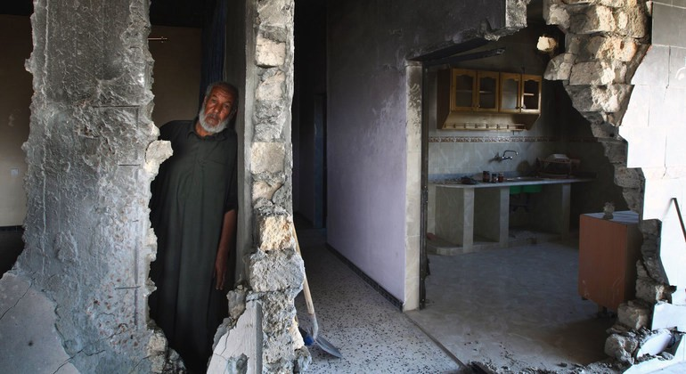
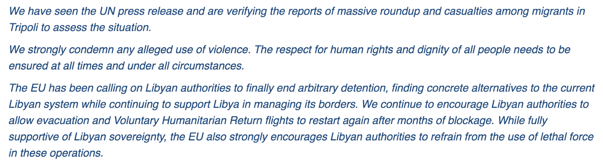

### AYS Daily Digest 4/10/21: What will follow UN’s conclusions on Libya?
#### weaponising drones in the Frontex mission / Poland to try and send humanitarian convoy to Belarus, while weather worsens and pushbacks continue / Mixed Migration Update & recommended reads

#### FEATURED

**_From arbitrary detention to torture, the recruitment of child soldiers and mass killings, the Independent Fact\-Finding Mission on Libya listed numerous grave rights violations which had impacted the country’s people and which gave them “reasonable grounds” for the war crimes allegations\._**

[The UN](https://news.un.org/en/story/2021/10/1102052?fbclid=IwAR2zPn31mnmwJ39O3uTSXPpKNfhTyhxwa67tAn1i1MYSAWsoFy2cRn0Ow9Y) has confirmed what many reports previously clearly stated on Libya, that what has been taking place there may also amount to crimes against humanity\. Their appointed independent investigators highlighted violence against migrants, refugees and other vulnerable minorities including LGBTQi individuals\.

> “Our investigations indicate that violations against migrants are committed on a widespread scale by state and non\-state actors, with a high level of organisation and with the encouragement of the state — all of which is suggestive of crimes against humanity\.” 

However, what is missing here are the follow up actions by the European Union, given their collaboration with the Lybian Coast Guard and practically the whole ring of violence\. Here is what the journalist Sally Hayden got as an answer to the question on whether the EU would now reconsider \(at least\) their support of the Libyan coastguard in the wake of the Tripoli raids & the findings of the UN Human Rights Council\-commissioned fact\-finding mission:

EU spokesperson statement via Sally Hayden

On the contrary, the EU continues the collaborative nature of their relation to Libya in different ways\. Greek Coast Guard is to train Libyan counterparts as part of expansion of bilateral ties, latest reports from the recent diplomatic visit [say](https://greekcitytimes.com/2021/10/04/greek-coast-guard-libyan-expansion/) \.

The returns to Libya [continue](https://www.irishexaminer.com/world/arid-40712507.html?fbclid=IwAR3E7Lafa3CFPAp4uD0wb1g5BmSfvX9QPDsWMQ-04oLdD-NIamPMDpA8C3E) and as of September 25, more than 25,000 people had been intercepted by the EU\-trained and equipped Libyan coastguard this year and returned to hell there\.

Similarly to the case of European support to Libya through their aid to the Libyan Coast guard, the so far ‘secret’ [cooperation agreement](https://www.middleeastmonitor.com/20211004-egypt-will-accept-returned-refugees-in-exchange-for-military-security-incentives-from-italy-sources-say/?fbclid=IwAR1orDpOR2qXlR2fW6W05GkX2Uuy75TCKn-gfx269kwSEq38pTMfS2Xw8CI) between Egypt and Italy in which Cairo will “continue to accept returned refugees attempting to reach Europe in exchange for military and security incentives from the European country” will allegedly be improved and continued\. That support and collaboration has made it possible for Egypt not to be under scrutiny for human rights record and abuses\.
#### EU
### A “next generation” drone for land and sea military operations, and for “civilian, law enforcement use”

“Weaponization” of the drone that was for a long time spoken about when it comes to uping the game at the border “is at least envisaged” in the project proposal mentioned and investigated by Statewatch, and additional funding will [reportedly](https://www.statewatch.org/news/2021/october/next-generation-armed-drone-with-police-potential-tipped-for-eu-financial-backing/?fbclid=IwAR1OCBqLZNK-R6S0WYItAm1fIHy0eeIymTp8HD9vQmBVUWIx6BHbjFFBKbE) be sought from the €8 billion European Defence Fund for the development of sub\-systems with which the drone could be equipped, including “guided micro high precision munitions”\. Having come up with the proposal that is now being taken into consideration, the Spanish army would also “contribute in\-kind \(facilities and military personal\) for the test of the systems, both partially \(sub\-systems\) and flying the demonstrator\.” 
Although Frontex has much larger apetites for their surveillance, they deny that the equipment they use is equipped for discovering the location of mobile or satellite phones, even though they seem to be interested and in touch with companies that sell devices that monitor precisely that, reportedly even without network coverage, as Matthias Monroy noted\. It is up to us to follow up on what the agency we all fund is doing and what that is doing to the people\.
As Frontex is also present and deployed in the Belarus\-Poland border area, the Agency’s executive director has been visiting and inspecting the Polish\-Belarusian border, allegedly being “impressed by means deployed to secure border”, regardless of the recent deaths and ongoing pushbacks taking place:

■■■■■■■■■■■■■■ 
> **[Tomasz Bielecki](https://twitter.com/TomaszBielecki) @ Twitter Says:** 

> > Frontex po wizycie swego szefa na granicy chwali PL. A milczy o kontrowersjach. Taki klimat w Europie... [frontex.europa.eu/media-centre/n…](https://frontex.europa.eu/media-centre/news/news-release/frontex-executive-director-visits-poland-s-border-with-belarus-LAS4dG) https://t.co/UUw4SBjXKN 

> **Tweeted at [2021-10-05 13:49:16](https://twitter.com/tomaszbielecki/status/1445385603433046031).** 

■■■■■■■■■■■■■■ 

In other news, Frontex is also ignoring the European Parliament, which Frontex had already twice — in April and again in June — [asked to drop its monetary claim](https://fragdenstaat.de/blog/2021/05/04/excessive-fees-parliament-frontex/) towards the group FragDenStaat\. Parliament warned Frontex that legal threats like this one have a deterrent effect on civil society\. 
[Read more\.](https://fragdenstaat.de/blog/2021/10/01/frontex-kosten-parlament-ignoriert/)
#### BELARUS

_“We understand that people who, consciously or unconsciously, are in a difficult situation often become the instrument of these aggressive actions in Belarus_ ,” the Polish deputy minister said on the occasion of their plan to send help to belarus for people on the move\. He reportedly added that Poland has “taken a number of diplomatic measures in the countries of origin of these migrants so that the authorities there inform people that they may become victims of fraudsters or instruments of Lukashenka’s aggressive policies,” stressing that providing assistance to people on the move in Belarus is for Poland an exclusively humanitarian issue, while the policy towards the Lukashenka regime does not change in any way\.

_Taking into account the humanitarian aspect of this crisis — although Poland is not the cause of it, but we are a democratic state based on certain principles and values ​​\- we want to show our readiness to support these people who are in a difficult situation\._

The first trucks will leave the warehouse center this Tuesday and head to the border in Bobrovniki\. They send tents, beds, blankets, linen, while hygiene products were allocated from the fund’s reserves\. Also, they are ready to deliver food, medicine and other necessary things to the border, but first are awaiting the decision of the Belarusian side to pass the humanitarian convoy\. The last time the Poles tried to bring humanitarian aid for people on the move to Belarus was on August 22, and then their trucks were not allowed at the border\.

Orange alarm is announced in the area — strong winds in Belarus, in the night between 1 and 6 degrees, presenting additional dangers for the people on the move\.
#### DENMARK
### 2 instead of 3 years for family reunification

Denmark is to reduce the amount of time refugees need to wait before apply for family reunification after The European Court of Human Rights ruled that the current “three\-year rule” was excessive, media [reported](https://www.euractiv.com/section/politics/short_news/greece-the-neo-nazi-snake-wakes-up-again/?fbclid=IwAR01LuX1J2aAA1fkwolKWE5VPmb1E9BTEq8YmogzK2XpZIvR4keBcijIcaE) \.

> The European Court of Human Rights stated that Denmark’s three\-year waiting period has not “struck a reasonable balance between, on the one hand, the applicant’s interest in being reunited with his wife in Denmark and, on the other hand, society’s interest as a whole in being able to control immigration in order to protect the country’s economic well being, to ensure effective integration and to maintain the cohesion of society\.” 

In a [press release](https://uim.dk/nyhedsarkiv/2021/oktober/nyhed/) issued on Friday, the immigration ministry said that it would next year submit a bill amending the country’s immigration law to reduce the length of time people need to wait before applying for family reunion from three years to two\.
#### UK

After [the Sun](https://www.thesun.co.uk/news/16313127/migrants-crossing-channel-detained-albania/) published that British and Albanian governments are in talks to establish in Albania a center for “detaining all migrants seized in the Channel waters between France And the UK”, the Albanian Government has now denied such claims\.

> Olta Xhacka said that any suggestion that her country would participate in such a scheme was “embarrassing”\. 

The idea came up some 3 years ago and, although such dislocated detention camp projects have been a constant part of the European \(and British\) securitisation politics, it seems this time the third countries did not agree to such an agreement, according to these [statements](https://l.facebook.com/l.php?u=https%3A%2F%2Fwww.independent.co.uk%2Fnews%2Fuk%2Fpolitics%2Fmigrants-flown-albania-asylum-processing-b1931430.html%3Ffbclid%3DIwAR3ShcG7nEHfYIzuuOgnB8DHszCzXl1jam1mahHc9r-mYP5oNE9ZD8hJyAc&h=AT2dNIWs_0zQeCGqTR5bAuPcWxx6MjDvRJCdDWOtFBiRVdX8mwGO5IzD9nUSKUU9TeviRkJvZR-ypXX-sqYSUM-ffEetq_5wRj4zr1rFRbw5Sh1JWHRypVoidvaGYcth1A&__tn__=%2CmH-R&c[0]=AT1NX73FMsrsGLlpwcdGnsQtrDZP_jwlwt08xkpsVvr-tvm_7LbwJzZzOcA_iu4FWcJxmYBGFrFpLawOfw0eVHGF7q-z3lLlA-y-mmsmw7Pp0Yb7j6uF4HTHY3aELbwka9-6KeFFtYZKlHmObkF9iYkL8V9ge3_m1Jqkz5LCUofhgEbQlg2x04xgcY37fuxl8NGlYyQ9Vl9w8yfepQo) \(for now\) \.

#### WORTH READING
- September 27\-October 4, 2021 Mixed Migration Update puts a spotlight on emergency measures that overcorrect for emergency situations, rather than develop the policy solutions that might deflect emergencies before they build up:

- The UK’s biometric scheme in the Borders Bill puts tens of millions of people, who don’t currently require any form of travel authorisation, at risk of discrimination and intrusion in their private family life, according to recent reports:

- read an interview with Maddalena Avon, our friend, comrade and activist from the Centre for peace studies in Croatia:

**Find daily updates and special reports on our [Medium page](https://medium.com/are-you-syrious) \.**

**If you wish to contribute, either by writing a report or a story, or by joining the info gathering team, please let us know\.**

**We strive to echo correct news from the ground through collaboration and fairness\. Every effort has been made to credit organisations and individuals with regard to the supply of information, video, and photo material \(in cases where the source wanted to be accredited\) \. Please notify us regarding corrections\.**

**If there’s anything you want to share or comment, contact us through Facebook, Twitter or write to: areyousyrious@gmail\.com**

_Converted [Medium Post](https://medium.com/are-you-syrious/ays-daily-digest-4-10-21-what-will-follow-uns-conclusions-on-libya-4801fb8cd550) by [ZMediumToMarkdown](https://github.com/ZhgChgLi/ZMediumToMarkdown)._
