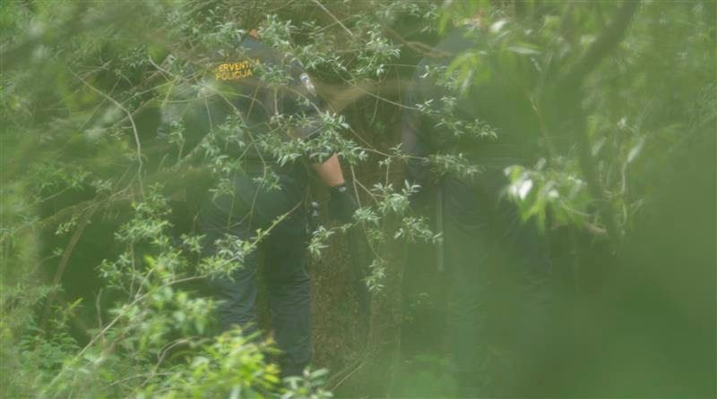

### **AYS Digest 06/10/21 — If you can prove it, at least it happened — Journalists’ work on EU borders’ violence to be released**
#### Greek Libyan border cooperation / Appeal against mass grave displacements in Italy / In solidarity with Mimmo Lucano / Clearing of Oulx / No\-visa\-policy against Afghans and more

Photo: DER SPIEGEL / Lighthouse Reports / SRF / Medienpartner
#### FEATURE

This comes as no surprise to anyone who is on their way from home to Europe, or to people working in the field over the last years and listening to the same stories again and again, but finally there is more evidence on the criminal and habitual structures of state forces soon to be released\. The spoken word of thousands can not be taken seriously until a video of 15 people experiencing border strategy is published\. So here it is, at last\!

Over nine months, investigative journalists from several major media outlets \(Der Spiegel, SRF, Rundschau, ARD Monitor, ARD Studio Wien, Libération, RTL Croatia, Novosti and Pointer and Lighthouse Reports\) have been working in secret to record proof of hard violations at the EU borders, especially Greece, Croatia and Romania, that have been denied by officials up until today\.

Speaking about the motivation to get traceable evidence into the major media:

> From the forests of the Western Balkans to the Aegean Sea consistent reports have emerged of physical assaults, illegal pushbacks, reckless endangerment and rights abuses of asylum seekers and migrants\. But the masked men operate in a grey zone of deniability which the considerable efforts of activists and other civil society actors have only been able partially to penetrate\. It is a thin veil that most informed observers can already see through but it has provided sufficient cover for the perpetrators to escape any meaningful accountability\. — [Lighthouse reports](https://www.lighthousereports.nl/investigation/masked-men/) 

The journalists have so far published several videos [from Croatia](https://www.tagesschau.de/thema/kroatien/) , showing the [illegal pushback](https://twitter.com/LHreports/status/1445814415446581259) from people forced back into Bosnia and Herzegovina and [masked men beating those people randomly](https://twitter.com/LHreports/status/1445814415446581259) :

■■■■■■■■■■■■■■ 
> **[Lighthouse Reports](https://twitter.com/LHreports) @ Twitter Says:** 

> > In total @LHReports &amp; partners filmed 11 pushbacks in Croatia. Drone footage shows a police officer covering his face with a balaclava before forcing at least 15 people over the border to Bosnia https://t.co/9IZQSIY1c6 

> **Tweeted at [2021-10-06 18:13:13](https://twitter.com/lhreports/status/1445814415446581259).** 

■■■■■■■■■■■■■■ 

■■■■■■■■■■■■■■ 
> **[Lighthouse Reports](https://twitter.com/LHreports) @ Twitter Says:** 

> > In Croatia, we filmed 1st ever high-res footage of a violent pushback at the border with Bosnia Herzegovina. Forensic examination of the video reveals that the men had equipment &amp; uniforms consistent with a branch of the Croatian police called Intervention Police https://t.co/48tWIyrtY6 

> **Tweeted at [2021-10-06 18:03:16](https://twitter.com/lhreports/status/1445811911816323073).** 

■■■■■■■■■■■■■■ 

B [etween May and September 2021 alone, the research team filmed eleven illegal pushbacks at five different locations along the Croatian\-Bosnian border\.](https://www1.wdr.de/daserste/monitor/extras/pressemeldung-pushbacks-100.html) A total of 38 police officers can be seen and 148 people are being pushed back across the green border, some of them with considerable force\.

Although the police don’t wear any official insignia, the men can be identified through their uniforms and equipment as members of the Croatian intervention police, which is under the authority of the Ministry of the Interior\. Six Croatian officials confirmed that they were members of the Croatian Intervention Police after reviewing the pictures\. Other officers, including a member of the intervention police, reported the pushbacks anonymously\.

Tracing and proving the connection with the Ministry of the Interior will be especially important now\. For years, the EU has been supporting Croatia in border security with money and equipment\. Meanwhile, the EU says that it “strongly condemns any pushback practices” and refers to a new, independent monitoring mechanism that Croatia has set up to detect and punish human rights violations\. This is mainly considered ineffective\. Visits to border posts have to be announced and the money meant for the mechanisms goes to the Croatian government, which is not interested in researching the human factor\.

> [Our reporting shows that these clandestine forces aren’t masked vigilantes but police units who report to EU governments\. The operations are denied in public but financed & equipped from EU budgets\.](https://twitter.com/LHreports/status/1445811879029272583) 

■■■■■■■■■■■■■■ 
> **[Lighthouse Reports](https://twitter.com/LHreports) @ Twitter Says:** 

> > The EU significantly finances Croatia’s border operations, including Koridor. Open source evidence reveals that Intervention Police who are part of Koridor stay at hotels along the border when they are on mission. Hotels &amp; per diems are paid out of the EU's Internal Security Fund https://t.co/scpvdQWxei 

> **Tweeted at [2021-10-06 18:13:32](https://twitter.com/lhreports/status/1445814495054635009).** 

■■■■■■■■■■■■■■ 

Other footage shows [illegal pushbacks from Romania to Serbia](https://twitter.com/LHreports/status/1445814415446581259) and illegal pushbacks at Sea, [conducted by the “Greek Coast Guard”](https://twitter.com/g_christides/status/1445814860218994694) \.

■■■■■■■■■■■■■■ 
> **[Giorgos Christides](https://twitter.com/g_christides) @ Twitter Says:** 

> > 4/ In Greece, more than 600 videos of pushback incidents at sea were analysed. Several involved masked men. Active and retired senior officers of the Greek coastguard who spoke anonymously said elite units of the HCG are involved. And that orders come from the very top. https://t.co/peNN7K2fW1 

> **Tweeted at [2021-10-06 18:14:59](https://twitter.com/g_christides/status/1445814860218994694).** 

■■■■■■■■■■■■■■ 

Although it covers the EU external borders, Europeans should be just as concerned about the police and military violence, theft, abuse and disrespect of European law that has been seen and reported en masse at borders within Europe as well… To find more detailed information on the French\-Italian border at the Mediterranean coast and state violence there, find reports from grassroot organisation Kesha Niya [here](https://keshaniya.org/2020/12/18/this-is-an-update-on-the-situation-and-our-work-shortly-before-christmas-2020-during-a-corona-pandemic-that-doesnt-stop-in-front-of-vulnerable-people-on-the-streets/) and [here](https://keshaniya.org/2020/12/28/new-report-we-have-listened-to-an-impressive-amount-of-violence-stories-in-this-week-of-christmas/) \.

Now it is up to the political and public response what will happen after the publication of clear evidence\. Maybe this will be enough to have everything captured on photos and videos to prevent the blind eyes at a political level\.

Meanwhile, the **Border Violence Monitoring Network** \(BVMN\) is sharing a **submission** made to the United Nations Special Rapporteur **on torture and other cruel, inhumane or degrading treatment or punishment\.** Focusing on Greece, the submission will inform the Special Rapporteur’s annual interim report which will be presented to the General Assembly in October 2021\. It also contains responses to questions posed by the Special Rapporteur, as well as core recommendations for attaining accountability\. Find it [here](https://www.borderviolence.eu/submission-to-the-un-special-rapporteur-on-torture-regarding-greece/) \.

LIBYA
#### Seventeen more deaths of people on their way to Europe

The [Libyan Red Crescent](https://twitter.com/LibyaRC/status/1445772257721077763) reports about [at least 17 bodies, likely of Europe\-bound migrants, washed ashore in western Libya\.](https://apnews.com/article/mediterranean-sea-europe-africa-north-africa-libya-c32a83226243ddc960cc9edd396355af) The location of the bodies was close to the city of Zawiya, one of the main centers of operations of the mafias dedicated to human trafficking in Libya\.

Current numbers state that at least **1100 people** have lost their lives or are presumed to be dead all along the Libyan coast this year\.

The 17 bodies have been handed over for burial\.

■■■■■■■■■■■■■■ 
> **[Jeff Crisp](https://twitter.com/JFCrisp) @ Twitter Says:** 

> > Libyan authorities are:
- intercepting &amp; returning refugees to the country;
- incarcerating them in abusive detention centres;
- complicit in human smuggling &amp; forced labour;
- blocking the evacuation of the most vulnerable.
A great 'migration partnership' with the EU! https://t.co/qrBl5y9nU2 

> **Tweeted at [2021-10-06 10:32:18](https://twitter.com/jfcrisp/status/1445698423361990676).** 

■■■■■■■■■■■■■■ 

Another voice and outrage on people’s pain and death: the multilingual Arte documentary [“Camps of shame — Europe’s Libya deal”](https://www.arte.tv/fr/videos/098815-000-A/libye-les-centres-de-la-honte/) \. It sheds light on the connections between militias, people smugglers and authorities: A well\-rehearsed system that capitalises on European politics — including the involvement of the United Nations\.

SEA
#### Complicity between Spain and Morocco about border control

leads to shifting migratory routes to the west\. These routes are longer, more dangerous, and more lethal\.

■■■■■■■■■■■■■■ 
> **[https://mastodon.social/@lunavives](https://twitter.com/lunavives) @ Twitter Says:** 

> > Map 1: #SAR ops in the Western Med (including Gibraltar &amp; Alboran sea). What do we see?

⭐️ Transfer of resp to #Morocco (Royal Navy) since 2019 👉 much fewer rescues in area of shared resp (light green) and almost none in Mor SAR zone (big change from before 2019). https://t.co/1qWT5YiPIP 

> **Tweeted at [2021-10-04 16:07:10](https://twitter.com/lunavives/status/1445057920992006148).** 

■■■■■■■■■■■■■■ 

#### Memorial day for Tunesians who are missing at sea

■■■■■■■■■■■■■■ 
> **[Sea-Watch International](https://twitter.com/seawatch_intl) @ Twitter Says:** 

> > Mothers, sisters and daughters remembered yesterday their relatives from #Tunisia who drowned or disappeared in the #Mediterranean.

A blanket of remembrance was spread yesterday in a square in #Lampedusa to mark the anniversary of the shipwreck on October 3, 2013, off Lampedusa. https://t.co/iphgGyskby 

> **Tweeted at [2021-10-05 14:01:15](https://twitter.com/seawatch_intl/status/1445388617493499909).** 

■■■■■■■■■■■■■■ 

We all remember the day of October 3, 2013, when a big vessel with approximately 545 people on board sank off of Lampedusa — most of whom drowned instead of being gladly rescued by Italian coast guards and fishermen\. Just several days later, more than 200 more people died in another shipwreck as a result of Italian and Maltese officials denying their responsibility to act or reacting too late\. An Italian vessel designed for rescue operations was within two hours reach but refused to accept the call for help from the boat and from the Maltese authorities\. To date, two Italian officers have been brought to court for their actions\.

At a [briefing on refugee sea rescue](https://www.freemovement.org.uk/refugee-sea-rescue-in-international-law-and-uk-law/) in different conventions of International Law, freemovement summarizes the different means of regulations and duties countries have agreed to and violated, including the 2013 case\.

> \[…\]the committee considered by a majority that both Italy and Malta had concurrently held jurisdiction over the boat despite it being outside the national territory of either country\. \[…\] Italy was considered to have breached its positive obligation to protect life\. There had been a failure to respond promptly to the distress call, a failure to dispatch the relevant naval vessel even once a formal request had been made by the Maltese search and rescue authorities, and a failure to explain telephone records indicating that the naval vessel had in fact been instructed to sail away from the vessel in distress\. 

freemovement adds that the committee members were significantly divided on critical issues of jurisdiction and responsibility\. International human rights law should be evolving further\.
#### Emergency rescue with monitoring vessel

RESQSHIP’s monitoring vessel Nadir [had to intervene](https://twitter.com/resqship_int/status/1445522264452046857) after witnessing a wooden boat with about 39 people standing idle in the Maltese SAR zone\. A baby and an unconscious woman were evacuated for immediate medical care, while the responsible MRCC Malta refused to help the other 37 passengers after repeated requests\. Eventually, Nadir took all the people from the boat, although Nadir is small and not prepared to serve as a rescue ship\. Half a day later, everybody could finally disembark safely in Lampedusa\.

■■■■■■■■■■■■■■ 
> **[RESQSHIP](https://twitter.com/resqship_int) @ Twitter Says:** 

> > 🟠 UPDATE: In the afternoon, the #Nadir was finally assigned a port of safety. Shortly after, all 39 people on board our monitoring vessel were able to disembark unharmed in Lampedusa. We are relieved that the people are now safe in Europe! #MonitoringTheMed https://t.co/eDCUMTZT9U 

> **Tweeted at [2021-10-06 17:53:00](https://twitter.com/resqship_int/status/1445809327319756802).** 

■■■■■■■■■■■■■■ 

While waiting for a safe harbour, the Nadir crew reported about another incident we have no further information on\.

■■■■■■■■■■■■■■ 
> **[RESQSHIP](https://twitter.com/resqship_int) @ Twitter Says:** 

> > 🔴 UPDATE: While #Nadir continues to wait for support, there is a new distress case in Maltese SAR zone: Over radio, a fisherman has been calling for help for a boat with ~60 people for hours. Water is entering the boat. Again, the lack of state help puts people's lives at risk! 

> **Tweeted at [2021-10-06 08:44:57](https://twitter.com/resqship_int/status/1445671408554557447).** 

■■■■■■■■■■■■■■ 

#### Boat in distress

Again in the Maltese SAR, Seawatch’s rescue ship [Seabird detects a boat](https://twitter.com/seawatch_intl/status/1445458984094212098?s=20) with about 60 passengers needing urgent help, as the weather is getting worse with waves up to 1\.60m during the night\. Neither Maltese nor Italian officials have reacted so far\!

GREECE
#### Greek Push Back Academy for Libya?

On Monday, the Greek government announced they would establish a training program for the so\-called Libyan Coast Guard, willing to support the country in its political decisions to build a closer relationship\. The request came from the Libyan side last weekend, when Greece’s Deputy Foreign minister Costas Fragoyiannis was visiting Tripoli — apparently, both countries agreed on the training but there has been no further formal agreement yet\. [According to Spiegel journalist Christides](https://twitter.com/g_christides/status/1445699884166770694) , Libyan “Coast Guard” officers have already been training at the NATO\-certified elite Maritime Interdiction Operational Training Centre at Crete\.

The meeting was meant to build a formation for the alliance of the two nations, including further economic and political cooperation, and continued a friendly dialogue between Libyan and Greek politicians that had already begun in August\. Back then, Greek Foreign minister Dendias was promising the Greek community in Libya [“to help as much as we can\. With our people, with our membership of the European Union, and we wish to retain our friendship with Libya and help Libya go forward and become a prosperous and stable country\.”](https://greekreporter.com/2021/10/05/greece-libya/) This is painful for everybody who underwent or who is undergoing torture, forced labour, sexual abuse and much more in Libya on their way to Europe, and everybody who has already had to return due to illegal push backs or pull backs from Greece to Libya\. It is also a shame for every EU country watching\.
#### All missing in Korinthos camp…

One of the camp inhabitants and library users of the ECHO refugee library project [reports on the current living conditions](https://www.facebook.com/refugeelibrary/posts/4445179348900357) in this camp close to Athens:

> From the beginning of this month most of the camp residents didn’t receive social money and the Greek Government has stopped giving the money for unknown reasons\. Instead, they are serving ready meals which are not good at all\. Often spoiled and no one is eating them, the recycle bins are full of food\. They can’t buy powder milk for kids, shampoos, soap, and other necessary things\. 

#### …but a new initiative to support reunions and mobility on Samos

Yesterday, Glocal Roots project was able to start with their [first bus service\!](https://www.facebook.com/GlocalRoots/posts/2128293160667179)

> We’ve rented a bus to offer free journeys for women and their children who live in the new closed camp, which is located in a remote area of the island\. 

> This allows them not only to visit our center, but also to reach the hospital, supermarkets and all other services that are now not available to them in walking distance\. 

> We are glad to cover travel costs for as many women as possible to enjoy an afternoon outside the prison\-like camp, that has been open for almost one month\. 

#### Group of 25 asking for help on Samos

25 people who arrived on Samos during the night contacted Aegean Boat Report this morning, asking for help so they won’t be pushed back\.

Parts of the group are now hiding in the woods\. On Samos, or any other island for that matter, there is nobody, no organization, no NGOs, no volunteers, journalists or lawyers, who would go to a location to help people who have just arrived, not even to document their presence\.

If anyone did and the police found them, they would be arrested on site, charged with facilitating illegal entry to Greece, obstruction of police investigations and whatever other charges they might come up with\.

> [We hope the new arrivals somehow will find their way to a camp, but we realize, without any help, they will be back at sea, before the day has ended\.](https://www.facebook.com/AegeanBoatReport) 

#### Suspects in Crete attack on migrants face fresh charges

[Four suspects of the seven accused men that attacked 13 migrant farm workers in August face additional charges of attempted manslaughter and longer prison sentences if found guilty\.](https://www.ekathimerini.com/news/1169146/seven-suspects-from-attack-on-migrants-in-crete-face-fresh-charges/)

All seven have reportedly admitted to barging into the homes of Pakistani laborers in the village of Agios Georgios after an evening of heavy drinking and beating them viciously\. Almost all of the victims of the attack had to seek medical treatment at a local health center\.

The three suspects who have not testified completely yet will appear before the court on Friday\. The seven suspects also face charges for wielding illegal weapons, destroying private property and shooting firearms into the air\.
#### Protests

■■■■■■■■■■■■■■ 
> **[Solidarity with migrants](https://twitter.com/MigrantsSoli) @ Twitter Says:** 

> > Ανοιχτή συνέλευση σήμερα 06/10 στις 18.30 στα Ζιζάνια (Φυλής και Φερών). 

Open assembly today October 6th at 18.30 at Zizania (Fylis and Feron).

#antireport https://t.co/gxuHRvC3Y5 

> **Tweeted at [2021-10-06 10:47:01](https://twitter.com/migrantssoli/status/1445702127372832771).** 

■■■■■■■■■■■■■■ 

■■■■■■■■■■■■■■ 
> **[Savvas Karmaniolas](https://twitter.com/savvaskarma) @ Twitter Says:** 

> > Protest against the ‘World Border Security Congress’ in Athens. Police blocks the way to the building hosting the event.  #Greece https://t.co/8FKs6eG7t3 

> **Tweeted at [2021-10-05 16:07:02](https://twitter.com/savvaskarma/status/1445420271972884483).** 

■■■■■■■■■■■■■■ 

ITALY
#### Appeal against displacement of migrants bodies to mass graves

Don Mussie Zerai, an Eritrean priest and activist, [is fighting for dignified rest for dead migrants and the needs of their dependents](https://www.ansamed.info/ansamed/it/notizie/rubriche/cronaca/2021/10/05/migranti-appello-don-zerai-non-spostare-salme-da-cimiteri_3bf52c7a-2580-494e-8ec5-be4f6c489566.html) \. He has launched an appeal to all Sicilian prefectures and municipalities that have received the bodies of migrants “to let them rest in peace where they were originally buried”\. He is reacting to the decision of some municipal cemeteries to move bodies to mass graves, which doesn’t necessarily entail informing family and friends of the deceased\. Several bodies have reportedly been moved to mass graves, without being sensitive to relatives’ needs and their wish for a place to mourn after traveling a long distance to visit the grave where they believe they will find their loved one\(s\) \. This has happened to two women who travelled to Sicily to visit the grave of their sister, one of the many victims of the shipwreck in October 2013\. Their sister’s body had been moved without any notice\.

> The right of the dead to rest in peace without being shunted here and there, and the right of families to know that their loved ones are safely buried without anyone desecrating their graves, is sacred\. \[…\] The relatives of the dead migrants continue to ask for identification and even in these hours they are doing DNA tests\. \[…\]— Don Mussie Zerai 

#### **One week after court decision on Mimmo Lucano \#Europemustact**

Europewide, there are still big reactions to the 13\-year prison sentence for the former mayor of the small municipality Riace\. His continuous efforts turned a disappearing, depopulated town upside down by supporting the community to grow and create together, integrating people in all the processes of village life and providing individual housing — over the years well known as the “Riace modell”, attracting interested people from all over the world and serving as a role model for many other towns\.

[“I have no words, I didn’t expect it,’’ Lucano told reporters after the sentence\. “I spent my life chasing ideals, I fought against the mafia; I sided with the last ones, the refugees\. And I don’t even have the money to pay the lawyers … today it all ends for me\. There is no justice\.”](https://www.theguardian.com/world/2021/sep/30/pro-refugee-italian-mayor-sentenced-to-13-years-for-abetting-migration)

_Europe must act_ is calling for action: “Lucano was accused of irregularities in managing the reception and integration project for refugees\. However, Italy and the whole of Europe are shocked by the disproportionality and harshness of the sentence\. We stand in solidarity with Mimmo Lucano and are extremely concerned by the fact that a person who acted in complete solidarity with refugees and fighting for virtuous ideals has been punished as a criminal\.”

Find the immense petition in solidarity with Mimmo Lucano, but you should also speak of anybody else criminalised for acting in favour of welcoming and including displaced people, [here](https://www.change.org/p/domenico-lucano-mimmo-lucano-we-stand-by-you) \.

> [“If it is a crime to help those in difficulty, I plead guilty\.”](https://progressive.international/wire/2021-10-06-pro-refugee-mayor-mimmo-lucano-is-being-jailed-but-he-has-justice-on-his-side/en) 

#### **Another clearing of Oulx**

As several times before, the solidarity shelter of “Chez JesOulx” just next to Claviere at the French\-Italian border, [has been cleared by police\.](https://twitter.com/PensareMigrante/status/1445665957209260038?s=20) The squat and transit point provides any sort of help, from food, clothes and blankets to information on the mountain dangers, in an area infamous for risking and costing people’s lives, an opportunity to cross the border where tourists usually go skiing in deep snow\. The clearing happened just after another group of people on the move tried to make their way through the mountains\.

SWITZERLAND
#### **A mere fraction of Afghan visa requests is positive**

[Switzerland has received around 7,800 requests from Afghans](https://www.srf.ch/news/schweiz/nach-taliban-machtuebernahme-menschen-aus-afghanistan-erhalten-kaum-humanitaere-visa) , most of them for humanitarian visas & family reunification, but so far only three have been approved\. The secretary for migration justified its action by stating that only these three requests met the requirements for the issuance of a humanitarian visa\. The Taliban’s seizure of power alone was not sufficient reason for such a visa\. While the secretariat is just the first, non\-formal stage of applying for a visa in Switzerland, it describes the willingness to act in an immediate, humanitarian way pretty well\. While Switzerland is a sovereign country and therefore quite able to issue visas as needed, politicians plead for help “on site” \(meaning in Afghanistan\) \. And anyways, it would be too risky to have a visa procedure without being able to identify “on site” \(meaning Switzerland\) “who those people are\.”

FRANCE
#### **Evictions in the north**

“As weather conditions worsen, State harassment at the French\-British border intensifies\. In three days, Prefecture 62 organised 14 expulsions of living spaces in Calais\. Each time, tents and tarpaulins are destroyed by the cleaning team\.”

■■■■■■■■■■■■■■ 
> **[Human Rights Observers](https://twitter.com/HumanRightsObs) @ Twitter Says:** 

> > Alors que les conditions météorologiques se dégradent, le harcèlement de l'#Etat à la #frontière franco-britannique s'intensifie. 

En 3 jours, @[Prefet62](https://twitter.com/Prefet62) a organisé 14 #expulsions de lieux de vie à #Calais. A chaque fois, tentes et bâches sont détruites par l'équipe de nettoyage. https://t.co/iTShiavfmZ 

> **Tweeted at [2021-10-05 17:10:51](https://twitter.com/humanrightsobs/status/1445436333900632069).** 

■■■■■■■■■■■■■■ 

UK
#### **Asylum seeker right\-to\-work policy declared unlawful, again**

[There has been another successful challenge to the policy for asylum seekers](https://www.freemovement.org.uk/asylum-seeker-right-to-work-policy-declared-unlawful-again/?utm_source=rss&utm_medium=rss&utm_campaign=asylum-seeker-right-to-work-policy-declared-unlawful-again) undertaking paid work\. People seeking asylum in the UK are generally [prohibited from working](https://www.freemovement.org.uk/can-asylum-seekers-work-in-the-uk/) \. Some asylum seekers are allowed to work if there is a lengthy delay in resolving their claim, but only on jobs on the Shortage Occupation List\. The present case challenged an Act from 2009 that failed to comply with the [best interests of the child duty](https://www.freemovement.org.uk/best-interests-of-children-in-immigration-cases/) \. The Justice identified a paragraph that effectively tells Home Office officials that refusing permission to work will not have a negative effect on any child, which is obviously wrong and would lead caseworkers to ignore the need to fully consider the impact on any affected child\. The judge concluded that this version of the Act is unlawful\.

WORTH READING
#### A Lonesome Journey to Freedom: The Hidden Struggles of LGBTQ Refugees\.

Detailed [Article by Arrowsmith Press](https://www.arrowsmithpress.com/lgbtq-refugees) , about a topic often put to the side\.

**Find daily updates and special reports on our [Medium page](https://medium.com/are-you-syrious) \.**

**If you wish to contribute, either by writing a report or a story, or by joining the info gathering team, please let us know\.**

**We strive to echo correct news from the ground through collaboration and fairness\. Every effort has been made to credit organisations and individuals with regard to the supply of information, video, and photo material \(in cases where the source wanted to be accredited\) \. Please notify us regarding corrections\.**

**If there’s anything you want to share or comment, contact us through Facebook, Twitter or write to: areyousyrious@gmail\.com**

_Converted [Medium Post](https://medium.com/are-you-syrious/ays-digest-06-10-21-if-you-can-prove-it-it-happened-at-least-journalists-work-on-eu-borders-6b1a2b930396) by [ZMediumToMarkdown](https://github.com/ZhgChgLi/ZMediumToMarkdown)._
