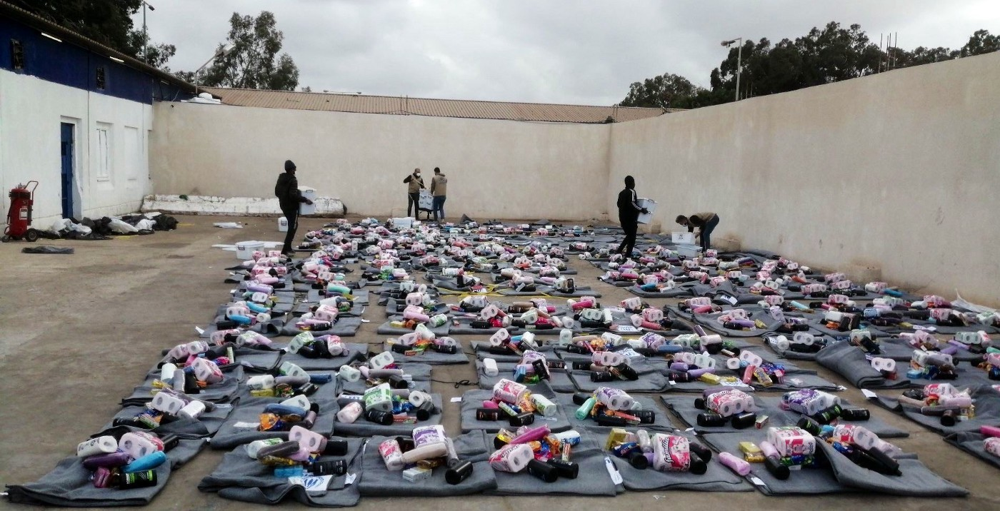
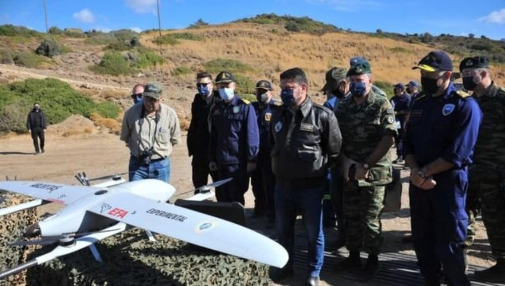
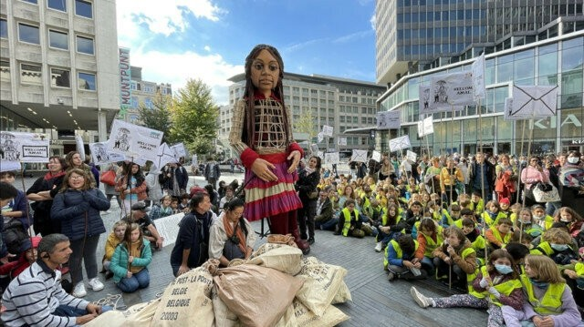

### AYS Digest 08/10/21: Six shot dead in Tripoli detention centre
### Eighth person dies on Polish border // Croatia admits pushbacks, fires officers // Serbian lawyer defending pushback victims wins UN prize // Greece’s ‘Turkey is a safe country’ decision brought to high court

[Are You Syrious?](?source=post_page-----7154dd1a6d85--------------------------------)

[Oct 9](ays-digest-08-10-21-six-shot-dead-in-tripoli-detention-centre-7154dd1a6d85?source=post_page-----7154dd1a6d85--------------------------------) · 12 min read
### FEATURE — Six people shot dead in Tripoli detention centre, thousands escape

Armed guards at the Al\-Mabani detention centre in Tripoli killed six people and injured at least 24 others when they opened fire on those detained there during an apparent “riot” and “escape attempt,” the IOM said in a [press release](https://www.iom.int/news/iom-condemns-killing-six-migrants-detention-centre-tripoli) \. Thousands of people have been arbitrarily rounded up in recent weeks across Libya and held in abysmal conditions in overcrowded detention centres, where they are subjected to random acts of violence by those guarding them\.

Before the shootings, more than 3,400 migrants, including 356 women and 144 children were held in the centre, according to the IOM\. In total, there are some 10,000 people currently held in Libyan detention centres\.

Doctors Without Borders \(MSF\) said in a [statement](https://www.doctorswithoutborders.org/what-we-do/news-stories/news/thousands-migrants-and-refugees-detained-violent-mass-arrests-tripoli) prior to Friday’s killings that the numbers of people held in the centres in Tripoli had tripled on the last five days, between October 1, during the violent mass arrests, and October 6\.

“We are seeing security forces take extreme measures to arbitrarily detain more vulnerable people in inhumane conditions in severely overcrowded facilities,” said Ellen van der Velden, MSF’s operations manager for Libya\.

“Entire families of migrants and refugees living in Tripoli have been captured, handcuffed, and transported to various detention centers\. In the process, people have been hurt and even killed, families have been split up and their homes have been reduced to piles of rubble\.”

[Reports](https://www.theguardian.com/global-development/2021/oct/08/reports-of-violence-libya-arrests-5000-migrants) of extreme physical and sexual violence have also surfaced\.

Some people, it seems, did manage to escape the Al\-Mabani facility in recent days, according to numerous eyewitness reports and videos cited in media\.

However, [Reuters](https://www.reuters.com/world/africa/shooting-libyan-migrant-detention-centre-kills-least-five-iom-says-2021-10-08/?fbclid=IwAR1IXymtxSEb9AdgEM6dkMUtgjNPsFn8t3o4RAHX8REHPuu3c9etkw_26JM) reported that Tripoli security forces said they had detained another 900 people following the escape, possibly including some of those who had managed to flee the centre\.

In its statement, the IOM condemned the “senseless killing” on Friday and called for Libyan authorities to stop using excessive force, end arbitrary detention and immediately resume the flights to allow people to leave Libya voluntarily\.

More than 1,000 people at Al\-Mabani had requested IOM’s Voluntary Humanitarian Return Assistance, the IOM said\.

“The use of excessive force and violence often resulting in death is a regular occurrence in Libyan detention centres,” says IOM Libya Chief of Mission Federico Soda\.

“Some of our staff who witnessed this incident describe injured migrants in a pool of blood lying on the ground\. We are devastated by this tragic loss of life\.”

For its part, the UNHCR [said](https://www.unhcr.org/news/press/2021/10/61601d7c4/unhcr-appeals-end-arrests-asylum-seekers-libya-calls-urgent-resumption.html) it was “increasingly alarmed by the humanitarian situation”, and called on authorities to “respect at all times the human rights and dignity” of the people on the move\.

The IOM and the UNHCR seem to be on the side of the people on the move, right? But let’s scratch deeper behind the surface here\.

Why are there so many people on the move in Libya in the first place — tens of thousands of people?

Irish journalist Sally Hayden has been reporting on migration in Libya for years now, and over the past week she has repeatedly — and correctly — zeroed in on the real problem here\. Because, after all, there wouldn’t be any people on the move for armed guards to kill in these detention centres, would there, if it weren’t for EU migration and border policies\.

Just a few days ago, the UN Human Rights Council [released](https://twitter.com/UN_HRC/status/1444992370341289986) a report saying that war crimes have been committed in Libya since 2016\. Now, human rights organizations are calling on the international community to suspend cooperation with Libya\.

The World Organisation Against Torture \(OMCT\) said the time had come for the international community to stand up to Libya — but also recognize its own complicity in the crimes of the Libyan government:

> _The EU\-backed Libyan Coast Guard continues to forcibly return and intercept at sea migrants and refugees attempting to cross into Europe, in violation of international refugee, human rights, and maritime law\. Migrants and refugees who are returned to Libya are subjected to serious abuses, torture, and degrading treatment in State facilities and elsewhere\._ 

> _We call on the international community to suspend cooperation with Libya pending their full compliance with international human rights and international humanitarian law and to work together to address irregular migration across the Mediterranean\._ 

Sally Hayden made a similar point here, painting a stark picture of the cyclical nature of the gross human rights violations in Libya — and the EU’s role in it:

When will this horrific cycle of violence end? It seems that without international pressure or accountability, Libya has no reason to stop the mass roundups of people, or release anyone from the centres\. The UNHCR, the IOM and the IRC, by working in the centres — distributing toilet paper, clothes, and other items to those held there, as depicted in the picture at the top of the feature — are complicit in what goes on there\.

The European Union, too, is complicit, but the bloc has no reason to cease its support of the Libyan coast guard\. In fact, standing up to the Libyans would likely cause Libya to stop preventing people from boarding boats to Europe\. And that, of course, is the last thing that Europe wants\.
### SEA
### Aita Mari held in Burriana
### GREECE
### HRW puts spotlight on criminalization of solidarity

A hearing held last week between the United Nations Special Rapporteur on Human Rights Defenders, Mary Lawlor, and 19 human rights activists in Greece “revealed the scale of the hostile environment civil society groups face working on migration in the country”, [wrote](https://www.hrw.org/news/2021/10/08/greece-activists-face-intimidation-threats-attacks?fbclid=IwAR1emg8B40mReQCd1WOANbgCwKxwva87oGDdZnj5y4dJT4O8FJwhjPRGoCM#) Human Rights Watch Greece research Eva Cossé on Friday\.

“I listened with great concern to the defenders’ accounts of intimidation, threats and physical attacks by right\-wing groups, as well as what appear to amount to smear campaigns against defenders in the media, allegedly instigated by MPs and police and involving the leaking of the defenders’ personal information, increasing their level of risk,” Lawlor said in a [statement](https://srdefenders.org/information/hearing-with-migrants-rights-defenders-in-greece/) following the hearing\.

As Greece faces more international criticism over pushbacks and the conditions in its refugee camps, the government has moved to “silence groups whose reporting is shining a spotlight on those abuses,” Cossé wrote\.

The European Commission, she said, needs to “step up its engagement over the issue and press Greece to stop harassing civil society groups and activists\.”

The hearing between Lawlor and the activists in Greece was recorded and can be viewed at [this link](https://srdefenders.org/information/hearing-with-migrants-rights-defenders-in-greece/?fbclid=IwAR3chISSL7mB8POkAgPoBBErj3soxjFNx97f8QXelL0LRvmT9rt_mXmOVHA) \.
### Decision that Turkey is a “safe third country” brought to Greek Council of State

Two legal groups filed judicial review applications this Thursday before the Greek Council of State, the country’s supreme administrative court, to annul Greece’s designation of Turkey as a safe third country for Syrians, Afghans, Somalis, Pakistanis and Bangladeshi this June\.

“The Joint Ministerial Decision attempts to dismantle Greece’s obligation to assess asylum applications from refugees originating from said countries on their merits, in stark contravention of the rule of law, of the Constitution and of its international obligations, under a procedure contrary to EU law standards,” Refugee Support Aegean \(RSA\), one of the groups who filed the application, said in a [statement](https://rsaegean.org/en/turkey-a-safe-third-country-greek-council-of-state/?fbclid=IwAR3tnR39Nz8iKvsIEjrLjmdnTdxeehlTT6glSQdmPCkewden0FB42VM6aCQ) \. The other group is the Greek Council for Refugees\.

RSA further noted that the decision has already led to the “mass, rapid rejection” of those from the five countries, who make up over 67% of asylum applications in Greece\. The group also noted that the policy has not been revisited since the Taliban took over Afghanistan this August\.

“The Decision has evidently been published as part of the broader context of deterrence policy put forward by Greece and the European Union, from the EU\-Turkey Statement of 2016 and particularly from March 2020 to present\. The policy aims at stripping people fleeing their country to seek refuge in a safe country from documents and protection,” RSA concluded\.
### Greece unveils new ‘eye in the sky’ drone for surveillance, security

The Greek Ministry of Defense unveiled its first vertical take\-off and landing drone during a military exercise in the eastern Aegean in late September, [media](https://greekreporter.com/2021/10/08/greece-unveils-prototype-vertical-take-off-landing-drone/?fbclid=IwAR3mTiTft3UF5qPZq1ZJDWFHuUctCKE3-vI3T8d4k3QbySUmBIohWgTGKn0) reported\.

Named ‘Archytas’ after the ancient Greek philosopher famous for being the founder of mathematical mechanics, the drone is the result of cooperation between Greek companies EFA Group and Ucandrone PC with the research teams of the Hellenic Navy, Hellenic Aviation Industry, and the Universities of Thessaloniki, Thessaly, and Thrace\.

‘Archytas,’ which made its debut on Chios, uses technology similar to that employed by the U\.S\. \-made F\-35 stealth jet\. The F\-35, designed by the arms corporation Lockhead Martin, was [first used in combat](https://www.jpost.com/Israel-News/IAF-commander-Israel-first-to-use-F-35-jet-in-combat-558030) by the Israeli Air Force in 2018\.

The Greek\-designed unmanned aerial vehicle \(UAV\) will be ready in two and a half years, media reported\. ‘Archytas’ is designed “to respond to any challenge,” Kyros Yakinthos, a mechanical engineering professor in Thessaloniki in charge of the project, said\.

Those “challenges” will likely be surveillance or security related\. The UAV could be used by the Armed Forces and various Civil Protection agencies\.

“It will be an ‘Eye in the Sky’, whose technological features will enable officers on the ground to get all the information they need,” Yakinthos said\.

Greek scientists are [currently testing and developing other drones](https://greekreporter.com/2020/07/20/greek-university-participates-in-pioneering-drone-manufacturing-project/) \.
### SERBIA
### Serbian human rights lawyer wins big UN prize

A 32\-year\-old human rights lawyer from Serbia, Nikola Kovacevic, has received a top prize from the UNHCR for his work assisting people on the move, including in cases of pushbacks, [media](https://www.republicworld.com/world-news/europe/serbian-lawyer-nikola-kovacevic-wins-unhcrs-nansen-refugee-award-in-europe.html?fbclid=IwAR0xF877CCmmE7_87TlTnM7Q4MYNUiuZ3UphmCwPIHjJh1PPh5qQ_mJufDA) reported\. Kovacevic is the first Serbian and Balkan winner of the UNHCR’s Nansen Refugee Award for the region of Europe\.

“If we lose the fight for the legacy of the refugee convention, which was designed for us — Europeans — in the second World War, what’s going to happen next? Because, you know, there is this old saying: ’Everybody can come in a situation to become a refugee,” Kovacevic said\.

Last year, Kovacevic won a [landmark case](https://www.independent.co.uk/news/refugees-win-rare-victory-in-serbia-landmark-pushback-ruling-serbia-bulgaria-refugees-western-europe-turkey-b1833311.html) before Serbia’s Constitutional Court, which found that Serbian police had illegally deported a group of Afghans to Bulgaria, including nine children\.
### CROATIA
### Interior Ministry admits pushbacks, removes three officers

In the wake of the [‘masked men’ investigation](https://www.spiegel.de/international/europe/greece-and-croatia-the-shadow-army-that-beats-up-refugees-at-the-eu-border-a-a4409e54-2986-4f9d-934f-02efcebd89a7?fbclid=IwAR1IUrzYxasRyh-SwgSnsId-E6HCU0OU1fVxzLOuVWlBhtbr1CdUyv7RQTI) spearheaded by Lighthouse Reports, which we reported on in [our most recent digest](ays-digest-06-10-21-if-you-can-prove-it-it-happened-at-least-journalists-work-on-eu-borders-6b1a2b930396) , the Croatian Ministry of Interior [has acknowledged](https://hr.n1info.com/vijesti/uzivo-bozinovic-o-premlacivanju-migranata-radi-se-o-policijskim-sluzbenicim/) for the first time that Croatian police officers were involved in violent pushbacks of people on the move from the country’s borders\.

“If what we are talking about is proven in a legal procedure, it is in any case unacceptable behavior, but I would not link it exclusively to the suppression of illegal migration\. That is unacceptable behavior of a police officer in any situation, whether at the stadium or some other intervention,” Minister Davor Božinović said\.

However, he did add that the videos were “certainly an individual violation of several police officers”, basically saying that the violence was the result of a few “bad apples” in Croatian police forces\. Of course, admitting that pushbacks are systematic in nature and part of a semi\-official policy coordinated with the European Union would be political suicide for Božinović\.

Following the Minister’s comments, three of the police officers shown in the videos were removed from their posts and will face further disciplinary measures\.

“It is our duty to get to the bottom of this,” Nikola Milina, the head of the police, told [media](https://federalnewsnetwork.com/government-news/2021/10/croatia-removes-from-duty-police-filmed-beating-migrants/?fbclid=IwAR3Y1BGY6JtE_UJ5t_IU1uzQb_cxRcNl34sk96UlJr9Anqk2gTocHIeMEeI) \.

However, Milina also took the line that the behavior of the officers in the videos was abnormal, and not in line with the rest of Croatian police forces\.

“We don’t want any individual case to influence the praise that Croatian police have received for protecting the outer borders of the EU, as well as other duties,” he said\.
### BELARUS / POLAND
### Eighth person dies on Belarusian border

A 29 year old man from Sri Lanka was found dead on the Belarusian border, a mere 500 meters away from Lithuanian territory\. In total, 8 people have now died along the Belarusian border with Lithuania and Poland\.

In recent days, more people across Poland have staged protests over the outrageous situation at the border\.

At the 2021 awards event for the Nike prize, one of the Poland’s top literary prizes, protesters held up signs reading, “Where are the children from Michałów?”, referring to children who were [held briefly at a prison](https://newsbeezer.com/polandeng/where-are-the-children-from-michalow-sg-spokeswoman-why-do-you-need-this-information/) near the Polish town of Michałów\.
### FRANCE
### Protest in memory of Yasser, who died trying to cross border to UK
### BELGIUM
### Little Amal, Syrian refugee puppet, arrives in Belgium

Amal and her supporters\. \(Source: [yenisafak\.com](https://www.yenisafak.com/en/world/little-amal-symbol-of-child-refugees-reaches-brussels-3581825?fbclid=IwAR07UBvwg5P7eVILAlL9myi3MV0nZjSYeYaHJeDP0B6kmwAT9tVMMFkrqCU) \)

Little Amal is making good progress on her ‘Walk’ across the European continent\. She [arrived recently](https://www.yenisafak.com/en/world/little-amal-symbol-of-child-refugees-reaches-brussels-3581825?fbclid=IwAR07UBvwg5P7eVILAlL9myi3MV0nZjSYeYaHJeDP0B6kmwAT9tVMMFkrqCU) in Brussels, and is scheduled to finish her journey in Manchester in early November\.
### GENERAL
### UNHCR plans to end refugee status for Ivorians next year

The UNHCR announced this week that it recommends countries hosting people from Côte d’Ivoire to end their refugee status, and help them voluntarily return, get permanent residency or began the naturalization process to remain in those countries, the [UN news agency](https://news.un.org/en/story/2021/10/1102552?fbclid=IwAR07JoT6YJaqo1Gmb4C-wISBvIURq9-0YdGNkFYoIhT35nE2RJYC6VqVBxY) wrote\.

“In light of the fundamental and durable changes in Côte d’Ivoire, I am pleased to recommend a general cessation of refugee status for Ivorian refugees to take effect on 30 June 2022”, said UN High Commissioner for Refugees Filippo Grandi\.

There are some 91,000 Ivorians living as refugees or asylum\-seekers across the world, according to UNHCR data\. Most live in West Africa, but some 22,000 live in Europe\.

There were two civil wars in the last twenty years alone in the Ivory Coast, one from 2002–2007 and another from 2011–2012\. More people fled in 2020 due to violence during national elections\.

The UNHCR said it remains “committed to assisting Côte d’Ivoire and host countries implement the cessation recommendation and continues to advocate for States to provide refugees with civil, identity and travel documents\.”

The UNHCR has begun organizing transportation weekly from Liberia to Côte d’Ivoire for those who wish to return to the country\.

“It is critical that States and other actors provide full support to these solutions in a timely and concerted manner to facilitate social inclusion and reduce the risk of Statelessness”, the UN refugee agency said\.
### Nobel Prize winner comes out in support of refugees in Belarus/Poland and beyond

Abdulrazak Gurnah, who won the 2021 Nobel Prize in Literature, has said that Europe should treat refugees with compassion, not barbed wire, and that the British government is “rather nasty” in its treatment of people on the move, [media](https://www.reuters.com/world/exclusive-update-1-compassion-not-barbed-wire-should-greet-migrants-nobel-winner-2021-10-07/?fbclid=IwAR1e_eDa4tpnCuG8g9oPiYCUFW0wNjAMiB5zMKzvRiCwpjE7b0GlgBsr8uQ) reported\.

Gurnah was born in Tanzania but came to the United Kingdom as a refugee in the 1960’s during the Zanzibar Revolution\.
### News outlet Refugee Rights Europe will close

Refugee Rights Europe, the news outlet which has written about and advocated for refugees and displaced people since 2016, is shuttering, it [announced](https://refugee-rights.eu/) on its website\.

“When we first started as the Refugee Rights Data Project in January 2016, we set out to fill a gap and fundamentally change how the refugee rights sector operated\. The odds felt against us\. Five years later, we are proud to say we have accomplished what we set out to do and more,” the group wrote\.

Now, they say, they are “passing the torch\.”
### WORTH READING
### A profile of a Greek forensic scientist who attempts to identify those who die in the Evros region \(in French\)
### [Un médecin légiste grec veut redonner une identité aux migrants morts dans l’Evros](https://www.infomigrants.net/fr/post/35534/un-medecin-legiste-grec-veut-redonner-une-identite-aux-migrants-morts-dans-levros?fbclid=IwAR3kmzF69djrWtOhPRGpi4rxUDRWzf1pGp0H9HMgzMn3wYBzqJjjkXDwxoM)
### [Médecin légiste depuis les années 2000, Pavlos Pavlidis autopsie tous les corps de migrants trouvés dans la région de…](https://www.infomigrants.net/fr/post/35534/un-medecin-legiste-grec-veut-redonner-une-identite-aux-migrants-morts-dans-levros?fbclid=IwAR3kmzF69djrWtOhPRGpi4rxUDRWzf1pGp0H9HMgzMn3wYBzqJjjkXDwxoM)

[www\.infomigrants\.net](https://www.infomigrants.net/fr/post/35534/un-medecin-legiste-grec-veut-redonner-une-identite-aux-migrants-morts-dans-levros?fbclid=IwAR3kmzF69djrWtOhPRGpi4rxUDRWzf1pGp0H9HMgzMn3wYBzqJjjkXDwxoM)
### \(Video\) CBS news report on the situation at the Polish\-Belarusian border
### [Migrants and refugees caught up in Belarus\-EU “hybrid warfare” are freezing to death in no man’s…](https://www.cbsnews.com/news/poland-belarus-eu-border-migrants-refugees-caught-in-middle-and-dying/?fbclid=IwAR1e_eDa4tpnCuG8g9oPiYCUFW0wNjAMiB5zMKzvRiCwpjE7b0GlgBsr8uQ)
### [Sokółka, Poland — As you approach the Poland’s border with Belarus, an automatically\-generated text message pops up on…](https://www.cbsnews.com/news/poland-belarus-eu-border-migrants-refugees-caught-in-middle-and-dying/?fbclid=IwAR1e_eDa4tpnCuG8g9oPiYCUFW0wNjAMiB5zMKzvRiCwpjE7b0GlgBsr8uQ)

[www\.cbsnews\.com](https://www.cbsnews.com/news/poland-belarus-eu-border-migrants-refugees-caught-in-middle-and-dying/?fbclid=IwAR1e_eDa4tpnCuG8g9oPiYCUFW0wNjAMiB5zMKzvRiCwpjE7b0GlgBsr8uQ)
### EU interior ministers want to finance border walls
### [Dozen ministers want EU to finance border walls](https://euobserver.com/migration/153169?fbclid=IwAR1WzOn6kVIZQS8ydZdPXwmcuMGp7Y3YViGoEIwOqtP6n5DgBfD17FvZpw4)
### [Interior ministers from 12 member states are demanding the EU finance border\-wall projects to stop migrants entering…](https://euobserver.com/migration/153169?fbclid=IwAR1WzOn6kVIZQS8ydZdPXwmcuMGp7Y3YViGoEIwOqtP6n5DgBfD17FvZpw4)

[euobserver\.com](https://euobserver.com/migration/153169?fbclid=IwAR1WzOn6kVIZQS8ydZdPXwmcuMGp7Y3YViGoEIwOqtP6n5DgBfD17FvZpw4)
### \(Film review/critique\) ‘Regreso’, a film about unaccompanied Moroccan minors at the Moroccan\-Spanish border
### [‘Regreso’: A Film Reframes the Border Spectacle on Unaccompanied Moroccan Minors at the…](https://www.law.ox.ac.uk/research-subject-groups/centre-criminology/centreborder-criminologies/blog/2021/10/regreso-film?fbclid=IwAR3QbgsZUB7K0wgKt_9_mWDV5a4_PGQhLuQwe78H3bm8dSJ2CNvaBmU3nmo)
### [Guest post by Nabil Ferdaoussi\. Nabil is a Doctoral Research Fellow at HUMA\-Institute for Humanities in Africa \(UCT\)…](https://www.law.ox.ac.uk/research-subject-groups/centre-criminology/centreborder-criminologies/blog/2021/10/regreso-film?fbclid=IwAR3QbgsZUB7K0wgKt_9_mWDV5a4_PGQhLuQwe78H3bm8dSJ2CNvaBmU3nmo)

[www\.law\.ox\.ac\.uk](https://www.law.ox.ac.uk/research-subject-groups/centre-criminology/centreborder-criminologies/blog/2021/10/regreso-film?fbclid=IwAR3QbgsZUB7K0wgKt_9_mWDV5a4_PGQhLuQwe78H3bm8dSJ2CNvaBmU3nmo)

**Find daily updates and special reports on our [Medium page](https://medium.com/are-you-syrious) \.**

**If you wish to contribute, either by writing a report or a story, or by joining the info gathering team, please let us know\.**

**We strive to echo correct news from the ground through collaboration and fairness\. Every effort has been made to credit organisations and individuals with regard to the supply of information, video, and photo material \(in cases where the source wanted to be accredited\) \. Please notify us regarding corrections\.**

**If there’s anything you want to share or comment, contact us through Facebook, Twitter or write to: areyousyrious@gmail\.com**

_Converted [Medium Post](https://medium.com/are-you-syrious/ays-digest-08-10-21-six-shot-dead-in-tripoli-detention-centre-80b99c33d57c) by [ZMediumToMarkdown](https://github.com/ZhgChgLi/ZMediumToMarkdown)._
