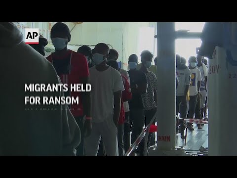

### AYS News Digest 13/10/21: UK — implicit in the abandon to torture, report says
#### Protest in Nea Kavala 10 days after their food and financial assistance is cut / Does the UK government’s response to the crisis in Syria rely on racist, Islamophobic and gendered stereotyping — a report / Recommended reads and reports

 which embodies Europe’s racist migration policies\. We are calling on the Italian government stop its hostile migration policies and exonerate Lucano immediately\.” —A [bolish Frontex](https://twitter.com/abolishfrontex) Sign their Open Letter — [https://framaforms\.org/open\-letter\-in](https://t.co/nviqH3Ssij?amp=1)](assets/76f00f66c82e/0*3nrl8_PCFqOGxu4V)

“We were disgusted by the first\-degree sentence given to [\#MimmoLucano](https://twitter.com/hashtag/MimmoLucano?src=hashtag_click) which embodies Europe’s racist migration policies\. We are calling on the Italian government stop its hostile migration policies and exonerate Lucano immediately\.” —A [bolish Frontex](https://twitter.com/abolishfrontex) Sign their Open Letter — [https://framaforms\.org/open\-letter\-in](https://t.co/nviqH3Ssij?amp=1)
#### FEATURED

**12,000 children and women** from countries outside Iraq and Syria are being held in al Hol and Roj camps in northeast Syria on the basis of a presumed connection to ISIS, **without charge or the possibility of a trial\.** Nearly two\-thirds are children under the age of 12, and many are under five\.

The Rights & Security International \(RSI\)’s new report [_Abandoned to Torture: Dehumanising rights violations against children and women in northeast Syria_](https://www.rightsandsecurity.org/assets/downloads/Abandoned_to_Torture_-_Final_Report.pdf) calls on the British government to end the torture of British children and women by bringing them back from the camps, where UN experts and courts have found that conditions amount to torture and cruel, inhumane or degrading treatment in violation of international law\.

While under the pressure of the conservatives to stem the arrivals to the UK, Priti Patel wants to introduce a provision in the [nationality and borders bill](https://www.theguardian.com/world/2021/oct/12/priti-patel-borders-bill-breaches-law-human-rights) that could give officials legal protections in the event that someone drowns\. This basically [means](https://www.theguardian.com/uk-news/2021/oct/13/uk-border-force-could-be-given-immunity-over-refugee-deaths?fbclid=IwAR0IalbEV_Hue4N5FpyxXgdLqAL_LNj6QKl_6MI9Y1660By18oBnU4QdJdc) that anyone arriving in the UK via an illegal route, such as by a small boat across the Channel, could have their claim ruled as inadmissible, receive a jail sentence of up to four years, have no recourse to public funds, and could have their family members barred from joining them\.

In the meantime, immigration lawyers examined Priti Patel’s anti\-refugee bill and concluded it was “the biggest legal assault on international refugee law ever seen in the UK\.” They’ve concluded that the bill, in its current form, breaches international human rights laws in AT LEAST 10 different ways, as [Freedom from Torture](https://twitter.com/FreefromTorture) reports\.

#### LIBYA
### UNHCR News Statement on death of Sudanese asylum seeker

Various UN agencies have denounced violence against migrants in Libya after security forces shot dead at least half a dozen asylum seekers in recent days\.

The Libyan authorities began a series of arrests and raids this month which have caused considerable fear among asylum seekers and refugees, thousands of whom have been detained and many of whom have had their shelters demolished\.

> UNHCR urges an investigation into the killing and for perpetrators to be held accountable\. It continues to scale up its assistance to people who have been affected by the security operation\.
 

> UNHCR continues to call on the authorities to respect the human rights and dignity of asylum seekers and refugees at all times, stop their arrests and release those detained\. 

Report for download [here](https://reliefweb.int/sites/reliefweb.int/files/resources/AR%20UNHCR%20NEWS%20STATEMENT%20131021_death_of_asylum_seeker.pdf) \.
#### GREECE
### Protest in Nea Kavala 10 days after food & financial cut\-off

After the Ministry of Immigration Policy decided to take over the responsibilities of the UNHCR for the provision of food and the financing of financial assistance bank cards to asylum seekers, things shifted in the direction that always ends in the same way, with people on the move and asylum seekers drawing the short straw\. This time, [it was rather serious](https://alterthess.gr/deka-meres-choris-fagito-diamartyria-prosfygon-sti-nea-kavala/?fbclid=IwAR24eutEUyKCUkmc7WnOr8yJgNFmmRLa6aY0UkzZYREtg9ddGJpv8wdzS5E) , leading to them having to protest and shortly stop NGOs from entering Nea Kavala\. 
The Ministry was not prepared to ensure the smooth financing of bank cards, resulting in thousands of people who did not have access to the most basic thing in life — food\. In the Nea Kavala camp alone, more than 600 people have been left out of access to any kind of food\. A similar protest took place in Ritsona earlier\.
#### FRANCE
### Evictions, rough conditions resulting in a tragic loss of lives

Forced evictions of people on the move in the north of France continue, and local activists are reporting indiscriminate actions with a lack of any consideration for the needs and realities of the people in provisional lodging\.

■■■■■■■■■■■■■■ 
> **[Utopia 56](https://twitter.com/Utopia_56) @ Twitter Says:** 

> > Grande-Synthe, ce matin. Énième expulsion. Beaucoup d'enfants et aucune explication de l'État pour les personnes sur place. Le champ est labouré pour empêcher d’y réinstaller une tente. Harceler toujours et encore ces personnes qui tentent de passer en Angleterre. https://t.co/g3mxY0a4jv 

> **Tweeted at [2021-10-13 10:51:44](https://twitter.com/utopia_56/status/1448240029805989888).** 

■■■■■■■■■■■■■■ 

3 people were killed and one injured after getting hit by a train in southern France\. They were [reportedly](https://www.infomigrants.net/en/post/35703/migrants-hit-and-killed-by-train-in-southern-france?fbclid=IwAR1uWDMc2wYq4_QvbT1dZtDoQVGhrAQZHk_sUDzqlFZPMEuOeE89TuYt6aY) lying or sleeping near the tracks at the time of the tragic incident\. It seems that the driver had used the emergency brakes, but even with them, he would not have been able to avoid hitting the four men\. The four victims were Algerian nationals “aged between 21 and 40”, the local prosecutor told the AFP\.
### WORTH READING
- As Greece fortifies its borders against a potential influx of Afghan refugees, a Greek coroner near the country’s land border with Turkey works to restore both names and dignity to those who die trying to cross the perilous Evros river in search of sanctuary\.

- The obstructive and secretive practices of the Frontex agency with regard to its activities in general and the access to information requests in particular has been broadly criticised:

- EU migration policies have been consistently focusing on increasing returns and closing access to these national residence permits\. Such an approach rests on the mistaken belief that for undocumented people, the only option is to return — either by force or “voluntarily”\. The EU Pact on Migration and Asylum is built on this assumption and attempts to entrench it throughout the EU’s immigration and asylum procedures:

- [A report by Sahar Modares Mousavi and Ghazaal Bozorgmehr](https://www.irsprc.org/?fbclid=IwAR24eutEUyKCUkmc7WnOr8yJgNFmmRLa6aY0UkzZYREtg9ddGJpv8wdzS5E) , who are both linked to Nasserkhosro Child House in Tehran, a part of the NGO Society for Protecting the Rights of the Child in Tehran

**Find daily updates and special reports on our [Medium page](https://medium.com/are-you-syrious) \.**

**If you wish to contribute, either by writing a report or a story, or by joining the info gathering team, please let us know\.**

**We strive to echo correct news from the ground through collaboration and fairness\. Every effort has been made to credit organisations and individuals with regard to the supply of information, video, and photo material \(in cases where the source wanted to be accredited\) \. Please notify us regarding corrections\.**

**If there’s anything you want to share or comment, contact us through Facebook, Twitter or write to: areyousyrious@gmail\.com**

_Converted [Medium Post](https://medium.com/are-you-syrious/ays-news-digest-13-10-21-uk-implicit-in-the-abandon-to-torture-report-says-76f00f66c82e) by [ZMediumToMarkdown](https://github.com/ZhgChgLi/ZMediumToMarkdown)._
