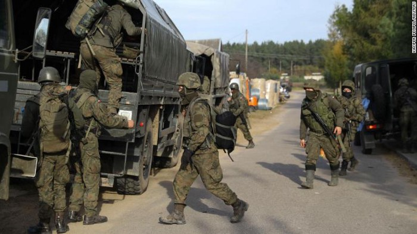
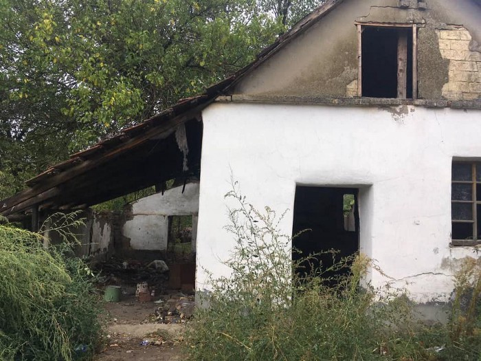

### AYS News Digest 15/10/21: Poland legalizes pushbacks
#### Turkey\-Iran pushbacks highlighted // Hundreds don’t have food in Greek camps // Italian ship captain sentenced for pushback // Serbian man targeted for supporting people on the move in Sombor, and more…
### FEATURE — Poland legalizes pushbacks in a move that violates international law

Polish soldiers in front of the border guard headquarters in Michalowo, Poland on October 11\. \(Photo: [CNN](https://www.cnn.com/2021/10/15/europe/poland-border-pushback-legislation-intl/index.html) \)

As the humanitarian and political crisis at Poland’s border deepens, the Polish parliament has done what just a few months ago would seem unthinkable, but now seems all too predictable: on Thursday, it [legalized](https://www.cnn.com/2021/10/15/europe/poland-border-pushback-legislation-intl/index.html) pushbacks of people on the move from its borders\. The legislation, which openly flouts international humanitarian law, allows authorities to immediately expel people who enter Polish territory irregularly\.

Polish officials also plan to build a €350m wall on the Belarusian border\. The permanent barrier will replace the temporary barbed wire that currently stands along much of the border, and will come with a “surveillance system of cameras and movement sensors,” [media](https://www.infomigrants.net/en/post/35751/poland-plans-a-permanent-barrier-on-belarus-border?fbclid=IwAR204qToBjzf2-Z4Y7q-uIxhr8Uz405G6UYAW3PJrxh7sO2BMVB23d135xI) reported\.

Activists are [increasingly warning](https://www.facebook.com/permalink.php?story_fbid=10160335223793646&id=222576883645) of potential mass deaths along the border, as temperatures drop lower each night\. This Wednesday, a Polish police helicopter [found](https://www.aljazeera.com/news/2021/10/14/syrian-migrant-found-dead-on-polish-belarusian-border?fbclid=IwAR2yGxcKvjx-T2-JEf0OrJGrYNE29HWaV8jsqbLFetDTK5O0qM9KZ80xfMc) the body of a 24\-year\-old Syrian man in a field near the Belarusian border\. The man was the seventh recorded person to die along this border since the Poland ‘border crisis’ began this summer\.

“What is happening at the border is some sort of hunger games, it’s one big concentration camp,” one activist told [media](https://oko.press/people-are-already-dying-and-freezing-temperatures-are-coming/?fbclid=IwAR0tPXBFdDZ4LxHKu-0Enjm2XmVY9CSUvCUJJ3qNUgZ6r_1zCEVo262jYPE) \.

“The number of attempts to cross the border is growing,” the Polish government said in an attempt to justify the legislation\.

[Media](https://euobserver.com/tickers/153241?fbclid=IwAR0wm9YHIPynzB7RyoChScjt-mTCU-YGmA-xKjKjTrxmjkaonm2JvSE7hZI) also reported that up to 150 people per night were arriving from Belarus to Eisenhuettenstadt, a German camp near the Polish border\.

Human rights advocates and legal experts are clear on the illegality of Poland’s new legislation\. “Forcing people back who are trying to claim asylum without an individual assessment of their protection needs is against European and international law,” Eve Geddie of Amnesty International [said](https://www.reuters.com/world/europe/poland-illegally-pushed-migrants-back-into-belarus-amnesty-intl-says-2021-09-29/) in late September\.

“If there are people who have a legitimate request to seek asylum, there should be a way to allow that to happen,” Matteo Mecacci, the director of the Organisation for Security and Cooperation in Europe’s Office for Democratic Institutions and Human Rights, told media\. “I understand there are also security concerns … but security concerns cannot completely overrun the need for international protection\.”

But Polish Interior Minister Mariusz Kaminski has said that “the actions of Belarus must meet with a firm response from the EU member states\.”

EU Home Affairs Commissioner Ylva Johansson has largely shied away from engaging on the issue of pushbacks, instead focusing her statements on Belarus’ actions\.

After meeting with Poland’s Kaminski in late September, she tweeted:
### LIBYA
### Abolish Frontex calls for evacuation of people on the move in Libya

> _Abolish Frontex supports the demands of more than 3000 refugees and migrants in Libya who have been protesting outside the UNHCR Community Day Centre since the beginning of October \(Twitter: [@RefugeesinLibya](http://twitter.com/RefugeesinLibya) \) \. They are demanding their immediate evacuation to safe countries following the recent raids and murders of migrants and refugees at the hands of detention centre guards and the Department for Combating Illegal Immigration \(DCIM, part of the Libyan Ministry of Interior\) \._ 

Read the full statement [here](https://abolishfrontex.org/blog/2021/10/15/call-for-evacuation-of-people-from-libya/?fbclid=IwAR3bs4tlxtnKMkwJKHVxINGP_ctaBOvNTrAKnrVqA5vmADsCnlDe2MXmlUw) \.
### TURKEY
### Reports of violent pushbacks from Turkey to Iran

Human rights advocates and media have reported in recent days on violent pushbacks along the Turkey\-Iran border of Afghans fleeing the Taliban government\.

[Human Rights Watch](https://www.hrw.org/news/2021/10/15/turkey-soldiers-beat-push-afghan-asylum-seekers-back-iran?fbclid=IwAR2_RWUDwoZVpzxrBe53J4P2c7CIMvWpuAPTsH25cphrft4moB7iZXPE70A) spoke to six Afghans, five of whom were pushed back, that told of the Turkish army beating them — sometimes breaking their bones — and sending large groups of 50 to 300 people back to Iran\.

“Turkish authorities are denying Afghans trying to flee to safety the right to seek asylum,” said Belkis Wille, senior crisis and conflict researcher at Human Rights Watch\. “Turkish soldiers are also brutally mistreating the Afghans while unlawfully pushing them back\.”

The [Guardian](https://www.theguardian.com/global-development/2021/oct/14/afghan-refugees-accuse-turkey-of-violent-pushbacks?CMP=Share_AndroidApp_Other&fbclid=IwAR1RlJh3rjtbw_GnGlQ5jeo3KzzjoY4e1LsSJgvfYFKqgEv3vZY3e47qP8w) also published a significant feature on pushbacks along this border\. According to IOM, in recent months some 20,000 to 30,000 Afghans were fleeing the country each week\.

Pushbacks are “100% happening,” Mahmut Kaçan, a Turkish lawyer based in the eastern Turkish city of Van who specializes in refugee and asylum cases, told the Guardian\. “What Turkish authorities are doing is illegal\.”

Human Rights Watch said in its statement that Chancellor Angela Merkel, who is scheduled to visit Turkey this Saturday and meet with President Erdoğan should “push the Turkish government to end its summary expulsions of Afghans; investigate allegations of collective expulsions, rejections at the border, and the denial of the right to seek asylum; and remedy such instances\.”
### Over 200 people captured in Turkey trying to cross borders

Some 212 people on the move were captured by Turkish authorities this week while trying to cross borders, [media](https://www.dailysabah.com/politics/eu-affairs/212-irregular-migrants-rescued-captured-by-turkey-in-24-hours?fbclid=IwAR1qctQ9ioqrxLyfzqze1t-LwoVd93L11s8IY8TrIjWtJ5yjFUkUPGYOWss) reported\. Some were caught near the Bulgarian border, and said they had been expelled from the country\. Others were caught at sea, after being pushed back from Greek waters by the Hellenic Coast Guard\.

EU officials have voiced their “extreme concern” over pushbacks following the [Lighthouse Reports investigation](https://www.lighthousereports.nl/investigation/masked-men/) into ‘masked men’ conducting pushbacks at EU borders\.
### GREECE
### Hundreds in northern Greek camp deprived of food

Hundreds of people on the move in Nea Kavala camp in northern Greece have been deprived of food following a decision by the Ministry of Immigration and Asylum to stop providing people with cash cards\. Those who have received asylum are also not eligible any longer to receive food from the camp, [media](https://thepressproject.gr/chiliades-prosfyges-choris-fagito-se-domi-tis-v-elladas-mi-mas-kovete-to-fagito/?fbclid=IwAR1LR_puUAoQlQ7XnU0jQOMHxOg7I0hHDurF0b5sIfjosHqxsCMvUL1omMM) reported\.

Some 600 people are said to be affected, most of them families\. Of the 3,300 people living in the three largest camps of the Central Macedonia region, Nea Kavala, Vagiochori and Kavala, only 830 are now given three daily meals, [media](https://www.efsyn.gr/ellada/koinonia/314090_afinoyn-hiliades-prosfyges-na-peinoyn) reported\.
### Upcoming trial for three human rights workers
### Mitsotakis does PR stunt showcasing support for Afghans
### Samos camp in poor condition after rain
### ITALY
### Italy sentences captain for Libya pushback

In the first sanction in Italy and in Europe of its kind, a court in Naples has sentenced an Italian ship captain to a year in prison for disembarking over 101 people in Libya’s capital city of Tripoli, [media](https://euobserver.com/tickers/153235?fbclid=IwAR0ka0QPFKK18SgJ4DVcAPK1KN5f9mjv4i2LXW1B8ZtUIYnj5g-7AulYRjU) reported\. Read more on the case [here](https://www.avvenire.it/attualita/pagine/migranti-consegnati-ai-libici-prima-condanna-in-italia) \(in Italian\) \.
### Report finds Italy targets boat drivers in Med

A report has found that Italy has long used anti\-Mafia laws to target those driving the boats from Libya to Italy, a policy that criminalizes those seeking international protection and results in prison sentences for innocent people, [media](https://www.theguardian.com/global-development/2021/oct/15/italy-using-anti-mafia-laws-to-scapegoat-migrant-boat-drivers-report-finds?fbclid=IwAR0wPfGbDcF1hGcMgqbkrN-vnR7xPTwg9SRI2FOgE-gpNk41AjhG_yFnQuI) reported\.

The report, [“From Sea to Prison: The Criminalization of Boat Drivers in Italy,”](https://fromseatoprison.info/?fbclid=IwAR3bs4tlxtnKMkwJKHVxINGP_ctaBOvNTrAKnrVqA5vmADsCnlDe2MXmlUw) published by Arci Porco Rosso, Alarm Phone and Borderline Sicilia, collected police data and analyzed more than 1,000 criminal cases brought by prosecutors against those who drive boats carrying people on the move across the Mediterranean\.

Since 2013, at least 24 people convincted of driving boats have received sentences of more than 10 years, while six have been given life sentences, according to the report\.

“This happens when, unfortunately, during the journey, some of the passengers die,” said Maria Giulia Fava at Arci Porco Rosso\. ‘‘In that case, the boat driver is charged with murder\. It is in those moments that justice is transformed into a terrible machine that risks destroying the lives of these people forever\.”
### SERBIA
### Rights group says Belgrade airport police refusing entry to those seeking asylum

The Belgrade Center for Human Rights \(BCHR\) released a [statement](http://www.bgcentar.org.rs/bgcentar/eng-lat/border-police-at-belgrade-airport-reportedly-stonewalling-aliens-who-want-to-seek-asylum-in-serbia/?fbclid=IwAR1LR_puUAoQlQ7XnU0jQOMHxOg7I0hHDurF0b5sIfjosHqxsCMvUL1omMM) saying it was concerned about increasing reports of people being denied entry into Serbia and held in the transit zone of Nikola Tesla Airport in Belgrade\. The group said it has been receiving more calls from mainly Cuban nationals who say they were refused entry into Serbia to claim asylum\.

Most of those who contacted the BCHR said that the Ministry of Internal Affairs \(MIA\) officers deployed at the airport had not responded to either their oral or written requests to apply for asylum in Serbia and had seized their phones, preventing them from calling a lawyer in Serbia\. Some people stayed in the transit zone for days, although the area is not equipped for long stays\.

“The Serbian MIA is under the obligation to respect and apply the Asylum and Temporary Protection Act in respect of all aliens who notify police officers that they want to seek asylum in Serbia…The BCHR also alerts to the fact that asylum seeking women and children are also being held in inadequate conditions at Nikola Tesla Airport,” the BCHR wrote\.
### Far\-right group targets Serbian hostel owner providing shelter to people on the move

A far\-right group in Serbia is targeting a hostel owner in the northwestern town of Sombor for hosting people on the move in his establishment, [media](https://www.rferl.org/a/serbia-right-extremism-sombor-migrants/31509667.html?fbclid=IwAR0HpDiYY4gPQoF3NaLBwx9KaHkS5LpzWjNS0x4UYVvtUFa_ksaYIWHR83k) reported\.

The man, Sinisa Sevo, has been labelled a traitor, targeted with death threats on social media, and has had his photograph and personal data plastered on posters across the city\. The far\-right group, People’s Patrol, accused Sevo and five others of “profiting” by illegally providing shelter to the people on the move\.

“Sombor citizens, these are your neighbors who illegally rent out accommodation to migrants,” the group wrote on its Facebook page, which has more than 43,000 followers\. Sevo told media he has received comments like, “Hang them from trees\.”

Police are investigating the incidents, but for now Sevo has been forced to close his hostel\.
### No Name Kitchen warns of daily, large\-scale evictions in northern Serbia

\(Photo: [No Name Kitchen](https://www.facebook.com/NoNameKitchenBelgrade/posts/1337693583295589) \)

> _During the past two weeks, the Serbian police have been carrying out large scale evictions almost daily in the north of the country\. 600 people have been taken from Sombor and about 300–400 from Majdan, mostly to the official camps of Šid\. There are also unconfirmed reports that a man from Somalia was killed while fighting with the police\._ 

> _Three of our volunteers travelled north on Thursday to assess the situation in Majdan, a small village that sits on the intersection of Serbian, Hungarian, and Romanian national borders\. With only a few hundred inhabitants, recently the village’s population has swollen to bursting point with over 400 People On the Move squatting in the towns many abandoned houses\. With no shops and the only support coming from kindly locals, reports described an increasingly desperate situation\._ 

> _As our team approached, they were closely followed by police from the moment they entered the town\. When it became apparent that they were from NNK, what appeared to be every unit in town swooped down on them\. 9 officers from both the border patrols, civil police, and specialised units surrounded them, searching them and detaining them for 2 hours\. Eventually they were allowed to leave, but not before a police escort had followed them far into the surrounding countryside\._ 

> _At a time when support is most needed, these evictions and the prevention of aid highlight the continuing criminalisation of solidarity being enforced by the Serbian state\. Every organisation attempting to provide assistance is facing similar problems, and even locals once eager to help are now fearful of reprisals\. As the winter approaches and the cold creeps in, time is running out for the people stuck in Majdan\. We will continue to monitor the situation and assist where we can\._ 

Full post [here](https://www.facebook.com/NoNameKitchenBelgrade/posts/1337693583295589) \.
### FRANCE
### Evictions, and solidarity actions

In Calais, three activists have begun a hunger strike to raise awareness of the plight of people on the move there\. Local chaplain Philippe Demeestere, Anaïs Vogel and Ludovic Holbein began their protest on Monday Oct 11, and have set up camp beds in a local Catholic church in the city center, Saint\-Pierre de Calais, [media](https://www.infomigrants.net/en/post/35740/activists-on-hunger-strike-to-support-calais-migrants?fbclid=IwAR1zST2WIRKwy3vGyJfUERlthA6lNhKY1IxvJKURZ16jupGrYeJM1sUON04) reported\.

This week, Human Rights Watch released a [statement](https://www.hrw.org/news/2021/10/14/french-ministers-denial-police-abuses-against-migrants-flies-face-facts?fbclid=IwAR3C-qHCzg676Gp10u9DPu_-a-AzPW4rb2RluQLOX4PN-4LCDzJp2OXcRN8) refuting the comments of Gérald Darmanin, France’s Interior Minister, who [publicly rebuffed](https://france3-regions.francetvinfo.fr/hauts-de-france/emissions/jt-1920-nord-pas-de-calais) an Oct 7 Human Rights Watch [report](https://www.hrw.org/news/2021/10/07/france-degrading-treatment-migrants-around-calais) documenting the “degrading treatment” of people on the move around Calais by French police\. In a visit to the Dunkirk region, Darmanin said the report “patently lies\.”

“Not a single policeman or gendarme on the coast has been prosecuted,” he claimed, and subsequently praised the “humanity” of police towards people on the move\.

This week, Human Rights Watch addressed Darmanin’s comments by reiterating the claims it made in its original report\. Bénédicte Jeannerod, HRW’s France director, wrote the following:

> _Let me set the record straight: Our report is based on extended field visits to Calais, Grande\-Synthe and surrounds between October 2020 and July 2021\. We interviewed 60 migrants — including 40 unaccompanied children\- as well as aid workers and examined dozens of videos, photos, and news reports\. The evidence confirms the facts: abusive practices by the authorities and the police have not only persisted but escalated since the dismantling of a sprawling camp on the edge of Calais five years ago\._ 

> _Abuses include near\-constant police harassment, frequent and often brutal forced evictions of encampments, confiscation and regular destruction of tents, tarps, and meager personal belongings, and the obstruction of humanitarian assistance\._ 

### SWEDEN
### Sweden will deport Kurdish woman activist

Swedish authorities have denied the asylum request of Hana Nasour, an Iraqi Kurdish political activist, and have ordered the police to deport her back to Iraq, the [Kurdish Human Rights Network](https://kurdistanhumanrights.org/en/sweden-to-deport-kurdish-woman-activist-to-iraqi-kurdistan/?fbclid=IwAR38snU43K6BXaQqlQ8phY0p59kThxM-gCeCy4otMFUqYNPXiUXbC0HvsfQ) , an NGO, reported\.

Nasour was an activist in Iran, and fears that the Iranian intelligence ministry would “pose a threat to her life” in the Iraqi Kurdish region\.

“Security forces of the Kurdistan region also constantly pressured us to either surrender to Iran or leave the region due to my continued activism against the Islamic Republic of Iran”, Nasour, who grew up in Iran, said\.

Nasour fled to Sweden in late 2015 with her husband and mother, and fought political asylum\. Sweden has rejected their claims, considering them “extremists” and “threats on Sweden’s national security” for being sympathizers of the Kurdistan Free Life Party \(PJAK\) \.

But authorities have granted conditional residence permits to Nasour’s husband and mother — who are Iranian citizens — but have rejected her application three times since 2015\.

“We are a part of the Swedish society\. We work and study here\. We have also continued our activism in Sweden for human rights, and we have peacefully opposed executions and violence against women with permission from Swedish authorities\. It is unjust that our activism is considered a threat against Swedish national security”, the activist said\.
### WORTH READING
### “We Are Trading the Borders Away”

Rich investors are able to buy their way into Europe\. Why not refugees? A group of artists in Germany known as the Peng Collective is planning to flip the script for one family from Afghanistan\.
### [Golden Visas for Refugees: “We Are Trading the Borders Away”](https://www.spiegel.de/international/europe/golden-visas-for-refugees-we-are-trading-the-borders-away-a-428665b9-4cad-4679-a306-27e63f7190f3?fbclid=IwAR2fW9SLyCNMuwXLDGxPgowpVtRYrh95d3UiapzqzeJzy_Ocj_xfwXsjfFE)
### [It’s not easy for refugees to get asylum in Europe\. Most face an arduous and dangerous journey and high bureaucratic…](https://www.spiegel.de/international/europe/golden-visas-for-refugees-we-are-trading-the-borders-away-a-428665b9-4cad-4679-a306-27e63f7190f3?fbclid=IwAR2fW9SLyCNMuwXLDGxPgowpVtRYrh95d3UiapzqzeJzy_Ocj_xfwXsjfFE)

[www\.spiegel\.de](https://www.spiegel.de/international/europe/golden-visas-for-refugees-we-are-trading-the-borders-away-a-428665b9-4cad-4679-a306-27e63f7190f3?fbclid=IwAR2fW9SLyCNMuwXLDGxPgowpVtRYrh95d3UiapzqzeJzy_Ocj_xfwXsjfFE)
### In no\-man’s land

The predicament of refugees at the Polish–Belarusian border evokes deportations to Poland in 1938 and a novel published in 1940
### [In no\-man’s land \* Klaus Neumann](https://insidestory.org.au/in-no-mans-land/?fbclid=IwAR3kNmjlUk9kiAOvPyZenYozKzgkHrsEkjXKI3DUN4ZcNKU93oT5yfJz5YE)
### [I often pass by an inconspicuous monument — a granite rock with a plaque — a few hundred metres from the Hamburg\-Altona…](https://insidestory.org.au/in-no-mans-land/?fbclid=IwAR3kNmjlUk9kiAOvPyZenYozKzgkHrsEkjXKI3DUN4ZcNKU93oT5yfJz5YE)

[insidestory\.org\.au](https://insidestory.org.au/in-no-mans-land/?fbclid=IwAR3kNmjlUk9kiAOvPyZenYozKzgkHrsEkjXKI3DUN4ZcNKU93oT5yfJz5YE)
### Hundreds of Bangladeshi asylum seekers in Germany fear deportation

As Germany resumes deporting failed asylum seekers after a slowdown during the pandemic, fear is growing among hundreds of Bangladeshi migrants whose asylum applications have been rejected\.
### [Hundreds of Bangladeshi asylum seekers in Germany fear deportation](https://www.infomigrants.net/en/post/35743/hundreds-of-bangladeshi-asylum-seekers-in-germany-fear-deportation?fbclid=IwAR1_Yj6zSaX0FgjLhPUF1BP5Z_jYKoBfVeHoESAR9OXav_PI_9RHXhdtqHs)
### [As Germany resumes deporting failed asylum seekers after a slowdown during the pandemic, fear is growing among hundreds…](https://www.infomigrants.net/en/post/35743/hundreds-of-bangladeshi-asylum-seekers-in-germany-fear-deportation?fbclid=IwAR1_Yj6zSaX0FgjLhPUF1BP5Z_jYKoBfVeHoESAR9OXav_PI_9RHXhdtqHs)

[www\.infomigrants\.net](https://www.infomigrants.net/en/post/35743/hundreds-of-bangladeshi-asylum-seekers-in-germany-fear-deportation?fbclid=IwAR1_Yj6zSaX0FgjLhPUF1BP5Z_jYKoBfVeHoESAR9OXav_PI_9RHXhdtqHs)
### The EU\-Turkey deal breakdown: How securitisation narratives are reproduced through externalisation

When Turkey opened its borders in February 2020, the responses from EU states clearly illustrated the fact that externalisation is a tool used to exacerbate securitisation narratives within the international refugee regime\. Such narratives have harmful impacts upon displaced people across the globe\.
### [The EU\-Turkey deal breakdown: how securitisation narratives are reproduced through externalisation](https://refugeeresearchonline.org/the-eu-turkey-deal-breakdown-how-securitisation-narratives-are-reproduced-through-externalisation/?fbclid=IwAR2fW9SLyCNMuwXLDGxPgowpVtRYrh95d3UiapzqzeJzy_Ocj_xfwXsjfFE)
### [When Turkey opened its borders in February 2020, the responses from EU states clearly illustrated the fact that…](https://refugeeresearchonline.org/the-eu-turkey-deal-breakdown-how-securitisation-narratives-are-reproduced-through-externalisation/?fbclid=IwAR2fW9SLyCNMuwXLDGxPgowpVtRYrh95d3UiapzqzeJzy_Ocj_xfwXsjfFE)

[refugeeresearchonline\.org](https://refugeeresearchonline.org/the-eu-turkey-deal-breakdown-how-securitisation-narratives-are-reproduced-through-externalisation/?fbclid=IwAR2fW9SLyCNMuwXLDGxPgowpVtRYrh95d3UiapzqzeJzy_Ocj_xfwXsjfFE)
### Denmark Leading the Race to the Bottom: Hostility as a form of migration control

Until recently, Denmark has been recognized as an egalitarian country with an exemplary welfare system\. Now, this reputation might have been irrevocably tarnished as the Danish government continues to set itself apart from its Scandinavian counterparts with increasingly hostile migration control measures\.
### [Denmark Leading the Race to the Bottom: Hostility as a form of migration control — PRIO Blogs](https://blogs.prio.org/2021/10/denmark-leading-the-race-to-the-bottom-hostility-as-a-form-of-migration-control/?fbclid=IwAR1d_R_P0HHBDlom-a5PGpxK69lMjcTM0BTXIvPTeCicTUwpXOnLQGefHyY)
### [Since the refugee crisis of 2015, Denmark, the first signatory of the 1951 Refugee Convention, has been at the…](https://blogs.prio.org/2021/10/denmark-leading-the-race-to-the-bottom-hostility-as-a-form-of-migration-control/?fbclid=IwAR1d_R_P0HHBDlom-a5PGpxK69lMjcTM0BTXIvPTeCicTUwpXOnLQGefHyY)

[blogs\.prio\.org](https://blogs.prio.org/2021/10/denmark-leading-the-race-to-the-bottom-hostility-as-a-form-of-migration-control/?fbclid=IwAR1d_R_P0HHBDlom-a5PGpxK69lMjcTM0BTXIvPTeCicTUwpXOnLQGefHyY)

**Find daily updates and special reports on our [Medium page](https://medium.com/are-you-syrious) \.**

**If you wish to contribute, either by writing a report or a story, or by joining the info gathering team, please let us know\.**

**We strive to echo correct news from the ground through collaboration and fairness\. Every effort has been made to credit organisations and individuals with regard to the supply of information, video, and photo material \(in cases where the source wanted to be accredited\) \. Please notify us regarding corrections\.**

**If there’s anything you want to share or comment, contact us through Facebook, Twitter or write to: areyousyrious@gmail\.com**

_Converted [Medium Post](https://medium.com/are-you-syrious/ays-news-digest-15-10-21-poland-legalizes-pushbacks-e7140651e8b0) by [ZMediumToMarkdown](https://github.com/ZhgChgLi/ZMediumToMarkdown)._
