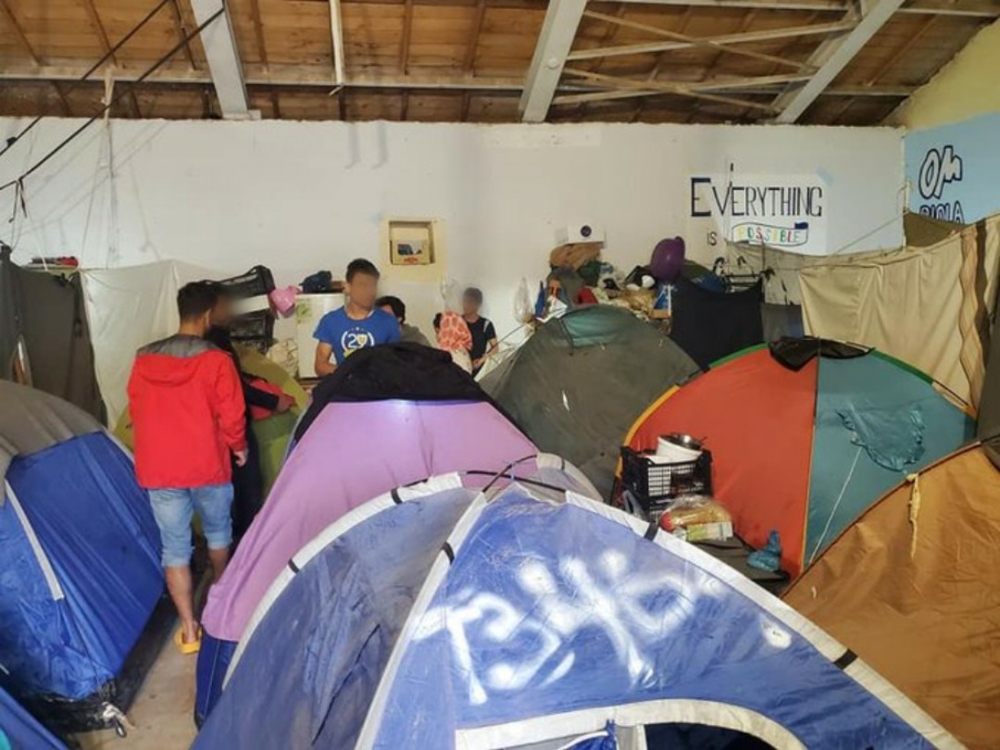
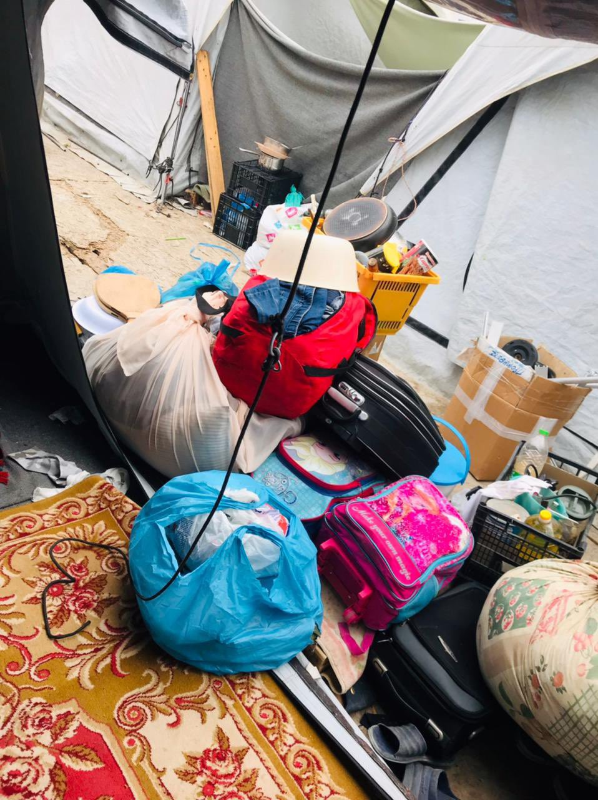
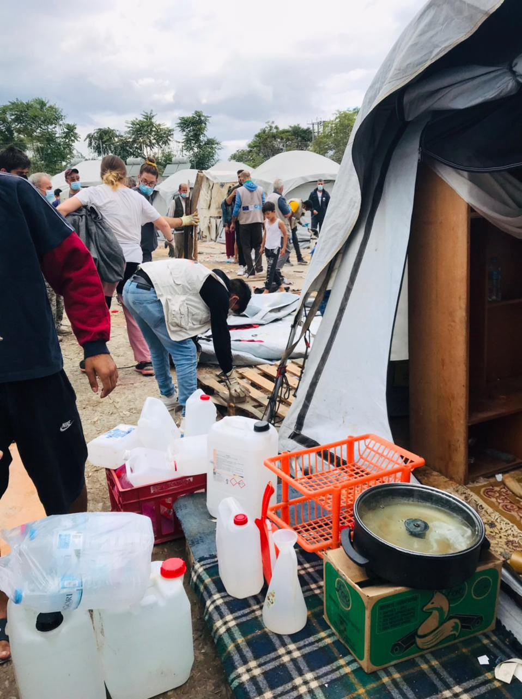
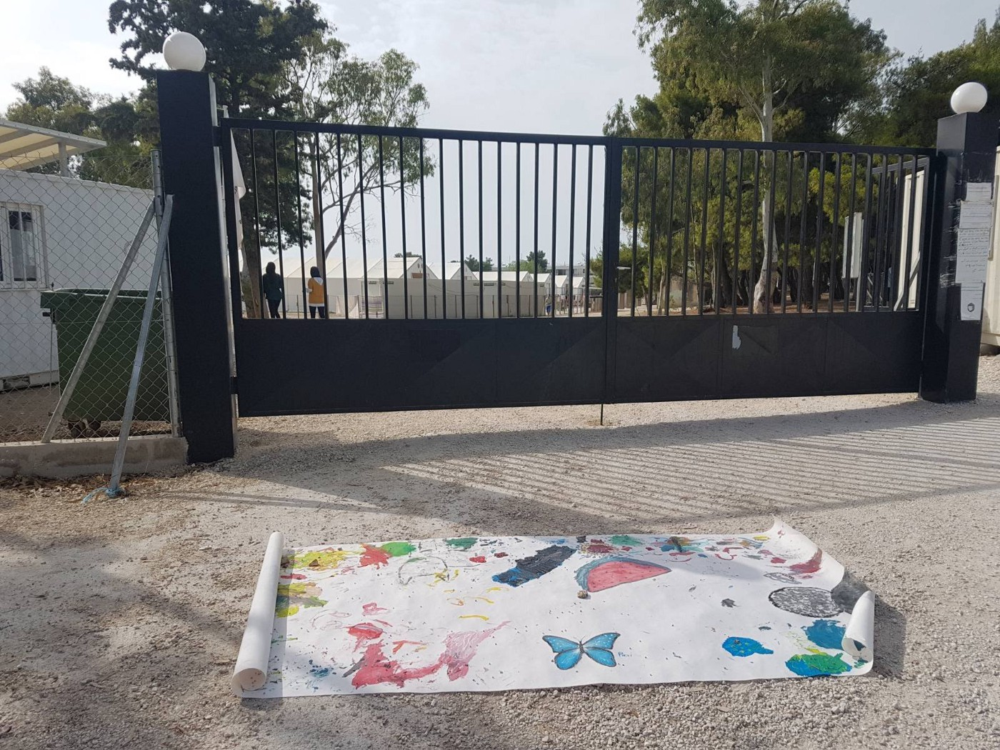

### AYS Special from Greece: Are you eligible to eat?

_In a recent meeting between authorities, International Organizations and Civil Society Organizations it was announced that 60% of people living in camps do not receive food\. These people are also not eligible for the cash programme and are thus unable to purchase their own food\. They include recognised refugees, people who have received rejections, and people who have been unable to register\. Children outnumber adult men and women in camps, they are a recognised vulnerable group under [Article 20\.3 of EU Directive 2011/95/EU](https://eur-lex.europa.eu/LexUriServ/LexUriServ.do?uri=OJ:L:2011:337:0009:0026:en:PDF) , and are thus due additional protections\. Yet the Government continues to state that it is following the law while providing them with dangerously low levels of care\._

 “In [\#EleionasCamp](https://twitter.com/hashtag/EleionasCamp?src=hashtag_click) the authorities asked the People under tents to camp out of the camp and will be in containers, but they put 2,3 families in one container\. “How can we live in such small place ?” Says one of the residents\. [\#ChangeSystemEu](https://twitter.com/hashtag/ChangeSystemEu?src=hashtag_click) ”\)](assets/8cc3ac6bed3e/1*R_SsXvFsu5WQgAKaC11cwg.jpeg)

\(Photo Credit: [Parwana Amiri](https://twitter.com/parwana_amiri/status/1442430404510851075/photo/4) “In [\#EleionasCamp](https://twitter.com/hashtag/EleionasCamp?src=hashtag_click) the authorities asked the People under tents to camp out of the camp and will be in containers, but they put 2,3 families in one container\. “How can we live in such small place ?” Says one of the residents\. [\#ChangeSystemEu](https://twitter.com/hashtag/ChangeSystemEu?src=hashtag_click) ”\)

In an interview with AYS on the eve of [World Food Day](https://www.ibtimes.com/world-food-day-history-significance-hunger-awareness-quotes-3317195) , Dr Apostolos Veizis, Executive Director of Intersos in Greece, described this practice as a form of collective punishment\.

> Eligible for food means eligible to eat\. What does this mean? How can it be possible? What does this say about EU principles and values? What does it say when a modern state cannot provide food? 

This has been compounded by the handing over of the cash programme from UNHCR to the Greek Government\. People who would previously have supported friends or family with extra food or money to buy it are no longer able to\. In the words of a visitor to the [Echo Mobile Library](https://www.facebook.com/refugeelibrary) from Korinthos Camp:

> From the beginning of this month _\[October 2021\]_ most of the camp residents didn’t receive social money and the Greek Government has stopped giving the money for unknown reasons\. Instead, they are serving ready meals which are not good at all\. Often spoiled and no one is eating them, the recycle bins are full of food\. They can’t buy powder milk for kids, shampoos, soap, and other necessary things\. 

 \. Living conditions in Malakasa for those without containers\)](assets/8cc3ac6bed3e/1*tLBAf-MIJXFg5K80WSrlQA.jpeg)

\(Photo Credit: [SOS Refugiados](https://twitter.com/sosrefugiados/status/1449060195930460160) \. Living conditions in Malakasa for those without containers\)

This is not the first time the Greek Government has dealt with the handover of services badly\. At the start of the 2021 they [took over the ESTIA programme](ays-special-from-greece-recognised-refugees-sleeping-on-the-street-as-eu-scheme-scrapped-cfd8c54e5c6f) leading to mass homelessness\. Now that they are in charge of the Cash Card, the financial programme designed to support people seeking asylum, they have failed to pay out\. People have been promised payments at the end of October and until this time they are receiving food parcels if they are living in flats where cooked food is not provided or the substandard meals described above\.

 \)](assets/8cc3ac6bed3e/1*bSND3Y_68ui1BWwumP9TUA.png)

\(Photo via: [Dr\. Apostolos Veizis](https://twitter.com/AVeizis) \)

There are still [20,341 people](https://greece.iom.int/sites/greece/files/__Merged%20Mainland%20August_21_compressed.pdf) on the move living in the 28 accommodation structures in Greece, of these 8143 are children\. Many currently sleep in tents\. Eleonas, which is over capacity by 218 people, had 41 tents as of August, mostly lived in by recognised refugees\. In Malakasa, 366 people over capacity, [IOM state that there are no people living in tents](https://greece.iom.int/sites/greece/files/__Merged%20Mainland%20August_21_compressed.pdf) , this is grossly inaccurate as you can see above\. Thousands more people with and without status remain invisible in cities, either homeless or living in precarious and often exploitative situations\.

[The Greek Government has been allocated 3\.3 billion Euros since 2015](https://ecre.org/greece-mitarakis-rejects-border-monitor-mechanism-as-new-reports-of-abuse-emerge-greek-facilities-empty-out-while-people-move-onwards/) , and the question remains — what exactly has it been spent on? The next payment of €15\.83 million in migration funding requested by Athens is now dependant on Greece setting up an “independent” human rights monitoring mechanism at its borders, a stipulation made by the European Commission\. Greece has refused\. What is invisible, does not exist\. According to Mitsotakis, the Greek Prime Minister, there are no pushbacks, there are no human rights violations, there are no vulnerable people at risk\.

When asked about the coming winter and fact that people are STILL sleeping in summer tents — the majority of whom are recognised refugees as they are no longer eligible for accommodation in camps and yet have nowhere else to go — Veizis states “A plan from who, the Government?” and laughs at the ridiculousness of the question, “ It’s a chronic emergency and a failure of Greece and Europe\.”

 “In [\#EleionasCamp](https://twitter.com/hashtag/EleionasCamp?src=hashtag_click) the authorities asked the People under tents to camp out of the camp and will be in containers, but they put 2,3 families in one container\. “How can we live in such small place ?” Says one of the residents\. [\#ChangeSystemEu](https://twitter.com/hashtag/ChangeSystemEu?src=hashtag_click) ”\)](assets/8cc3ac6bed3e/1*CGa883Ltj0QWZ104G6yNYw.jpeg)

\(Photo Credit: [Parwana Amiri](https://twitter.com/parwana_amiri/status/1442430404510851075/photo/4) “In [\#EleionasCamp](https://twitter.com/hashtag/EleionasCamp?src=hashtag_click) the authorities asked the People under tents to camp out of the camp and will be in containers, but they put 2,3 families in one container\. “How can we live in such small place ?” Says one of the residents\. [\#ChangeSystemEu](https://twitter.com/hashtag/ChangeSystemEu?src=hashtag_click) ”\)

The hostile environment in Greece takes many forms — the criminalisation of people on the move and solidarity groups, substandard living conditions since 2015, [the new closed camps](https://www.msf.org/we-can-only-help-refugees-survive-new-camp-greek-island) , continuous restrictions on access to services — medical, legal, social — right wing and racist rhetoric talking of floods and invasions\. All to deflect from their own bad management\.

> There was never a refugee crisis only a policy and management crisis\. — _Veizis_ 

Now control over access to food is being used to force people out of camps, even when they were originally placed there by the Government or IOM\. This is not the first time that food has been used as a method to control refugee populations in Greece\. After the 2020 fire in Moria which destroyed the original camp, [the offer of food and water was used as a means to compel people to move willingly into the new camp](https://reliefweb.int/report/greece/issue-brief-blocked-every-pass-how-greece-s-policy-exclusion-harms-asylum-seekers-and) \. S [ince it’s hasty construction, this camp has been continually criticised](https://mare-liberum.org/en/moria-2-censorship-fear-and-the-loss-of-freedom-of-press/) for having dangerously low living standards, potential lead poisoning, and a high flood risk\.

In a continued attempt to reduce numbers, the Government carry out [systematic pushbacks](https://ecre.org/greece-hearing-reveals-hostile-environment-for-human-rights-defenders-strategy-of-deflection-and-denials-on-pushbacks-continue-estia-cash-scheme-unravels-as-government-takes-over/) , want to return recent arrivals to Turkey through the new fast track asylum process \(though Turkey is not accepting people at this time\), and provide people who are under the old asylum system with documents in the hope they will flee to other EU countries\.

\(Photo Credit: AYS\. Malakasa’s new entrance\)

Greece has portrayed itself as the “shield of Europe” since the [27th February 2020 when the Turkish government opened its borders](https://forensic-architecture.org/investigation/the-killing-of-muhammad-gulzar) with Greece in an attempt to exert political pressure on the EU\. This resulted in seven people being injured and at least one person, Muhammad Gulzar, being killed\. Walls have been put up around camps so that “any suffering is invisible” while reducing access for grassroots groups, smaller NGOs and the media which all adds to a process of securitisation and a lack of transparency, as do the non disclosure agreements that those working in camps must sign\. All camps will thus become human rights black holes, a process already well under way\.

\(Photo Credit: Echo Library\. Korinthos camp, built as a temporary transit camp in 2019 and still in use\)

As we approach another winter in Greece collectively we hold our breath once more\. No adequate food, no adequate shelter\. Only new prisons supported by the EU who must have turned blind when they were shown the [anti\-torture Committee reports](https://www.coe.int/en/web/cpt/-/council-of-europe-s-anti-torture-committee-calls-on-greece-to-reform-its-immigration-detention-system-and-stop-pushbacks) and the endless statements by medical and other collectives and NGOs that these conditions are overtly damaging and violent, purposefully so \(and of course illegal\) \. This hostile environment amounts to a form of collective punishment for all those who seek safety in Europe through the gateway of Greece be they young or old, regardless of gender, of the violence already survived by the body which is under attack\.

This is not a migration crisis\. It’s crisis in ethics\. It seems the EU has none\.

**_Article by Emma Musty, AYS_**

**Find daily updates and special reports on our [Medium page](https://medium.com/are-you-syrious) \.**

**If you wish to contribute, either by writing a report or a story, or by joining the info gathering team, please let us know\.**

**We strive to echo correct news from the ground through collaboration and fairness\. Every effort has been made to credit organisations and individuals with regard to the supply of information, video, and photo material \(in cases where the source wanted to be accredited\) \. Please notify us regarding corrections\.**

**If there’s anything you want to share or comment, contact us through Facebook, Twitter or write to: areyousyrious@gmail\.com**

_Converted [Medium Post](https://medium.com/are-you-syrious/ays-special-from-greece-are-you-eligible-to-eat-8cc3ac6bed3e) by [ZMediumToMarkdown](https://github.com/ZhgChgLi/ZMediumToMarkdown)._
