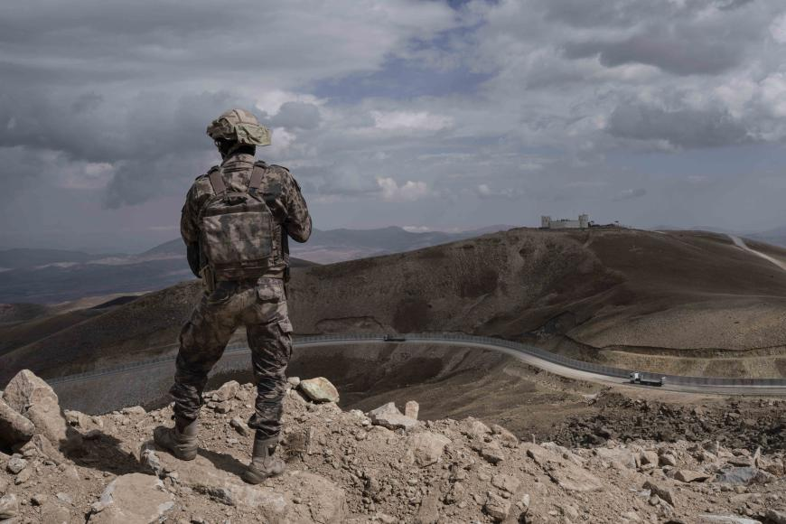
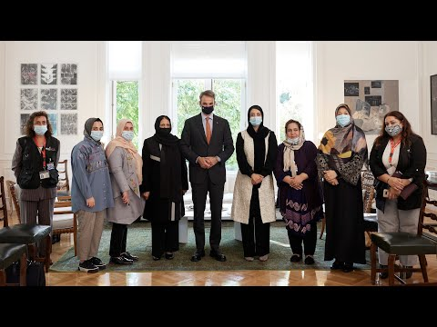

### AYS Weekend Digest: 16–17\.10\.2021: Polish lawyer bears witness to human rights violations

**Protests against conditions in Libya // Lives lost off African coast // Afghan population face starvation // Turkish authorities push people back to Iran // Women Afghan MPs and judges meet Greek Prime Minister // Conditions in Northern Bosnia // Unfair German regulations result in failed family reunification // Anniversary: French police against protesters, 60 years on // Saved from off\-shore Australian detention**
#### FEATURE
#### Polish lawyer bares witness to human rights violations

 Michal Kosc / Forum](assets/799ca5074ca0/0*dLOYBG0cispm8TY2)

Photo Credit: [Wawalove](https://wawalove.wp.pl/dramat-na-granicy-polski-z-bialorusia-chlopiec-byl-przerazony-nie-zapomne-jego-oczu-6694008353684320a?fbclid=IwAR2jVlCLbg75qwXZrY9lF3nLQuNaqW0lUPR_NU2yFyUqXMElWf3h9iinAW4) Michal Kosc / Forum

Lawyer Marta Górczyńska has given an in\-depth account of witnessing [the treatment of people trapped at the Polish\-Belarusian border](https://wawalove.wp.pl/dramat-na-granicy-polski-z-bialorusia-chlopiec-byl-przerazony-nie-zapomne-jego-oczu-6694008353684320a?fbclid=IwAR0suHmXMBRenkXcwqL2F8oyD_4hMJvHDmLkha4O8oiMEakHisP9dlGSaBo&src01=6a4c8&src02=isgf) during a visit at the end of September\.

> “\[The group\] was about ten men from different countries, Cameroon, Sri Lanka, boys actually, in their twenties\. There were also minors, 16 and 17 years old\. They spoke in trembling voices, some even crying about how they had been deceived\. They were convinced that the Belarusian visa allowed them to travel all over Europe, that they would go wherever they wanted\. They fell into a trap\. They cried that the guards had thrown them out, that they were intimidating them, no one wanted to listen to them\.” 

Górczyńska described the conditions in which the people are living\. A group of five activists dressed the group in dry, warm clothes\. One man from Iran collapsed from exhaustion and hypothermia\.

The conditions for people trapped in the border area [were also highlighted\.](https://www.facebook.com/maciej.moskwa/posts/10158943493159081) Described as cold, wet and in the forest, the health and well\-being of these people comes second to the political manipulation between the European Union and Poland and Belarus\.

This comes amidst [‘the biggest’ protest](https://twitter.com/CaroRackete/status/1449828898435371025?fbclid=IwAR3Kl_l5XKIT_N8u2IQRfV8B4Hc_g9xoeDtqxIdhAsThfAI1x01IcTLQejQ) in the Polish capital Warsaw yesterday where [emergency foil blankets](https://twitter.com/Claudia_Warsaw/status/1449794297365213186?fbclid=IwAR2yh6JwM0amCkVLmrfpvic4e71Q49IiMImWkc_rTtW_RwlZaGDYIO7Bsn0) have become the symbol of the protest, [representing the harsh conditions](https://www-rainews-it.translate.goog/dl/rainews/media/Polonia-a-Varsavia-marcia-di-solidarieta-con-i-migranti-9fca78fb-a437-4a3a-bb8b-b601dc235a3c.html?fbclid=IwAR26NjsxJensIAbiOCvA1qXeH2dJtBBubo_bDwiX6xO3ORjtflywg-2Cu7M&_x_tr_sl=it&_x_tr_tl=en&_x_tr_hl=en-GB&_x_tr_pto=nui#foto-1) which people are forced to endure\.
#### LIBYA
#### Protests against conditions in Libya

Human Rights Defender [Almoatassam Senoussi](https://twitter.com/Senoussiii) reported on the situation in Tripoli this weekend\. In an initiative which was not affiliated to any organisation, Senoussi and his colleagues took hygiene kits and basic food aid to minors and women as well as conducting interviews\.

This comes as people protest the treatment of refugees in Libya\. Those whom Senoussi interviewed were protesting outside the UNHCR Office in Tripoli\. Local group [Refugees in Libya](https://twitter.com/RefugeesinLibya/status/1448702173207044098?fbclid=IwAR0L79WUE7xcVc7axToENDJw5mv5urzRo8ORtYKTHBc35GwTSRW-Czzk224) denounce the conditions suffered by pregnant women and children\. [Voices were added to the protest in Frankurt, Germany](https://twitter.com/sey_geb/status/1449491485800423432?fbclid=IwAR1oB4vPscAC9Br30oJrS2cI0-T4HQZQgIjh6jMI6COtoBseGkQ1HOwbJiM) , where hundreds gathered with placards and chanted for change\.

#### SEA — SAR
#### Lives lost off African coast

 Seabird watches the water\.](assets/799ca5074ca0/0*zgy984n1mwzRqbKh)

Photo Credit: [AP News](https://apnews.com/article/europe-africa-migration-only-on-ap-birds-d84260007646147679759ed2bce9628c?fbclid=IwAR3TYDaQ1da2qJwj4nC_qo3dP-rD0YhmEuLIh1AQuRWQcc34yHepmjd59Rk) Seabird watches the water\.

One person was left dead after a boat faced problems off the coast of Morocco\. [Accusations against Moroccan authorities](https://twitter.com/alarm_phone/status/1449451192065605633?fbclid=IwAR0BoeZGQIGB8C9RsjqHCcHp8I77PBzOyTy4Py3i1lR11sQ53tCz9fOGMdo) were levelled when the boat was destabilized, causing most of the passengers to have to swim for shore\. Hours later a body was found\.

Further tragedy was reported off the Tunisian coast\. A boat carrying [31 people was shipwrecked between Mahdia and Monastir](https://twitter.com/alarm_phone/status/1449751022881148931?fbclid=IwAR0BoeZGQIGB8C9RsjqHCcHp8I77PBzOyTy4Py3i1lR11sQ53tCz9fOGMdo) \. This resulted in 2 people losing their lives with a further 22 people still missing\.

The monitoring work of SeaWatch’s airplane ‘ Seabird’ was the subject of [this insightful piece](https://apnews.com/article/europe-africa-migration-only-on-ap-birds-d84260007646147679759ed2bce9628c?fbclid=IwAR3TYDaQ1da2qJwj4nC_qo3dP-rD0YhmEuLIh1AQuRWQcc34yHepmjd59Rk) \. Seabird flies over the waters between Libya and Italy, monitoring boats, hoping to avert tragedies, as well as calling out human rights abuses by the so\-called Libyan coast guard\. The plane was able to alert rescue boat [SeaWatch3 to evacuate 54 people](https://twitter.com/seawatch_intl/status/1449756080339312647?fbclid=IwAR3b5ZBx3MpHpidcbUVcj1AeL4B_x-ITPs5b1gAI9dsh09USV2PRpQnwuZ8) from a rubber boat on Sunday\.

[A rescue was performed](https://www.eldiario.es/canariasahora/migraciones/rescatada-patera-45-migrantes-fallecido-100-metros-costa-gran-canaria_1_8404537.html?fbclid=IwAR26NjsxJensIAbiOCvA1qXeH2dJtBBubo_bDwiX6xO3ORjtflywg-2Cu7M) off the coast of Gran Canaria on Sunday\. A boat with 45 people on board was 100 metres from the coast\. They were taken to the port of Arguineguín where one person was sadly declared dead and others received medical assistance\.
#### AFGHANISTAN
#### Afghan population face starvation

95% of people in Afghanistan do not have enough to eat according to the United Nations’ World Food Program\. As the Taliban takeover has closed borders to neighbouring Pakistan and Iran, so have they closed the doors for people to work in those countries\. Previously, men could work as labourers across the border\. [This article explores the severity of poverty of one family\.](https://www.wsj.com/articles/as-afghanistan-sinks-into-destitution-some-sell-children-to-survive-11634387501?st=rpcnemviearry7h&reflink=share_mobilewebshare&fbclid=IwAR0jhdbEh3xn4CruUGC8O7q47MiR6FAew7diyj43WUzR01n8N0VLOAMB4fA)
#### TURKEY
#### Turkish authorities push people back to Iran

Photo Credit:© 2021 Alba Cambeiro/ SIPA Images/AP A Turkish soldier stands at the Turkish border with Iran\.

[Six people from Afghanistan told Human Rights Watch](https://www.hrw.org/news/2021/10/15/turkey-soldiers-beat-push-afghan-asylum-seekers-back-iran?fbclid=IwAR0tvj0x2q-9BGVRT5AuvcbHZsvvbeZJL0odYucYeVsEOLYAokLYPSZEmXs) that the Turkish army severely beat them and others before deporting them in groups of between 50 and 300 people as they sought safety\. The story told by the group interviewed includes how they fled the Taliban to Pakistan and Iran before smugglers had taken them to the border with Turkey, high in the mountains\. Groups included women and small children\.
#### GREECE
#### Women Afghan MPs and judges meet Greek Prime Minister

The Greek Prime Minister, Kyriakos Mitsotakis, [welcomed female MPs and judges](https://primeminister.gr/en/2021/10/15/27713) who have recently been evacuated from Afghanistan\. His kind words seem to have led to a helpful dialogue between the high\-powered women and their European colleague, however, this [twitter thread highlights the contradictions](https://twitter.com/samosvolunteers/status/1449391639601029120?fbclid=IwAR2WrhAgjQEcyrL3A84SS4Du3WoKCB5104_7esgidXdbvshzK0k8dczniPo) between the words and actions of the Greek government in relation to the treatment of refugees from Afghanistan\.

[This Special Report](ays-special-from-greece-are-you-eligible-to-eat-8cc3ac6bed3e) from Are You Syrious highlights issues people in the camp system have with accessing food\. Saturday 16th October marked World Food Day, and [there were calls](https://twitter.com/mobileinfoteam/status/1449376331658055689?fbclid=IwAR2IupWbVQHaCqZmEg2TE5p0ocmtwQ3UN04TceZlH1I19xgxW2exLjsxc3s) for Greece to do more\. Add in the storms over the weekend, and [the footage of the EU funded camp on Samos underwater](https://twitter.com/AdvocacySamos/status/1449371848924348417?fbclid=IwAR0cSrOzHleNWYEQwIpIFEQcLE-hL_ni7jdh1oP7LXgIJT35Zqunfv6EkYM) \. Life in camps is intolerable\.

■■■■■■■■■■■■■■ 
> **[Samos Advocacy Collective](https://twitter.com/AdvocacySamos) @ Twitter Says:** 

> > Thunderstorms hit all over #Greece mainland and islands.

General weather alert advices to 'avoid unnecessary movement and areas that have been or may be flooded'.

#RefugeesGr confined in the millions-worth EU-funded new #Samos camp don't have much of a choice.

#NoMoreCamps https://t.co/lVpnZiwsTB 

> **Tweeted at [2021-10-16 13:49:11](https://twitter.com/advocacysamos/status/1449371848924348417).** 

■■■■■■■■■■■■■■ 

A trending hashtag in Greek \(‘Mitsotaki where are the children’\) has brought attention to the number of missing children from the asylum system\. Whilst this hashtag seems to be linked with a well\-known Greek actor who is currently in prison awaiting trial for sex offenses against children, there are complex reasons for children missing from the system\. [This twitter feed](https://twitter.com/lk2015r/status/1449772632803512328?fbclid=IwAR26NjsxJensIAbiOCvA1qXeH2dJtBBubo_bDwiX6xO3ORjtflywg-2Cu7M) explores some of the reasons and the danger of oversimplifying a complex issue\.

EU’s Migration Commissioner Ylva Johansson has called for a transparent investigation into pushback claims in the Aegean Sea\. This is a condition imposed before further funding will be granted\. The Greek government is [examining the possibility of designating the National Transparency Authority \(EAD\) to this role\.](https://www.ekathimerini.com/news/1169960/transparency-authority-may-probe-pushback-claims/?fbclid=IwAR3TYDaQ1da2qJwj4nC_qo3dP-rD0YhmEuLIh1AQuRWQcc34yHepmjd59Rk) This comes as more people are likely to have been pushed back as contact was lost with [a group who arrived in Ikaria\.](https://twitter.com/PDimitras/status/1449666105136586757?fbclid=IwAR20Nljg2uwbey2eOy3uo_GO0GKXYSIAgwXuRtTeCQ3S8hJkHsROUYG9yeY)

 /Picture Alliance\.](assets/799ca5074ca0/0*ZHPNdrQluEKPvalE)

Photo Credit: [Deutsche Welle](https://www.dw.com/en/golden-dawn-is-down-but-far-right-rises-again-in-greece/a-59528529) /Picture Alliance\.

The concerning rise of far\-right parties in Greece is the topic of [this article](https://www.dw.com/en/golden-dawn-is-down-but-far-right-rises-again-in-greece/a-59528529) \. The photo above shows the actions of right\-wing youths in Thessaloniki in September when they acted against fellow school students who protested government education proposals\.

The article continues with incidents perpetrated by other right\-wing groups\. Golden Dawn is a far\-right group, some of their leaders were jailed last year, but [it has been pointed out](https://twitter.com/VassilisTsarnas/status/1449755562309214212?fbclid=IwAR0p_XJZZ49pS2W272WYtqgcU3JwZ5xF1VuVldXGPpqjDwpw4ofEhGDcs_w) that the group wasn’t actually outlawed\.
#### BOSNIA
#### Conditions in northern Bosnia

 \. A tent camp in Velika Kladuša, Bosnia\.](assets/799ca5074ca0/0*4rk_5TUFnDG48hZe)

Photo Credit: [Umino](https://www.facebook.com/umino.org/posts/4113312775440431) \. A tent camp in Velika Kladuša, Bosnia\.

[German organisation Umino reported from their aid mission to northern Bosnia](https://www.facebook.com/umino.org/posts/4113312775440431) \. They describe how the situation is for people living near the border of the European Union\. Official organisations and local people help those who are sleeping in tents outside of the town of Velika Kladuša\.

> “From the little infant to the old man, you can see all ages here\. Some have occupied quarters on the actually closed grounds, where the showers used to exist until they were stopped by the authorities\. But most people live in small camping tents, pimped with plastic tarps or other provisions in the meadow\.” 

#### GERMANY
#### Unfair regulations result in failed family reunification

[This post](https://www.facebook.com/Moabithilft/posts/3940503562715789) details how the German system for family reunification is confusing, unfair and expensive, resulting in families being kept apart\. Family reunification exists to ensure children can join their parents if they have been separated, but the German system takes months to assess a case\. It is then often rejected, an appeal is made, and that appeal is subsequently successful\. The financial cost of this is paid by the refugee family members\.
#### FRANCE
#### Anniversary: French police against protesters, 60 years on\.

](assets/799ca5074ca0/0*oHKIk31qZdau02zL)

Photo Credit: [Arthur Asseraf](https://twitter.com/ArthurAsseraf)

60 years ago this weekend, on 17th October 1961, Parisian police threw Algerian protesters in the River Seine\. [This twitter thread](https://twitter.com/ArthurAsseraf/status/1449080493383770112?fbclid=IwAR01FCdDGqPXD-ZWi-eBWIA2MB6uA2eg6dusku0xFsXpZ7-rT-_pK8rIrZc) explores the history of Algerian people working in France following colonial rule\.
#### AUSTRALIA
#### Saved from off\-shore Australian detention

[10 people held in off\-shore detention](https://www.refugeecouncil.org.au/36469-2/?fbclid=IwAR3fju9R-Se46xGVceiaWd2NvTGIURduujaf_Tw90Ukl258Bvn7aI3WgfKI) in Australia are to be resettled to Canada\. In what is hoped to be the first of many groups to start a new life in Canada, organisations formed in both Australia and Canada Operation \#NotForgetten and raised millions of Australian dollars to enable resettlement\.

Whilst every victory is celebrated, [1,440 people remain in closed detention](https://www.refugeecouncil.org.au/detention-australia-statistics/?fbclid=IwAR2IupWbVQHaCqZmEg2TE5p0ocmtwQ3UN04TceZlH1I19xgxW2exLjsxc3s) in Australia, a model that European Countries have expressed interest in following the off\-shore model, despite heavy criticism\.
#### GENERAL

[This long read tells](https://www.middleeasteye.net/news/libya-footballers-italy-migration-prison-mediterranean?fbclid=IwAR3ZCQHcxKeBCC8-qqn3M1vqikWYJqv2Y4HMl_0PsvJMKjyK96CTSEGoxjw) the stories of footballers from Libya who have been imprisoned in Italy for several years\. They arrived in Italy on a boat from Libya where 49 other passengers sadly died\.

**Find daily updates and special reports on our [Medium page](https://medium.com/are-you-syrious) \.**

**If you wish to contribute, either by writing a report or a story, or by joining the info gathering team, please let us know\.**

**We strive to echo correct news from the ground through collaboration and fairness\. Every effort has been made to credit organisations and individuals with regard to the supply of information, video, and photo material \(in cases where the source wanted to be accredited\) \. Please notify us regarding corrections\.**

**If there’s anything you want to share or comment, contact us through Facebook, Twitter or write to: areyousyrious@gmail\.com**

_Converted [Medium Post](https://medium.com/are-you-syrious/ays-weekend-digest-16-17-10-2021-polish-lawyer-bears-witness-to-human-rights-violations-799ca5074ca0) by [ZMediumToMarkdown](https://github.com/ZhgChgLi/ZMediumToMarkdown)._
