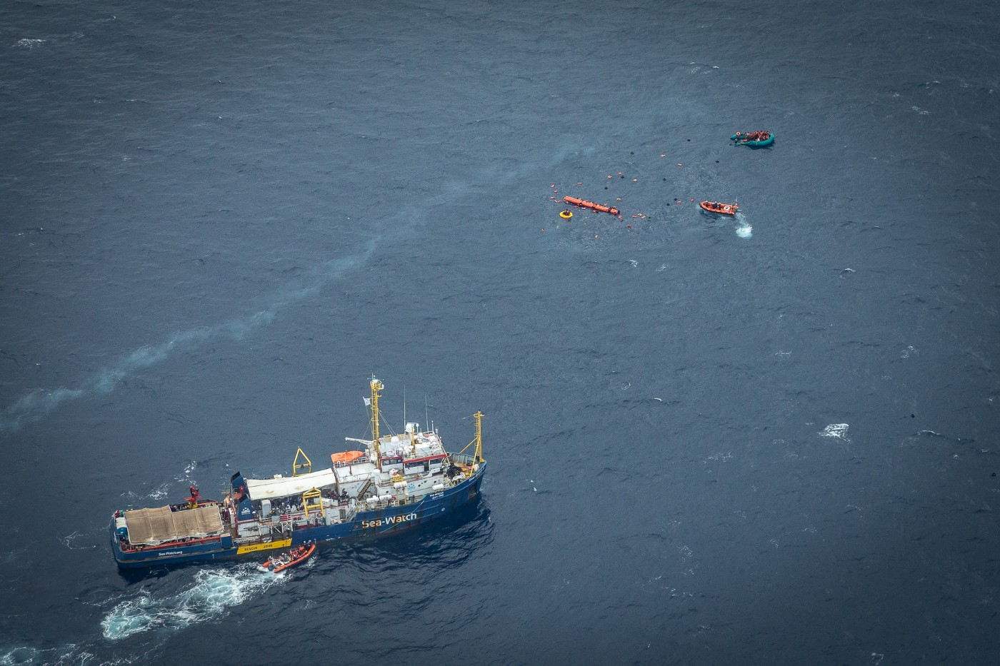

### AYS News Digest 18/10/2021: Dramatic situation in the Mediterranean
#### Sea Watch rescued over 400 people //so\-called Libyan coast guards ram dinghy // at least 14 people dead, many more missing // Still no food for thousands in Greek camps // BVMN submission to UN Committee on Pushbacks from Romania // signals of solidarity in Poland

Sea Watch 3 in a rescue mission with people overboard, witnessed by Seabird\. Copyright: Sea Watch International
### Situation in the Mediterranean is once again dramatic

Many people tried to cross the Mediterranean Sea to leave behind the terrible conditions People on the Move face in Libya\.

After seven rescue operations, the Sea Watch 3 is currently sailing, with 412 rescued people on board\.

■■■■■■■■■■■■■■ 
> **[Sea-Watch International](https://twitter.com/seawatch_intl) @ Twitter Says:** 

> > 🔴 After two more rescues: 412 people on board the #SeaWatch3.

Our #Seabird crew informed our rescue ship about an overloaded rubber boat in distress. Although the boat was about to sink & people were in the water, luckily everyone could be brought to safety. https://t.co/uR3VpybUGe 

> **Tweeted at [2021-10-18 13:27:30](https://twitter.com/seawatch_intl/status/1450091168042307586).** 

■■■■■■■■■■■■■■ 

Two boats in distress were rescued by the Nadir ship in the Maltese Search and Rescue zones\. 34 people have been rescued, among them 16 children\. Maltese, Italian and German authorities are not doing anything to provide a safe port for the people on board\.

■■■■■■■■■■■■■■ 
> **[RESQSHIP](https://twitter.com/resqship_int) @ Twitter Says:** 

> > 🔴During the night, #Nadir encountered two overcrowded and unmaneuverable boats in distress in Maltese SAR zone. In total, 34 people were aboard, among them many children and one heavily pregnant woman. They all are recieving first care now on board the #Nadir. (1/2) https://t.co/4zc7NPd6o9 

> **Tweeted at [2021-10-18 09:31:15](https://twitter.com/resqship_int/status/1450031711669075968).** 

■■■■■■■■■■■■■■ 

Alarm Phone is informed about two more boats off the Libyan coast\. In the morning of the 18th October, the NGO lost contact with one boat that had 75 people on board\. The so\-called Libyan coast guards did not rescue the people, even though they were informed hours before\. It is unclear what happened to the people on board\. Another boat with 20 people on board is also at risk in the Libyan Search and Rescue zone\.

[According to Spanish media](https://www.rtve.es/noticias/20211018/pateras-baleares-migrantes-bordo/2193120.shtml?fbclid=IwAR0iRXgHul6Pr9EDBXrGYLVAnnelTK-iKM5XpBSrDuSyjT1OBN-HqaOaZNs) , about 500 people have arrived in Spain in the last few days\.

Meanwhile, the Sea Watch aircraft, Seabird, witnessed several pushbacks while providing assistance to the Sea Watch rescue missions and looking out for boats in distress\. In one case, a boat was rammed by the so\-called Libyan coast guard\. When Alarm Phone inform the Libyan coast guards about boats in distress, they remain inactive and abandon the people to their fate\. However, if there is a possibility to push people back, the Libyan coast guards will be on the spot in no time\.

■■■■■■■■■■■■■■ 
> **[Sea-Watch International](https://twitter.com/seawatch_intl) @ Twitter Says:** 

> > Besides supporting rescues of #SeaWatch3, our aircraft crew had to witness once more illegal and violent pullbacks to #Libya. One boat was rammed at full speed by a so-called Libyan Coast Guard patrol boat, risking the lives of ~80 people trying to seek safety. #LibyaIsNotSafe https://t.co/2PGLnyCilm 

> **Tweeted at [2021-10-18 17:39:14](https://twitter.com/seawatch_intl/status/1450154520537968642).** 

■■■■■■■■■■■■■■ 

[According to InfoMigrants](https://www.infomigrants.net/en/post/35791/dozens-of-migrants-feared-dead-hundreds-rescued-in-mediterranean-and-atlantic?fbclid=IwAR2O4kG4T9WGOzfonvi4W0DOd1H5BAX7UN0Hws_HDg8WtmQzsmUx7Lk-qp0) , at least 14 people died in the past days while trying to cross to Europe, and another 47 have gone missing\. Is is so shocking how these numbers have become such an everyday normality that does not even reach the attention of the media\. Our thoughts are once again with those who lost or are in fear of having lost their loved ones\. Our anger is once again with the racist European border regime\.
### TURKEY
#### Pushbacks of Afghans into Iran

Human Rights Watch published a report on pushbacks of Afghan nationals from Turkey into Iran\. The violent collective pushbacks happen in groups of 50–300 people\. Before being pushed back, people were beaten and their belongings taken or destroyed by Turkish military\.

See the full report here:

#### What happens to Turks who are pushed back from Greece?

While the topic of pushbacks from Greece to Turkey is getting at least some media attention thanks to journalists’ and activists’ tireless efforts, there is not much coverage on people from Turkey who are fleeing their country and are pushed back at Europe’s doorsteps\. A report published by Peace & Justice, an organization monitoring human rights in Turkey and other countries, highlights these special conditions\. Many of those who try to flee the Erdoğan regime face prison when being sent back to Turkey\.

■■■■■■■■■■■■■■ 
> **[PEACE & JUSTICE](https://twitter.com/Peace_JusticeEU) @ Twitter Says:** 

> > Our pushback report shed light on the situation of many Turks exposed to pushbacks / refoulements [flipsnack.com/peaceandjustic…](https://www.flipsnack.com/peaceandjustice/pushbacks-report-the-case-of-turks-at-greek-borders.html) 

> **Tweeted at [2021-10-18 12:06:33](https://twitter.com/peace_justiceeu/status/1450070796643221506).** 

■■■■■■■■■■■■■■ 

### GREECE

Following reports that many people in Greek camps no longer get any food supplies \( [see our latest Special here for more information](ays-special-from-greece-are-you-eligible-to-eat-8cc3ac6bed3e) \), [26 organizations called on the Greek government](https://www.lesvossolidarity.org/en/blog/news/26-organisations-urge-the-greek-government-to-immediately-meet-the-needs-of-those-seeking-international-protection,-ensuring-food-security-and-access-to-their-fundamental-human-rights?fbclid=IwAR2O4kG4T9WGOzfonvi4W0DOd1H5BAX7UN0Hws_HDg8WtmQzsmUx7Lk-qp0) to:

> **_“immediately disburse belated payments of cash assistance and ensure food provision to people living in facilities \(e\.g\. camps and ESTIA apartments\), irrespective of their legal status\.”_** 

After changes in legislation and the handover of the cash assistance program from UNHCR to Greek authorities, thousands of people who got their refugee protection either recognized or rejected as well as those who were not able to lodge asylum applications due to the non\-functional system, are no longer eligible for the provision of food\.

In response to the statement made by the NGOs, the Greek Migration and Asylum Ministry tweeted that:

■■■■■■■■■■■■■■ 
> **[Υπουργείο Μετανάστευσης & Ασύλου](https://twitter.com/migrationgovgr) @ Twitter Says:** 

> > 📌 All #asylum seekers are eligible to feeding programmes in the #camps since the 1st of October and they will also be granted financial aid at the end of the month

Response to an #NGO‘s letter regarding the feeding of #asylumseekers

 [bit.ly/3phPOpQ](https://bit.ly/3phPOpQ) 

> **Tweeted at [2021-10-18 15:43:25](https://twitter.com/migrationgovgr/status/1450125373258313732).** 

■■■■■■■■■■■■■■ 

However, people who are at the moment in the process of seeking asylum are only a small number of those who live in camps and squats in the country\. With no functioning integration program for recognized refugees, and no opportunities for people who got their claims rejected, Greece is once again failing thousands of people\.

#### Dutch activists on Lesvos detained without arrest warrant and subjected to a genital search

■■■■■■■■■■■■■■ 
> **[Lena K.](https://twitter.com/lk2015r) @ Twitter Says:** 

> > 🇬🇷Police in Lesvos detained for several hours 3 🇳🇱 activists (2 women, 1 man) who were supporting a group of people on the move. One woman was subjected to a strip & vaginal search; the other refused to do so; the man wasn't strip-searched. Questioned about activities & contacts. 

> **Tweeted at [2021-10-18 16:41:23](https://twitter.com/lk2015r/status/1450139961567715328).** 

■■■■■■■■■■■■■■ 

### ROMANIA
#### Submission to UN Committee on Pushbacks from Romania by BVMN

Romania hasn’t got too much attention so far\. BVMN handed in a submission to the UN [Committee on Economic, Social and Cultural Rights](https://www.ohchr.org/en/hrbodies/cescr/pages/cescrindex.aspx) , proving the fact Romania is violating the International Covenant on Economic, Social and Cultural Rights\. The testimonies collected by BVMN partner organizations show an extreme level of violence being used in pushbacks from Romania\. Most pushbacks happen from Romania to Serbia\. According to UNHCR Serbia, 13,409 persons were collectively expelled from Romania to Serbia between 1st January and 31st December 2020\.

■■■■■■■■■■■■■■ 
> **[Border Violence Monitoring Network](https://twitter.com/Border_Violence) @ Twitter Says:** 

> > 1/ Today BVMN presented findings to the @[UN](https://twitter.com/UN) Committee on Economic, Social and Cultural Rights regarding #pushbacks and other forms of border violence perpetrated by #Romanian authorities.
[borderviolence.eu/cescr-submissi…](https://www.borderviolence.eu/cescr-submission-on-romania/) 

> **Tweeted at [2021-10-18 15:27:49](https://twitter.com/border_violence/status/1450121446303404037).** 

■■■■■■■■■■■■■■ 

### MALTA
#### International Commission with Achille Mbembe to speak in defense of El Hiblu 3

On Malta, the El Hiblu 3 are still on trial\. The young men were arrested in 2019 at the ages of 15,16, and 19 and were accused of charges amounting to terrorist activity\. The commercial ship El Hiblu rescued 108 people from distress and was ordered by Maltese authorities to bring them to Libya, but instead landed on Malta in March 2019\. The three boys are accused of hijacking the ship while they themselves and witnesses on board say they were simply functioning as translators, as they were speaking English\. An international commission, consisting of human rights activists, parliamentarians and other people holding high official positions, will speak in defense of the El Hiblu 3\. Amongst the commission is also Cameroonian philosopher Achille Mbembe\. For more, see:

### ITALY
#### 11 people sentenced for human trafficking

11 men have been sentenced for human trafficking and were given charges of 6–20 years in prison\. They belonged to a ring of human traffickers who tricked young girls and women, mainly from Nigeria, into making the journey to Europe and then forced them into prostitution\.

### POLAND
#### In the Polish border area, people lit green lights to signal solidarity with refugees

The action was started by a lawyer who lives in the area and quickly gained media attention\. Among those who took up his idea is the mayor of Michałów, a town at the center of the events\. The signal is meant to show People on the Move that they can receive a hot meal, and get warm and dry in these houses\.

■■■■■■■■■■■■■■ 
> **[Monika Mesuret](https://twitter.com/NocnaZ) @ Twitter Says:** 

> > Burmistrz Michałowa i radni zapalili przed swoimi domami zielone żarówki. Domy w zielonej poświacie to informacja dla migrantów, że znajdą w nim doraźną pomoc: posiłek, ogrzanie się, zmianę ubrań, naładowanie telefonu, prostą pomoc medyczną czy lekarstwa❤️ [noizz.pl/spoleczenstwo/…](https://noizz.pl/spoleczenstwo/akcja-pomocy-dla-uchodzcow-zielone-swiatlo-oznacza-pomoc/t87c153) https://t.co/Li7qqD9caQ 

> **Tweeted at [2021-10-18 12:25:06](https://twitter.com/nocnaz/status/1450075462668062720).** 

■■■■■■■■■■■■■■ 

On Sunday, [thousands of people walked through Warsaw,](https://www.infomigrants.net/en/post/35790/poland-thousands-protest-against-migrant-pushbacks-at-belarus-border?fbclid=IwAR0U6R3RWMdLCgf5weDA4DzW5bE_mEpp4qh7abOQhw0FMFj4yrOPiAGYdzA) demanding an end to pushbacks and the state of emergency along the Polish border\.

■■■■■■■■■■■■■■ 
> **[Marija Ristić](https://twitter.com/Marien__R) @ Twitter Says:** 

> > Thousands gather in #Warsaw to protest inhumane treatment of migrants and refugees on the Polish Belarus border. Many carrying thermal blankets as flags in solidarity with those trapped at the border crossings.

Background: [bit.ly/3n5rpkL](https://bit.ly/3n5rpkL)

https://t.co/xzrZgXm5fD 

> **Tweeted at [2021-10-17 12:35:37](https://twitter.com/marien__r/status/1449715721274003458).** 

■■■■■■■■■■■■■■ 

#### Medics still not allowed access into border area

The group Medycy Na Granicy, a team of medical volunteers, is still waiting to get access to the border area of Poland\. Currently, it is forbidden for journalists, activists and medics to enter this area\. They sent a statement to the Polish government asking for immediate access in order to save lives\.

■■■■■■■■■■■■■■ 
> **[Medycy Na Granicy](https://twitter.com/medycynagranicy) @ Twitter Says:** 

> > STRAŻ GRANICZNA PO RAZ KOLEJNY ODMAWIA WJAZDU MEDYKOM

Od 10 dni nasza karetka i nasi ludzie są na Podlasiu - tam, gdzie mogą być, poza obszarem stanu wyjątkowego. Od 10 dni codziennie budzimy się i zasypiamy, gotowi w każdej chwili jechać do osób, które potrzebują ratunku. https://t.co/pOzaHLOq9l 

> **Tweeted at [2021-10-18 13:06:44](https://twitter.com/medycynagranicy/status/1450085943399133184).** 

■■■■■■■■■■■■■■ 

### LITHUANIA
#### Additional troops will be sent to the border

Lithuania's I [nterior Minister announced on Monday](https://www.lrt.lt/en/news-in-english/19/1522618/lithuania-to-send-more-troops-to-protect-border-with-belarus?fbclid=IwAR3mIZtWDTma7yunZh1yEBwR99Fj-qSHTAVbmCurcPl93ssacDZBBnw0TaI) that up to 64 additional troops will be sent to the border on a daily basis\. She spoke of an “ongoing hybrid aggression” and announced close cooperation between the military and Frontex\.
### GENERAL
#### BVMN Monthly report published

The Border Violence Monitoring Network, of which AYS is a member, just published its September report on Border Violence\. The report highlights how sexual assault is taking place during pushbacks from Croatia to Bosnia and Serbia, and further states that third country nationals are being used by Greek authorities to drive boats during pushbacks over the Evros river in return for documents\. The report also mentions a chain pushback from Slovenia to Bosnia, via Croatia, as well as pushbacks from Italian coastal cities with ferries to Greece\.

■■■■■■■■■■■■■■ 
> **[Border Violence Monitoring Network](https://twitter.com/Border_Violence) @ Twitter Says:** 

> > The Border Violence Monitoring Network (BVMN) published 35 testimonies of #pushbacks in September, sharing the experience of 815 people-on-the-move at borders across the #Balkans. 
[borderviolence.eu/balkan-region-…](https://www.borderviolence.eu/balkan-region-report-september-2021/) https://t.co/57CXNUqvpR 

> **Tweeted at [2021-10-18 11:24:32](https://twitter.com/border_violence/status/1450060222102491136).** 

■■■■■■■■■■■■■■ 

### UK
#### People unite to protest the new Nationality and Border Bill: Demonstration on Wednesday

A broad alliance of NGOs and activists is mobilizing for a demonstration against the Nationality and Border Bill that the UK Home Office is pushing forward\. The rally will take place on Wednesday at 4:30 at the Parliament Square in London\.

For detailed information on the Nationality and Border Bill, see here:

### WORTH READING
#### Puppet Amal about to finish her journey

The Puppet Little Amal is about to finish her walk through Europe by crossing from France to the UK\. The puppet that represents a refugee child has travelled 8,000 km through Europe and encountered hatred and racism alongside the warm welcomes\.

#### Long read on the most dangerous route into Europe

This long read sheds light on the route to the Canary Islands, that is extremely dangerous as it is very long and there is a high risk of missing the islands and drifting into the open Atlantic\.

#### Latest Mixed Migration Update published

The latest weekly Mixed Migration Update which covers topics related to migration from all over the world has been published:

**Find daily updates and special reports on our [Medium page](https://medium.com/are-you-syrious) \.**

**If you wish to contribute, either by writing a report or a story, or by joining the info gathering team, please let us know\.**

**We strive to echo correct news from the ground through collaboration and fairness\. Every effort has been made to credit organisations and individuals with regard to the supply of information, video, and photo material \(in cases where the source wanted to be accredited\) \. Please notify us regarding corrections\.**

**If there’s anything you want to share or comment, contact us through Facebook, Twitter or write to: areyousyrious@gmail\.com**

_Converted [Medium Post](https://medium.com/are-you-syrious/ays-news-digest-18-10-2021-dramatic-situation-in-the-mediterranean-8c073d44eba3) by [ZMediumToMarkdown](https://github.com/ZhgChgLi/ZMediumToMarkdown)._
