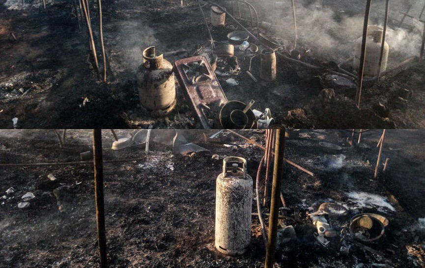
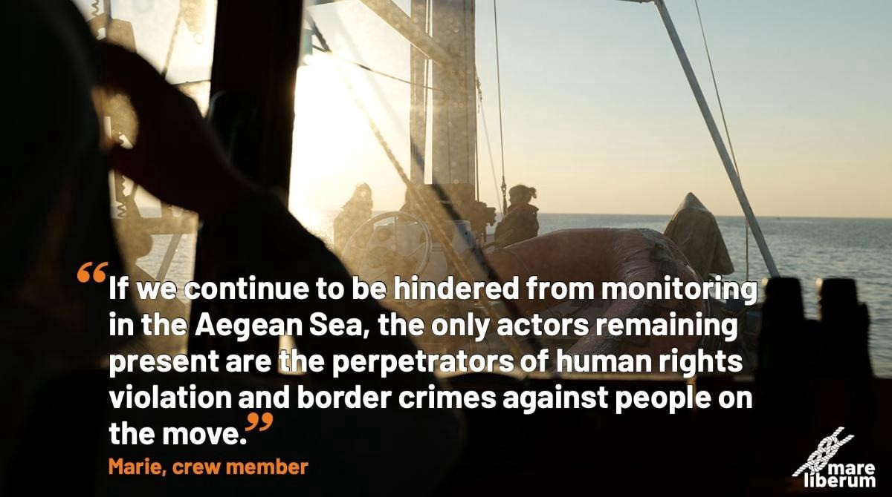
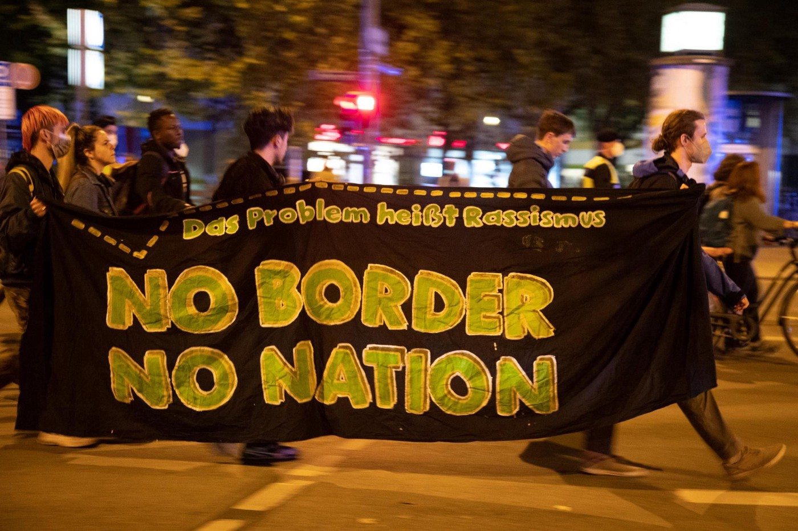
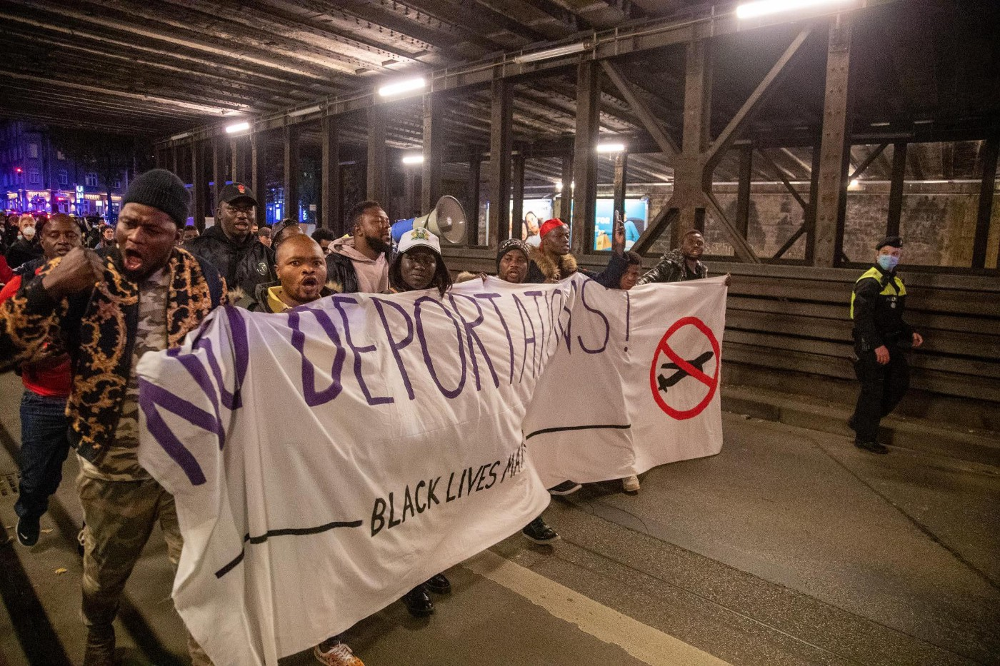

### AYS Daily Digest 22/10/2021: Greece: Fire destroys 15 huts in migrant worker settlement in Manolada

[Are You Syrious?](?source=post_page-----fe232d1975c3--------------------------------)

[Oct 23](ays-daily-digest-22-10-2021-greece-fire-destroys-migrant-workers-settlement-in-manolada-fe232d1975c3?source=post_page-----fe232d1975c3--------------------------------) · 11 min read

LIBYA: Sit\-ins continue in front of UNCHR centre in Tripoli\. GREECE: new arrivals, camp manager of Mavrovouni resigns, Mare Liberum back at sea…or not?, automated surveillance on Evros border is expanded\. MALTA: \#ElHiblu3 Freedom Commission is launched\. BELARUS/POLAND: 8th victim of border standoff\. Updates from Bosnian/Croatian Border\. Demonstrations in Germany\. FRANCE: What happens after people are rescued/intercepted in the Channel? SWITZERLAND: Referendum against Frontex…

“Fire in the huts of migrant land workers in Nea Manolada had also erupted on the afternoon of Sunday 27 June … Two PZL firefighting aircraft were needed to extinguish the fire\.” \(Photo and Text by [Queer Provocateur](https://twitter.com/hereticProvo/status/1451534636178448385) \)
### FEATURED — Greece: Fire destroys 15 huts in migrant worker settlement in Manolada\.

Last Friday, 15th October, a fire destroyed up to 15 makeshift houses in the migrant workers’ settlement in Manolada, Western Peloponnese, Greece\. The news has only just been reported, after having been shared on social media\.

> _…At least two workers suffered serious burns while trying to put out the fire \. At that time, in the 15 shacks that were engulfed in flames, there were 34 people\. \( [ThePressProject](https://thepressproject.gr/fotia-stis-paragkes-ergaton-sti-manolada-meta-tin-protovoulia-tous-gia-syndikalistiki-organosi/?fbclid=IwAR2ORI2U5t5w3ckjNTFRrgGsydD0PBeC8kRMayoIV3WP9E5_lQ8BgVmQS6c) \)_ 

Farm animals died in the fire and people lost personal belongings, such as passports, money, refrigerators and cookers\.

According to Greek [media](https://www.koutipandoras.gr/article/manolada-fotia-ergates-syndikato) , at that time there were no active heat sources and it is impossible for the fire to have been an accident\. Many observers have connected the fire with an announcement made a few days earlier that a trade union of land workers in the region has been established\.

Manolada has a long history\. Over the past 15 years, the production of strawberries — the red gold of Greek export — has grown drastically and it is set to grow further over the next years\. Around 10,000 migrant workers are estimated to live in the area\. In 2013, the conditions at Manolada garnered international media attention when workers started a protest to demand six months’ worth of unpaid wages, and were met with rifle shots, which injured 30 people\.

**Read More:** [Greek Strawberry ‘made in Bangladesh’](https://wearesolomon.com/mag/on-the-move/greek-strawberries-made-in-bangladesh/) , by Solomon Mag

A short documentary on the events of 2013: Morshed Chowduri, Murad Alimir, former workers of Manolada in 2013 and Vassilis Kerasiotis, the lawyer who brought the case up to the European Court of Human Rights, tell of the beginning of this story that still continues today with few variations in the same area, as well as throughout Greece and in the fields all over southern Europe\.

Manolada is one of the many sites in southern Europe where the connection between European migration policies and exploitation of the workforce is very evident\. Be these the greenhouses near Almeria in Spain, the tomato and orange fields in Puglia and Calabria in Italy, or strawberry fields in Manolada, migrant farm workers are often blackmailed and forced into slavery\-like conditions, with abysmally low wages, uncertain pay, violence and substandard living conditions in makeshift camps and abandoned warehouses\. Their precarious status as workers and as residents, and their vulnerability to these forms of blackmail and exploitation, are the end results of European border policies, which force people to find dangerous ways to reach the continent\.

LIBYA
### Thousands of people carry on their protest in Tripoli

It has been three weeks since the first [sit\-i](https://www.aljazeera.com/news/2021/10/22/thousands-migrants-and-refugees-plead-to-be-evacuated-from-libya) n in front of the UNHCR centre in Tirpoli\. People, now in their thousands, are demanding evacuation and safety\. Earlier this week, UNHCR had asked the crowd to disperse, without providing any actual support or information for people subjected to indefinite detention and labour exploitation, with no access to medical treatment, decent housing or decent food\. In October 2021 alone, 5000 people have been rounded up in the city and imprisoned in the — already overcrowded — detention centres of the country\.

SEA
### Sea\-Watch 3 given safe port

The 406 people aboard Sea\-Watch 3 have been [given safe port in Pozzallo](https://www.infomigrants.net/en/post/35939/migrant-rescue-ship-seawatch-3-assigned-port-in-italy?fbclid=IwAR34mzHIO2Kv4rDtW6RaRf_kXemIghLkI2Paw9blOLt8UGQ8hjzhHoyXSZg) , Italy, after [nearly a week at sea in dire conditions](https://sea-watch.org/en/situation-on-board-sea-watch-3-deteriorates-still-no-port-of-safety-for-over-400-rescued-people/?fbclid=IwAR22OZFNd4zV7zek5_yTxKEqjDBQCBqeH7TdBmD3Uw6ICx7yXXuOEUDCN1A) \. Approximately 150 of the people aboard are children\.

> _The medical capacities onboard are overwhelmed due to the sheer number of patients\. There are heavily pregnant women on board; others are suffering from extensive fuel burns\. These types of injuries need to be treated in a hospital under adequate conditions\. People need a safe place to disembark as soon as possible\. With every day at sea, the situation becomes more dangerous\. **Carolin Möhrke, medic on board Sea\-Watch 3** \._ 

In the last week, six women were evacuated from the ship due to medical emergencies\. One woman gave birth shortly after her arrival on land\.

CYPRUS
### Young people trapped in buffer zone

[Two young people from Cameroon](https://www.ekathimerini.com/society/1170349/limbo-in-a-blue-tent-african-asylum-seekers-stuck-on-cyprus/?fbclid=IwAR01MoAUoU8DONT3HX85hYyWlr_5Qh8ZZnhh0vgps-9_f1Qce8c3_YZ-P-U) , Grace and Ejube, remain trapped in the buffer zone between North and South Cyprus, surviving off donations from UNHCR and locals on both sides of the border\. Having flown to the Turkish part of Cyprus, not knowing that the island was divided, they tried to cross to the Greek side but were caught by UN forces\. Instead of handing them over to the Greek Cypriot authorities, they placed them in the buffer zone, which they have not been able to leave since\. The authorities do not want to offer them asylum, as they think it will encourage other people\. It remains, however, Grace and Ejube’s legal right to claim asylum\. Until that right is granted, they are living in a small blue tent in no\-man’s land\.

GREECE
### Arrivals and pushbacks

A group of 26 people arrived on Chios on Thursday\. Panagiotis Dimitras from the Greek Helsinki Monitor \(GHM\) [informed](https://twitter.com/PDimitras/status/1451101644532457472) the competent authorities about their location and their desire to apply for asylum\. The GHM also informed the authorities about 45 people arriving on Samos on Wednesday from two separate boats\.

Media [confirm](https://www.avgi.gr/koinonia/398893_ektheti-i-kybernisi-meta-ta-nea-peristatika-se-ikaria-kai-samo) that the 23 people who arrived on Ikaria last Sunday have been illegally pushed back to Turkey\. They were told that they were being transferred to Samos, but port authorities erased from people’s phones photos which proved their arrival on Greek soil, and then left them adrift on a life raft heading towards Turkey\. Turkish authorities found and rescued the raft on Monday\.
### Lesvos — Mare Liberum is back at Sea …or not?

The Greek authorities have once again shown their political intent to hinder and silence all groups and organisations that could report on what happens in the stretch of sea between the eastern Greek islands and Turkey\.

Since Thursday 21st October, Mare Liberum has finally been back in operation, but it took less than 24 hours for the Greek Coast Guard to [force](https://mare-liberum.org/en/human-rights-group-mare-liberum-hampered-from-monitoring-escalation-of-rights-violations-in-the-aegean-sea/) the monitoring vessel back to port:

> _After the crew had reached our monitoring spot at the Lamna Reef a vessel of the Hellenic Coast Guard approached our ship\. The Coast Guard officer ordered us to leave the anchoring spot stating the ship would pose a danger to „operations by Greek authorities“\._ 

> _Shortly after, the crew left the anchor spot and asked the port authorities to specify the restricted area via email\. Their reply exposes their true intentions: “Return to your original anchorage port of Skala Loutron keeping a safe course close to the coast until you clarify in written form the reasons for operating in areas under our jurisdiction\.”_ 

The Coast Guard argued that their concern was the safety of human lives at sea, which can hardly be taken seriously with the record of the HCG over the past few months\. According to Mare Liberum, “at least 156 cases of illegal pushbacks — involving around 5,000 migrants — off Lesvos have come to light this year alone\.”
### Lesvos — Mavrovouni camp manager resigns
### Evros automated border surveillance system expanded

On Thursday, the automated border surveillance system in Evros was [expanded](https://www.evros-news.gr/2021/10/22/%ce%ad%ce%b2%cf%81%ce%bf%cf%82-%cf%84%ce%ad%ce%b8%ce%b7%ce%ba%ce%b5-%ce%b1%cf%80%cf%8c-%cf%87%ce%b8%ce%b5%cf%82-%cf%83%ce%b5-%ce%bb%ce%b5%ce%b9%cf%84%ce%bf%cf%85%cf%81%ce%b3%ce%af%ce%b1-%cf%84%ce%bf/) \. Now it covers almost the entirety of the 190km border between Greece and Turkey, from Feres in the south to Ormenio in the north\. Cameras will provide a live stream of the borderlands to both local border police and to the headquarters of the police in Athens\.

In 2021,

[IOM — UN Migration](664cb26312d4?source=post_page-----fe232d1975c3--------------------------------)

Missing Migrants project recorded six deaths at the Evros border, while local medical authorities have reported 36, which suggests that the IOM’s documenting initiative is particularly [flawed](https://twitter.com/lk2015r/status/1451470133713645569) \.

MALTA
### ElHiblu3 Freedom Commision established

Today, the [ElHiblu3 Freedom Commission](https://elhiblu3.info/st/FC_EH3_EN.pdf) has been launched\!

> _It calls on Malta to immediately dismiss the proceedings against three young men — the ElHiblu3\. Two\-and\-a\-half years after the merchant vessel El Hiblu 1 arrived in Malta with 108 rescued people on board, the prosecution hasn’t formulated an official charge\. Upon arrival, the three African teenagers were arrested and accused of a multiplicity of crimes, including acts of terrorism and the hijacking of the vessel\. Until today, Malta has denied them a fair trial and has violated their basic human rights\._ 

The ElHiblu3 Freedom Commission is a newly formed and independent alliance of human rights advocates demanding freedom for the ElHiblu3:

> _Drop all charges\!_ 

> _Resisting push\-backs is not a crime\!_ 

> _Dismiss the trial immediately\!_ 

> _Free the [\#ElHiblu3](https://twitter.com/hashtag/ElHiblu3?src=hashtag_click)_ 

**Read More:** [Freedom for the ElHiblu3\! The criminalisation of asylum seekers in Europe should concern all of us\.](https://www.aljazeera.com/opinions/2021/10/22/freedom-for-the-elhiblu3)

ITALY
### Request for charges against Massimiliano Napolitano to be dropped

In May 2019, the crew of the Mare Jonio refused to return people to Libya, as it is not a safe harbour, and have since been under investigation by Italian authorities\. [Prosecutors Baravelli and Vella, having consulted with UNHCR have concluded that Libya could not have been considered safe](https://www.infomigrants.net/en/post/35926/mare-jonio-prosecutors-request-charges-against-captain-owner-be-dropped?fbclid=IwAR34mzHIO2Kv4rDtW6RaRf_kXemIghLkI2Paw9blOLt8UGQ8hjzhHoyXSZg) which means the Mare Jonio crew’s decision to not contact Libyan authorities and instead to seek out a port in Italy was justified\. T [he case against SeaWatch 3 has also been dropped](https://www.avvenire.it/attualita/pagine/archiviazione-anche-per-sea-watch-cosi-si-sfalda-la-dottrina-anti-ong) and a young man who was on board has been given asylum\.

[From 2017 to date](https://twitter.com/emmevilla/status/1451114233119322112?fbclid=IwAR2TcrMxda8bhUZ3GeybK_Ygz9AUO0XNWPS7o2kjcLPd_td83WWgbWOXk7w) , the Italian prosecutors have opened 16 investigations against NGOs\. Results: eight dismissals, one filing request, one acquittal\. Zero convictions\.

A little good news for once…
### Salvini trial continues

The trial against the head of Italy’s right\-wing Lega party and ex\-interior minister Matteo Salvini will continue on Saturday in Palermo\. [The charges are deprivation of liberty and abuse of office in migration policy](https://www.stol.it/artikel/chronik/amtsmissbrauch-prozess-gegen-salvini-geht-am-samstag-weiter?fbclid=IwAR3XNR_ERpC9ZHtTM8H9VtBsUrgxMShcSVYMjflgaFvvjZPjHHZPFHxguhM) \. The trial had begun on September 15, but was postponed to October 23\.
### Demand for transparency

[Association for legal studies on Immigration \(ASGI\)](https://www.asgi.it/allontamento-espulsione/libia-anac-detenzione-stranieri/?fbclid=IwAR2JwmCKOllN7yQeX98i96cvPmaL0U8CsVO7kR61ZuwriK-u6jvL8DLFTYA) has asked the National Anti\-Corruption Authority to activate its powers of control over the project “Support to integrated border management” in Libya\. They demand:

> _1\. The verification of compliance with the correct obligation of transparency and publication by the public administrations involved **;**_ 

> _2\. In the event that such non\-compliance is ascertained, the exercise of its sanctioning power against the managers required to transmit information, adopting the appropriate sanctions for any violations;_ 

> _3\. The reporting of such breaches to the political leaders of public administrations, and in the event of profiles of tax damage, to the Court of Auditors for the assessment of other forms of responsibility;_ 

> _4\. The publication of the measures and other information of public interest indicated in the application\._ 

BELARUS / POLAND BORDER
### Eighth victim of border standoff

According to media [reports](https://www.politico.eu/article/death-poland-belarus-border-19-year-old-syrian/) , a 19\-year\-old man was found dead near the river Bug on the border between Poland and Belarus\. Polish authorities managed to identify the teenager thanks to the missing report made by another young man who had tried to cross the river at the same time\.

BOSNIA
### Updates from the Bosnian/Croatian border

With temperatures rapidly dropping, No Name Kitchen is calling for donations\. Read more [HERE](https://www.facebook.com/NoNameKitchenBelgrade/posts/1343026392762308) and donate [HERE](https://donorbox.org/emergency-in-northern-bosnia) \.

GERMANY
### Protests

WHY BORDERS? 24 Hours protest in Hildesheim, Lower Saxony

A \# [StopDeportation](https://twitter.com/InfoMigrants/status/1451555227006550018) protest was held in Munich\. Hundreds of people took to the streets to protest against the state’s plans to deport people from Sierra Leone\. According to Infomigrants, Sierra Leone representatives are in Munich these days to carry out identity screening before green\-lighting repatriations\.

### FRANCE
### What happens after people are rescued and intercepted in the Channel?

From [Utopia56 Grande\-Synthe](https://www.facebook.com/utopia56grandesynthe/posts/417420746637810) :

> _This Monday, our teams were repeatedly called on by people rescued by coastguards following the wreck of their boat in the open sea, trying to reach England\._ 

> _5,40AM: 44 people including women and a child are disembarked on the Port of Boulogne, they join the station, wet, exhausted\._ 

> _8,45AM: 30 people are dropped off at the port of Dunkirk, including unaccompanied minors to whom no proposal for shelter is made\._ 

> _9,05AM: 41 people are brought to Boulogne\. They were taken care of by rescuers and sheltered in one of the rooms on the harbour\. At least two of them suffered severe hypothermia\._ 

> _1,51PM: 16 men are disembarked at the Port of Boulogne, wet and shocked\. Nothing is offered to them\. We equip them, they leave to Boulogne train station\._ 

> _3,20PM: A hundred people are brought to Calais following the wreck of several boats\. We distribute survival blankets and some clothes\. Only 3 minors and 3 adults were able to access shelter\._ 

> _4PM: \[2 more boats in distress in the channel\] \._ 

> _Our volunteers came to support over 230 people on this one day, to listen to them, provide them with survival blankets, food, water or dry clothes\. The trauma is huge, some speak of the violence of what they’ve been through, hours at sea, fear of death, grip of smugglers\._ 

> _Only 47 people were able to access temporary accommodation for the night, the rest returned to their camps, on the street, the majority with no tents, no blankets\._ 

> _Our borders kill, violate and traumatize, and state action only increases their danger, fueling the violence of smuggling networks\._ 

> _Policies at the border need to change, now\._ 

EU/FRONTEX
### Frontex 2019 budget discharged, but…

MEPs have agreed on discharging the agency’s budget for 2019, which had been postponed pending responses from the Agency on the accusations of pushbacks and the agency’s failure to uphold its fundamental rights duties\. European Parliamentarians also asked for €90m of the Frontex 2022 budget \(12%\) to be frozen and only made available once the agency has fulfilled a number of specific [conditions](https://www.europarl.europa.eu/news/en/press-room/20211014IPR14931/ep-asks-for-part-of-frontex-budget-to-be-frozen-until-key-improvements-are-made) \. “These include recruiting 20 missing fundamental rights monitors and three deputy executive directors who must be sufficiently qualified to fill these positions, setting up a mechanism for reporting serious incidents on the EU’s external borders and a functioning fundamental rights monitoring system\.”

SWITZERLAND
### Referendum against Frontex

The Swiss parliament has decided to strengthen the European border protection agency Frontex with 61 million Swiss francs annually\.

The [Migrant Solidarity Network](https://migrant-solidarity-network.ch/en/2021/10/16/warum-ein-referendum/) says YES to freedom of movement for all and NO to Frontex and has launched a campaign to collect 50,000 signatures before the end of 2021 to propose a referendum against Frontex\.

WORTH READING
- [**WhatsApp to Libya: How Frontex uses a trick to circumvent international law**](https://digit.site36.net/2021/10/08/whatsapp-to-libya-how-frontex-uses-a-trick-to-circumvent-international-law/) **\.** By Matthias Monroy\.
- [**Dangerous for the Rule of Law**](https://www.proasyl.de/news/brandgefaehrlich-fuer-die-rechtsstaatlichkeit-in-europa/) **\+ [Dublin returns to Greece](https://rsaegean.org/en/dublin-returns-to-greece/) \.** At the first link, Greek lawyer Yiota Massouridou from Refugee Support Aegean explains the consequences of Greece’s designation of Turkey as a safe third country and why she is taking legal action against it \(in German\) \. At the second link, RSA presents the case of Yasser to exemplify the situation of many Dublin returnees in Greece, without effective access to asylum procedures or accommodation, and now under risk of readmission to Turkey\.
- [**Coverage of the night intervention**](https://oko.press/iracki-nauczyciel-nie-mam-religii-jestem-czlowiekiem-relacja-z-nocnej-interwencji-filmy/) **\.** While it is not normal to need the intervention of activists, live television, lawyers and medics at the border to prevent pushbacks, this is what was needed for this group of 30 people who crossed the border between Belarus and Poland to be allowed into the country to seek asylum\. \(in Polish\)
- [**Pregnant Women and Mothers on the Run**](https://sea-eye.org/schwangere-und-muetter-auf-der-flucht/) **\.** Guest post for the Sea\-Eye blog by Melanie M\. Klimmer, freelance science journalist \(DFJV\), reporter and author\.
- [**ECRE Weekly Bulletin**](https://us1.campaign-archive.com/?u=8e3ebd297b1510becc6d6d690&id=a0aa03cd66)

WORTH ATTENDING
- [**The right to work of asylum seekers and refugees: Leveraging**](https://www.asileproject.eu/the-right-to-work-of-asylum-seekers-and-refugees-2/) 
[**and litigation for effectiveness?**](https://www.asileproject.eu/the-right-to-work-of-asylum-seekers-and-refugees-2/) Joint webinar hosted by RefMig and ASILE in association with the Centre for Fundamental Rights at the Hertie School, 1st November 2021, 4:00–5:45 pm CET\.

**Find daily updates and special reports on our [Medium page](https://medium.com/are-you-syrious) \.**

**If you wish to contribute, either by writing a report or a story, or by joining the info gathering team, please let us know\.**

**We strive to echo correct news from the ground through collaboration and fairness\. Every effort has been made to credit organisations and individuals with regard to the supply of information, video, and photo material \(in cases where the source wanted to be accredited\) \. Please notify us regarding corrections\.**

**If there’s anything you want to share or comment, contact us through Facebook, Twitter or write to: areyousyrious@gmail\.com**

_Converted [Medium Post](https://medium.com/are-you-syrious/ays-daily-digest-22-10-2021-greece-fire-destroys-15-huts-in-migrant-worker-settlement-in-manolada-bd6a961a113d) by [ZMediumToMarkdown](https://github.com/ZhgChgLi/ZMediumToMarkdown)._
