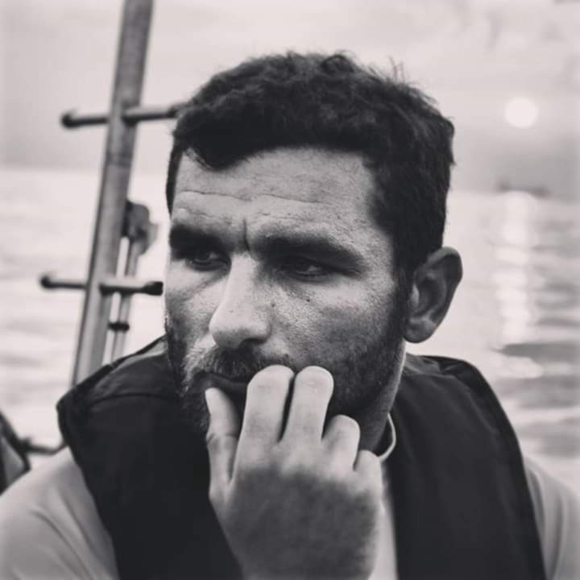
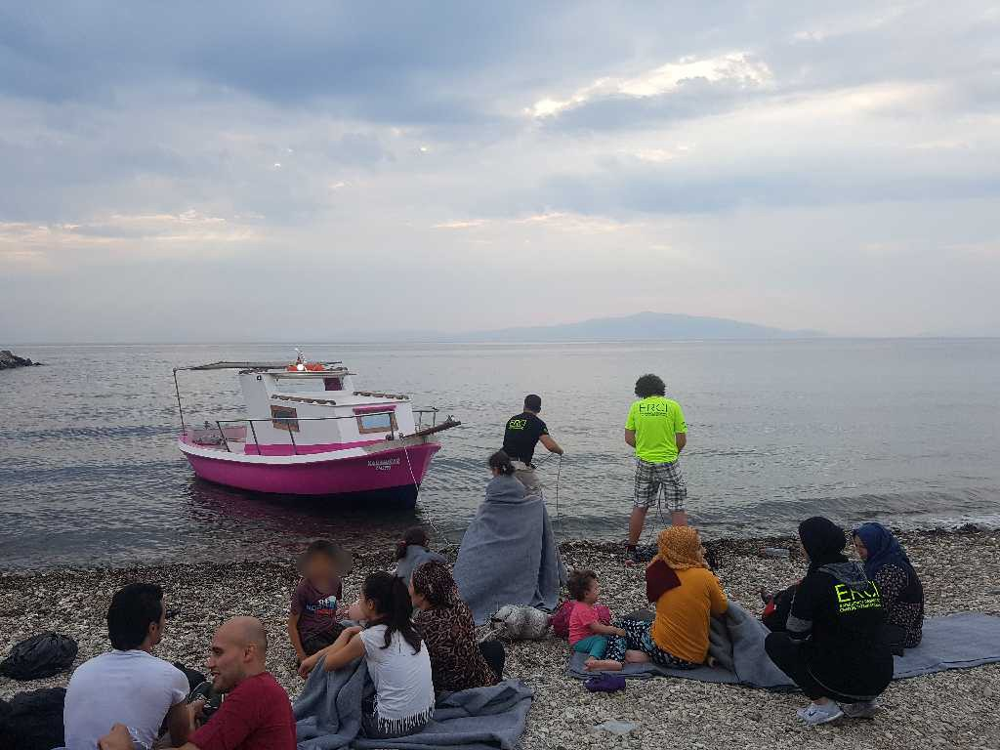
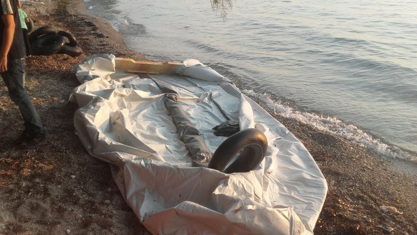
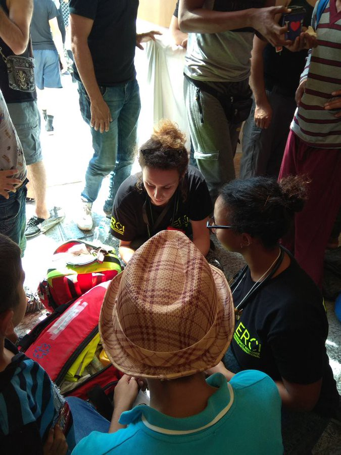
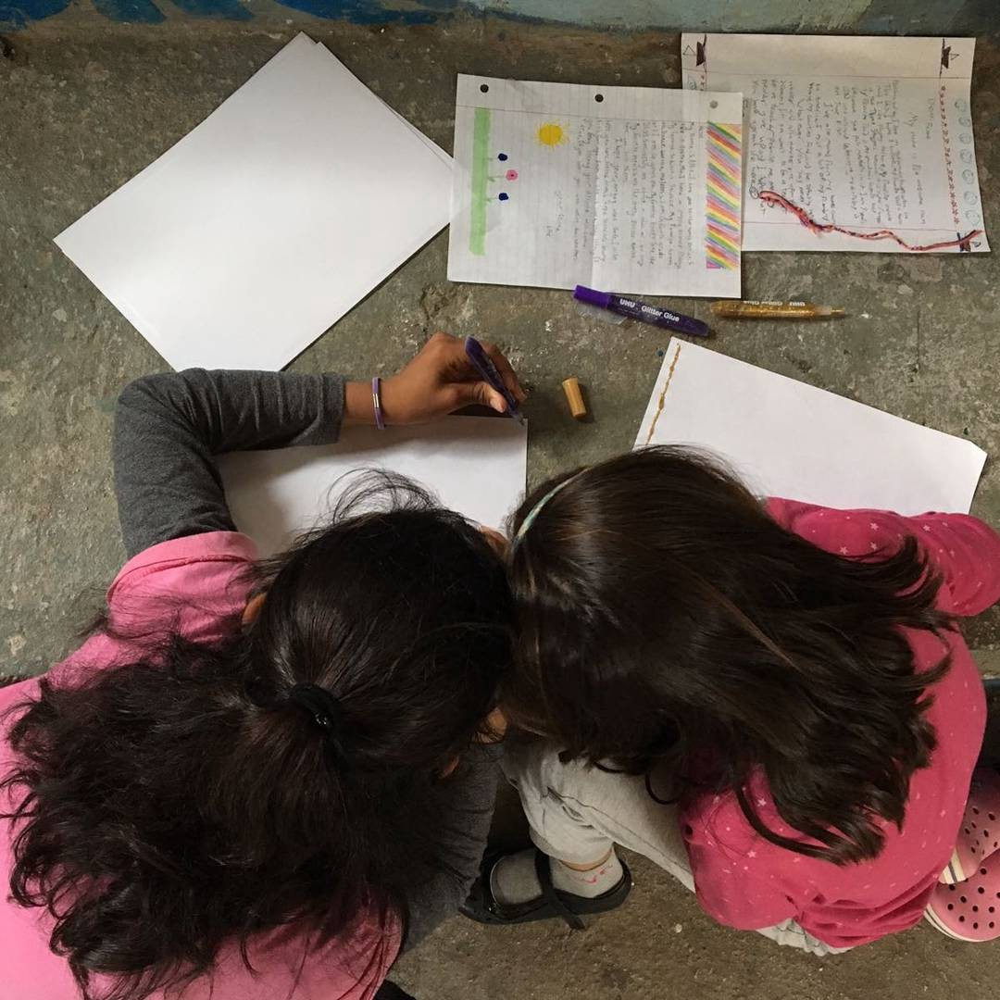
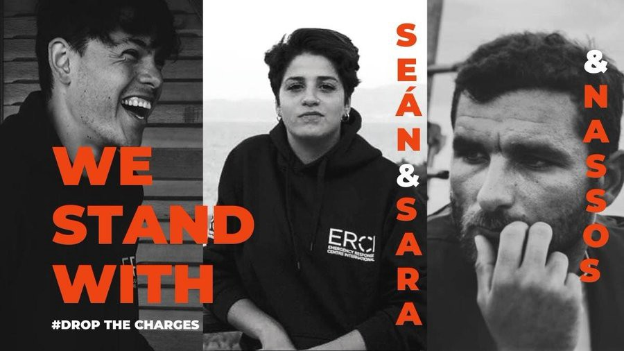
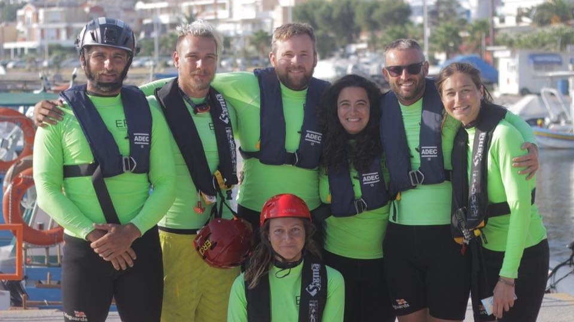
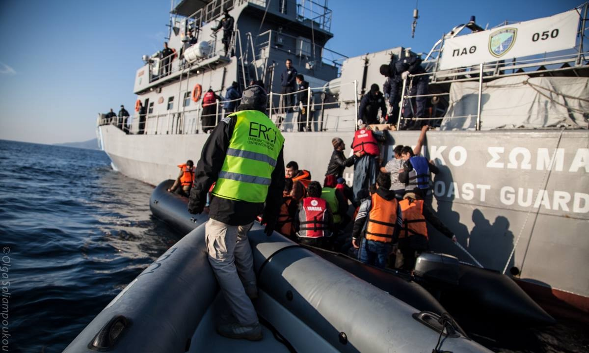
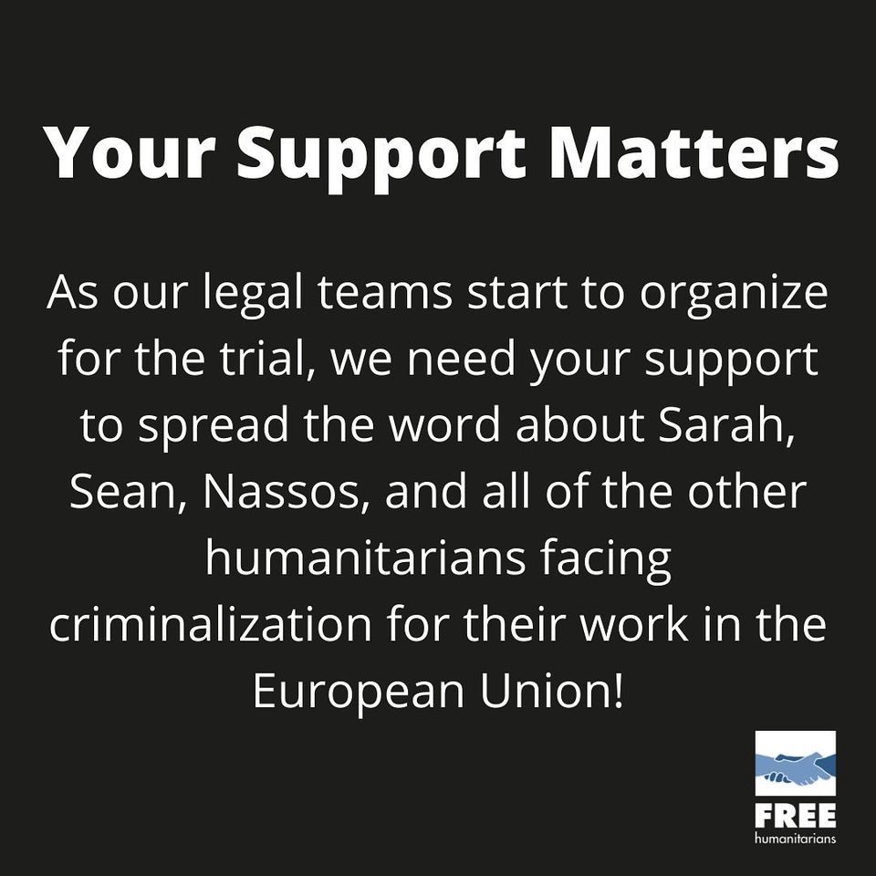

### AYS Special from Greece, where saving lives is illegal\. An interview with Nassos Karakitsos\.

> Even if I get 25 years I would still go to Lesvos\. \( _Nassos Karakitsos\)_ 

On the 18th of November the first trial will be held on Lesvos for Nassos Karakitsos, Sara Mardini and Sean Binder\. They were originally arrested in 2018 and accused of people smuggling, money laundering, espionage and membership of a criminal organisation while working and volunteering with Emergency Response Centre International, ERCI\. 21 more people from other groups were also charged\.

At the time, Sara was well known for bringing her own boat to shore with her sister Yusra\. Having fled Syria via Lebanon they had taken a boat from Izmir\. When the motor stopped and they were at risk of capsizing the two sisters got into the water and started to swim\. Sara returned to Lesvos as a volunteer while Yusra went on to compete in the Rio Olympics with the first ever refugee team\. Sean was also a volunteer as he had a background in search and rescue\. Nassos Karakitsos was the field director and based on the island\. He began as a volunteer on the 5th of January 2016 utilising his skills learnt as a maritime security officer and during a brief stint in the Navy\. He was meant to stay on Lesvos for 15 days, in the end he remained for 2 years\.

On his very first day a boat came in with a very elderly man and Nassos knew he would stay\. The older people who arrived had left entire lives behind and often had physical disabilities\.

> How strong do you have to be to make that choice? 

In the beginning it was just two people on the coastline waiting for boats\. At this point in 2016 there were still an average of 40 boats arriving per day\. Over the years ERCI operated, they supported 1000s of people to safety\. As they grew, they got boats of their own so they could rescue people in distress\. Everything was co\-ordinated with the Coast Guard because they were better equipped to save lives at sea\.

> We’re not professionals, but they are\. When you’re rescuing a human life, everything else is less important\. My goal was to save people\. 

Despite the efforts of Search and Rescue operators, a [t least 1768 people have died](https://missingmigrants.iom.int/downloads) trying to cross the Aegean from Turkey from 2014 until the time of writing\. The actual number is likely much higher as many bodies are never found\.

ERCI stayed on the island when other NGOs left after the [EU Turkey deal](https://www.google.com/url?sa=t&rct=j&q=&esrc=s&source=web&cd=&cad=rja&uact=8&ved=2ahUKEwjyoKKttuDzAhW4hf0HHROrD2kQFnoECAMQAQ&url=https%3A%2F%2Fwww.europarl.europa.eu%2Flegislative-train%2Ftheme-towards-a-new-policy-on-migration%2Ffile-eu-turkey-statement-action-plan&usg=AOvVaw1Moxb1VM0lt7QOC1ye1kGJ) came into effect on the 18th of March 2016\. As arrivals initially dropped, they started working in [Kara Tepe camp, which closed earlier this year](https://www.infomigrants.net/en/post/31806/lesbos-msf-condemns-closure-of-kara-tepe-refugee-camp) , running kids workshops and swimming classes\. [When](https://www.msf.org/sites/msf.org/files/msf_lesbos_vulnerability_report1.pdf) [the main health actor in Moria](https://www.msf.org/sites/msf.org/files/msf_lesbos_vulnerability_report1.pdf) , [Medecins du Monde \(MdM\), left in May 2017](https://www.msf.org/sites/msf.org/files/msf_lesbos_vulnerability_report1.pdf) , the Hellenic Red Cross \(HRC\) took over the medical activity, but with drastically reduced resources\. As a result, ERCI organised medical teams\. There were 47 volunteers and 3 members of staff while the population of Moria was approximately 3000\. They worked 24 hours a day\.

Nassos left, exhausted, in December 2017\. Before the charges were brought, he had been accepted to work with MSF and had applied for university\. In the end he began his studies while in prison on Chios, MSF was no longer a possibility\.

The first sign that they were being targeted by the authorities was when Sara and Sean were questioned during a spotting shift in their ERCI Jeep\. They were parked in exactly the same spot that they had used for the previous two years\. The police stated that the jeep had fake military number plates hidden under the regular ones\.

They took the phones of Sara and Sean and searched their WhatsApp chats\. It is thought that the names of the other 21 people accused were taken at random from a UNHCR WhatsApp group which the Coast Guard were not members of\. Their arrests were without warning\. Sara was picked up at the airport while returning home to Germany to begin a scholarship\. Both Sara and Sean were already in detention when Nassos went back to Lesvos to try and understand what was happening and support them, but before he knew it, he was also arrested\. “Like this” he says and clicks his fingers, “all these things\.”

> I’d never helped people so actively and then I was there \[in prison\], it was crazy, really crazy\. 

Over night their lives changed completely\. They were detained for 106 days before being released on bail\.

> You couldn’t see the moon, the night sky, without bars\. 

All along, Nassos had the messages between ERCI and HCG on his phone immediately disproving at least one of the charges, that of withholding information from the authorities\. He offered to show his phone to the police, knowing that it would prove their innocence, they refused to take it\.

> It’s ok, we don’t need to see your phone, you should be careful who you help\. 

As a result of the charges brought, ERCI is no longer operational and for the last two and half years Nassos has instead been working with unaccompanied minors on mainland Greece\.

In the Aegean, the persecution of NGOs and the civil fleet continues\. [Mare Liberum are still being prevented from carrying out Human Rights Monitoring](https://mare-liberum.org/en/human-rights-group-mare-liberum-hampered-from-monitoring-escalation-of-rights-violations-in-the-aegean-sea/) and throughout the Mediterranean the civil fleet have faced legal challenges similar to those face by Nassos, Sara and Sean\. Just this week [prosecutors in Italy have requested that charges of facilitating undocumented migration and violating the Italian navigation code against the captain and the owner of the migrant rescue ship Mare Jonio, are dropped](https://www.infomigrants.net/en/post/35926/mare-jonio-prosecutors-request-charges-against-captain-owner-be-dropped?fbclid=IwAR34mzHIO2Kv4rDtW6RaRf_kXemIghLkI2Paw9blOLt8UGQ8hjzhHoyXSZg) \. There are numerous other examples from across Europe which could be used to illustrate this point\. In Italy alone, f [rom 2017 to date](https://twitter.com/emmevilla/status/1451114233119322112?fbclid=IwAR2TcrMxda8bhUZ3GeybK_Ygz9AUO0XNWPS7o2kjcLPd_td83WWgbWOXk7w) , prosecutors have opened 16 investigations against NGOs resulting in eight dismissals, one filing request, one acquittal and zero convictions\. Yet these legal processes stop rescue boats from leaving harbour and risk lives, their point being if not conviction then repeated obstruction\.

The trial on the 18th November is only for misdemeanours\. The authorities have 20 years to take them to court for the more serious charges but, having already lost three years of their lives to this process, the group want it over with as fast as possible\.

The situation has of course had a negative impact on the group’s mental health and also creates practical difficulties, making it hard to find a job, necessitating a long and expensive legal battle and endangering the future of civilian Search and Rescue operations\. After Nassos was released from prison on bail, for the first few months he had difficulty sleeping and would wake at 4am in a panic\. When he eventually found work, he kept up 16–18\-hour days to keep his mind occupied\. Now he’s swimming, running, studying and preparing for the trail\.

> 25 years is like the death penalty, my life would be finished\. But Lesvos changed my life, I saw the real life\. People are the same everywhere and I met such good people on Lesvos\. They were two wonderful, difficult years that I will never live again\. 

You can follow and participate in their planned actions in the lead\-up to the trial through [Twitter](https://twitter.com/FrHumanitarians) and [Facebook](https://www.facebook.com/freehumanitarians) \.

**_Article by Emma Musty, AYS_**

**Find daily updates and special reports on our [Medium page](https://medium.com/are-you-syrious) \.**

**If you wish to contribute, either by writing a report or a story, or by joining the info gathering team, please let us know\.**

**We strive to echo correct news from the ground through collaboration and fairness\. Every effort has been made to credit organisations and individuals with regard to the supply of information, video, and photo material \(in cases where the source wanted to be accredited\) \. Please notify us regarding corrections\.**

**If there’s anything you want to share or comment, contact us through Facebook, Twitter or write to: areyousyrious@gmail\.com**

_Converted [Medium Post](https://medium.com/are-you-syrious/ays-special-from-greece-where-saving-lives-is-illegal-an-interview-with-nassos-karakitsos-c128e34ab75d) by [ZMediumToMarkdown](https://github.com/ZhgChgLi/ZMediumToMarkdown)._
