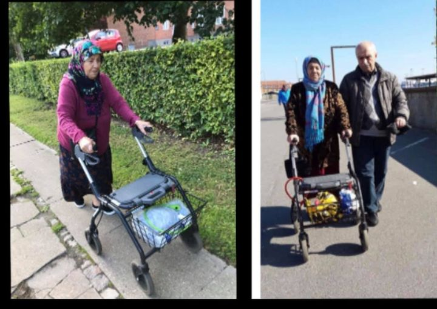

### AYS Weekend Digest: 23–24\.10\.2021 — More than 450 rescued in the Med by Geo Barents
#### More than 450 rescued in Mediterranean by ship Geo Barents
#### Pope Francis calls for global attention on Libya // Safety for Aita Mari after days at sea // Millions spent on ‘prison\-camps’, despite warnings throughout the EU process // Pair remain trapped in UN border area on Cyprus // German vigilante groups stopped by police // Five Years since Calais ‘Jungle’ dismantled // German groups call for civil action // Airlines profit from deportations to Afghanistan, then cash\-in on rescue mission // Syrian refugees may not be deported from Demark, the ECHR report
#### FEATURE
#### More than 450 rescued in Mediterranean by ship Geo Barents

](assets/ac3ba77a3b7e/0*k9RFhITy-FRgx90a)

Photo Credit: [©Filippo Taddei/MSF](https://twitter.com/MSF_Sea/status/1452219702311280648?fbclid=IwAR1g6P0ZQ7u_Zu91_Txgm7JEbtfmNC4KS6bRjF-AHULafy6O-Z86xqCUmWo)

MSF reported a very busy weekend for the rescue ship the Geo Barents\.

On Sunday, [296 people were being treated](https://twitter.com/MSF_Sea/status/1452219702311280648?fbclid=IwAR1g6P0ZQ7u_Zu91_Txgm7JEbtfmNC4KS6bRjF-AHULafy6O-Z86xqCUmWo) onboard the vessel\. Medical and psychological support was offered to the men, women and children onboard\. [A further 95 people](https://twitter.com/MSF_Sea/status/1452000575059636233?fbclid=IwAR1g6P0ZQ7u_Zu91_Txgm7JEbtfmNC4KS6bRjF-AHULafy6O-Z86xqCUmWo) were rescued from a boat on Saturday that was moments away from disaster\. The boat was about to be intercepted by the so\-called Libyan Coast Guard\. If this had happened, the passengers would have been returned to violence and torture in Libya\.

Additionally, 71 people were also rescued from a boat in distress on Sunday\. Thanks to a collaboration between [MSF and AlarmPhone](https://twitter.com/MSF_Sea/status/1452277636110114823?fbclid=IwAR3czBIRyZBDGPQNvs5cz7s6qcgZCcQMU83SBGGCKvSDEtJTjnDm82Viq94) , the rubber boat, which was taking on water in harsh weather conditions, was detected and assisted\.
#### LIBYA
#### Pope Francis calls for global attention on Libya

The head of the Catholic Church, [Pope Francis, has called for help for those in need](https://www.nau.ch/news/europa/papst-fordert-hilfe-fur-migranten-in-libyen-66029102?fbclid=IwAR3dnWeAs2tkTGt4bNXPAlz9uUk8s6aYgAwDcbJcP_3efMOHfLTzmSEWOK0) in Libya\.

> “I ask the international community once again to keep the promises to find a common and concrete solution for the migration flows in Libya and the entire Mediterranean region,” 

Pope Francis particularly referred to the necessity to prevent deaths in the Mediterranean Sea, but the dangers are not restricted to the ocean\. [There have also been reports](https://twitter.com/RefugeesinLibya/status/1451997453704736772?fbclid=IwAR3czBIRyZBDGPQNvs5cz7s6qcgZCcQMU83SBGGCKvSDEtJTjnDm82Viq94) of refugees being robbed outside the UNHCR building in Tripoli, with smartphones stolen, cutting vulnerable people off from contact with those they love\.
#### SEA — SAR
#### Safety for Aita Mari after days at sea

The ship Aita Mari was [finally allowed to dock in Sicily](https://thecivilfleet.wordpress.com/2021/10/24/aita-maris-105-rescued-refugees-finally-allowed-to-come-ashore/?fbclid=IwAR2Us04--fjuKT6a2TY1vjBF3cWP7ac172KnGPnZbv2nrPG-oWeO__cd4NA) after being denied access to port in Malta\. The ship, operated by [Humanitarian Maritime Rescue](https://thecivilfleet.wordpress.com/tag/smh/) , had to weather a storm with 105 people onboard\. Many of the passengers had been victims of torture in Libya — wounds and scars of old injuries from torture [can been seen here](https://twitter.com/maydayterraneo/status/1451895269969248262?fbclid=IwAR07rB74BwbF1b6gCVCD1bovbd0KxRVJR5rkDftqSHL5Xf2U2V0NumT61X4) \. The joyful reaction as the news was received by passengers [can be seen here](https://twitter.com/maydayterraneo/status/1452282342123479042?fbclid=IwAR04LeQXAC_ydhI8kGbLigMI_o__TXJRCJcSaPjz4Lb2CDUZIMgcr5Am7g4) \.

The former Italian Interior Minister [was in court on Saturday\.](https://l.facebook.com/l.php?u=https%3A%2F%2Fwww.aljazeera.com%2Fnews%2F2021%2F10%2F23%2Fitalys-salvini-in-court-for-blocking-migrant-ship%3Ffbclid%3DIwAR1zCzjR-31xAMWuY3Fu1TCk4seontOXy_3jlfhktQ3c2AD1lWy2dzHvsf0&h=AT22AcWr5dM6MzYsOqWe_CCBL_-PQyDHHNqF3Bs54NDJaJeB35QGTU5JD74_HdpB_WXv3GI5kZgjBzYb1ryTtvaTN7zHOqfLhxrU1JtMBiEalgYkBe7NTmOy1dLuzIyiGw&__tn__=R]-R&c[0]=AT3HfGJ1lVcV-G_tVMuHM-GWWfvJvfNiCtQFUuC8K5Gl43AiJAtrE-ELd5s5lCaOpmXohu3Phm6GVcKaR1HTN_3ThiIM6g66yq-oxn2D25vErv26DtN3wZks-tfSG2h2HxkOrsaLmqyb6STFbkJpQbozzD1SOCFjk3z8GnYPBzrgejLm8YbqAr0jkF3Xu2fCuZkAia0y_RDj) Matteo Salvini is charged with allegedly blocking a rescue ship from docking\. The court proceedings were largely procedural \(yet were positive according to [Oscar Camps](https://twitter.com/rtvenoticies/status/1451990809046241281?fbclid=IwAR04LeQXAC_ydhI8kGbLigMI_o__TXJRCJcSaPjz4Lb2CDUZIMgcr5Am7g4) \) and a further date has been set for December 17th\.

There is [speculation that a new migration hot\-spot is forming\.](https://www.dw.com/de/in-s%C3%BCditalien-entwickelt-sich-ein-neuer-migrations-hotspot/a-59612063?fbclid=IwAR3pErWpLwwNRfk4UoWTJPU7QjDE6nI-LtVDREmIzYTgiXGuA6fDDvOmzwo) The south Italian coast of Calabria is seeing an increase in the number of people arriving there\. This may be people arriving from Egypt or Turkey and avoiding Libya\. The area has already seen 7,000 arrivals in October, more than three times as many as the previous year\. More than 780 people arrived in just 36 hours according to [this report](https://gds.it/articoli/cronaca/2021/10/23/sei-sbarchi-in-48-ore-roccella-e-la-nuova-lampedusa-1eda3992-db71-4eb6-a5cd-b34a161d0d20/?fbclid=IwAR3gh623TcKHfDFYbUOExT4AD4MaB1KBzIfeCU32i_edQcQJo34gCm3fJJE) \.
#### GREECE
#### Millions spent on ‘prison\-camps’, despite warnings throughout the EU process

](assets/ac3ba77a3b7e/0*idbFJs1fGpztUJpN)

Photo Credit: [All Rights reserved: Elisa Perrigueur](https://fragdenstaat.de/en/blog/2021/10/22/how-the-eu-supports-the-construction-of-prison-like-refugee-camps/?fbclid=IwAR1N_ZkP9E2wD4EorkgirmtTqbC1bu3el6HUh3O3714x-38sdVuvrtTGU8I)

EU Commissioner for Home Affairs Ylva Johannson promised that there would be ‘no more Morias’ and that accommodation for asylum seekers would be built that was in line with ‘EU standards’\. A year later, prison\-like buildings, costing 276 million Euros, were built\. [This investigation](https://fragdenstaat.de/en/blog/2021/10/22/how-the-eu-supports-the-construction-of-prison-like-refugee-camps/?fbclid=IwAR1N_ZkP9E2wD4EorkgirmtTqbC1bu3el6HUh3O3714x-38sdVuvrtTGU8I) examines the process the EU took in allowing funds to be spent on drones, cameras and metal detectors, despite warnings that these camps are unsuitable for children and that “all people waiting for their asylum decision there should be able to move freely inside and outside”\.

[This long thread on Twitter](https://twitter.com/lk2015r/status/1452339882345603079?fbclid=IwAR1RpfkJBmVkzObVVcTlUReVZtvLcXuDZRKllW90uI3QkGFRDE26GFS-Vpo) examines how civilian ‘vigilantes’ have been patrolling the Evros border in efforts to keep people from crossing\. The thread contains photos, articles and videos in support of the assertion that association Ainisio Delta were involved in illegal pushbacks and other activities\.

[A police chase in the town of Perama](https://www.keeptalkinggreece.com/2021/10/23/greek-police-roma-dead-chase-car-shootout-perama/) has resulted in the death of an unarmed man and the injury of a 16 year old boy\. Seven police officers involved in the incident have been held on suspicion of intentional homicide\. The victims were from the Roma community\. This [twitter thread](https://twitter.com/VassilisTsarnas/status/1452304840026173442?fbclid=IwAR3dnWeAs2tkTGt4bNXPAlz9uUk8s6aYgAwDcbJcP_3efMOHfLTzmSEWOK0) provides more information, whilst [this one](https://twitter.com/EleniKonstanto/status/1452332266642886663?fbclid=IwAR1cBg2DKeyFOzw-cJw0nYpklewFAtmmgteskjtsKt_mic10y6jX8pf9EkY) states that racism is increasing in Greece, linking to this event\. A march [in memory of the man](https://twitter.com/savvaskarma/status/1452302155289960463?fbclid=IwAR1cBg2DKeyFOzw-cJw0nYpklewFAtmmgteskjtsKt_mic10y6jX8pf9EkY) who died took place on Sunday\.

[This long read](https://www.tagesschau.de/ausland/griechenland-fluechtlinge-pushbacks-101.html?fbclid=IwAR1RpfkJBmVkzObVVcTlUReVZtvLcXuDZRKllW90uI3QkGFRDE26GFS-Vpo) is about a group of people from Kurdish Iraq who landed near the village of Vasilitsi in the south of the Peloponnese peninsula\. Locals helped the people when they arrived, stayed with them and observed the ill\-treatment by the authorities\. At night, the local people were told by the police that they should leave\. The next day, the authorities denied that any group had landed\. German publication [Tages Schau](https://www.tagesschau.de/) managed to follow more of the story\.
#### CYPRUS
#### Pair remain trapped in UN border area on Cyprus

](assets/ac3ba77a3b7e/0*os1h0ONBgVujRVCf)

Photo Credit: [LA Times Philippos Christou / AP](https://www.latimes.com/world-nation/story/2021-10-23/african-asylum-seekers-cyprus?fbclid=IwAR0e4keFTnlgFJIh1re99ExZOa6Jy_ATLxLGlAb-RCfBUmgOGlRMWkiKaQM)

As reported in Friday’s digest, two people remain trapped in the UN buffer zone on the island of Cyprus\. The man and woman from Cameroon are living in a blue tent between the Turkish and Greek sides of the island, unable to move in either direction\. Neither authority has made a statement on the matter\.

“We just pray that they sort things out, it’s not been easy on us,” Enjei Grace
#### EASTERN EUROPE
#### German vigilante groups stopped by police

[In worrying reports of vigilante groups](https://www.dw.com/en/german-police-stop-far-right-vigilante-border-patrols-near-polish-border/a-59610055?fbclid=IwAR1g6P0ZQ7u_Zu91_Txgm7JEbtfmNC4KS6bRjF-AHULafy6O-Z86xqCUmWo) at the German\-Polish border, Germany has sent police officers to stop far\-right groups from blocking refugees entering the country\. 50 people had been stopped by the police on Sunday, with weapons including a machete and a bayonet\. People had responded to a call by far\-right party The Third Way \(Der Dritte Weg\) which had urged people to prevent people crossing from Poland\.

> “Good people live here\. The place of the children is not in the forest, but in a warm house\.” 

These are the words of the mayor of [Michałów, Poland, a town at the border area with Belarus](https://oko.press/miejsce-dzieci-nie-jest-w-lesie-kwasniewska-i-komorowska-na-manifestacji-w-michalowie/?fbclid=IwAR3dnWeAs2tkTGt4bNXPAlz9uUk8s6aYgAwDcbJcP_3efMOHfLTzmSEWOK0) , and partly in the ‘Closed Area’ declared by the Polish government\. Many residents are helping those trapped at the border, and the demonstration on Saturday saw people take to the streets in support and in solidarity with people who are trapped in the forest border area\.

](assets/ac3ba77a3b7e/0*XdnJv4Gqi0R-WS4S)

Photo Credit: [Sara Cincurova](https://twitter.com/Sara_Cincurova/status/1452014261249658887?fbclid=IwAR3gh623TcKHfDFYbUOExT4AD4MaB1KBzIfeCU32i_edQcQJo34gCm3fJJE)

This comes amidst further protests to [‘End the Torture](https://twitter.com/Sara_Cincurova/status/1452014261249658887?fbclid=IwAR3gh623TcKHfDFYbUOExT4AD4MaB1KBzIfeCU32i_edQcQJo34gCm3fJJE) ’\.

However, other protests are taking place against allowing people to enter Poland\. [This video](https://www.tagesschau.de/multimedia/video/video-936415.html?fbclid=IwAR1cBg2DKeyFOzw-cJw0nYpklewFAtmmgteskjtsKt_mic10y6jX8pf9EkY) reports on the matter\. And the problems show no sign of stopping, as Belarus has declared that people from [Pakistan as well as 75 other countries](https://twitter.com/eTimesPakistan/status/1451826603005202437?fbclid=IwAR0uxSLTcv08AlxUfe4QtQ1lKpGGSWfNWnRG1rX88HF6c7jloLnvdfXOlBY) may enter the country without visa and stay for 30 days\.
#### SPAIN
#### Call for donations

No Name Kitchen has a [call for donations of clothes](https://www.facebook.com/watch/?v=578040366870579) \. You can drop off clothes for those in need in Ceuta in Madrid on Wednesday and Thursday evenings\.
#### FRANCE
#### Five years since Calais ‘jungle’ dismantled

It has been five years [since the clearance of ‘the Jungle’](https://www.facebook.com/Utopia56Calais/posts/864869140836777) in Calais — a community made up of temporary structures where people\-on\-the\-move lived\.

> “Five years later, Calais remains a wandering area for thousands of people, waiting for a crossing\.” [Utopia 56](https://www.facebook.com/Utopia56Calais/posts/864869140836777) 

‘The Jungle’ has been replaced by small groups of tents in various areas which are constantly evicted\. The conditions are unsafe for numerous reasons\. The lack of hygiene and cooking facilities is obvious\.

Another tragedy of the situation is the death of a man this weekend\. [Reportedly in his 30s and from Sudan,](https://www.facebook.com/care4calais/photos/a.1047087828657507/4839183706114548/) the man was struck by a truck near the tent area known as the Hospital in Calais\. NGO [Care4Calais](https://www.facebook.com/care4calais/photos/a.1047087828657507/4839183706114548/) gave details of a memorial service that was held on Friday evening\.

There remains a call for volunteers in St Denis, near Paris\. [Solidarité migrants Wilson](https://www.facebook.com/Solidarit%C3%A9-migrants-Wilson-598228360377940/?__cft__[0]=AZWLIpcLj1FB2IvsVykogXwPcfjE6zdrd62zEF1Ww3foIydIhk4mVuwEIKz9vSiFqOEeR586QpAB8W-MqPH82p5_tmtbjOT3U0a0aGNnKu2AtR_h5x2ZmwYbp0FvBkSNrBY2Dg2Sw4TKJV7gorqGBG5i&__tn__=-UC%2CP-R) need help with the preparation and distribution of meals on Tuesday, Thursday and Saturday\. [More details and how to get involved here\.](https://www.facebook.com/permalink.php?story_fbid=1840176352849795&id=598228360377940)
#### GERMANY
#### German groups call for civil action

](assets/ac3ba77a3b7e/0*y6oKUXGhh-xftuOK)

Photo Credit: [Seebrücke](https://www.facebook.com/SeebrueckeSchafftsichereHaefen/posts/1501227820249396)

German organisation Seebrücke are calling for civil action in response to the situation at the Polish borders with both Belarus and Germany\.

> “We have been calling for protests to demand that the German government act in solidarity and respect human rights at the Polish\-Belarusian and German\-Polish borders\.” 

[Their petition](https://l.facebook.com/l.php?u=https%3A%2F%2Fwww.change.org%2FGruenesLichtFuerAufnahme%3Ffbclid%3DIwAR3xQOZvzYFxNj7lbmFJmKwkY41ZmwzyAe8ZVn0iweBsfZ2HLX-SdbdcS0I&h=AT3haR9xnWACiWHOD3yzDWCoDc6a8tG0MG1-I1D6PLNCP3agz1JQx0UWtCcFtAAX12K3JSICax29sIvrdRywkqTDFlKXeeNkF_O8jXbuLNVqN76pBaJgzHQ6oJXGuJ89MA&__tn__=-UK-R&c[0]=AT2jcqbn0Wv8fnNB_Ah2gcGaXISLgyb91ozQygsnm3rgAmGH0xj9iD9lZbDTidL_UOhX1LLGj2EJISED5AOSyLxEljByEkUeiWabVip932nbEiXvMEk1GqXNngZwCEs0HJ8PHD3w42MPS1Kvy6J4L6m6RUcLtwo7oueqWcJssa4Rs4U) outlines all the demands, which include for the people trapped to have access to medical care\.

German organisation Sea Eye 4 has been relaunched to perform rescues in the Mediterranean, amidst [a call for the German government to provide safe and legal routes](https://sea-eye.org/en/sea-eye-4-embarks-on-third-rescue-mission/?fbclid=IwAR2TdrMXBAdRD4ZP8Xuaz83jR6PATnjqimJVK0L6UQJ4pFJFJSEfA_lg2Eo) for people to seek asylum in Germany\. The call is made together with AlarmPhone, Borderline Europe, Resqship, Sea\-Watch and Seebrücke\.
#### UNITED KINGDOM
#### Airlines profit from deportations to Afghanistan, then cash\-in on rescue mission

Airlines involved in the evacuation flights from Kabul in August this year, had previously profited from deporting those with failed asylum claims from the UK back to Afghanistan\. According to [this report](https://corporatewatch.org/deportation-airlines-return-to-afghanistan-to-cash-in-on-evacuation-flights/?fbclid=IwAR2-YAMBr3C6pR-0fPYniLeYko3IOuxjFMukDlBflQdVudPshY5ZJgfmx1M) charter airlines Privilege Style, EuroAtlantic, Titan and Hi Fly have all carried out mass deportations of people from Afghanistan who had attempted to claim asylum in Europe over the past few years\.

> “ [Over 15,000](https://www.newstatesman.com/politics/2021/08/uk-has-deported-more-15000-afghan-migrants-afghanistan-2008) Afghans have been forcibly returned to the war zone on mass deportation flights from the UK since 2008\. This is a higher figure than any other European country\.” 

The report uses a variety of sources and methods to outline the disgusting profiteering of the airlines who are capitalising on human suffering\.

Deaths in Home Office accommodation are twice as high as official figures suggest\. [The Guardian published this article](https://www.theguardian.com/uk-news/2021/oct/24/asylum-hotel-deaths-twice-as-high-as-home-office-admitted?fbclid=IwAR3j3l3Kmd8pQVbxtjHOhWURbdjIv9lpThEtcNc7lZM3ylNwV-iovgylOgo) which reveals 95 people have died in 2016\. A Home Office statement claimed that the additional figures came from including those that had stayed in ‘asylum support accommodation’\. The figures have been described as ‘appalling’\.

](assets/ac3ba77a3b7e/0*DxyojXQ_lmSXCBok.jpg)

Photo Credit: [RND](https://www.rnd.de/politik/london-fluechtlingspuppe-little-amal-nach-europareise-von-menschenmenge-begruesst-SIXGXMYK6SIVAM2CERLZZF4RJA.html)

The puppet Little Amal has made her way to [St Paul’s Cathedral in London](https://www.independent.co.uk/tv/news/refugee-puppet-amal-st-pauls-v306e20a2?fbclid=IwAR1rEhFqlauF8SpxRoUESywwmk4zKJBfybKEB-rvh34_EeHMXd9Ej_e4-I8) \. Crowds cheered as the figure representing a 10 year old girl from Syria arrived at the London landmark where she presented the Dean of the Cathedral with a carved wooden ship from the birthplace of St Paul — Tarsus, Turkey\.

[This is the account](https://www.facebook.com/care4calais/posts/4842536172445968) of an asylum seeker in the UK who is facing deportation\. The woman, originally from the Gambia, has been in the UK for five years\. She was visiting her brother when she heard of the death of her husband, a senior military figure\. A difficult yet important read\.
#### DENMARK
#### Syrian refugees may not be deported from Demark, the ECHR report

A judgment from the European Court of Human Rights \(ECHR\) should lead to conversion of all cases where Syrian refugees have had their residence permits in Denmark revoked\. [The report by the ECHR](http://refugees.dk/en/news/2021/octobre/new-human-rights-judgment-nobody-can-be-returned-to-syria/?fbclid=IwAR2kxe0yyFfYccbCZ7RD5eoirJ8dSdFzPt6ZviicgbI6qbA28sHl3-_tlXU) has concluded that no\-one may be returned to Syria due to risk to life\.

> “no areas in Syria are safe, and that all forced deportations will expose the person to a high risk\.” 

Danish activists and lawyers have been digging up this decision from the ECHR against Russia\. The implications for the Danish practices and policy towards Syrians might potentially be strong\.

There is a strong activist demand to the Danish government to renew the policy based on this hitherto undiscovered judgement\.

This picture is of a couple who are [reportedly old and sick who have had their Danish residence permits revoked\.](https://www.facebook.com/lenekjj/posts/4391226024325985) This couple are just two of many who are being treated in a similar way\.
#### GENERAL
#### Worth reading

[This report](https://migration-control.info/operationalization-of-the-pact-niger-libyen-marokko-tunesien/?fbclid=IwAR30zhQOqzgoXp-xFy9z-RKtJ5z7_WoT2eV9H2CX0Bh8Z25JszgbAVhiyOU) by Migration Control — a group concerned with the externalisation of Europe’s borders to Africa — discusses previously unpublished documents, released in September 2020 by the EU Commission\. The documents relating to the ‘New Pact on Migration and Asylum’ has three sections: the cooperation with third countries “to promote the externalization of the border regime”; the external borders of the EU; the agreements between member states\.

[The EU’s border with Belarus has become a deadly rampart of Fortress Europe](https://l.facebook.com/l.php?u=https%3A%2F%2Fjacobinmag.com%2F2021%2F10%2Fbelarus-lithuania-lukashenko-sanctions-european-union-border-regime-iraqis-migrant-detention%2F%3Ffbclid%3DIwAR1aJmX7jkvNJHQNqRHxLvdtlQR6DW6UrMzYBAkXaCXXQ-4eQA-vS0AV7uQ&h=AT1dlISeMuSSSbUA-2MGF27lUQZppKFGAp-UNzl-opNS0QSCPHwq6jYzJLQvpea_cWovaMvlQCAD8F34glFE7gkErf5d3S3hzIyRAFvk9xQF_LelJQRauB22zDPaJMfhMQ&__tn__=H-R&c[0]=AT3Io12F94wjwUcvPyCfSSrUtnmL2x2kr1EIONgJ3sgT0Py0GoPacsyUDzK2MGtHyR5fy0Tx2oYZ00UMvSIMuahk_Y4yfreHdBLbqA2tEKEF4qZ2jC6TlG6qic2x1XyN_7rgu-1zv-4rnQO___HgfDte68-Lp-HK0bRdiOLifTlPhX7d0edl-oEgNgsIacleSwuQ4TsMsbOX_KyCNfQ) takes an in\-depth look at the situation in Belarus and how it came to develop\.

**Find daily updates and special reports on our [Medium page](https://medium.com/are-you-syrious) \.**

**If you wish to contribute, either by writing a report or a story, or by joining the info gathering team, please let us know\.**

**We strive to echo correct news from the ground through collaboration and fairness\. Every effort has been made to credit organisations and individuals with regard to the supply of information, video, and photo material \(in cases where the source wanted to be accredited\) \. Please notify us regarding corrections\.**

**If there’s anything you want to share or comment, contact us through Facebook, Twitter or write to: areyousyrious@gmail\.com**

_Converted [Medium Post](https://medium.com/are-you-syrious/weekend-digest-23-24-10-2021-ac3ba77a3b7e) by [ZMediumToMarkdown](https://github.com/ZhgChgLi/ZMediumToMarkdown)._
