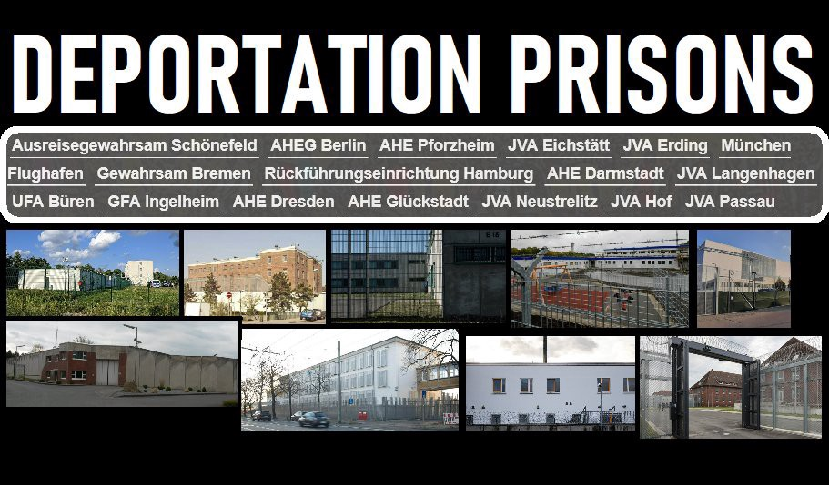
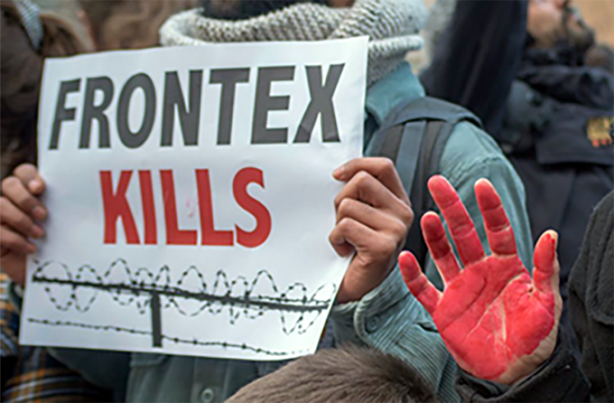

### AYS Daily Digest 25/10/2021: Cyprus — Psychological violence behind “voluntary” returns

[Are You Syrious?](?source=post_page-----859db5ad7a46--------------------------------)

[Oct 26](ays-daily-digest-25-10-2021-cyprus-psychological-violence-behind-voluntary-returns-859db5ad7a46?source=post_page-----859db5ad7a46--------------------------------) · 11 min read

LIBYA: Protest in Tripoli continues\. SEA: Child dies after two weeks at sea trying to reach the Canaries\. Geo Barents still without Safe Port\. GREECE: Court case against Frontex \. FRANCE: Day15 of Solidarity Hunger Strike\. More updates from ITALY, UK, AUSTRIA, SERBIA and SPAIN\.

“The 16th deportation prison in Germany was officially opened \[on Monday\] in Hof, Bavaria\. ➜ Here is a list of all German detention centers with addresses, contact details, visiting times and which social services / legal advice are active there: [https://noborderassembly\.blackblogs\.org/de/abschiebehaft\-abschaffen/](https://noborderassembly.blackblogs.org/de/abschiebehaft-abschaffen/) “ \( [No Border Assembly Berlin](https://twitter.com/NoBorder_Berlin/status/1452612692598984713) \)
### FEATURED: Cyprus — Psychological violence against refugees and the complicity of Frontex and EASO

[KISA — Action for Equality, Support, Antiracism](https://kisa.org.cy/) recently published a [press statement](https://kisa.org.cy/frontex-easo-assistants-to-the-violations-of-refugee-law-by-the-cypriot-government/) accusing European agencies Frontex and EASO of complicity in psychological abuses and violations against refugees in the Eastern Mediterranean island\.

> _Once again, the Cypriot authorities, in cooperation unfortunately with EU institutions, are using every available means, legal or not, time, misinformation and psychological blackmail to force refugees to “voluntarily” withdraw their applications for international protection and to return back to the conditions of insecurity and risk to themselves and their families\._ 

In August, Cypriot authorities pushed back to Lebanon a man and his two children\. The mother of the children, however, was in Cyprus\. Since then national and European authorities have put psychological pressure on the woman to withdraw her application for international protection and to “voluntarily” leave the country\. In mid\-October she did so, after having been visited by two officers of Frontex and EASO\. In the previous weeks, national authorities had offered money to the woman to return to Lebanon, but she refused\.

> _According to the Syrian refugee woman, the FRONTEX officer told her, among others, that Lebanon is considered to be a “safe” country and that according to the Cyprus legislation it is impossible to apply for family reunification, while the EASO officer “informed” her that after the interview with the Asylum Service she would have to wait for at least one year for the results and the probabilities of being recognised as a refugee are 1%\. He also informed her that if she decided to appeal at the International Protection Administrative Court she would have to wait for five years for the results\._ 

We join KISA in stressing the highly unethical and illegal nature of such statements by officers of EU agencies, making an “estimate of the probabilities of asylum before conducting an individualised examination of an asylum application”

What is more, the officers “failed to mention … that the Parliamentary Committee on Human Rights has asked the Asylum Service to proceed immediately to the examination of the said woman’s application for international protection and to proceed to all appropriate actions for granting permission to her husband and children to come to Cyprus\.” As she arrived in Cyprus pregnant, she should have been granted special procedural guarantees for her application to be examined rapidly\.

The officers also failed to mention that UNHCR and many international organisations do not consider Lebanon a safe third country\.

As KISA stresses, the information of the two officers was:

> _wrong, incomplete, misleading, and unethical and intended in bad faith to assist the government’s effort to “convince” the asylum seeker to return “voluntarily” to Lebanon where her family is, instead of reinstating the rights of the family, which they themselves have broken up, to Cyprus\._ 

The woman is also the main eyewitness of the illegal pushback of her family, which is now being investigated by the Independent Authority for the Investigation of Allegations and Complains against the Police \(ADIPA\) \.

> _We are of the opinion that there is a reasonable suspicion that the actions of the FRONTEX and EASO officers may have occurred at the request of the police or the Minister of Interior so as to remove the refugee woman, as the main eyewitness for the investigation\._ 

LIBYA
### Update from the Protest at Tripoli’s UNHCR Centre

SEA

Central Med
### 60 people rescued south of Lampedusa

On Sunday night, Italian coast guard rescued 60 people south of Lampedusa, after Alarm Phone had informed authorities of their distress call in the morning\.
### Pushback in the Ionian Sea?

Alarm Phone [denounce](https://twitter.com/alarm_phone/status/1452540298203123715) a possible pushback in the sea between Greece and Italy\. On Sunday morning, they had informed authorities ofthe location of a boat in the Italian SAR zone\. In the night, Italian authorities made known that the 45 people onboard had been transferred to an Italian cargo ship and were heading for Greece\.

Western Med
### 2 year old child dies after two weeks at sea

On Sunday, Salvamento Maritimo [found](https://twitter.com/javierbauluz/status/1452595513006637061) a boat 185 kilometers southwest of Gran Canaria in the Canary Islands\. Rescuers attempted to revive the child, but it was too late\. Two adults and five children were also found in a serious condition on board the seven\-meter vessel\. The group was evacuated by helicopter on Sunday for urgent medical care primarily due to hypothermia and dehydration\.

GREECE
### Court case against Frontex

A\.N\., a woman from Burundi and an accompanied minor from DRC are taking Frontex to court in Greece, suing the agency for complicity in multiple deportation incidents to Turkey\.

[**Read more:** an article by Solomon Mag on the case\.](https://wearesolomon.com/mag/accountability/congolese-minor-suing-frontex-i-thought-that-the-law-is-upheld-in-europe/)
### Police murder in Perama, West Attica

Yesterday we reported about the killing of a young man \(18 years old, not 20 as previously reported\), shot dead after a car chase in the small town on Perama, in Western Attica\. Police also injured a 15 year old boy, who is now in hospital in Athens\. Demonstrations have taken place throughout the country, as ministers and government officials have immediately sided with the police officers, despite a pending criminal investigation on their actions, while media propagated lies on the two victims\.

The deceased young man and the boy are part of the Roma community in the country\. This episode speaks of the widespread police brutality \(and so far impunity\) in the country and of the racist attitude towards minorities — often considered as non\-Greek — shared by media, authorities and sectors of the population\.

**Read More:** An [Article](https://www.keeptalkinggreece.com/2021/10/23/greek-police-roma-dead-chase-car-shootout-perama/) and a [Twitter thread](https://twitter.com/G_Katsambekis/status/1452321329437454348?fbclid=IwAR1u9Yx1Jr0kRtkAog9_93mMmr8wX5KhgdPKrwaVAVOraC9l_BH8jW3fi0M) for a background to the recent events\.
### Know your Rights — Infosheets by Lesvos Legal Centre

Lesvos legal centre published two “Know your Rights” information sheets in different languages, Interacting with Police & In the Asylum Interview\.

**Download them** in Arabic, English, Farsi and French at this [link](https://legalcentrelesvos.org/information/) \.

ITALY
### Academic stands up to Frontex

> _I believe it is not possible to work with those like Frontex who reject, foment xenophobia, kill\. \( [Michele Lancione](https://altreconomia-it.translate.goog/non-a-fianco-di-frontex-chi-si-dissocia-dallaccordo-del-politecnico-di-torino/?_x_tr_sl=auto&_x_tr_tl=en&_x_tr_hl=en-GB&_x_tr_pto=nui&fbclid=IwAR1eEVd8nUKYaW-8jrgCHKW-97yEuBCuWY9edB2dgYA4CGpf6Ca5z1MNYuQ) \)_ 

On 20 October 2021, Altraeconomia [reported on the collaboration between the Polytechnic of Turin and Frontex](https://altreconomia-it.translate.goog/il-politecnico-di-torino-a-fianco-di-frontex-sul-rispetto-dei-diritti-umani-intanto-cade-il-silenzio/?_x_tr_sl=auto&_x_tr_tl=en&_x_tr_hl=en-GB&_x_tr_pto=nui) \. They would receive €4m to produce maps and infographics necessary in order “to support the activities” of Frontex\.

\(Photo Credit: [@michelelancione](https://twitter.com/michelelancione) \)

A professor from the department, [Michele Lancione](https://twitter.com/michelelancione/status/1452507202867154946?t=c7ZDXZw_EAf20n7vc9eThQ&s=19&fbclid=IwAR0N82MDHZAJCQPlTxaNV8gEK4NIQ5gP2yq8bVlj3FVxmIvH1Flw1AHefgc) , has [written publicly](https://altreconomia-it.translate.goog/non-a-fianco-di-frontex-chi-si-dissocia-dallaccordo-del-politecnico-di-torino/?_x_tr_sl=auto&_x_tr_tl=en&_x_tr_hl=en-GB&_x_tr_pto=nui&fbclid=IwAR1eEVd8nUKYaW-8jrgCHKW-97yEuBCuWY9edB2dgYA4CGpf6Ca5z1MNYuQ) about his feelings towards Frontex in order to distance himself from this project\.

> _Universities are complicit in bordering & racial violence: it needs to stop\!_ 

He sites the violence documented in Push\-backs, especially in Greece, and refuses to be complicit\.

SPAIN
### Mental Health in Ceuta

No Name Kitchen have published [part three of their mental health mini\-series](https://www.facebook.com/NoNameKitchenBelgrade/posts/1344929782571969) covering the impact of anxiety on physical health\.

> _The extreme xenophobia endured within the city of Ceuta by the locals, the recent epidemic of minors’ deportations from the centres of Santa Amelia, the lower status they have economically along with their impotence to change them all are all factors which interact with each other that generate a level of anxiety that not only harms the individual in the moment but also in the long\-term regardless of what happens to them\._ 

BELARUS / POLAND BORDER
### More violence at the border

Over the weekend, more people crossed the border from Belarus to Poland, wounded, cold, dehydrated\. Most of them were once more pushed\-back to the no man’s land between the two countries\.

“One of the men had to be taken out of the forest on a stretcher\. All five escaped from the war in Syria and asked for asylum in Poland\. For several hours, medics on the Border, activists, tried to save them\. On Sunday, the border guards once again took them behind the wires\.”

Doctors at the hospital in Hajnówka, a border town near the Belarusian border, receive patients referred by both activist groups and border guards\. Patients [face the dilemma](https://www.mp.pl/pacjent/aktualnosci/282604,pacjenci-z-granicy) of being unable to know their fate once they have been discharged, and they are often illegally deported after leaving the hospital\. Read the [interview](https://www.mp.pl/pacjent/aktualnosci/282604,pacjenci-z-granicy) with Piotr Pienzin, coordinator of the Hospital Emergency Department of SPZOZ\.

**Read More:** On Saturday, a demonstration organised by “Mothers at the Border” took place in a village near the border area\. [A report by Balkan Insight](https://balkaninsight.com/2021/10/25/polish-mothers-protest-treatment-of-migrants-on-border-with-belarus/) \.

SERBIA

**Solidarity with Women In Black\!**

AUSTRIA
### Names of the dead to be read on All Souls’ Day

[A meeting centre of religious communities “Quo vadis?”](https://www.kathpress.at/goto/meldung/2077014/wien-ordenszentrum-gedenkt-an-grenzen-verstorbener-fluechtlinge?fbclid=IwAR2Fku0LTyZTSGXfNvZskmHRvtOG4jpOlq2Sr4_h_G6tjI_GYDF4onp7ta4) will commemorate people who have died at the European external borders on All Souls’ Day \(2 November\) in Vienna\. 44,764 people are known to have died trying to flee to Europe, but the number is likely much higher\. They will read out the names of the dead and write them down on small strips which will be displayed for the public\.

**Attend:** On Wednesday \(27 October\), there will be a talk on “Fortress Europe” in the “Quo vadis?” with Roswitha Feige from the “Pfarrnetzwerk Asyl” and Sigrid Sprenger from “SOS\-Balkanroute” and others\.

FRANCE
### Solidarity hunger Strike in Calais, day 15

Ludo, Anaïs and Philippe of the Collective [Faim aux Frontières](https://www.facebook.com/faimauxfrontieres/?__cft__[0]=AZVhT27qaOYHKdjQ-MRrYfNHuQ-pvjmgg2_y6N3szJAOYazVQImsyLDCqQDJs2cQFOR6eB75wo2zijT0H6bWG2Nj6eZv12A67rf1Sn8x1hoZ7hlTf6opZOhxPbR7vGShlNJ5aaK5IofHhd6k0q4yaeNA&__tn__=-UC%2CP-R) continue their hunger strike, settled in the Saint\-Pierre Church in Calais\.

They decided to engage in this non\-violent action to protest the escalation of police violence against displaced persons, especially after the death of Yasser, who was ran over by a truck at the beginning of October\.

In August alone, police carried out at least 95 evictions and seized more than 450 tents in Calais and Dunkirk\. Continuing these practices during the winter poses a deadly risk for exiled people\.

More than 25,000 people have already signed the petition to French president Macron, demanding:
- the suspension of daily evictions and dismantling of camps during the winter;
- the halt, for the same period, to the practice of confiscating tents and personal effects of exiled persons\.
- the opening of a reasoned citizen dialogue between public authorities and associations not mandated by the State, relating to the opening and location of distribution points for all the goods necessary to maintain the health of exiled people\.

**Sign the Petition [HERE](https://www.change.org/p/emmanuelmacron-gr%C3%A8ve-de-la-faim-%C3%A0-calais-arr%C3%AAt-de-la-maltraitance-des-personnes-exil%C3%A9es-faimauxfrontieres) \.**

DENMARK
### Denmark carries on negotiations with Rwanda on ‘migration cooperation’

As we write, a meeting of EU and African Union foreign ministers in Rwanda is taking place\. Danish foreign minister Jeppe Kofod is also [meeting](https://www.kristeligt-dagblad.dk/danmark/kofod-vil-diskutere-migration-ved-topmoede-i-rwanda) his Rwandan counterpart to further discuss cooperation between the country regarding migration\. Danish authorities have been trying to set up reception centres in the African country since the Spring, externalising the processing of asylum applications\. Denmark had tried to keep these negotiations secret, but later on revealed that the country was discussing with the authorities of 5 to 10 other countries\.
### A testimony by a Syrian refugee in Denmark

Yesterday we reported that the European Court of Human Rights \(ECHR\) ruled, in a case brought forward by Syrian refugees in Russia, that no part of Syria can be considered safe and that deportations to Syria would violate Article 2 \(right to life\) and Article 3 \(protection against torture, inhuman or degrading treatment or punishment\) of the Convention\. This ruling should make Denmark change its policy of revoking residence permits to Syrians\.

**Read More:** Please [read](https://www.facebook.com/permalink.php?story_fbid=10159797579302299&id=536777298) the words of Rasha Omar, from Damascus, who lived in Denmark for the past years\.
### People prevented to leave Briançon occupy the train station

On Sunday evening, the solidarity refuge of Briançon, on the French side of the Alpine border with Italy, had to close due to overcrowding\. With around 230 people on the move, they [occupied](https://twitter.com/tousmigrants/status/1452629542925967371) the local train station for the night\. On Monday morning, the station’s Covid test centre and the ticket counters were closed\. In France, an antigen test is required to board all internal trains\. This move by national authorities and by the national train company will be pushing more people to rely on smuggling and trafficking networks for travelling throughout the country, which they are entitled to according to French laws\.

EU/FRONTEX
### Joint Europol/Frontex report on “digitalisation of migrant smuggling” provides new guidelines for confiscation and “extraction” of phones

Statewatch [published](https://www.statewatch.org/news/2021/october/eu-joint-europol-frontex-report-on-digitalisation-of-migrant-smuggling/) a joint report written by Europol and Frontex on the “digitalisation of migrant smuggling”, intended to provide state officials within the EU and Western Balkans “with a comprehensive intelligence picture on the use of digital tools and services’ \[sic\] in migrant smuggling and related document fraud, in order to raise awareness, consolidate existing knowledge and enforce opportunities to take appropriate measures to tackle emerging threats\.”

The two EU agencies advise increased confiscation and extraction of asylum seekers‘ mobile phones and now provide a manual on how to do so\. Apps to encrypt or disguise locations are described in the report as ‘countermeasures’ to surveillance\.

**Read more:** [Frontex and Europol: How refugees are tracked digitally](https://digit.site36.net/2021/10/25/frontex-and-europol-how-refugees-are-tracked-digitally/) , by Matthias Monroy\.

UK
### High Death Rates and Far Rights Attacks

[95 people have died in accommodation](https://libertyinvestigates.org.uk/articles/95-died-in-asylum-seeker-accommodation-in-five-years-amid-fears-home-office-downplayed-toll/) , provided by the Home Office, to asylum seekers in the last five years\. This rise has coincided with their use of isolated hotels and more broadly with Priti Patel’s term in office\. The anti immigration rhetoric used by and encouraged by the current Conservative Government is also being echoed by far\-right groups such as Britain First who go to these accommodation sites to harass and intimidate people who live there\.

WORTH READING
- [**Biometric & Behavioural Mass Surveillance in EU member states**](http://extranet.greens-efa.eu/public/media/file/1/7297) , a report which problematises “what we know about what is currently being done in Europe when it comes to remote biometric identification \(RBI\)” by both private and public actors and assesses in which cases we could potentially fall into forms of biometric mass surveillance \+ A [**Twitter thread**](https://twitter.com/echo_pbreyer/status/1452541535074103299) on the topic and the [**Video**](https://youtu.be/-bupRLxyPyg) of the presentation of the report\.
- [**Forcing Syrian refugees to return home is no solution**](https://www.arabnews.com/node/1955141) , by _Chris Doyle, director of the London\-based Council for Arab\-British Understanding \(CAABU\) \._
- [**On the border\. The Polish state became an organized machine of repression and lawlessness**](https://oko.press/na-granicy-panstwo-stalo-sie-zorganizowana-machina-represji-okrucienstwa-i-bezprawia/) **\.** _We already have hundreds of reports from the inhabitants of the border zone, from volunteers and journalists about pushing the sick, injured, dehydrated and starved people into the forest, to rain, wind and temperatures around freezing point\. It is putting their health and life at risk\. And no one will be punished for it\._ \(in Polish\)
- [**Joel Hernandez’s October 18–25 Mixed Migration Update**](https://mixedmigration.substack.com/p/october-18-25-2021-mixed-migration)

WORTH ATTENDING
- [**Refugees against deportation\. The struggle of a displaced Afghan in Greece**](https://www.eventbrite.co.uk/e/refugees-against-deportation-the-struggle-of-a-displaced-afghan-in-greece-tickets-192367244607?utm_content=shortLinkNewEmail) , online event with Parwana Amiri, organised by the the Department of Politics and International Relations at Goldsmith University — THURSDAY 28/10, h\.17:00–18:00 EEST\.

**Find daily updates and special reports on our [Medium page](https://medium.com/are-you-syrious) \.**

**If you wish to contribute, either by writing a report or a story, or by joining the info gathering team, please let us know\.**

**We strive to echo correct news from the ground through collaboration and fairness\. Every effort has been made to credit organisations and individuals with regard to the supply of information, video, and photo material \(in cases where the source wanted to be accredited\) \. Please notify us regarding corrections\.**

**If there’s anything you want to share or comment, contact us through Facebook, Twitter or write to: areyousyrious@gmail\.com**

_Converted [Medium Post](https://medium.com/are-you-syrious/ays-daily-digest-25-10-2021-cyprus-psychological-violence-behind-voluntary-returns-1ab046e50226) by [ZMediumToMarkdown](https://github.com/ZhgChgLi/ZMediumToMarkdown)._
