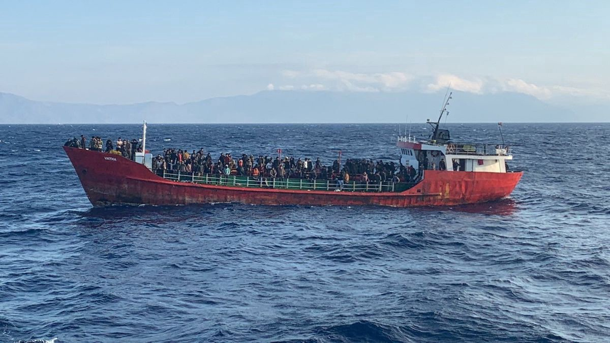
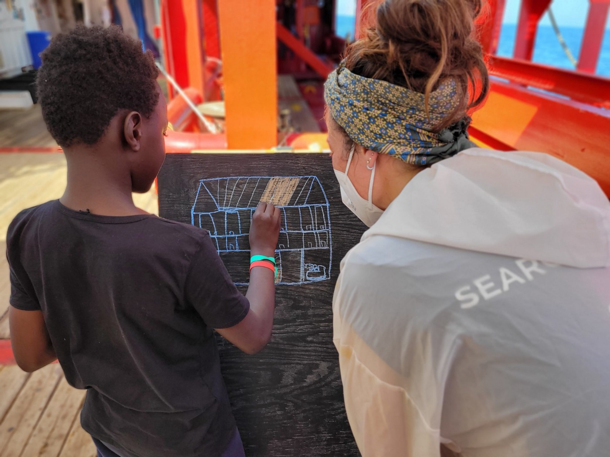

### AYS News Digest 29/10/21: Boat Carrying 400 Off Crete Has ‘Unclear Fate’
### Violent attacks against PoM in Greece // Mitarachi responds to Chios deaths // Germany halts far\-right vigilante patrols along Polish border // Syrian activist faces deportation from Denmark

[Are You Syrious?](?source=post_page-----e04d32a0022d--------------------------------)

[Oct 30](ays-news-digest-29-10-21-boat-carrying-400-off-crete-has-unclear-fate-e04d32a0022d?source=post_page-----e04d32a0022d--------------------------------) · 10 min read
### FEATURE — What has happened to the 400 people?

Yesterday’s migration news was dominated by the story of a small cargo ship carrying 400 people on the move found suffering from engine troubles off the coast of Crete\. The Turkish\-flagged ship was likely headed for Italy, the Hellenic Coast Guard \(HCG\) told [media](https://apnews.com/article/europe-greece-migration-weather-crete-fe73d87abb304261e97350f531b52648?fbclid=IwAR3pQGpm-WLC9NR4_S6gPACGDBjICO6CY8zNlslzfuWT4JDPgu5rIdoE5Wk) \. There was no immediate news on the health of the people, nor their countries of origin\.

The Greek coastguard called its ‘rescue’ efforts on Friday “one of the largest search and rescue operations carried out in the Eastern Mediterranean”, [media](https://www.aljazeera.com/news/2021/10/29/greece-rescues-cargo-ship-carrying-400-migrants-and-refugees) reported\.

While the initial worry surrounded the immediate safety of the people aboard the severely overcrowded vessel, now the concern is whether or not the people will become the victims of yet another illegal pushback\.

The HCG had approached the ship after receiving a tip that it was in distress\. However, as of late Friday night, no port had been designated for the ship, leading to the potential for a pushback\.

“Right now, the important thing is to get the ship to a safe anchorage,” an official initially told media\. The same official later said that the ship remained east of Crete\.

Vessels used by smugglers are traditionally much smaller, although there have been instances of cargo ships carrying people from Turkey to Europe\. In 2014, also off Crete, a 77\-meter cargo ship [went into distress](https://apnews.com/article/8ac7aa6c3e4f4f909ac30af0ebe80b36) with nearly 600 people, mostly Syrians, on board, and had to be towed by a Greek naval frigate to the port town of Ierapetra\.
### SYRIA
### UN expert says Syria not safe

Syria is too unsafe for refugees to return, UN expert Paulo Pinheiro said in a UN General Assembly committee meeting in New York this week, [media](https://www.infomigrants.net/en/post/36105/syria-not-safe-for-refugees-to-return-un-expert?fbclid=IwAR3ZJ7Um4Qn-y45Zd7pimziv1JBHPHNf9fLIUwsemyiZ2HGvT6GeOsG-DEw) reported\.

The war in Syria continues to rage and “this is not a time for anyone to be thinking that Syria is safe, for its refugees to return home,” he said, adding that the winter cold and the coronavirus could prove deadly to many should they return\. Only 2\.1% of Syrians are vaccinated against Covid\-19\.

“Millions of civilians continue to be condemned to war, terror and grief\. Many of those displaced have seen their properties destroyed or seized by the government, armed groups or terrorist groups — they have little left to return to and little prospects for their livelihoods,” the latest report from the Independent International Commission of Inquiry on Syria, of which Pinheiro is the president, reads\.
### SEA
### SOS Mediterranee comms officer shares memory

Photo Credit: SOS
### \[Eyes of the photographer\] “Observing him express himself on this chalkboard was beautiful\. Seeing him drawing a house was something else\.”

_Laurence Bondard is communications officer onboard the Ocean Viking for SOS MEDITERRANEE\. She was onboard in September 2021\. The crew rescued 129 lives from four wooden boats in distress\._

“I was deeply moved when I saw this child, Sidiki, drawing with the benevolent company of Justine, one of SOS MEDITERRANEE search and rescue team member\. **When he arrived onboard the Ocean Viking, Sidiki looked closed in on himself\.** He didn’t smile\. Barely talked, and when he did, he would only whisper\. It took me several bouts of play with him before realizing that we both spoke French\. He observed everything and everyone with a worried, deep, look\.

**When we met this young 11\-year\-old kid, he had just been rescued from imminent death\.** He was on a makeshift boat, in the middle of the Mediterranean Sea, with 24 other people in danger of being swallowed at any time\. They were in an unimaginable situation\. Even after witnessing it, it seems unreal\. Yet, he was there, appearing in between waves, with his older brother and other people driven by the only hope they had left to survive “hell”\. To flee Libya\. We can fear that he has at least witnessed harrowing violence and abuse, if not been subject to some\.

**Yet, onboard the Ocean Viking, he started to open\-up\.** Slowly he started to play around\. Alone at first\. Then with other adults around him\. And eventually with other kids rescued from other flimsy boats\. After some days, he dared to talk and to be heard\. He started asking questions, expressing desires\. He started smiling\. Once a day, and twice a day, and then many times per day\.

**Observing him express himself on this chalkboard was beautiful\. Seeing him drawing a house was something else\.** To me, he was not just drawing a house like any other kid where I am from\. Like I used to do at his age\. It seemed that he was drawing solid walls, and a strong roof\. A house that had comfortable beds\. In my mind, it symbolized his vital need of safety\. A quest for refuge coupled with my colleague’s T\-shirt inscription: “Search”\.

We search to rescue\. Sidiki searches for protection\. A quest that leaded him and 128 other people rescued between September 18 and 19, to be at risk of disappearing in high seas, without any witness\. At least 1,300 women, children and men are known to have perished in the Mediterranean since the beginning of the year\. Over 22,000 since 2014\. **Sidiki is not one of them\.** He remains a moving child, on the move\.”

_Original source: [SOS Mediterranee](https://sosmediterranee.com/eyes-of-the-photographer-laurence-communication-officer/?fbclid=IwAR2Jq0mruBaRw61oxshcxDNeGWa6mpSJ-fHqSEBN_gyvuhH4vgQb-Ca_0Nk)_
### 12 rescued off Spain’s Balearic islands

Twelve people were rescued early Friday morning off the coast of Formentera, one of Spain’s Balearic islands\. See [here](https://www.diariodeibiza.es/formentera-hoy/2021/10/29/rescatan-formentera-12-personas-llegaron-58939780.html?s=09&fbclid=IwAR02GPs5CtkgCHeDIRKl0aDfNbjVIxBbSbTeZ20fzaoMecjvQtF-vFCVCJc) to read about the rescue and other recent arrivals to the area\.
### ‘CommemorAction’
### ITALY
### Non\-Italian junior basketball team barred from national championship

Players belonging to a junior basketball team in a small Italian city have been barred from participating in the national championships because they are not Italian citizens\. [Read more](https://www.infomigrants.net/en/post/36067/italy-junior-basketball-athletes-with-foreign-parents-excluded-from-championships?fbclid=IwAR1Rpgw34uoUARnY3QAZbe75vS5blX7RGiUhLa0STSFMl3YF5ppLvq4Lib0) on the decision by the Italian Basketball Federation and the political debate it has sparked about discrimination\.
### GREECE
### Mitarachi calls for investigation into pushbacks

Greek Migration and Asylum Minister Notis Mitarachi has requested the country’s National Transparency Authority to investigate allegations of pushbacks from Greek waters following the deaths of four people off the coast of Chios earlier this week, [media](https://www.keeptalkinggreece.com/2021/10/28/pushbacks-greece-investigate-migration-minister) reported\.

Mitarachi made the announcement at a press conference after being asked whether the Greek government will set up a new independent investigating authority, as the European Commission has requested\. Mitarachi blamed the deaths this week on the “unscrupulous smugglers” and “criminal gangs” — not at all, of course, on his own Hellenic Coast Guard who perpetrates the pushbacks and prevent people from safely reaching the Greek islands\.

The funeral for the four people was held yesterday on Chios, according to a source\.
### SamosChronicles blog post on Zervou camp

_One of the biggest and most costly construction projects on Samos in recent years is now open\. I cycled around the completed site this past week\. It is awesome in its scale \(over 6 hectares\) and is a dramatic addition to the island’s infrastructure\. The new camp for refugees at Zervou comes with a 43 million price tag and can accommodate up to 3,000 refugees\. Currently there are around 400 men , women and children inside\. It is a closed camp with entrance and exit scrutinised between 8am and 8pm\. A mini bus shuttle will take them into Samos Town for 1\.6 euro one way\. The camp has invested heavily in surveillance and security systems including magnetic identity cards, high security gates, cameras and drones all of which allows for close monitoring of the refugees\._

Read more at this [link](https://samoschronicles.wordpress.com/2021/10/28/zervou-camp-silence-is-not-an-option-for-samos/?fbclid=IwAR2ZQx8MC_SmumxGdLkqfq_K2EwcFQ00SNPYqIY2HqPzFlh2v88VUPfpYp4) \.
### Violence against Cubans in Zakynthos island airport \(video\)

Some 85 people, many of them Cuban, tried to fly from the Zakynthos airport to Milan on Wednesday, and were met with extreme violence from local police, [media](https://www.keeptalkinggreece.com/2021/10/29/cuban-migrants-zakynthos-police-brutality/) reported\. Police dragged people by their legs, beat them, and pulled their hair\. Among the group are pregnant women and children\.

Some 65 of the Cubans were taken by force to a local hotel, and will be removed to deportation centers in Corinth and Attika in the coming days, media reported\. The people had traveled from Russia to Belgrade, and thence through the Balkans to Greece\.
### Three Pakistanis brutally attacked in Piraeus

Three Pakistani men were brutalized by a group of fifteen attackers earlier this week in the Old Kokkinia neighborhood of Piraeus, the port city of Athens\. Local activists group have [condemned](https://www.facebook.com/keerfapage/posts/6852888111403104) the attack\.

On the night of Oct\. 27, the three men were approached on Thebes Street and the attackers verbally insulted them\. Subsequently they hit one man on the head; he was later taken to the hospital\. The two other men fled the scene, chased by the gang, who were carrying knives\. The men hid on the roof of their home after the larger group broke down their door\. Luckily they weren’t discovered\.
### Eleonas camp will close

Read the full story at the link provided in the tweet\.
### BOSNIA & HERZEGOVINA
### Bosnian police destroy informal camp with bulldozers

Bosnian authorities [have destroyed](http://Velika Kladuša) an informal camp in Velika Kladuša, a small town along the Croatian border, bulldozing the tents and destroying people’s belongings\. Authorities in cooperation with IOM had already evicted the same area in the past weeks\. Read more at the link provided\.
### POLAND/BELARUS
### Tineke Strik on the failure at the border
### New report from the border by Les Observateurs:
### Story of one Syrian who survived the Polish border

_The distress message was sent on October 9th: “I’m in survival mode, I just have to get out of this forest to the safest place, if necessary go back to Turkey or Lebanon, that’s fine with me, I won’t\. not good at all\. »Of voice recordings like this, Ahmad Dandashi, a 32\-year\-old Syrian from Homs, sent a dozen to NGOs\. His rare testimony helps document a poignant reality for human rights defenders\._

Read the full story [here](https://www.paudal.com/2021/10/28/ahmad-dandashis-lost-road/) \.
### German police seek to halt vigilante border patrols

German police have warned far\-right groups from traveling to the Polish border to stop people on the move from trying to enter the country, [media](https://www.infomigrants.net/en/post/36109/german-police-vigilante-border-patrols-unacceptable?fbclid=IwAR2ZQx8MC_SmumxGdLkqfq_K2EwcFQ00SNPYqIY2HqPzFlh2v88VUPfpYp4) reported\. Extremist groups like the “Third Way” and “Free Saxons” parties have been using social media to recruit followers for their anti\-refugee patrols to “protect their homeland”\.
### FRANCE
### 19th day of hunger strike for Calais
### Five years since Calais ‘jungle camp’ was dismantled
### GERMANY
### “Almost all of them have bruises on their bodies”: an interview with a pastor at a reception center in Germany

_Beatings, cold, fear for their children — and joy at having made it\. The asylum seekers who come to Germany via Belarus and Poland have gone through a lot\. Some talk about it with Josephine Furian, who has been a pastor at the initial reception center in Eisenhüttenstadt for two and a half years\. She reports in the interview\._

Read the full interview [here](https://www.proasyl.de/news/fast-alle-haben-bluterguesse-am-koerper/?fbclid=IwAR2wCsYJtY0WIP7bTOYzcDtLN3NL2C-Y4y-kRxBNuJmdKkMp6uSejFeKfio) \.
### DENMARK
### What’s the status of Syrians who lost Danish residency?

So far, a total of 620 refugees and families from Syria lost their permits to stay in Denmark\. 90 of these are final decisions\. Hundreds of cases are still pending\.

[This article](http://refugees.dk/en/focus/2021/octobre/status-on-syrian-refugees-who-lost-their-residence-permits-in-denmark/?fbclid=IwAR02GPs5CtkgCHeDIRKl0aDfNbjVIxBbSbTeZ20fzaoMecjvQtF-vFCVCJc) provides an excellent explainer of the current status of the people facing deportation\.
### Denmark will deport Syrian activist and her husband

Danish authorities have rejected the asylum claim of a Syrian woman activist and plan to deport her and her husband back to their home country, [media](https://www.middleeasteye.net/news/denmark-deport-syria-activist-threatened-torture-arrest?fbclid=IwAR2pqYAdT7UnSLJxrhLjiM4d2KqEkKQq6opw142F7kRwI36X2OTCYPPd6yw) reported\.

Asmaa al\-Natour fled Syria in 2013, and has lived in Denmark since 2014, after claiming asylum with her son and husband Omar\. Natour and her family have learned Danish, found jobs, paid taxes and integrated into the local community\.

But in June, Natour was told she was no longer eligible for asylum\. Her husband Omar was also rejected\.

Speaking from the detention centre on Friday, Natour told media she was “distraught” and “utterly heartbroken” that she may face deportation\.
### EU/FRONTEX
### Frontex gets new 140 million\-euro office in Warsaw

The European Parliament’s budget committee has agreed to fund a new office for Frontex in Warsaw at a staggering cost of 140 million euros, [media](https://www.thefirstnews.com/article/frontex-to-get-new-headquarters-in-warsaw-25645?fbclid=IwAR3ZJ7Um4Qn-y45Zd7pimziv1JBHPHNf9fLIUwsemyiZ2HGvT6GeOsG-DEw) reported\.

“Frontex needs adequate infrastructure to better respond to various situations on the external borders,” Frontex’s Peter Christiaens said at the committee meeting\. “Based on preliminary analyses, the agency needs 70,000 square metres more space for more than 2,000 new employees\.”

Polish authorities will provide the plot of land to Frontex free of charge\. The new building is slated to be finished by 2026, and the cost is covered by a loan from the European Investment Bank\.

\(For those interested, [here is a link](https://www.asktheeu.org/en/request/headquarters_in_warsaw?fbclid=IwAR26oYbwT_OwOSAv7tBYTSvk1bBT8eOqeItIAjkc0JN4DYJ7QVVNkDAm5pw) to documents related to the new headquarters, made publicly available after an open records request\. \)

Meanwhile, as the new building is planned, Frontex is [organizing](https://frontex.europa.eu/media-centre/news/news-release/frontex-organises-a-firearms-workshop-for-polish-border-authorities-KFV3MR?fbclid=IwAR03R6MMS1ZhCJYfdO0A8NuriNfnrEyQfxtEMXlVXroSQ-cTG0ynCpLiSJA) firearms workshops for Polish border authorities\.
### WORTH READING
### Human Rights Watch: ‘Europe’s Deadly Border Policies’
### [Europe’s Deadly Border Policies](https://www.hrw.org/news/2021/10/27/europes-deadly-border-policies?fbclid=IwAR26oYbwT_OwOSAv7tBYTSvk1bBT8eOqeItIAjkc0JN4DYJ7QVVNkDAm5pw#)
### [A staggering number of people die at Europe’s borders\. Almost all of them are brown or Black\. The majority drown or…](https://www.hrw.org/news/2021/10/27/europes-deadly-border-policies?fbclid=IwAR26oYbwT_OwOSAv7tBYTSvk1bBT8eOqeItIAjkc0JN4DYJ7QVVNkDAm5pw#)

[www\.hrw\.org](https://www.hrw.org/news/2021/10/27/europes-deadly-border-policies?fbclid=IwAR26oYbwT_OwOSAv7tBYTSvk1bBT8eOqeItIAjkc0JN4DYJ7QVVNkDAm5pw#)
### Solomon: Young Roma shot dead by Greek police \(feature\)
### [Young Roma shot dead by Greek police\. Yet another case of police impunity? — Part 1](https://wearesolomon.com/mag/accountability/young-roma-shot-dead-by-greek-police-yet-another-case-of-police-impunity-part-1/?fbclid=IwAR1SUfJcItfJ3PXCQa2MSGGBxGfXO4-J4bfwADGe33us3cm-75lKXrdm0XE)
### [After a car chase, Greek police shot and killed a young Roma man\. The incident bears a striking resemblance to another…](https://wearesolomon.com/mag/accountability/young-roma-shot-dead-by-greek-police-yet-another-case-of-police-impunity-part-1/?fbclid=IwAR1SUfJcItfJ3PXCQa2MSGGBxGfXO4-J4bfwADGe33us3cm-75lKXrdm0XE)

[wearesolomon\.com](https://wearesolomon.com/mag/accountability/young-roma-shot-dead-by-greek-police-yet-another-case-of-police-impunity-part-1/?fbclid=IwAR1SUfJcItfJ3PXCQa2MSGGBxGfXO4-J4bfwADGe33us3cm-75lKXrdm0XE)
### Border Criminologies: on unaccompanied minors in Ceuta
### [Foreign Unaccompanied Minors in Street Situation: From “Dangerous Children” to Children in Danger](https://www.law.ox.ac.uk/research-subject-groups/centre-criminology/centreborder-criminologies/blog/2021/10/foreign?fbclid=IwAR2wCsYJtY0WIP7bTOYzcDtLN3NL2C-Y4y-kRxBNuJmdKkMp6uSejFeKfio)
### [Guest post by Elisa García\-España and Jacqueline Carvalho\. Elisa is Professor of Penal Law and Criminology, head of the…](https://www.law.ox.ac.uk/research-subject-groups/centre-criminology/centreborder-criminologies/blog/2021/10/foreign?fbclid=IwAR2wCsYJtY0WIP7bTOYzcDtLN3NL2C-Y4y-kRxBNuJmdKkMp6uSejFeKfio)

[www\.law\.ox\.ac\.uk](https://www.law.ox.ac.uk/research-subject-groups/centre-criminology/centreborder-criminologies/blog/2021/10/foreign?fbclid=IwAR2wCsYJtY0WIP7bTOYzcDtLN3NL2C-Y4y-kRxBNuJmdKkMp6uSejFeKfio)
### ECRE: Asylum\-seekers in Belgium ‘left destitute’
### [Belgium: Asylum Seekers \(Once Again\) Left Destitute](https://ecre.org/belgium-asylum-seekers-once-again-left-destitute/)
### [Another reception crisis has emerged in Belgium, with hundreds of asylum seekers denied access to the registration…](https://ecre.org/belgium-asylum-seekers-once-again-left-destitute/)

[ecre\.org](https://ecre.org/belgium-asylum-seekers-once-again-left-destitute/)
### Bangladeshi asylum claims rejected in France without review \(feature\)
### [France: Many Bangladeshi asylum claims rejected without hearing](https://www.infomigrants.net/en/post/36106/france-many-bangladeshi-asylum-claims-rejected-without-hearing?fbclid=IwAR0zSvYXKuWKqlRqWu_9HWiYEf5X4DtseICASVlnZAxeYRnN5Ri9D9CoWIA)
### [Many Bangladeshis in France have complained that since the start of the year their asylum applications have been…](https://www.infomigrants.net/en/post/36106/france-many-bangladeshi-asylum-claims-rejected-without-hearing?fbclid=IwAR0zSvYXKuWKqlRqWu_9HWiYEf5X4DtseICASVlnZAxeYRnN5Ri9D9CoWIA)

[www\.infomigrants\.net](https://www.infomigrants.net/en/post/36106/france-many-bangladeshi-asylum-claims-rejected-without-hearing?fbclid=IwAR0zSvYXKuWKqlRqWu_9HWiYEf5X4DtseICASVlnZAxeYRnN5Ri9D9CoWIA)
### Statewatch: New study released on ‘alarming expansion’ of biometric mass surveillance in Europe
### [New study reveals alarming expansion of biometric mass surveillance in Europe](https://www.statewatch.org/news/2021/october/new-study-reveals-alarming-expansion-of-biometric-mass-surveillance-in-europe/?fbclid=IwAR0TZoori4l8TRNeZoZ0xhnUSsQA9hxunYCob9FIKUHt74sHWhpXDoejI8o)
### [Press release published by the Greens/EFA group in the European Parliament, 25 October 2021\. Today, the Greens/EFA…](https://www.statewatch.org/news/2021/october/new-study-reveals-alarming-expansion-of-biometric-mass-surveillance-in-europe/?fbclid=IwAR0TZoori4l8TRNeZoZ0xhnUSsQA9hxunYCob9FIKUHt74sHWhpXDoejI8o)

[www\.statewatch\.org](https://www.statewatch.org/news/2021/october/new-study-reveals-alarming-expansion-of-biometric-mass-surveillance-in-europe/?fbclid=IwAR0TZoori4l8TRNeZoZ0xhnUSsQA9hxunYCob9FIKUHt74sHWhpXDoejI8o)

**Find daily updates and special reports on our [Medium page](https://medium.com/are-you-syrious) \.**

**If you wish to contribute, either by writing a report or a story, or by joining the info gathering team, please let us know\.**

**We strive to echo correct news from the ground through collaboration and fairness\. Every effort has been made to credit organisations and individuals with regard to the supply of information, video, and photo material \(in cases where the source wanted to be accredited\) \. Please notify us regarding corrections\.**

**If there’s anything you want to share or comment, contact us through Facebook, Twitter or write to: areyousyrious@gmail\.com**

_Converted [Medium Post](https://medium.com/are-you-syrious/ays-news-digest-29-10-21-boat-carrying-400-off-crete-has-unclear-fate-d58bdbfdf7e1) by [ZMediumToMarkdown](https://github.com/ZhgChgLi/ZMediumToMarkdown)._
