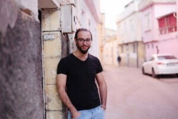
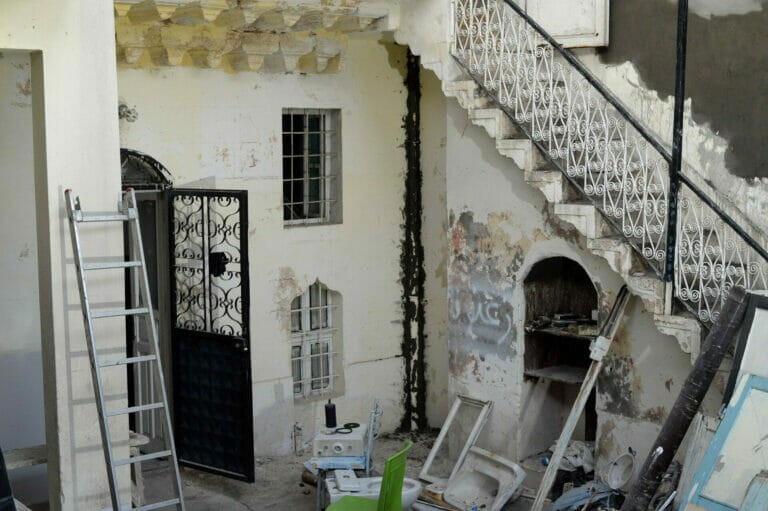

### AYS Special from Turkey\. KIDS RAINBOW IN GAZIANTEP: EDUCATION INSTEAD OF CHILD LABOUR

 \)](assets/da4eef2772e6/1*DW3ZD_XE5WWHIwfbIOR6BA.jpeg)

\(Photo Credit: [Kids Rainbow](https://www.facebook.com/kidsrainbow.org) \)

School instead of work: This is the goal of the organization “ [Kids Rainbow](https://www.kidsrainbow.org/) ” in Gaziantep\. With outreach work, close support for the families and a contact point in the immediate neighbourhood of the Akyol Mahellesi district, where mainly refugees from Syria live, the team wants to give the children in particular easy access to education\.

Actually, compulsory schooling in Turkey also applies to Syrian children\. The economic problems in the country, which also make life more difficult for Turks from day to day, have an even greater impact on immigrant families\. “Within the past two months, rental prices have doubled,” says Nader Al Jarrah, spokesman for Kids Rainbow\.
### **HARDLY ANY REGULAR INCOME**

With 400 to 600 Lira \(currently about 40 to 60 Euros according to the current exchange rate\) per month, rental prices in Akyol are only a fraction of the average in other districts\. But without a regular income, child labour is often a seemingly indispensable part of making a living\. Child labour means, for example:
- Selling flowers
- Cleaning cars
- Working in a factory
- Working in the service sector

“To be honest, there is a large number of Syrian children who do not go to school,” regrets project manager Mustafa Karali\. Particularly affected are \(half\) orphans; lack of documents also made access to education difficult\. Al Jarrah tells of two boys that the Kids Rainbow team recently met on the street; one ten, one eleven years old\. “They work twelve hours a day,” he stresses; in the factory and as an electrician with his father — for 100 Lira \(10 Euros\) per week\. But at least the rent can be paid with this money\.

For comparison: Numerous families receive financial support through the Red Cross\. “That’s around 140 Lira per person — that’s nothing for them,” Karali knows from the talks\. Even though he estimates that around 80 percent of the families in the district get this benefit\. Especially in view of the rampant inflation, this amount is worth less and less\.

> 458\.495 People from Syria have found temporary shelter in Gaziantep\. \(As of [October 14, 2021\)](https://en.goc.gov.tr/kurumlar/en.goc/istatistikler/2021/10-Ekim/18-Ekim/ENG_I%CC%87statistik-Hepsi_03.jpg) 

> 2\.085\.795 People live in Gaziantep in overall\. 

> 21,98 is the proportion of the Syrian population\. 

> 600\.000 of a total of 1\.6 million Syrian school\-age children [attended a public school](https://www.kfw-entwicklungsbank.de/Internationale-Finanzierung/KfW-Entwicklungsbank/%C3%9Cber-uns/News/News-Details_611264.html) in Turkey before the pandemic\. Compared to other host countries, this is a good rate\. 

But how can Kids Rainbow help here? “When we see children working on the street, we ask them whether they actually go to school,” Karali describes the procedure: “If not, we ask them to contact the family and seek conversation with the parents\.” The focus is on children between the ages of six and twelve\.

The team has not yet found a promising strategy, also because the topic is enormously shameful among the families\. “But they have a good reason for this: they need money, some of the children are half\-orphans,” the project manager asks for understanding for the situation of those affected\. At the beginning, the team itself was shocked: “The children really suffer\.” He sees an advantage in this work in the composition of the team: It even consists of Syrians with a refugee history who live with their families in the neighbourhood\. Cultural or linguistic thresholds are therefore low\.

It’s really easy to get in touch with the families\. They can talk about their problems and more in Arabic\.

**\(Mustafa Karali: Project Manager at Kids Rainbow\)**

The two therefore see their facility as a safe space for the families\. “We offer non\-formal education,” Karali says about the activities for children\. Drawing, crafting, making music, cooking, sports, he enumerates\. In addition, there are projects such as a photography course or a play — and most importantly: language courses\. Turkish and English are also in the programme, and Arabic especially enjoys a high priority\. “Many parents are not educated, they just speak the language,” the project manager explains\. Accordingly, they could not teach their children their mother tongue\. Through the dialects, formal Arabic is hardly conveyed\. Although the school expenditure is not too high: “One year is enough to learn to read, write and speak\.”

This is where Kids Rainbow starts — and at the same time prepares the children for Turkish public schools\. Along with racism, the language barrier is the biggest problem for integration, says Al Jarrah\. Through a partnership with the Halk Eğitim Merkezleri Institute \(HEM — Public Education Centres\), which sends Turkish teachers to issue the children with a language certificate for school attendance — this is how this hurdle can be reduced\. For other activities, the organization also works with Turkish partners\. Also because their own rooms are currently being rebuilt\.

Prior to the coronavirus pandemic, Kids Rainbow’s neighbourhood centre was open daily from 10am to 5pm on weekdays\. Currently, the children are divided into groups and attend the courses depending on school hours, if they are now attending one, from 10am to 12pm and from 3pm to 5pm, as the NGO does not currently have its own building\.
### KIDS RAINBOW BUILDS NEW COMMUNITY CENTRE

The new community centre is currently under construction\. Karali leads us through the house, where painting and work is diligently done: From the — recently self\-roofed — courtyard, a staircase leads up to one of the rooms, next to it is the small kitchen\. An even narrower staircase leads up to a small room, which is intended to serve as a retreat for the children, a little higher is the attic\. While there are currently still gaps between the bricks, there are already big plans for the homely attic as soon as it is newly insulated and expanded: “This is where we want to set up our cinema\.”

Karali is pleased that the house with the beautifully tiled floors, the courtyard and its own fig tree, which grows up the stairs, will soon be able to offer Syrian children a safe place to stay: “The houses in Syria are built in the same way\.” In general, the entire district reminds him strongly of Syria\. You can see here the proximity of the two countries\.

By the way, the statistical evaluation of the organization can be seen despite the current restrictions:
- 50 children have been integrated into regular school lessons since 2019; 20 more this year
- Kids Rainbow currently accompanies 45 children
- 150 children are on the waiting list

In addition, the organization provided 45 families with suitable clothing and vouchers for a supermarket last winter; it collected 3000 Euros for it\. Kids Rainbow does not want to be understood as an organization, where one gets donations or even money, “Then people tell, that we are the ones from whom you get vouchers and the real meaning of our work is lost,” explains Karali\. If there is an urgent need, they would give a hint to other NGOs that specialize in emergency aid: “They then visit the family independently, without a reference to us being established\.”

**_Article by Lena Reiner and Niklas Golitschek, first appeared in [Report vor Ort](https://report-vor-ort.de/kids-rainbow-gaziantep-turkey-education-child-labor/?lang=en&fbclid=IwAR1zwGPoVqlbmevD9kTX7LTqlNjZdLDfKufCE-qcuT89ReO92zJ5KeMBFA0)_**

**Find daily updates and special reports on our [Medium page](https://medium.com/are-you-syrious) \.**

**If you wish to contribute, either by writing a report or a story, or by joining the info gathering team, please let us know\.**

**We strive to echo correct news from the ground through collaboration and fairness\. Every effort has been made to credit organisations and individuals with regard to the supply of information, video, and photo material \(in cases where the source wanted to be accredited\) \. Please notify us regarding corrections\.**

**If there’s anything you want to share or comment, contact us through Facebook, Twitter or write to: areyousyrious@gmail\.com**

_Converted [Medium Post](https://medium.com/are-you-syrious/ays-special-from-turkey-kids-rainbow-in-gaziantep-education-instead-of-child-labour-da4eef2772e6) by [ZMediumToMarkdown](https://github.com/ZhgChgLi/ZMediumToMarkdown)._
