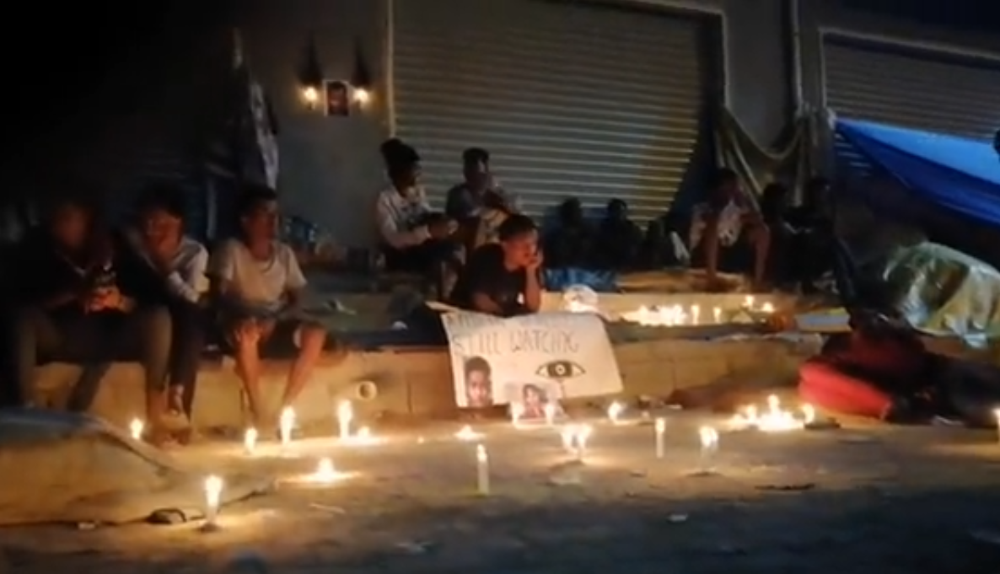
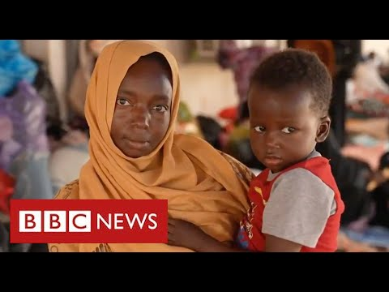

### AYS News Digest 01/11/2021: One month of protests in Tripoli
#### People on the Move in Tripoli keep on asking for their rights // More details about what seems to almost have been a pushback of 381 people from Greece // People arrested in Turkey over videos posted on social media // Arrivals on Canary Islands and Italy // Poland will build a wall

People in Tripoli mourn the death of a boy who was killed in a car accident outside the UNHCR building\. Screenshot from a video posted by Hassan Zakaria
### LIBYA: How much longer until Europe listens to their calls?

People on the Move in Libya keep on protesting and demanding their rights, as well as safety and support\. For 31 days now, hundreds of people are gathered in Tripoli in front of Community Day Centre of UNHCR in search for safety and protection, after a massive crackdown led to the arrest and imprisonment of thousands of people at the beginning of October\. During subsequent detention center outbreaks, at least 6 people were shot dead\. The people protesting refuse to be subjects to migration policy enforcement in Libya\.

Over the weekend, they mourned the death of a 17\-year\-old boy who was hit by a passing car on October 27 and died in hospital later on\.

■■■■■■■■■■■■■■ 
> **[Refugees In Libya](https://twitter.com/RefugeesinLibya) @ Twitter Says:** 

> > We continue to mourn our 17 yr old Eritrean fallen comrade #BanmatBarkhat may your soul rest in peace. 
💔💔💔💔💔💔 https://t.co/0aJnMMxvfL 

> **Tweeted at [2021-10-31 17:24:57](https://twitter.com/refugeesinlibya/status/1454861967336824832).** 

■■■■■■■■■■■■■■ 

While the Community Day Centre remains closed, according to UNC HR spokespersons, support is provided to people in different locations in the city\. However, after four weeks of protesting, these people have still not been provided with safe emergency housing, food supplies and a solution to their situation\. Many of them are calling for evacuations out of the country\.

The NGO Mediterranea and Amnesty International organized a press conference on October 28th with protesters in Tripoli which can be rewatched here:

[According to media reports,](http://apanews.net/en/news/au-rwanda-unhcr-to-evacuate-refugees-asylum-seekers-from-libya/) an agreement between the African Union, Rwanda and UNHCR was found that allows for resettlement of People on the Move from Libya to Rwanda\. Within the Emergency Transit Mechanism, about 600 people have been resettled to Rwanda since 2019\. Now, Rwanda agreed to take in another 700 people\.

According to Journalist Sara Creta, Libyas head of the Department for Combatting Illegal Migration was replaced in the aftermath of the raids\.

■■■■■■■■■■■■■■ 
> **[Sara Creta](https://twitter.com/saracreta) @ Twitter Says:** 

> > #Libya PM signed an order to replace DCIM's head, Mabrouk Abd al-Hafiz with Ezzedine Al-Zouk - who is now the head of the Department for Combating Illegal Immigration. The replacement came after sweeping raids in #Tripoli targeting migrants - a labelled anti-drug ops in Gargaresh https://t.co/PpXjuqcU8x 

> **Tweeted at [2021-11-01 12:45:35](https://twitter.com/saracreta/status/1455154050954108928).** 

■■■■■■■■■■■■■■ 

### GREECE
#### largest ever pushback attempt?

With a bit of a distance to the events that unfolded around the boat carrying about 400 people, the incident becomes more and more outstanding\.

[Koraki provided an excellent overview of the situation](https://www.koraki.org/post/nea-dimokratia-attempts-largest-ever-pushback) , calling it Nea Demokratia’s largest ever pushback attempt that was only prevented by international media attention and the impossibility to tow a boat into Turkish waters without the towing boat \(Hellenic Coast Guards\) entering Turkish waters themselves\.

The boat is said to have been heading from Turkey to Italy, but broke down between the two Greek islands of Crete and Christi, a 20 minutes sea journey from Crete\. The people on board alarmed the Aegean Boat Report at an early stage and provided footage of what was happening, [allowing ABR to provide detailed information](https://aegeanboatreport.com/2021/10/29/pushback-ongoing-involving-400-people/) to the public\. When the Hellenic Coast Guards arrived tot he scene, instead of bringing the people to Crete, they started a journey that lasted for more than 56 hours, towing the boat in the direction of Turkey\. The people on board were not provided with food or water\. Greek authorities instead asked Turkish authorities to take the boat back\. [Lena Karamanidou pointed out that there is no legal grounds for this request\.](https://twitter.com/lk2015r/status/1455267505858039824) Turkey refused, and the boat finally landed on the Greek Island Kos where the people were disembarked\. Six of them were arrested on allegations of smuggling\.

Lena Karamanidou analyses Greek Migration Ministers interview in Greek TV, as always on point:

■■■■■■■■■■■■■■ 
> **[Lena K.](https://twitter.com/lk2015r) @ Twitter Says:** 

> > 🇬🇷 migration minister gave an interview on the case of the ship with 382 people which arrived in Kos yesterday after 3 days being towed around the Aegean by the 🇬🇷 coast guard. Some takeaways 1/
[aegeanboatreport.com/blog-posts/](https://aegeanboatreport.com/blog-posts/) 

> **Tweeted at [2021-11-01 20:16:24](https://twitter.com/lk2015r/status/1455267500904566788).** 

■■■■■■■■■■■■■■ 

According to Mitarachis, about two thirds of the people on board of the ship are from Pakistan and Bangladesh, while the rest is mainly from Afghanistan\. Lena’s comment on this:

■■■■■■■■■■■■■■ 
> **[Lena K.](https://twitter.com/lk2015r) @ Twitter Says:** 

> > He says 2/3 are from Pakistan &amp; Bangladesh suggesting therefore not eligible for protection, &amp; that he will talk to the ambassadors of the two countries to facilitate their deportation. Nationality does not preclude that they have reasons to claim protection, but who cares. 5/ 

> **Tweeted at [2021-11-01 20:16:27](https://twitter.com/lk2015r/status/1455267513156227072).** 

■■■■■■■■■■■■■■ 

#### UN periodic review includes Pushbacks

BVMN, of which AYS is a member, wrote a submission to the UN periodic review on Greece\. The Submission mainly focussed on the ongoing and systematic practice of Pushbacks from Greece\.

The Review was presented on November 1st:

■■■■■■■■■■■■■■ 
> **[UN Human Rights Council](https://twitter.com/UN_HRC) @ Twitter Says:** 

> > 🔵 TODAY from 9:00 CET

The Human Rights Council reviews the human rights record of #Greece.

#UPR39 📺 WATCH [webtv.un.org](http://webtv.un.org) https://t.co/baereiJP4X 

> **Tweeted at [2021-11-01 07:00:14](https://twitter.com/un_hrc/status/1455067138675335170).** 

■■■■■■■■■■■■■■ 

#### Important information on how to get a vaccine in 10 languages\!

#### Report on Detention Centres on Kos published

Equal Rights beyond borders published a report on the situation on the Greek Island of Kos, where newly arrived people are systematically detained in a violation of Greek and international law\.

### TURKEY
#### Arrests over Banana videos

At least eight people have been arrested in Turkey and are at risk of being deported to Syria after they posted videos of themselves eating banana\. Before, a video went viral in which a man said that he could not afford to buy Bananas while migrants buy them in large quantities\. In reaction to this, People on the Move posted videos of themselves eating bananas\. The Turkish authorities reacted by arresting these people for “provocative social media posts”\.

Turkish NGOs now published a joint statement :

> “The reaction of refugees on social media is entirely within the scope of freedom of expression and no one can be deported for using their freedom of expression\. We invite Turkey to comply with its national legislation and keep its promise in international conventions\. And first of all, we demand that the deportation procedures be stopped as soon as possible for the refugees who make the said posts\. In addition, we demand that necessary judicial measures be taken against those who produce discriminatory and hate speech against refugees at any time\.” 

■■■■■■■■■■■■■■ 
> **[Göçmen Dayanışma Ağı/Ankara](https://twitter.com/GDA_Ankara) @ Twitter Says:** 

> > "Mültecilerin sosyal medyada verdiği tepki tamamıyla ifade özgürlüğü kapsamındadır ve kimse ifade özgürlüğünü kullandığı için sınır dışı edilemez. Türkiye’yi ulusal mevzuatına uymaya ve uluslararası sözleşmelerde verdiği sözü tutmaya davet ediyoruz 

> **Tweeted at [2021-11-01 16:31:50](https://twitter.com/gda_ankara/status/1455210988081451019).** 

■■■■■■■■■■■■■■ 

### CYPRUS
#### Arrivals

■■■■■■■■■■■■■■ 
> **[Alarm Phone](https://twitter.com/alarm_phone) @ Twitter Says:** 

> > We received confirmation that the 6 people were rescued and arrived safely in #Cyprus. Still, we are afraid of a deportation to #Lebanon. We once again remind the Cypriot authorities that the people have the right to asylum and safety in #Europe! 

> **Tweeted at [2021-11-01 13:12:03](https://twitter.com/alarm_phone/status/1455160711731154966).** 

■■■■■■■■■■■■■■ 

### ITALY
#### Arrivals on Lampedusa

Medierranean Hope: “Today at Lampedusa, 110 people have landed \(so far\) \. Yesterday, in less than 24 hours, another 150 arrived on the island, on 8 different boats, from Tunesia\. Among them there are minors and even some families”

■■■■■■■■■■■■■■ 
> **[Mediterranean Hope](https://twitter.com/Medhope_FCEI) @ Twitter Says:** 

> > Oggi  a #Lampedusa sono approdate 110 persone (fino a questo momento). Ieri, in meno di 24 ore, ne sono arrivate sull’isola altre 150, su 8 imbarcazioni diverse, dalla #Tunisia. Tra di loro ci sono dei minori e anche alcune famiglie. #RefugeesWelcome #mediterraneo #dirittiumani https://t.co/tAz6RLKqKQ 

> **Tweeted at [2021-11-01 18:54:46](https://twitter.com/medhope_fcei/status/1455246958172454922).** 

■■■■■■■■■■■■■■ 

### SPAIN
#### The month of October and the route to the Canary Islands

According to Journalist Txema Santana, at least 20 people died this month alone on their way to the Canary Islands\. Many more are in hospital or still missing\.

On Monday 1 November, 65 people arrived to the most eastern of the Canary Islands, El Hierro\.
### POLAND
#### More Border Walls for Europe

The construction of a wall at the Polish border with Belarus has been approved by the Polish parliament\. The wall has a budget of 353 million Euros and will span 100 kilometers\.

[Meanwhile, a Polish TV program used a scene from a Netflix series to promote racist anti\-migrant stereotypes](https://www.euractiv.com/section/all/short_news/polands-most-watched-news-programme-uses-netflix-series-to-call-refugees-criminals/?fbclid=IwAR32KykyxSpmXpLAmcPSUuTIMeY5jX8PpKUx3ZnLxkHGTVYUltT9NKCrErk) \. The violent sequence from the series was introduced as showing Swedish reality\.
### FRANCE
#### Undocumented workers on strike

In France, hundreds of undocumented people working for delivery services, waste collection and catering went on strike\. They demand their employment status to be legalized\. During the pandemic, their situation became even more precarious, as they had no access to state benefits\.

**Find daily updates and special reports on our [Medium page](https://medium.com/are-you-syrious) \.**

**If you wish to contribute, either by writing a report or a story, or by joining the info gathering team, please let us know\.**

**We strive to echo correct news from the ground through collaboration and fairness\. Every effort has been made to credit organisations and individuals with regard to the supply of information, video, and photo material \(in cases where the source wanted to be accredited\) \. Please notify us regarding corrections\.**

**If there’s anything you want to share or comment, contact us through Facebook, Twitter or write to: areyousyrious@gmail\.com**

_Converted [Medium Post](https://medium.com/are-you-syrious/ays-news-digest-01-11-2021-one-month-of-protests-in-tripoli-eb1fb25a16e9) by [ZMediumToMarkdown](https://github.com/ZhgChgLi/ZMediumToMarkdown)._
