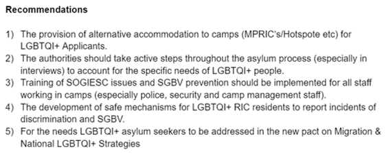
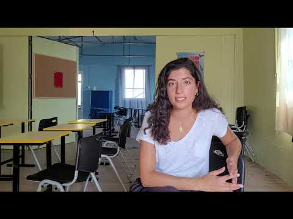

### AYS News Digest: 4/11/2021 EU drones to monitor the Mediterranean
#### Press conference held by group outside Libya UNHCR//Concerns over evacuations and winter conditions in Afghanistan//Four infants lost lives in boat tragedy off Gran Canaria//Three\-point action report for MEPs from Greek groups//Frontex plane spotted in Croatia//’Serious’ conditions at French\-Italian border//Main NGO funder Choose Love withdraws help in Calais
#### FEATURE
### EU Drones to monitor the Mediterranean

](assets/96f9870433c6/0*Blq_bXikotDqAhkB.jpg)

Photo Credit: Drone Footage with life raft\. All rights reserved by [Tekever](https://www.navalnews.com/naval-news/2021/10/tekever-signs-maritime-surveillance-contract-with-emsa/)

[Drones in the Mediterranean could save lives](https://netzpolitik.org/2021/eu-drohnen-fuer-menschen-in-seenot-abgeworfene-rettungsinseln-koennten-fuer-pullbacks-missbraucht-werden/?fbclid=IwAR28ZFnx1ug3OAWwRMz9S3U4Oxn4fugoXmzI4uVC5MPkiBhyyHqwNgOjOx8) , or they could be used for ‘pull\-backs’ to Libya\. Drones provided by Portuguese company Tekever, can drop an inflatable life raft from the air\. The drones can fly for 12 hours at a time with a range of 500 km, and carry a life raft that can assist up to eight people\.
#### Sea rescue groups have criticized the [€30 million contract](https://www.navalnews.com/naval-news/2021/10/tekever-signs-maritime-surveillance-contract-with-emsa/) as being unsuitable\. Most rescues carried out by Sea Watch are of groups of 70 to 120 people, rendering the capacity of just eight people to be quite useless\. Groups are also concerned that life rafts could be used for ‘pull\-backs’ to Libya — once passengers are onboard, the raft could be towed towards the African coast\. Similar rafts have been used for illegal expulsions in Greek\-Turkish waters, and Mare Liberum is fearful that the same will occur with this new technology\.
#### MOROCCO

Unlawful prosecution of asylum seekers is reported in Nador, Morocco\. Fifteen Sudanese people were arrested and prosecuted\. [This was suspected to be a display of police power\.](https://twitter.com/NadorAmdh/status/1455601041894936576?fbclid=IwAR1_nLh1GTNnwK0lZqzO8ouscYNpoau5nLIqaYu_u0k65G5HW2cZRS4uRec)
#### LIBYA
#### Press conference held by group outside Libya UNHCR

The deteriorating situation for refugees in Libya has caught the attention of international publications\. [This first\-person account by a Tripoli resident](https://www.thenewhumanitarian.org/opinion/first-person/2021/11/2/how-migrants-asylum-seekers-Libya-lost-faith-in-foreign-aid?fbclid=IwAR38O7h_z7kZQQRUXN_i-lzn66fxOFz6s3PeR9-7DFB6I_lHr0FIamzCjX0) puts the troubles in a wider Libyan perspective\. A group of 4–5,000 people have positioned themselves in front of the UNHCR building and [held a press conference](https://global.ilmanifesto.it/refugees-in-tripoli-are-organizing-a-resistance-to-inhumane-treatment-we-deserve-to-live/?fbclid=IwAR3vxRJ5TdrJnPiHRNQUfoft6XJ0re6rZgUOCbjzLy6EpzYjMUH-U97mMaQ) with Italian journalists, European activists and a bishop\.

> “We have no choice and we will resist until the last breath that we have … until every last one of us is killed in front of the city\. We have nowhere to go\. … We deserve to live\. We have the right to life, we have the right to seek asylum because we have been forced to flee, we have the right to protection\.” David — spokes\-person for the group\. 

This comes as the sanctions imposed by Western nations [are criticised](https://ffm-online.org/libya-u-n-sanctions-eu-conditions-and-new-difficulties-to-escape-to-europe/?fbclid=IwAR0BgEz4iK79zuvMY25H2ffVJ_8jU6sv_Ri84NrT8FiqlqYIWJvCOyJQchw) for causing further problems\.
#### AFGHANISTAN
#### Concerns over evacuations and winter conditions in Afghanistan

_](assets/96f9870433c6/0*DcDm-oSiOUepypmf)

Photo Credit: _Infomigrants [Reuters/M\. Ismail](https://www.infomigrants.net/en/post/36213/afghanistan-evacuation-efforts-to-germany-remain-challenging?fbclid=IwAR1qc_bDHng1x2MBa9eZ6E9W6xd_kCspyCa1tH30r5aw-svXkP8etnE7D2A)_

[Relations between Germany and Afghanistan remain slow](https://www.infomigrants.net/en/post/36213/afghanistan-evacuation-efforts-to-germany-remain-challenging?fbclid=IwAR1qc_bDHng1x2MBa9eZ6E9W6xd_kCspyCa1tH30r5aw-svXkP8etnE7D2A) , as those with visas to enter Germany are still waiting for evacuation\. One issue causing delays is the need for a passport\. Obtaining a passport was slow before the Taliban take\-over and is likely to slow further under current circumstances\. Some flights have been successfully leaving Kabul for Doha in Qatar with German nationals and Afghan nationals onboard\. Meanwhile, UNHCR is flying in aid to help those who remain to face a harsh winter\.
#### TURKEY

Social media reports of the death of Turkish President Erdogan Tayyip [have been disproved](https://cyprus-mail.com/2021/11/03/ankara-allays-social-media-fears-that-erdogan-had-died/?fbclid=IwAR0Gy_HHYcPmOQtiA8BztrCeMTTKC8YVF58zBK7gP1AHAYatfgGY8yxZqEs) \. Erdogan was expected at the COP26 summit in Scotland because of “failures to meet security protocols”\. A twitter video, showing Erdogan and his wife Emine landing at Ankara airport, dispelled the rumours\.

[Efforts to ease racist discrimination](https://www.aljazeera.com/news/2021/11/3/uncertainty-for-syrians-in-turkey-as-opposition-warms-up-to-assad?fbclid=IwAR08-LE5ZchkrFgjchi75HVVies9_RI-xVbHtfJE94Ch2d750jN93b61dDA) against refugees in Turkey are being made by Taha Elgazi — himself a Syrian refugee\. Elgazi has instigated meetings with many political parties, encouraging them to change, he said:

“We are looking for an agreement between parties that holds them accountable, that they will not use refugees, whether Syrian or Afghan or others, for domestic politics in Turkey\.”

The article discusses the political landscape of Turkey, including the possibility of a “post\-Erdogan relationship with Syria” which could see the return of Syrian refugees to Syria\.
#### SEA — SAR
#### Four infants lost lives in boat tragedy off Gran Canaria

The sad deaths of four babies on 24 October on a [vessel at sea was reported](https://elpais.com/espana/2021-11-03/mueren-cuatro-bebes-en-el-intento-de-llegar-a-canarias-desde-el-sahara-en-una-patera.html?fbclid=IwAR0o1YL3zVEXbDy0j9G3nleHA0U-OkzamtgKLpbaUSEfaIVzotBqViczDDI) \. The children, along with a man and several women, were afloat for 10 days before being rescued 200 kilometres from the coast of Gran Canaria\. The events of the group have been shared as more detail was discovered, including that a Maritime Rescue helicopter had those in the most serious condition\. A man, a woman, two babies and four children were airlifted to hospital to receive urgent treatment\.

In the same area, AlarmPhone [again reports an emergency\.](https://twitter.com/alarm_phone/status/1455844634752606213?fbclid=IwAR31anvqMmQrCRv7iYMhqs-Y16tTFKTF2NFhh570uAzI_NnFPBw7xINln70)

[SeaEye reports](https://www.facebook.com/seaeyeorg/posts/4092216287550904) six rescues in just 48 hours involving 397 people, whilst [this video](https://www.facebook.com/watch/?v=1026597501406930) from Ocean Viking shows a rescue near the Libyan coast\. Ocean Viking also undertook a [night rescue](https://www.facebook.com/SOSMEDITERRANEE.de/posts/4502664756507464) involving 44 people\.

Meanwhile, near Malta, there were two separate incidents\. The first involved [200 people were struggling](https://twitter.com/alarm_phone/status/1455896382469025792?fbclid=IwAR18kmvKV1CiYL2hQhuzw8CU9Dp9avG-rsF0cMB7ASifSB-CBYaMfOpQRME) onboard a vessel in bad weather where contact was lost\. The second involved [350 people](https://twitter.com/alarm_phone/status/1455838922777505794?fbclid=IwAR0BgEz4iK79zuvMY25H2ffVJ_8jU6sv_Ri84NrT8FiqlqYIWJvCOyJQchw) who were [eventually rescued](https://twitter.com/alarm_phone/status/1456184291562606593) \.

[This article](https://timesofmalta.com/articles/view/rescue-underway-as-boatload-of-migrants-lands-on-ghar-lapsi-rocks.912126?fbclid=IwAR2jtRPvdDvdTvD_HFN_CplC8o0HbfJ_nSLOf9aQeBqByG2BqpvrHMgKIOs) describes the rescue of 49 people, including a pregnant woman, who reached the Maltese coast without assistance, but who couldn’t climb the rocky shore\.

In June 2018, the search and rescue vessel Sea Watch 3 was detained in the port of Valletta, Malta\. Despite meeting all security requirements, the boat was held for four months\. Sea Watch Legal Aid Fund sued the Maltese authorities for the financial costs endured during that time, but their claim was dismissed in September 2021\. [The full report of the story](https://swla.eu/en/project/unlawful-detention-sea-watch-3/) ends with the resolve to [appeal the decision](https://twitter.com/SW_LegalAid/status/1455573329088335873?fbclid=IwAR1qc_bDHng1x2MBa9eZ6E9W6xd_kCspyCa1tH30r5aw-svXkP8etnE7D2A) \.
#### GREECE
#### Three\-point action report for MEPs from Greek groups

](assets/96f9870433c6/0*6djq-9W_zTwLOgNM)

Photo Credit: [_AP Photo / Alexander Zemlianichenko_](https://www.efsyn.gr/stiles/ano-kato/317501_ergaleiopoiisi)

A briefing has been released by a group of NGOs calling for change of European Parliament\. The three\-point report calls for an independent monitoring body, rejection of policies that impede refugees and to assist Greece in providing suitable provision\. [Read the full report here\.](https://reliefweb.int/report/greece/joint-ngo-briefing-situation-greece-27-october-2021?fbclid=IwAR38O7h_z7kZQQRUXN_i-lzn66fxOFz6s3PeR9-7DFB6I_lHr0FIamzCjX0) The groups involved are:

[Action for Education](https://reliefweb.int/organization/action-education) , [Danish Refugee Council](https://reliefweb.int/organization/drc) , [International Rescue Committee](https://reliefweb.int/organization/irc) , [Jesuit Refugee Service](https://reliefweb.int/organization/jrs) , [Médecins du Monde](https://reliefweb.int/organization/mdm) , [Refugees International](https://reliefweb.int/organization/ri-0) , [Save the Children](https://reliefweb.int/organization/save-children) , [SolidarityNow](https://reliefweb.int/organization/sn) , [Terre des hommes](https://reliefweb.int/organization/tdh)

The report comes as groups [met with MEPs](https://twitter.com/samosvolunteers/status/1455955124279554053?fbclid=IwAR0BgEz4iK79zuvMY25H2ffVJ_8jU6sv_Ri84NrT8FiqlqYIWJvCOyJQchw) from the EU Justice Committee to discuss the suitability of the camp on Samos\.

Context is given in t [his video report](https://www.france24.com/en/video/20211102-greece-s-new-samos-migrant-camp-can-welcome-3-000-asylum-seekers?fbclid=IwAR0dxLheqiMeCSLHBZbnSjjiq-nSdNoPEDtATt_ZbDVqngt6CPNdspVFxkw) , in English, which documents and condemns the new Samos camp with the views of residents included\.

Meanwhile, t [his Twitter](https://twitter.com/samoslgbtqi/status/1455948436562399241?fbclid=IwAR18kmvKV1CiYL2hQhuzw8CU9Dp9avG-rsF0cMB7ASifSB-CBYaMfOpQRME) thread explores the experiences of LGBTQI\+ identifying people in the new Samos camp\. The group [Samos LGBTQI\+ Group](https://twitter.com/samoslgbtqi) calls for the following changes:

The residents of ‘Moira 2’ on Lesvos are being denied education\. School\-age residents are only permitted to leave the camp for three hours per week, making school attendance impossible\.

Criticism of the discourse and behaviour surrounding the large boat of people that is the subject of [this piece\.](https://www.efsyn.gr/stiles/ano-kato/317501_ergaleiopoiisi) As reported in the [AYS weekend digest](ays-weekend-digest-30-31-10-21-nothing-to-eat-or-drink-cd92809f57e7) , almost 400 people arrived on the island of Kos, an event that the Greek government has tried to politicise\.

[This long read](https://themarkaz.org/refugees-detained-in-thessonalikis-diavata-camp-await-asylum/?fbclid=IwAR1gG6pJzAsQuogf6uGi5QU7ASNMyhoE88C5UCsmwnA8Tf68n2uPjUmlKW0) is an accessible account and shares the experiences of people staying at the Diavata Camp in Thessaloniki\.
#### CYPRUS

A [successful project is to be given further support in Cyprus\.](https://cyprus-mail.com/2021/11/03/call-to-improve-programme-helping-migrant-teens/?fbclid=IwAR0dxLheqiMeCSLHBZbnSjjiq-nSdNoPEDtATt_ZbDVqngt6CPNdspVFxkw) The project, which aims to aid integration, is for teenage unaccompanied minors who are currently living with adults at reception centres like Pournara\. The number of the children in Cyprus is growing with people from countries including Sierra Leone, Somalia, Congo and Syria\.The goal of the project is to help 300 people over four years\.
#### CROATIA
#### Frontex plane spotted in Croatia

■■■■■■■■■■■■■■ 
> **[Sergio Scandura](https://twitter.com/scandura) @ Twitter Says:** 

> > 2021-11-01
2007z ⏱️ 21:07 CET

Osprey over Balkans

🛩️ Frontex 🇪🇺 #DA62 G-WKTH by DEA Ltd 🇬🇧 c/s #OSPREY1 is landing in #Zagreb Franjo Tuđman Airport, after a patrol mission along the #Croatia 🇭🇷 / #Bosnia 🇧🇦 border.

#Migrants #Refugees #Croatia #Bosnia #Croazia #Migranti https://t.co/NjVAtVzfMQ 

> **Tweeted at [2021-11-02 22:13:56](https://twitter.com/scandura/status/1455659468038066178).** 

■■■■■■■■■■■■■■ 

A Frontex plane has been seen patrolling the Croatian\-Bosnian border, before landing in Zagreb\.

[A family from Syria remains separated](https://www.avvenire.it/attualita/pagine/famiglia-di-profughi-siriani-divisa-da-un-timbro-la-madre-in-germania-padre-e-tre-figli-in-bosnia?fbclid=IwAR2METAvYDXUQz7CHD7-JSd13tYY1njS4h-0aWZXM1ZmQIz7BMK3uCIv9ZU) , despite all members having asylum status\. The mother of the family is resident in Berlin, Germany, whilst the father and three children remain in Bosnia\. This is an example true for many families, and demonstrates the harsh reality of the legal routes to safety — the family are waiting for reunification which they are justly entitled to\.
#### SLOVENIA

A short documentary has been released about illegal expulsions from Slovenia to Croatia\. The film details the [‘cruel practices’ of the Slovenian authorities](https://www.facebook.com/infokolpa/posts/275279604605900) since pushbacks started in 2018\. [Watch it here](https://youtu.be/e4hGXyqzrVU) \.
#### ITALY
#### ‘Serious’ conditions at French\-Italian border

Doctors for Human Rights \(MEDU\) are [very concerned about the ‘serious’ situation](https://www.infomigrants.net/en/post/36204/italyfrance-border-situation-serious-says-medical-rights-group-medu?fbclid=IwAR0Gy_HHYcPmOQtiA8BztrCeMTTKC8YVF58zBK7gP1AHAYatfgGY8yxZqEs) at the French\-Italian border\.

“Entire families arriving from the Balkan route and some migrants coming from the central Mediterranean route continue trying to cross the border at the Montgenevre and Fréjus crossings to get to France, but the two reception centers at the borders do not have enough places\.” MEDU Statement\.

Over the weekend, the numbers of people were too great for the reception centre, and 200 people took shelter at the train station\. The church there has also offered assistance to those in need\. As the people arriving include families, the situation is complex, and will only worsen as winter weather approaches\.

**FRANCE**
#### Main NGO funder Choose Love withdraws help in Calais

The Choose Love funding body has [withdrawn financial support](https://www.theguardian.com/world/2021/nov/03/refugee-aid-in-northern-france-at-risk-as-choose-life-ends-funding?fbclid=IwAR3U5rVvwRbmu3zco1BQX3ZcNNhPSbr5DXll5Qoi_scEwPuKQutkCZbJZcI) from seven of the grassroots organisations working in Calais, Northern France\.

One of the NGOs affected, Refugee Info Bus, said:

> “Funding from Choose Love supported our vital services and filled a major gap left by governments and large NGOs\. Their withdrawal is a serious blow which will have real consequences in Calais\.” 

](assets/96f9870433c6/1*brJELzVvSyGC7_gJc8bKKQ.png)

[Choose Love Instagram Page](https://www.instagram.com/p/CVv6M_SM7B5/?fbclid=IwAR1MSzoafvx_5K41WmkSlAaGA6Y8TNbSlIQFvLj_FZF87AcmozMeAcO-S54)

In a statement issued on Instagram, Choose Love cites “contributing factors, including the pandemic” as the reason for the decision\.

Whilst this comes as a huge blow for organisations, groups have joined together to appeal for funding from other avenues\. [Calais Appeal](https://www.instagram.com/calaisappeal/) represents several groups which provide food, equipment and fire wood and you can [donate to them via this link\.](https://linktr.ee/calaisappeal)

Also in Calais, the [hunger strike continues](https://twitter.com/HumanRightsObs/status/1455909050697363458?fbclid=IwAR1sm93aXVNY8jUokI5n_C_3fOPfglYlUzm7cqa36B55AguIYJOMBuYcGew) as no solution has been found despite a response from the French authorities\.

The French government [has however announced](https://www.dw.com/en/france-to-offer-evicted-calais-migrants-shelter-envoy-says/a-59701106?fbclid=IwAR0NPS637WY1UmR-2KiARgPJWPIqYsuOj6zWor0Ggw86hYMKylFfZVTf19Y) that ‘surprise evictions’ will cease and accommodation will be offered to those evicted\. Additionally, a [new initiative for accommodation](https://www.lespetitespierres.org/projets/creation-dun-hebergement-solidaire/712?utm_source=Asso&utm_medium=reseauxsociaux&utm_campaign=Cr%C3%A9ation%20d%27un%20h%C3%A9bergement%20solidaire&fbclid=IwAR0R21DpT0QTsS8j1wf37KDZ1sjgoAEV6NIVnxdt_HzC14pQtwysXC3hDVE) in Northern France to offer emergency accommodation to up to 15 people is starting in Dunkirk\. With winter approaching, [the conditions outdoors](https://twitter.com/SolidarityBord2/status/1455985668174323720?fbclid=IwAR38O7h_z7kZQQRUXN_i-lzn66fxOFz6s3PeR9-7DFB6I_lHr0FIamzCjX0) make this especially important\.

**Find daily updates and special reports on our [Medium page](https://medium.com/are-you-syrious) \.**

**If you wish to contribute, either by writing a report or a story, or by joining the info gathering team, please let us know\.**

**We strive to echo correct news from the ground through collaboration and fairness\. Every effort has been made to credit organisations and individuals with regard to the supply of information, video, and photo material \(in cases where the source wanted to be accredited\) \. Please notify us regarding corrections\.**

**If there’s anything you want to share or comment, contact us through Facebook, Twitter or write to: areyousyrious@gmail\.com**

_Converted [Medium Post](https://medium.com/are-you-syrious/ays-news-digest-4-11-2021-eu-drones-to-monitor-med-96f9870433c6) by [ZMediumToMarkdown](https://github.com/ZhgChgLi/ZMediumToMarkdown)._
