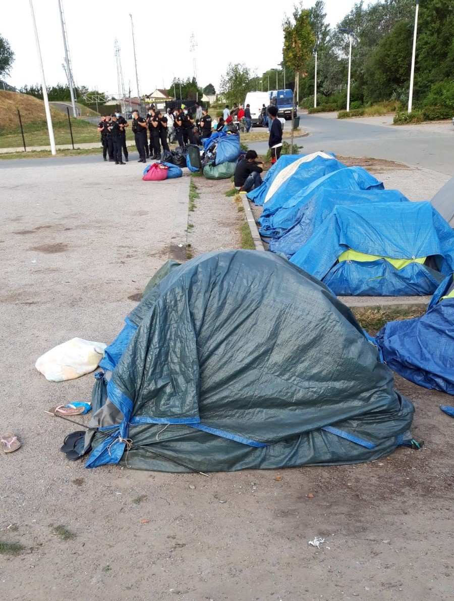
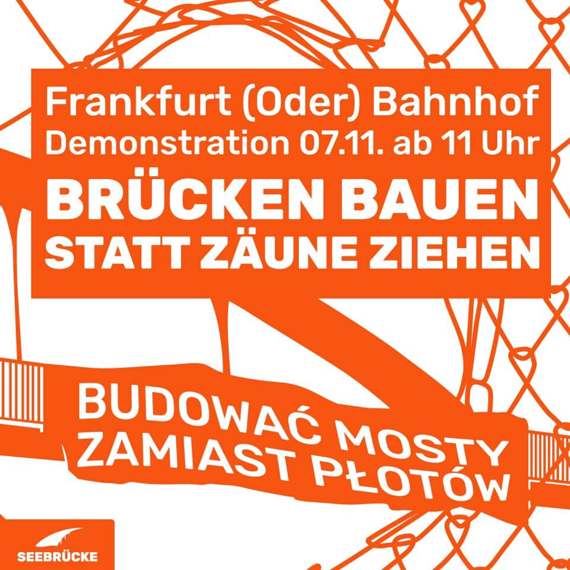

### AYS Digest 5/11/21 — Protest Continues in Tripoli

[Are You Syrious?](?source=post_page-----fd5a26cf2354-----------------------------------)

[Nov 6](ays-digest-5-11-21-protest-continues-in-tripoli-fd5a26cf2354?source=post_page-----fd5a26cf2354-----------------------------------) · 9 min read

Group of Palestinians disappeared in Greece / Deaths at Evros and on Crete / People Missing in the Aegean / MEP witnesses attempted pushback / Arrivals in Rome / Tension at Poland\-Belarus border / Lithuania starts border fence build / Montenegro will not take Afghanis / Protests in Germany / Deaths in Calais / Syrian returnees report torture / Violent evictions in DK and more…

FRANCE: Tuesday, 552 tents were distributed in Calais by 6 associations\. However, since the beginning of the year, HRO has already observed the seizing and destruction of at least 5,855 tents and tarpaulins by French authorities\. How long will the absurdity of this situation last? \(Photo and info by: [Human Rights Observers](https://twitter.com/HumanRightsObs/status/1456607517216317446) \)
### FEATURE: Protest Continues in Tripoli

In a letter strongly condemned by protesters, UNHCR have accused protesters of blocking the way of people in need of support in Tripoli\.

The protesters question UNHCR’s vulnerability criteria and the accusation that the protest is not peaceful:

In [an interview](https://www.scribd.com/document/537221011/CrispUNHCRLibya-1) with [Jeff Crisp](https://twitter.com/JFCrisp/status/1456310722212896775?fbclid=IwAR3tdDYao7gIDPNKAOwaaCVSjWURExjx4CvEvgkNDS7WHNYA_CYRDELDugA) , Refugee Studies Centre and Chatham House, UNCHR stated that they were unable to find accommodation alternatives for people left homeless after the security operations in October during which many were evicted and homes were demolished\.

Regarding the return of people to Libya, they stated that is not a safe country\.

> _UNHCR has always made clear that any support \(by EU and other donors\) to the Libyan Coast Guard or other Libyan State authorities should be made conditional on the human rights of refugees and migrants in Libya being upheld and respected\. All those rescued or intercepted should be treated in a humane manner, respectful of their human rights, at all times_ 

[Evacuation flights have now restarted](https://twitter.com/UNHCRLibya/status/1456425794511773696?fbclid=IwAR2s3FYRgb-nmyLQZ9uqb8pSkJRUY6tv2Vhx2HYamc9lm2Eh_TA55KskXKM) \. 172 people were taken to Niger in the first flight since they stopped over a year ago due to the pandemic\.

Meanwhile, Abd al\-Rahman Milad, documented as being involved in the sinking of boats, is now recruiting for the LCG\.

SEA
### Central Med

Sea\-Eye 4 [rescued](https://www.infomigrants.net/en/post/36262/seaeye-4-rescues-800-roughly-1400-total-rescues-in-recent-days) around 400 people on Thursday, while already carrying a further 400 people from earlier rescues\. The people in distress were first sighted by Rise Above, a smaller vessel of Mission Lifeline\.

“A state of emergency is now in effect on the SEA\-EYE 4\. Any delay by the authorities \(on port access\) endangers the health and lives of the rescued people and our crew … Sea\-Eye has already asked the rescue coordination center in Rome for the assignment of a safe port and the German Foreign Office for urgent assistance…,” Sea\-Eye [statement](https://www.marinelink.com/news/ngo-rescue-ship-migrants-aboard-asks-491883) says\.

Nonetheless, they are still waiting for a safe port\.

314 people are [on board](https://twitter.com/SOSMedIntl/status/1456356305560641536) Ocean Viking, after 69 were rescued on Thursday night\. They are also waiting for a safe port\.

GREECE
### Palestinians trapped on Farmakonisi have disappeared

[Aegean Boat Report](https://aegeanboatreport.com/2021/11/05/families-in-captivity-on-farmakonisi/?fbclid=IwAR3bA63Z6Lzkfg9Dm00DAoFGPLZxqf5WHFHXMNLSymIlVMTUMhSiX2Hxbj0) have been contacted by a group of 36 people from Palestine who were being held for several days in a shed next to the port on the small island of Farmakonisi\. They have now disappeared and have not arrived on the neighbouring island of Leros\. They clearly expressed to ABR their wish to claim asylum and were within Greek territory\.

This is one of the many reasons why [Mitarachi, Migration Minister of Greece, has recently announced](https://euobserver.com/migration/153431?fbclid=IwAR2b0AgAzriGvRKMNNMwYXL8wIgaoV7VRUaEWSI2f9q2R-xTD_rb-Byd9rg) that the Human Rights monitoring requested by the EU at Greek’s borders may be illegal under national law\. It’s much easier for a state to enact enforced disappearances and pushbacks if there are no witnesses\.
### Another Death at Evros Border

[It has recently come to light](https://www.euractiv.com/section/politics/short_news/ngo-another-migrant-dies-at-greek-turkish-border/?fbclid=IwAR292kZu7BtWNd-b9V6TWPI0uwqujuDn38elCCFuh44vXhZbW7VFQZQMJK8) that a young man from Syria, Alaa Muhammad al\-Bakri, [died on the 2nd of September](https://watchthemed.net/reports/view/1962) having been pushed back from Greece\. In the words of his friend:

> _I carried him on my back and took him for a long distance\. I surrendered myself to the police and they put us in prison\. Then we were disgustedly put in a car and thrown on an island in the middle of the Evros river\. The young man died on the island\._ 

### Young person dies on Crete

A young Afghani person died by suicide on October 28 having learnt that Taliban had killed his family\. [He was only 20 years old](https://www.documentonews.gr/article/hrakleio-20xronos-aytoktonise-otan-emathe-oti-oi-talimpan-skotosan-tin-oikogeneia-toy/?utm_medium=Social&utm_source=Facebook&fbclid=IwAR20YnKzybyQlJPgruCKH-9TaIQI6nGJIMs7xgH941XhIGDfaGqnbV1J5pI#Echobox=1636113943) \.

> _Those who work with refugees in the field will understand the deep anxiety and worries most experience about family left behind — @LostMigrantsEU_ 

### MEP witnesses attempted pushback

On the 2nd on November on Samos M [EP Cornelia Ernst witnessed the attempted pushback](https://twitter.com/ErnstCornelia/status/1456655154065854468?fbclid=IwAR3iZ5fxEz4i1h3F81T2S4oOIhjZpjUweZ_4VPakCS29smy90pNKSEyrWLQ) of 5 people\. 19 other people from the same landing are still missing\.

> _It is clear for me that by finding them and handing them over physically to the Greek police a potential pushback was prevented\. I have read too many well documented reports of push backs to believe that they would have been able to ask for asylum if we had not been there\._ 

The Minister of Migration has responded to this incident by [suggesting that local lawyer Dimitris Choulis](https://twitter.com/VassilisTsarnas/status/1456586431774826500?fbclid=IwAR0BuJv0lQGCjkvBdWhJW1vPM4bEY_jLUEjQPe6PYagY_T2eHpD0feIOJFw) should be placed under investigation as he accompanied Ernst and members of MSF to the landing site\. Another clear case of intimidation in the Ministry’s ongoing attempt to silence dissent and cover up their policy of systematic pushbacks\.

Will the EU finally listen?
### More deaths in the Aegean?

At the time of writing there has been no update as to the whereabouts of the three missing people\.

ITALY
### 44 people arrive in Rome through humanitarian corridors

The community of Sant’Egidio [report](https://www.santegidio.org/pageID/30284/langID/en/itemID/45041/Humanitarian-Corridors-44-Syrians-refugees-from-Lebanon-safely-landed-in-Rome-today.html) that 44 Syrian refugees \(15 children\) who have been living for a long time in Lebanese refugee camps arrived in Rome on Friday morning\. This was made possible thanks to the [Humanitarian Corridors](https://www.santegidio.org/pageID/30112/langID/en/Humanitarian-Corridors.html) promoted by Sant’Egidio, the Federation of Evangelical Churches in Italy and Tavola Valdese, and through the renewal of the Protocol signed last August by the Italian Ministries of Interior and Foreign Affairs, granting the arrival of 1,000 vulnerable people\. Since February 2016, the Humanitarian Corridors have provided safe routes for more than 2050 refugees traveling from Lebanon to Italy and about 4,000 asylum seekers reached other European countries\.

EU’s EASTERN BORDER
### Poland accuses Belarus of provocation at the border

Media report that Belarusian soldiers have tried to fire flares at Polish border guards, while others tried to tear down fencing along the frontier amid rising tension\. Belarusian authorities have called this fake news\. Poland has erected a barbed\-wire fence along the border, where a state of emergency is in effect, and plans to build a 5\.5\-metre \(18\-foot\) \-high wall along a 180\-km \(110\-mile\) stretch of the frontier\.
### Lithuania started building its border wall

Lithuania [began](https://www.infomigrants.net/en/post/36261/lithuania-starts-building-wall-on-eastern-eu-border) putting up the first stretch of its border wall last week, InfoMigrants report\. The wall consists of a 3\.4\-meter \(11\-foot\) high steel fence, which is topped with 0\.6 metres of razor wire, running along the border with Belarus\. During the summer, the government began by installing a razor wire fence along sections of the border, but this steel structure is the first solid and permanent part of the planned border wall\. Lithuanian authorities allocated €152 million to complete 500km of the wall by September next year — the border between Belarus and Lithuania runs 679km, while partly cutting through lakes and rivers\.

MONTENEGRO
### €100,000 to UN Fund for Afghanistan, but no pledge to help refugees

Media [report](https://balkaninsight.com/2021/11/05/montenegro-govt-allocates-100000-euros-for-afghan-refugees/) that the Montenegrin government pledged financial support during a UN meeting on September 13\. In August, a group of local NGOs and activists called on the government to offer to host Afghan refugees fleeing the country after the Taliban took control\. Montenegrin Foreign Ministry stated that that the country was under no obligation “to temporarily accept people from Afghanistan who helped NATO forces”, even though the government co\-signed a [statement](https://eeas.europa.eu/headquarters/headquarters-homepage_en/103053/Afghanistan:%20Joint%20statement%20of%20the%20international%20community%20on%20the%20latest%20developments) in which some 60 countries called on the Taliban “to respect and facilitate the safe and orderly departure of foreign nationals and Afghans who wish to leave the country”\.

GERMANY
### Protests against deportations to Sierra Leone carry on in Munich
### Seebrücke Demonstration Sunday on the German/Polish border

[BUILD BRIDGES NOT FENCES\!](https://www.facebook.com/SeebrueckeSchafftsichereHaefen/photos/a.646401742398679/1510484679323710/) After finding a way across Poland in the increasingly cold temperatures, people on the move encounter a climate of hostility in Germany\. Fascist and far\-right groups are mobilising to use violence against fleeing people and prevent them from crossing the border\. Now the AfD wants to hold a hostile rally directly at the border in Frankfurt \(Oder\) this coming Sunday\. We must oppose the AfD\! Come to Frankfurt \(Oder\) on Sunday to make a statement in favour of an open society and oppose the hatred of the AfD\. Our solidarity against their hate\! Tear down fortress Europe\!

FRANCE/UK BORDER
### 4 more deaths by border

Media [report](https://www.bbc.co.uk/news/uk-59172105.amp) that one person was found dead on a beach near Calais on Thursday morning\. Two other people were found, suffering hypothermia and were transferred to local hospitals\. This is believed to be the third death on the channel in the past few days\. On Wednesday a person “was [pulled](https://www.bbc.com/news/uk-england-kent-59160584) from the water unconscious and later pronounced dead”, while another was declared missing\. With the worsening of the weather and the arrival of winter, the Channel risks becoming another submerged cemetery, created by European border policies\.

One more young man was [killed](https://www.euronews.com/2021/11/05/one-migrant-dead-and-three-injured-after-being-hit-by-train-in-france) when a train hit four people who were walking on the railway tracks in Calais\. A second person is in critical condition at the hospital\.

On Thursday night, hundreds of people gathered in Calais to pay tribute to those who lost their lives at the British French border\.
### Calais: Philippe halts his solidarity hunger strike, but Anais and Ludo carry on — Day 27

[Faim Aux Frontieres](https://twitter.com/faimofrontieres) announced on Thursday that Philippe stopped his hunger strike in solidarity with exiled people\.

From his [statement](https://twitter.com/faimofrontieres/status/1456368859309543427) :

> _Today, Thursday, November 4, 2021, I am ending the hunger strike I had started on October 11\.This strike represented for me one tool among many, to shake the immobilism, to stop the infernal machine that subjects exiled people to_ 
 

> _inhumane and degrading treatment on the lands of Calais\._ 
 

> _Anais and Ludovic continue the strike: I remain totally in solidarity with their_ 
 

> _determination, because the proposals made so far by the authorities do not take into account the itineraries of exiled people who have never been given space\._ 
 

> _It is therefore the availability of Anais and Ludovic to continue to carry the dimension of radicality attached to our three requests that I welcome\._ 

Anais and Ludovic carry on their strike, which is now at its 27th day\.
### Two people thrown out by a moving police van in Tolouse

[Solidarité migrants Wilson](https://www.facebook.com/permalink.php?story_fbid=1848792371988193&id=598228360377940) report that, according to a media [investigation](https://www.mediapart.fr/journal/france/011121/la-paf-toulousaine-accusee-d-une-remise-en-liberte-tres-brutale?onglet=full) , two people on the move were thrown out of a moving police van, causing them bruises on their wrists due to the tightness of their handcuffs as well as severe cuts on their backs from the violent fall\.

DENMARK
### Violent eviction from Denmark

The Danish writer and activist AnneLise Marstrand\-Jørgensen [reports that](https://www.facebook.com/permalink.php?story_fbid=10159825923852299&id=536777298) a group of people from Albania and Iraq were forcible deported by plane on the 4th of November\. Among the group was an Iraqi man, Anes, married to a Danish woman, Maryam\. Anes and Maryam are expecting their first child in February\. When Anes arrived in Iraq he managed to call his wife\.

> _He told Maryam that he loves her and the son he is the father of\. That he loves the baby that is growing inside her\. That she must take care of the children\. It sounded like a farewell, and she could tell that he was scared\. Then the connection was disconnected, and since then she has heard no more\._ 

Another family was also destroyed when a mother and her two children were violently removed from their home and their community for the same flight\.

> _During the night a mother and her two children were forcefully arrested to be deported from Avnstrup\. The neighbors could hear everything, but those who opened their doors were commanded to stay in their rooms\. Share this important documentation\. No human is illegal\! — No Deportations DK_ 

A full video of the eviction can be seen [HERE](https://www.facebook.com/NoDeportationsDK/videos/201893521983692) , made by the woman being evicted\. Due to the distressing nature of the eviction and the violence used against children, we have not shared it directly\.
### The Reality for Syrian Returnees

HRW [published a report](https://www.hrw.org/report/2021/10/20/our-lives-are-death/syrian-refugee-returns-lebanon-and-jordan) last month covering the experience of 65 people who returned to Syria\. [In the case of one man who took ‘voluntary’ return from Denmark](https://www.hrw.org/news/2021/11/04/torture-continues-say-syrian-refugees-who-returned#) , he only spoke of his fate in order to show others how dangerous returning is:

> _Officials tortured him, applying electric shocks to the stump of his leg and forcing him to witness them torture others — which continues to haunt him\. To this day, he has no idea why he was detained\. Deeply traumatized, he told me he only agreed to give Human Rights Watch an interview to show others what Syria is really like for returning refugees\._ 

EU/FRONTEX
### Increasing externalisation of border security

Statewatch recently [released](https://www.statewatch.org/news/2021/november/eu-tracking-the-pact-migration-action-plans-on-afghanistan-bosnia-and-herzegovina-iraq-and-nigeria/) 4 draft EU Action Plans dealing with Afghanistan, Bosnia and Herzegovina, Iraq and Nigeria\. They “show a chosen path of intensified externalisation of EU border management, and very little commitment to legal migration pathways\.” Statewatch had previously [released](http://draft action plan for Niger was published by Statewatch in September) the EU Action Plan for Niger and [MigrationControl\.Info](https://migration-control.info/operationalisation-of-the-pact-niger-libya-morocco-tunisia/) released three more drafts regarding Libya, Tunisia and Morocco\.

While it is possible that the final version of such Action Plans, approved by the European Council in the 21–22 October meeting, differs from the drafts, they nonetheless paint a pretty stark pictures of the priorities of the European bloc\.

WORTH READING
- [**UNICEF Refugee and Migrant Crisis in Europe:** Humanitarian Situation Report \#41 \(1 July — 30 September 2021\)](https://reliefweb.int/report/greece/unicef-refugee-and-migrant-crisis-europe-humanitarian-situation-report-41-reporting)
- [**Have you read our report? \| \| Update on developments in Melilla**](https://en.solidarywheels.org/post/have-you-read-our-report-update-on-developments-in-melilla) **\.** An article and a video to present the latest report researched and written by the Disinfaux Collective, No Name Kitchen and Solidary Wheels, and published by the Border Violence Monitoring Network\.

WORTH ATTENDING
- [**Secrecy in the European Union: how to exercise your right to information\.**](https://www.eventbrite.co.uk/e/secrecy-in-the-european-union-how-to-exercise-your-right-to-information-tickets-200857449037?aff=ebdsoporgprofile) Online event organised by Statewatch, in which “ _we look at how governments have sought to maintain secrecy in the EU, and teach you how you can exercise your right to access information\.” — 18 November 2021: 7:00–8:00PM CET_
- Lighthouse Reports is launching **V [accinating Europe’s Undocumented: A Scorecard](https://zoom.us/webinar/register/1016358688715/WN_7LnAuYCvSJWimDlDBthhGA?utm_medium=twitter_post)** to offer the first meaningful picture of European countries’ successes and failures during Covid\. For a first look at the scorecard findings, please join us to hear from LR’s Data Editor, Eva Constantaras in conversation with leading experts Alyna Smith of PICUM, Europe’s leading association for groups working on undocumented rights, and Giovanna Castagna, who works on rights of migrants in Europe for the Open Society Foundations\. — 16 November 2021: 2:00PM CET

_Converted [Medium Post](https://medium.com/are-you-syrious/ays-digest-5-11-21-protest-continues-in-tripoli-76b203487cda) by [ZMediumToMarkdown](https://github.com/ZhgChgLi/ZMediumToMarkdown)._
