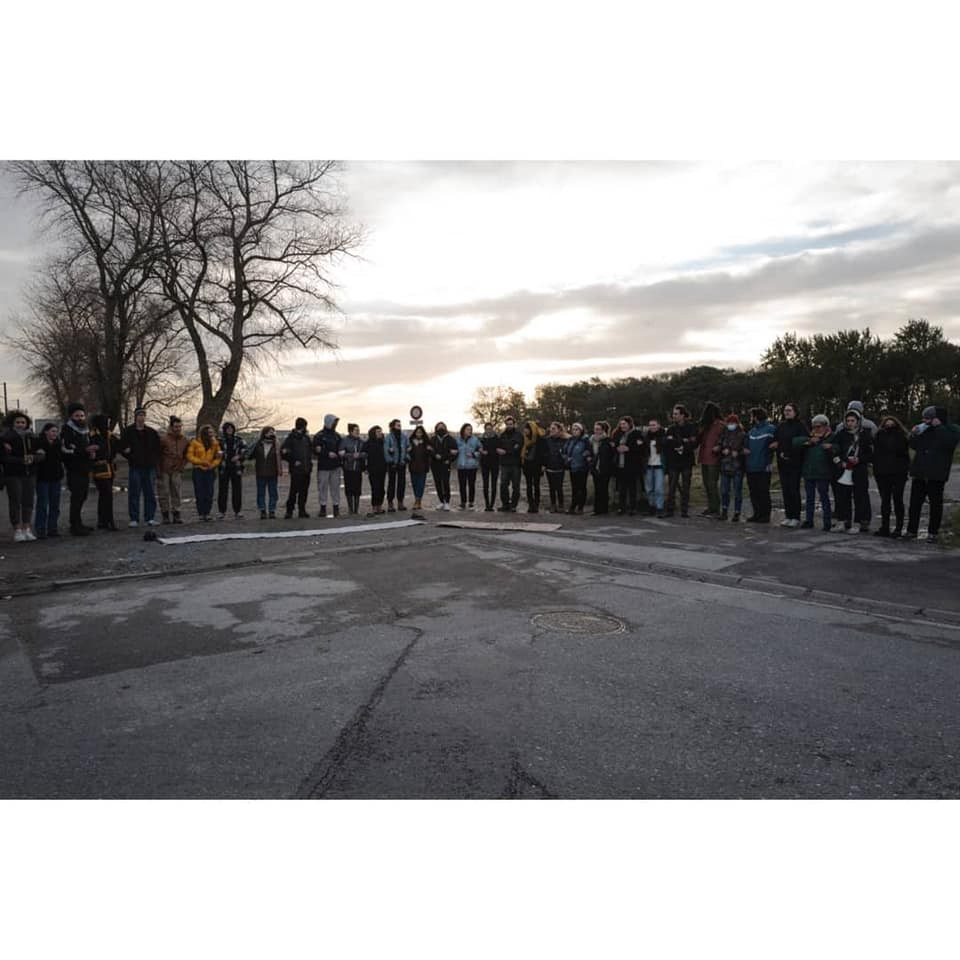

### AYS Weekend Digest 6–7/11/21: Activists and local church step in so that people would not die in the Alps
#### Report from the French\-Italian border // What is happening with UNHCR in Libya // Safe corridors provided consistently by the Italian community work better than any EU programme so far // UK border forces refuse pushbacks // & some good reads and recommended podcasts

](assets/8e0d8a7104c/0*oKpFZHegMWpGW-UA)

Photo: [Paris d’Exil](https://twitter.com/paris_dexil)
#### FEATURED

In Paris, the situation for homeless people on the move and asylum seekers is deteriorating\. Utopia team reports many having to spend nights out in the open, with very low temperatures that are only to worsen in the coming days\. \.

■■■■■■■■■■■■■■ 
> **[Utopia 56](https://twitter.com/Utopia_56) @ Twitter Says:** 

> > Paris, cette nuit : 92 personnes en famille avec enfants ont dormi à la rue. Nous leur avons donné des tentes. Au 4 novembre, en trêve hivernale, le 115 est saturé. L'État déleste aux associations la détresse de ces personnes alors que leur prise en charge relève de sa compétence https://t.co/0yVXa983Ql 

> **Tweeted at [2021-11-05 12:26:34](https://twitter.com/utopia_56/status/1456598816828833798).** 

■■■■■■■■■■■■■■ 

A group of volunteers spent Sunday morning trying to stop the eviction in Calais\. 
As soon as the CRS arrived, and without even talking to them, the forces started pushing the people away and pepper\-sprayed them\.

](assets/8e0d8a7104c/0*ug22GUUtAdhb6287)

Documented and here published with the permission of [Abdul Saboor](https://www.facebook.com/profile.php?id=100007864985647&__tn__=-UC*F)

In the meantime, the evictions and confiscations in the area continue\.

■■■■■■■■■■■■■■ 
> **[Human Rights Observers](https://twitter.com/HumanRightsObs) @ Twitter Says:** 

> > Mardi, 552 tentes ont été distribuées à Calais par 6 associations. Or, depuis le début de l’année, HRO a déjà observé la saisie d’au moins 5855 tentes et bâches par @[Prefet62](https://twitter.com/Prefet62) et @[gouvernementFR](https://twitter.com/gouvernementFR). Combien de temps l’absurdité de cette situation va-t-elle encore durer? @[GDarmanin](https://twitter.com/GDarmanin) https://t.co/b4EdsQo4v9 

> **Tweeted at [2021-11-05 13:01:09](https://twitter.com/humanrightsobs/status/1456607517216317446).** 

■■■■■■■■■■■■■■ 

Support to Calais is coming from different parts of the country\.

■■■■■■■■■■■■■■ 
> **[Thé & Café pour les Réfugiés](https://twitter.com/TheCafeRefugies) @ Twitter Says:** 

> > Coups, lacrymos, effets personnel volés, stop!❌ Soutien aux grévistes de la faim de #Calais #faimauxfrontieres #lesfrontierestuent Solidarité avec les exilés Paris, 6 nov 21. La suite ➜ [facebook.com/archipeldeslut…](https://www.facebook.com/archipeldesluttes31M)  @[SolidaritWilso1](https://twitter.com/SolidaritWilso1) @[paris_dexil](https://twitter.com/paris_dexil) @[LdhFedeparis](https://twitter.com/LdhFedeparis)  @[lacimade](https://twitter.com/lacimade) @[Utopia_56](https://twitter.com/Utopia_56) https://t.co/CnLVprlB1F 

> **Tweeted at [2021-11-07 14:57:45](https://twitter.com/thecaferefugies/status/1457361637627908099).** 

■■■■■■■■■■■■■■ 

**_The French\-Italian border continues to be the scene of ever greater inequalities between exiled people and Europeans\._**

While nearly 50 people cross this border every day, in the hope of being able to apply for asylum, sometimes in other European countries, the French state continues its methodical work of confining undocumented people and putting them in a precarious situation\.

Every year for the past 5 years, the repressive arsenal has continued to increase\. The activists say in their recent press release, “making the conditions of passage more and more dangerous\. Some local bus routes have been modified, making the crossing more complex\. Social or health services are forbidden to carry out their functions and logistical support for migrating people is largely hindered\. Raids are on the increase not only around Briancon but throughout France\.”

This state persecution of people who have been travelling, in some cases, for several years in extremely difficult conditions has led to numerous tensions and difficulties both in Italy and in France\.

> By meticulously preventing people from moving freely, the prefecture is fuelling tensions that are being used to legitimise a racist and xenophobic discourse\. 

In this extremely tense context, the Briançon solidarity shelter have temporarily stopped the reception they can offer \(from October 24\), due to a lack of security and dignity for the people welcomed there\. The state reacted with more repression\.

Many people continue to try their luck on these paths\. The hunting down of people in the high mountains, once again reinforced by increasingly sophisticated human and technological resources, will inevitably contribute to people taking even more risks\.

A group of self\-organised people acting in solidarity alongside the collectives and associations of the Briançon region are launching an urgent appeal in order to **mobilise activists as soon as possible to** :
- Continue to organise emergency solidarity on the basic needs of newly arrived migrants in Briançon, inform these people, be present in the face of the lack of respect of their rights by the police\.
- Organise day and night standby services, with a view to the next reopening of the solidarity shelter \(and/or a second emergency security\) of the people received, various logistics and links with the links with the mountain outreach teams\.
- Everywhere on the territory, welcome, inform and support undocumented people\.
- A demonstration will take place in Briançon on 13 November 2021, meeting at 2pm in front of the media library\.

> All your skills and motivation are welcome\! Our energy is not infinite and we need support\! — bribrihelp@riseup\.net 

■■■■■■■■■■■■■■ 
> **[nos montagnes ne deviendront pas un cimetière](https://twitter.com/nos_pas) @ Twitter Says:** 

> > Briancon solidaire avec Calais
Partout aux frontières les droits sont bafoués
Résistance et solidarité
#FaimAuxFrontieres https://t.co/7q905Od96P 

> **Tweeted at [2021-11-06 16:58:51](https://twitter.com/nos_pas/status/1457029725159837700).** 

■■■■■■■■■■■■■■ 

#### CYPRUS
### France pushing Cyprus into fast\-forwarding people back to Africa

France has agreed to “help initiate talks” between Cyprus and French\-speaking African countries in order for them to take back their citizens whose asylum applications have been rejected, the Cypriot interior minister said\. Cyprus says it has the highest number of first\-time asylum applications among all 27 EU members relative to its population of 1\.1 million\. According to officials, the reception system has reached a breaking point\. The Cypriot government claims that Turkey systematically forwards asylum\-seekers to the island’s Turkish Cypriot north so that they pressure the country, media [reported](https://apnews.com/article/immigration-middle-east-france-europe-migration-05633acfc4a8bb00f90a0844724be954?fbclid=IwAR24RCafy5ZYAPkUpC5TXf4KwV5gwJjpv8gbIn754yrWlk2zHsOiJ2BE5qY) \.
#### LIBYA

> The refugees organized peaceful demonstrations in front of the UNHCR office, but the sad thing is that they were beaten by the security forces at the UNHCR door, and the employees stand looking, _according to one of the [reports](https://twitter.com/Tomosman14/status/1457255160858697730?fbclid=IwAR1HyoqFf3SyZKM3qIZHe8uU7oyX4Puamx6157hYd1-R3mq7dS5tpIKFDGQ) \._ 

■■■■■■■■■■■■■■ 
> **[Refugees In Libya](https://twitter.com/RefugeesinLibya) @ Twitter Says:** 

> > @[UNHCRLibya](https://twitter.com/UNHCRLibya) this morning 7 Nov allowed its militias to beat and wound peaceful demonstrators at the main office in seraj.
@[hrw](https://twitter.com/hrw) @[JFCrisp](https://twitter.com/JFCrisp) @[Refugees](https://twitter.com/Refugees) @[KitchaFitFit1](https://twitter.com/KitchaFitFit1) @chaosnaybehaqi @[GiuliaRastajuly](https://twitter.com/GiuliaRastajuly) @[saracreta](https://twitter.com/saracreta)
#Evacuate[Refugees](https://twitter.com/Refugees)FromLibya https://t.co/aRH3csyYrS 

> **Tweeted at [2021-11-07 07:45:54](https://twitter.com/refugeesinlibya/status/1457252959058792451).** 

■■■■■■■■■■■■■■ 

#### THE MED

The Sea 4 was finally allowed to sail to Trapani to bring the more than 800 rescued people to safety\.
#### GREECE

Reportedly on Crete, a man who learned his family was killed by the Taliban took his own life —

> He had just turned 20\. He had found a shepherd’s place in the village of Asites, halfway between Héraklion and Mirès, not far from our home, in the center of Crete\. He was a lovely, highly appreciated, brave and open young man\. He had recently filed an asylum application in hopes of helping his family join him\. Everything seemed to be going well\. 

> But a terrible news came to sweep: he learned that his whole family had just been massacred by the Taliban in his home country\. It all fell apart \. Nothing really matters anymore\. He went missing for a few hours and was finally found hanging in the shepherd by the young girl from the family where he lived and worked\. 

#### ITALY
### Community sponsorship in Italy resettles more Afghan refugees than many EU Member States

As [Tihomir Sabchev](https://twitter.com/TihomirSabchev) noted, the community efforts of Italians have reached much higher standards than all the \(overpaid\) deals the EU and international organisations have so far placed on the table\.

1,200 Afghans who fled the Taliban regime will be welcomed into Italy through humanitarian corridors\. The Ministry of the Interior will take care of the flights for all and the reception of 400 people\. The churches and civil society will take care of the others: 300 refugees will be taken care of by the Italian Bishops’ Conference, 200 by the Community of Sant’Egidio, 200 by the Evangelical churches, 100 by the ARCI\. The agreement lasts for two years, extendable to three\. The first group of Afghans is expected in early 2022, it is [reported](https://www.avvenire.it/attualita/pagine/corridoi-umanitari-accordo-tra-chiese-ong-e-viminale-per-accogliere-1-200-profughi-afgani?fbclid=IwAR1HMZnTWUrZBJGXricnddBxnfIyo9INA7A5pz1h7JuMcOAooKUbbl5qv8Q) \.
#### BELARUS

Grupa Granica has appealed to the domestic and international institutions to monitor the escalating border crisis, send independent monitors and exert pressure on the Polish government to immediately send humanitarian and medical aid to the Polish\-Belarusian border\.

■■■■■■■■■■■■■■ 
> **[Grupa Granica](https://twitter.com/GrupaGranica) @ Twitter Says:** 

> > English version of the appeal: https://t.co/FCtLmmFyqT 

> **Tweeted at [2021-11-07 18:53:53](https://twitter.com/grupagranica/status/1457421063369986051).** 

■■■■■■■■■■■■■■ 

It is reported that many people moved from Minsk to the Kuznica\-Bruzgi crossing to try and cross the border, although some families and other groups have been asking for help to go back to Minsk, and even further, but are unable to do so from the fenced off areas\.

Belarusian forces have in the past pointed their guns in the air and fired blanks when they have encountered Polish soldiers or guards and have destroyed a razor wire barrier at the border or encouraged migrants to do so\.

[](https://l.facebook.com/l.php?u=https%3A%2F%2Fwww.dw.com%2Fen%2Fpoland-summons-belarus-envoy-over-armed-border-incursion%2Fa-59708702%3Ffbclid%3DIwAR296WCZZkSCJPoyav5oQOnlkcgBiaX4JpMm48DI3vmYUqyM7aohHh5k7VM&h=AT2eTA6tSqnB0J07ib3qyabu9jZeI9HoV7Pfm9G4K6sk3zKqICtJ-a34vxpUUoaFsLJ9bejTF5v0YHFlaJ7LfABoq4v9mplyMuDyhnD0U2NYXUhz6WwgAqIuvAEFaF2J0wfhHKZh9_I4VQ&__tn__=R]-R&c[0]=AT2WbsWQq4kdqS7dDHQOt1vlVyUgEzD2SG29EJxEBCgkSlld6nuQIJ3FXB6iBuLdJ445RbyMLn0gQX4blmwkgrC8xaVga_yQl057O2vb9lYs73Qw_j4SRCcR573R2LNmVPFocZgtjuxyVZVz1zIILhw-puH7mhSSMWCvbz-0rHN_Gv9xVRxM1n3xiMqekXdKrAQs_LRAJXDm)

All the while people send out calls for help from the areas around the border nobody can penetrate to provide help\. The Polish minister proudly presents their answer to the situation — more border walls and fences:

■■■■■■■■■■■■■■ 
> **[Maciej Wąsik 🇵🇱](https://twitter.com/WasikMaciej) @ Twitter Says:** 

> > A zapora na granicy wschodniej będzie wyglądała tak: https://t.co/76gBAwCWnX 

> **Tweeted at [2021-11-04 12:12:34](https://twitter.com/wasikmaciej/status/1456232904581910528).** 

■■■■■■■■■■■■■■ 

A protest was to take place in Vilnius against the Lithuanian government’s policy towards migrants\. The organisers claim that the actions of the Lithuanian government violate international human rights agreements\. The initiative was supported by 27 Lithuanian NGOs\.
#### UK
### UK border force refuses to go further with Priti Patel’s pushback plan

> “Safety at sea is paramount and we’re not permitted to attempt a pushback against a boat that is legally defined as vulnerable\. The smaller a vessel the more likely it is to be ‘vulnerable’\. We can’t turn back a vessel that’s going to be in trouble\. We can’t turn back a vessel unless the French are there to receive it\. And they’ve been clear… they won’t co\-operate with this policy as they don’t see this as legal\.” 

[Here](https://www.thetimes.co.uk/article/border-force-refusing-to-turn-back-migrant-boats-8mv9mbjqw?fbclid=IwAR0_mQRgOByC1rBGhyWCH7H6xILw4kONIhX64Tojft2FnyS7tv69dMRaXhI) is more on the story\.
#### WORTH READING
- Counter\-terrorism measures as a migration control device — Insights from Italy

- Szymon Opryszek set out on a lone journey along the trail taken by thousands of refugees arriving at the Polish\-Belarusian border:

[](https://l.facebook.com/l.php?u=https%3A%2F%2Foko.press%2Fistanbul-a-smuggler-assures-me-its-100-guaranteed%2F%3Ffbclid%3DIwAR2mpOjUcmRSVj_G-ja7jrpKaQRhd4DuA60AuP_dayzi_oaaqalRZf6fxvs&h=AT3Xcyw-5zhltouAgDhGP4ZyTHgSkKpXYrVXR9Kw4KBNwL1CQ5fYvpPCTLZFAnog5h4evlFpzcorV5YZrEWvKn8Dh3j2LL4WVRZ92Knc2qqYzYm0P0SGt48VPDad2RepcoFbruojgSblgg&__tn__=R]-R&c[0]=AT2WbsWQq4kdqS7dDHQOt1vlVyUgEzD2SG29EJxEBCgkSlld6nuQIJ3FXB6iBuLdJ445RbyMLn0gQX4blmwkgrC8xaVga_yQl057O2vb9lYs73Qw_j4SRCcR573R2LNmVPFocZgtjuxyVZVz1zIILhw-puH7mhSSMWCvbz-0rHN_Gv9xVRxM1n3xiMqekXdKrAQs_LRAJXDm)

- RV stories connects you with people who have found the courage to share their transformational journeys, both physical and emotional\. By listening to their life stories, you will learn how our guests overcame their vulnerabilities and shifted their beliefs on what they can achieve:

**Find daily updates and special reports on our [Medium page](https://medium.com/are-you-syrious) \.**

**If you wish to contribute, either by writing a report or a story, or by joining the info gathering team, please let us know\.**

**We strive to echo correct news from the ground through collaboration and fairness\. Every effort has been made to credit organisations and individuals with regard to the supply of information, video, and photo material \(in cases where the source wanted to be accredited\) \. Please notify us regarding corrections\.**

**If there’s anything you want to share or comment, contact us through Facebook, Twitter or write to: areyousyrious@gmail\.com**

_Converted [Medium Post](https://medium.com/are-you-syrious/ays-weekend-digest-6-7-11-21-activists-and-local-church-step-in-so-that-people-would-not-die-in-8e0d8a7104c) by [ZMediumToMarkdown](https://github.com/ZhgChgLi/ZMediumToMarkdown)._
