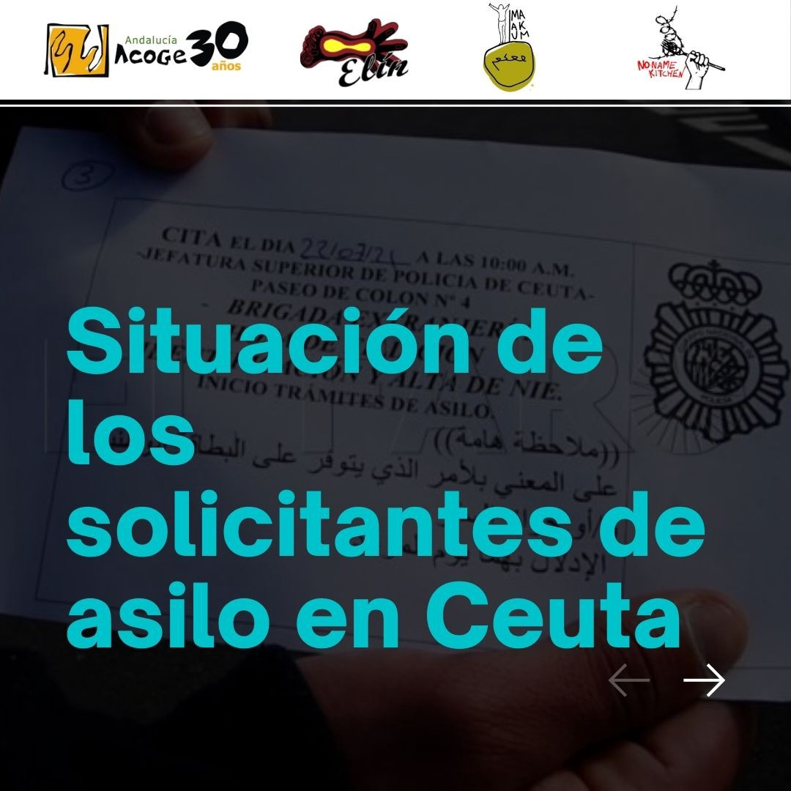

### AYS News Digest 08/11/21: People used as weapons between the EU and Belarus
#### Developments from the Belarus border / news from Greece / arrivals by sea / Indignation in Italy / Deportations and detention remain a common practice in Bulgaria / News from Spain / Donations needed in Slovenia / recommended reads & more

](assets/6f6515e33376/0*GltOexizfr9FiJPL)

Copenhagen, via [Radical Graffiti](https://twitter.com/GraffitiRadical)
#### FEATURE: EU once again puts border enforcement over people's lives as the situation along the Polish border intensifies

The situation at the Belarusian\-Polish border escalated\. Hundreds of people are trapped between fences and servicemen with no support system and at freezing temperatures\. They are prevented from Polish servicemen from entering Poland and applying for asylum in the EU, while Belarusian servicemen prevent them from going back\. The situation shows similarities with the situation at the Greek\-Turkish border in March 2020, where at least two people lost their lives due to gunfire from the Greek side\. In Poland, at least nine people lost their lives due to cold and exhaustion in the past weeks along the Polish border so far\. How much more will it be? Will border guards of an EU country eventually use their weapons on fleeing people, because borders are once again more important than people?

The journalist Tadeuz Giczan followed Monday’s unfolding events closely\. In the morning, hundreds of people walked towards the Kuznica\-Bruzgi border crossing\. Apparently, they first tried to reach the official border crossing, but Belarusian servicemen forced them into the woods along the border\. While some media spread the misinformation that the group entered into Poland, in fact, according to the journalist, the people group was trapped in between two border fences\.

■■■■■■■■■■■■■■ 
> **[Tadeusz Giczan](https://twitter.com/TadeuszGiczan) @ Twitter Says:** 

> > Sputnik’s picture was taken at the second line of fences some 500 metres from the actual border (red circle). Right now the group is located between the two border fences (blue circle). Migrants are effectively trapped, there’s little chance Belarus would allow them to return. https://t.co/tSObV3Ax0s 

> **Tweeted at [2021-11-08 11:11:05](https://twitter.com/tadeuszgiczan/status/1457666984779427840).** 

■■■■■■■■■■■■■■ 

While Belarusian soldiers threatened people by shooting in the air when they tried to go back, Polish police used teargas on those who tried to get close to the fence\. Videos show heavily armed servicemen on both sides\. Some people from the group tried to demolish the barbed wire fence by using trees\. In one video, a person can be seen using pliers to dismantle the fence\. At one point, Polish servicemen were forming a human shield to prevent people from entering into the country\. At the same time, a helicopter was deployed, flying very low, presumably in an attempt to scare people\.

■■■■■■■■■■■■■■ 
> **[Tadeusz Giczan](https://twitter.com/TadeuszGiczan) @ Twitter Says:** 

> > A section of the barbed wire fence has been removed. Polish servicemen formed a human shield to cover the hole and are trying to scare migrants off with a helicopter. The crowd is chanting “Germany!” https://t.co/P99Yd9SRdO 

> **Tweeted at [2021-11-08 12:43:02](https://twitter.com/tadeuszgiczan/status/1457690124297326592).** 

■■■■■■■■■■■■■■ 

As the night set and the situation was unchanged, the People on the Move did what they could to prepare for a night in nowhere land, at the EU's door sill\. They lit fires, some brought tents, but most will spend the night outside, amongst them small children\.

As for now, no first aid or humanitarian relief is provided for those at the border\. And even those who make it into Poland without being pushed back still have to manage to leave the emergency zone along the border, in which solidarity activists as well as journalists are still forbidden access\. While a lot of misinformation is spread by Lukashenko, the EU is no better in framing the trapped people as a thread\. No solution has been brought up so far\.

The Polish Minister of Interior framed the events at the border as a “regular battle”, in which the borders are defended against an attack\.

■■■■■■■■■■■■■■ 
> **[kapturak](https://twitter.com/kapturak) @ Twitter Says:** 

> > Das polnische Innenministerium berichtet von einer regelrechten Schlacht, die derzeit an der Grenze zu Belarus bei Kuźnica stattfinde.
Eine grausame Rhetorik, die flüchtende Menschen zu Feinden und Bedrohung erklärt, ohne einen Schimmer von humanitärer Sorge um die Verzweifelten. https://t.co/ZLs3MqLj2H 

> **Tweeted at [2021-11-08 15:11:26](https://twitter.com/kapturak/status/1457727467213438976).** 

■■■■■■■■■■■■■■ 

In a shameful statement, President of the EU Commission Ursula von der Leyen said:

> “the instrumentalisation of migrants for political purposes by Belarus is unacceptable” 

She called on EU states to implement stronger sanctions against Belarus\. With no word does she mention the fact that people have a right to apply for asylum, which is systematically breached by Poland and in complete complicity of the EU Commission\.

■■■■■■■■■■■■■■ 
> **[Ursula von der Leyen](https://twitter.com/vonderleyen) @ Twitter Says:** 

> > Belarus must stop putting people’s lives at risk.

I spoke to @[MorawieckiM](https://twitter.com/MorawieckiM) @[IngridaSimonyte](https://twitter.com/IngridaSimonyte) @[krisjaniskarins](https://twitter.com/krisjaniskarins) 
 
I call for approval of extended sanctions, possible sanctions on third country airlines involved.

We also want to prevent a humanitarian crisis and ensure safe returns 

> **Tweeted at [2021-11-08 18:49:01](https://twitter.com/vonderleyen/status/1457782225966014466).** 

■■■■■■■■■■■■■■ 

Home Affair Commissionor Ylva Johannson published a similar debunking statement in which she called people “supply” and made clear her priority is so\-called “protection of the integrity of our shared external borders” instead of the protection of the integrity of people who try to apply for asylum\.

■■■■■■■■■■■■■■ 
> **[Ylva Johansson](https://twitter.com/YlvaJohansson) @ Twitter Says:** 

> > 3/3
…Our urgent priority is to turn off the supply coming into Minsk airport.

While we step up outreach with partner countries, I will continue to prioritise the protection of the integrity of our shared external borders. 

> **Tweeted at [2021-11-08 19:24:57](https://twitter.com/ylvajohansson/status/1457791267480342528).** 

■■■■■■■■■■■■■■ 

The framing used by the EU once again obscures the fact that without the EU taking part in this cynical game, Belarus wouldn’t be able to instrumentalize People on the Move\. It’s quite easy: If Lukashenko wants to use people as weapons, the EU still has a choice to allow him to do so or not\. People are no weapon\. You have to believe they are, in order to be threatened\. The EU could just regard them as what they are, as people, and provide them with save option to entering Europe and apply for asylum\. There wouldn’t be any weaponizing and instrumentalizing to call out\. It needs two bullies to use people as weapons\. The EU Commission is one of them\.
#### LIBYA

■■■■■■■■■■■■■■ 
> **[IOM Libya](https://twitter.com/IOM_Libya) @ Twitter Says:** 

> > In the period of 31 October - 6 November, 1,085 migrants were rescued/intercepted at sea and returned to Libya.

👇IOM Libya's Maritime Update👇 https://t.co/48u1Sfo8N8 

> **Tweeted at [2021-11-08 15:08:28](https://twitter.com/iom_libya/status/1457726723496218644).** 

■■■■■■■■■■■■■■ 

#### GREECE
### Politics of criminalization next level

Beside Sarah, Nassos and Sean, who are awaiting their trial in which they are accused of espionage and facilitating illegal entry for taking part in search and rescue activities on Lesvos, more people are becoming subjects to Greeks deteriorating legal system\. On Samos, N\., a young father, is charged with the drowning of his 6\-year\-old son during a shipwreck\. He will be on trial together with his co\-passenger Hasan who is facing life imprisonment for steering the boat — a common practice at Europe’s external borders\.

On the night of 7 November 2020, N\. and Hasan tried to reach Greece from Turkey on a rubber boat together with 22 other people\. Amongst the passengers were N\.’s 6\-year\-old son and the sister, brother and disabled mother of Hasan\. In a shipwreck off Samos, the young boy lost his life, while the Hellenic Coast Guard was unwilling to undertake rescue efforts\. Now, in an unprecedented manner, the father N\. is charged with endangering the life of this son — because he wanted him to live a life in security\. Hasan in turn is not the first person to be on trial for steering a boat **\.** He is facing a life sentence for the death of one person plus a further 10 years imprisonment per transported person, amounting to 230 years plus life imprisonment\. Their trial will start in May 2022\.

[This report provides insights](https://www.borderline-europe.de/unsere-arbeit/stigmatisiert-inhaftiert-kriminalisiert-der-kampf-gegen-vermeintliche-schleuser-auf?l=en) into the practice of accusing people on boats as smugglers and sentencing them with immense imprisonment\.

[Follow the campaign Free the \#SamosTwo](https://freethesamostwo.com/?fbclid=IwAR03jQiwW5Wzb9WkPXSwpBvZ1I3Hkqr5GNWPWUl0rrEv1cQX5NQZLQ_mRdI) \.

■■■■■■■■■■■■■■ 
> **[Sea-Watch International](https://twitter.com/seawatch_intl) @ Twitter Says:** 

> > Free the #Samos2! Today marks the 1-year anniversary of a shipwreck close to #Samos during which N. lost his child. He is now facing trial for "endangering the life of his child", together with Hasan, who is facing 230 years for "smuggling“ bc he steered the boat at some point. https://t.co/WDGkORoYKy 

> **Tweeted at [2021-11-08 10:35:24](https://twitter.com/seawatch_intl/status/1457658002589290498).** 

■■■■■■■■■■■■■■ 

And another case of criminalizing humanitarian activists is in the media these days\. On November 18th, 22 people how are accused of spying, money laundering, membership of a criminal organisation and working with traffickers to smuggle people into the country will face trial\. All of them were active in rescue efforts and saved the lives of many\. [Amongst them is a 73 old man from Denmark, who faces 10–25 years in jail\.](https://www.dutchnews.nl/news/2021/11/refugee-worker-from-drenthe-to-fight-charges-of-human-trafficking-in-greece/?fbclid=IwAR2FBoL39C6dqYwAh5Rx7uyvMPrvX8SvkyYVHF73ElR_sObPnOgRqqLfiTg)
### Fears of Pushbacks from Islands

Various sources reported about the arrival of groups to Samos and Chios\. Pictures of their presence have been published on Social Media\. At least for some of the people who arrived to Samos, chances are high they became victims of yet another pushback by Greek authorities\. One witness said many of the group were arrested and rounded up at a beach\. From the arrivals to Chios, 10 so far managed to reach the quarantine camp and register there\. The whereabouts of the rest are unknown\.
### Footage from a Camp

Young journalist, writer and Woman on the Move Parwana Amiri published a video showing the sanitary situation in Malakasa camp:

■■■■■■■■■■■■■■ 
> **[Parwana Amiri پروانه اميري](https://twitter.com/parwana_amiri) @ Twitter Says:** 

> > #Malakasa2
Sent by one of the residents, in hope to reach people and authorities says “Here is the condition of the bathrooms, even doesn’t have shower or curtain, the toilets without light and no journalist or human’s right activist is able to enter”
#ChangeSystemEU https://t.co/Z5zSLezIMH 

> **Tweeted at [2021-11-08 08:13:12](https://twitter.com/parwana_amiri/status/1457622216816857090).** 

■■■■■■■■■■■■■■ 

### Information on Residence Permits

According to an announcement by the Greek Ministry for Migration and Asylum, people those residence permits expire by the end of the year should submit an application for renewal by the end of November\.

■■■■■■■■■■■■■■ 
> **[Migration Greece Info](https://twitter.com/MigrationGrInfo) @ Twitter Says:** 

> > 📌Important Announcement for Residence Permits (ADET) 
Beneficiaries of International Protection whose Residence Permit (ADET) expires by December 31st  2021, please submit an application for renewal by November 30th 2021.
Learn more here [bit.ly/2Yp3DaY](https://bit.ly/2Yp3DaY)
#migrationgovgr https://t.co/48zTDZwnq4 

> **Tweeted at [2021-11-08 17:18:45](https://twitter.com/migrationgrinfo/status/1457759509405970433).** 

■■■■■■■■■■■■■■ 

### Anonymous graveyards at the Greek\-Turkish border for victims of the EU border regime

The border between Greece and Turkey kills silently and without public attention:

■■■■■■■■■■■■■■ 
> **[Petra Molnar](https://twitter.com/_PMolnar) @ Twitter Says:** 

> > Borders kill.

Near the Turkish border in northern Greece, outside a small village lies a cemetery of mostly unmarked graves. A resting place for those who died making the journey to Europe. Most recent tombstone from Feb ‘21 honours a young Afghan woman.

Three open graves await https://t.co/LTEsJgeaaX 

> **Tweeted at [2021-11-08 15:24:31](https://twitter.com/_pmolnar/status/1457730760186777602).** 

■■■■■■■■■■■■■■ 

■■■■■■■■■■■■■■ 
> **[Natalie Gruber](https://twitter.com/NatalieSGruber) @ Twitter Says:** 

> > @[_PMolnar](https://twitter.com/_PMolnar) @[RefugeeLawLab](https://twitter.com/RefugeeLawLab) @[migration_tech](https://twitter.com/migration_tech) @[lydiaemman](https://twitter.com/lydiaemman) @[kenyajade](https://twitter.com/kenyajade) On the Turkish side, we identified one person who died early September and visited his grave to write his name on it. Since then, several more had been buried, anonymously. https://t.co/xQvQ14qfIn 

> **Tweeted at [2021-11-08 15:30:18](https://twitter.com/nataliesgruber/status/1457732216579141644).** 

■■■■■■■■■■■■■■ 

#### BULGARIA
### Detention, deportation and pushbacks continue

1626 people were detained in Bulgaria in September this year, according published statistics from the Ministry of Interior of Bulgaria\. By the end of September the number of detainees was 999\. Within the period of January\-September 2021, a total of 6,560 people were detained\. Most of the detained people are of Afghan nationality\.

> By the end of October 2021, a delegation from the UN Subcommittee on Prevention of Torture \(SPT\) carried out its visit to Bulgaria \(24\- 30 October\) \. The SPT said that it is „ [particularly concerned about child migrants held in detention\. Some of them are unaccompanied by their parents, they are the most vulnerable group and live under very difficult conditions\.](https://www.ohchr.org/EN/NewsEvents/Pages/DisplayNews.aspx?NewsID=27771&LangID=E) “ The delegation stressed out that a high number of asylum seekers is detained in Bulgaria and that they „should be promptly and fully informed“ about what is happening to them\. 

Meanwhile the push\-backs seem to go on, the Bularian border monitoring group [reports in more detail](https://bulgaria.bordermonitoring.eu/2021/11/08/numbers-of-refugees-in-jail-is-increasing/?fbclid=IwAR3apEC8IDylpmRMtE9ucnecpwo4bL3ffDzWNKbYLOiDh6diMH40G5VHxlA) \.
#### SLOVENIA

Call for donations\! Our warehouses are emptying\! We collect clean, whole and useful sportswear and footwear suitable for walking and keeping outdoors\. We will also be happy with sleeping bags, tents and pants belts\. Pick up by appointment\. — InfoKolpa
#### ITALY

847 people were rescued by the ship Sea Eye 4 of the Sea Eye, a vessel that landed at the port of Trapani, as we previously reported, were welcomed with applause upon their arrival, some of the [footage](https://www.ilfattoquotidiano.it/2021/11/08/migranti-larrivo-tra-gli-applausi-della-nave-ong-sea-eye-nel-porto-di-trapani-le-immagini/6383796/?fbclid=IwAR3wZnsA-5FQVkg8phKmw5vuMwAR-ul47aJyZajlxSp8pjSAfdIREcpssZM) shows\.
69 people were on board another vessel, of Pakistani, Syrian, Afghan and Somali nationality, all reportedly in good condition\. This was the fifth landing in 24 hours recorded in Salento where a total of 167 people arrived in a day\.

An academic at Turin Polytechnic University has denounced the institution’s work for EU border agency Frontex\. LasciateCIEntrare has called on individuals and institutions “not to legitimate the violent, repressive, expelling and racialising of the European Union”\.

[](https://l.facebook.com/l.php?u=https%3A%2F%2Fwww.statewatch.org%2Fnews%2F2021%2Fnovember%2Fnot-alongside-frontex-academics-speak-out-against-border-collaboration%2F%3Ffbclid%3DIwAR1xgROY3syUkIbsfXWNxWnxZmBC5fLbDfXV3CqKzweRrr8ShbRoAUELSb4&h=AT27WWZaZQbAA4w8nUMnn6n4JtvUewh6IlEn6V7UB_ysZzcI0vJX4W7OLXymlr-Veaai1YzKmPOfjIbSF1_2fhFmO6GnaoWO-SDhS0skTM1D7wiganho6jXx0yRyeARSTA&__tn__=%2CmH-R&c[0]=AT0WN6T5yW8YA34rQUBr8K7QrYZ3Qex7MzXYMJTvCxecpTBnJaGh5dsHQjx5ucC3GkWrFlcAedF0pdERdiBth0ksFXt_vCmup2LEfOfO7aBABhSbb_1XpRNxllWv_RQ8HzeMDDEBTJp0tGi5NXaj6hIRsWw8x1rMmME22CKbMaC8Ht_HlgDzPsEyEPK3vSTgGT30EENSGzU34e1uZN8)

#### SPAIN

■■■■■■■■■■■■■■ 
> **[Alarm Phone](https://twitter.com/alarm_phone) @ Twitter Says:** 

> > Spanish nationality denied to Saharawi activist lawyer Loueila Mint El Mamy "for lack of roots". This after being a resident of the #Canaries for 21 years. The Spanish government tries to silence those who speak out for migrant's rights. All our support &amp; affection to @[Lalailmo](https://twitter.com/Lalailmo) 

> **Tweeted at [2021-11-08 10:20:57](https://twitter.com/alarm_phone/status/1457654364596801537).** 

■■■■■■■■■■■■■■ 

Activists from NNK in Ceuta, together with the organisations on the ground Andalucia Acoge, Maakum and Elin, want to denounce the irregularities in the process for asylum application, made by the institutions\.

> We saw are many irregularities along the process to slow down or to stop the process for the asylum seekers in order to not let them leave Ceuta\. In the last few days, we have heard from applicants who have been blocked by the inaction and lack of coordination of the institutions, receiving constant, baseless and contradictory refusals from the national police\. 

The organisations on the ground demand:

\- Clarification of the reasons why asylum seekers are not being given copies of their files\.

\- That the blocking of asylum seekers’ files be notified and adequately justified\.

\- That the institutions respect the right of all asylum seekers to move freely within the Spanish state\.

\- That the asylum procedure is applied as established in national and international regulations\.

At the same time, the Provincial Prosecutor’s Office of Madrid has filed a complaint against María Isabel Peralta Medina, leader of the neo\-Nazi group Bastión Frontal, for a hate crime, media [reported](https://l.facebook.com/l.php?u=https%3A%2F%2Fwww.elsaltodiario.com%2Ffascismo%2Ffiscalia-denuncia-isabel-peralta-bastion-frontal-delitos-odio-personas%2520migrantesv%3Ffbclid%3DIwAR3szuz2Pzpnr7lFHHPK74XtfuLLb-j-CJkfLbHt_XNkTSy0Z7X8LuBb14g&h=AT3fvbB910vGT0YgvXfKQsjmJKpzLq_n2Sr0niom2UArXDKbn591FBOb_bKL8BkZVVGbiG9-NzCrO7oqXOskES3e9sfR4A45NwgzqXMl9_PBgWvyuzI3tBQT-Ftj81d4ZaS7glRuZrPeYg&__tn__=R]-R&c[0]=AT2canz7P2D_K7NNF7HlsjiHFZN3kkBcEyFwDJEpvI5fECiQktSk7P77vAOeLzS2fCaJESBEq7xzNAdxebX-RBQT_UgSMqI41B5ip1EW4OIlVVpmVGp2olDTQQYZj0dsUlFI1T5g_iRGLvIHQKcAm_Lpz5XQY0S42kTG3LWtmPyLT4NEXzcCeFaZdaxUZ56nBtE1BU13aHlqJNXFJ88) \.
#### GENERAL

ECRE has published a Policy Note that demonstrates that linking asylum and return procedures generates serious human rights concerns while failing to meet the objectives stated by the European Commission\. It draws on experience from national practice in Member States where the two procedures are combined\. The risk of combining these procedures is even more acute in border procedures due to the reduced safeguards for applicants\.

[](https://l.facebook.com/l.php?u=https%3A%2F%2Fecre.org%2Fecre-policy-note-a-seamless-link%2F%3Ffbclid%3DIwAR2kKL7GG8RdnZE5RPs9-Vjdy2KUkU_nfM6_R4rTNFKhxTIKXg3lKR1JgDk&h=AT1TSCUdvl4ugH345SQD9kbpigyMp--M8EKtmrysmjpyHojD-Xe6X3hm-Uz0ANd8z5s3NhggjZojdqKK9DbUsPovU2822npFEtZee1zZQcWok95TVQeNnTNVP5uMB0mO7A&__tn__=%2CmH-R&c[0]=AT33wgDQlINBcuvz0JdtKUxP4YDFUgPB32VKcNzP7Vc9MV2tXh77BG9SaK_UpI3OgIrkOBdEgHNzfu6JvNGiHZr9PH3A3CZWVkLcm7artJCbPE5KdpFnRtdjksTjcXGQRD1yiVByVwW_pa9rxxvcC4GQWo0AUWsbIRjyd4K5XAZB0vcL3_NtXCa39_wnUXWIBeUila2JQ_J7r3-IpTM)

#### WORTH READING & LISTENING

■■■■■■■■■■■■■■ 
> **[InfoMigrants](https://twitter.com/InfoMigrants) @ Twitter Says:** 

> > We are launching our first English podcast! 

Tales from the Border explores the barriers – political and physical – that migrants face as they try to reach Europe. 

First three episodes drop Nov 11. 

[soundcloud.com/infomigrants/s…](https://soundcloud.com/infomigrants/sets/tales-from-the-border)

[open.spotify.com/show/2QYv4ZqRU…](https://open.spotify.com/show/2QYv4ZqRUFxHdXSL5MTvsG)

[deezer.com/de/show/3129262](https://www.deezer.com/de/show/3129262) https://t.co/ssYjLfFIUh 

> **Tweeted at [2021-11-07 12:56:00](https://twitter.com/infomigrants/status/1457330997020839939).** 

■■■■■■■■■■■■■■ 

- Three years since the launch of the Global Compact on Refugees the international community has yet to deliver on its promise to better share responsibility for refugees, according to a new report by the IRC, DRC and NRC:

[](https://l.facebook.com/l.php?u=https%3A%2F%2Fwww.nrc.no%2Fnews%2F2021%2Fnovember%2Fngos-call-for-better-responsibility-sharing--three-years-after-the-global-compact-on-refugees%2F%3Ffbclid%3DIwAR2QFMR9_Fy_MDA8Kg6nVG7hA9b9oWTKscinf-HxE1JWuJ-6xsPPyKer6uA&h=AT34Eyh2XLOec4B1XkeJtu9IMjAOpWrrBqgcTUcrsPtJnN0mrweVEUoalPBwQNsTvtk6iR5flP3PR51gyjTl0vX8v5azOUaXYgBL2aBwETg7Bf5Ig02ghNtWEUxnf-9GVjEdxHg5sbm0ug&__tn__=R]-R&c[0]=AT33wgDQlINBcuvz0JdtKUxP4YDFUgPB32VKcNzP7Vc9MV2tXh77BG9SaK_UpI3OgIrkOBdEgHNzfu6JvNGiHZr9PH3A3CZWVkLcm7artJCbPE5KdpFnRtdjksTjcXGQRD1yiVByVwW_pa9rxxvcC4GQWo0AUWsbIRjyd4K5XAZB0vcL3_NtXCa39_wnUXWIBeUila2JQ_J7r3-IpTM)

- Refugee shelters in Germany took on prison\-like characteristics in many places during the COVID\-19 pandemic and developed into hotspots of dynamic infection events\. For many residents, the pandemic significantly worsened their already stressful living conditions\. The protest of the residents, however — despite repeated resistance to the lack of infection protection in various shelters — often received little public attention\.

[](https://l.facebook.com/l.php?u=https%3A%2F%2Fwww.rosalux.de%2Fen%2Fnews%2Fid%2F45305%3Fs%3D09%26fbclid%3DIwAR1xgROY3syUkIbsfXWNxWnxZmBC5fLbDfXV3CqKzweRrr8ShbRoAUELSb4&h=AT2YxJJVyFCCUAkmWaEdDJa74f92ENoyLWwC7bTH8Fk1KeoJ6gEGYVCeqvRSauZUVQftpllr7sWaLBWqFPICWoAEoNLZiaK7vjDOW4oX_L3idIyWYZj1Zo4kSl3UChXGWHh0LdJIfhdCMA&__tn__=R]-R&c[0]=AT1gu_oP5CsL502laZZ9rsunrnO9QDkqiCa9A5wdmHeBI61Opz7YGxtAAVtFYPauknYezq09lD6b-EGV-ErSZCgPz1syPY_r9ra9Q4vogHih8ni9LRD3yHLJstj_JXegKbkAIxgeYLAt2IqH7gmrETUx2k1uXlyXNkKnFs5FVLRbJKYAw8FuhhRfmLZE9ARcf4Cm9jOVnEp9EPc2MC8)

- another special report on Germany — Syrian war crimes on trial in Germany: Will justice be lost in translation?

**Find daily updates and special reports on our [Medium page](https://medium.com/are-you-syrious) \.**

**If you wish to contribute, either by writing a report or a story, or by joining the info gathering team, please let us know\.**

**We strive to echo correct news from the ground through collaboration and fairness\. Every effort has been made to credit organisations and individuals with regard to the supply of information, video, and photo material \(in cases where the source wanted to be accredited\) \. Please notify us regarding corrections\.**

**If there’s anything you want to share or comment, contact us through Facebook, Twitter or write to: areyousyrious@gmail\.com**

_Converted [Medium Post](https://medium.com/are-you-syrious/ays-news-digest-08-11-21-people-used-as-weapons-between-the-eu-and-belarus-6f6515e33376) by [ZMediumToMarkdown](https://github.com/ZhgChgLi/ZMediumToMarkdown)._
