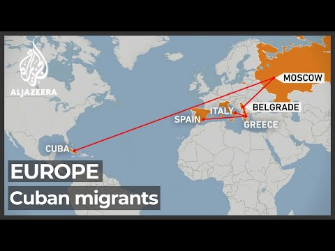
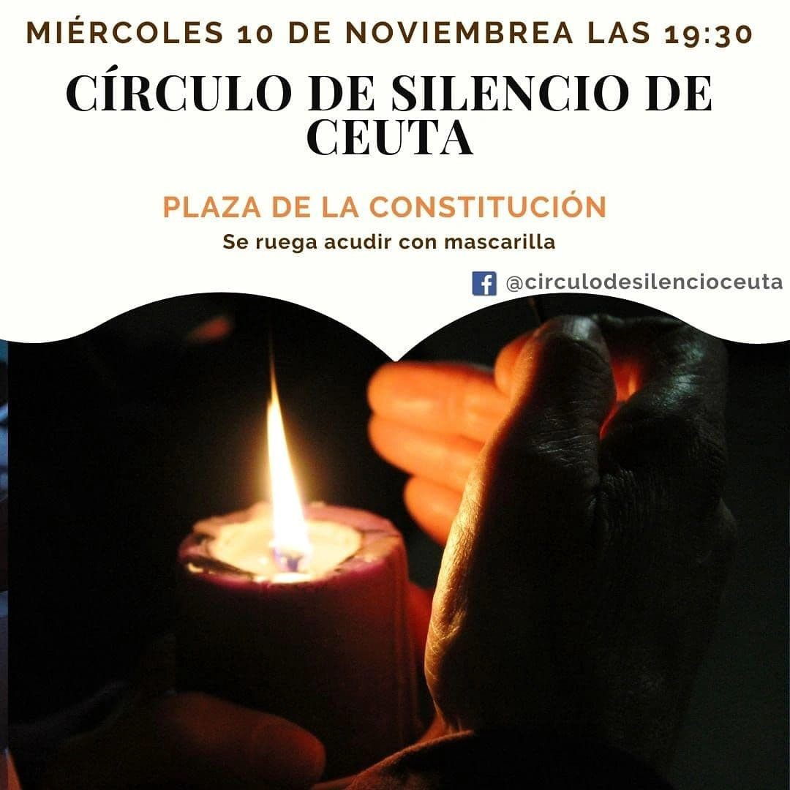
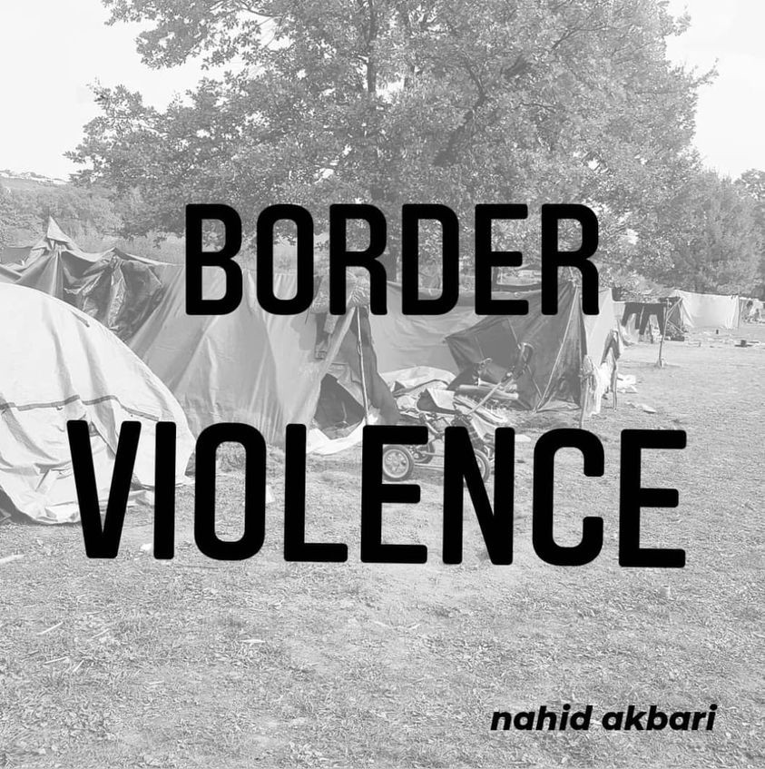

### AYS Daily Digest 9\-10/11/21 State of Emergency in Lithuania

14\-year\-old dies on the Belarus\-Poland border\. Greek PM loses it while questioned by Dutch journalist\. Deportation halted in Belgium\. Deportation planned of a mentally ill person from Germany\. Busy days on the Central Mediterranean\.

 \)](assets/6193b48fdc31/1*U4SeuVylmhujsuzmvnzUTg.jpeg)

“On the Polish/Belarusian border, people on the move are used as bargaining chips, as they have been used in Turkey and Morocco\.” \(Photo and text by: [E@SF](https://twitter.com/ESF16/status/1458169466668343309) \)
#### FEATURED — State of Emergency declared in Lithuania

Media [report](https://www.baltictimes.com/lithuania_declares_state_of_emergency_at_belarusian_border_as_of_midnight/) that Lithuanian parliament voted in favour \(122 to 1\) of the declaration of a state of emergency along the border with Belarus and five km inland, as well as in the migrant accommodation facilities in Kybartai, Medininkai, Pabrade, Rukla and Vilnius\. The state of emergency will last for one month starting Wednesday, 10 November\. New measures are introduced:

> \- the movement of vehicles in the border area without border guards’ permission will be restricted, 
 

> \- entry into this territory will be banned, except for local residents having necessary evidence,
 

> \- authorities will have the right to check vehicles and persons, their belongings,
 

> \- gatherings will be banned,
 

> \- people on the move who are accommodated in the country’s reception facilities will see their right to communicate in writing or by telephone restricted, except for the possibility to contact authorities\. 

Moreover the state of emergency [allows](https://twitter.com/DunyaCollective/status/1458461444383682562) border guards to use “mental coercion” and “proportionate physical violence” to prevent people on the move from crossing the border, i\.e\. carrying out push\-backs, as it has already been admitted by Lithuanian border guards, or in the euphemism of the country’s Foreign Minister, “ [re\-routing](https://twitter.com/ACatInParis/status/1458234983957532674) ” people…

In the blame game between Eastern EU border countries and Belarus, people on the move are those who constantly lose\. The Lithuanian foreign minister admitted to planning to use aggressive border measures against people who — [in his words](https://twitter.com/ACatInParis/status/1458234983957532674) — are chased with dogs by Belarusian authorities to push them to cross the border\.

Read more on this from Statewatch:
- [**EU: The ‘weaponised migration’ discourse dehumanises asylum\-seekers**](https://www.statewatch.org/news/2021/november/eu-the-weaponised-migration-discourse-dehumanises-asylum-seekers/) — _Following the arrival of a substantial number of people in Poland and Lithuania after having crossed the border from Belarus, the EU and its member states have accused the regime of Alexander Lukashenko of “weaponising migration” — a discourse that legitimises the treatment of asylum\-seekers “as other than human”\._

#### One more death at the border

According to [local reports](https://oko.press/14-letni-kurd-zmarl-z-wyziebienia-pod-kuznica-wiadomosc-z-obozu-migrantow/) , a 14\-year\-old died of hypothermia in the large makeshift camp on the Belarusian side of the border with Poland, near Kuźnica\. Belarusian authorities took the body to the local hospital\.
#### Updates from Poland

[Medycy Na Granicy](https://twitter.com/medycynagranicy) , Medics at the Border, [found](https://twitter.com/medycynagranicy/status/1458065486336471043) armed people in uniform around one of their ambulance, after returning from a rescue operation\. The tyres were slashed open and deflated\. “The men walked away when they saw us\. Their car registration began with ‘UA’ — these are plates used by the Polish Army\.”

Read two reports on the situation at the border by OKO\.press:
- [**“The border is inferno — hell\. The river of death that the masses of people flow”\[Interview\]**](https://oko.press/granica_to_pieklo/)
- [**The guard lies in my eyes: “There was no such person with us\.” She has disappeared\. Understand? Disappeared\!**](https://oko.press/straznik-mi-klamie-oczy-takiej-osoby-u-nas-nie-bylo-zostala-zniknieta-rozumiesz-zniknieta/)

SEA

■■■■■■■■■■■■■■ 
> **[IOM Libya](https://twitter.com/IOM_Libya) @ Twitter Says:** 

> > In the period of 31 October - 6 November, 1,085 migrants were rescued/intercepted at sea and returned to Libya.

👇IOM Libya's Maritime Update👇 https://t.co/48u1Sfo8N8 

> **Tweeted at [2021-11-08 15:08:28](https://twitter.com/iom_libya/status/1457726723496218644).** 

■■■■■■■■■■■■■■ 

#### Safe Harbour Found

Italian maritime authorities have informed Ocean Viking that the 306 survivors can disembark in Augusta, Sicily\.

> A severe storm is expected again tonight\. We call on States to set up a disembarkation mechanism to avoid these repeated standoffs\. — _@SOSMedIntl_ 

■■■■■■■■■■■■■■ 
> **[SOS MEDITERRANEE](https://twitter.com/SOSMedIntl) @ Twitter Says:** 

> > 🔴 306 people forced to spend another night on #OceanViking, in a storm with 2-m waves washing over the deck.

Soaked blankets, plastic survival bags running out, survivors shivering in the cold. Weather conditions remain harsh this morning.

A Place of Safety is urgently needed. https://t.co/deb44SWfiL 

> **Tweeted at [2021-11-10 09:38:36](https://twitter.com/sosmedintl/status/1458368482995736578).** 

■■■■■■■■■■■■■■ 

Meanwhile, [on 9 November 49 people arrived at the coastal town of Bianco](https://www.facebook.com/NewsfromtheMed/posts/1334240720362854) , Calabria\. The group was aboard a 12\-foot sailboat\. And on the 10th in Lampedusa seven boats [reached](https://livesicilia.it/2021/11/10/lampedusa-un-nuovo-sbarco-hotspot-al-collasso/?refresh_ce) the shore in 24 hours\. Among them, a fishing boat with around 400 people, according to local [news](https://www.ansa.it/sicilia/notizie/2021/11/09/migranti-in-400-su-peschereccio-incagliato-in-porto-pozzallo_d7980a83-17b4-410d-b0c3-60cacc479ddc.html) \. There are now 959 people hosted in the island’s hotspot, which has a capacity of 250 people\.
#### People at risk in Maltese SAR zone

■■■■■■■■■■■■■■ 
> **[Alarm Phone](https://twitter.com/alarm_phone) @ Twitter Says:** 

> > 🆘~48 people in distress in #Malta SAR!
We alerted authorities 4h ago but no rescue in sight yet. The group called the @[guardiacostiera](https://twitter.com/guardiacostiera) but Italy is not picking up their emergency hotline. Water is entering the boat and the people cannot swim and are afraid. Rescue is needed now! https://t.co/18UoqwL9gQ 

> **Tweeted at [2021-11-09 15:11:33](https://twitter.com/alarm_phone/status/1458089884225245191).** 

■■■■■■■■■■■■■■ 

GREECE
#### Press Freedom in Greece?

[IPI\-The Global Network for Independent Journalism](https://twitter.com/globalfreemedia/status/1458431354274713606) have condemned the attack by the Greek PM on journalist Ingeborg Beugel\. [Mapping Media Freedom](https://mappingmediafreedom.ushahidi.io/posts/24369) list the methods which have been used to discredit her:

> Following her pointed questions at a press conference with the Greek PM, she was targeted online, insulted and accused of spreading Turkish propaganda\. Beugel was also the focus of attempts to discredit her by numerous pro government media and journalists in Greece, including some comments which accused her of lying, spreading propaganda and being a “pro\-Turkish” agent\. Other reports delved into her personal life in an attempt to discredit her\. 

On the same topic of press freedom, read the story of Matt Broomfield, British journalist who spent two months in Greek detention centres in Patra, Korinthos and Athens:
- [**Detained and banned from Europe: A British journalist in the EU migrant detention system**](https://dm-aegean.bordermonitoring.eu/2021/11/10/detained-and-banned-from-europe-a-british-journalist-in-the-eu-migrant-detention-system/?fbclid=IwAR181X8ppFi8VlceX0otmqghwSyZhqDdvvB-muq8SzSZPVfM3jLkVohWHds) — _I am the only Westerner in a detention centre full of thousands of refugees\. I am also the only inmate waiting to be deported to the UK…_

#### Update from Moria

There are [concerns in the camp](https://www.facebook.com/MoriaCoronaAwarenessTeam/posts/418146159814560) as corona cases rise on Lesvos\. Breaking previous records, [106 new coronavirus infections were recorded in the last twenty\-four hours](https://stonisi.gr/post/21371/106-kroysmata-se-mia-mera?fbclid=IwAR1YD_S1A883AEjB_6F3ExHeMzFhX8sMaJbbpSrhBxmgusC_XJXNEvEoOZM) , the weekly average is now 73\.57 cases\. Meanwhile the [Moria Corona Awareness Team](https://www.facebook.com/MoriaCoronaAwarenessTeam/posts/418145236481319) continues their work, recycling waste and supplementing the diet of those living in the camp, in increasingly wintry conditions\.

> Is getting much colder now and people start freezing in camp\. 

#### Cubans in Athens

An increasing number of Cubans have been arriving in Greece fleeing mass food shortages in their home country\.

SPAIN
#### Circle of Silence

A Circle of Silence was held in Ceuta on10 November in solidarity and support with migrants and refugees\.

BOSNIA
#### Nahid Akbari reports from Bosnia

> As I am still stuck in bosnia and I am trying alot to pass the border and I am facing lots of “border violence “ like all other people here so I decided to write reports to just make people aware about the situation \. 

> And as its getting cold so the situation is getting worse and worse for all people who lives here \( on border \) \. 

> so I will just start to write because the condition should change and we all should act for it this is not a clear situation to be in \. 

> So if you all hepl me to spread thevoice that would be a big help \. 

> And my plan is to show all the crimes which are hide … 

> I wil write about …\. 

> 1\. how do they deport \( push back \) people ? 

> 2 \. Why don´t we get any help ? 

> 3 \. why they send vulnerable people back ? 

> 4 \. have police behave and why IOM doesn’t help us ? 

> 5 \. which kind of GAME we try ? 

> 6 \. what is a GAME ? 

> 7 \. Living condition of people \! 

> lets fight against injustice I will use the power of my pen to make changes \. 

#### Update from SOS Balkan Route

Human rights spokesman and Austrian MP Stephanie Krisper joined SOS Balkan Route in Bosnia last week\. People on the move told her of the chain push backs they have survived and she witnessed the diabolical conditions people are living in:

> EU countries are responsible for working on long\-term, humane solutions\. 

SOS Balkan Route have published a needs list, read it [HERE](https://www.facebook.com/SOSBalkanroute/posts/613393243433586) , further updates [HERE](https://www.facebook.com/SOSBalkanroute/posts/613376633435247) \.

SLOVENIA
#### Donations Needed

> Call for donations\! Our warehouses are emptying\! We collect clean, whole and useful sportswear and footwear suitable for walking and keeping outdoors\. We will also be happy with sleeping bags, tents and pants belts\. Pick up by appointment\. 

GERMANY
#### Demonstration for Eritrean Family Reunification

In light of the of the war in the Ethiopian region of Tigray, the situation of Eritrean families waiting for their relocation has intensified\.

> We are refugees from Eritrea, Afghanistan and other countries and live apart from our families for years\. Years of waiting for embassy appointments and processing visa applications for the family move, demands for documents we can’t even get, horrifying costs of the family move and the barbarity of German foreign representatives prevent our families from moving forward\. 

The demonstration is on 12 November from 10:00 am in front of the SPD party central Willy\-Brandt\-Haus, Wilhelmstraße 140, 109 63 Berlin\.
#### Attempted Deportation of Mentally ill person

[Multiple groups in Germany have spoken out against the attempted deportation of Diallo T](https://www.facebook.com/fluechtlingsratberlin/posts/4441189699269144) , a young person with serious mental health problems who was diagnosed with schizophrenia and epilepsy in 2018\.

> The cops took Diallo T\. phone off, tied it to his feet and brought it to BER airport\. All along, the police prevented the young man from informing his lawyer, acquaintance or relative\. 

> At Brussels airport should Diallo T\. move to be deported from there to Senegal\. However, due to obvious mental problems, the pilot refused to take him with him\. Dial it in T\. was taken back to Berlin, where he was treated for acute treatment in a protected ward of a psychiatric clinic\. 

[They demand](https://www.facebook.com/Moabithilft/posts/4009847209114757) that no more people with mental health problems be deported from Germany and that Diallo T\. receive leave to remain\.
#### Solidarity knows no borders\! Campaign for refugees on the German\-Polish border

Sächsischer Flüchtlingsrat e\.V\. \(the Saxon Refugee Council\) is launching a solidarity action on the German Polish border for Saturday 12 November\. At the same time, they are launching a wider campaign to show solidarity with people on the move and to contrast the rising racist and anti\-migrant mobilisations in the country\. Read more [HERE](https://www.saechsischer-fluechtlingsrat.de/de/2021/11/09/solidaritaet-kennt-keine-grenzen-unterstuetzungsaktion-fuer-gefluechtete-an-der-deutsch-polnischen-grenze/) \.
#### \#MauerfallNow — we make humanitarian corridors ourselves\!

Mauerfall Jetzt is campagning and fundraising to create self\-organised humanitarian corridors between Belarus and Germany\. Read more [HERE](https://mauerfall.jetzt/spenden/) \.

BELGIUM
#### Let’s stop a forced deportation to Morocco\!

Getting the Voice Out report that a deportation flight to Morocco planned for Wednesday [was cancelled](https://www.gettingthevoiceout.org/lets-stop-a-forced-deportation-to-morocco-09-11-2021/) \. The group is in contact with a man who was about to be deported from Belgium, despite having lived in Europe since 2010\. He applied for asylum in Germany in 2014\. “In Belgium he did a short stay in prison and then was transferred to a detention centre as a “criminal”, thus suffering a double punishment that many organisations, including our collective, denounce\.”

> He wants to go to Germany where he has friends and where he has applied for asylum\. He says that he has not seen the outside of a prison since 2017 and that he wants to be released\! 

#### WORTH READING
- [**Left Floating at Sea**](https://www.groene.nl/artikel/dobberend-op-zee-achtergelaten?fbclid=IwAR09W4o4QUhhajP633HLSzp4ls8l863b292sxzbYAilscZ9bO0GBoWKXQqQ) — _MEP Tineke Strik travelled through Greece and saw that the treatment of refugees is becoming increasingly merciless\. Ingeborg Beugel followed her, exclusively for De Groene\. ‘Sticking to the law is the only thing we have\.’_
- [**Living in Limbo: The Impact of Greece’s Safe Third Country Policy on Afghan Asylum Seekers**](https://www.justsecurity.org/79134/living-in-limbo-the-impact-of-greeces-safe-third-country-policy-on-afghan-asylum-seekers/?fbclid=IwAR2vQlE3NXkTF2pj-_-Clop0d46FiyBT5WeScoDdHUkivImX1zrVETSaY50) — _Anticipating an influx of Afghan refugees, the Greek government has responded by fortifying its borders and denying meaningful consideration of their asylum claims\._

#### WORTH ATTENDING
- [**How Lighthouse Reports investigated Europe’s Shadow Armies**](https://bit.ly/sau-event) 
“ _How we uncovered clandestine border operations by EU government\.”_ Jack Sapoch, Srdjan Govedarica, Klaas van Dijken and Nicole Vögele discuss about how they worked on the terrain, used visual evidence, OSINT & money trails to expose Europe’s Shadow Armies\.
Thursday November 11, h15:00 CET

**Find daily updates and special reports on our [Medium page](https://medium.com/are-you-syrious) \.**

**If you wish to contribute, either by writing a report or a story, or by joining the info gathering team, please let us know\.**

**We strive to echo correct news from the ground through collaboration and fairness\. Every effort has been made to credit organisations and individuals with regard to the supply of information, video, and photo material \(in cases where the source wanted to be accredited\) \. Please notify us regarding corrections\.**

**If there’s anything you want to share or comment, contact us through Facebook, Twitter or write to: areyousyrious@gmail\.com**

_Converted [Medium Post](https://medium.com/are-you-syrious/ays-daily-digest-9-10-11-21-state-of-emergency-in-lithuania-6193b48fdc31) by [ZMediumToMarkdown](https://github.com/ZhgChgLi/ZMediumToMarkdown)._
