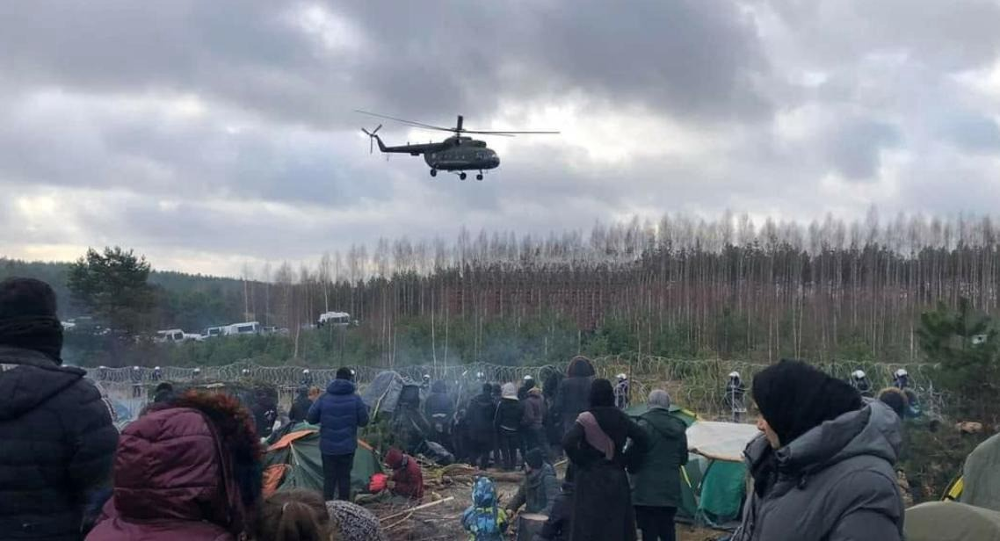
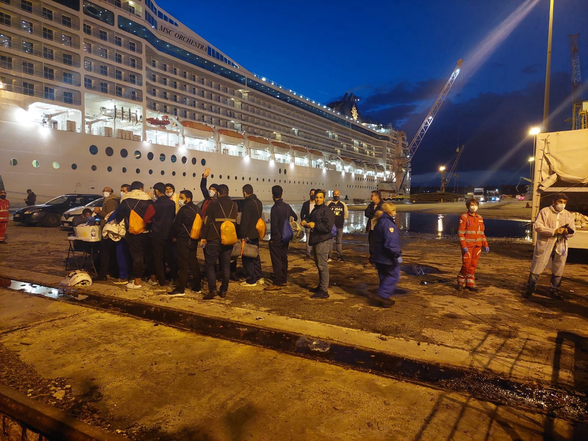
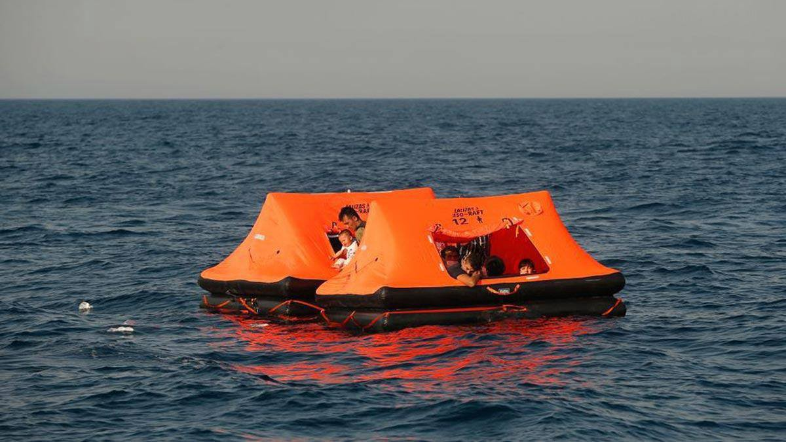

### AYS News Digest 11–12/11/21: What’s new on the Belarusian border? A roundup of the latest news
### Cyprus wants to limit asylum // Rescues and shipwreck in Spain // Greece militarizes its land border // Nearly 1,000 PoM detained in Serbia // Protests across Germany planned

[Are You Syrious?](?source=post_page-----68a2765a3e75-----------------------------------)

[Nov 13](ays-news-digest-11-12-11-21-whats-new-on-the-belarusian-border-a-roundup-of-the-latest-news-68a2765a3e75?source=post_page-----68a2765a3e75-----------------------------------) · 12 min read
### FEATURE — Eyes on the Belarusian border

A recent scene from the Polish border\. \(Photo credit: [Alarm Phone](https://alarmphone.org/en/2021/11/12/stop-the-war-on-migration-along-the-eu-belarus-border-freedom-of-movement-for-all/?post_type_release_type=post&fbclid=IwAR1zWy2FYRj2hPhCLvr7AvOqaS1_OpzFttqaUeVXjwh7vhxHB7FRMcR95AY) \)

It has been a dizzying past 48 hours trying to follow up on the latest developments along the Belarusian border\. In our [most recent digest](ays-daily-digest-9-10-11-21-state-of-emergency-in-lithuania-6193b48fdc31) , we reported that Lithuania had declared a state of emergency on its border with Belarus, and we also brought you the tragic news that another person lost their life in the forests — this time, a 14\-year\-old boy\.

Now, just 48 hours after we published that, it seems like there have been thousands of developments — and that the situation has, somehow, gotten even worse\. For those who want to follow this issue closely, the amount of stories coming out of the border can be overwhelming\. So we have tried to curate them for you, highlighting the most important bits of news, as well as analysis, so you, the reader, can feel informed but not burdened\. Here goes\!
- Early this morning a report surfaced of the ninth official death along the Belarusian border \(keep in mind, several activist groups believe the real number of deaths to be higher\) \. [A Syrian man in his early twenties was found dead near the village of Wolka Terechowska\.](https://www.theguardian.com/world/2021/nov/13/syrian-man-found-dead-poland-border-belarus?fbclid=IwAR03NEp-7n-y31MAz0gfUHz_69JTLcBh5Ptqy13ipo3GJhIRu8XA9wEVKhc) The cause of death has not yet been determined, according to media, although we know that most people are dying of simple exposure\. The temperatures are now dipping below freezing at night\.
- Many of the people dying along the border are quite young, like the 14\-year\-old Iraqi boy and this Syrian youth\. [Al Jazeera published a report late this week about the particular challenges children are facing](https://www.aljazeera.com/news/2021/11/11/we-are-dying-here-despair-on-the-belarus-poland-border?fbclid=IwAR2e9KOihwo6KjWY8PvzdvER8VtCAug6ujPzwEiULgFzz3DGBbAQp-xuO0Y) , like hunger, hypothermia, and injuries: “‘I see children dying in front of my eyes and I can’t do anything to help them,’ Ibrahim told Al Jazeera in a WhatsApp voice message, while children and adults nearby could be heard crying in the background\. ‘We are dying here\.’”
- Violence along the border is a big issue, of course\. People on the move have reported being attacked by both Belarusian and Polish border guards\. [Reuters published a story about a Syrian man who had his nose broken by a Belarusian border guard\.](https://www.reuters.com/world/europe/no-going-back-migrants-tell-being-trapped-belarus-poland-border-2021-11-10/?fbclid=IwAR1Y_FCaco7Cwbqx9gGAKxL6i8dY5VonEOS0ht8sMOnt34V6GNmKMpbywPE)
- But people are also getting attacked by locals, according to a report by [OKO\.press](https://oko.press/grupa-granica-obrabowano-i-pobito-uchodzcow-przy-szosie/?fbclid=IwAR2e9KOihwo6KjWY8PvzdvER8VtCAug6ujPzwEiULgFzz3DGBbAQp-xuO0Y) , who interviewed activists from Grupa Granica: “We met three refugees — a couple from Iraq and a Syrian woman — who had been beaten and robbed a moment earlier\. The men were beaten with a metal crowbar\. One of them was hit in the head with a crowbar\. The woman had some clothes torn off\. They were robbed of everything they had with them\. The person in the most serious condition was taken to hospital…Initially, they \[the people on the move\] mistook them \[the attackers\] for local residents and asked them for water\. In response, the attackers began to beat them\.”
- Press freedom — where is it? We know that journalists have long been barred from the militarized zone along the Polish\-Belarusian border, but there are increasing reports these days on the infringement of press freedom\. More journalists flocked to the border this week, and many are finding it difficult to do their work\. An Iran correspondent for Al Jazeera reported being harassed and detained by Polish police due to his race in [a series of videos posted to Twitter\.](https://twitter.com/AssedBaig/status/1459193918243880962) British journalist Katy Fallon also expressed frustration at the media blackout, when she wrote on [Twitter](https://twitter.com/katymfallon/status/1458904387758272521) that the denial of access to the border area made it “impossible to verify \*very serious\* allegations of violence & other events at the border\.” Fallon continued: “Accountability & press freedom are essential EU values — where are they?”
- UK flies in to…save the day? [Politico reported that 10 British troops have been deployed to the border](https://www.politico.eu/article/british-troops-deployed-poland-belarus-border-migration/?fbclid=IwAR1Sb3bDc82D7Tg1TXa-94QctY4dUDdnWt1-O3_ogSkRBIyky2IM-WJLzZM) — although the UK Defence Ministry stressed that the troops were there to provide “engineer support,” not to guard the frontier\. “Engineer support” apparently means fence fortification or repair\. Of course, building the border wall makes the UK complicit in all the death and misery at the border\. If the wall was not there, people would have freedom of movement and would not be freezing to death in the forests\. In the end, it does not matter what these British troops are actually doing\. Their presence speaks volumes about the UK’s hardline stance towards migration\.
- Meanwhile, against the backdrop of the chaos at the border, it was Polish independence day, and [thousands of far\-right demonstrators mingling with celebratory Poles gathered in central Warsaw](https://www.theguardian.com/world/2021/nov/11/far-right-leads-warsaw-march-of-patriots-as-polish-border-crisis-simmers?fbclid=IwAR3cSgmICLCBiyu_2QSp8EIaTn6NtTR9ByAVmiUA9Vusd2-HMYvz3BuQFzg) \. The crowd chanted racist slogans and vowed to defend Poland’s borders\. State TV called the event “a great march of Polish patriots\.” [One of the march’s organizers said](https://balkaninsight.com/2021/11/11/polish-nationalists-burn-german-flags-in-state-sanctioned-march/?fbclid=IwAR2e9KOihwo6KjWY8PvzdvER8VtCAug6ujPzwEiULgFzz3DGBbAQp-xuO0Y) : “Poland is being attacked on its eastern border by Moscow, which is using Belarus to apply pressure via migration\. We are also being attacked by Germany, which is using European institutions to take away our sovereignty\.” \(Those two links contain pretty incredible photographs and videos of the march, which are worth a look\. \)
- Additional reading on the border, for those who are interested: 1\) [Grupa Granica announced it will submit a claim to the Hague about the situation at the border \(article in Polish\) \.](https://www.polityka.pl/tygodnikpolityka/kraj/2143210,1,zbrodnia-na-granicy-bedzie-skarga-do-trybunalu-w-hadze.read?src=mt&fbclid=IwAR0wT-HqlwC06BopG4LuU1nb8pVwBr7b9PB0sJIsI5V-g1LYf_VkV4ZeJfs) 2\) [Alarm Phone’s statement on the border situation\.](https://alarmphone.org/en/2021/11/12/stop-the-war-on-migration-along-the-eu-belarus-border-freedom-of-movement-for-all/?post_type_release_type=post&fbclid=IwAR1zWy2FYRj2hPhCLvr7AvOqaS1_OpzFttqaUeVXjwh7vhxHB7FRMcR95AY) 3\) [Foreign Policy: Don’t Blame Belarus\. Blame Brussels\.](https://foreignpolicy.com/2021/11/11/belarus-poland-migration-refugees-lukashenko-blame-eu-brussels/?fbclid=IwAR1zWy2FYRj2hPhCLvr7AvOqaS1_OpzFttqaUeVXjwh7vhxHB7FRMcR95AY) 4\) [Counterfire: Europe’s Shame\.](https://www.counterfire.org/articles/opinion/22760-europe-s-shame-the-horrific-treatment-of-refugees-on-the-poland-belarus-border) 5\) [Mixed Migration Centre digging deep into the history of Polish\-EU relations to ask how we got to this moment\.](https://mixedmigration.org/articles/heading-into-a-wall-the-eu-response-to-the-migration-crisis-at-the-belarus-border/?fbclid=IwAR2SmSlR2zZ81XAeVeZ8wXGvJYSmZMMfsYys-oHgNll8KzeyafOFVU475wA) 6\) [Human Rights Watch statement/short report urging for a humane response and an end to “ping\-pong pushbacks\.”](https://www.hrw.org/news/2021/11/12/stuck-limbo-between-poland-and-belarus?fbclid=IwAR3oqoLQQGgWGSfVJ2EhSjBpdtex6myLsuBmQsLrvcvrClxamqIT8V4zCAI)

### CYPRUS
### Country wants to end asylum applications for ‘illegal’ arrivals

Pivoting away from the headline\-grabbing Belarusian border, we turn to Cyprus, which announced this week it wants to cease processing asylum applications for people who arrive in the country without proper papers, [media reported](https://www.infomigrants.net/en/post/36399/cyprus-requests-the-suspension-of-asylum-applications?fbclid=IwAR0OC5oE-1yUAbYBHQobp4im6I0Wwe64z52tpiDMDffFsYs_PH1LgQDnenc) \.

“A request will be submitted to the European Commission to take action in favor of the Republic of Cyprus, including granting it the right to suspend asylum applications by people entering the country illegally,” government spokesperson Marios Pelekanos told media\.

People continue to arrive regularly on Cyprus by boat, many of them Syrians\. [Local media](https://cyprus-mail.com/2021/11/11/61-irregular-migrants-spend-night-in-boat/) reported the arrival of 61 people, Syrians and Lebanese, in the port of Paphos on Wednesday\.

Pelekanos, the government spokesperson, said that the number of people on the move reaching Cyprus in 2021 was 38% higher than in the previous year\. By the end of October 2021, 10,868 people crossed into Cyprus without papers\.

Cyprus also lacks solid policies to deport those who have had their asylum applications rejected in the country, Pelekanos told media\.
### SEA/SAR
### SOS Mediterranee disembarkation in Sicily

\(Photo: [SOS Mediterranee Suisse](https://www.facebook.com/sosmedsuisse/posts/1811427745716023) \)

All 306 people rescued in recent weeks by SOS Mediterranee were able to disembark in the Sicilian port of Augusta\. Several other people had already been medically evacuated\. We wish all of them the best of luck\!
### Nearly four dozen people rescued off Canaries, 24 rescued in the Strait

Spanish Maritime Rescue reported it had rescued 44 people from a dinghy off Lanzarote, one of the Canary Islands, [media reported](https://www.europapress.es/islas-canarias/noticia-rescatan-patera-44-inmigrantes-aguas-cercanas-lanzarote-20211112092521.html?fbclid=IwAR35U8998CQYQhFgMGnoiXbNeljWuC_kFXlFO__2etelbF0yoa_2gSz4jGs) \. Forty\-three men, one woman and a minor were brought to Arrecife, the capital of Lanzarote, and were said to be in good health\.

Off the coast of Cadiz, Maritime Rescue intercepted twenty\-four men in two boats and brought them to port, [media reported](https://andaluciainformacion.es/barbate/1007946/rescatados-24-migrantes-de-dos-pateras-en-el-estrecho/?fbclid=IwAR03NEp-7n-y31MAz0gfUHz_69JTLcBh5Ptqy13ipo3GJhIRu8XA9wEVKhc) \.
### Four deaths in shipwreck off Morocco

Moroccan authorities found the bodies of four people off its northwest coast, [media reported](https://www.europapress.es/internacional/noticia-menos-cuatro-muertos-naufragio-futura-patera-costa-oeste-marruecos-20211111135044.html?fbclid=IwAR1AGmLNgyUnhze4Gp7v-8t6hIVfDD4ic1RPoalD3cRrK1bo8YCts7-ufGU) \. The shipwreck occurred at the mouth of the Oued Cherrat on Thursday\. Three people survived and were taken to a local hospital, but authorities are still searching for other survivors\. No further information was given about the deceased\.
### GREECE
### Increasing attention on trial of Sara, Sean and Nassos

We have already reported extensively on the upcoming trial of these three Lesvos humanitarians, but for those curious to read more about their cases, check out these two links: [Alarby\.co\.uk](https://english.alaraby.co.uk/analysis/how-greece-criminalising-solidarity-refugees?fbclid=IwAR1jrSdpJJaMPgUqP3bfX4L5p1v6H6AwQ5b7ozB1YHiElCd9Own85k-lAmE) ; [Human Rights Watch](https://www.hrw.org/news/2021/11/11/greece-life-saving-trial?fbclid=IwAR10GDd9Bqtnpn1Zx3p0LrdGvcS3halAzMA1Z5E7rkkHMsyg0LYpzPUgVrQ) \.
### Criminalization of migration: \#Samos2

In the vein of criminalization, Statewatch published an interesting report on the ‘Samos2\.’ The story is well known: last year, a young Afghan father, known as ‘N\.’, lost his six\-year\-old son during the crossing from Turkey to Samos\. He buried his son on Greek soil and was promptly arrested for endangering the life of his child\. N\. now faces a trial and prison time\. His co\-passenger, Hassan, now faces _life in prison_ for steering the boat\. Read more about their cases and the campaign to free them at [this link](https://www.statewatch.org/news/2021/november/greece-new-campaign-against-criminalization-of-migration-free-the-samos2/?fbclid=IwAR10GDd9Bqtnpn1Zx3p0LrdGvcS3halAzMA1Z5E7rkkHMsyg0LYpzPUgVrQ) \.
### What does ‘pushback’ mean in the Greek context?

A Greek lawyer, Thanasis Kampagiannis, published an interesting Facebook post discussing the meaning of the word ‘pushback,’ specifically in the Greek context\. He included this image, below, to demonstrate his point\.

Here’s an excerpt from his [post](https://www.facebook.com/thanasis.kampagiannis/posts/10224135325343631) \.

> _The used English word “push\-back” \(strictly speaking “push back” or more elegantly reproaching\) accumulates the practice of the Greek state\. It hints that the Greek port ships prevent sailors with refugees and immigrants from capturing the Greek coast and then call on the Turkish port to interfere with them\. Obviously, the Greek state is doing this TOO, backward from the over\-year tradition of people to rescue other vulnerable people who are at sea \(think about that we have gone behind the — obviously communist — cry land “MAN IN THE SEA”\) \._ 

> _But the Greek state is doing something even more scandalous: it arrests people who have been on its land, abducts them using men without discrimination and then \(if in the meantime they don’t strip them, steal them they don’t hit them, which is a routine\) they load them in bubbles and them leaves in the middle of the sea\._ 

> _I think the term push\-back is inadequate to describe these practices whose proper names are: kidnapping, robbery, life\-threatening exposure and, ultimately, homicide\._ 

> _These images offend us not as Greeks but as people\. Let Mr\. Mitsotakis speak only about himself\._ 

### Militarization of Greece\-Turkey border

Greece is readying its border again following recent ‘threats’ from Turkey’s Erdogan, [media reported](https://www.keeptalkinggreece.com/2021/11/12/greece-army-increase-readiness-erdogan-migrants) \. In an emergency meeting on Friday, the Chief of General Staff together with the Chiefs of General Staffs of the Land Forces, Air Force and the Navy decided to take “precautionary measures with special emphasis on the surveillance increase of the land and sea borders, increased readiness as well as the immediate reporting of incidents by the Border Units related to the increase of illegal migration flows,” [Greek media reported](https://www.tribune.gr/politics/news/article/784807/se-synagermo-o-stratos-se-epifylaki-gia-yvridiki-epithesi-erntogan.html) \.
### SERBIA
### Serbian authorities detain nearly 1,000 people on the move and seven alleged ‘human traffickers’

A police operation in several regions in Serbia has resulted in the detention of nearly 1,000 people on the move and seven alleged ‘human traffickers,’ [media reported\.](https://www.infomigrants.net/en/post/36429/serbia-detains-991-migrants-arrests-seven-alleged-traffickers?fbclid=IwAR28KDZaK-Hdza3xUhTfHFB0PyszSSrX4DksagBVJuNkOFh0nnCMg9nvoYo) The people were taken from Belgrade, Subotica, Sombor, Kikinda, Sabac, Kraljevo, Vranje and Novi Pazar to reception centers\. No information was given about the fate of the ‘human traffickers’ or their nationalities, although it is well\-known that many ‘smugglers’ are people on the move themselves, forced into the business out of economic desperation\.

Such a massive detention of people at once is unusual, as it requires coordination from multiple police departments\. This event demonstrates Serbia’s determination to clamp down on migration and rid its cities and border villages of people on the move\. Out of sight, out of mind, right? Serbia would like the ‘problem’ of migration to go away, but of course the real problem is that the EU borders are closed and people cannot leave Serbia\.

Volunteers from No Name Kitchen in Serbia traveled to several towns in northern Serbia this week and wrote a [detailed Facebook post](https://www.facebook.com/NoNameKitchenBelgrade/posts/1356365468095067) about their impressions of the situation there, which is worth reading in light of this detention news\.
### HUNGARY
### Hungary faces EU fines for non\-compliance on migration issues

The European Union is referring Hungary to the EU Court of Justice and is requesting fines for the country’s unlawful detention of people on the move, [media reported](https://www.bnnbloomberg.ca/hungary-faces-eu-fines-over-orban-s-crackdown-on-asylum-seekers-1.1680869?fbclid=IwAR3Y71JjvW8ROIJxuyJ_6xyONErAIOAwfuj8lhvQ8U3gE8f4EEEeBuLh0iY) \.

“As of today, Hungary has not addressed several aspects of the judgment,” the commission said in a statement, according to media\. The nation “has not taken the measures necessary to ensure effective access to the asylum procedure\. Hungary has also not clarified the conditions pertaining to the right to remain on the territory in case of an appeal in an asylum procedure\.”

Last year, EU judges ruled that Hungary had to cease its policy of holding people indefinitely in a transit area on its Serbian border\. Hungary ended some of those policies — it closed the transit zones and stopped holding people in metal containers, sometimes without food — but has hardened some of its asylum procedures in defiance of the EU’s ruling\.
### GERMANY
### Planned actions for Polish border, against deportations
### UNITED KINGDOM
### After record Channel crossings, Priti Patel needs to rethink her strategy…

Some 1,100 people arrived in the UK by boat on Thursday, a record for recent times, [media reported](http://v/12/about-1000-people-reach-uk-in-single-day-across-channel-in-small-boats?fbclid=IwAR1R3KoczWNi28cgizgxrjBbAfebpjj7IfiJiNg10BdWKYpKBXbHiHpf8Vs) \. Now, advocates are saying Home Secretary Priti Patel needs to change course from her hardline policies\.

“There are no simple answers, but we urge the government to rethink its plans,” said Jon Featonby, the refugee and asylum policy manager at British Red Cross\. “As it stands, the nationality and borders bill will make the UK’s asylum system harsher and not address the reasons why people take such dangerous journeys\. The focus for any reform should be ambitious plans for new safe routes alongside a fair, humane and efficient asylum system\.”

[Media also reported](https://www.theguardian.com/politics/2021/nov/12/brexit-easier-small-boat-crossings-to-reach-uk-refugees-say?fbclid=IwAR0LRTfUUj3X03RUudKfOG0sBAwuC2bzxhUcjW5K9w3YBKmoZUAul2ySEck) that people on the move in northern France say that Brexit has made it easier for them to cross the Channel\.
### EU / FRONTEX
### The dangers of using the phrase ‘the weaponization of migration’

How are phrases like Belarus is ‘weaponizing migrants’ or ‘hybrid war’ harmful? In an article for [Social Europe](https://socialeurope.eu/against-weaponised-migration) , Felix Bender writes the following:

> _Implying that having a few thousand asylum applicants at the EU’s external border equates to a hybrid attack on the union not only amounts to treating human beings as objects, rather than subjects, but also buys into the rhetoric of the Belarussian dictator\. It is morally abhorrent and strategically mistaken\._ 

He continues:

> _The upshot of this shift is that asylum\-seekers are primarily understood as pawns in the game between two hostile states — as weapons — and hence not as subjects whom we ought to treat as ends in themselves\. It legitimises their treatment as other than human\. In this context, they are a means to a political goal, allowing for reactions we would otherwise find abhorrent with regard to human beings: denial of the right to protection from persecution, violent pushbacks\._ 

> _These are then no longer conceivable as mistreatments of human beings — rather as legitimate political reactions to the political action of an enemy\. In sum, ‘weaponised migration’ denigrates asylum\-seekers and thereby formulates and legitimises immoral political reactions\._ 

Matthias Monroy noted a similar problem with the term in this tweet, where he says that calling what is happening at the border a ‘war’ could legitimize military action by the EU\.

For more on this language and the dangers of it, check out [this Statewatch piece](https://www.statewatch.org/news/2021/november/eu-the-weaponised-migration-discourse-dehumanises-asylum-seekers/?fbclid=IwAR1cwE_iyWNdnLOo1ND5Usg9p30Q7GocYGSTiKfCCzBIVMs9F4Rx9s4aWjo) \.
### Austrian arms giant won contract with Frontex

The Austrian arms giant Glock has won a contract with Frontex to supply guns and ammunition for its Standing Border Guard Corps, [Abolish Frontex reported](https://abolishfrontex.org/blog/2021/11/12/glock-will-provide-firearms-to-frontex-border-police-force/?fbclid=IwAR2nqQ1a8dulr06-_XZ1-Y2NTg5feMPGj_qrKf3-WQXElr6rnYvyCATxjwc) \. Glock will receive €3\.76 million to supply 2,500 9×19 mm semi\-automatic pistols \(including accessories and training\) over the course of four years\. Over 3\.6 million rounds of ammunition will be provided by Polish companies Mildat and Parasnake Arkadiusz Szewczyk, which will earn €1\.24 million in total\.
### WORTH READING / ATTENDING

Join this interdisciplinary panel organized by the [@RefugeeLawLab](http://twitter.com/RefugeeLawLab) to discuss the growing practice of \#pushbacks at European borders, facilitated by increased surveillance & a lack of accountability\.

Speakers include: Lydia Emmanouilidou, Giorgos Christides and Natalie Grueber\. The panel will be moderated by Petra Molnar\. The event is on Monday, November 15 at 12:30 pm — 2:00 pm EST \(18:30–20:00 CET\) \. Click on the link to register\.
### [Sharp Borders: Technology, Pushbacks, and Interdisciplinary Investigation \-](https://refugeelab.ca/event/sharp-borders-technology-pushbacks-and-interdisciplinary-investigation/)
### [As borders sharpen all around the world, new technologies are making various human rights abuses possible\. Join our…](https://refugeelab.ca/event/sharp-borders-technology-pushbacks-and-interdisciplinary-investigation/)

[refugeelab\.ca](https://refugeelab.ca/event/sharp-borders-technology-pushbacks-and-interdisciplinary-investigation/)

A review in _Variety_ of ‘Simple as Water,’ a documentary about the lives of Syrian refugees in Turkey, Europe and the US\.
### [‘Simple as Water’ Review: Syrian Refugees in Limbo, From Turkey to Pennsylvania](https://variety.com/2021/film/reviews/simple-as-water-review-1235110650/?fbclid=IwAR1Y_FCaco7Cwbqx9gGAKxL6i8dY5VonEOS0ht8sMOnt34V6GNmKMpbywPE)
### [Nearly two decades ago, Megan Mylan co\-directed “Lost Boys of Sudan,” a memorable documentary chronicling hope and…](https://variety.com/2021/film/reviews/simple-as-water-review-1235110650/?fbclid=IwAR1Y_FCaco7Cwbqx9gGAKxL6i8dY5VonEOS0ht8sMOnt34V6GNmKMpbywPE)

[variety\.com](https://variety.com/2021/film/reviews/simple-as-water-review-1235110650/?fbclid=IwAR1Y_FCaco7Cwbqx9gGAKxL6i8dY5VonEOS0ht8sMOnt34V6GNmKMpbywPE)

A new podcast from InfoMigrants called ‘Tales from the Border,’ about people’s encounters with borders around the world\. The first three episodes focus on Senegal, the Central Med, and Serbia\. They are available on Apple Podcasts, Spotfiy, and elsewhere\.
### [‎Tales from the Border on Apple Podcasts](https://podcasts.apple.com/us/podcast/tales-from-the-border/id1593677734)
### [‎InfoMigrants presents season one of its podcast Tales from the Border\. In a series of eight episodes, Tales from the…](https://podcasts.apple.com/us/podcast/tales-from-the-border/id1593677734)

[podcasts\.apple\.com](https://podcasts.apple.com/us/podcast/tales-from-the-border/id1593677734)

**Find daily updates and special reports on our [Medium page](https://medium.com/are-you-syrious) \.**

**If you wish to contribute, either by writing a report or a story, or by joining the info gathering team, please let us know\.**

**We strive to echo correct news from the ground through collaboration and fairness\. Every effort has been made to credit organisations and individuals with regard to the supply of information, video, and photo material \(in cases where the source wanted to be accredited\) \. Please notify us regarding corrections\.**

**If there’s anything you want to share or comment, contact us through Facebook, Twitter or write to: areyousyrious@gmail\.com**

_Converted [Medium Post](https://medium.com/are-you-syrious/ays-news-digest-11-12-11-21-whats-new-on-the-belarusian-border-a-roundup-of-the-latest-news-371e6ba3464e) by [ZMediumToMarkdown](https://github.com/ZhgChgLi/ZMediumToMarkdown)._
