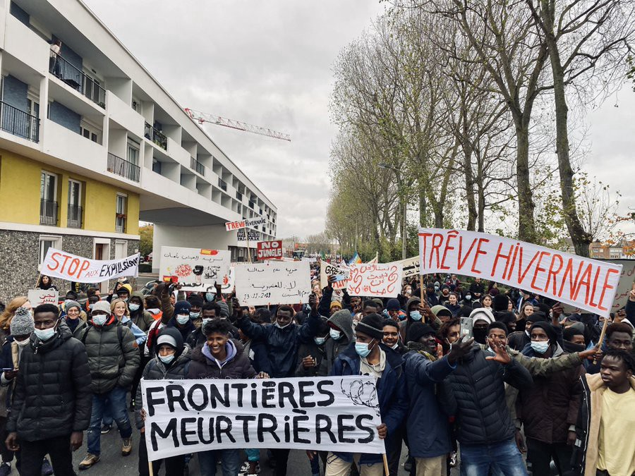
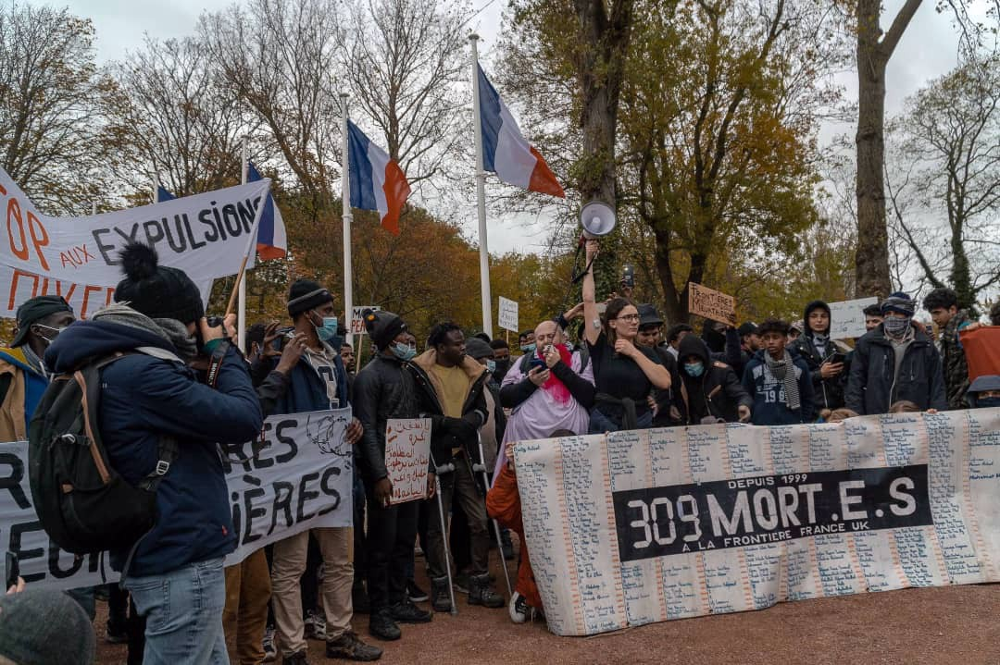
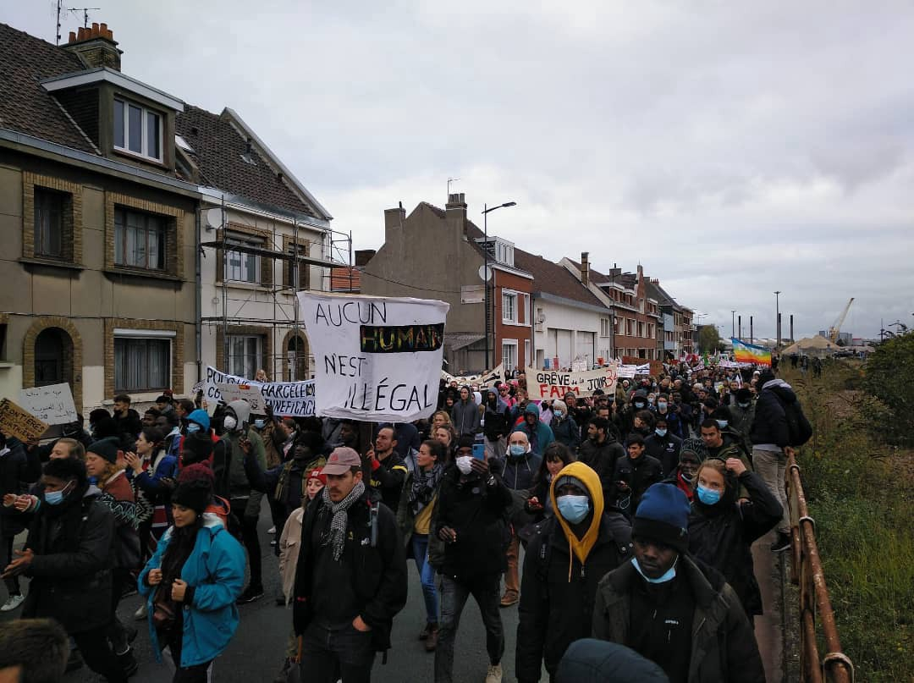

### AYS Weekend Digest 13–14/11/21: Solidarity gatherings in France and Germany counter the official stance
#### 8 lives lost in the sea close to the Canary islands / New SAR activities in the Med / Aletter to the minister from the people of Samos / Developments at the Belarus border, calls for help and information for those wishing to get involved…

Photo: [Louis Witter](https://twitter.com/LouisWitter)

3demands for Calais:
- **stop evictions during the winter period \(“trêve hivernale”\)**
- **stop confiscation and aggravation of peoples’ belongings**
- **open dialogue between the local authorities and NGOs**

Around 1,000 people attended a demonstration in solidarity with displaced people and the demands of hunger strikers at the Saint\-Pierre church\. A concrete action of collective solidarity with the hunger strikers and people on the move suffering the consequences of bad politics\.

Photos: [juliadruelle](https://twitter.com/juliadruelle)
### SAR IN THE MEDITERRANEAN
### 8 lives lost at sea

In the afternoon, Nadir encountered a crowded wooden boat in the Maltese SAR zone, with about 95 people on board\. They had been at sea since Friday\. In the evening, an Italian coast guard ship arrived and evacuated all people from the wooden boat, the team [reports\.](https://l.facebook.com/l.php?u=https%3A%2F%2Ftwitter.com%2Fresqship%2Fstatus%2F1459973837815271433%3Ffbclid%3DIwAR3CDMZBJ2xUQkeNwLwMPrtu1RUOI2zQAaI5Fpp07kbJ9fFKsQ6ibqGGMLM&h=AT3_08TlTJ1bF6K2lA3-imdN8J9fGKuEWbjsfCYCrJ1D9ISxK0KSnxHSc_qzwQ85RtRsbNL0HwlzJwiLBolLS49OX3qF60m2ErM01pgWDi4__1yN2JrlmJNS5yZWu8oV2m5Z_k0aLWzZFg&__tn__=R]-R&c[0]=AT1eA5B9dbisFkWMIhGbb8g6i-ArPgNohLmUHK2-P0yH3w7yPE7OZOQ1IjnSC3JZmSQQg7qHN0_o0G74ZZao0j2vPwAVkIDHsAL5wMAy_mLaDx3P8BTTZUfA9ylWJnYNyRlc5kqPwM91Bf2XAKp9thBbA09ogMfJDnd62xxIPTkK94jXKj8hBOonqFXcnjBCwa6kQMgYtrQ9)
### LIBYA
### Criticism of UNHCR in Libya for how they dealt with recently detained families

Hundreds of people who have been protesting against the UNHCR’s moves in Libya are reportedly still in Ain Zara detention centre, Sally Hayden writes\.

_“They say doctors now visit daily but the food is totally inadequate: one piece of white bread in the morning and plain white pasta two other times with one container shared between 5 people\.”_ She continues saying these people are in great need of basic things, like clothes and food, noting there are roughly 700 people still locked up there indefinitely, including 40 women\. In the meantime, the UNHCR Libya has issued their own information _“to counter rumours on support to those who are released from detention centers in Libya”_ , it is available [here](https://t.co/8getwtKy1L?amp=1) , while the accounts on what the people claim happened are presented in [this profile](https://twitter.com/RefugeesinLibya/status/1459604172735717376?s=20) \.
### GREECE
### “Which Samos have you been to?”

> _You may turn a blind eye to your far right by not denying deportations and the other to the furious Europe that would like to fully legitimize the practices, but the country you rule in has not surrendered to either the far right, nor to fear or hatred\._ 

This is among the things said in a [letter](https://www.in.gr/2021/11/13/greece/epistoli-katoikon-samou-ston-mitsotaki-eseis-se-poia-samo-exete-paei-kyrie-prothypourge/?fbclid=IwAR1z2eaOSycZsVr8g-ueq_zw5F_c3R9vg0DINON3w-OCFWMHZceVU-3fLNw) from residents of the island of Samos, to the minister Mitsotakis, noting several documented cases of pushbacks he claims have not taken place, and saying once again that the Closed Controlled Structure of Samos is not as good as they publicise it to be, “it is not clean and it does not have a standard playground for children\.”

> _It is an installation inside a bare plateau of Samos made entirely of barbed wire, metal containers, concrete, gravel, police, checkpoints and private security guards\. Damage caused by use is never repaired\._ 

They finish by posing several questions —

_“Since no journalist has asked you since March 2020, we as residents of Samos would like to ask something\. So after talking about aggressive border guards and a tough but fair immigration policy:_

_\- How is it possible to have such low numbers of officially recorded arrivals of immigrants in Samos, when we who live here have witnessed countless arrivals?_

_\- How is it possible to talk about hundreds or even thousands of daily rescues and in Samos that there has not been a single record for a year and a half that results from the rescue of the port?_

_\- What actions are taken for all the boats with migrants that have been located in Greek territorial waters? Can you confirm that the arrivals have been taken to a safe place to be recorded? Why does this not appear in the official records?_

_\- What actions are taken for all the boats with immigrants that have arrived on a Greek island? Have they been officially recorded and if so why do they not appear in the relevant reports?_

_\- If in these last two cases the arrivals have been abducted, robbed, abused and towed back to Turkey, then can we talk about the biggest, most massive, most lasting crime of the Greek state by its hierarchically structured criminal organization or have we done even bigger?”_
### Story from Ritsona

Ritsona is the largest camp in the mainland\. _“Excluded from the social and economic life of the country long before the pandemic, the camp gradually acquired its own life\. Today, with new surveillance technologies gradually being installed in the structure, fears are manifested that the community will be completely cut off from the local community\.”_

Read the whole story:
### [Χτίζοντας οικονομίες εντός των τειχών](https://l.facebook.com/l.php?u=https%3A%2F%2Fwearesolomon.com%2Fmag%2Fon-the-move-el%2Fxtizontas-oikonomies-entos-ton-toixwn%2F%3Flang%3Del%26fbclid%3DIwAR2fV9xWoWue39XydRRiomem_koehEYt3Gd5_aLk5fnytUdC0A-RQry7lAs&h=AT1o_C7rRLmsIxnGVzFIyIT6Q5caOvUh32afOTZfxPWb5XEU0uo8ryqmHIGT9rNm6UxcQswBC-981sh-6GyHnqm0Avx3_BLeXHbGiIkwODSG7QubRhU76hJq8meUL89K3v-pOdjSPFm4kQ&__tn__=R]-R&c[0]=AT0rlFoG3OyU3ddBLGB-32F4JybPA7CqOOjs8YxVeA_DSx9QKMti2ttkp4SEjdzs1-SlRYSuMtS7ChgEMk1v2dx98aN8YVs9Mk-TYCJ4wn0rN83oqU_xP7_0c7ea6PjrDayeA6hEtWAZRMUoShLf8BggSPQNdz7lIU2LK6YolOIU3yoVVzjyQEQe6BLVMZG-CaoO171ldnmK)
### [Η δομή της Ριτσώνας είναι ο μεγαλύτερος προσφυγικός καταυλισμός στην ενδοχώρα\. Αποκλεισμένος από την κοινωνική και…](https://l.facebook.com/l.php?u=https%3A%2F%2Fwearesolomon.com%2Fmag%2Fon-the-move-el%2Fxtizontas-oikonomies-entos-ton-toixwn%2F%3Flang%3Del%26fbclid%3DIwAR2fV9xWoWue39XydRRiomem_koehEYt3Gd5_aLk5fnytUdC0A-RQry7lAs&h=AT1o_C7rRLmsIxnGVzFIyIT6Q5caOvUh32afOTZfxPWb5XEU0uo8ryqmHIGT9rNm6UxcQswBC-981sh-6GyHnqm0Avx3_BLeXHbGiIkwODSG7QubRhU76hJq8meUL89K3v-pOdjSPFm4kQ&__tn__=R]-R&c[0]=AT0rlFoG3OyU3ddBLGB-32F4JybPA7CqOOjs8YxVeA_DSx9QKMti2ttkp4SEjdzs1-SlRYSuMtS7ChgEMk1v2dx98aN8YVs9Mk-TYCJ4wn0rN83oqU_xP7_0c7ea6PjrDayeA6hEtWAZRMUoShLf8BggSPQNdz7lIU2LK6YolOIU3yoVVzjyQEQe6BLVMZG-CaoO171ldnmK)

[l\.facebook\.com](https://l.facebook.com/l.php?u=https%3A%2F%2Fwearesolomon.com%2Fmag%2Fon-the-move-el%2Fxtizontas-oikonomies-entos-ton-toixwn%2F%3Flang%3Del%26fbclid%3DIwAR2fV9xWoWue39XydRRiomem_koehEYt3Gd5_aLk5fnytUdC0A-RQry7lAs&h=AT1o_C7rRLmsIxnGVzFIyIT6Q5caOvUh32afOTZfxPWb5XEU0uo8ryqmHIGT9rNm6UxcQswBC-981sh-6GyHnqm0Avx3_BLeXHbGiIkwODSG7QubRhU76hJq8meUL89K3v-pOdjSPFm4kQ&__tn__=R]-R&c[0]=AT0rlFoG3OyU3ddBLGB-32F4JybPA7CqOOjs8YxVeA_DSx9QKMti2ttkp4SEjdzs1-SlRYSuMtS7ChgEMk1v2dx98aN8YVs9Mk-TYCJ4wn0rN83oqU_xP7_0c7ea6PjrDayeA6hEtWAZRMUoShLf8BggSPQNdz7lIU2LK6YolOIU3yoVVzjyQEQe6BLVMZG-CaoO171ldnmK)
### BELARUS

The political standoff at the border\(s\) with Belarus continues, but tragically, so does the loss of lives\. Latest in line was a young Syrian whose [body was found](https://www.theguardian.com/world/2021/nov/13/syrian-man-found-dead-poland-border-belarus?fbclid=IwAR3vRYAodYFRg7tG1yfoK8IjcY5I6NciUB-Jg_rDRVXseigLp8YdiF9Tkik) on Friday near the village of Wolka Terechowska\.

The situation in the border area is difficult to explain and uncomparably more difficult to survive for all those forced into the no man’s land…
### Help and assistance

A list of ways to help in a way deemed legitimate and legal by the authorities are listed in this article:
### [Jak legalnie pomóc osobom, które nielegalnie przekroczyły granicę? 15 pytań\. Komentarz prof…](https://oko.press/jak-legalnie-pomoc-osobom-ktore-nielegalnie-przekroczyly-granice/?utm_medium=Social&utm_source=Twitter&fbclid=IwAR0HUzJFJWrRz196S9bFBnNgiWHg4hhrNgypTrNmUUdqR2v7nARgrsn5f0Q#Echobox=1636824895)
### [„Przepisy prawa wykładane w złej wierze będą \(fałszywie\) traktowały przypadki pomocy migrantom jako karalne pomocnictwo…](https://oko.press/jak-legalnie-pomoc-osobom-ktore-nielegalnie-przekroczyly-granice/?utm_medium=Social&utm_source=Twitter&fbclid=IwAR0HUzJFJWrRz196S9bFBnNgiWHg4hhrNgypTrNmUUdqR2v7nARgrsn5f0Q#Echobox=1636824895)

[oko\.press](https://oko.press/jak-legalnie-pomoc-osobom-ktore-nielegalnie-przekroczyly-granice/?utm_medium=Social&utm_source=Twitter&fbclid=IwAR0HUzJFJWrRz196S9bFBnNgiWHg4hhrNgypTrNmUUdqR2v7nARgrsn5f0Q#Echobox=1636824895)

In the Polish side, the team [Medycy Na Granicy](https://twitter.com/medycynagranicy) are informing that they will be moving for a while, and after contacting their emergency number, people will still be able to count on the arrival of a **medical team available 24 hours a day and 7 days a week\. From November 16 it will be the team [@RatownicyPCPM](https://twitter.com/RatownicyPCPM)**

In the meantime, the constraints against all those wishing to help, provide medical or other assistance, and even to report from the area are growing stronger and making journalism in the EU of the 21st century impossible\. That is why the **European Federation of Journalists** \(EFJ\) strongly called on Polish authorities to let the reporters return\.

To remind:

> _On 2 September, Andrzej Duda issued a decree introducing a state of emergency along Poland’s border with Belarus at the request of the government\. The President’s decision was approved on 6 September by parliament\._ 

> _The decree prohibits capturing images of the border area and infrastructure therein, as well as recording border guards, police and the military\. It restricts freedom of information on activities which are undertaken “in relation to safeguarding the state border or preventing illegal migration”\._ 

[Read more](http://0.0.0.11/) \.

The volunteers who have the chance to come and help directly are facing other, yet always the same, pressure, questions and scepticism, so one of the activists recently wrote:

> _And where are the men?_ 

> _I have heard this question countless times at the border\. From the media, visitors, supporters\._ 

> _Are there any men with you? There are, but not many\. Why? I don’t know, maybe some men should be asked\._ 

> _But since I am already a bit tired of this question, I am throwing out a handful of questions\-answers:_ 

> _\- who usually does poorly paid jobs in the poorly paid sector,_ 

> _\- who usually chooses to volunteer,_ 

> _\- who usually works in an aid job,_ 

> _\- who usually takes care of the sick,_ 

> _\- who usually cooks and serves soup,_ 

> _\- who usually cares if the other person is warm and not hungry\._ 

> _Running through the woods at night sounds like an exciting adventure? It may sound, but it isn’t\. We run with tea and soup to find cold, scared and hungry people\. We don’t have uniforms, guns, off\-road cars, helicopters, drones, promotions, awards and perks\. Those of the latter group of forest walkers have them, in which in turn you will find many men\._ 

> _To be clear: I’ve met a lot of awesome dudes over the last 2 months\. I confirm that there are men among us and that they are very cool\. But I would like to stop keeping these accounts and having to explain why there are so many women and where these men are\._ 

### Protest in support to people on the move

Several organizations have [called for the demonstration against EU policy and for the acceptance of refugees](https://taz.de/Proteste-gegen-die-EU-Politik/!5811159/) who have been trying for weeks to get from Belarus to Poland and on to Germany, and have gathered to show their stance in Berlin\.

In the meantime, the German politicians, representing the general attitude of the EU, say society has to “endure” the images of people in need, or simply, as the German prime minister of Saxony said: “We are not allowed to accept these migrants in the EU or in Germany\. “
### UK
### The unlikeliness of push\-backs

Official legal advice that was leaked this week suggested that government lawyers believe that any push\-backs will be met by legal challenges, and the Home Office is likely to lose\. The opposition called it “a clear sign of desperation from the home secretary because of her failure to grip this crisis\.”

If a dinghy enters the push\-back area meeting all of the criteria \(rules drawn up for Border Force that specify the targeted boats have to be in a designated portion of the English Channel, and to have reached that area independently without being led or coerced\), the Border Force will still have to back off if the situation deteriorates\. Also, the French authorities have to be present during a push\-back operation and be willing to receive the boat\.

> _The constraints on when this would occur at all are so tight that we simply do not believe there will be a situation where this will ever happen_ 

_“There is an obligation to both save lives at sea and not endanger lives at sea, which would almost unavoidably happen if there were attempts at turning back dinghies which are overcrowded with people”_ , the UN representative in the UK [said](https://www.independent.co.uk/news/uk/home-news/channel-boats-push-backs-patel-b1956827.html?fbclid=IwAR1DYdXE5FTlzTdhegRtSeGEhBe-dzyEXLZFCtWtBgGYVdemTdz4FaGfgKs) \.

It was [reported](https://www.theguardian.com/uk-news/2021/nov/14/union-considers-legal-action-over-channel-refugee-pushbacks?fbclid=IwAR3RkRsYcUiuCzeeLtRyaDVGQV06oM_N5K3rQQVohrT6TOgh6shLvfR-E74) that the number of asylum seekers crossing the English Channel hit a new daily record of 1,185 on Thursday\.

**Find daily updates and special reports on our [Medium page](https://medium.com/are-you-syrious) \.**

**If you wish to contribute, either by writing a report or a story, or by joining the info gathering team, please let us know\.**

**We strive to echo correct news from the ground through collaboration and fairness\. Every effort has been made to credit organisations and individuals with regard to the supply of information, video, and photo material \(in cases where the source wanted to be accredited\) \. Please notify us regarding corrections\.**

**If there’s anything you want to share or comment, contact us through Facebook, Twitter or write to: areyousyrious@gmail\.com**

_Converted [Medium Post](https://medium.com/are-you-syrious/ays-weekend-digest-13-14-11-21-solidarity-gatherings-in-france-and-germany-counter-the-official-184699d98c1d) by [ZMediumToMarkdown](https://github.com/ZhgChgLi/ZMediumToMarkdown)._
