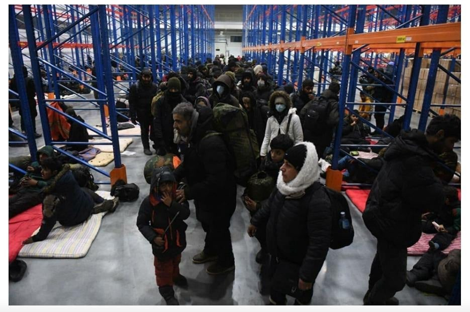
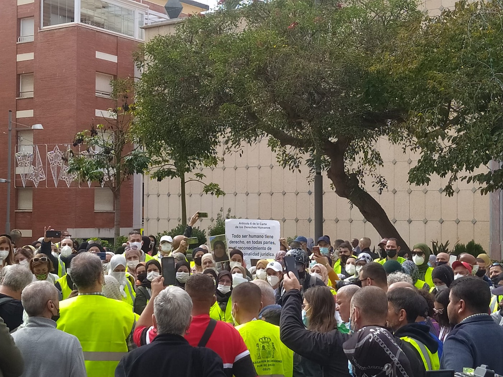

### AYS News Digest 15/11/21: An appeal to the Polish government
#### Activists to the politicians / reports from the border / news from the SAR missions & more

#### FEATURED

Almost three thousand people have reached the Polish border crossing of KUŹNICA to seek a safe passage to the European Union and its member states\.

Among them, there are a few hundred children, women, elderly people and people with special needs\. These people have left their homes to seek refuge\. Meanwhile, flights with Iraqis, Syrians and Yemenis have been cancelled and the new arrivals have ceased completely\.

> People on the Kuźnica border post have been living in extremely difficult conditions by being exposed to freezing temperatures and without sufficient food and water\. 

Due to the halt of people coming through the Belarus route, we DEMAND and kindly REQUEST you at the same time to allow people to enter Poland and apply for asylum\. Please help them\! Please do not hurt refugees\! They have already been through a terrible journey escaping war and persecution from their homes in Syria, Iraq and Afghanistan\. They deserve humane treatment with our support and dignity\. Please do not leave them to die on the borders\. Signed by Polish and international activists from Poland and the EU\.

#### THE MEDITERRANEAN

 reports fail to say what happened to the people once they were returned, who returned them and in which capacity, with whose support, but here are their numbers](assets/199733ba249c/1*6TIkpYvFvSSDvqRkwA8fsA.png)

[IOM Libya](https://web.facebook.com/IOMLibya/?__cft__[0]=AZXNbW1vkGJMB9OgvyZlLfdydJOJWsXzraKbgf6GBU0sxHvxMWQthocKAdzZjQBZBuZpxZcpFzrs0abCeznczSLdhVqeOY-BqjEu5RF--8tF4zIrjGWvqNoF6QJVeogY_4MSzwMV0aZ5oPE4b_MULOcvue4t17jQOWzxKhNu7Sf6PRMPw-V0gBLMpj5ZXhkAaTLNhTLVQVcwFYUhToy-B70am-ZIbFtiGA-dAAcdtvJHbQ&__tn__=-UC*F) reports fail to say what happened to the people once they were returned, who returned them and in which capacity, with whose support, but here are their numbers

■■■■■■■■■■■■■■ 
> **[MSF Sea](https://twitter.com/MSF_Sea) @ Twitter Says:** 

> > This afternoon MSF teams on the #GeoBarents rescued 25 ppl from a wooden boat in the Maltese SAR zone  - men, women and children, many of them feeling sick, hungry and thirsty after two days adrift at sea
Photo ©Candida Lobes https://t.co/M5I9ALwiGg 

> **Tweeted at [2021-11-15 20:03:24](https://twitter.com/msf_sea/status/1460337660636061707).** 

■■■■■■■■■■■■■■ 

The second drifting boat with bodies on board that Spanish emergency services have located in less than 48 hours on the route from the Sahara coast to Gran Canaria\.

Maritime Rescue has helped a drifting boat with 42 migrants on board this Monday afternoon about 180 kilometers south of Gran Canaria, including two deaths, as reported by a spokesman for the state society\. Four other occupants are going to be evacuated to Gran Canaria by helicopter Helimer 204, due to their poor health\.
#### GREECE
### A fire broke out after 2 in the afternoon in the refugee camp in Kara Tepe

According to information from the Fire Department, a tent with clothes was burning in the camp, as reported in the local media\.

■■■■■■■■■■■■■■ 
> **[NoBorderKitchen](https://twitter.com/noborderkitchen) @ Twitter Says:** 

> > Again fire in Marvouni camp.2 big tents burned down. Smoke could be seen from Mjt. EU doesnt care and keeps saying camps at the borders are " safe and secure". When will we stop tolerating this system and uts prisons?
#refugeesgr #antireport #NoBorder 

> **Tweeted at [2021-11-15 13:08:15](https://twitter.com/noborderkitchen/status/1460233183958548480).** 

■■■■■■■■■■■■■■ 

### Family reunification

In a new report, Legal Centre Lesvos documents some of the obstacles faced by migrants in accessing family reunification in Europe, and details several hard\-won successes that have led, in recent months, to migrants finally leaving Greece to join relatives in other countries\. The right to a private and family life is enshrined in European and law — but in practice, migrants are often denied this right or face numerous challenges to access it\. These arise from, among other things, flaws in the asylum procedure, Greek authorities’ failures to identify and submit family reunification requests within relevant deadlines, or by other European States’ bad\-faith implementation of family reunification legislation\. The COVID\-19 has given rise to additional challenges to reunification — but has also been used as a catch\-all excuse for bureaucratic delays and administrative failures\. Nonetheless, this year, at least ten families represented by the Legal Centre Lesvos have had their family reunification requests accepted or, following an earlier acceptance, have finally travelled to join relatives in other European countries\.
#### ITALY
### New arrivals

514 people, almost all Egyptians, arrived in the small town of Locride\. They were on board two very wrecked fishing boats, coming from the Tobrk area\. A similar situation also occurred in Salento, where again on Sunday a fishing boat with 200 people and a sailing boat with 70 arrived, bringing the number of landings in a week to eight\.

In the meantime, referring to the latest developments on the outlines of the EU borders, president Mattarella criticized “incoherence” in Europe over the reception of Afghan refugees and expressed dismay at the situation at the border between Belarus and Poland, where around 2,000 people are trying to get into the EU\. He said there were “strange misalignment, incoherence and contradiction in many pars of Europe with respect to the principles of the EU between proclamations of solidarity \(for Afghans\) and a refusal to receive them”\.
#### SPAIN
### Cross\-border workers stuck in Ceuta

_It has been one year and a half since the border between Spain and Morocco was closed\. One year and a half that nobody can enter or leave Ceuta through the border\._ [NNK](http://No Name Kitchen) reports from the Spanish south:

Photo: Belén Granado

“Due to the pandemic, in March 2020 the Spanish and Moroccan governments decided to close the border for sanitary reasons\. With this decision, they did not take into consideration thousands of Moroccan cross\-border workers that every day used to enter Ceuta in order to go to work\.

More than 3\.000 people lost their jobs as they found themselves on the other side of the border at the time of the closure\. These are only those who have the cross\-border card, there are many other people on either side who are working without a contract and who find themselves further without protection\.

For more than a year and a half, between 500 and 600 people have been unable to leave Ceuta, finding themselves stuck in the city, because leaving would mean not being able to return and therefore losing their jobs, and the only income of their families\.”

Read more on NNK’s page in the [field report\.](https://web.facebook.com/NoNameKitchenBelgrade/photos/pcb.1359074017824212/1359071397824474/)
#### BELARUS
### Pushed to the limit

The European Union has agreed on new sanctions against Belarus targeting “everyone involved” in facilitating the transport of people to Belarus’s border with Poland, where thousands are stuck in makeshift camps in freezing weather\.

> The EU has already imposed four rounds of sanctions on the Belarusian authorities and senior officials over last year’s disputed election and the brutal crackdown on peaceful protesters that followed\. 

German Chancellor Angela Merkel and President of Belarus Alexander Lukashenko had a telephone conversation on Monday to discuss humanitarian aid to refugees and migrants on the border with Poland\. 
Under the new “sanctions regime”, individuals and companies that help the Lukashenko regime to smuggle people into Poland or the Baltic States will then be punished in a second step\.

What happens within the Red Zone in the area is still only known to the public from text messages from the refugees or from the Polish state\. It helps that at least the Belarusian side has been granting international press access to the region for a few days\.
### Dunja Mijatović visiting Belarus border

■■■■■■■■■■■■■■ 
> **[Commissioner for Human Rights](https://twitter.com/CommissionerHR) @ Twitter Says:** 

> > Starting a 4-day visit to #Poland on the humanitarian situation at the #Poland-#Belarus border and nearby areas and its impact on #HumanRights. 
#migration 

> **Tweeted at [2021-11-15 09:16:58](https://twitter.com/commissionerhr/status/1460174979492950016).** 

■■■■■■■■■■■■■■ 

#### UK
### Union considers legal action over Channel refugee ‘pushbacks’

As we reported yesterday, the Border Force staff expressed concern at Priti Patel’s proposed tactic of forcing boats back to France\. As the next step in line, the UK home secretary and French interior minister agreed to strengthen operational cooperation further, working “on the issue of small boats crossing the Channel and the operational response to it,” meaning reinforcing intelligence sharing and police cooperation\. Official France previously claimed the UK “has failed to sort out its unregulated labour market” and has therefore been treating France as the punchbag bag, while “it was the UK’s inaction that encouraged people to attempt the perilous crossing\.”

> More than 23,000 people have made the journey across the Channel to the UK by boat so far this year, a marked increase on the 8,400 in 2020\. The British government has accused France of failing to control the situation _, the media [reported](https://www.theguardian.com/world/2021/nov/15/france-uk-migrant-crisis-priti-patel?fbclid=IwAR3IFdoQnJPjkL2Eb2bUMxL9L-q0Y4jFx7OhmxBeY8eDnTtbU4hKe7G800I) \._ 

#### GENERAL

■■■■■■■■■■■■■■ 
> **[Border Violence Monitoring Network](https://twitter.com/Border_Violence) @ Twitter Says:** 

> > Two exciting new positions are opening up in BVMN for a Communications Coordinator 📢 and a Accounting and Administrative Coordinator📈! See all the details on how to apply below (deadline is Friday 26th Nov).
[borderviolence.eu/new-job-and-vo…](https://www.borderviolence.eu/new-job-and-volunteer-vacancies-with-bvmn/) https://t.co/ll5sGqJd5d 

> **Tweeted at [2021-11-16 14:22:13](https://twitter.com/border_violence/status/1460614184488648705).** 

■■■■■■■■■■■■■■ 

### Conference 8 December — Securing refugee rights in regions of origin

#### WORTH READING:
- Iraq to begin repatriation flights for Belarus migrants on Thursday

**Find daily updates and special reports on our [Medium page](https://medium.com/are-you-syrious) \.**

**If you wish to contribute, either by writing a report or a story, or by joining the info gathering team, please let us know\.**

**We strive to echo correct news from the ground through collaboration and fairness\. Every effort has been made to credit organisations and individuals with regard to the supply of information, video, and photo material \(in cases where the source wanted to be accredited\) \. Please notify us regarding corrections\.**

**If there’s anything you want to share or comment, contact us through Facebook, Twitter or write to: areyousyrious@gmail\.com**

_Converted [Medium Post](https://medium.com/are-you-syrious/ays-news-digest-15-11-21-an-appeal-to-the-polish-government-199733ba249c) by [ZMediumToMarkdown](https://github.com/ZhgChgLi/ZMediumToMarkdown)._
