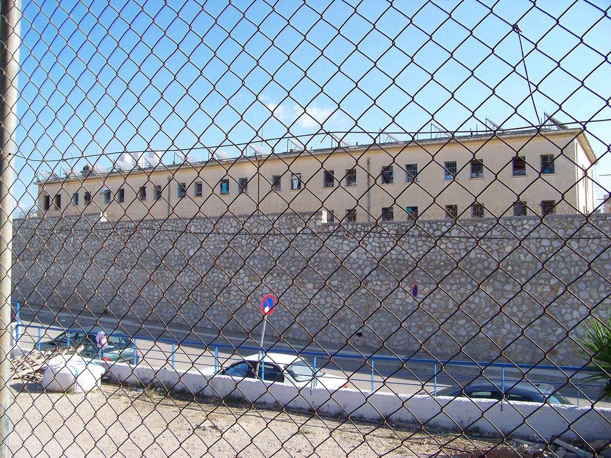
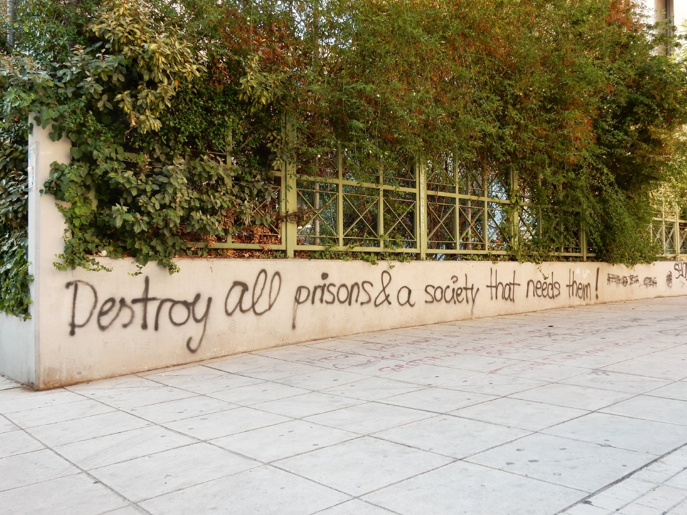
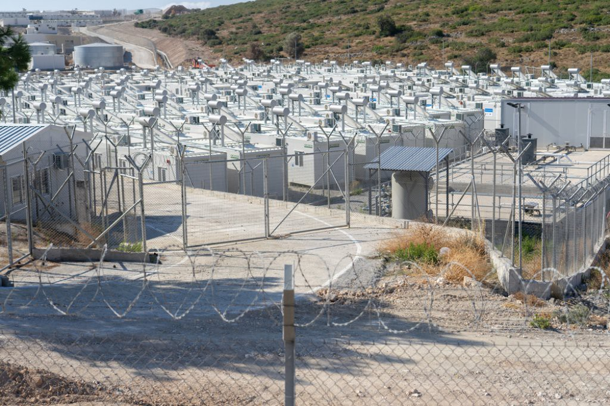
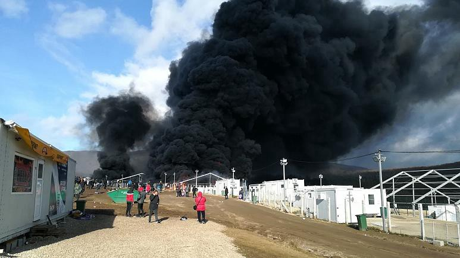
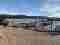
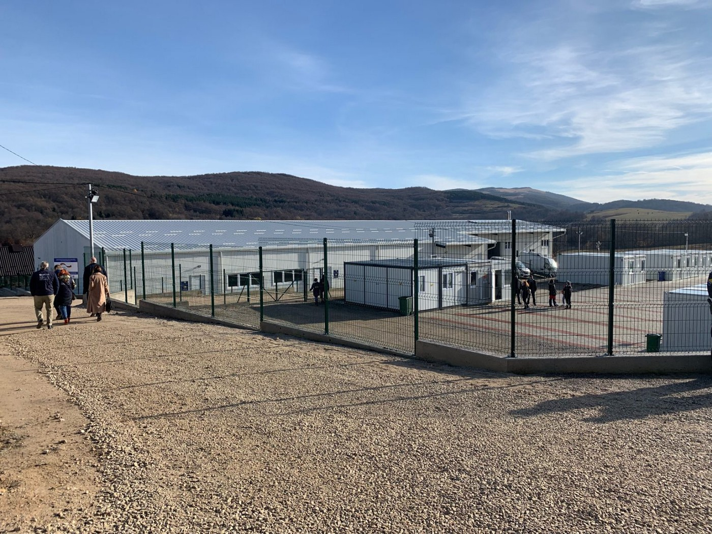

### Digest
### AYS News Digest 18–19/11/21: 7 in 10 people on the move subject to detention in Greece, report finds
### Sarah, Sean & Nassos trial delayed // 10 people die in the Med // Government makes Samos camp into prison // New camp opens in Bosnia // Updates from Poland\-Belarus

[Are You Syrious?](?source=post_page-----feb668b7d02-----------------------------------)

[Nov 20](ays-news-digest-18-19-11-21-7-in-10-people-on-the-move-subject-to-detention-in-greece-report-feb668b7d02?source=post_page-----feb668b7d02-----------------------------------) · 13 min read

**\*Before we get into the feature, a quick note\*:** If you like the work we do and have thoughts on how we can improve the digests, please take a moment to fill out [this survey](https://www.survio.com/survey/d/W2B7R1I4A7Q3K9L1O?fbclid=IwAR1CnrZlxirgSu1qScrOL4dDRStKBIooUl0ic1CCNKbhMs4zep0Qs5vLQT8) to help direct our future operations\. The link will close Sunday at 16h CET\. Thank you, dear readers\!
### FEATURE — In Greece, detention of PoM is ‘the default,’ new research shows

Korydallos Prison outside Athens, Greece’s largest jail and a maximum\-security prison\. \(Photo: [Flickr, CC 2\.0](https://www.flickr.com/photos/23899489@N02/15485307155/) \)

A new report published by Oxfam and the Greek Council for Refugees found that seven in 10 people on the move are placed in ‘administrative detention’ in Greece — a practice which the report’s authors say violates human rights\.

“In Greece, the detention of migrants is the rule, not the exception,” Vasilis Papastergiou of the Greek Council for Refugees \(GCR\) said upon the report’s release\.

The report, entitled [“Detention as the default: How Greece and the EU are generalising the administrative detention of migrants,”](https://policy-practice.oxfam.org/resources/detention-as-the-default-how-greece-with-the-support-of-the-eu-is-generalizing-621307/) found an “excessive use of administrative detention” for some 3,000 people on the move as of June 2021\. Administrative detention refers to the imprisonment of an individual without any charges being filed against them\. The report found that 70% of people on the move were subjected to this kind of detention, while the majority remained detained even while their asylum claim was being processed\.

“Administrative detention is just another tool to stop people from seeking safety in Europe,” Papastergiou of GCR said\. “Europe’s hands not clean, either, as the EU funds the new ‘closed and controlled’ quasi\-detention centres, places where migrants are left to be forgotten\.”

Nearly half of those detained \(46%\) remained in administrative detention for over six months, while one in five people were held for long periods of time in police cells, normally designed to hold individuals for only a few hours\. Pregnant women, children and people with disabilities were detained without proper access to health care and legal aid, the report added\.

Graffiti in the Exarcheia neighborhood of Athens\. \(Photo: [Flickr, CC BY\-NC\-SA 2\.0](https://www.flickr.com/photos/aestheticsofcrisis/50143464926/in/photostream/) \)

As Greece has pursued a harder line towards migration in recent years, the country’s approach to detention has adapted\. In 2019, the Greek parliament passed the [International Protection Act \(IPA\)](https://www.hellenicparliament.gr/UserFiles/bcc26661-143b-4f2d-8916-0e0e66ba4c50/dietnis-prostasia-pap-aposp.pdf) , which made it easier to detain people on the move once they arrived in the country — including after their asylum processes had begun\. Under the IPA, people could be detained for the purposes of verifying their identity; as people on the move often arrive in Greece lacking certain documents, the process to determine someone’s identity can take time\.

In the EU, administrative detention is supposed to be a last resort, but the IPA allowed that in certain cases authorities did not have to find alternatives before detaining someone\. Greece also introduced an amendment to allow authorities to detain people for up to three years\. \(For more on the IPA, [read here](https://asylumineurope.org/reports/country/greece/detention-asylum-seekers/legal-framework-detention/grounds-detention/#_ftn2) \. \)

In 2016, just under 15,000 people, 4,000 of whom were asylum\-seekers, were administratively detained in Greece, according to the report\. Just three years later, in 2019, this number had exploded to 30,000 detained, of which some 23,000 were asylum\-seekers\. The numbers decreased slightly the following year due to the pandemic\.

“We see people die in detention from preventable illnesses and from taking their own lives out of complete desperation,” Erin McKay of Oxfam said\. “Detention of migrants and asylum seekers is not and cannot be the default\. The Greek authorities must use alternatives to detention and not punish people for wanting to build a life in Europe\.”
### SEA/SAR
### MSF’s Geo Barents heads to Sicily, carrying bodies of 10 people who lost their lives on the deadly sea crossing

Doctors Without Border’s rescue ship Geo Barents is heading for port in Messina, Sicily, to disembark its 186 passengers\.

However, also aboard the ship are the bodies of 10 people whom MSF found dead in the lower deck of an overcrowded boat during a rescue some 30 nautical miles off the Libyan coast on November 16\.

During the rescue of the 99 survivors, some of the people aboard told MSF that there were more people below deck, according to an [MSF press release](https://www.msf.org/ten-more-lives-lost-deadly-mediterranean-sea-migration-route?fbclid=IwAR2UTXm_IQ5FsGqMBdDOUUvpHZ3vTMiDkiej1bVTp0LERK9JtsKRzHoM284) \. MSF workers found the bodies of the 10 people below the deck\. Survivors told them that these individuals had spent more than 13 hours in the tight hold, which reeked of boat fuel\. MSF believes the people died of suffocation\.

“It took us almost two hours to retrieve them and to bring them on board, so they can have a dignified burial once arrived onshore,” said Fulvia Conte, MSF Deputy Search and Rescue team leader on board the Geo Barents\.

“It was horrific and infuriating at the same time,” she continued\. “This is another tragedy at sea that could have been avoided\.”
### Libyan ‘coast guard’ threatens SeaWatch4 with kidnapping

The rescue organization Sea Watch published a radio transmission on its Twitter of a conversation between a Libyan coast guard vessel and the crew of Sea Watch 4, which is currently on mission in the Central Mediterranean\.

The Libyan patrol boat captain asks the Sea Watch 4 to change course and leave the area; when Sea Watch 4 responds that they are not in Libya’s territorial waters and have every right under international law to be there, the Libyan captain responds that he will “take you back with us to Libya\. You know the rules of Libya\. Leave right now\!”

Some hours later, Sea Watch [tweeted](https://twitter.com/seawatch_intl/status/1461436163785383937) that the situation aboard had “calmed down,” but added: For years the \#EU has relied on this cooperation with the so\-called Libyan Coast Guard that violently prevents people from fleeing and is not too shy to threaten rescue ships\. Europe must finally end this dirty partnership\!”

Prior to this confrontation, Sea Watch 4 announced it had rescued two boats in distress, one with [96 people aboard](https://twitter.com/seawatch_intl/status/1461361749710434309) \(six of them in the water at the time of the rescue\), and another with [24 individuals](https://twitter.com/seawatch_intl/status/1461362733207592965) \. All 120 people are now safely aboard the ship\.
### GREECE
### Greece closes Samos camp for those with no valid ID, or with second asylum rejection, turning the camp into a prison for many

Zervou camp on Samos \(Photo: [MSF](https://www.infomigrants.net/en/post/35160/new-refugee-camp-on-samos-like-a-prison-says-msf) \)

It was a move we all saw coming when the first images of the new Zervou camp on Samos were released\. The tall, barbed\-wire fences\. The metal detectors at the entrance\. The ubiquitous cameras\. The bare desolation\.

The Greek Ministry of Migration announced that it will close the camp for those people who do not have a valid ID or who have received a second rejection on their asylum claim\.

The decision was [decried by advocates](https://www.samos24.gr/archives/76131?fbclid=IwAR0rFI0z4huJLxQboxyyrI4GRHYQwNdNccE9Shj_w0lSDo7YR-iApaMmjsY) , who demand “the immediate removal of the decision to deprive them of an exit, the guarantee of the freedom and dignity of all residents of KED Samos and their free access to their basic needs\.”

After the decision was announced, camp residents protested, holding signs, one of which read, “Zervou jail\. Our rights was denied\. No going to school\. No going to market\.”

\(Photo: [Europe Must Act](https://twitter.com/EuropeMustAct/status/1461344109822504971?fbclid=IwAR3IAhb0moqLX-_8zd0MgWBE-Kg76BgABGjEo035VhOMmG5YA2nxcaqOe4o) \)

Dozens of people were detained at the protest, [Europe Must Act](https://twitter.com/EuropeMustAct/status/1461344109822504971?fbclid=IwAR3IAhb0moqLX-_8zd0MgWBE-Kg76BgABGjEo035VhOMmG5YA2nxcaqOe4o) wrote on Twitter\. “Barbed wire, curfew, no freedom of movement — the camp is a prison for its hundreds of residents,” the group said\.

Meanwhile, while Greece’s camps are turning into prisons overnight, many people are still not receiving their cash assistance\.

With opportunities for people on the move narrowing rapidly in Greece as the government adopts draconian policies, people are leaving the country in any way they can\. While sea routes are certainly more deadly, the closed borders in the interior of Europe lead people to rely on smuggler networks to move through the continent\. There is no accountability for such clandestine services\.

And with no accountability, disaster is sure to flourish, as it tragically did this week when [a smuggler’s van crashed](https://www.keeptalkinggreece.com/2021/11/19/egnatia-migrants-traffic-accident-police-chase/#.YZdni3Kg_sY.facebook) during a police chase in northern Greece, killing seven people on the move trapped inside and injuring eight others\. Some of those injured are in critical condition\.

The driver, a Moldavian national, was driving near the city of Xanthi on the Egnatia highway, a major roadway in northern Greece, when a police car signaled for him to stop\. The man increased his speed and the police gave chase\. Unable to control the vehicle, the driver crashed the car, and the people traveling inside paid the price\.

Cracking down on small\-time smugglers is not the way to prevent tragedies like this one\. The only way to avoid such needless deaths is to change the system that forces people into such desperate situations in the first place — allow them to travel freely, and safely, to their destinations\. Closing borders does not mean that you will stop people from coming\. It only makes their journeys harder, pushing them to put themselves in harm’s way and threatening their lives needlessly\.
### SERBIA
### More needless deaths along smuggling routes

In another recent case that tragically mirrors the one from northern Greece, two people on the move lost their lives in southeastern Serbia this week after a smuggler’s van overturned near the city of Pirot, [local media reported](https://www.rts.rs/page/radio/ci/story/27/radio-beograd-1/4588472/prevrnuo-se-kombi-s-migrantima--dvoje-poginulih.html) \.

Twenty additional people were being treated in a local hospital; 19 of them are minors\. A 39\-year\-old man from Belgrade was arrested on suspicion of smuggling, media reported\.
### BOSNIA
### New Moria\-style camp opens in NW Bosnia

The new and ‘improved’ \(camp officials would say\) Lipa camp has opened outside the Bosnian city of Bihać, in the country’s northwest, [media reported](https://ba.n1info.com/english/news/newly-built-lipa-migrant-centre-opens-in-bosnia/?fbclid=IwAR34FL9d7Pbzd1t5kP0efAZtekAU5bGUJtZKg8lvYGxRtjFOwdioaPJNi7w) \. The old Lipa camp [burned to the ground](https://www.euronews.com/2020/12/23/huge-fire-breaks-out-at-lipa-migrant-camp-near-bosnia-s-border-with-croatia) in a fire last December, leaving over a thousand people without shelter in freezing conditions\.

While the old Lipa camp was only for men, this new facility will be like Lesvos’ Moria camp: built for 1,500 people, the camp will also accommodate families and unaccompanied minors, in addition to single men, who make up the majority of the population of people on the move in the area\.

Lipa has long been criticized as a woefully inadequate facility\. Far from the city, there are no services in the area and little public transportation to get into Bihać\. The old camp was initially designed for summer weather, and as winter approached last year, authorities still had not winterized the tents properly and heating and electricity were either intermittent or non\-existent\. People were really left to freeze in the middle of nowhere\.

Lipa camp on fire in December 2020\. \(Photo: [AP](https://www.euronews.com/2020/12/23/huge-fire-breaks-out-at-lipa-migrant-camp-near-bosnia-s-border-with-croatia) \)

Now, nearly a year since the fire, Bosnian and other officials are patting themselves on the back as the new camp opens\.

“We are completely ready for the winter,” said Slobodan Ujic, director of the Service for Foreigners’ Affairs \(SFA\), the Bosnian agency tasked with certain migration duties\. Ujic thanked the European Union, “without which BiH would not be able to provide conditions for migrants\.”

The new Lipa is the first camp managed entirely by the SFA, “a symbol of the state that took matters into its own hands” and a “turning point,” in Ujic’s words\.

The facility was also extolled by Johann Sattler, head of the EU Delegation to Bosnia, who said: “Today we are here and we are in the middle of the migrant Lipa camp\. This is the result of effective cooperation between the Ministry of Security, local authorities, the EU and it is proof that the cooperation produces results\. This is a good indicator that dialogue is resolving the crisis\.”

Sattler called Lipa “a success story of BiH\.”

Anyone who even drives by the camp for ten seconds would hardly call it a success story\. The camp looks like a prison, surrounded by a high fence, the Isoboxes where people will live appearing ill\-suited for freezing Balkan winters\. Really, if this is a ‘success story,’ we have to radically rethink our notion of success\.

The new Lipa \(Photo: [N1](https://ba.n1info.com/english/news/newly-built-lipa-migrant-centre-opens-in-bosnia/?fbclid=IwAR34FL9d7Pbzd1t5kP0efAZtekAU5bGUJtZKg8lvYGxRtjFOwdioaPJNi7w) \)
### BELARUS / POLAND

Once again, there is a great deal of news from the Polish\-Belarusian border\. Here is a quick roundup:
- [A one\-year\-old Syrian child died on the border late this week](https://www.theguardian.com/world/2021/nov/18/one-year-old-syrian-child-dies-in-forest-on-poland-belarus-border?fbclid=IwAR2UTXm_IQ5FsGqMBdDOUUvpHZ3vTMiDkiej1bVTp0LERK9JtsKRzHoM284) , the youngest known person to lose his life for the sake of the EU’s fight with Belarus\.
- Dunja Mijatović, Council of Europe Commissioner for Human Rights, recently returned from a four\-day visit to the border and [said “urgent action” was needed to save lives\.](https://www.coe.int/en/web/commissioner/-/commissioner-calls-for-immediate-access-of-international-and-national-human-rights-actors-and-media-to-poland-s-border-with-belarus-in-order-to-end-hu?fbclid=IwAR0rFI0z4huJLxQboxyyrI4GRHYQwNdNccE9Shj_w0lSDo7YR-iApaMmjsY)
- [Belarus’ Lukashenko said it was “absolutely possible” his forces helped people cross into the European Union, but denied inviting them to the country\.](https://www.aljazeera.com/news/2021/11/19/lukashenko-says-troops-may-have-helped-refugees-reach-eu?fbclid=IwAR3Z5V6e5S8C2vOtTwgxIlr-53O4H9BVTQXaE8KYq8nrGvucibEPrn5lhF0)
- After being escorted away from the Polish border late this week by Belarusian border guards, [people on the move are now sleeping in a warehouse at the Bruzgi checkpoint\.](https://twitter.com/HannaLiubakova/status/1461454629888311296)
- [On Thursday, Polish authorities detained about 100 people who had entered the country from Belarus\.](https://www.infomigrants.net/en/post/36574/renewed-clashes-on-border-as-pressure-on-belarus-mounts?fbclid=IwAR29j-oEEfxtyAY_5owmhXKXPhD8yDMzhehvyWaNF14E9dCsEa6TCliePHQ)
- [Over 400 Iraqi Kurds arrived back in Kurdistan on repatriation flights from Belarus\.](https://twitter.com/K24English/status/1461387786171387912) More repatriation flights are expected as people find themselves unable to move forward into Europe and freezing to death in the border forests\.
- [Activists are paying tribute to Ahmad al\-Hasan, the 19\-year\-old Syrian who drowned recently in the Bug river in eastern Poland\.](https://www.facebook.com/rethinkrefugees2018/posts/1317291292060183) He was buried on Monday in a Muslim cemetery in the town of Bohoniki, with his parents watching the ceremony on a video call\.
- Dunya Collective published an important thread about [false information about the border spreading in Telegram channels\.](https://twitter.com/DunyaCollective/status/1461396769183576070)
- Germany’s outgoing Interior Minister Horst Seehofer [said it was fake news that Germany would accept people stuck in Belarus\.](https://www.infomigrants.net/en/post/36613/false-rumors-fuel-migrants-hopes-of-reaching-germany?fbclid=IwAR1FZ75lBHcFb6quG2ulkSKSEeITnKjqqc4vUVqbeRdq3gaQ2SYqwXEbKaI) “What we will not do is to take in refugees\. We will not give in to pressure,” he said\.

### GENERAL
### Trial of Sarah, Sean and Nassos delayed, must go to higher court

The trial was postponed before it even started\. On Thursday, the widely\-publicized case of Sarah, Sean and Nassos was slated to begin at the Lesvos courthouse in Mytilene\. Sarah was unable to attend the trial at all, as Greece refused to lift the travel ban it had imposed on her\.

The trial, however, was immediately delayed; as Sean is a lawyer, the case must be heard at a higher court\.

While the news may seem positive at the moment, in the long term, what it means is just more waiting in limbo for the three defendants\.

“It’s frustrating that we have to wait more and redo everything we were working on,” Sarah Mardini said in a [press release from Free Humanitarians](https://twitter.com/g_christides/status/1461324193912524806) \. “But I’m optimistic because we are not alone and the people are fighting for us and with us\.”

“We’ll have to wait months longer for justice,” Sean said, “and the criminalisation of humanitarianism continues\.”

Human rights watchdogs worry about the precedent the trial could set if the volunteers are found guilty\.

“To what have we come that we go against people who are offering solidarity?” [said](https://www.ohchr.org/EN/NewsEvents/Pages/DisplayNews.aspx?NewsID=27827&LangID=E&fbclid=IwAR2UI3QEz8BTdR65TpGbtk9ZR8jl5MF_VCZZxG3C_cZx6OXCfR5_IuJE_v0) Mary Lawlor, UN Special Rapporteur on the situation of human rights defenders\. “A guilty verdict for Ms\. Mardini and Mr\. Binder would be a dark day for Greece, and a dark day for human rights in Europe\.”

It is also worth noting that journalists were barred from entering the courtroom on the day of the trial — an outright flouting of press freedom\.
### WORTH READING
### Der Spiegel \(in English\): New Details Shed Light on Lukashenko’s Human Trafficking Network

Insiders reveal fresh details about Belarusian dictator Alexander Lukashenko’s inhumane smuggling system, comprised of a network of front companies that spreads to Syria, Turkey and Iraq, secret money transfers and the use of soldiers as traffickers\.
### [New Details Shed Light on Lukashenko’s Human Trafficking Network](https://www.spiegel.de/international/europe/new-details-shed-light-on-lukashenko-s-human-trafficking-network-a-0530454b-a588-4811-98a7-bb2cb180abe8?sara_ecid=soci_upd_KsBF0AFjflf0DZCxpPYDCQgO1dEMph&fbclid=IwAR0s44XXqVdWyTksEUFWLNFC3wVfzK0WMo7TRJWo99cNzxXKes7HOFqfAis)
### [Ahead of him, Mhamad can see barbed wire and then Polish soldiers\. Their faces are covered and they are armed\. When…](https://www.spiegel.de/international/europe/new-details-shed-light-on-lukashenko-s-human-trafficking-network-a-0530454b-a588-4811-98a7-bb2cb180abe8?sara_ecid=soci_upd_KsBF0AFjflf0DZCxpPYDCQgO1dEMph&fbclid=IwAR0s44XXqVdWyTksEUFWLNFC3wVfzK0WMo7TRJWo99cNzxXKes7HOFqfAis)

[www\.spiegel\.de](https://www.spiegel.de/international/europe/new-details-shed-light-on-lukashenko-s-human-trafficking-network-a-0530454b-a588-4811-98a7-bb2cb180abe8?sara_ecid=soci_upd_KsBF0AFjflf0DZCxpPYDCQgO1dEMph&fbclid=IwAR0s44XXqVdWyTksEUFWLNFC3wVfzK0WMo7TRJWo99cNzxXKes7HOFqfAis)
### Novara Media: How Europe’s Migrant Crisis Reached the Canary Islands

The tourist hotspot has become a death\-trap for migrants\.
### [How Europe’s Migrant Crisis Reached the Canary Islands \| Novara Media](https://novaramedia.com/2021/11/16/how-europes-migrant-crisis-reached-the-canary-islands/?fbclid=IwAR257-5yDd_do1G_S8DX5QAXedQPYfnTGvz-ib3ioho8ao-Ci_CflxnKJ5s)
### [For more than 50 days, audiences have viewed extensive footage of an extraordinary volcanic eruption on the Canary…](https://novaramedia.com/2021/11/16/how-europes-migrant-crisis-reached-the-canary-islands/?fbclid=IwAR257-5yDd_do1G_S8DX5QAXedQPYfnTGvz-ib3ioho8ao-Ci_CflxnKJ5s)

[novaramedia\.com](https://novaramedia.com/2021/11/16/how-europes-migrant-crisis-reached-the-canary-islands/?fbclid=IwAR257-5yDd_do1G_S8DX5QAXedQPYfnTGvz-ib3ioho8ao-Ci_CflxnKJ5s)
### EU Observer \[exclusive\]: Revealed: EU plan to make 1,400 people\-smuggling arrests in 2022

A leaked internal document has revealed the detail of dozens of operational plans to crack down on migrant smugglers next year, including a target to make over 1,400 arrests — mostly under the aegis of the EU’s border agency Frontex\.
### [\[Exclusive\] Revealed: EU plan to make 1,400 people\-smuggling arrests in 2022](https://euobserver.com/migration/153544?fbclid=IwAR2QC1CJAvqfxcfPVmmlJhHEx0DzBmK_wclqGXgnwM7UnuMUg-I5OpihqvQ)
### [A leaked internal document has revealed the detail of dozens of operational plans to crack down on migrant smugglers…](https://euobserver.com/migration/153544?fbclid=IwAR2QC1CJAvqfxcfPVmmlJhHEx0DzBmK_wclqGXgnwM7UnuMUg-I5OpihqvQ)

[euobserver\.com](https://euobserver.com/migration/153544?fbclid=IwAR2QC1CJAvqfxcfPVmmlJhHEx0DzBmK_wclqGXgnwM7UnuMUg-I5OpihqvQ)
### The Guardian: It was mind\-boggling’: Richard Gere on the rescue boat at the heart of the Salvini trial \(interview\)

The Hollywood actor Richard Gere has revealed for the first time the full story behind his mercy mission to the NGO rescue boat Open Arms as he prepares to testify as a witness against Italy’s former interior minister and far\-right leader, Matteo Salvini, who is on trial for attempting to block the 147 people onboard from landing in Italy\.
### [‘It was mind\-boggling’: Richard Gere on the rescue boat at the heart of Salvini trial](https://www.theguardian.com/global-development/2021/nov/19/richard-gere-open-arms-rescue-boat-heart-of-salvini-trial?fbclid=IwAR0U3TCT1wHFgCntjiVCkiNMVOIIkf4n3Z3icTsDHkNUG9KBbwO63zpRfAw)
### [he Hollywood actor Richard Gere has revealed for the first time the full story behind his mercy mission to the NGO…](https://www.theguardian.com/global-development/2021/nov/19/richard-gere-open-arms-rescue-boat-heart-of-salvini-trial?fbclid=IwAR0U3TCT1wHFgCntjiVCkiNMVOIIkf4n3Z3icTsDHkNUG9KBbwO63zpRfAw)

[www\.theguardian\.com](https://www.theguardian.com/global-development/2021/nov/19/richard-gere-open-arms-rescue-boat-heart-of-salvini-trial?fbclid=IwAR0U3TCT1wHFgCntjiVCkiNMVOIIkf4n3Z3icTsDHkNUG9KBbwO63zpRfAw)

**Find daily updates and special reports on our [Medium page](https://medium.com/are-you-syrious) \.**

**If you wish to contribute, either by writing a report or a story, or by joining the info gathering team, please let us know\.**

**We strive to echo correct news from the ground through collaboration and fairness\. Every effort has been made to credit organisations and individuals with regard to the supply of information, video, and photo material \(in cases where the source wanted to be accredited\) \. Please notify us regarding corrections\.**

**If there’s anything you want to share or comment, contact us through Facebook, Twitter or write to: areyousyrious@gmail\.com**

_Converted [Medium Post](https://medium.com/are-you-syrious/ays-news-digest-18-19-11-21-7-in-10-people-on-the-move-subject-to-detention-in-greece-report-589e7139476e) by [ZMediumToMarkdown](https://github.com/ZhgChgLi/ZMediumToMarkdown)._
