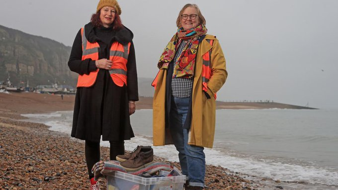
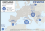
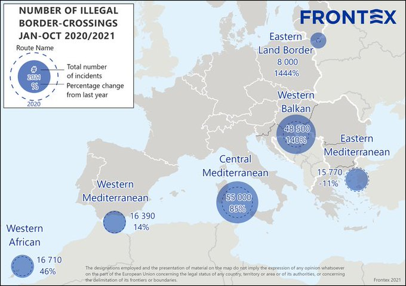

### News Digest: 22\.11\.2021 Lukashenko Interview

[Are You Syrious?](?source=post_page-----c1c56a46ca0c-----------------------------------)

[Nov 23](news-digest-22-11-2021-lukashenko-interview-c1c56a46ca0c?source=post_page-----c1c56a46ca0c-----------------------------------) · 8 min read

**Smugglers profit, despite worsening weather at sea, NGO says//El Hiblu 3 — trial explained//Loss of life near Crete//Lipa Camp Ceremony in BiH//Journalist Arrested in Croatia//Open letter from refugees to the Slovenian Authorities//Thousands protest across France//Danish deportations to Syria//UK Home Office under fire//Frontex figures**
### FEATURE
### Lukashenko talks to the BBC whilst the dead are being buried

Photo Credit: [Jana Shnipelson](https://unsplash.com/@shnipelson?utm_source=unsplash&utm_medium=referral&utm_content=creditCopyText) on [Unsplash](https://unsplash.com/s/photos/belarus?utm_source=unsplash&utm_medium=referral&utm_content=creditCopyText)

A BBC interview with Belarus President Alexander Lukashenko has been released in which he defends election figures and addresses the current border situation\. In the interview, Lukashenko denied inviting migrants to his country, and denied detaining them at the border with Poland\.

Conditions at the border remain terrible\. [Reports of torture](https://www.infomigrants.net/en/post/36657/returned-iraqi-migrants-claim-they-were-tortured-in-belarus-and-poland?fbclid=IwAR232AHGQK2ZVmU4hB7InDXN2NnG7tFJYqO5mjX_Pe0E78KVJ-t4GRSKke0) at the hands of the Belarusian and Polish authorities have been made by Iraqi nationals who have since returned home\. Claims of being treated ‘inhumanely’ and a denial of food and water are among the complaints of those who spent time trapped at the border before being deported\.

This comes amid continuing dire conditions in the border area\. [More than a hundred people](https://twitter.com/demianvonosten/status/1462663728730718217?fbclid=IwAR13LUx8DDZXUxR8wJk7QvyAtrdzrvYtw1--xWr23faJuJ0UeI7Mj7a2f6E) have been taken to hospital due to severe cases of COVID\-19\. [Authorities harass and intimidate](https://twitter.com/GrupaGranica/status/1462880919103197185?fbclid=IwAR1y_GWVsNvNcVLvrfY-2yaLLt_jeft3tnxG0Gm-rnfB2Ub8djNCFrYVHqQ) those trying to help on the Polish side\.

EU Commissioner Ylva Johansson has [published a blog post](https://ec.europa.eu/commission/commissioners/2019-2024/johansson/blog/timetodelivermigrationeu-no20-protect-our-borders-and-protect-people-we-are-shutting-down_en?fbclid=IwAR16BSs5VeVFMSe_adgba6ouuaft-B8EfD_uw9pGuBMeHTRrwR8ZLkIwpLQ) explaining how “Lukashenko has gambled, and lost — at least, for the moment\. Betting on EU sensitivities about migration, he gravely miscalculated\.” She continues by explaining that flights to Minsk from Iraq and Syria have been halted and people are being transported back to their home countries\.

However, [an unnamed EU senior official has stated](https://euobserver.com/world/153574?fbclid=IwAR0xk5lqy5aBY9VMd18Cr4QnxjND1G4lomRSdc_n3K86A3M81z3nrPGM1ys) that it is too early to speak of ‘de\-escalation’\. The organisation IRC have [called for](https://www.rescue.org/press-release/situation-poland-belarus-border-untenable-irc-warns-more-lives-will-be-lost-without?fbclid=IwAR16BSs5VeVFMSe_adgba6ouuaft-B8EfD_uw9pGuBMeHTRrwR8ZLkIwpLQ) “unfettered humanitarian access and a firm defense of the right to asylum at border areas\.”

The situation for women at the border in particular has been highlighted in [a moving piece](https://www.aljazeera.com/news/2021/11/22/refugees-crossing-polish-border-recite-tales-of-horror?fbclid=IwAR273Is3zeJ4Sok6H-QpIAARz0bxcccpD1fEqlFUpxOOD8xi0eoveOI9rIs) with firsthand observations by those affected\.

Access to the ‘area of emergency’ remains forbidden, as [three German journalists face criminal charges](https://bip.brpo.gov.pl/pl/content/rpo-granica-dziennikarze-kara-stan-wyjatkowy-sn-kasacja?fbclid=IwAR2cPmbwO_7IO-BLP6WC042r4jIssfgr328Z_HTrRPCL7LmO0PM2RwUDfOI) for being in the area\. The Ombudsman calls for their acquittal\.

13 people, including a 1 year old child, have now died in the border region\. This includes an unnamed man, likely from Africa, who was laid to rest by the [Tatar Muslim community](https://www.msn.com/en-gb/news/world/unnamed-migrant-buried-near-belarus-border-by-polish-tatars/ar-AAQRG1c?fbclid=IwAR1c-tzZnXLFkobbfIqDGBn8BF8-b_pjcNkoYBOWii-uG-Y5umuIegNb17g) in Poland\. The community also recently buried a Syrian man and the [unborn child](https://wiadomosci.onet.pl/bialystok/bohoniki-we-wtorek-pogrzeb-nienarodzonego-dziecka-migrantow/mr2s7v7?fbclid=IwAR3dqeU9ig02wND8FsO-dFNQY96IkNdzzkhY2DHNn4TJ2-xjNpu8OHkNvjw) of a woman now in a critical condition\. The Tatar community are also providing [food and other aid](https://www-sueddeutsche-de.translate.goog/meinung/migration-belarus-polen-1.5469388?fbclid=IwAR16IqCULsXHJ3KsIFvlNDbcM4F98OU3h3Rt9kOdbC8uju5NKeWixQVvzHc&_x_tr_sl=de&_x_tr_tl=en&_x_tr_hl=en-GB&_x_tr_pto=nui) , with chef Maciej Szczęsnowicz cooking hundreds of portions of hot food for those who arrive frozen and starving\.
### SEA/SAR
### Smugglers profit, despite worsening weather at sea, NGO says\.

Further to the [Weekend Digest](https://medium.com/are-you-syrious/weekend-digest-20-21-11-2021-seventy-five-lives-lost-at-sea-62d2d7d9485) report, stating 75 lives have been lost in the Mediterranean, aid groups have spoken out, saying smugglers are putting people in dangerous conditions\.

> _“These departures are dangerous even when the sea is calm, let alone in these weeks with the storms that have hit the central Mediterranean\.” [Flavio Di Giacomo](https://www.theguardian.com/world/2021/nov/22/aid-workers-say-mediterranean-a-liquid-graveyard-after-75-feared-dead-off-libya?fbclid=IwAR16BSs5VeVFMSe_adgba6ouuaft-B8EfD_uw9pGuBMeHTRrwR8ZLkIwpLQ) , Italy’s spokesperson for the UN’s International Organization for [Migration](https://www.theguardian.com/world/migration) \(IOM\) \._ 

This comes as news of a [newer route](https://www.npr.org/2021/11/22/1057886475/sailboats-packed-with-migrants-seek-italy-on-lesser-known-migration-route?s=09&t=1637614169288&fbclid=IwAR2cPmbwO_7IO-BLP6WC042r4jIssfgr328Z_HTrRPCL7LmO0PM2RwUDfOI&t=1637657516290) , from Turkey to Calabria, Italy\. The less\-known route employs expensive sailing boats over a much larger stretch of ocean\.

[Three boats were reported in distress](https://twitter.com/alarm_phone/status/1462727055204925445?fbclid=IwAR3dqeU9ig02wND8FsO-dFNQY96IkNdzzkhY2DHNn4TJ2-xjNpu8OHkNvjw) inside the Maltese SAR zone\. Full details were not known, but 60 people were rescued and taken to Italy\.

Also involving Italy, two four\-month\-old babies were among 79 people rescued and taken to Santa Maria di Leuca port\. The island of Lampedusa saw [six boat landings](https://www.ansa.it/sito/notizie/cronaca/2021/11/22/migranti-a-lampedusa-6-sbarchi-con-349-persone_635993a8-25a3-4952-80b9-674afe856857.html?fbclid=IwAR0fMgyM82TnC50QoFUHkU3FHGd6MrC__mY7Dq9lroN3oS_G-9wUwsSnRjg) , totaling 349 people\.

Meanwhile, [close to 600 people](https://www.efe.com/efe/canarias/sociedad/ocho-nuevos-rescates-elevan-a-589-las-personas-llegadas-en-patera-canarias-desde-el-sabado/50001312-4681324?fbclid=IwAR3xGx9ULGeueBbuhvs4KAY5z7FeFYkbhU08GbKw4ApW7NiFb8cNnamAv_I) arrived by boat to the Canary Islands\. In a series of eight rescues since Saturday, landing on Lanzarote, Gran Canaria and Fuerteventura\.
### MALTA
### El Hiblu 3 — trial explained

The El Hiblu 3 — a group of three young men accused of, among other charges, terrorism, is ongoing\. [Lawyer Neil Falzon explains the case](https://www.proasyl.de/news/el-hiblu-3-wir-fechten-einen-informationskrieg-aus/?fbclid=IwAR0jy-VV2lmZSn4JBpTeALPMpKVKMQwR86e0E3OznkOlAGkbY4IWTCzVF4w) \. The men were part of a group of 108 people rescued by a merchant ship\. The young men convinced the captain not to return them to Libya\.
### GREECE
### Loss of life near Crete

One person has been found dead off the island of Crete\. A rescue operation on Monday saw 70 men, women and children from Syria rescued from a sinking vessel, but sadly, one fatality occurred\.

[Criticism has been voiced in response to a poll](https://twitter.com/EleniKonstanto/status/1462835468194701316?fbclid=IwAR25ixrGGQE7YNP-vYN71Jg0sMyU5WUE7mXNXFVjTbN_vTS5cFOpLPmo4C0) released by the Greek Minister for Migration, Notis Mitarachi\. The poll stated that 62% of residents of the North Aegean islands prefer the creation of ‘closed controlled structures’\. No details as to sample size, demographic or questions asked were provided\.

Athens has become a hub for Afghan women\. American philanthropist Ahmed Khan, who coordinated weeks of evacuations when Kabul fell, is an old friend of the Prime Minister’s wife\.

> [_“I texted the Greek prime minister’s wife_](https://www.politico.eu/article/how-athens-became-the-unexpected-hub-for-afghan-women/?fbclid=IwAR0jy-VV2lmZSn4JBpTeALPMpKVKMQwR86e0E3OznkOlAGkbY4IWTCzVF4w) _, Mareva \[Grabowski\], who is an old friend, and I told her I have this situation,” he said\. “An hour later, Greece said, ‘Yes, we will take them\.’ I didn’t even have to pitch this to them\.”_ 

This has resulted in around 700 female politicians, judges, lawyers and journalists along with their families arriving in the Greek capital\.
### BOSNIA HERZEGOVINA
### Lipa Camp Ceremony

November 21st 2021 saw the reopening ceremony of Camp Lipa in the Una Sana Canton of Bosnia Herzegovina\. The mountain\-top tent encampment has faced constant problems\. [This statement](https://theborderstartshere.com/2021/11/21/reopening-lipa-camp/?fbclid=IwAR0JxV-AFWonDpj_rweTbcyqStKSHFlojSR_KpgfA2WCo3U8V8-Um_VN_K4) details the history of the camp and the current issues\.
### CROATIA
### Journalist Arrested

[A German journalist was arrested](https://www.spiegel.de/ausland/kroatien-deutscher-journalist-an-der-seite-von-fluechtenden-festgenommen-a-0c3a58e2-a00a-4b58-9a58-b9597c1129e3?fbclid=IwAR3dqeU9ig02wND8FsO-dFNQY96IkNdzzkhY2DHNn4TJ2-xjNpu8OHkNvjw) with a group of seven asylum seekers crossing the border from Bosnia Herzegovina on Friday\. A charge of human smuggling was dropped, whilst the 44 year old German man was instead charged with crossing the border illegally and fined 3,600 kuna \(aprox\. 500 euros\) \.
### SLOVENIA
### Open letter from refugees to the Slovenian Authorities

Criticism of the language learning system used in Slovenia, among other things, is shared in [a letter from the refugee community](https://www.facebook.com/Tukajsmo/posts/564862054618733) \. Reportedly, only 300 hours of language lessons are provided before newly arrived refugees are required to take the A1 language exam\. Access to work, housing and integration activities are also limited\. “How are we supposed to integrate into society when everyone here thinks we are criminals?”
### FRANCE
### Thousands protest across France

Photo Credit: [Utopia 56](https://www.facebook.com/U56ParisIDF/posts/2780858972213545)

[1,500 people protested](https://www.facebook.com/U56ParisIDF/posts/2780858972213545) in Paris against the treatment of exiled people\. Similar events occurred in other French cities, as participants called for an end to violence, a fairer system and for solidarity\. This comes amidst [further evictions](https://twitter.com/AbdulSaboorJan/status/1462693333768278021?fbclid=IwAR2d7MzLJkdjAiS1LoFSAxGenGUQ-g-SwfMZAESlSXf9F3cBxbtKuo8dt64) near the town of Dunkirk in Northern France, resulting in people searching the remains of burnt tents for their belongings\.

Also in Northern France, police are [being equipped with high\-tech equipment](https://rp-online.de/panorama/ausland/frankreich-gibt-11-millionen-euro-gegen-migration-ueber-aermelkanal-aus_aid-64210713?fbclid=IwAR0rVqJ0HEWxEKEPVqdIiWxmxdIkp5qQ0uomzTYhZOC1Mp7McaVCh8D2IiE) in order to prevent boat crossings to the UK\. 11 million euros is to be spent on all\-wheel drive vehicles, night vision devices and thermal imaging cameras\.
### DENMARK
### Danish deportations to Syria

[This article](https://www.dailymail.co.uk/news/article-10225873/Even-liberal-Denmark-sending-refugees-home-Syria-safe-writes-IAN-GALLAGHER.html?fbclid=IwAR2d7MzLJkdjAiS1LoFSAxGenGUQ-g-SwfMZAESlSXf9F3cBxbtKuo8dt64) compares the British and Danish approaches to asylum seekers, as Denmark continues to revoke residence permits of people from Damascus, Syria, claiming it is now safe\. [Reports of people returning and then going missing](https://foljeton-dk.translate.goog/141129/pinagtigt-og-skamfuldt-og-nu-ogsaa-usolidarisk?fbclid=IwAR2giwTLekk0qQJZVv0RAqvL5YdoPJMhj47keMuSQJw6PFFGRqWKCCtHeHY&_x_tr_sl=da&_x_tr_tl=en&_x_tr_hl=en-GB&_x_tr_pto=nui) have sent waves of concern through the community\. This comes as Amnesty International [launches a poster campaign](https://twitter.com/lembergpedersen/status/1462883206609444869?fbclid=IwAR3jjU6fWI2i28EAaaW4-2Tz0Lvvnr6-_aGQtVhYgS-G7yhgVcohGrJcV9Q) relating to the EU’s border policy\.
### UK
### UK Home Office under fire

Rachel Lowden and Jane Grimshaw, welcoming refugees to the UK Photo Credit: [Hastings Community of Sanctuary](https://twitter.com/HastSanctuary/status/1462581253731926018?fbclid=IwAR3xGx9ULGeueBbuhvs4KAY5z7FeFYkbhU08GbKw4ApW7NiFb8cNnamAv_I)

With the number of people arriving via small boats to the UK rising, Prime Minister Boris Johnson has called for an [‘urgent review’](https://www.independent.co.uk/voices/editorials/boris-johnson-priti-patel-immigration-b1961394.html?fbclid=IwAR2wGUCobVpATALeZ3T9tiMBxsV_ivaMy40EAvLWZKctBsgqYRekNfD1PJ0) into the asylum system\.

Criticism of Home Secretary, Priti Patel has been the topic of many publications\. [Charities have claimed](https://www.theguardian.com/uk-news/2021/nov/20/home-office-covering-up-its-own-study-of-why-refugees-come-to-the-uk?fbclid=IwAR0E2n1uo74A7cQ1qysOj9ZrPVlFiC-jLAlrwPHlc7c5XktFIsUkazyFrB8) the government is covering up it’s own study that sought to find the reasons why people travel to the UK\. However, there is speculation that the study will contradict the government’s strategy of removing the ‘pull factor’ — making the UK a less desirable destination\. Priti Patel has [praised the Greek system](https://twitter.com/BeckettUnite/status/1461970967471788034?s=20&fbclid=IwAR3Vhnhvj26r_KHYbWZreV5itH0CQJoO_MPqeQINrhVVvRLaJZfZUpD9kxg) which utilises illegal methods and cruel treatment of people who arrive, whilst UK charity [KRAN explained](https://www.theguardian.com/world/2021/nov/22/performative-cruelty-uk-treatment-refugees-worst-ever-charity-kent-boats?fbclid=IwAR20swORO67r-Tcj2mFEbb9n6HW3l9_qS-d0zGXXS-B94M1bcmyM6sGkkCE) how ‘toxic language’ related to Brexit has changed public attitudes towards those arriving\.

Outlandish and cruel methods are being suggested in order to deter people from wanting to come to the UK\. These include off\-shore reception centres — locations of which range from Albania to [Islas Malvinas \(Falkland Islands\)](https://www.theguardian.com/world/2021/nov/21/migrant-crossings-are-becoming-a-problem-for-red-wall-tory-mps?fbclid=IwAR0JxV-AFWonDpj_rweTbcyqStKSHFlojSR_KpgfA2WCo3U8V8-Um_VN_K4) , located in the South Atlantic near Argentina\.

[This article](https://www.freemovement.org.uk/nine-problems-with-the-asylum-system-that-priti-patel-cant-blame-on-anyone-else/?fbclid=IwAR1dNke-FA0mgsDSl1GiKjBoVaevA5MMVRGuy0D2M2d0bhDqRO05Bg-IlO0) gives a thorough explanation as to the failures of the current system by explaining in plain English how the system currently functions\.
### EU \+ FRONTEX
### Frontex figures

Photo Credit: [Frontex via Twitter](https://twitter.com/dgatopoulos/status/1462894078232825861?fbclid=IwAR2XFismvKYb9nqpcFubMFrp5z1UhGBYYsfPMj36OT5YfTTKHfH089nY1Bw)

The increasing tensions at the border areas of the European Union are the subject of [this analysis](https://digit.site36.net/2021/11/22/european-union-and-nato-military-police-and-secret-services-against-hybrid-threats/?fbclid=IwAR1dNke-FA0mgsDSl1GiKjBoVaevA5MMVRGuy0D2M2d0bhDqRO05Bg-IlO0) of the interactions between EU nations in response to the toxic term ‘hybrid attacks’\. Whilst [this post](https://twitter.com/dgatopoulos/status/1462894078232825861?fbclid=IwAR2XFismvKYb9nqpcFubMFrp5z1UhGBYYsfPMj36OT5YfTTKHfH089nY1Bw) shows how Frontex have calculated the numbers of new arrivals to the EU\.
### FURTHER READING and LISTENING

P [odcast](https://podcasts.apple.com/gb/podcast/episode13-blocked-from-reaching-the-central/id1574079272?i=1000542615303&fbclid=IwAR3jjU6fWI2i28EAaaW4-2Tz0Lvvnr6-_aGQtVhYgS-G7yhgVcohGrJcV9Q) by The Civil Fleet talks to Alberto Mayordomo — head of Open Arms rescue fleet in the Med\.

A law perspective on the issue of criminalising human trafficking\. [Putting The ‘Justice’ \(Back?\) Into The ‘Criminal Justice Approach’ To Anti\-Trafficking](https://www.law.ox.ac.uk/research-subject-groups/centre-criminology/centreborder-criminologies/blog/2021/11/putting-justice?fbclid=IwAR2wGUCobVpATALeZ3T9tiMBxsV_ivaMy40EAvLWZKctBsgqYRekNfD1PJ0)

Use of language in discussing migration issues\. [The language of migration](https://www.routedmagazine.com/issue-17?fbclid=IwAR28rR_KmxAzNErIxxthsapHIxDhpjdZBkuRZQNkPl4kL8HVkUqaDvDPe8E)

Problems in Kurdistan [Why Are Iraqi Kurds Fleeing to Europe?](https://newlinesmag.com/essays/why-are-iraqi-kurds-fleeing-to-europe/?fbclid=IwAR1P9AQC_mtGBluSiVG6wtA7ta9_RQeT9V_k2kGdor4AQdcDd65EGD82Eg8)

Problems for Yaizidi people [They survived the Islamic State\. But can Yazidi refugees make it out of Belarus?](https://www.nzz.ch/english/yazidis-and-kurds-among-the-many-crossing-from-belarus-to-poland-ld.1654752?fbclid=IwAR0xk5lqy5aBY9VMd18Cr4QnxjND1G4lomRSdc_n3K86A3M81z3nrPGM1ys) As well as [Yezidi migrants say human traffickers deceived them](https://www.kurdistan24.net/en/story/26317-Yezidi-migrants-say-human-traffickers-deceived-them%C2%A0?fbclid=IwAR1JH_8ZxZMAZezYpARYSfhh1A8bzvJrsXqiR68WRXl8WHKZSCCkuR9hWSc)

Books to buy [Refuge: How the State Shapes Human Potential](https://press.princeton.edu/books/paperback/9780691203843/refuge?fbclid=IwAR2XFismvKYb9nqpcFubMFrp5z1UhGBYYsfPMj36OT5YfTTKHfH089nY1Bw)

[Migration and the European Convention on Human Rights](https://oxford.universitypressscholarship.com/view/10.1093/oso/9780192895196.001.0001/oso-9780192895196?fbclid=IwAR0E2n1uo74A7cQ1qysOj9ZrPVlFiC-jLAlrwPHlc7c5XktFIsUkazyFrB8)

A seminar this Thursday [‘Policing the Borders Within: Globalization, State Power and Magic’](https://twitter.com/BorderCrim/status/1462718436610658305?fbclid=IwAR1dNke-FA0mgsDSl1GiKjBoVaevA5MMVRGuy0D2M2d0bhDqRO05Bg-IlO0)

[Buy the No Name Kitchen Calendar](https://www.facebook.com/NoNameKitchenBelgrade/posts/1363491767382437)

A European Citizens Initiative has been launched — more information on their [website\!](https://www.stopborderviolence.org/#project)

MMU’s global sweep of migration news [November issue](https://mixedmigration.substack.com/p/november-15-22-2021-mixed-migration?fbclid=IwAR0FbQkFe7t-d27xFjx_kc1msKzM635J1u4tIHSICflvNu-LkC-XFWBuObU)

**Find daily updates and special reports on our [Medium page](https://medium.com/are-you-syrious) \.**

**If you wish to contribute, either by writing a report or a story, or by joining the info gathering team, please let us know\.**

**We strive to echo correct news from the ground through collaboration and fairness\. Every effort has been made to credit organisations and individuals with regard to the supply of information, video, and photo material \(in cases where the source wanted to be accredited\) \. Please notify us regarding corrections\.**

**If there’s anything you want to share or comment, contact us through Facebook, Twitter or write to: areyousyrious@gmail\.com**

_Converted [Medium Post](https://medium.com/are-you-syrious/news-digest-22-11-2021-lukashenko-interview-bff876be4c75) by [ZMediumToMarkdown](https://github.com/ZhgChgLi/ZMediumToMarkdown)._
