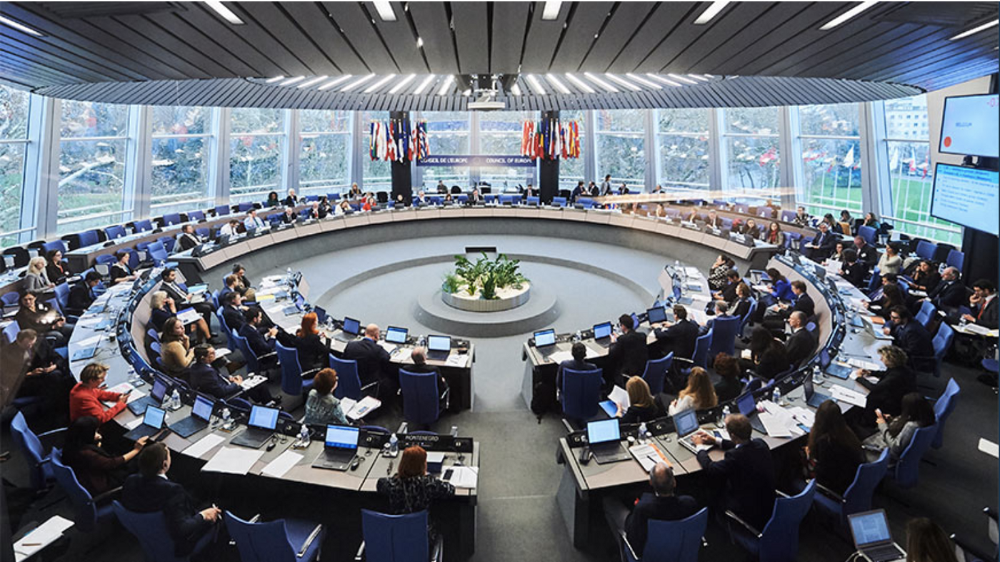
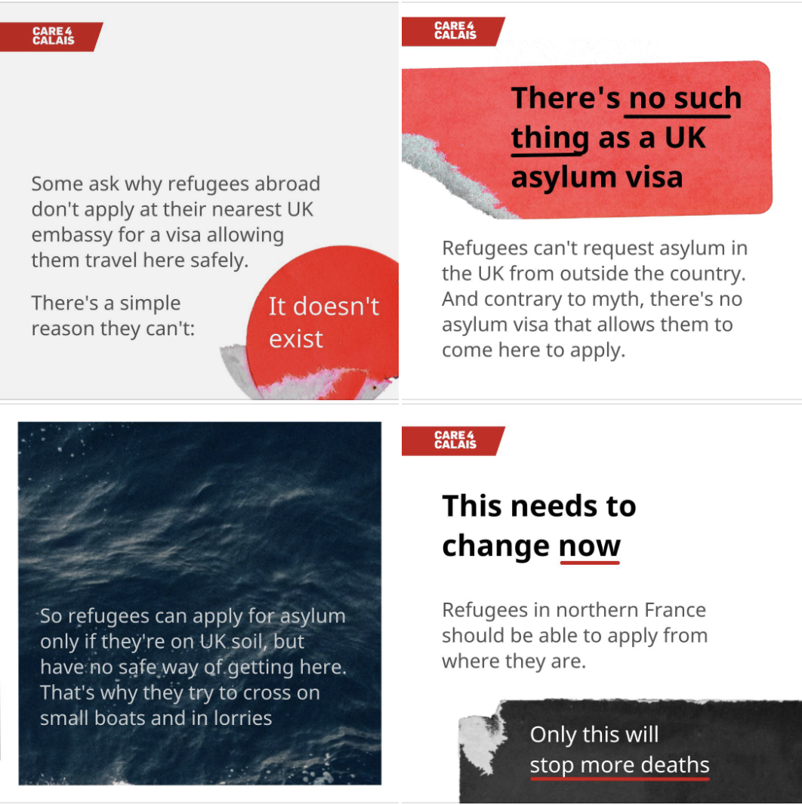

### AYS News Digest 03/12/21: Croatia slammed by Council of Europe for abuse, maltreatment of people on the move
#### Two people drown off Kos, Greece // Italian activist faces extradition from France // German court says people face “degrading treatment” in Greece // Frontex officer says Frontex in Greece “complicit” in rights violations
### FEATURE — Council of Europe’s anti\-torture committee releases damning report on Croatia’s treatment of people on the move

Photo: Council of Europe

The anti\-torture committee of the Council of Europe published a [39\-page report](https://rm.coe.int/1680a4c199) this week on the treatment of people on the move by Croatian authorities in which it made one central fact abundantly clear: allegations by people on the move of brutality, imprisonment, torture and pushbacks suffered at the hands of Croatian authorities _are credible and bear weight\._

“The CPT calls upon the Croatian authorities to take vigorous steps to stamp out ill\-treatment of foreign nationals deprived of their liberty by the police,” the report read\. “Police officers should be given the clear and firm message that detained foreign nationals must be treated with respect, processed in accordance with law and be unequivocally reminded that any form of ill\-treatment of detained persons — including psychological ill\-treatment, threats of ill\-treatment, demeaning and humiliating actions — as well as any tolerance of such ill\-treatment by senior officers, is unlawful and will be punished accordingly\.”

Meanwhile, this same week, EU Home Affairs Commissioner Ylva Johansson praised Croatia for handling media revelations of its border officers beating people on the move\.

“The Croatian authorities immediately acted and already some of the police that took part in that has seen consequences for that,” Johansson said this Thursday\. “I really welcome this attitude from the Croatian government to deal with this with open eyes and to investigate and to take actions when allegations are being founded\.”

Johansson seems to wedded to her belief that such abuse is merely the work of a few “bad apples” among the Croatian authorities\. But the Council of Europe report paints a truly different picture: one of a country that, with the support of the EU, has purposefully built a system of brutality designed precisely and solely to inflict physical abuse and psychological harm on people on the move who enter its territory, with the end goal of preventing migration to the EU in a political climate dominated by mass hysteria surrounding immigration\.

A delegation from the European Committee for the Prevention of Torture and Inhuman or Degrading Treatment or Punishment \(CPT\) made a visit to several Croatian police stations as well as the Bosnian border area this August 10–14 to examine the treatment of PoM in Croatia and investigate allegations of pushbacks\. The five\-person delegation visited several border police stations as well as the Ježevo Reception Centre\.

The CPT noted that for the first time since it began visiting Croatia in 1998, it encountered “manifest cooperation difficulties” with Croatian authorities\. The authorities gave the CPT delegation incomplete lists of detention facilities, for example, and the delegation found police officers to be poorly informed about CPT’s mandate\.

Croatian President Zoran Milanović [went so far as to call the CPT delegation members “pests”](https://www.index.hr/vijesti/clanak/milanovic-napao-vijece-europe-zbog-izvjesca-o-mucenju-migranata-oni-nisu-normalni/2322971.aspx) upon the publication of the report this week\.

In its report, the CPT discussed the language in the legal framework of Croatian law as it relates to the detention of people on the move, noting that the different types of arrests should not determine the quality of treatment a detained person receives:

> …Irrespective of whether persons are “detained” \(“zadržavanje”\), “brought in” \(“dovodjenje”\), “arrested” \(“uhićenje”\), or simply physically caught by the police and held against their will — including in a police van — , the reality of their situation is that they are deprived of their liberty and they must be accorded the fundamental safeguards against ill\-treatment commensurate with that status \(cf\. further paragraphs 33 to 36\) \. **The CPT recommends that this be made unequivocally clear in the draft amendments to the Law on Foreigners which are currently under discussion in the Croatian Parliament\.** \[bolded in original\] 

The CPT delegation also carried out interviews with people on the move in the Una Sana region of Bosnia along the Croatian border, where it “received numerous credible and concordant allegations of physical ill\-treatment of migrants by Croatian police officers \(notably members of the intervention police\)” including “slaps, kicks, blows with truncheons and other hard objects \(e\.g\. butts/barrels of firearms, wooden sticks or tree branches\) to various parts of the body\.”

The delegation also noted several incidents of people being forced to walk through the forest to the border barefoot, in their underwear, or naked, and also being thrown into the Korana river marking the border of Croatia and Bosnia with their hands zip\-tied\. Interviewees also spoke of having to lie face down on the ground while Croatian police officers shot their guns into the ground close to them\.

Importantly, the report noted that Croatia does not have a proper independent monitoring mechanism to address allegations of misconduct or abuse\.

“There are no effective accountability mechanisms in place to identify the perpetrators of alleged acts of ill\-treatment\. There is an absence of specific guidelines from the Croatian Police Directorate on documenting diversion operations and no independent police complaints body to undertake effective investigations into such alleged acts,” the report reads\.

While the report acknowledged the numerous challenges migration has posed on Croatia in recent years and stressed the need for a “concerted European approach” to the issue with the full cooperation of European Union member states, it noted that the extent of those challenges does not give Croatia a free pass to abuse people on the move:

“Setting up a complex police border operation with the support of sophisticated technical equipment does not absolve Croatia from meeting its human rights obligations and from treating those refugees, asylum seekers and other migrants who cross into the country across the green border in a humane and dignified manner,” the report reads\.

The CPT report concluded that it wished to continue its dialogue with Croatian authorities, but only on the condition that such dialogue is “grounded on a mature acknowledgment, including at the highest political levels, of the gravity of the practice of ill\-treatment of migrants by Croatian police officers and a commitment for such ill\-treatment to cease\.”
### LIBYA
#### Horror continues for people in Libya protest camp as snow falls

We remind you that people on the move in Libya have been camped outside for nearly two months in protest against the conditions in Libyan migrant detention centers\. The protesters are calling on the international community for their evacuation from Libya\. Conditions in the camp have grown increasingly dire as winter temperatures reach Libya\.

■■■■■■■■■■■■■■ 
> **[Refugees In Libya](https://twitter.com/RefugeesinLibya) @ Twitter Says:** 

> > Alerts‼️ 
This night one of our sudanese brother "Jelly Idris Mohamed 31"
Was found lying unconscious on the ground at the same spot where a young refugee was stabbed days ago.He was found with clots of blood draining from his mouth &amp; unable to speak. The cause is still unknown. https://t.co/dwKGjJxc81 

> **Tweeted at [2021-12-02 19:56:36](https://twitter.com/refugeesinlibya/status/1466496541716267011).** 

■■■■■■■■■■■■■■ 

■■■■■■■■■■■■■■ 
> **[Refugees In Libya](https://twitter.com/RefugeesinLibya) @ Twitter Says:** 

> > It is severely raining in Tripoli with ice drops, severe cold and women and children are stuck unsheltered in front of the UNHCR headquarter.
@[freeiiritria](https://twitter.com/freeiiritria) @[Sarita_Libre](https://twitter.com/Sarita_Libre) @[CaroRackete](https://twitter.com/CaroRackete) @[UNHCRLibya](https://twitter.com/UNHCRLibya) @[JFCrisp](https://twitter.com/JFCrisp) @[hrw](https://twitter.com/hrw) @[Refugees](https://twitter.com/Refugees) @[KitchaFitFit1](https://twitter.com/KitchaFitFit1) 
#Evacuate[Refugees](https://twitter.com/Refugees)FromLibya https://t.co/fwSYCSoJom 

> **Tweeted at [2021-12-03 18:12:56](https://twitter.com/refugeesinlibya/status/1466832843368239112).** 

■■■■■■■■■■■■■■ 

### GREECE
#### Two people lose their lives in drowning off Kos

Another terrible, avoidable tragedy occurred Friday morning when two people on the move, a man and a woman, [drowned off the coast of Kos](https://www.infomigrants.net/en/post/36980/two-migrants-drown-off-greek-island-kos?fbclid=IwAR2R7AeRJFlvNQ31VOkE8-OOXGOaIdNGisF9LRNRZmauPujVj_xTuCzyKYY) when the speedboat they were traveling on overturned\. Three men were rescued from the same boat, which apparently capsized due to “high waves and poor handling” of the craft\.
#### Aid groups say asylum policies creating hunger crisis

People on the move living in Greece are now facing a new crisis, hunger, after the government slashed benefits last September for those who have already been granted asylum, [media reported](https://www.aljazeera.com/news/2021/12/3/greece-welcomes-refugees-to-camp-hunger?fbclid=IwAR3L7mOOVxNqWl4nZ21SVSKk89rmKrBEgNFXg4ITuvYsco6f8tfkjBViUys) \.

Just under 18,000 people live in camps on the mainland, and some 60 percent have no access to food services or cash handouts, according to the IOM\.

“When they give us asylum they don’t give us food or cash any more, and leave us to fend for ourselves\. They take away our protection completely,” one Afghan man living in Ritsona camp told media\.

Catholic Relief Services was awarded a 12\-million\-euro grant from the Greek government to provide cash assistance to some 32,000 asylum\-seekers in Greece until September 2022\.

■■■■■■■■■■■■■■ 
> **[Martha Roussou](https://twitter.com/MarthaRoussou) @ Twitter Says:** 

> > @[CatholicRelief](https://twitter.com/CatholicRelief) has been awarded the €12m @[migrationgovgr](https://twitter.com/migrationgovgr) contract to provide cash assistance to 32,000 asylum seekers in Greece, until Sept. 2022.
The last time these 32,000 people received the cash assistance they are entitled to, was 92 days ago. 
[migration.gov.gr/ma/hrimatiko-v…](https://migration.gov.gr/ma/hrimatiko-voithima-aitounton-11-2021/) 

> **Tweeted at [2021-12-02 06:43:50](https://twitter.com/martharoussou/status/1466297033929674759).** 

■■■■■■■■■■■■■■ 

#### Press freedom under attack in Greece, migration reporters targeted

[An article by Katy Fallon in Al Jazeera](https://www.aljazeera.com/news/2021/12/2/press-freedom-greece?fbclid=IwAR00ip7c24UNdv2jiHYsdQDwiQH7kTPP7XFDAUoyjeHcXRr4La8dn8CiHm0) highlights the deterioration of press freedom in Greece, focusing in particular on government surveillance and online attacks against those who cover migration in the country\.

Stavros Malichudis, a Greek journalist who writes for Solomon and the AFP, believes he is the subject of surveillance by the Greek National Intelligence Service\.

Dutch journalist Ingeborg Beugel who confronted Mitsotakis at a press conference last month in Athens over lying about pushbacks in the Aegean temporarily left Greece after being attacked online\. She was accused of spreading Turkish propaganda and physically assaulted\.

HRW’s Greece researcher, Eva Cossé, told Al Jazeera: “The Greek government accuses its critics of bias, politically motivated criticism, Turkish propaganda, or factual error, but the truth is simpler: the state of the rule of law and human rights in Greece are failing\.

“In Greece, you now risk jail for speaking out on important issues of public interest, if the government claims it’s false\. Civil society working on migrant rights is under attack, and the state of press freedom is at its worst\. Clearly, Greece has taken the wrong direction on rights\.”
#### MPs raise issue of rejection of Refugee Support Aegean from NGO registry in Parliament

Greek MPs have raised the issue of the rejection of Refugee Support Aegean \(RSA\), a prominent Greek nonprofit, from the country’s NGO registry, [Greek media reported](https://www.syriza.gr/article/id/118564/G.-PSychogios:-Prwtofanhs-aporripsh-organwshs-yperaspishs-anthrwpinwn-dikaiwmatwn-apo-to-mhtrwo-toy-Ypoyrgeioy-Metanasteyshs-kai-Asyloy.html) \.

A report was submitted by the head of the Immigration Policy and Corinth MP of SYRIZA\-PS, George Psychogios, to the Minister of Immigration and Asylum\.

“Ministers must realize that targeting organizations with experience and time in the field of human rights, as well as lawyers — as in the recent visit of MEPs to Samos — as well as the criminalization of solidarity and search and rescue operations at sea, only which succeeds is to deprive rights and endanger human lives, trying to hide government practices and create gray areas\. The government is once again challenging basic principles of the rule of law by exposing the country and this should not be tolerated\.”
### BELARUS / POLAND
#### Presence of Polish MP, cameras saves people from a pushback

■■■■■■■■■■■■■■ 
> **[Janina Ochojska](https://twitter.com/JaninaOchojska) @ Twitter Says:** 

> > Uczestniczyłam w interwencji @[GrupaGranica](https://twitter.com/GrupaGranica) w czasie której 3 Syryjczyków, uprzednio 5-krotnie wypchniętych z 🇵🇱, zostało wreszcie przewiezionych do ośrodka. Tylko światła kamer, nasza obecność i wywalczone zabezpieczenie z Tryb. Praw Człowieka uchroniły ich przed kolejną wywózką. https://t.co/iKmEl67l9c 

> **Tweeted at [2021-12-01 23:22:16](https://twitter.com/janinaochojska/status/1466185911612362752).** 

■■■■■■■■■■■■■■ 

#### IRC launches “emergency response” for Belarus\-Poland border

The International Rescue Committee [announced](https://www.rescue.org/press-release/irc-launches-emergency-response-poland-humanitarian-needs-belarus-border-continue-soar?fbclid=IwAR36o1mOm3Wcn5qGJoYKdWi3nGPt7I-tMsfBAPIPSnjvow53ZByHQBKFF3Y) on Friday it was launching an “emergency response” program to handle the crisis at the Belarus\-Poland border\.

“Working in partnership with Stichting Vluchteling \(SV\), the IRC will bolster the activities of local organisations in Poland, who have been working tirelessly to provide humanitarian assistance to refugees and migrants stranded at the border with Belarus,” the announcement read\.

“The assistance provided by the IRC and SV is just the tip of the iceberg of support that people need\. Poland continues to prevent humanitarian actors from accessing the area where most people are trapped,” said Stefan Lehmeier, IRC Deputy Regional Director for Resettlement, Integration and Asylum programmes in Europe\.

“Seeking asylum is a human right, yet a growing number of European states are undermining the right to asylum and failing to protect people at their borders: It is critical that Poland and the EU now set the right example,” he continued\.
#### Salam Lab profiles Kurdish doctor in Poland working to save lives

Dr\. Arsalan Azzaddin, the head of the ER at Bielsko Podlasie hospital, is an Iraqi Kurd who arrived in Poland 42 years ago\. But, he says, “this is the hardest moment of my life,” referring to his life\-saving efforts to rescue people from hypothermia, dehydration and other injuries they sustain in the border forests\.

Read the full profile of Dr\. Azzaddin [here](https://www.facebook.com/SalamLabPL/posts/2644230865886049) \.
#### Grupa Granica speaks out against criminalization

> There is a humanitarian crisis at the border, and the Polish government is making it difficult for humanitarian organizations to operate\. This is why we should all be more responsible to help everyone whose health and life are at risk\. It is known that in many cases, people are the ones after receiving necessary humanitarian aid \(in the form of example, for example food, drinks, clothes\) delivered in the forests by residents and residents of the border zone or by volunteers and volunteers are once again exported to Belarus, even in spite of poor health\. These illegal practices also take place in relation to people who clearly asked to be given international protection in Poland, as well as those who were admitted to hospital due to poor health\. 

> That is why we express full solidarity with people of good will, residents and residents of the border and other regions of Poland, who are mobilizing to save migrants and migrants not only by providing them food, drink or warm clothes, but also shelters in Poland, for example in their own home\. 

> It should be emphasized that such a form of humanitarian aid, which is in essence saving lives, is not only morally correct, but also in accordance with the laws of Polish law\. The Border Guard summoned an art on Twitter\. 264a of the Penal Code, wanting to make the impression that humanitarian helping people in need of providing shelter in their own home was supposed to be illegal\. Ain’t that the truth\. Such help, given spontaneously and out of the heart, is completely legal\. 

Read the full Facebook post [here](https://www.facebook.com/grupagranica/posts/306280341300568) \.
### FRANCE
#### Activist arrested in France, faces extradition to Italy

■■■■■■■■■■■■■■ 
> **[Charli☀️🦎](https://twitter.com/CharliB97783485) @ Twitter Says:** 

> > #Italy 
Arrestation ce matin près de Turin d'Emilio Scalzo militant Italien en soutien aux réfugiés. Il est visé par un mandat d'arrêt international pour avoir aidé des migrants en France le 15 Mai dernier et risque l'extradition vers la France
https://t.co/vVe4Zs4P6a 

> **Tweeted at [2021-12-01 18:38:41](https://twitter.com/charlib97783485/status/1466114546486104072).** 

■■■■■■■■■■■■■■ 

Emilio Scalzo, a promimnent activist in the “No TAV” movement who aided people along the French\-Italian border, was arrested in Turin earlier this week and now faces extradition to France to stand trial for his solidarity work\. Scalzo risks seven years in prison and a 100,000 euro fine\.

Read more on his case [here](https://actumigrant.net/2021/10/18/criminalisation-de-la-solidarite-aux-frontieres-lactiviste-emilio-scalzo-risque-7-ans-de-prison-et-100-000-euros-damende/?fbclid=IwAR3G_0Eh7xq66pwVU86-PCZVviyf8iIsmw5mhEb4rRKjD7yjFICtuO6eiCs) \.
#### Former Utopia56 activist on trial in Dunkirk for singing during arrest

On Thursday the trial of a former employee of Utopia56, the French activist group, began in Dunkirk\. Laure Pichot’s crime? Singing while in police custody, following her arrest last April in Grande\-Synthe\. The official charge is “insulting noise” and carries a 450 euro fine\.

“These prosecutions are totally and intolerably perverted towards a professional who ensured respect for fundamental rights,” Utopia56 wrote in a [statement](http://www.utopia56.com/en/actualite/tribunal-pour-avoir-chante-sa-solidarite) \. “Laure is indeed reproached for having sung during the first five hours in the cell, when no one asked her to stop and she never intended to harm, which is noted in the verbal procedure\.”

Pichot had been in Grande\-Synthe on April 24, 2020 to peacefully observe the eviction of a camp of several hundred people\. Utopia56 says her arrest was “an attempt to intimidate our actions\.” In 2020 alone, the group said, its volunteers were fined more than 14,000 euros for protest actions\.

“Acts of solidarity in our country are today threatened, pursued and hampered by the police forces who mistreat exiled people and those who assist them and try to ensure that their fundamental rights are respected\. It must stop,” Utopia56 said\.
#### French\-UK border in pictures

■■■■■■■■■■■■■■ 
> **[Louis Witter](https://twitter.com/LouisWitter) @ Twitter Says:** 

> > [ REPORTAGE ]

À Calais et Grande-Synthe les personnes exilées survivent dans des conditions indignes.

Le matin du naufrage où 27 personnes sont mortes, la police empêchait aux équipes d’@[Utopia_56](https://twitter.com/Utopia_56) de distribuer des habits secs à Boulogne.

Pour @[lobs](https://twitter.com/lobs) 📸

[instagram.com/p/CXBKJgcAgay/…](https://www.instagram.com/p/CXBKJgcAgay/?utm_medium=copy_link) https://t.co/Bl3SbNymF9 

> **Tweeted at [2021-12-03 12:02:31](https://twitter.com/louiswitter/status/1466739621514121218).** 

■■■■■■■■■■■■■■ 

■■■■■■■■■■■■■■ 
> **[Abdul Saboor](https://twitter.com/AbdulSaboorJan) @ Twitter Says:** 

> > Chaque années à Calais , les tombes de personnes exilées se multiplient. 
2 décembre 2021.

Every year in Calais, the number of graves of displaced people increases. https://t.co/tNCY0xzSYF 

> **Tweeted at [2021-12-03 11:30:59](https://twitter.com/abdulsaboorjan/status/1466731687316967435).** 

■■■■■■■■■■■■■■ 

### GERMANY
#### German court rules that people face “degrading treatment” in Greece

Asylum\-seekers in Greece face “serious risk of inhuman or degrading treatment,” and may be allowed to apply for asylum again in Germany, the Bremen Administrative Court [ruled](https://www.spiegel.de/politik/deutschland/ovg-bremen-griechenland-verstoesst-gegen-eu-grundrechte-charta-a-4015ce57-0099-4f61-b3fc-6b4d75802eaa?fbclid=IwAR3mwBmr4I_7CAxitmMHwO4UeRdxgeTFMZzICcZ14tyhcgk4IjgHqCfODCg) this week\.

Greece’s treatment of people on the move violates the EU Charter of Fundamental Rights, the court said, and therefore people may be allowed to request asylum in Germany even if they have already been granted such protection in Greece\.

The ruling bears similarity to a [January ruling](https://www.courthousenews.com/refugees-cannot-be-returned-to-greece-german-court-rules/) from a different German court that said that the two plaintiffs could not be sent back to Greece due to the lack of human rights and protections for people on the move there\.

“The applicants’ applications for asylum cannot be rejected as inadmissible because they face a serious risk of inhumane and degrading treatment if they return to Greece,” that court found\.

The plaintiff in this case was a Syrian who received asylum in Greece in 2018, but applied again in Germany the following year\. Germany’s Federal Office for Migration and Refugees \(BAMF\) rejected his claim, and the case worked its way to the Bremen court\.
### DENMARK
#### Danish Frontex aircraft deployed over Channel

A Danish Frontex plane has been deployed over the Channel to monitor boat crossings there following the tragedy last week in which dozens of people lost their lives in the waters, [media reported](https://www.reuters.com/world/europe/frontex-deploys-danish-surveillance-aircraft-over-northern-france-2021-12-02/?fbclid=IwAR10LfJIme6SNf-lruxXoc0p_gnD05NAGvkjXlttodZZnRGiGOfa6CF2rao) \.

The plane landed in Lille, in northern France, and is equipped with modern sensors and radar to support land and sea border control\.

“The evolution of the situation in the Channel is a matter of concern\. Upon the request from member States, Frontex deployed a plane in France to support them with aerial surveillance in just three days,” Frontex Director Fabrice Leggeri said\.

“We are starting with one plane, but we stand ready to reinforce our support if needed\.”
### UNITED KINGDOM
#### A reminder from Care4Calais…

### IRELAND
#### Path for citizenship in Ireland announced

The Justice Minister of Ireland announced a proposal this week to create a pathway to citizenship for undocumented people there, [media reported](https://www.thejournal.ie/undocumented-workers-5619228-Dec2021/?fbclid=IwAR3B-uK3KC-ji0BacDNoM-82W8V54jazNYbDz2O06-J757InNTl5Y3jbhoI) \.

“It will bring some much\-needed certainty and peace of mind to thousands of people who are already living here and making a valuable contribution to our society and the economy, many of whom may be very vulnerable due to their current immigration circumstances,” Helen McEntee, the justice minister, said\.

The new scheme will allow eligible applicants — those who currently do not have permission to live in Ireland — to stay and regularize their residency status\. Applicants must have lived in Ireland for four years without documents, or three years in case of those with children\.

The Department of Justice said studies suggest there could be up to 17,000 undocumented people including up to 3,000 children\.
### EU/ FRONTEX
#### “Extremely high risk that Frontex is complicit in human rights violations in Greece” — Frontex fundamental rights officer

Jonas Grimheden, Frontex’s representative for fundamental rights, has said he has “sufficient evidence” that Frontex is complicit in human rights violations in Greece, [media reported](https://svenska.yle.fi/a/7-10009730) \.

■■■■■■■■■■■■■■ 
> **[front-LEX](https://twitter.com/LexFront) @ Twitter Says:** 

> > &lt;BREAKING&gt; #Frontex's Fundamental Rights Officer @[JGrimheden](https://twitter.com/JGrimheden) confirms our @[EUCourtPress](https://twitter.com/EUCourtPress) case (T-282/21 SS &amp; ST v Frontex) over EU Push-Backs:

"Frontex is complicit in human rights violations in Greece... I have sufficient evidence that this is happening"
[svenska.yle.fi/a/7-10009730](https://svenska.yle.fi/a/7-10009730) 

> **Tweeted at [2021-12-03 20:04:53](https://twitter.com/lexfront/status/1466861012599123971).** 

■■■■■■■■■■■■■■ 

“As Frontex increasingly supports member states such as Greece and Lithuania, the risk is enormous that we will be complicit in human rights violations\. As far as I can see, Frontex staff do not violate the fundamental rights themselves,” Grimheden told the newspaper Svenska Yle\.

Grimheden said there is strong evidence of illegal pushbacks from Greece\.

“The evidence is now increasingly falling into place, so I am becoming more and more sure of my case and now it is up to the Member States to prove the opposite,” he told media\.
### WORTH READING / WATCHING
#### Short doc: ‘Unsafe Passage’ \(The Guardian\)

An overcrowded ship with asylum seekers leaves Libya bound for Europe — triggering a high\-stakes showdown between a Doctors Without Borders vessel wanting to escort it to safety and the Libyan Coast Guard fighting to turn it back\. As the Libyans issue armed threats, tension grows below deck\. With European countries’ responsibilities toward refugees once again in the spotlight, here is an inside view of the desperate hope that is the deadly race for Europe\.
#### THE EMPATHY DEFICIT: How the Government Has Marginalised and Demonised Asylum Seekers \(Byline Times\)

Sam Bright and Sascha Lavin consider how successive administrations have tried to stop the nation from seeing asylum seekers as humans\.
#### The Eagle’s Nest: Migrants, Refugees Tread New Balkan Route \(Balkan Insight\)

Migrants and refugees trying to reach Western Europe are increasingly using a new route via Kosovo, aided by smugglers and local middlemen\.
#### Debunking key myths about Britain’s ‘broken asylum system’ \(The Conversation\)

Political pressure has piled up on the UK government — and on Home Secretary Priti Patel in particular — to take action in the wake of the Channel tragedy\. In turn, she has deflected blame onto the allegedly overgenerous “broken” [asylum system](https://www.bbc.co.uk/news/uk-politics-54404554) for encouraging people to attempt the crossing in the first place\.
#### Refugee assistance on the Belarus\-Poland border shows what solidarity can look like in dark times \(Waging Nonviolence\)

As governments allow a humanitarian crisis to unfold, ordinary individuals and ad hoc groups are doing their utmost to help refugees\.
#### Refugee odyssey to UK reveals complexity of Europe’s smuggling networks \(Financial Times\)

Although organised gangs play a key role, the distinction between smuggler and smuggled is frequently blurred\.

**Find daily updates and special reports on our [Medium page](https://medium.com/are-you-syrious) \.**

**If you wish to contribute, either by writing a report or a story, or by joining the info gathering team, please let us know\.**

**We strive to echo correct news from the ground through collaboration and fairness\. Every effort has been made to credit organisations and individuals with regard to the supply of information, video, and photo material \(in cases where the source wanted to be accredited\) \. Please notify us regarding corrections\.**

**If there’s anything you want to share or comment, contact us through Facebook, Twitter or write to: areyousyrious@gmail\.com\.**

_Converted [Medium Post](https://medium.com/are-you-syrious/ays-news-digest-03-12-21-croatia-slammed-by-council-of-europe-for-abuse-maltreatment-of-people-on-808d6baa3e25) by [ZMediumToMarkdown](https://github.com/ZhgChgLi/ZMediumToMarkdown)._
