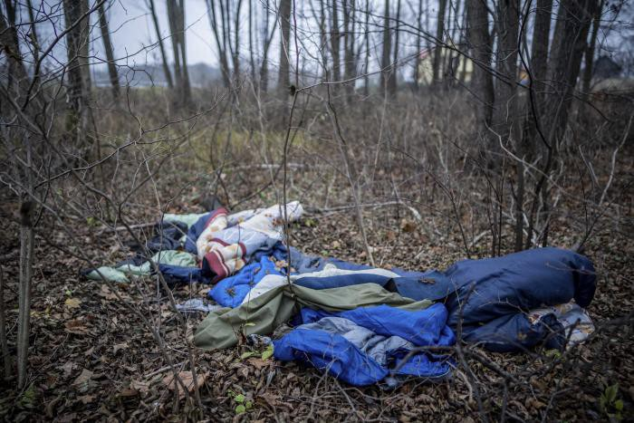

### AYS Weekend Digest 4–5/12/21: EU putting up a bizarre show while suspending their own laws
#### What is going on — at the border with Belarus, in the heads of the decision makers of the EU Commission, on the Greek islands, in front of the UNHCR offices in Libya and all around us? News, updates from the field, calls for support \(Grupa Granica\) and some really good long reads on the most important topics at the moment — read, share and act\!

Blankets and sleeping bags lie abandoned in the forest on the border between Poland and Belarus, November 11, 2021\. © 2021 Michael Kappeler/picture\-alliance/dpa/AP Images — via [HRW](https://www.hrw.org/news/2021/12/03/asylum-rights-thrown-frozen-ditch-poland-belarus-border?fbclid=IwAR22QdgwY5vmHhtp1BI9pIgfL6HFtn-fptSmnz-AygOlAVgu7zmPNX19kxI)

The Greek representative for the EU Commission introduced the plan to suspend EU law at its borders with Belarus for the next six months, including the option of people being [held in closed camps](https://www.dw.com/en/belarus-poland-warns-of-changed-tactics-amid-illegal-migrant-crossings/a-59888652) , along with Home Affairs Commissioner Ylva Johansson, who is responsible for migration\. European treaties, he said on Wednesday, do allow for “exceptional measures” like this in an “emergency situation,” media are [reporting](https://www.dw.com/en/eu-criticized-for-move-to-restrict-asylum-rights-at-belarus-border/a-60021873?fbclid=IwAR0MKlrXWZfDX8JYgZR5n_N86y8dbpwlBZeN55rilr6TnC8UrdyxCrxohA8) \. When asked, both him and the Commissioner failed to comment why it was still necessary to limit asylum rights in the area\.

In the meantime, Grupa Granica — who are **in need of support \(make sure you watch [this video](https://fb.watch/9JP1oZgQW_/)** \) — reacted as well:

> _The proposal for a Council Decision on provisional emergency measures for the benefit of Latvia, Lithuania and Poland \(COM\[2021\] 752 final\) presented by the European Council on 1 December this year is an attempt by the European Commission to reach out to the authorities of these three countries\._ 

> _In our opinion, however, this proposal may significantly hinder the provision of humanitarian work\. It will also not limit the illegal practices used by the Polish government, i\.e\. catching migrants, taking them to the border line and forcing them to illegally cross to the Belarusian side; it will also not change the practice of not accepting applications for international protection\._ 

> _Let us emphasize that activists operating in the border area for several months have been helping the Polish state and EU institutions to save the lives of migrants who cross the Belarusian\-Polish border\. This help — in kind, in food and in medical care — is provided today mainly by private individuals whose actions are financed thanks to the support of donors\. For many weeks now, the volunteers have been trying to force the Polish authorities to abide by the law with regard to forced migrants — they have been trying to ensure that the procedures required by international and European Union law are followed\._ 

Human Rights Watch was very clear about what is taking place:
### [Asylum Rights Thrown into a Frozen Ditch on Poland\-Belarus Border](https://www.hrw.org/news/2021/12/03/asylum-rights-thrown-frozen-ditch-poland-belarus-border?fbclid=IwAR22QdgwY5vmHhtp1BI9pIgfL6HFtn-fptSmnz-AygOlAVgu7zmPNX19kxI)
### [As families huddle to keep warm in the forests along the Poland\-Belarus border, some of them nursing wounds from…](https://www.hrw.org/news/2021/12/03/asylum-rights-thrown-frozen-ditch-poland-belarus-border?fbclid=IwAR22QdgwY5vmHhtp1BI9pIgfL6HFtn-fptSmnz-AygOlAVgu7zmPNX19kxI)

[www\.hrw\.org](https://www.hrw.org/news/2021/12/03/asylum-rights-thrown-frozen-ditch-poland-belarus-border?fbclid=IwAR22QdgwY5vmHhtp1BI9pIgfL6HFtn-fptSmnz-AygOlAVgu7zmPNX19kxI)

Meanwhile, over 400 people from Iraq who had arrived in Belarus in the hope of passing into the EU were on Saturday put on an Iraqi Airways airplane headed for the city of Irbil in northern Iraq, Minsk’s airport [reported](https://menafn.com/1103306289/400-more-refugees-depart-Belarus-on-airplane-to-Iraq?fbclid=IwAR16HeuxVlMA07xCqrc6K1YWrDaWbDnVqJ4T2Cort2CcmDcfyC_DFySazSo) \.

Join our friends from [Josoor in reacting](https://l.facebook.com/l.php?u=https%3A%2F%2Fwww.josoor.net%2Fpost%2Fwar-on-migration-drowning-out-the-sound-of-death-with-music%3Ffbclid%3DIwAR22QdgwY5vmHhtp1BI9pIgfL6HFtn-fptSmnz-AygOlAVgu7zmPNX19kxI&h=AT2dvtpB1GK_NBtz4wA_WzU1rFP9G3SRXKPbH0Y5HqooEAmXiPcq87VAMHfVVEYqgz9nNr-pQNGOVP0_UuxMuiUK5Rtz4Rjfx3wBu02fULVFCVnKcE1sR8TZnM4brPwaUarYMo9muA1OPA&__tn__=R]-R&c[0]=AT2K2oB7i5hNONsOWg0mOflASAxgL39CeqTh9p0HsHoM-pxSMYZKiMFbcJ3CyR7_zUmLodaMlBhd9hx9eCOOTSYQRq1EHlnuTLpWfEF54r-xuYPfLa_Nh4v942H58ZD_BWSwra-yj6xUwH-D57Du49Zdx1LR71Gb178ycHh2MgCdA3unO709Z8JnyrU-6njz-AZx0Q3EL7_utj-k1mw) to the bizarre and horribly ignorant show that was put on:

> _While people are being killed at the border, Eurostars are banding together in solidarity — for the perpetrators\._ 
 

> _Join us in letting these artists know that while they will be performing, people continue dying at that same border —_ 

### LIBYA
### What is going on?

The [open\-ended protest](https://www.aljazeera.com/news/2021/11/26/refugees-in-libya-long-for-safety-protests-continue) s outside the offices of the UNHCR continue, to denounce the inhumane conditions they face in Libya, and claim protection and safety\.

As [reported](https://insidearabia.com/protesting-against-inhumane-treatment-in-libya-refugees-call-out-unhcr/?fbclid=IwAR1P1rhbC5G5EeQQbarJTI1zpaJwQlh0W_K_VOX3tMLZbxckcp3lVFSIrf0) , the sit\-in began at the beginning of October after the Libyan authorities conducted a [brutal crackdown](https://www.infomigrants.net/en/post/35495/thousands-of-migrants-rounded-up-in-libya) on people on the move in the western neighbourhood of Gargaresh, near Tripoli\. _“Security forces arrested more than 5,000 people, including many recognised as refugees by the UN refugee agency, in what the Libyan administration described as a large\-scale security campaign against illegal migration and drug trafficking\.”_

> _They are also sick with tuberculosis and other diseases that spread in the overcrowded, unsanitary detention camps they were held in\. There are no public toilets available to them\._ 

Don’t miss out reading our recent Special from Libya:
### [AYS Special from Libya: Protests in Tripoli against a system made “to cause suffering”](special-from-libya-protests-in-tripoli-against-a-system-made-to-cause-suffering-77a6ce5ffc6)
### [For 2\+ months, 1000s people are protesting in front of UNHCR Centre\. As \#RefugeesInLibya, they mobilise and challenge…](special-from-libya-protests-in-tripoli-against-a-system-made-to-cause-suffering-77a6ce5ffc6)

[medium\.com](special-from-libya-protests-in-tripoli-against-a-system-made-to-cause-suffering-77a6ce5ffc6)

While the protest was taking place, this was the reaction that came towards those demanding a change in the practice so far:

Reportedly, the situation of the people after heavy rains that continued throughout the whole night and flooded the entire street where we have been sleeping was [really difficult](https://l.facebook.com/l.php?u=https%3A%2F%2Ftwitter.com%2FRefugeesinLibya%2Fstatus%2F1467106903037820933%3Fs%3D20%26fbclid%3DIwAR1TDdarMRcd-thdd4FaawrRcOp37tFldQpzpkGS075itt9IWVf4VwOQ2x8&h=AT3s4TAn4jWq6s6LayJNKqRnAyNB44pO2ScsF-086exdynXeXc2bChuuH15-n2u0pUPHTTGKnkdfDTaJDUhAn7IjXEmRB7lexdT50k2vWfIxXx_0RrqzuoIHvxgBB80ab-f5rzwmxEUtVA&__tn__=R]-R&c[0]=AT2NQIG-P43hWvq_ZgHsS-O0ljxslIfYbwRih-dY3Ez0snUNTWDOcvsFklM8nOu0sjv3-RQO8axHFjxFYCTUbOl4mw0ZqPNFVZBO0EVHF42G6Y24yhMNs1s-3dVyg24tlhPCESZcxvxTNHtHrHSt5qi1XzGprtBwtoHhb6BWc-slL175HMtTOzBe9jvUkTUglYI76jOb9jxVOeZBqGW7FZCriizO7JQ) \.
### GREECE
### “When human lives are in peril… national borders become irrelevant”

Ahead of the visit by Pope Francis that was announced a while back, many people had the need to inform, warn and ignite a wish to react to the ongoing horrors people on the move are facing in the very area the Pope came to visit\.

And here is his whole speech:
### [Full speech of Pope during visit to Kara Tepe refugee camp in Lesbos](https://l.facebook.com/l.php?u=https%3A%2F%2Fwww.romereports.com%2Fen%2F2021%2F12%2F05%2Ffull-speech-of-pope-during-visit-to%2F%3Ffbclid%3DIwAR0YCKgwuqSJZqnHrnIaMz_5HDy1RoME6BJeMaiughjUAPBOuYjwXdWfbv4&h=AT2X1LOvPbe1SSgwGdzpRGTF6eIacdE0BPUadtLZdbgXP2-4lI_NuINBtSG5bXr8gHYkbjCAPYXdPvFAjxxzQz_3guWWsk7DhgeagIpkFae21aN_bcWcEJO_bbmhF3CRDP5etB2F4ygu0Q&__tn__=R]-R&c[0]=AT085aSWiYEBPkttRi6qT_3JtRvDBtMbLpbEzFXjvKFmeHAfv3M7w6kFaugrzszqVANXpjzWlN5XzouXMGLP9FaeymhR-bzh-sUQFMw3SXiG7ws8YFzTHJEYGk1NgRf4oFah8kZHId_Pg6EkMMoq-2qBNAMWUNIpeUmdPOm2HBtI8jtim0ExhSUl2QQ7cFicy8V94aFh_L_9aDagw-c)
### [Dear brothers and sisters, Thank you for your kind words\. I am grateful to you, Madam President, for your presence and…](https://l.facebook.com/l.php?u=https%3A%2F%2Fwww.romereports.com%2Fen%2F2021%2F12%2F05%2Ffull-speech-of-pope-during-visit-to%2F%3Ffbclid%3DIwAR0YCKgwuqSJZqnHrnIaMz_5HDy1RoME6BJeMaiughjUAPBOuYjwXdWfbv4&h=AT2X1LOvPbe1SSgwGdzpRGTF6eIacdE0BPUadtLZdbgXP2-4lI_NuINBtSG5bXr8gHYkbjCAPYXdPvFAjxxzQz_3guWWsk7DhgeagIpkFae21aN_bcWcEJO_bbmhF3CRDP5etB2F4ygu0Q&__tn__=R]-R&c[0]=AT085aSWiYEBPkttRi6qT_3JtRvDBtMbLpbEzFXjvKFmeHAfv3M7w6kFaugrzszqVANXpjzWlN5XzouXMGLP9FaeymhR-bzh-sUQFMw3SXiG7ws8YFzTHJEYGk1NgRf4oFah8kZHId_Pg6EkMMoq-2qBNAMWUNIpeUmdPOm2HBtI8jtim0ExhSUl2QQ7cFicy8V94aFh_L_9aDagw-c)

[l\.facebook\.com](https://l.facebook.com/l.php?u=https%3A%2F%2Fwww.romereports.com%2Fen%2F2021%2F12%2F05%2Ffull-speech-of-pope-during-visit-to%2F%3Ffbclid%3DIwAR0YCKgwuqSJZqnHrnIaMz_5HDy1RoME6BJeMaiughjUAPBOuYjwXdWfbv4&h=AT2X1LOvPbe1SSgwGdzpRGTF6eIacdE0BPUadtLZdbgXP2-4lI_NuINBtSG5bXr8gHYkbjCAPYXdPvFAjxxzQz_3guWWsk7DhgeagIpkFae21aN_bcWcEJO_bbmhF3CRDP5etB2F4ygu0Q&__tn__=R]-R&c[0]=AT085aSWiYEBPkttRi6qT_3JtRvDBtMbLpbEzFXjvKFmeHAfv3M7w6kFaugrzszqVANXpjzWlN5XzouXMGLP9FaeymhR-bzh-sUQFMw3SXiG7ws8YFzTHJEYGk1NgRf4oFah8kZHId_Pg6EkMMoq-2qBNAMWUNIpeUmdPOm2HBtI8jtim0ExhSUl2QQ7cFicy8V94aFh_L_9aDagw-c)

In the meantime, ironic statements are coming by the \(recently very active\) Mr\. Schinas regarding what the Pope said on Lesvos, provoking further comments:

More sarcasm was on the way:
### Weather warning

Greece’s National Meteorological Service EMY issued a weather warning on Sunday of intense phenomena forecast for Monday and Tuesday, December 6–7, 2021\. Main features of the bad weather front are heavy rainfall and thunderstorms and stormy to gale winds up to 8 Beaufort\.

**Heavy rainfall and thunderstorms will occur on Monday, Dec 6: Ionian islands, Epirus, western Sterea and in the afternoon in western Peloponnese\.**
### FRANCE
### Strong solidarity of Briançon

Photo: Juliette Pascal

This Friday, December 3 at the beginning of the evening in Briançon, the 2020 and 2021 [promotion of the new graduates](https://www.ledauphine.com/societe/2021/12/03/briancon-les-nouveaux-guides-en-montagne-affichent-leur-soutien-aux-exiles?s=09&fbclid=IwAR2zSraIVUafNdydwEfk3uiQ5Fm9so4HkW3Jzhz26MoXQUd1R8IKRIuiazQ) of the high mountain guides were awarded their medals\. The ceremony took place in front of the media library, in the presence of their elders and elected officials\.

Many of them wore t\-shirts with the phrase “Our brotherhood has no borders”\. Others wore stickers with the _Tous migrants_ logo on their coats\. This action was led by new graduates, independently of the National Mountain Guides Union\.

> _What a way to display for young guides their support to migrants and associations helping them in Briançonnais\!_ 

At the same time, in the north of France:
### UK
### Migrant Workers’ Rights — Policy Briefing December 2021

While it is still important to explain people’s situation and [why some people still want to try out their chances in the UK](https://l.facebook.com/l.php?u=https%3A%2F%2Fwww.independent.co.uk%2Fnews%2Fuk%2Fhome-news%2Fmigrants-channel-crossing-england-france-b1968564.html%3Ffbclid%3DIwAR3djn09Y8-3ZDlO5evBl73dIf3uoDcVA8BjVc4vKxooHqmrOWFOeDxWDlI&h=AT3RNTQIEbpqEzx9VSkx0kJLo4mRBMOxv5P73ZDHCw7AyyjsWru7mUwbn-iIBFBL1mZPCbwgxooyTFSxuPnF5toqDl-eFtT3VroONGPkfFc2uWgD2SDKWGbaXDxqt3tgOWlTCIf_KVVmnA&__tn__=R]-R&c[0]=AT1-sB1EZXatcSUSjLIDcxgj2yonReJxIYRqmok1bmGL_bejUp2GmHyJyPJ_D6AWtvNpYV7iCsKVoMdH4-aD7nh-gMS42sAz3OSvxZAvK0VymplFKPNrfE45EQxw-iyBw6Vi0KloeD2mtFCmH_Gtbg6vF8D8gmYUF9iddG4gi0sdzIF8sspVCVi7DGz3WtTV-7xYp8ih42f0gxE3GhU) , some positive decisions are being made, even if it’s not at the [Home Office](https://l.facebook.com/l.php?u=https%3A%2F%2Fwww.theguardian.com%2Fuk-news%2F2021%2Fdec%2F04%2Fhome-office-borders-bill-could-create-a-british-guantanamo-bay-says-tory-mp%3FCMP%3DShare_iOSApp_Other%26fbclid%3DIwAR1UuuwfEKWX4RkO3Ayb0J-zTK1KliGD4MbM89sGrPBSU-E4YkmgSUkIx3c&h=AT1THjOrbyGb1UYHcowdkyxKCpWAHE6kX8BL3gyk_L5u5HXTVp8vXFuEj9mi5PupONQGYa9rSXiNFDekykSdnRQAEf6zQyYlure0TEAQF0PKlFKuJas1Jx8zmwuCFlAZwuvN-1LLolICIA&__tn__=R]-R&c[0]=AT1-sB1EZXatcSUSjLIDcxgj2yonReJxIYRqmok1bmGL_bejUp2GmHyJyPJ_D6AWtvNpYV7iCsKVoMdH4-aD7nh-gMS42sAz3OSvxZAvK0VymplFKPNrfE45EQxw-iyBw6Vi0KloeD2mtFCmH_Gtbg6vF8D8gmYUF9iddG4gi0sdzIF8sspVCVi7DGz3WtTV-7xYp8ih42f0gxE3GhU) \.
### [RNLI vows to continue Channel rescues amid new hate campaign by Britain First](https://l.facebook.com/l.php?u=https%3A%2F%2Fwww.independent.co.uk%2Fnews%2Fuk%2Fhome-news%2Frnli-channel-rescues-britain-first-b1969357.html%3Ffbclid%3DIwAR2iaQojEs8ooMiylQqw6IP7wz_MppdP0czZ1bjoeZIcwr90NA1vPqUyRPo&h=AT1GB5tkeBADHN4JXyRCCbYp0L7nYGvebE0iITLxItG_21V40pVnA7LbgLlxYgZRO3ipVh0JBFuTLbjYERo4eh3rljXSO4VNlJJav-IPq8Q5HAkSw3x8q3fCUlzQvfFTWOaROoVblPvd2Q&__tn__=R]-R&c[0]=AT1-sB1EZXatcSUSjLIDcxgj2yonReJxIYRqmok1bmGL_bejUp2GmHyJyPJ_D6AWtvNpYV7iCsKVoMdH4-aD7nh-gMS42sAz3OSvxZAvK0VymplFKPNrfE45EQxw-iyBw6Vi0KloeD2mtFCmH_Gtbg6vF8D8gmYUF9iddG4gi0sdzIF8sspVCVi7DGz3WtTV-7xYp8ih42f0gxE3GhU)
### [The RNLI has vowed to continue rescuing people “without judgement or preference” as it is bombarded with hateful emails…](https://l.facebook.com/l.php?u=https%3A%2F%2Fwww.independent.co.uk%2Fnews%2Fuk%2Fhome-news%2Frnli-channel-rescues-britain-first-b1969357.html%3Ffbclid%3DIwAR2iaQojEs8ooMiylQqw6IP7wz_MppdP0czZ1bjoeZIcwr90NA1vPqUyRPo&h=AT1GB5tkeBADHN4JXyRCCbYp0L7nYGvebE0iITLxItG_21V40pVnA7LbgLlxYgZRO3ipVh0JBFuTLbjYERo4eh3rljXSO4VNlJJav-IPq8Q5HAkSw3x8q3fCUlzQvfFTWOaROoVblPvd2Q&__tn__=R]-R&c[0]=AT1-sB1EZXatcSUSjLIDcxgj2yonReJxIYRqmok1bmGL_bejUp2GmHyJyPJ_D6AWtvNpYV7iCsKVoMdH4-aD7nh-gMS42sAz3OSvxZAvK0VymplFKPNrfE45EQxw-iyBw6Vi0KloeD2mtFCmH_Gtbg6vF8D8gmYUF9iddG4gi0sdzIF8sspVCVi7DGz3WtTV-7xYp8ih42f0gxE3GhU)

[l\.facebook\.com](https://l.facebook.com/l.php?u=https%3A%2F%2Fwww.independent.co.uk%2Fnews%2Fuk%2Fhome-news%2Frnli-channel-rescues-britain-first-b1969357.html%3Ffbclid%3DIwAR2iaQojEs8ooMiylQqw6IP7wz_MppdP0czZ1bjoeZIcwr90NA1vPqUyRPo&h=AT1GB5tkeBADHN4JXyRCCbYp0L7nYGvebE0iITLxItG_21V40pVnA7LbgLlxYgZRO3ipVh0JBFuTLbjYERo4eh3rljXSO4VNlJJav-IPq8Q5HAkSw3x8q3fCUlzQvfFTWOaROoVblPvd2Q&__tn__=R]-R&c[0]=AT1-sB1EZXatcSUSjLIDcxgj2yonReJxIYRqmok1bmGL_bejUp2GmHyJyPJ_D6AWtvNpYV7iCsKVoMdH4-aD7nh-gMS42sAz3OSvxZAvK0VymplFKPNrfE45EQxw-iyBw6Vi0KloeD2mtFCmH_Gtbg6vF8D8gmYUF9iddG4gi0sdzIF8sspVCVi7DGz3WtTV-7xYp8ih42f0gxE3GhU)

Also, a political move was put in motion to help change the existing hardship migrant workers are currently facing across the country\.

> _The existing immigration system traps migrant workers in a cycle of precarity, poverty and exploitation\. Migrant workers are particularly vulnerable within a wider landscape of low\-paid work in which all workers, regardless of where they are from, lack adequate protection and labour rights enforcement\._ 

> _The pandemic has highlighted the risks inherent in a system that bars huge numbers of workers from accessing the public safety net in times of difficulty\. The Government must engage in serious, common\-sense reform to increase safeguards for workers and strengthen enforcement of labour protections for all workers\. Alongside this, Government should ensure that no\-one is criminalised for working to survive, and that everyone has access to adequate support when needed\._ 

To achieve a safer system for all, the Government must:
1. **Never criminalise someone for working to support themselves** — support **NC13** of the Nationality and Borders Bill
2. **Prioritise decent conditions over immigration enforcement** — establish a firewall between labour inspectors and immigration enforcement and enforce minimum working standards more rigorously
3. **Ensure everyone can rely on a state safety net in times of difficulty** — end No Recourse to Public Funds by supporting **NC12** of the Nationality and Borders Bill
4. **End the cycle that puts workers at the mercy of exploitative employers** — ensure all visas include pathways to permanent settlement within a reasonable timeframe, and introduce simpler routes to regularisation

[Download the briefing here\.](https://www.jcwi.org.uk/Handlers/Download.ashx?IDMF=29b86e1f-12e2-47b4-b7eb-0004f538277f)
### WORTH READING
- Lebanon: a report — Syrian children blocked from school:

### [Lebanon: Syrian Refugee Children Blocked from School](https://l.facebook.com/l.php?u=https%3A%2F%2Fwww.hrw.org%2Fnews%2F2021%2F12%2F03%2Flebanon-syrian-refugee-children-blocked-school%3Ffbclid%3DIwAR1C2A8gY1P0LeI19A1LriZKXw4KZdqLp0qS1EGLIgfMyKcqbGJi_vM8j1M&h=AT2RtmPzcUiNtwmbtmysNHQ94IIFiHN7YkKEIo3H4zRRfg7W_lMeIx0a4CNyYDtqhzIUP6EvHEwrFvlHSeuMPMKvRVWejzJChs6W5XK1-G4QQgj8DGm1i04F7v6jXrP86A&__tn__=%2CmH-R&c[0]=AT131yVPNd2-zdxTXz2or6YgVEg2LropHwH2VdQC4VqRWA8LHfh1gz7jicK6TGf24Z65K78V5a7CdvlZMifuLHIFhUE51L_Z6EcHs02lBHvkB4V-OmnX30-FRVW0d6CoDkzSuXz7w7OeY0ZAzg5YCE40lvs0DXTb_t1bLgghLgR4n-FOuIKlyXmdJYiPjkCdRm5iTDoYJOmhPc9F5bY)
### [\(Beirut\) — Lebanon’s Education Ministry should extend the December 4, 2021, school registration deadline for Syrian…](https://l.facebook.com/l.php?u=https%3A%2F%2Fwww.hrw.org%2Fnews%2F2021%2F12%2F03%2Flebanon-syrian-refugee-children-blocked-school%3Ffbclid%3DIwAR1C2A8gY1P0LeI19A1LriZKXw4KZdqLp0qS1EGLIgfMyKcqbGJi_vM8j1M&h=AT2RtmPzcUiNtwmbtmysNHQ94IIFiHN7YkKEIo3H4zRRfg7W_lMeIx0a4CNyYDtqhzIUP6EvHEwrFvlHSeuMPMKvRVWejzJChs6W5XK1-G4QQgj8DGm1i04F7v6jXrP86A&__tn__=%2CmH-R&c[0]=AT131yVPNd2-zdxTXz2or6YgVEg2LropHwH2VdQC4VqRWA8LHfh1gz7jicK6TGf24Z65K78V5a7CdvlZMifuLHIFhUE51L_Z6EcHs02lBHvkB4V-OmnX30-FRVW0d6CoDkzSuXz7w7OeY0ZAzg5YCE40lvs0DXTb_t1bLgghLgR4n-FOuIKlyXmdJYiPjkCdRm5iTDoYJOmhPc9F5bY)

[l\.facebook\.com](https://l.facebook.com/l.php?u=https%3A%2F%2Fwww.hrw.org%2Fnews%2F2021%2F12%2F03%2Flebanon-syrian-refugee-children-blocked-school%3Ffbclid%3DIwAR1C2A8gY1P0LeI19A1LriZKXw4KZdqLp0qS1EGLIgfMyKcqbGJi_vM8j1M&h=AT2RtmPzcUiNtwmbtmysNHQ94IIFiHN7YkKEIo3H4zRRfg7W_lMeIx0a4CNyYDtqhzIUP6EvHEwrFvlHSeuMPMKvRVWejzJChs6W5XK1-G4QQgj8DGm1i04F7v6jXrP86A&__tn__=%2CmH-R&c[0]=AT131yVPNd2-zdxTXz2or6YgVEg2LropHwH2VdQC4VqRWA8LHfh1gz7jicK6TGf24Z65K78V5a7CdvlZMifuLHIFhUE51L_Z6EcHs02lBHvkB4V-OmnX30-FRVW0d6CoDkzSuXz7w7OeY0ZAzg5YCE40lvs0DXTb_t1bLgghLgR4n-FOuIKlyXmdJYiPjkCdRm5iTDoYJOmhPc9F5bY)
- Much of what is being done in one country or part of Europe has an effect on others, here is one such example:

### [How Greece’s Brutal Anti\-Migrant Policies Became a Model for Britain](https://l.facebook.com/l.php?u=https%3A%2F%2Fjacobinmag.com%2F2021%2F12%2Fgreek-anti-migrant-policies-uk-britain-channel%2F%3Ffbclid%3DIwAR0VFMLP8WsyQP6cSCtm7ZTfW3USq_a9tvQ9DFpjiOVI4T11pqVrA99nJwA&h=AT1I6GW9M3hrd0Ttr3k-eBNP9tS85UIr6B6HVsgDygBZPyL-cZ04Z7Dk7NsU4VPFwRtADrdVdTxmx_MWFns_M-L8d68FRRqgVTzGMm4H206aefFMLQEF70SAD7NF6KULQ-mxiy79vGjUtQ&__tn__=R]-R&c[0]=AT085aSWiYEBPkttRi6qT_3JtRvDBtMbLpbEzFXjvKFmeHAfv3M7w6kFaugrzszqVANXpjzWlN5XzouXMGLP9FaeymhR-bzh-sUQFMw3SXiG7ws8YFzTHJEYGk1NgRf4oFah8kZHId_Pg6EkMMoq-2qBNAMWUNIpeUmdPOm2HBtI8jtim0ExhSUl2QQ7cFicy8V94aFh_L_9aDagw-c)
### [On November 25, news broke that twenty\-seven desperate people had died trying to cross the English Channel to seek…](https://l.facebook.com/l.php?u=https%3A%2F%2Fjacobinmag.com%2F2021%2F12%2Fgreek-anti-migrant-policies-uk-britain-channel%2F%3Ffbclid%3DIwAR0VFMLP8WsyQP6cSCtm7ZTfW3USq_a9tvQ9DFpjiOVI4T11pqVrA99nJwA&h=AT1I6GW9M3hrd0Ttr3k-eBNP9tS85UIr6B6HVsgDygBZPyL-cZ04Z7Dk7NsU4VPFwRtADrdVdTxmx_MWFns_M-L8d68FRRqgVTzGMm4H206aefFMLQEF70SAD7NF6KULQ-mxiy79vGjUtQ&__tn__=R]-R&c[0]=AT085aSWiYEBPkttRi6qT_3JtRvDBtMbLpbEzFXjvKFmeHAfv3M7w6kFaugrzszqVANXpjzWlN5XzouXMGLP9FaeymhR-bzh-sUQFMw3SXiG7ws8YFzTHJEYGk1NgRf4oFah8kZHId_Pg6EkMMoq-2qBNAMWUNIpeUmdPOm2HBtI8jtim0ExhSUl2QQ7cFicy8V94aFh_L_9aDagw-c)

[l\.facebook\.com](https://l.facebook.com/l.php?u=https%3A%2F%2Fjacobinmag.com%2F2021%2F12%2Fgreek-anti-migrant-policies-uk-britain-channel%2F%3Ffbclid%3DIwAR0VFMLP8WsyQP6cSCtm7ZTfW3USq_a9tvQ9DFpjiOVI4T11pqVrA99nJwA&h=AT1I6GW9M3hrd0Ttr3k-eBNP9tS85UIr6B6HVsgDygBZPyL-cZ04Z7Dk7NsU4VPFwRtADrdVdTxmx_MWFns_M-L8d68FRRqgVTzGMm4H206aefFMLQEF70SAD7NF6KULQ-mxiy79vGjUtQ&__tn__=R]-R&c[0]=AT085aSWiYEBPkttRi6qT_3JtRvDBtMbLpbEzFXjvKFmeHAfv3M7w6kFaugrzszqVANXpjzWlN5XzouXMGLP9FaeymhR-bzh-sUQFMw3SXiG7ws8YFzTHJEYGk1NgRf4oFah8kZHId_Pg6EkMMoq-2qBNAMWUNIpeUmdPOm2HBtI8jtim0ExhSUl2QQ7cFicy8V94aFh_L_9aDagw-c)
- More on the need to change things in the UK:

### [Editorial: The danger of drowning cannot be part of our asylum policy](https://l.facebook.com/l.php?u=https%3A%2F%2Fwww.independent.co.uk%2Fvoices%2Feditorials%2Frefugees-asylum-policy-channel-migrants-b1969860.html%3Ffbclid%3DIwAR0YCKgwuqSJZqnHrnIaMz_5HDy1RoME6BJeMaiughjUAPBOuYjwXdWfbv4&h=AT21SPw9ngicx1OIKMVVUlKqGUl00VFcoe9hg65xJAVd88ST1flFpNG0otmqlGaNJ7WFUs0vR_vpHuEA4feaiUnOm3sldqBccYSgngXbOQzrzic19TQO__jUTfWPRInplgyHAzzTbu7yPg&__tn__=R]-R&c[0]=AT1-sB1EZXatcSUSjLIDcxgj2yonReJxIYRqmok1bmGL_bejUp2GmHyJyPJ_D6AWtvNpYV7iCsKVoMdH4-aD7nh-gMS42sAz3OSvxZAvK0VymplFKPNrfE45EQxw-iyBw6Vi0KloeD2mtFCmH_Gtbg6vF8D8gmYUF9iddG4gi0sdzIF8sspVCVi7DGz3WtTV-7xYp8ih42f0gxE3GhU)
### [Voices Editorials Editorial: The government ought to welcome any proposals that have a chance of reducing the number of…](https://l.facebook.com/l.php?u=https%3A%2F%2Fwww.independent.co.uk%2Fvoices%2Feditorials%2Frefugees-asylum-policy-channel-migrants-b1969860.html%3Ffbclid%3DIwAR0YCKgwuqSJZqnHrnIaMz_5HDy1RoME6BJeMaiughjUAPBOuYjwXdWfbv4&h=AT21SPw9ngicx1OIKMVVUlKqGUl00VFcoe9hg65xJAVd88ST1flFpNG0otmqlGaNJ7WFUs0vR_vpHuEA4feaiUnOm3sldqBccYSgngXbOQzrzic19TQO__jUTfWPRInplgyHAzzTbu7yPg&__tn__=R]-R&c[0]=AT1-sB1EZXatcSUSjLIDcxgj2yonReJxIYRqmok1bmGL_bejUp2GmHyJyPJ_D6AWtvNpYV7iCsKVoMdH4-aD7nh-gMS42sAz3OSvxZAvK0VymplFKPNrfE45EQxw-iyBw6Vi0KloeD2mtFCmH_Gtbg6vF8D8gmYUF9iddG4gi0sdzIF8sspVCVi7DGz3WtTV-7xYp8ih42f0gxE3GhU)

[l\.facebook\.com](https://l.facebook.com/l.php?u=https%3A%2F%2Fwww.independent.co.uk%2Fvoices%2Feditorials%2Frefugees-asylum-policy-channel-migrants-b1969860.html%3Ffbclid%3DIwAR0YCKgwuqSJZqnHrnIaMz_5HDy1RoME6BJeMaiughjUAPBOuYjwXdWfbv4&h=AT21SPw9ngicx1OIKMVVUlKqGUl00VFcoe9hg65xJAVd88ST1flFpNG0otmqlGaNJ7WFUs0vR_vpHuEA4feaiUnOm3sldqBccYSgngXbOQzrzic19TQO__jUTfWPRInplgyHAzzTbu7yPg&__tn__=R]-R&c[0]=AT1-sB1EZXatcSUSjLIDcxgj2yonReJxIYRqmok1bmGL_bejUp2GmHyJyPJ_D6AWtvNpYV7iCsKVoMdH4-aD7nh-gMS42sAz3OSvxZAvK0VymplFKPNrfE45EQxw-iyBw6Vi0KloeD2mtFCmH_Gtbg6vF8D8gmYUF9iddG4gi0sdzIF8sspVCVi7DGz3WtTV-7xYp8ih42f0gxE3GhU)
- Another take on the realities along the Balkan route:

### [The Eagle’s Nest: Migrants, Refugees Tread New Balkan Route — Analysis](https://l.facebook.com/l.php?u=https%3A%2F%2Fwww.eurasiareview.com%2F05122021-the-eagles-nest-migrants-refugees-tread-new-balkan-route-analysis%2F%3Ffbclid%3DIwAR1C2A8gY1P0LeI19A1LriZKXw4KZdqLp0qS1EGLIgfMyKcqbGJi_vM8j1M&h=AT34eT0fePKHo_7CBl-YbW_--GCT3L1CsrzoCoOtUBrg1SvVoiueQDrZxOKRHJxiscIy5CfqnMengtuQSe3X1DNSufMZgCzSM9xKZkwGDZOUexi5bWh0uggjrbuGhRTYTQ&__tn__=%2CmH-R&c[0]=AT2SafTIc81fU_exPsPyYaqUjTAphQFjxEZ0LIN7x9ZeWU1kuPXx-aVLb4FymAx-IizukxHzGJFo7pDrqMtLg2Cc3eFXAJR8iikJ7viT0FC3OTz-d75gcATEKcrlhpORZFUIVL5gMMy2wyK_-vyn37D0wVLAhEwe3m4PyZ1XUZ_mToRJeOsV53Q5sAD_SgGfdqSmS66d3l94AzqO50U)
### [Migrants and refugees trying to reach Western Europe are increasingly using a new route via Kosovo, aided by smugglers…](https://l.facebook.com/l.php?u=https%3A%2F%2Fwww.eurasiareview.com%2F05122021-the-eagles-nest-migrants-refugees-tread-new-balkan-route-analysis%2F%3Ffbclid%3DIwAR1C2A8gY1P0LeI19A1LriZKXw4KZdqLp0qS1EGLIgfMyKcqbGJi_vM8j1M&h=AT34eT0fePKHo_7CBl-YbW_--GCT3L1CsrzoCoOtUBrg1SvVoiueQDrZxOKRHJxiscIy5CfqnMengtuQSe3X1DNSufMZgCzSM9xKZkwGDZOUexi5bWh0uggjrbuGhRTYTQ&__tn__=%2CmH-R&c[0]=AT2SafTIc81fU_exPsPyYaqUjTAphQFjxEZ0LIN7x9ZeWU1kuPXx-aVLb4FymAx-IizukxHzGJFo7pDrqMtLg2Cc3eFXAJR8iikJ7viT0FC3OTz-d75gcATEKcrlhpORZFUIVL5gMMy2wyK_-vyn37D0wVLAhEwe3m4PyZ1XUZ_mToRJeOsV53Q5sAD_SgGfdqSmS66d3l94AzqO50U)

[l\.facebook\.com](https://l.facebook.com/l.php?u=https%3A%2F%2Fwww.eurasiareview.com%2F05122021-the-eagles-nest-migrants-refugees-tread-new-balkan-route-analysis%2F%3Ffbclid%3DIwAR1C2A8gY1P0LeI19A1LriZKXw4KZdqLp0qS1EGLIgfMyKcqbGJi_vM8j1M&h=AT34eT0fePKHo_7CBl-YbW_--GCT3L1CsrzoCoOtUBrg1SvVoiueQDrZxOKRHJxiscIy5CfqnMengtuQSe3X1DNSufMZgCzSM9xKZkwGDZOUexi5bWh0uggjrbuGhRTYTQ&__tn__=%2CmH-R&c[0]=AT2SafTIc81fU_exPsPyYaqUjTAphQFjxEZ0LIN7x9ZeWU1kuPXx-aVLb4FymAx-IizukxHzGJFo7pDrqMtLg2Cc3eFXAJR8iikJ7viT0FC3OTz-d75gcATEKcrlhpORZFUIVL5gMMy2wyK_-vyn37D0wVLAhEwe3m4PyZ1XUZ_mToRJeOsV53Q5sAD_SgGfdqSmS66d3l94AzqO50U)
- A look back at the migration changes along the Canary route in the past year:

### [Canarias, la crisis migratoria un año después](https://l.facebook.com/l.php?u=https%3A%2F%2Felpais.com%2Fespana%2F2021-12-03%2Fcanarias-la-crisis-migratoria-un-ano-despues.html%3Fs%3D09%26fbclid%3DIwAR26_j3_CFIvuFfD-zbcpOKtk63Sc5AwphQcB28AvUmmZSC-nALTdizUcbo&h=AT2kO2IRp809DD9mfkKoFpwtKNQZSyh4VJHf9R2n0jusAq8kUyA9JLrZAD2Pz_MEHt0kP2Yf--m-lIYlLMFFhbNFOg5t_x_uiYLHDYMqofomNCnJ6aPt1_0SKZSn4YA_Fg&__tn__=%2CmH-R&c[0]=AT27D8KjuT0PrjkrUaDWaQWJacbYEFLokB3vDm9SzWEmaM5cnrYeOJgafmu8X326C12amsmcLeLCMbYAwOxGovG9RTZcUCJUSbGJdPW9ieOuj4jk0c14XQ_O9oCEz2mC6CCpAcCf4IZknv6eqCz0QuhVunatI41lBbDRtw3jcv0BPYpVSHEF85WWjCUC9HegvdljOh84qOlVjofX6qo)
### [Los cientos de cayucos y pateras que llegaron a las costas canarias en 2020 pusieron a prueba toda la infraestructura…](https://l.facebook.com/l.php?u=https%3A%2F%2Felpais.com%2Fespana%2F2021-12-03%2Fcanarias-la-crisis-migratoria-un-ano-despues.html%3Fs%3D09%26fbclid%3DIwAR26_j3_CFIvuFfD-zbcpOKtk63Sc5AwphQcB28AvUmmZSC-nALTdizUcbo&h=AT2kO2IRp809DD9mfkKoFpwtKNQZSyh4VJHf9R2n0jusAq8kUyA9JLrZAD2Pz_MEHt0kP2Yf--m-lIYlLMFFhbNFOg5t_x_uiYLHDYMqofomNCnJ6aPt1_0SKZSn4YA_Fg&__tn__=%2CmH-R&c[0]=AT27D8KjuT0PrjkrUaDWaQWJacbYEFLokB3vDm9SzWEmaM5cnrYeOJgafmu8X326C12amsmcLeLCMbYAwOxGovG9RTZcUCJUSbGJdPW9ieOuj4jk0c14XQ_O9oCEz2mC6CCpAcCf4IZknv6eqCz0QuhVunatI41lBbDRtw3jcv0BPYpVSHEF85WWjCUC9HegvdljOh84qOlVjofX6qo)

[l\.facebook\.com](https://l.facebook.com/l.php?u=https%3A%2F%2Felpais.com%2Fespana%2F2021-12-03%2Fcanarias-la-crisis-migratoria-un-ano-despues.html%3Fs%3D09%26fbclid%3DIwAR26_j3_CFIvuFfD-zbcpOKtk63Sc5AwphQcB28AvUmmZSC-nALTdizUcbo&h=AT2kO2IRp809DD9mfkKoFpwtKNQZSyh4VJHf9R2n0jusAq8kUyA9JLrZAD2Pz_MEHt0kP2Yf--m-lIYlLMFFhbNFOg5t_x_uiYLHDYMqofomNCnJ6aPt1_0SKZSn4YA_Fg&__tn__=%2CmH-R&c[0]=AT27D8KjuT0PrjkrUaDWaQWJacbYEFLokB3vDm9SzWEmaM5cnrYeOJgafmu8X326C12amsmcLeLCMbYAwOxGovG9RTZcUCJUSbGJdPW9ieOuj4jk0c14XQ_O9oCEz2mC6CCpAcCf4IZknv6eqCz0QuhVunatI41lBbDRtw3jcv0BPYpVSHEF85WWjCUC9HegvdljOh84qOlVjofX6qo)

Also, make sure to go through the reports published in El Foro de Ceuta:
### [Apedrean el rótulo de la sede de la oenegé Andalucía Acoge en Ceuta](https://l.facebook.com/l.php?u=https%3A%2F%2Felforodeceuta.es%2Fapedrean-el-rotulo-de-la-sede-de-la-oenege-andalucia-acoge-en-ceuta%2F%3Ffbclid%3DIwAR1UuuwfEKWX4RkO3Ayb0J-zTK1KliGD4MbM89sGrPBSU-E4YkmgSUkIx3c&h=AT3oyLn98vW_Rw7P4E6esS5DjUod4fJ9keYA2Ym4BMVAXLO6YZhieD_ZZIHlfeZSUkMqnN-75rteuYHmWrc36MbwABXQF4f95WszP4wjF3C-NePy9ZisUydDP6sr7INQH1T80lXAQotfOw&__tn__=R]-R&c[0]=AT27D8KjuT0PrjkrUaDWaQWJacbYEFLokB3vDm9SzWEmaM5cnrYeOJgafmu8X326C12amsmcLeLCMbYAwOxGovG9RTZcUCJUSbGJdPW9ieOuj4jk0c14XQ_O9oCEz2mC6CCpAcCf4IZknv6eqCz0QuhVunatI41lBbDRtw3jcv0BPYpVSHEF85WWjCUC9HegvdljOh84qOlVjofX6qo)
### [La organización ya ha interpuesto una denuncia en la Policía Nacional y los agentes ya están trabajando para que se…](https://l.facebook.com/l.php?u=https%3A%2F%2Felforodeceuta.es%2Fapedrean-el-rotulo-de-la-sede-de-la-oenege-andalucia-acoge-en-ceuta%2F%3Ffbclid%3DIwAR1UuuwfEKWX4RkO3Ayb0J-zTK1KliGD4MbM89sGrPBSU-E4YkmgSUkIx3c&h=AT3oyLn98vW_Rw7P4E6esS5DjUod4fJ9keYA2Ym4BMVAXLO6YZhieD_ZZIHlfeZSUkMqnN-75rteuYHmWrc36MbwABXQF4f95WszP4wjF3C-NePy9ZisUydDP6sr7INQH1T80lXAQotfOw&__tn__=R]-R&c[0]=AT27D8KjuT0PrjkrUaDWaQWJacbYEFLokB3vDm9SzWEmaM5cnrYeOJgafmu8X326C12amsmcLeLCMbYAwOxGovG9RTZcUCJUSbGJdPW9ieOuj4jk0c14XQ_O9oCEz2mC6CCpAcCf4IZknv6eqCz0QuhVunatI41lBbDRtw3jcv0BPYpVSHEF85WWjCUC9HegvdljOh84qOlVjofX6qo)

[l\.facebook\.com](https://l.facebook.com/l.php?u=https%3A%2F%2Felforodeceuta.es%2Fapedrean-el-rotulo-de-la-sede-de-la-oenege-andalucia-acoge-en-ceuta%2F%3Ffbclid%3DIwAR1UuuwfEKWX4RkO3Ayb0J-zTK1KliGD4MbM89sGrPBSU-E4YkmgSUkIx3c&h=AT3oyLn98vW_Rw7P4E6esS5DjUod4fJ9keYA2Ym4BMVAXLO6YZhieD_ZZIHlfeZSUkMqnN-75rteuYHmWrc36MbwABXQF4f95WszP4wjF3C-NePy9ZisUydDP6sr7INQH1T80lXAQotfOw&__tn__=R]-R&c[0]=AT27D8KjuT0PrjkrUaDWaQWJacbYEFLokB3vDm9SzWEmaM5cnrYeOJgafmu8X326C12amsmcLeLCMbYAwOxGovG9RTZcUCJUSbGJdPW9ieOuj4jk0c14XQ_O9oCEz2mC6CCpAcCf4IZknv6eqCz0QuhVunatI41lBbDRtw3jcv0BPYpVSHEF85WWjCUC9HegvdljOh84qOlVjofX6qo)

**Find daily updates and special reports on our [Medium page](https://medium.com/are-you-syrious) \.**

**If you wish to contribute, either by writing a report or a story, or by joining the info gathering team, please let us know\.**

**We strive to echo correct news from the ground through collaboration and fairness\. Every effort has been made to credit organisations and individuals with regard to the supply of information, video, and photo material \(in cases where the source wanted to be accredited\) \. Please notify us regarding corrections\.**

**If there’s anything you want to share or comment, contact us through Facebook, Twitter or write to: areyousyrious@gmail\.com**

_Converted [Medium Post](https://medium.com/are-you-syrious/ays-weekend-digest-4-5-12-21-eu-putting-up-a-bizarre-show-while-suspending-their-own-laws-b8a6ea2ac3b8) by [ZMediumToMarkdown](https://github.com/ZhgChgLi/ZMediumToMarkdown)._
