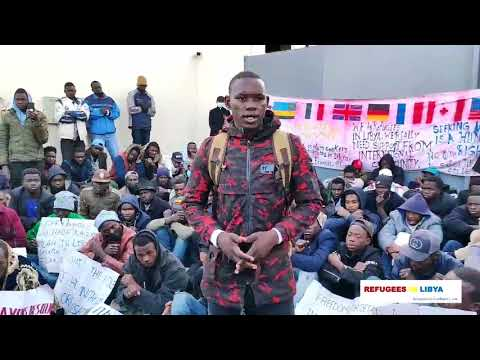

### AYS News Digest 6\.12\.2021: Lethal fencing threatens lives in Poland

**Video Response to Libya UNHCR statement // Hungarian PM ‘ready to battle’ new German government // Comments from the ground: Pope’s visit to Lesbos // Frontex plane only symbolic: Calais policy hasn’t changed // EU Council restrict rights with amended regulations // Online events this week**
#### FEATURE
#### Lethal fencing threatens lives in Poland

 on [Unsplash](https://unsplash.com/s/photos/razor-wire?utm_source=unsplash&utm_medium=referral&utm_content=creditCopyText)](assets/d4599630dea6/0*lrLm4OCiqMdSUQ8I)

Photo Credit: Photo by [Антон Дмитриев](https://unsplash.com/@ehmitrich?utm_source=unsplash&utm_medium=referral&utm_content=creditCopyText) on [Unsplash](https://unsplash.com/s/photos/razor-wire?utm_source=unsplash&utm_medium=referral&utm_content=creditCopyText)

A lethal method of securing the border between Poland and Belarus has been revealed\. [The razor wire fencing](https://oko.press/zasieki-na-bugu/?fbclid=IwAR3F5nAI5EDst1ps29hMxds2S6SmrcdsRSj-yUSoDfC67PntUvVS25PDEsI) on the banks of the Bug River will be a death\-trap for both animals and humans\. This is in direct contradiction to previous announcements — Chancellery of the Prime Minister, Michał Dworczyk declared in August that no fence would be built next to the river\.

Troops from Estonia have assisted Polish forces in repairing fences in the border area, whilst criticism of the river fencing have come from the Mammal Research Institute of the Polish Academy of Sciences\. Prof\. Michał Żmihorski from the Institute explained how both aquatic and land mammals would be negatively impact\.
#### LIBYA
#### Video Response to Libya UNHCR statement

Further to the UNHCR Statement, as shared in the [AYS Special](special-from-libya-protests-in-tripoli-against-a-system-made-to-cause-suffering-77a6ce5ffc6) this week, this speech from the people affected in Libya has been posted\.

#### BOSNIA HERZEGOVINA

[A field update from No Name Kitchen](https://www.facebook.com/watch/?v=426652648934353) describes the shower project and why it’s important\.
#### EASTERN BORDER

[A report has been issued](https://minorityrights.org/2021/12/06/grupa-granica/?fbclid=IwAR3_YaF92BDJ3Fx6chEbDeyLJQ_nhMhjsLhOcy476o5zf2uuVgNSM3DPJu4) which summarises the work of the NGO collectives working in this area\. See the link for online event information\.

This comes as [further criticism](https://twitter.com/NatalieSGruber/status/1467543584274538502?fbclid=IwAR2qaGQCcYN_Z6Xd_EzIjEhJxfR18KG3TgkR7iweeTosJUrVKTmpOe5oImg) of the weekend’s concert for Polish troops [has been posted](https://twitter.com/maledictus/status/1467542434016116741?fbclid=IwAR2S2AI6zuUl0bH06hCuLlfMzMb0wQZZmrZCVaUwH_XaSFNm-XIxlf8bMOk) \.
#### HUNGARY
#### Hungarian PM ‘reading to battle’ new German government

Prime Minister Viktor [Orbán has stated](https://twitter.com/EuroSandor/status/1467847509624205312?fbclid=IwAR3_YaF92BDJ3Fx6chEbDeyLJQ_nhMhjsLhOcy476o5zf2uuVgNSM3DPJu4) that he is ready to battle the new German government\. As Angela Merkel steps down, the new government is described as being “ [pro\-immigration, pro\-gender, federalist with a pro German EU agenda](https://twitter.com/EuroSandor/status/1467847509624205312?fbclid=IwAR3_YaF92BDJ3Fx6chEbDeyLJQ_nhMhjsLhOcy476o5zf2uuVgNSM3DPJu4) ”\. Merkel’s own role in the rush of people arriving in 2015 is often demonised — [this video explains what really happened\.](https://www.youtube.com/watch?v=a0g0BDEid8M)
#### GREECE
#### Comments from the ground: Pope’s visit to Lesbos

The head of the Catholic Church, Pope Francis, visited the Greek island of Lesbos at the weekend\. [This is the response](https://www.facebook.com/MoriaWhiteHelmets/posts/456063552703376) to his visit by an organisation, which described how improvements had been made in preparation for the visit\.
#### SPAIN

News of human rights violations comes from the Spanish enclave of Melilla\. [Three young men were trapped](https://www.facebook.com/NoNameKitchenBelgrade/posts/1372958793102401) at the border with Morocco and were claiming their legal right to asylum\. The intervention of several organisations resulted in a satisfactory conclusion\.
#### FRANCE
#### Frontex plane only symbolic: Calais policy hasn’t changed

](assets/d4599630dea6/0*5w64bUAEoTXEyFQP)

Photo Credit: [Screenshot from ads\-b\.nl for the flight on December 6, 2021\.](https://calais.bordermonitoring.eu/2021/12/06/kein-kurswechsel-in-sicht/?fbclid=IwAR3pEE1wV7rYIay7gIoZP9HfGOeHLhQmQhJ_ZguN-PRo-aVffmoWIt6PwKQ)

Frontex is accused of only symbolically contributing to the safety of people in the Channel\. The Frontex plane that was sent to monitor the area has so far done nothing to help — according to [Calais Border Monitoring](https://calais.bordermonitoring.eu/2021/12/06/kein-kurswechsel-in-sicht/?fbclid=IwAR3pEE1wV7rYIay7gIoZP9HfGOeHLhQmQhJ_ZguN-PRo-aVffmoWIt6PwKQ) \. “It is clearly noticeable that it has not flown over the sea” they reported, along with comments relating to the lack of any change in French policy\. [Footage of state harassment](https://twitter.com/HumanRightsObs/status/1467880194052657159?fbclid=IwAR3FLGVH3uaiP7ysOYjCIFuC-3zDwBtbcKRg8ouVqeLAYBW2p7X2yBUQUy0) where tents and belongings were taken was shared on Monday\.
#### UK
#### Boat driver jailed in UK

](assets/d4599630dea6/0*Av-Smnyqb50pL6fe)

Photo Credit: Hammad Al Shamari, via [Twitter](https://twitter.com/SimonJonesNews/status/1467931616760762373?fbclid=IwAR0IZ_Xa-vOhXtfDkABD9riVciFJE5aT1XbMGwO6pWGMG4RiCEaunMWGEfw)

Hammas Al Shamari has been jailed for two and a half years for steering the boat that brought himself and 25 others across the Channel\. From the Kuwaiti Bidoon region, he was found guilty of ‘assisting unlawful immigration’\.

[This article](https://blogs.lse.ac.uk/europpblog/2021/12/06/bodies-at-borders-why-it-is-vital-to-humanise-migrants/?fbclid=IwAR0lyksG5UFxv6VgN0cqVN_uZorpzJNz9hsg6MTQjT5cwv4oE1d7JLmZAz8) approaches the use of language demonstrated in publications in response to the sad deaths for 27 people in the Channel\. The headlines of ’27 migrants die’ is dehumanising and this language fails to highlight the loss of people with families, friends and personal stories\.
#### EU \+ FRONTEX
#### EU Council restrict rights with amended regulations

The EU Council [has made a proposal](https://www.statewatch.org/news/2021/december/eu-tracking-the-pact-council-restricts-rights-in-latest-screening-regulation-text/?fbclid=IwAR2tLAS_rJQCfozmq_C81osTFGZ64LUcgk8hrIj4F2gkEBu3EE4zV-wBGXs) to restrict the rights of people arriving at border countries\.

> “The Council is aiming to water down rights protections in the proposed Screening Regulation, which will see most individuals who enter the EU in an irregular fashion detained at the borders with a view to their swift expulsion\.” 

This move would see protections for those seeking asylum reduced by removing obligations of the authorities in the country that they are in\.

Meanwhile, [this article summarises the use of technology](https://www.theguardian.com/global-development/2021/dec/06/fortress-europe-the-millions-spent-on-military-grade-tech-to-deter-refugees?CMP=Share_AndroidApp_Other&fbclid=IwAR3LFnyeiQNmU-pyuNxnDo7K_gdHqo2dAzTH86YpQdKvMTKTzvpSyNqwlEs) and Artificial Intelligence in use at the cost to the EU tax payer\.
#### FURTHER INTEREST

Online Seminar: [Refugee Narratives in Denmark](https://euc.yasar.edu.tr/announcements/online-seminar-refugee-narratives-in-turkey-denmark/?fbclid=IwAR1kgJ1XHesZbsaagiGe7Vb8ZhLORTPvDhNxhlv-kQ70Gbj03H-GZBnc0Jc) 9th December\.

Online Event: A discussion of the [Report on the Humanitarian Crisis on the Polish\-Belarusian Border](https://minorityrights.org/2021/12/06/grupa-granica/?fbclid=IwAR3_YaF92BDJ3Fx6chEbDeyLJQ_nhMhjsLhOcy476o5zf2uuVgNSM3DPJu4) \. 9th December

**Find daily updates and special reports on our [Medium page](https://medium.com/are-you-syrious) \.**

**If you wish to contribute, either by writing a report or a story, or by joining the info gathering team, please let us know\.**

**We strive to echo correct news from the ground through collaboration and fairness\. Every effort has been made to credit organisations and individuals with regard to the supply of information, video, and photo material \(in cases where the source wanted to be accredited\) \. Please notify us regarding corrections\.**

**If there’s anything you want to share or comment, contact us through Facebook, Twitter or write to: areyousyrious@gmail\.com**

_Converted [Medium Post](https://medium.com/are-you-syrious/ays-news-digest-6-12-2021-lethal-fencing-threatens-lives-in-poland-d4599630dea6) by [ZMediumToMarkdown](https://github.com/ZhgChgLi/ZMediumToMarkdown)._
