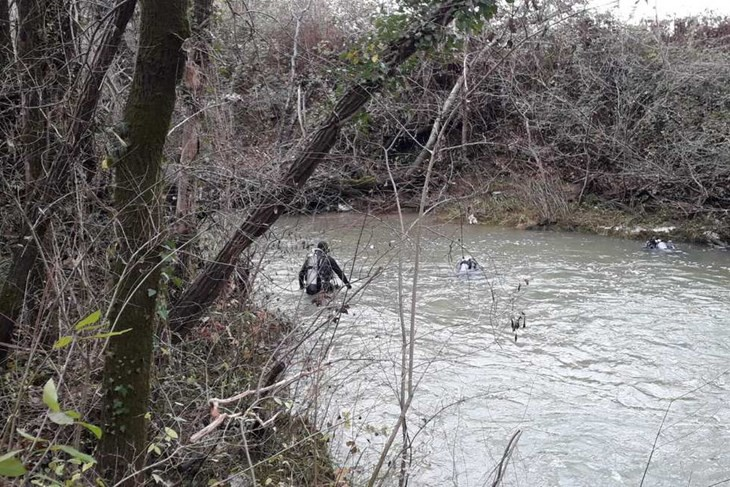
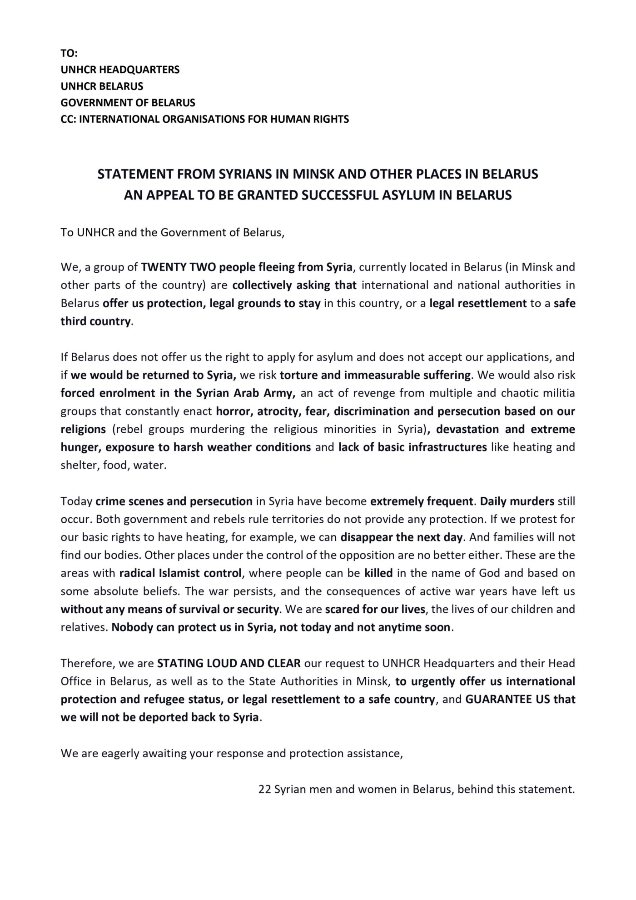
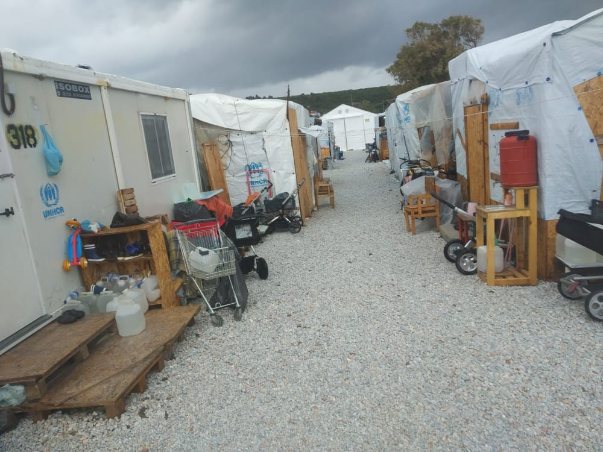
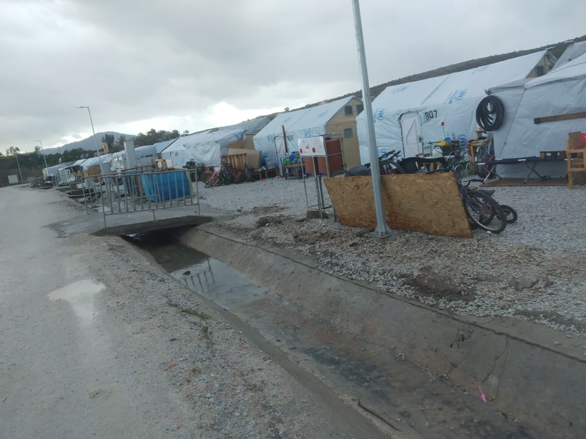

### AYS News Digest 10/12/21: How the pushbacks affect real lives — a child dies in a border river
#### Death at the border / Syrians in Belarus — open letter / Homeless asylum seekers in Belgium / Hungary ignores court decisions \(again\) / SAR updates / Recommended reading and watching material for your weekend & more

Search for the little Kurdish girl who lost her life in river Dragonja, Istria area, between Croatia and Slovenia \(Photo: PU Istarska\)

The tragic death of a child at the border between Slovenia and Croatia marked the international so\-called Human Rights Day\. The constant practice of pushbacks at the inner and outer borders of the EU has affected thousands of people on the move who are left with no other means of reaching for safety other than crossing the green borders by themselves, often risking their lives and the lives of their children\.

A woman who was trying to cross the border to Slovenia with her children was caught in a dangerous situation at the border river Dragonja, causing the tragic drowning of one of the children\. The 47\-year\-old mother was with her children aged 5, 10, 13 and 18\. The youngest and oldest children had already crossed the river, and the 13\-year\-old was still on the Croatian side, and she held the 10\-year old, according to the reports\.

The 10\-year old girl was reportedly a child with impaired hearing and speech\. Her young life ended at the “Schengen gate”, at the border of Croatia with Slovenia, where her desperate mother took the dangerous route, the only one she had at her disposal\. 
A short search that took place on the evening of the tragedy was ended with no result in the search for the child\. The only thing that was found at the time was her disability card\. The search continued on Friday\.

At 9 a\.m\. the next day, a search operation was relaunched again for the 10\-year\-old girl swept away by the river on Thursday night\. The search took place on both sides of the border and also at the mouth of the river\.

> The body of the girl was found on Saturday morning by divers two meters below the surface of the river, Croatian police, [media](https://www.index.hr/vijesti/clanak/pronadjeno-tijelo-curice-koju-je-u-istri-odvukla-rijecna-struja/2324930.aspx) and Slovenian media [reported](https://www.rtvslo.si/crna-kronika/potapljaci-v-dragonji-nasli-10-letno-utopljeno-deklico/604643?fbclid=IwAR0ZR_AyVEYjvVOdy1rg7rdyeVU2wFcUgKKowI6LC4tK6TKKgZByyVVC08E) \. Two meters below and 300 meters from the point where her mother was found\. 

The woman with her children has asked for international protection in Croatia and we will do everything in our power to support them in the unimaginably tragic situation they are in\.

In spite of what one might read in the media reports, this is not a story about the heroism of police officers saving children in the water; it is yet another story of the tragic results of pushbacks at the EU borders, and the policies everyone is directly, indirectly or tacitly accepting and supporting\.
We believe it is very important to keep this in mind\.

We agree with our friends from Info Kolpa in underlining what is most important:

> SAFE PASSAGE must be established along the Balkan migration route immediately, unconditionally, and by any means necessary\. 

> Last night a family tried to enter the Schengen area by crossing the Dragonja river\. The river is very cold and fast\. A mother from Turkey and her four children ran into great difficulty crossing the river\. One of the children — a 10\-year\-old daughter — is still unaccounted for\. We can only assume the child drowned\. The terror this little girl experienced in the last minutes of her life is unimaginable\. 

> But the death of this little girl is not an accident\. Her death and the deaths of many other people travelling along the Balkan migration route are preventable deaths\. 

> We demand accountability for these events from local, state and EU politicians and institutions\. This is their fault\! 

> We have had enough of bloody borders\! The engineers of the brutal migration policies and borders of the EU are nothing but shameful criminals\! 

> We demand respect for human life\! We demand dignity and liberty for all\! 

■■■■■■■■■■■■■■ 
> **[Are You Syrious?](https://twitter.com/areyousyrious) @ Twitter Says:** 

> > Today is #HumanRightsDay, but we should not look away from the violations of human rights that occur at our borders, in our cities, and in local detention centers every day, often by the same institutions tweeting in this hashtag 

> **Tweeted at [2021-12-10 16:28:14](https://twitter.com/areyousyrious/status/1469343209314738185).** 

■■■■■■■■■■■■■■ 

#### BELARUS

We have been asked by the activists helping in the area and by those representing the many people stuck in Belarus and fleeing for a number of reasons, to share the letter they wrote this week, addressed to organisations with any to significant power to do something about their situation, and to the international community\. We share it in full and their version:

#### SEA
### Seebrücke report from the Atlantic

Many people are still trying to reach the Canary Islands by sea, one of the deadliest routes in the world\.

> Only a few days ago, the Spanish sea rescue Salvamento Marítimo rescued more than 300 people in distress off Fuerteventura in several operations\. A two\-month\-old baby died during the crossing, presumably from hypothermia\. 

According to the IOM, at least 937 people have died on this route this year alone\.

> Whether in the central Mediterranean, at the Polish\-Belarusian border or in the Atlantic — the deaths at Europe’s external borders must stop\! We demand safe passage and a European, state\-run sea rescue mission\! 

#### ITALY
### **_I welcome_ campaign launched**

[A series of initiatives](https://www.asgi.it/notizie/io-accolgo-un-decalogo-per-laccoglienza/?fbclid=IwAR1WAiuZuEZHhgc808Qp0nbNnA2n8lF9zqU7uB57SGGBE3DYPSju6CLeAGA) both locally and internationally will be running from 10th to 18th December, the International Day of Migrants\.

> Ten proposals will be sent to the government so that Europe adopts homogeneous standards for the reception of refugees, guaranteeing their protection of rights and dignity, hosting them in suitable structures\. 

You can read them \(in Italian\) [HERE](https://view.officeapps.live.com/op/view.aspx?src=https%3A%2F%2Fioaccolgo.it%2Fsites%2Fdefault%2Ffiles%2FPer%2520un%2520nuovo%2520patto%2520europeo.docx&wdOrigin=BROWSELINK) \.

Particularly important as [Italy hands over surveillance tech to the Libyan Coast Guard](https://www.migazin.de/2021/12/09/eu-entwicklungshilfe-italien-ueberwachungstechnik-kuestenwache/?fbclid=IwAR2tGtM7zeTr2jjA-xEuwZ12IYv_EbpGr06zasbzyNmX2i4awuVD7FmCl7A) , furthering their ability to locate and pull back people on the move to the diabolical conditions in Libyan detention centres\.
#### GREECE
### Still no cash assistance

And the question remains, how will people eat? See our Special on [food scarcity](ays-special-from-greece-are-you-eligible-to-eat-8cc3ac6bed3e) \. A new piece on the impact of living without cash assistance is coming soon\.

■■■■■■■■■■■■■■ 
> **[Martha Roussou](https://twitter.com/MarthaRoussou) @ Twitter Says:** 

> > 70 days without cash assistance.
On 14 October @[migrationgovgr](https://twitter.com/migrationgovgr) denied there were issues with the transition of the cash programme from @[UNHCRGreece](https://twitter.com/UNHCRGreece) and made public assurances asylum seekers would get their cash by the end of October.
This hasn't happened.
[efsyn.gr/ellada/dikaiom…](https://www.efsyn.gr/ellada/dikaiomata/323009_hiliades-prosfyges-stin-ellada-horis-miso-eyro-stin-tsepi) 

> **Tweeted at [2021-12-10 10:00:07](https://twitter.com/martharoussou/status/1469245537090166789).** 

■■■■■■■■■■■■■■ 

#### Human rights in Greece?

 \)](assets/ec7028264272/1*uSkgRzLstTW2sMlEIGzm9A.jpeg)

\(Photo Credit: [Moria Corona Awareness Team](https://www.facebook.com/MoriaWhiteHelmets/posts/458494945793570) \)

[Moria Corona Awareness Team](https://www.facebook.com/MoriaCoronaAwarenessTeam/posts/436702164625626) have republished their statement from last year’s Human Rights Day to remind Europe how little has changed for the majority of people on the move\.

> Don’t we have simple rights as humans and refugees in Europe that cover basic services to everyone? We read and hear that we have to live like animals in these camps, but we think it is not true\. We studied the laws to protect animals in Europe and we found out they have more rights than we do\. 

While [Doctors of the World told an Italian newspaper](https://espresso.repubblica.it/mondo/2021/12/08/news/medici_senza_frontiere_lesbo_bimbi_migranti-329266754/?fbclid=IwAR3Iz1jaiY34nWbedtkQ1K_3rVyNqwu4SNL6wOZSA0HVE402iE9ybnyABl8) that in Moria 2\.0:

> We are experiencing a worsening of the psychological condition of our patients, both adults and children\. 

In a predictably awful move, the Migration Minister has been celebrating illegal pushbacks on International Human Right Day…

■■■■■■■■■■■■■■ 
> **[Eleni Konstantopoulo](https://twitter.com/EleniKonstanto) @ Twitter Says:** 

> > #Greece's minister of #migration &amp; #asylum posts on his Twitter account 'the homeland ( πατρίδα) on  immigration, in Evros &amp; on the (Aegean) islands organized and won'. 
🇬🇷 Is celebrating its #HumanRightsViolations against #Refugeesgr  on #HumanRightsDay 

> **Tweeted at [2021-12-10 20:42:11](https://twitter.com/elenikonstanto/status/1469407115781550081).** 

■■■■■■■■■■■■■■ 

On a positive note, [two complaints have been filed](https://racistcrimeswatch-wordpress-com.translate.goog/2021/12/10/1-1281/?fbclid=IwAR3_V5mh6aUrVXafUDPM77beHPCtGlPfSGu-st3zJ5iX6-84jKKoYAa1jRQ&_x_tr_sl=auto&_x_tr_tl=en&_x_tr_hl=el) with the National Transparency Authority\. [Indictment for investigation of 147 cases of illegal, violent, racist deportation or deportation of 7000\+ foreigners during the period March — December 2020](https://racistcrimeswatch-wordpress-com.translate.goog/2021/05/04/1-1184/?_x_tr_sl=auto&_x_tr_tl=en&_x_tr_hl=el) and [Indictment for the investigation of 55 cases of illegal, violent, racist deportation or deportation of approximately 3,000 foreigners during the period January — May 2021](https://racistcrimeswatch-wordpress-com.translate.goog/2021/07/20/1-1210/?_x_tr_sl=auto&_x_tr_tl=en&_x_tr_hl=el)

Because no matter how inconvenient it is to national Governments, pushbacks are, and will remain, illegal\.
### Khora, five years of solidarity

Khora, a community project in Athens including a Social Kitchen, Asylum Support, Freeshop and Creative Space are celebrating their fifth anniversary and asking for support to continue in 2022\.
### Frontex denies breaking the law \(again…\)

According to [Balkan Insight](https://balkaninsight.com/2021/12/09/frontex-denies-expelling-migrant-watchdog-team-from-greek-border/?fbclid=IwAR1Bc2jffGWEuTuMD5MfwIx716OHKdcgqUO0_weuKHwJJ83MWpXHGYJcaiE) , Frontex has denied forcing a team from an Italian\-based rights watchdog to “leave Greece and go back to North Macedonia, saying due process was followed — and the team had expressed a wish to return to North Macedonia\.” The team in question deny this and state the process was informal, that they were given no documentation and that they had crossed the border legally using an official crossing\.
#### HUNGARY
### Hungarian court refuses to challenge EU Ruling

[Following on from a ruling by the Court of Justice of the European Union last month](https://www.dw.com/en/hungarian-top-court-declines-to-rule-on-eu-law-in-asylum-case/a-60077221?fbclid=IwAR2nHvbOk8Cf9ONdQ_nqMbvdK_yZyzP5SLEc4y9h-wb76Ul5LhK7Uqer9Ak) — that Hungary had failed to fulfil its obligations under EU law by finding asylum applications inadmissible if the asylum\-seeker had arrived in Hungary via a “safe” third country, while at the same time criminalizing the provision of asylum assistance — Prime Minister Viktor Orban had asked Hungary’s Constitutional Court to review the finding\. While the court stated that this was not possible, they did state that Hungary’s constitution protects the “inalienable right” of the country to “determine its territorial unity, population, form of government and state structure\.”
#### BELGIUM
### Homeless asylum seekers on the streets

About [150 to 200 people are left queuing](https://www.infomigrants.net/en/post/37143/belgium-hundreds-of-asylum-seekers-on-the-street?fbclid=IwAR3_V5mh6aUrVXafUDPM77beHPCtGlPfSGu-st3zJ5iX6-84jKKoYAa1jRQ) outside the federal agency for the support of asylum seekers every day in Brussels\. The current reception places are full, in part due to Belgians being made homeless due to recent floods and housed in reception facilities meant for people on the move\. The situation has been widely condemned as foreseeable and thus solvable\. Some people have been left with no choice but to [occupy a church](https://www.facebook.com/cireasbl/posts/4666638266760873) to sleep in and they have now been there for ten months\. [New reception spaces have been promised](https://www.facebook.com/bxlrefugees/posts/1571201806552109) but are said to be too little too late and for now people remain homeless as temperatures drop to minus 4\.
#### THE NETHERLANDS
### 200 new accommodation spaces

[Veldhoven holiday park](https://eindhovennews.com/news/2021/12/refugees-welcome-in-veldhoven-holiday-park/?fbclid=IwAR31W311NhnOjvT_Tbf0YdDm0DNoWQgP2XYPXij3rsNl9ka97fv3EpUATDs) will house 200 people with residence permits while more permanent accommodation is found\.
#### FRANCE
### Questions over Choose Love quitting Calais

[Corporate Watch report on Choose Love](https://corporatewatch.org/choose-love-why-is-the-charity-funder-quitting-calais-this-christmas/?fbclid=IwAR3qu0lAI7DhZAJAMziXcZ91pQz797tncmnlt7l-479iAWROdKvhvfZDs0I) ’s decision to stop funding the majority of their projects in Calais for unclear reasons and their stance on safety at sea leaflets\. Many groups have now been left with funding gaps to fill while [the situation for people on the move remains grim](https://de.euronews.com/2021/12/09/fluchtlinge-in-calais-keine-wahl-als-weitermachen?fbclid=IwAR07fxnj9izJLTNYtPveHoolg_DgtBLiMk7YVZjoW_9PczSg3k9WMhXirfk) and people still attempt to cross despite the terrible risk\.
### Legal action against evictions in Grande\-Synthe

Several exiled people, alongside Human Rights Observers \(Project of the Auberge des Migrants\) and Utopia 56, are [taking legal action](http://www.utopia56.com/fr/actualite/saisie-justice-pour-deux-expulsions-campements-a-grande-synthe?fbclid=IwAR3j3bUYGmeMppstPIU7KSwtrDGMv1I7VFVMszy6ZVY10FOtJ1lh0cjeVtw) to challenge the legality of their eviction from their camp on the 13 and 26 October 2021\. Over 600 people were evicted at this time, including families and children\.
### Anti\-racism and solidarity campaign

[Solidarité migrants Wilson](https://www.facebook.com/Solidarit%C3%A9-migrants-Wilson-598228360377940/?__cft__[0]=AZV4OsYNVsDF1pzVXY88_ND0ygJAwf0HL0WGl2Isiv9jcDo_eqS3o3DSEXdOjtiUub8v7CbbJ6dnz8RWHiStNXBPeCWmv27lwDmy4lCbVi0x4vaNat2TUTVuDbgr-JJPKEZkDy66lvlocJHrvk_mMRIF&__tn__=-UC%2CP-R) have published a call:

> More than 200 organizations, local and national, and 800 signatories today launch the campaign “Antiracism and Solidarity” with the call below “Wherever you come from, wherever you are born, Our country is called Solidarity\.” 

> Across the territory, the demonstrations of December 18, on the occasion of the International Day of Migrants, will be the starting point of this solidarity response to racist and security policies and speeches\. 

> Open signatures and demonstration details on the website: [https://www\.antiracisme\-solidarite\.org](https://l.facebook.com/l.php?u=https%3A%2F%2Fwww.antiracisme-solidarite.org%2F%3Ffbclid%3DIwAR0kTjxkvnv45s27v_Pi8daHeu2cGYYEyQzS2o-vfQclexOqlvH1afSemOo&h=AT2jFvobEGxOWskHDYqFtLMz47g14TgZt5ji9ISt0LcK0SW3gX9sydNGoWhj7N0MCyO7B35GmssQcjytn9_hLDHgBT8w3u67B-Jqvr79vOJTdV-Ck3Gegt-iFrK1Jh_R1w&__tn__=-UK-R&c[0]=AT0EfTxtjX3XA7zCXPRq0k0PZjXlWUHtLNa7nI5Bvvawu7LA-E-lPDDdl5auFrH64TeQ5hSflNp9ukM7SjO1dWdJ4jYZXUWsp-PlZa_-YDOvJNPA0TsHmKHyE6qQXj3a99usij7HcIMKEpMfoEAa2i7hblpua7sLug_RTYJSTlLlZWY) 

### HRW call on Macron to protect fundamental rights during EU presidency

France is soon to take over presidency of the Council of the European Union\. [In a letter sent to Macron, Human Rights Watch asks that they](https://www.hrw.org/sites/default/files/media_2021/12/HRW%20Letter%20Ken%20to%20Macron%20PFUE_EN.pdf) :

> Ensure genuine progress of the Council’s scrutiny of the situations in Hungary and Poland under Article 7\.1 proceedings by scheduling regular hearings on the situations in both countries during your Presidency; 

> Ensure the Council adopts time\-bound, specific rule\-of\-law recommendations on the issues addressed in the reasoned opinions of the European Commission on Poland and of the European Parliament on Hungary; 

> Absent concrete steps, pave the way for the four\-fifth vote required to determine that there is a clear risk of a serious breach of the values protected by the EU treaty in order to move forward under Article 7\.2; 

> Encourage the European Commission to make use as soon as possible of the regime of conditionality for the EU budget to defend against breaches of the principles of the rule of law, and ensure the Council to implement decisions proposed by the Commission swiftly and transparently; 

> Ensure that the “Rule of Law Dialogue” based on the EU Commission’s rule\-of\-law reports enhance the capacity of the EU to address serious challenges, including by securing greater consultations of civil society groups in this process, guaranteeing transparency of the Council’s proceedings, and offering concrete recommendations to reviewed states\. 

#### UK
### All\-Party Parliamentary Group calls for closure of Napier Barracks

The report, [shared by State Watch](https://www.statewatch.org/news/2021/december/uk-quasi-detention-of-asylum-seekers-must-be-replaced-with-decent-safe-acommodation-say-mps/?fbclid=IwAR2IqjjEEkrw4ylZEkScjjoX8F8Gn6n7CSsUJq43QTS40gKxj3_SiGBy5-o) , states that:

> The quasi\-detention sites examined in the report replicate many of the features found in detained settings — including visible security measures, surveillance, shared living quarters, lack of privacy, poor access to healthcare, legal advice and means of communication, and isolation from the wider community\. 

Napier is currently set to remain in use until 2025 and has been described as a pilot accommodation project for similar sites to be opened under the Nationality and Borders Bill\. The Bill has been strongly criticised by legal experts and activists alike\. [A protest was held against it in Hastings this week](https://www.sussexlive.co.uk/news/sussex-news/rally-held-hastings-against-controversial-6320982?fbclid=IwAR1i6eIbENvsruJ5Yf5kB7uU_T7cAmTfkf6V1522rEtk30_-ISsQbFbMRVg) on the grounds that it:

> It opens the door to offshore detention and inhumane immigration camps\. It grants the government the power to revoke people’s British citizenship without notice, and this will obviously affect particularly marginalised people\. 

[The Northern Irish Government has also been criticised](https://www.belfasttelegraph.co.uk/news/northern-ireland/syrian-refugees-feel-abandoned-by-ni-government-and-inadequate-integration-strategy-stormont-committee-told-41132713.html?fbclid=IwAR2IqjjEEkrw4ylZEkScjjoX8F8Gn6n7CSsUJq43QTS40gKxj3_SiGBy5-o) for its housing and integration of asylum seekers\. People report being given homes with no heating, inadequate housing for children and not being able to access psychological support\.
### No NHS care for people without status

Not only are the British and other UK Governments housing people in inadequate and in some cases prison\-like conditions, they are also [forcing people to pay for NHS treatment\.](https://www.freemovement.org.uk/nhs-charging-basing-treatment-decisions-on-immigration-status-is-lawful/?fbclid=IwAR2eW_hrad6jNK8-V2GGQszdZz6lGIc3a2_kLvABowrcxMVMOWQvIOghE4s) According to Free Movement, the High Court in _R \(OK\) v The Royal Free London NHS Foundation Trust_ [\[2021\] EWHC 3165](https://www.bailii.org/ew/cases/EWHC/Admin/2021/3165.html) has rejected another challenge to the operation of the NHS charging regulations\.

> This claim for judicial review was brought by OK, a Nigerian man living in England since 1990 but without immigration status since receiving a deportation order in 2014\. OK remained in the UK and, in 2019, was diagnosed with kidney failure after being bitten by his pet puppy \(he tells the story [here](https://dpglaw.co.uk/challenge-to-nhs-trusts-decision-not-to-provide-scheduled-haemodialysis/) \) \. He received dialysis treatment three times a week from the Royal Free London NHS Trust \(at the eye\-watering cost of 150% of [the national tariff](https://www.england.nhs.uk/pay-syst/national-tariff/) \) with free travel to and from appointments\. 

They ruled that he was not eligible for free care unless it was an emergency\. Withholding his care lead to his health deteriorating\.
#### DENMARK
### Protest against Syrian deportations

On the 10th of December, UN Human Rights Day, [Amnesty International Denmark presented thousands of signatures](https://amnesty.dk/95-055-mennesker-i-faelles-opraab-til-mattias-tesfaye-stop-inddragelsen-af-syriske-opholdstilladelser/?fbclid=IwAR0Wz5lAp965Jl8d-VJu8I1L8xJh50vywxYoDq71w9EHbQJBx2H9AZnpG5Y) from all over the world to the Minister for Immigration and Integration, Mattias Tesfaye, against the Danish government’s repatriation policy towards Syrians\.

Read Radwan Fouad Jomaa’s story [HERE](https://www.aljazeera.com/podcasts/2021/12/10/denmark-is-still-trying-to-send-syrians-back?fbclid=IwAR1uqRPlk-pwviWCNhpK-DHZfy2ErfB2zqUgLp13zvji2VHmer1Hg_c9TH8) \.
#### FRONTEX
### Lithuania to lend guns to Frontex

[Frontex Executive Director Fabrice Leggeri](https://frontex.europa.eu/media-centre/news/news-release/frontex-and-lithuania-agree-on-service-weapons-delivered-to-frontex-standing-corps-officers-y3iVzk?fbclid=IwAR0AFUe2H99AIYas-WHSU9H-vEqpPaY3yeMPw63MOwhG7u214UK2xxMKcLo) has confirmed that the EUs first armed police force have had some fire arms training and a mental health assessment\. He described the ability to use guns as increasing Frontex’s flexibility… to do what exactly? He also did not mention what the governing body of this armed force will be\. Terrifying\.

They will also soon be making use of satellite surveillance with [High Altitude Pseudo\-Satellites\.](https://twitter.com/matthimon/status/1469016626087530504?fbclid=IwAR3NTzaJq5MW0WH-UgkhnEigpulVJSxlZg9T1aYb6g3rsHl-sFsl0a58pgo)
### Court case brought by child against Frontex

■■■■■■■■■■■■■■ 
> **[front-LEX](https://twitter.com/LexFront) @ Twitter Says:** 

> > The brave claimant in the 1st human rights case v #Frontex, an unaccompanied minor refugee

tells  @[ylenews](https://twitter.com/ylenews) how his attempt to seek asylum in the 🇪🇺ended with #EU agents throwing him &amp; others to the water, killing his friend &amp; laughing while he was drowning

happy #HumanRightsDay https://t.co/Nka0TXh5Hz 

> **Tweeted at [2021-12-10 10:33:08](https://twitter.com/lexfront/status/1469253845800964099).** 

■■■■■■■■■■■■■■ 

#### EU
### EU will take 40,000 Afghan people

Fifteen [EU states will take a further 40,000 Afghan people](https://www.infomigrants.net/en/post/37132/eu-to-take-more-than-38000-people-from-afghanistan?fbclid=IwAR07fxnj9izJLTNYtPveHoolg_DgtBLiMk7YVZjoW_9PczSg3k9WMhXirfk) with Germany taking the majority, 25,000\. Given that states are not doing a particularly great job of looking after the people already within their territory, we hope a little planning goes into this\.
#### WORTH READING & WATCHING
- [**Vigilante Keeps Hunting Migrants In Bulgaria And The Authorities Seem To Be Turning A Blind Eye**](https://www.rferl.org/a/bulgaria-migrant-hunter-impunity/31601663.html?fbclid=IwAR2GU0lMi9LRRlOre0esmxOfE9E-ksmhd3ekEa35MPyIu6PO4G8OrLCN3dI) _SOFIA — A burly, bald\-headed man in a high\-visibility jacket flaunts a rifle as a group of men lie face down on the ground\. He curses at them and tells them not to come to Bulgaria again\._
- **HumanRights360 presents a [report on their Social Integration Service](https://www.humanrights360.org/wp-content/uploads/2021/12/INTEGRATION-SERVICE_web-en.pdf) \.** _The report contains the work the Service’s methodology and, most importantly, the most common barriers the organization has identified through the services it provides to asylum seekers, recognized refugees and undocumented migrants at the ECHO Hub Athens day centre, open accommodation site of Eleonas and, until recently, in the accommodation site of Skaramangas\._
- [**A new report from the EU Agency for Fundamental Rights \(FRA\)**](https://fra.europa.eu/en/publication/2021/unaccompanied-children-greece) **suggests steps the EU and its Member States should take to offer better protection to unaccompanied children and ensure their rights are respected\.** _Violence, exploitation, terrible living conditions or limited access to healthcare and education\. These are the realities unaccompanied migrant children face in Europe\._
- [**World Vision briefing on child protection and education pledges by selected international actors at the 2019 Global Refugee Forum \(GRF\) \.**](https://www.wvi.org/publications/policy-paper/syria-crisis-response/crossroads-syrian-childrens-needs-and-global?fbclid=IwAR3Iz1jaiY34nWbedtkQ1K_3rVyNqwu4SNL6wOZSA0HVE402iE9ybnyABl8)
- [**Book review: ‘EU Migration Agencies: The Operation and Cooperation of Frontex, EASO and Europol’**](https://www.statewatch.org/news/2021/december/book-review-eu-migration-agencies-the-operation-and-cooperation-of-frontex-easo-and-europol/?fbclid=IwAR3qu0lAI7DhZAJAMziXcZ91pQz797tncmnlt7l-479iAWROdKvhvfZDs0I) _David Fernández\-Rojo’s comparative analysis, published by Edward Elgar Publishing, explores the way in which the three agencies have grown together, and what this means for the future of migration management\._
- [**ECRE Weekly Bulletin**](https://mailchi.mp/ecre/ecre-weekly-bulletin-10122021?e=1fd2db1ebf&fbclid=IwAR1Bc2jffGWEuTuMD5MfwIx716OHKdcgqUO0_weuKHwJJ83MWpXHGYJcaiE#Vacancies)
- [**ECRE Weekly Legal Update**](https://mailchi.mp/ecre/elena-weekly-legal-update-10-december-2021?e=1fd2db1ebf&fbclid=IwAR1zqta4gJPhTKK2g51poE6B4XKTAdBs4iBbRcPltoqW0-XiJlDFgf8CERY)
- [**New circular from Medico**](https://www.medico.de/material/rundschreiben/2021/ueber-die-grenze?fbclid=IwAR1bWxdd5oSBK8OrYYp4jAidh9LEMFUSb2Ylb3gNuelrFFxZ08LIWbBojnQ) _Afghanistan: A turning point of global dimension \| Permanent state of emergency: Sahel, Haiti, Lebanon, Lesvos \| Europe is Dead: Berlin and the Colonialism Debate_
- [**Sharp Borders: Technology, Pushbacks and Interdisciplinary Investigations**](https://www.youtube.com/watch?v=lDZUkksORx4) **\.** _As borders sharpen all around the world, new technologies are making various human rights abuses possible\. Join our interdisciplinary panel of journalists and civil society to discuss the growing practice of pushbacks at European borders, facilitated by increased surveillance and a lack of accountability\. Our panel includes audio journalist Lydia Emmanouilidou, investigative reporter Giorgos Christides, and migrant justice organizer and co\-founder of Josoor Natalie Grueber, reflecting on broader trends and individual cases from the frontlines\._

**Find daily updates and special reports on our [Medium page](https://medium.com/are-you-syrious) \.**

**If you wish to contribute, either by writing a report or a story, or by joining the info gathering team, please let us know\.**

**We strive to echo correct news from the ground through collaboration and fairness\. Every effort has been made to credit organisations and individuals with regard to the supply of information, video, and photo material \(in cases where the source wanted to be accredited\) \. Please notify us regarding corrections\.**

**If there’s anything you want to share or comment, contact us through Facebook, Twitter or write to: areyousyrious@gmail\.com**

_Converted [Medium Post](https://medium.com/are-you-syrious/ays-news-digest-10-12-21-how-the-pushbacks-affect-real-lives-a-child-dies-in-a-border-river-ec7028264272) by [ZMediumToMarkdown](https://github.com/ZhgChgLi/ZMediumToMarkdown)._
