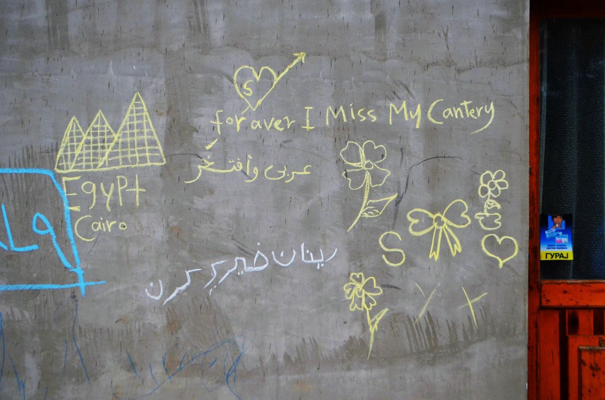
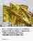
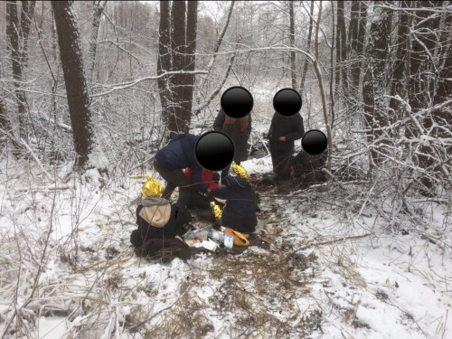
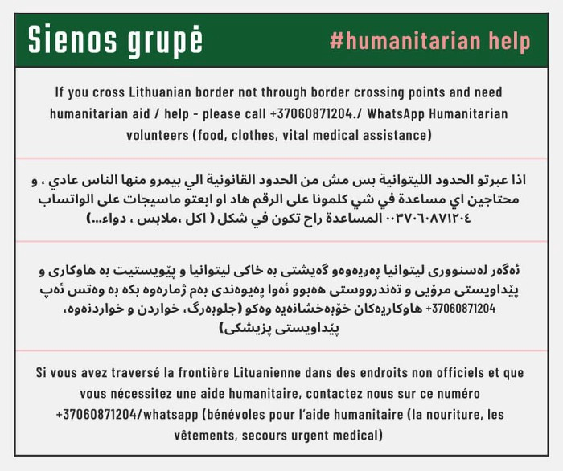

### AYS Weekend Digest 11–12/12/21: The only children not looking forward to their 18th birthday
#### Action to support unaccompanied minors in Greece / worries about health care program continuation / updates and news from the border area with Belarus / several suggestions for reading and watching for you today

### FEATURED

2519unaccompanied children live in Greece\. 
Accomodation options are limited to reception centres \(also known as camps\), protective custody \(despite the greek government committing to end the use of so called protective custody in 2020\), open temporary accommodation centres and ‘informal housing conditions’\.

> _All this leaves children at risk of [sexual abuse](https://l.facebook.com/l.php?u=https%3A%2F%2Fchildhub.org%2Fen%2Fchild-protection-news%2Fsexual-exploitation-minor-refugees-greece%3Flanguage%3Dhu%26fbclid%3DIwAR3_-jLgnApBXdRxmUPjjGbqP_g9sxF_zQrTfron4kiBy2UHHLtxfR__d4I&h=AT0jZqx1vwHYVF2gMWAgMCoAMU-74aJziZDYiTqpOJWcb6pUBRWqQx_aSMo_lIVDwvlsu6esK9wDz64h4a6NhljZopfSznXD4vintT9rAkxJPsoHsYJyZt21gKrBkD_tWVs2CFN5rPRf7w&__tn__=R]-R&c[0]=AT04VjHqx8JgVwciKjL5LbmYm1o6LZhlSaCHCV6B_2WTWpwlIJ3DirnFkEI7_XwmBsIm6H-GgrCWOEWkSp8vpBcm4tVpTnjbEnEKYUD2URdEO3Gz24ooov9D_ewaA8ah3jpBgemz7FQUeFsVgqFHr-Ra9NTEX8cy4f8DgZ9ZQ6kjyvhNWG2YlVyTe6lbBqpyjFU0IxqeNgir) and labour exploitation\._ 

Over the last five years, children have reported to Velos Youth that they live with unrelated adults, in overcrowded apartments, and are expected to either pay above market rents or offer labour in its place\.

_Some of the background on unaccompanied minors can be [followed](https://l.facebook.com/l.php?u=https%3A%2F%2Fwww.hrw.org%2Fnews%2F2020%2F11%2F19%2Fgreece-commits-end-protective-child-detention%3Ffbclid%3DIwAR1ImvX9hXUdpzmeBTfBA8rT_7P7JB-O-HaaHwFYPt0j71DP0tP9jn1uXTw&h=AT1ECh9BNUNkxwC2A4BX-LWNREkt-nC7VER2hPQE2iOFGcqn_M6TqXsru_2sSfjNSTiAQ2nu5y4F85nOkVCu61FkdW1iDV4_VdSp13FXXvaBkCbQIBwNkDMwnkrVAu0pAoc3pS1XX273kw&__tn__=R]-R&c[0]=AT04VjHqx8JgVwciKjL5LbmYm1o6LZhlSaCHCV6B_2WTWpwlIJ3DirnFkEI7_XwmBsIm6H-GgrCWOEWkSp8vpBcm4tVpTnjbEnEKYUD2URdEO3Gz24ooov9D_ewaA8ah3jpBgemz7FQUeFsVgqFHr-Ra9NTEX8cy4f8DgZ9ZQ6kjyvhNWG2YlVyTe6lbBqpyjFU0IxqeNgir) here\._

For those who are in accommodation centres for children, turning 18 can mean losing their shelter on their eighteenth birthday\. Where can they go next? They can apply to live in a reception centre or a housing project run by an NGO, or find their own privately rented accomodation\. If these options aren’t possible \(which for the majority it isn’t\), they must return to ‘informal housing conditions’ and lose all other forms of state assistance at the same time\.

Velos is launching a crowdfunding and awareness campaign which will follow Haji over 8 days as he turns 18, becomes homeless, moves into the Velos Youth Young Person’s Apartment, and tries once again to rebuild his life in Athens\. Follow and share the campaign on Instagram and Facebook, and donate here:
### [Rent to Restart: Follow and support a displaced young person as they rebuild their life Athens \|…](https://www.omprakash.org/global/velos-youth/crowdfund/follow-and-support-haji-as-he-builds-an-autonomous-life-in-athens?fbclid=IwAR3cgGIYht6oIgQsMu6jOeCtKne_LzvKwCGM-DK9yvgTPjAo6zk5iTu7tfw)
### [Rent to Restart: Follow and support a displaced young person as they rebuild their life Athens RAISED BY 2 PEOPLE IN 17…](https://www.omprakash.org/global/velos-youth/crowdfund/follow-and-support-haji-as-he-builds-an-autonomous-life-in-athens?fbclid=IwAR3cgGIYht6oIgQsMu6jOeCtKne_LzvKwCGM-DK9yvgTPjAo6zk5iTu7tfw)

[www\.omprakash\.org](https://www.omprakash.org/global/velos-youth/crowdfund/follow-and-support-haji-as-he-builds-an-autonomous-life-in-athens?fbclid=IwAR3cgGIYht6oIgQsMu6jOeCtKne_LzvKwCGM-DK9yvgTPjAo6zk5iTu7tfw)
### LIBYA

While the UN “raises alarm” over the severity of situation, not much has changed and tragically, another person has died in front of the UNHCR headquarter in Tripoli, it was reported and sadly published in photos [here](https://www.facebook.com/tarik.lamloum/posts/4656813904407429) \.

Don’t miss follow up stories published in our Specials series, among which is the latest report on Libya:
### [AYS Special from Libya: Protests in Tripoli against a system made “to cause suffering”](special-from-libya-protests-in-tripoli-against-a-system-made-to-cause-suffering-77a6ce5ffc6)
### [For 2\+ months, 1000s people are protesting in front of UNHCR Centre\. As \#RefugeesInLibya, they mobilise and challenge…](special-from-libya-protests-in-tripoli-against-a-system-made-to-cause-suffering-77a6ce5ffc6)

[medium\.com](special-from-libya-protests-in-tripoli-against-a-system-made-to-cause-suffering-77a6ce5ffc6)
### GREECE
### Will the health care services continue and what is the future of Philos II ?

Employees within the PHILOS II program of the Greek government have lodged serious complaints in how the program whose objective of providing primary health care services has been managed in material substance and in the absence of services from EODY for the refugees, indicating that the program never fulfilled its purposes, undermining the project objectives for which they were hired, [Eleni Konstantopoulo](https://twitter.com/EleniKonstanto) writes\. As the is about to expire this month, the contract health care workers who have been employed for this program have not been informed as to the status of their jobs or if the program will continue, so it is still unclear how and if the AMIF program will continue\.
### BELGIUM

The ASBL Coordination and Initiatives for Refugees and Foreigners \(CIRÉ\) took action to action organise a gathering in front of the offices of the Office of Foreigners this Friday\. On the occasion of International Human Rights Day, the association wanted to call for respect for human rights for people on the move\. [here](https://www.lesoir.be/411630/article/2021-12-10/migration-le-cire-proteste-devant-loffice-des-etrangers-ce-vendredi?fbclid=IwAR1H9sUiscefakVYzzKdcqKc-RFPdZltDQ6k2wXqdaHYKbbCztWPo68MniY) ’s more\.
### BELARUS BORDER

OKO Press p [ublishe](https://l.facebook.com/l.php?u=https%3A%2F%2Foko.press%2Fjakby-to-nie-byli-ludzie-13-form-bezwzglednej-przemocy-polskich-sluzb-granicznych-katalog-bezprawia%2F%3Ffbclid%3DIwAR2M819m-cZpugAg0fHAmyWNwEpBByk3w1yqqi7Fcf97WNkt72_MQYsqzFc&h=AT1odo7QbK2DaAFPQE6YHAp6aBiWVWGn70let4ChZQpiA94fysVUXDyrZOunmh_Jidym3jsH29qsUzf_cTJy_kutKrSnyRutyb9GYeVtlbV63myTV7NR5HHHsV15M_sdyZYclVo1rPMilA&__tn__=R]-R&c[0]=AT3KZjmsespEjgimOrPqyOzYXB2nc36WUkS1oH76pS0yFeecrLLPWAH3v482O2Z-AJ3dpe94Qz5XQfhctHhVaL1KcGZfzagcNfN-QAnj-9dGvo_2bTgtE65x7YRJ45eJnDd8G5kqWzLHx5X_ZUHY0ymuGi1X55i-PqtYGVSSGbCOdBC8KHA_2rbfCQBg1PnjUo8eF17dhbwd) d a Catalogue of violations of fundamental human rights by Polish border services\. 12 actions towards migrants that expose them to suffering, loss of health and death\.

1\- Push\-backs, also of families with young children, even pregnant women

2\- Separation of families, pushing minors abroad

3\- Driving the sick out of hospitals into the forests

4\- Sentencing migrants to torture

5\- Blocking/obstructing medical interventions

6\- Blocking the delivery of food and aid to refugees

7\- Destroying/stealing phones or sim cards

8\- Pushing through barbed wire

9\- Physical violence, psychological violence

10\- Thrusting into rivers, marshes in strict reservation

11\- Chasing dogs

12\- Taking away sleeping bags, food

13\- Dragging dead bodies

Grupa Granica invited for support and action as a part of the gatherings taking place in and around Polish cities:

“The humanitarian crisis at the border continues, we are finding out about more victims, the temperature drops to minus 15 degrees Celsius\. The pseudo\-exceptional state was maintained, and if there was no humanitarian, medical and independent observers, there is no at the border due to the ban on entry\. But there’s something about it that helps not lose hope\. It is your unwavering commitment, your indifference, ingenuity, willingness to bring help and solidarity with refugees and refugees, with migrants and migrants\.”

### Going underground

People from Iraq, Syria, Afghanistan or elsewhere who cross the border into Poland from Belarus are also forced to go “underground” to avoid being caught by Polish authorities before reaching their destination, Germany\.

But what happens to those who don’t make it to the German border and remain in Poland? [InfoMigrants](https://l.facebook.com/l.php?u=https%3A%2F%2Fwww.infomigrants.net%2Fen%2Fpost%2F37090%2Fwedrzyn-we-dont-want-another-guantanamo-in-the-woods-of-poland%3Ffbclid%3DIwAR0q6ZU8QaWg0qNI4rKkPvr9ZYItOKrfCzvAOLEpo47cNtPAV6c3Q4EF9Ik&h=AT24QyqxLKA9JJYwQu1mxnIQSxuK9pKn8Pj7pBXJahCC2ZdSsq2gdfoKo_ravBt2-loDy5LOYfh-5ZQ49sdt6NAeldnZTdCrJmS3h9Gf4JxKJKSvtNikqdI_aIxlyCSzB9WAZ9Qp7SHQFQ&__tn__=R]-R&c[0]=AT1z67kmzg3Jk_7UTXj2B84CDuJpOV74O1PdPxMqpt6-urQuGn_0-j85M97wMZ-BO59r3J082k0u3-ZMGuzIgFgmPy1SOA6wNIUNOTrtBst4XKAEBp2j1jOkHV-EL5PY3ASZ4DWwkPuKVUN8j4UYi4N64Zu3mjTWIpiFodyajieYDiv9g5MIZLDP2WZMavAWYCZ_Mkt5qx7V) brings a story on the people stuck on the way\.
### [Is Poland violating international law at its border?](https://l.facebook.com/l.php?u=https%3A%2F%2Fwww.aljazeera.com%2Fprogram%2Fupfront%2F2021%2F12%2F10%2Fis-poland-violating-international-law-at-its-border%3Ffbclid%3DIwAR3pzboXMfiQ8Rrn8O4l0lvGmeWqYvwTNnrqsnpYwYWG5vaTuoIeDcPRFqI&h=AT2y6DXZyKzJdMKOVydhsfN8ayVrU9Day3cQjokvHzgmzezsRyl35bOxDbIyIyMG_u8zc9IeYJaXy_dXIF3mz4BGhB7ADfe1NdUEEx5s3Nrrvn4A4uY5we7Flkr8d-1LjqgceU-ZQ4oNPw&__tn__=R]-R&c[0]=AT1z67kmzg3Jk_7UTXj2B84CDuJpOV74O1PdPxMqpt6-urQuGn_0-j85M97wMZ-BO59r3J082k0u3-ZMGuzIgFgmPy1SOA6wNIUNOTrtBst4XKAEBp2j1jOkHV-EL5PY3ASZ4DWwkPuKVUN8j4UYi4N64Zu3mjTWIpiFodyajieYDiv9g5MIZLDP2WZMavAWYCZ_Mkt5qx7V)
### [Marc Lamont Hill challenges Poland’s deputy foreign minister on the humanitarian crisis at the border with Belarus\.](https://l.facebook.com/l.php?u=https%3A%2F%2Fwww.aljazeera.com%2Fprogram%2Fupfront%2F2021%2F12%2F10%2Fis-poland-violating-international-law-at-its-border%3Ffbclid%3DIwAR3pzboXMfiQ8Rrn8O4l0lvGmeWqYvwTNnrqsnpYwYWG5vaTuoIeDcPRFqI&h=AT2y6DXZyKzJdMKOVydhsfN8ayVrU9Day3cQjokvHzgmzezsRyl35bOxDbIyIyMG_u8zc9IeYJaXy_dXIF3mz4BGhB7ADfe1NdUEEx5s3Nrrvn4A4uY5we7Flkr8d-1LjqgceU-ZQ4oNPw&__tn__=R]-R&c[0]=AT1z67kmzg3Jk_7UTXj2B84CDuJpOV74O1PdPxMqpt6-urQuGn_0-j85M97wMZ-BO59r3J082k0u3-ZMGuzIgFgmPy1SOA6wNIUNOTrtBst4XKAEBp2j1jOkHV-EL5PY3ASZ4DWwkPuKVUN8j4UYi4N64Zu3mjTWIpiFodyajieYDiv9g5MIZLDP2WZMavAWYCZ_Mkt5qx7V)

[l\.facebook\.com](https://l.facebook.com/l.php?u=https%3A%2F%2Fwww.aljazeera.com%2Fprogram%2Fupfront%2F2021%2F12%2F10%2Fis-poland-violating-international-law-at-its-border%3Ffbclid%3DIwAR3pzboXMfiQ8Rrn8O4l0lvGmeWqYvwTNnrqsnpYwYWG5vaTuoIeDcPRFqI&h=AT2y6DXZyKzJdMKOVydhsfN8ayVrU9Day3cQjokvHzgmzezsRyl35bOxDbIyIyMG_u8zc9IeYJaXy_dXIF3mz4BGhB7ADfe1NdUEEx5s3Nrrvn4A4uY5we7Flkr8d-1LjqgceU-ZQ4oNPw&__tn__=R]-R&c[0]=AT1z67kmzg3Jk_7UTXj2B84CDuJpOV74O1PdPxMqpt6-urQuGn_0-j85M97wMZ-BO59r3J082k0u3-ZMGuzIgFgmPy1SOA6wNIUNOTrtBst4XKAEBp2j1jOkHV-EL5PY3ASZ4DWwkPuKVUN8j4UYi4N64Zu3mjTWIpiFodyajieYDiv9g5MIZLDP2WZMavAWYCZ_Mkt5qx7V)

On the other side, different countries are handling the situation in a different, yet still deterring way, so there are reports that speak about people might be [given money in order to give up](https://l.facebook.com/l.php?u=https%3A%2F%2Fwww.infomigrants.net%2Fen%2Fpost%2F37140%2Flithuania-says-migrants-will-be-paid-%E2%82%AC1000-to-return-home%3Ffbclid%3DIwAR1ImvX9hXUdpzmeBTfBA8rT_7P7JB-O-HaaHwFYPt0j71DP0tP9jn1uXTw&h=AT0nQsnOqxdjEMO8ebk4bgG9r32_xBcH8TioltZcQSDpz0npKv2OwGUTqvoBcXa-u6HrnRFRgpUPvBrMeVFypyxWXognebBlpXjz0Ha2aSk2gjOt5Nmh0ZreLk3v9t6WJxx5P-vVcKRa8Q&__tn__=R]-R&c[0]=AT1z67kmzg3Jk_7UTXj2B84CDuJpOV74O1PdPxMqpt6-urQuGn_0-j85M97wMZ-BO59r3J082k0u3-ZMGuzIgFgmPy1SOA6wNIUNOTrtBst4XKAEBp2j1jOkHV-EL5PY3ASZ4DWwkPuKVUN8j4UYi4N64Zu3mjTWIpiFodyajieYDiv9g5MIZLDP2WZMavAWYCZ_Mkt5qx7V) on their intention to seek international protection in Lithuania for example\.
### [Syrians in Polish forest accuse Lukashenko’s forces of brutality](https://l.facebook.com/l.php?u=https%3A%2F%2Fwww.politico.eu%2Farticle%2Ftale-syrian-migrant-poland-forest-belarus-lukashenko-asylum-border%2F%3Ffbclid%3DIwAR3oBlJx15YrHlG5Gs95PxJzYG7ggXHt1Wy3qo5DbI-JUoF72zyuKvrRADw&h=AT15VRMClCOMCnbMOFWrgndMN8APWWpgwnQgYFUB4Bq5KLsiWGopiReP16fJYUhDOrYSzbLrNkWqe7DlCUPweAMcG_Ev0ac-dKVdmHJS9MsD5E0AiNz1dTMaM-HXGxtifee-A2AEN35Wjw&__tn__=R]-R&c[0]=AT1z67kmzg3Jk_7UTXj2B84CDuJpOV74O1PdPxMqpt6-urQuGn_0-j85M97wMZ-BO59r3J082k0u3-ZMGuzIgFgmPy1SOA6wNIUNOTrtBst4XKAEBp2j1jOkHV-EL5PY3ASZ4DWwkPuKVUN8j4UYi4N64Zu3mjTWIpiFodyajieYDiv9g5MIZLDP2WZMavAWYCZ_Mkt5qx7V)
### [Press play to listen to this article SZUDZIAŁOWO, Poland — Standing in the middle of a dark Polish forest, covered in…](https://l.facebook.com/l.php?u=https%3A%2F%2Fwww.politico.eu%2Farticle%2Ftale-syrian-migrant-poland-forest-belarus-lukashenko-asylum-border%2F%3Ffbclid%3DIwAR3oBlJx15YrHlG5Gs95PxJzYG7ggXHt1Wy3qo5DbI-JUoF72zyuKvrRADw&h=AT15VRMClCOMCnbMOFWrgndMN8APWWpgwnQgYFUB4Bq5KLsiWGopiReP16fJYUhDOrYSzbLrNkWqe7DlCUPweAMcG_Ev0ac-dKVdmHJS9MsD5E0AiNz1dTMaM-HXGxtifee-A2AEN35Wjw&__tn__=R]-R&c[0]=AT1z67kmzg3Jk_7UTXj2B84CDuJpOV74O1PdPxMqpt6-urQuGn_0-j85M97wMZ-BO59r3J082k0u3-ZMGuzIgFgmPy1SOA6wNIUNOTrtBst4XKAEBp2j1jOkHV-EL5PY3ASZ4DWwkPuKVUN8j4UYi4N64Zu3mjTWIpiFodyajieYDiv9g5MIZLDP2WZMavAWYCZ_Mkt5qx7V)

[l\.facebook\.com](https://l.facebook.com/l.php?u=https%3A%2F%2Fwww.politico.eu%2Farticle%2Ftale-syrian-migrant-poland-forest-belarus-lukashenko-asylum-border%2F%3Ffbclid%3DIwAR3oBlJx15YrHlG5Gs95PxJzYG7ggXHt1Wy3qo5DbI-JUoF72zyuKvrRADw&h=AT15VRMClCOMCnbMOFWrgndMN8APWWpgwnQgYFUB4Bq5KLsiWGopiReP16fJYUhDOrYSzbLrNkWqe7DlCUPweAMcG_Ev0ac-dKVdmHJS9MsD5E0AiNz1dTMaM-HXGxtifee-A2AEN35Wjw&__tn__=R]-R&c[0]=AT1z67kmzg3Jk_7UTXj2B84CDuJpOV74O1PdPxMqpt6-urQuGn_0-j85M97wMZ-BO59r3J082k0u3-ZMGuzIgFgmPy1SOA6wNIUNOTrtBst4XKAEBp2j1jOkHV-EL5PY3ASZ4DWwkPuKVUN8j4UYi4N64Zu3mjTWIpiFodyajieYDiv9g5MIZLDP2WZMavAWYCZ_Mkt5qx7V)

Many people ask what they can do to help, wondering if the situation is in fact as serious as all the accounts say\. Some of the long term activists from other places visited the area in the past months and recently another team went there and shared their impressions of the situation in the woods of the bordering areas\.
[See the story & videos](https://www.facebook.com/RefugeeBiriyaniAndBananas/posts/2095663647258357)

There are many people starting the trip with their families, no longer trying to reach the end country and wait for the regulation of their status in order to start the \(long and complicated\) family reunification process\. Sadly, many children end up getting stuck in danger together with their parents, other minors or people they set up to travel with\. 4\-year\-old Eileen is the most recent child who got lost at the border\. Her parents had been arrested by Polish officers and then transferred to Belarus\. Their daughter stayed in the forest on the Polish side\. She was carried by another man from the group traveling with them\. The girl’s parents probably do not speak English, and the Border Guard officers were certainly not accompanied by anyone who spoke any foreign language\. The Commissioner for Human Rights reportedly sent a photo of the girl and [asked the police for help](https://bip.brpo.gov.pl/pl/content/rpo-policja-granica-zaginiona-dziewczynka-irak?fbclid=IwAR3cgGIYht6oIgQsMu6jOeCtKne_LzvKwCGM-DK9yvgTPjAo6zk5iTu7tfw) \. Meanwhile, the border guards are concentrated on identifying people for another purpose, in order to send them back:

Grupa Granica updates the most recent versions of human rights violations in detail:

A few days ago we were providing humanitarian assistance to a group of refugees coming from Syria — a country that has been at war for over a decade\. Seven men and a woman, all freezing and soaking wet\. It was another freezing night\. The woman was in the first stage of hypothermia\. When we arrived, the man in the photo was already going from stage one to stage two: he was still shivering and was already falling into a state of disorientation\. In time, we managed to warm him up, give him a warm meal and a drink\. His condition partially stabilised\. The migrants were afraid to call an ambulance, because they knew that coming out meant a threat of another deportation to Belarus\. The group had previously been pushed out of Poland six times, despite repeated requests to be granted international protection in our country\. Unfortunately, the day after our intervention, we received a message that they had all been expelled again to Belarus\.

The expulsion to Belarus of migrant women and men who have found themselves on the territory of Poland is an absolute violation of national and international law\. Firstly, because it means ignoring the migrants’ applications for international protection — which is exactly what happened in the case of the group from Syria described here\. It is worth recalling that the right to seek asylum is one of the fundamental provisions of the Universal Declaration of Human Rights\. In addition, the failure to initiate the procedures provided for by the law and the fact that people are actually pushed into Belarus means that state services cannot make an individual assessment of the risk to the life or health of people subjected to deportation — and this applies both to the diagnosis of the situation in their country of origin and to the condition in which they will find themselves on the territory of Belarus\.

We want to stress that, in the face of the current crisis, absolutely no one should be sent back to Belarus — it is not a safe country\. Direct testimonies of migrant women and migrants, as well as videos published in the public space or physical examinations performed by Polish paramedics show numerous cases of violence on the part of officials of the Belarusian regime\. These include beatings, threatening with firearms, use of stun guns, brushing with dogs, theft, destruction of property, shouting and verbal aggression, lack of access to food and drink and cold detention without adequate medical care, shelter and hygiene facilities\. The actions of the Belarusian officers must be considered as torture\. We describe them in detail in the Border Group report published on 1 December\.

### WORTH READING
- Anti\-refugee language has emerged in the public space: the term “nachodźcy” \(a Polish play on the word ‘refugee’ meaning ‘aggressor’\) which appears regularly among nationalists; and the comparing refugees to “thieves and robbers” in certain religious circles\. Beata Zwierzynska writes about the terminology used to describe people trying to enter the European Union:

### [Narratives about refugees on the Polish\-Belarusian border](https://en.hive-mind.community/blog/127,narratives-about-refugees-on-the-polish-belarusian-border?fbclid=IwAR1NCAO6GX4kfkabbMNo--NIzXCw4FhvTYyQKwrGcLumOe4lBiBXkiQtvz4)
### [A humanitarian crisis has gained momentum on the Polish\-Belarusian border since August 2021\. Alyaksandr Lukashenko, who…](https://en.hive-mind.community/blog/127,narratives-about-refugees-on-the-polish-belarusian-border?fbclid=IwAR1NCAO6GX4kfkabbMNo--NIzXCw4FhvTYyQKwrGcLumOe4lBiBXkiQtvz4)

[en\.hive\-mind\.community](https://en.hive-mind.community/blog/127,narratives-about-refugees-on-the-polish-belarusian-border?fbclid=IwAR1NCAO6GX4kfkabbMNo--NIzXCw4FhvTYyQKwrGcLumOe4lBiBXkiQtvz4)
- A bleak assessment of international refugee protection: The Final Refugee Paradigm: A Historical Warning

### [The Final Refugee Paradigm: A Historical Warning](https://l.facebook.com/l.php?u=https%3A%2F%2Fpapers.ssrn.com%2Fsol3%2Fpapers.cfm%3Fabstract_id%3D3874068%26download%3Dyes%26fbclid%3DIwAR1rWIY48WXSyV-0PFSFTzP8OCU-m6ZQOhIda3EJdYs1zf8TVTioS37oOtE&h=AT1PjFiiUYfg0eD4GmN75zXpTH5gbpSwoLvwfeVvCXNTej2WOh-v8kWj5RsaVNcqs4Wo9q-vR1jZCUrWADIfluVYRh19JBL5bT_ehAd2ZDAPTf41Gig-wci5oxFu22ccJ_YrA3imqtnLVw&__tn__=R]-R&c[0]=AT1PFDo5W4T3_J06ksyQdhy6WoD-7cj4kJe_JQWEmr8hys4BUuA6ItAAo4VWfdNAYhATkjxPGG3j-j7BdrqqS8ZbNVQ7kSXu0k2t3_4nfLcZfwUTbbX10kfKRV1Bd2PFSIy5fR1OeOULmSfc5GvePEwEfs_wyuU8Fryyuzkw1ZXtAvg4OkWqTomKaLZ7ozuMYDPuKth8iEVKgD3yjdE)
### [Vol\. 10, Iss\. 1 Canadian Journal of Human Rights 1, 1–37 \(2021\) \. Available at: https://cjhr\.ca/download/2826/ 37 Pages…](https://l.facebook.com/l.php?u=https%3A%2F%2Fpapers.ssrn.com%2Fsol3%2Fpapers.cfm%3Fabstract_id%3D3874068%26download%3Dyes%26fbclid%3DIwAR1rWIY48WXSyV-0PFSFTzP8OCU-m6ZQOhIda3EJdYs1zf8TVTioS37oOtE&h=AT1PjFiiUYfg0eD4GmN75zXpTH5gbpSwoLvwfeVvCXNTej2WOh-v8kWj5RsaVNcqs4Wo9q-vR1jZCUrWADIfluVYRh19JBL5bT_ehAd2ZDAPTf41Gig-wci5oxFu22ccJ_YrA3imqtnLVw&__tn__=R]-R&c[0]=AT1PFDo5W4T3_J06ksyQdhy6WoD-7cj4kJe_JQWEmr8hys4BUuA6ItAAo4VWfdNAYhATkjxPGG3j-j7BdrqqS8ZbNVQ7kSXu0k2t3_4nfLcZfwUTbbX10kfKRV1Bd2PFSIy5fR1OeOULmSfc5GvePEwEfs_wyuU8Fryyuzkw1ZXtAvg4OkWqTomKaLZ7ozuMYDPuKth8iEVKgD3yjdE)

[l\.facebook\.com](https://l.facebook.com/l.php?u=https%3A%2F%2Fpapers.ssrn.com%2Fsol3%2Fpapers.cfm%3Fabstract_id%3D3874068%26download%3Dyes%26fbclid%3DIwAR1rWIY48WXSyV-0PFSFTzP8OCU-m6ZQOhIda3EJdYs1zf8TVTioS37oOtE&h=AT1PjFiiUYfg0eD4GmN75zXpTH5gbpSwoLvwfeVvCXNTej2WOh-v8kWj5RsaVNcqs4Wo9q-vR1jZCUrWADIfluVYRh19JBL5bT_ehAd2ZDAPTf41Gig-wci5oxFu22ccJ_YrA3imqtnLVw&__tn__=R]-R&c[0]=AT1PFDo5W4T3_J06ksyQdhy6WoD-7cj4kJe_JQWEmr8hys4BUuA6ItAAo4VWfdNAYhATkjxPGG3j-j7BdrqqS8ZbNVQ7kSXu0k2t3_4nfLcZfwUTbbX10kfKRV1Bd2PFSIy5fR1OeOULmSfc5GvePEwEfs_wyuU8Fryyuzkw1ZXtAvg4OkWqTomKaLZ7ozuMYDPuKth8iEVKgD3yjdE)
- refugees in Cyprus:

### [West African migrants in Cyprus \(video\) \| Cyprus Mail](https://l.facebook.com/l.php?u=https%3A%2F%2Fcyprus-mail.com%2F2021%2F12%2F11%2Fwest-african-migrants-in-cyprus-video%2F%3Ffbclid%3DIwAR0XDI98FXPnyULuUsxVGGNyqdox7B1uK_pF4vsJN-TJWv7ylkXGEn6VEsI&h=AT1GOXPTT_GIKxcqqH3WF9btsdIlw2xMGLQUcoCsj8ftS9JeSDEi4oaEt4Z6mSPjpUS0dA26a_phJKoeSYwpUc1-ZmilBZaFfrRt6n9LG0f0fgMP3S0BvVnFuDOElnSyoQ&__tn__=%2CmH-R&c[0]=AT1S80T7ciY2dg52KPc53294cj0Ph6v-jwZ4l8rIoK2YCVz4OQKV-qBnGVUcC4Zkzd7zn-2FzBTZ33REJw3PRrzsfaMcF59_FbUCwdkzmXnar3wmIPLjUabu0gIYrdy-_zTqcmCF2K8HabD2T-6HsAX7G4gGbNdv9R_VEjLigWRqjjUh2UVPXFrgNP5os7SllvmJ2eejjt2Z7raKgyE)
### [We spoke to asylum seekers from Sierra Leone and Guinea, tracing their journey from Pournara reception centre to their…](https://l.facebook.com/l.php?u=https%3A%2F%2Fcyprus-mail.com%2F2021%2F12%2F11%2Fwest-african-migrants-in-cyprus-video%2F%3Ffbclid%3DIwAR0XDI98FXPnyULuUsxVGGNyqdox7B1uK_pF4vsJN-TJWv7ylkXGEn6VEsI&h=AT1GOXPTT_GIKxcqqH3WF9btsdIlw2xMGLQUcoCsj8ftS9JeSDEi4oaEt4Z6mSPjpUS0dA26a_phJKoeSYwpUc1-ZmilBZaFfrRt6n9LG0f0fgMP3S0BvVnFuDOElnSyoQ&__tn__=%2CmH-R&c[0]=AT1S80T7ciY2dg52KPc53294cj0Ph6v-jwZ4l8rIoK2YCVz4OQKV-qBnGVUcC4Zkzd7zn-2FzBTZ33REJw3PRrzsfaMcF59_FbUCwdkzmXnar3wmIPLjUabu0gIYrdy-_zTqcmCF2K8HabD2T-6HsAX7G4gGbNdv9R_VEjLigWRqjjUh2UVPXFrgNP5os7SllvmJ2eejjt2Z7raKgyE)

[l\.facebook\.com](https://l.facebook.com/l.php?u=https%3A%2F%2Fcyprus-mail.com%2F2021%2F12%2F11%2Fwest-african-migrants-in-cyprus-video%2F%3Ffbclid%3DIwAR0XDI98FXPnyULuUsxVGGNyqdox7B1uK_pF4vsJN-TJWv7ylkXGEn6VEsI&h=AT1GOXPTT_GIKxcqqH3WF9btsdIlw2xMGLQUcoCsj8ftS9JeSDEi4oaEt4Z6mSPjpUS0dA26a_phJKoeSYwpUc1-ZmilBZaFfrRt6n9LG0f0fgMP3S0BvVnFuDOElnSyoQ&__tn__=%2CmH-R&c[0]=AT1S80T7ciY2dg52KPc53294cj0Ph6v-jwZ4l8rIoK2YCVz4OQKV-qBnGVUcC4Zkzd7zn-2FzBTZ33REJw3PRrzsfaMcF59_FbUCwdkzmXnar3wmIPLjUabu0gIYrdy-_zTqcmCF2K8HabD2T-6HsAX7G4gGbNdv9R_VEjLigWRqjjUh2UVPXFrgNP5os7SllvmJ2eejjt2Z7raKgyE)
- Companies associated with the regime of Alexander Lukashenka profit from smuggling people from the Middle East:

### [Zobaczyć Mińsk i umrzeć\. Jak białoruskie firmy handlują migrantami — FRONTSTORY\.PL](https://l.facebook.com/l.php?u=https%3A%2F%2Ffrontstory.pl%2Fzobaczyc-minsk-i-umrzec-jak-bialoruskie-firmy-handluja-migrantami%2F%3Ffbclid%3DIwAR0KBufE18LAO_qw0E71sdy_d7mLoGJbEVSMp5ILxQa9DcXIcY92G0-Jn_o&h=AT1gfrB1bzy9EJVNiCl19Tg2wsbQu1MCJ6bUXLY0-XI0SKSzCNZPaNUSWGeRieyJY10R7i6mbS3msc_mJmGh1MFcIyY25nnwuMNLHdiAkZQgzwxqnXg6eKeF0F1SzZ3DyMmQARy4ZL_6rw&__tn__=R]-R&c[0]=AT3KZjmsespEjgimOrPqyOzYXB2nc36WUkS1oH76pS0yFeecrLLPWAH3v482O2Z-AJ3dpe94Qz5XQfhctHhVaL1KcGZfzagcNfN-QAnj-9dGvo_2bTgtE65x7YRJ45eJnDd8G5kqWzLHx5X_ZUHY0ymuGi1X55i-PqtYGVSSGbCOdBC8KHA_2rbfCQBg1PnjUo8eF17dhbwd)
### [Nie mamy dowodów na to, że wszyscy pasażerowie lotów Fly Baghdad i Iraqi Airways byli imigrantami\. Na pewno jednak…](https://l.facebook.com/l.php?u=https%3A%2F%2Ffrontstory.pl%2Fzobaczyc-minsk-i-umrzec-jak-bialoruskie-firmy-handluja-migrantami%2F%3Ffbclid%3DIwAR0KBufE18LAO_qw0E71sdy_d7mLoGJbEVSMp5ILxQa9DcXIcY92G0-Jn_o&h=AT1gfrB1bzy9EJVNiCl19Tg2wsbQu1MCJ6bUXLY0-XI0SKSzCNZPaNUSWGeRieyJY10R7i6mbS3msc_mJmGh1MFcIyY25nnwuMNLHdiAkZQgzwxqnXg6eKeF0F1SzZ3DyMmQARy4ZL_6rw&__tn__=R]-R&c[0]=AT3KZjmsespEjgimOrPqyOzYXB2nc36WUkS1oH76pS0yFeecrLLPWAH3v482O2Z-AJ3dpe94Qz5XQfhctHhVaL1KcGZfzagcNfN-QAnj-9dGvo_2bTgtE65x7YRJ45eJnDd8G5kqWzLHx5X_ZUHY0ymuGi1X55i-PqtYGVSSGbCOdBC8KHA_2rbfCQBg1PnjUo8eF17dhbwd)

[l\.facebook\.com](https://l.facebook.com/l.php?u=https%3A%2F%2Ffrontstory.pl%2Fzobaczyc-minsk-i-umrzec-jak-bialoruskie-firmy-handluja-migrantami%2F%3Ffbclid%3DIwAR0KBufE18LAO_qw0E71sdy_d7mLoGJbEVSMp5ILxQa9DcXIcY92G0-Jn_o&h=AT1gfrB1bzy9EJVNiCl19Tg2wsbQu1MCJ6bUXLY0-XI0SKSzCNZPaNUSWGeRieyJY10R7i6mbS3msc_mJmGh1MFcIyY25nnwuMNLHdiAkZQgzwxqnXg6eKeF0F1SzZ3DyMmQARy4ZL_6rw&__tn__=R]-R&c[0]=AT3KZjmsespEjgimOrPqyOzYXB2nc36WUkS1oH76pS0yFeecrLLPWAH3v482O2Z-AJ3dpe94Qz5XQfhctHhVaL1KcGZfzagcNfN-QAnj-9dGvo_2bTgtE65x7YRJ45eJnDd8G5kqWzLHx5X_ZUHY0ymuGi1X55i-PqtYGVSSGbCOdBC8KHA_2rbfCQBg1PnjUo8eF17dhbwd)

**Find daily updates and special reports on our [Medium page](https://medium.com/are-you-syrious) \.**

**If you wish to contribute, either by writing a report or a story, or by joining the info gathering team, please let us know\.**

**We strive to echo correct news from the ground through collaboration and fairness\. Every effort has been made to credit organisations and individuals with regard to the supply of information, video, and photo material \(in cases where the source wanted to be accredited\) \. Please notify us regarding corrections\.**

**If there’s anything you want to share or comment, contact us through Facebook, Twitter or write to: areyousyrious@gmail\.com**

_Converted [Medium Post](https://medium.com/are-you-syrious/ays-weekend-digest-11-12-12-21-the-only-children-not-looking-forward-to-their-18th-birthday-e31521c141f5) by [ZMediumToMarkdown](https://github.com/ZhgChgLi/ZMediumToMarkdown)._
