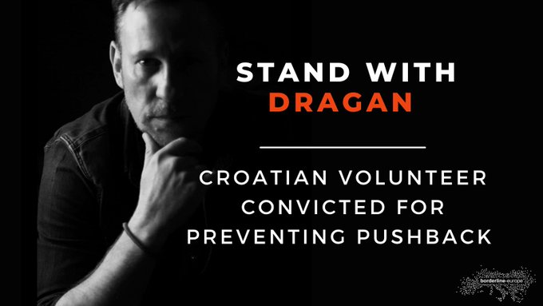
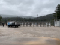
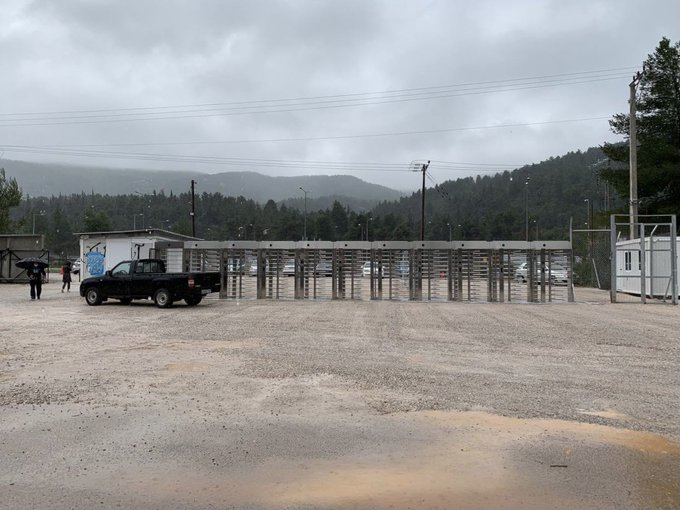
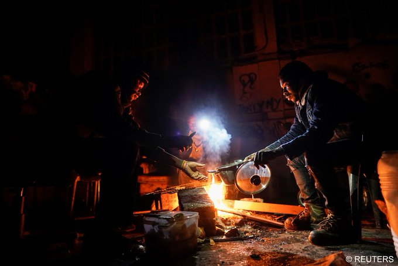

### AYS News Digest 14–15/12/2021: Volunteer convicted in Croatia for preventing pushback

[Are You Syrious?](?source=post_page-----ebf12c98ce10-----------------------------------)

[Dec 16](ays-news-digest-14-15-12-2021-volunteer-convicted-in-croatia-for-preventing-pushback-ebf12c98ce10?source=post_page-----ebf12c98ce10-----------------------------------) · 8 min read

Evidence of pushbacks from Greece to Turkey are published as camps are criticized / Further evictions in Northern France, are they legal? / Young man died in Germany, after surviving Belarus and Poland / Delays and changes to UK Afghan Resettlement Scheme / Further Policy Changes — Human Rights at the Eastern Border
### FEATURE
### Volunteer convicted in Croatia for preventing pushback

Dragan Umičević has been convicted in the Croatian court\. The following statement was issued on the matter\.

Dragan was charged with providing support in seeking asylum to the family of little Madina, a six\-year\-old Afghan girl who died during illegal expulsion from our country\. The European Court of Human Rights has expressly ruled that Croatia severely violated her right to life, her family were exposed to torture, that Croatia denied them access to legal support and international protection, disabled the investigation into her death, and exposed our activists and lawyers to systematic harassment so that the case would not reach the European Court for Human Rights\.

Dragan is a collateral victim of the pressures described above\. This is a man who acted in accordance with law and morality, and the monitored process against him, except that it is in direct contradiction with the Constitution of the Republic of Croatia and the verdict of the European Court of Human Rights, is a continuation of intimidation that we as a society must not agree to\.

By the verdict of the authority, he now has to pay a fine of 60,000 kunas \(which is a precedent in our judiciary\) and 1300 kunas in court costs\. The court knew for certain that Dragan was a retired Croatian Defender, whose monthly income is 5000 kunas, and who has no way to cover this enormous amount\. We will not and must not allow Dragan to carry that burden alone\. The AYS Association has already covered all the high legal costs earlier, and we will also need additional funds to continue the unfortunately expensive legal battles\. Now our priority is to cover Dragan’s sentence, and then future legal expenses\.

Please help us with payment to our IBAN HR6824020061100765183 \(for Overseas payments: SWIFT/BIC: ESBCHR22\) \. The bill is on the AYS Association, Erste bank\. In the payment description you can put “for Dragan” or a message of your choice\. Everything we collect will go towards covering the penalty and further legal battle\. In memory of little Madina, we will direct all possible surplus to directly support her peers who are currently in our country, and they desperately need our help\.

In solidarity with Dragan, yours AYS\.

### LIBYA

[A documentary](https://www.asgi.it/notizie/libya-no-escape-from-hell-sara-creta-cinema-roma/?fbclid=IwAR15yvRY78fZec7wF7O0Egh-pv17PipCj_DmOJHVtfQCti_-mbXgoBonMCU) has been released about the camps in Libya\. Director Sara Creta’s film entitled “Libya: No Escape From Hell” [can be viewed here\.](https://www.arte.tv/en/videos/098815-000-A/libya-migrant-camps-scandal/?fbclid=IwAR1T_QyG-cyhhMBgsBFS9jjDVBFDxa_2CsomOZ4aKZePgZm-QcXE-EAXKkY)

SEA — SAR

[104 people were rescued](https://www.eldiario.es/canariasahora/migraciones/salvamento-maritimo-restaca-105-personas-neumaticas-120-kilometros-fuerteventura_1_8583365.html?fbclid=IwAR1r9bD18XRHniyPEb1KBPFz2sNt4wHQB4guRQt8NOCzqMOMuVM1C9EtRCM) 120 kilometres off the coast of Fuerteventura\. The group were in two boats and included 21 women and five children\. The operation involved multiple vessels and an aircraft\.

Norwegian photographer **Espen Rasmussen spent three weeks [on board the MSF ship, the Geo Barents](https://twitter.com/VIIPhoto/status/1470786043251204096?fbclid=IwAR3SHo5H5Z3RfUaQYRe3ztk0vyJFBuGwUbL9Ay_TDrV2JDGVzdOSsiVfcZc) \. [His work is published here](https://www.vg.no/spesial/2021/flukten/)** \.

Rescue ships meet for the first time\. [United4Rescue vessels Sea Watch 4 and Sea Eye 4 met in the Mediterranean\.](https://twitter.com/United4Rescue/status/1471116106874171400?fbclid=IwAR0BHP-CaGGQLQ7tGg7nIFNhXWZAXhvwEoheqzgcoAE4uNVLbu0wr9-nxMQ) United4Rescue [financed two ships within two years](https://twitter.com/gorden_isler/status/1471190071017672710?fbclid=IwAR2_lwA7iLTIa9U2BO93WoZ0CgugNXLkaps7Zdu8l9wnsW7SC7acfKvojVE)

GREECE

Evidence of pushbacks from Greece to Turkey are published as camps are criticized\.

[This analysis](https://www.statewatch.org/analyses/2021/greece-the-new-hotspots-and-the-prevention-of-primary-flows-a-human-rights-disaster/?fbclid=IwAR2EIh1TVGdHefsg3p6HEZKMpX38gv52vwpIao8iBbi4q4ffq_5LyE1u0ZQ) explores the changes in the Greek approach to managing people as they arrive\. It cites the millions of Euros that have been spent on closed facilities and the desire for the prevention of ‘primary flows’\. [Read more here\.](https://www.statewatch.org/analyses/2021/greece-the-new-hotspots-and-the-prevention-of-primary-flows-a-human-rights-disaster/?fbclid=IwAR2EIh1TVGdHefsg3p6HEZKMpX38gv52vwpIao8iBbi4q4ffq_5LyE1u0ZQ)

An organisation has been [denied NGO status](https://twitter.com/rspaegean/status/1468860469762936835) by the Greek authorities\. Legal advice organisation [RS Aegean](https://rsaegean.org/en/joint-statement-by-19-org-ngo-registry-rejection/) have made a statement about the decision\.

The new, prison\-like, entry gates to Malakasa Camp [have been ‘celebrated’ by authorities\.](https://twitter.com/MigrantsSoli/status/1471074870331064321?fbclid=IwAR0tmA_FrDuuoqLtcnVFlI8pKZgjihXz8cabpGk-Xa7yJknvj36o0RWNn_c)

[This post provides evidence](https://twitter.com/zubeyirkoculu/status/1471155356793556999) for pushbacks from Greece to Turkey [whilst this one details](https://aegeanboatreport.com/2021/12/14/the-shipwreck-of-civilization/?fbclid=IwAR1pbz5Fminj3cMqhI_yTanMxraeO6CG0ZiSQ0WFJ3d2-C-1YCTRGXaz4qE) the daily struggles of new arrivals and those trying to help\.

Meanwhile, editor Far Right tabloid Makelio [was found guilty](https://twitter.com/VassilisTsarnas/status/1471138547549753347?fbclid=IwAR1ipkMuzAE_YGit7OYcvkDnLv2m0rUhopFZsq7GxOmgOxYkhOITvxC1No8) of inciting racism against people from Pakistan\.

[Complaints about conditions and missing donations](https://www.facebook.com/MoriaCoronaAwarenessTeam/posts/213140963648415) have been raised by residents at Kara Tepe camp\. Donations since the fire on Lesbos equate to approximately 500 Euros per person, yet facilities remain lacking\.

These are in addition to protests at Ritsona Camp — details are shared about the [lack of appropriate food](https://twitter.com/parwana_amiri/status/1470717213598527493?fbclid=IwAR3OWn2eqH9V68MqYbRTn7y994_bDiNM8WUsdjmTOqBRb1Bjd6HOSD-OgY0) and the [length of time waiting](https://twitter.com/parwana_amiri/status/1470720071165267976?fbclid=IwAR1T_QyG-cyhhMBgsBFS9jjDVBFDxa_2CsomOZ4aKZePgZm-QcXE-EAXKkY) \.

SERBIA

[Publicity around a violent pushback](https://twitter.com/APC_CZA/status/1470413209530159107?fbclid=IwAR0uuWNacmI9zaNvIWAakn6vbfoAdRf0mCkfEoIGVznj1AXQvKqV8xX9eoQ) from Romania to Serbia has included an accusation that Frontex is involved\. The claim is that the Romanian police and army collaborated with Frontex in order to illegally expel people across the border\. This comes as [further reports of violence at the Hungarian border](https://twitter.com/APC_CZA/status/1471135753338036225?fbclid=IwAR2_lwA7iLTIa9U2BO93WoZ0CgugNXLkaps7Zdu8l9wnsW7SC7acfKvojVE) with Serbia included Czech members of Frontex as well as local police\.

The conditions faced by those in Serbia [is shared via a personal story](https://www.facebook.com/NoNameKitchenBelgrade/posts/1379113099153637) of someone living in a tent near the Croatian border\.

BELARUS — POLAND

Syrian nationals deported, facing danger

[Syrian nationals have been returned to Syria from Belarus](https://www.al-monitor.com/originals/2021/12/would-be-syrian-refugees-flown-back-belarus-despite-visas?fbclid=IwAR053Ekf7_u_FJm5Detz6UlGiskC9UPL8dz8GwySdYNynEtCKKVw9Y2eCDw#ixzz7F9qnM7bA) , facing danger to their lives\. 100 people were on a flight and they faced interrogation on their arrival\. The Syrian regime considers people who flee to Europe a threat to the country\.

[A delegation involving Iraqi officials](https://twitter.com/DrAhmedAlSahhaf/status/1470527147148206088?fbclid=IwAR3tpr9ZeTZP6KcBuWth-8A_2xVj2VSutevXFN6EklFCTbBBbrrJFTblVVU) is travelling from Warsaw to the Poland\-German border in order to facilitate the return of Iraqi nationals, [where reportedly 403 people are staying](https://www.rudaw.net/english/middleeast/iraq/14122021?fbclid=IwAR1ipkMuzAE_YGit7OYcvkDnLv2m0rUhopFZsq7GxOmgOxYkhOITvxC1No8) \.

[420 return permits have been issued](https://www.rudaw.net/english/middleeast/iraq/15122021?fbclid=IwAR1ipkMuzAE_YGit7OYcvkDnLv2m0rUhopFZsq7GxOmgOxYkhOITvxC1No8) to those stranded in Belarus\. The permits will allow people to return to Iraq — more than 3,000 people have already returned from Eastern countries to Iraq\.

But whilst the number of people both arriving and currently in Belarus is dropping, there are still many people who remain in terrible conditions, and [journalists and humanitarian groups are still banned](https://twitter.com/MarGorczynska/status/1470777618941231113?fbclid=IwAR053Ekf7_u_FJm5Detz6UlGiskC9UPL8dz8GwySdYNynEtCKKVw9Y2eCDw) \. [This Twitter thread](https://twitter.com/FundOcalenie/status/1471163770017927170) describes the process of communication in an attempt to assist a group with claiming asylum\. Contact was eventually lost\.

SPAIN

[Images of the conditions for seasonal workers](https://twitter.com/InfoMigrants/status/1470810063874912261?fbclid=IwAR3o9V2Ob3PEbBemW1ap2oD94CbwSEsnI9kBtJJfTyHUgMYJsplGovBJa3k) in Spain have been shared in order to demonstrate the reality of life for them in Spain\.

FRANCE

Further evictions in Northern France, are they legal?

[Further evictions took place in Calais](https://twitter.com/HumanRightsObs/status/1470798941474144263?fbclid=IwAR3UIrl69lS9Is8QY1W1OBk2ar5l_u5PIDJosilmBFGq8SK2JVicmYzBiiM) , as is so frequently the case\. Tents were taken by authorities leaving people vulnerable to winter weather\. [Organisations are challenging](https://twitter.com/HumanRightsObs/status/1471122686541766662?fbclid=IwAR3SHo5H5Z3RfUaQYRe3ztk0vyJFBuGwUbL9Ay_TDrV2JDGVzdOSsiVfcZc) the legality of the constant evictions at the court in Dunkirk\.

There is an appeal to provide fire wood for the winter conditions for people sleeping rough in Calais\. [More information here\.](https://www.helloasso.com/associations/l-auberge-des-migrants/collectes/projet-woodyard?fbclid=IwAR3OWn2eqH9V68MqYbRTn7y994_bDiNM8WUsdjmTOqBRb1Bjd6HOSD-OgY0)

GERMANY

Young man died in Germany, after surviving Belarus and Poland

[The story of the sad death](https://www.infomigrants.net/en/post/37196/kurdish-refugee-baxtyar-anwar-reached-germany-only-to-die-there?fbclid=IwAR0VXIk8Twvw-eYQ73JUSS62yDHTk8YI4o0c5YlVJEEiXSd7F4u0i4m_t6k) of Baxtyar Anwar who died in Brandenburg demonstrates the extreme suffering faced by people in Belarus and Poland\. The 25 year old from Iraqi Kurdistan had previously attempted to reach Western Europe to forge a new life outside of the camp he lived in with his family in Kurdistan\.

Despite ongoing travel restrictions, deportation flights have taken place from various German cities\.

[Official numbers](https://www.bundespolizei.de/Web/DE/04Aktuelles/01Meldungen/2021/10/staendige_aktualisierung_migrationslage.html?fbclid=IwAR0NJ8pqZuV6K_91TrO5ww2TRAE-CKNwYnt_v6695gdMiY-C-4gOUCBu2ts) of arrivals to Germany via Belarus are falling\. This report shows that more than 10,000 people this year have made their way to Germany using a route involving Belarus\.

The City of Berlin [has pledged to take in 500 refugees](https://www.infomigrants.net/en/post/37226/city-of-berlin-to-accept-500-afghan-refugees?fbclid=IwAR0VXIk8Twvw-eYQ73JUSS62yDHTk8YI4o0c5YlVJEEiXSd7F4u0i4m_t6k) from Afghanistan over the next five years\. The people being accepted will be identified as ‘particularly vulnerable’ by UNHCR — likely campaigners and activists against the Taliban regime\. Berlin has also announced a broadening of family reunification rules — allowing for members other than just spouse and children to be included\.

UK

Delays and changes to UK Afghan Resettlement Scheme

The Afghan Resettlement Scheme — for those who assisted British forces during the war — [has yet to be launched](https://twitter.com/SkyNews/status/1470681565017563137?fbclid=IwAR2c-WNreCdjPkWfUcNwp6qLohWDLC8a8t0FH-Pbz87_V5cDzvSh_pxA3V0) \. It has now been revealed that the criteria for protection have been changed, making it harder for people to qualify\.

Four months after the Taliban took Kabul and the British government promised help amidst a media frenzy, the scheme has left people stranded and in danger\.

This comes as news of the 27 people who drowned in the Channel [have been identified by French authorities\.](https://www.rudaw.net/english/kurdistan/15122021?fbclid=IwAR1VPvLpfZHMGFp7ZNiPHwhJnj6qeiYkRb3RmtvIHtd-W4z0qeuA2VK8nfo) The passengers were men and women from [Kurdistan, Afghanistan, Ethiopia, Somalia and Egypt\.](https://www.rudaw.net/english/kurdistan/15122021?fbclid=IwAR1VPvLpfZHMGFp7ZNiPHwhJnj6qeiYkRb3RmtvIHtd-W4z0qeuA2VK8nfo) Accusations that the authorities were aware of the vessel in distress continue to circulate, as [this article demonstrates the tensions](https://foreignpolicy.com/2021/12/12/migrant-english-channel-crisis-tragedy/?fbclid=IwAR3GkMMZxzCsAt8pUsqYBn_2nFwQvhVxnPxAIo7KaEl7gi-grP7dXGyFMAM) between France and England\.

[“Their dreams will remain forever lost between the two borders\.”](https://www.infomigrants.net/en/post/37209/france-identifies-victims-of-channel-migrant-boat-tragedy-mainly-iraqi-kurds?fbclid=IwAR0ZikYxjaXvCk3Dk2SfhIziXM8vEkh6W3iPMGlLtwAN0Mltexx0jkjHWcc) Abdul Saboor

DENMARK

[The Danish government wants to rent prison cells in Kosovo\.](https://www.theguardian.com/world/2021/dec/15/denmark-rent-300-prison-cells-kosovo-ease-overcrowding?fbclid=IwAR3QDTqPSo8YZrGmOQWFadZ4WlGc5FvSgX8JSOr8vxxwKwwmAktzn2YmPQ4) The cells would be for people due to be deported at the end of their sentence\.

EU

Further Policy Changes — Human Rights at the Eastern Border

The EU Commission has [announced changes to the governance](https://ec.europa.eu/commission/presscorner/detail/en/ip_21_6821) of the Schengen area\. The statement concerns both internal and external border controls, allowing internal checks to last up to two years\. Additionally, it appears that chain pushbacks \(involving several countries\) are to be formalised and more patrols at external borders will occur\.

The Left responded with a strong and [critical statement](https://left.eu/commission-schengen-proposals-a-major-setback-for-fundamental-rights/?fbclid=IwAR0AOcXKB2-8xkvB1uiyG7e4SeTpY461-JIEMWixEZrkDOQdyH-bhpiaSEA) :

“This proposal exposes how the Commission seeks to fully engage in an inhumane, violent power struggle with third countries over the lives of asylum seekers trapped between borders,” said MEP Clare Daly

[The European Ombudsman has launched an investigation](https://www.accessnow.org/european-ombudsman-investigates-surveillance/?fbclid=IwAR0uuWNacmI9zaNvIWAakn6vbfoAdRf0mCkfEoIGVznj1AXQvKqV8xX9eoQ) into the use of surveillance equipment in Africa\. This investigation comes as a direct result of a complaint made by six organisations, including the Border Violence Monitoring Network\.

[Cross Atlantic talks are underway](https://www.europarl.europa.eu/plenary/en/vod.html?mode=chapter&vodLanguage=EN&vodId=25bc3d55-b7f1-d8ee-e4b9-9cb03968c035&date=20211215&fbclid=IwAR3QDTqPSo8YZrGmOQWFadZ4WlGc5FvSgX8JSOr8vxxwKwwmAktzn2YmPQ4#) between EU and US officials in regard to migration policy\. [This article demonstrates that President Biden](https://www.washingtonpost.com/national/biden-asylum-reception-centers-border/2021/12/13/d2150c5e-577c-11ec-a219-9b4ae96da3b7_story.html?fbclid=IwAR0aIQVZVfF3l2dssrRn92R9eF6GIqgr-7-7jdDo036dVyVOfxaeBSi_-q8) is seeking an alternative solution to people travelling from Mexico to the US — citing European camps as a possible model\. This comes as [drones with tasers](https://twitter.com/_PMolnar/status/1470688923210891264) are unveiled for use at the US/Mexico border\.

The European Council on Refugees and Exiles have published a response to the proposed policy changes regarding the Eastern Border countries\.

“ [ECRE does not support the measures proposed](https://ecre.org/wp-content/uploads/2021/12/ECRE-Comments-COM_FINAL.pdf) , which will have an adverse effect on the right to asylum without adequately responding to the situation at the EU’s borders with Belarus\.”

FURTHER INTEREST

[Join the Livestream of a PhD defence entitled “Local authorities, human rights, and the reception and integration of forced migrants in Greece and Italy”](https://twitter.com/TihomirSabchev/status/1471154136527904773?fbclid=IwAR0ZikYxjaXvCk3Dk2SfhIziXM8vEkh6W3iPMGlLtwAN0Mltexx0jkjHWcc)

Professor M [ichelel Ancione](https://twitter.com/michelelancione) of the Polytechnic University of Turin [has written this response](https://www.michelelancione.eu/blog/2021/12/15/against-frontex/?fbclid=IwAR1ipkMuzAE_YGit7OYcvkDnLv2m0rUhopFZsq7GxOmgOxYkhOITvxC1No8) to the university’s agreement with Frontex\.

[Reframing Migration Narratives Toolkit — for Greece](https://www.humanrights360.org/reframing-migration-narratives-toolikit/?fbclid=IwAR2c-WNreCdjPkWfUcNwp6qLohWDLC8a8t0FH-Pbz87_V5cDzvSh_pxA3V0) — has been released\. Resources for those involved in campaigning\.

Friday evening will see an information event in Berlin with the organisation Passamontagna and No Borders Truck\. [Full details here\.](https://www.facebook.com/nonationtruck/posts/633903698023699)

[Online round\-table discussion with Soloman about their work in Greece\. 18th December 10am online\.](https://twitter.com/we_are_solomon/status/1471042909709512709?fbclid=IwAR2gpbklAF9qOsr8Q8YDRapKWIwA7ModivH6JTy9iQTDJRrMTelMmUpEZrI)

**Find daily updates and special reports on our [Medium page](https://medium.com/are-you-syrious) \.**

**If you wish to contribute, either by writing a report or a story, or by joining the info gathering team, please let us know\.**

**We strive to echo correct news from the ground through collaboration and fairness\. Every effort has been made to credit organisations and individuals with regard to the supply of information, video, and photo material \(in cases where the source wanted to be accredited\) \. Please notify us regarding corrections\.**

**If there’s anything you want to share or comment, contact us through Facebook, Twitter or write to: areyousyrious@gmail\.com**

_Converted [Medium Post](https://medium.com/are-you-syrious/ays-news-digest-14-15-12-2021-volunteer-convicted-in-croatia-for-preventing-pushback-619c31fd5b11) by [ZMediumToMarkdown](https://github.com/ZhgChgLi/ZMediumToMarkdown)._
