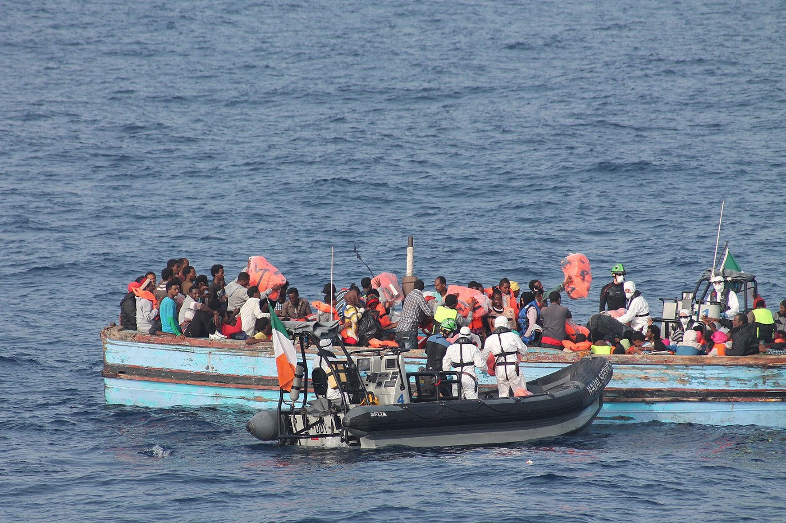

### AYS News Digest 16–17/12/21: Opposing deportation to Libya is not a crime, Italian high court says
### Hundreds rescued at sea // Boat driver successfully sues Greece for damages // Polish aid center raided by police

[Are You Syrious?](?source=post_page-----e5836d0308b2-----------------------------------)

[Dec 18](ays-news-digest-16-17-12-21-opposing-deportation-to-libya-is-not-a-crime-italian-high-court-says-e5836d0308b2?source=post_page-----e5836d0308b2-----------------------------------) · 9 min read
### FEATURE — In historic ruling, Italian supreme court says opposing deportation to Libya is not a crime

A highly\-anticipated court verdict was [announced](https://www.avvenire.it/attualita/pagine/la-cassazione-assolve-due-profughi-ribelli-e-condanna-i-respingimenti-in-libia) this Thursday by Italy’s highest court, which ruled in favor of two people on the move, saying that their actions taken to oppose their own deportation to Libya from an Italian ship back in 2018 were justifiable\.

The December 16 ruling from the Supreme Court of Cassation overturns a previous sentence issued by Palermo’s Court of Appeal, which had convicted the accused, known as “T\.” and “I\.”, for crimes of aiding and abetting illegal immigration, violence, and forceful resistance of a public official\. On June 3 of last year, that court had sentenced T\. and I\. to three years and six months in prison, with a fine of 52,000 euros\.

The defendant’s lawyers, Fabio Lanfranca and Serena Romano, said in a [statement](https://mediterranearescue.org/en/news-en/vos-thalassa-case-historic-sentence-by-italian-high-court/?fbclid=IwAR1KuthyqeerPtTdsF48_2s3YnE3oN2UoSZDY8lsRexTvBpKG9i27_mMD9Y) that they were “very satisfied with this important statement” from the high court, which “reaffirm\[s\] that the enforcement of human rights is based on the rules of international law which ensures the protection of human life and is not a state authority matter\.”

“\[R\]escue operations at sea which result in the return of survivors to Libya constitute a breach of the principle of non\-refoulement and violate the rights of the people rescued who should be taken to a place of safety where their lives are no longer in danger and respect of their fundamental rights is guaranteed,” the lawyers continued\.

The case stems from an incident on July 8, 2018 in the Central Mediterranean\. The Italian tugboat _Vos Thalassa_ \(which at the time was working at a Libyan oil platform\) informed the Maritime Rescue Coordination Center \(MRCC\) Rome \(the central sea rescue coordination center for Italy\) that it had rescued more than 60 people from a small wooden boat in the Central Mediterranean\. The MRCC forwarded this information to the Libyan authorities\. When they did not respond, the MRCC directed the _Vos Thalassa_ to head to Lampedusa\. But the commander of the _Vos Thalassa_ then told MRCC that the so\-called Libyan Coast Guard had ordered him to drive his ship towards Libya and transfer the people to a Libyan patrol boat\. The _Vos Thalassa_ started heading south\.

At this point, the rescued people began to understand they were being driven back to Libya, and demanded that the crew reverse course and head back north\. The commander of the _Vos Thalassa_ reported the tension to the MRCC and asked for a military unit to be sent\. Finally, the MRCC sent a naval unit of the Italian coastguard to the tugboat, which brought the rescued people to Italy\.

T\. and I\., considered the leaders of the “rebellion,” were later charged with “crimes of violence or threat and resistance to public officials” and “aggravated aiding and abetting irregular immigration” under Italian law\.

Italian politicians maligned the two young people at the time of their arrest\. Matteo Salvini, then Interior Minister, accused them of “hijacking” the tugobat, and Danilo Toninelli, then Minister of Transport, called them “troublemakers\.”

However, the crew of an Italian Navy helicopter sent to the _Vos Thalassa_ to quell the “rebellion” have since said that “\[t\]he situation was under control, the alarm was not justified, no danger neither for the crew nor for the migrants,” [media](https://www.avvenire.it/attualita/pagine/la-cassazione-assolve-due-profughi-ribelli-e-condanna-i-respingimenti-in-libia) reported\.

“\[T\]he two young people, who had escaped from the Libyan hell, had acted in order to save themselves and the other shipwrecked people from risk of suffering new, very serious injuries to the rights to life, physical and sexual integrity, to protect their prerogative to be taken to a place of safety and to obtain international protection,” the lawyers, Lanfranca and Romano, told media this week\.
### LIBYA
### OHCHR: Increase in ‘desert patrol units’ on Libya’s land borders

A May 2021 report from the Office of the United Nations High Commissioner for Human Rights \(OHCHR\) on migration through Libya noted an “increased presence of ‘border brigades’ or ‘desert patrols’ along Libya’s land borders,” particularly near the Algerian and Tunisian borders\. The author of the recently\-released article, [“The Secretive Prisons that Keep Migrants Out of Europe,”](https://www.theoutlawocean.com/investigations/the-secretive-libyan-prisons-that-keep-migrants-out-of-europe/?fbclid=IwAR0GjS6GwpGVL-M8P305rWNRWcZ9CyVvvNa_jNaUl6xOXx7uNui-OJ0RDEA) highlighted these patrol units in a tweet\.

“The Secretary\-General has noted with concern that these “desert patrol units” have intensified security checks and may be engaging in discriminatory profiling and increased expulsions outside of process and procedural safeguards,” the OHCHR report continued\.
### SEA / SAR
### Roundup of recent rescues

It’s been a busy past few days in the Central Mediterranean, as many civil rescue ships headed out to sea for a Christmas mission\. Here’s a roundup of what’s happened:
- [Sea\-Eye 4 rescued 223 people in four operations in the Maltese rescue zone, including 29 women, seven of whom are pregnant, and eight children\.](https://sea-eye.org/en/sea-eye-4-rescued-223-people-from-a-gathering-storm-during-christmas-mission/?fbclid=IwAR0kR2TyLbbtqiVkAZZNsl2aDvvH2-Vzy9qlNabJUAtkGV63BU8XFYO2ihU)
- [MSF’s Geo Barents rescued 49 people yesterday, including women and children\.](https://twitter.com/MSF_Sea/status/1471802125030248450?fbclid=IwAR1Frns20kqC-UUoztkiLmnYc1QgfWrfiHau3cf1D_zbC11BsctPV33idPY)
- [The Ocean Viking rescued 114 people following a night search\.](https://twitter.com/SOSMedIntl/status/1471408891942604810?fbclid=IwAR0nM4F2ewPlCg2jaQ1YEstAdrXCukBXJc54ImVTVRSEETrLw1RMN2nbOs0) There are women and newborns aboard; the youngest is 11 days old\. [The crew searched for another boat for 23 hours, only to be informed today that it had been intercepted\.](https://twitter.com/SOSMedIntl/status/1471817682945249280)
- [Mission Lifeline rescued 66 people some 47 nautical miles south of Lampedusa\.](https://twitter.com/SEENOTRETTUNG/status/1471574433282338816) Some of the people are hypothermic\.

### Boat capsizes off Lampedusa: One woman dies, her 14\-year\-old son is saved

There is a new tragedy in the Mediterranean today\. A boat with 25 people aboard capsized near the Italian island of Lampedusa, and one woman drowned, [media](https://www.lastampa.it/cronaca/2021/12/17/news/migranti_barca_si_capovolge_muore_una_donna_salvo_il_figlio_di_14_anni-1676585/?fbclid=IwAR25UuG-dNtnWkLwOQ9xkIw2gXRRupvh8gzn9U-h3_8xsMkVQzAMCOYxvhM) reported\. Her 14\-year\-old son was saved, however\.

“Even today people continue to die in the Mediterranean,” said the mayor of Lampedusa, Totò Martello\. “An umpteenth death that could and should have been avoided and which, instead, will be another number that is added to a long list, in the silence of Europe and Italy\. A silence that seems to be broken only by Pope Francis, who continues to ask the world to get out of this atrocious indifference\.”

After a three\-week stretch with no landings, seven boats have recently arrived to Lampedusa, carrying over 500 people\.
### GREECE
### A FIRST: Boat driver successfully sues Greek state for compensation

A man who had been imprisoned by Greek authorities for 416 days following smuggling accusations was awarded damages from the Greek state, the NGO Borderline Europe announced\. The group noted that the man, known as X\.M\., was only awarded the legal minimum of 20 euros per day for his imprisonment, and that the damages will be subject to taxation\.

X\.M\. was acquitted of smuggling charges this April by a court on Chios after spending 416 days in pre\-trial detention\. In October, he sued for damages\.
### Greek government wants to expand Turkish border fence by 26km

The Greek government will lengthen its border fence with Turkey along the country’s northeast by 26km, Civil Protection Minister Takis Theodorikakos told MPs on Friday, [media](https://www.ekathimerini.com/news/1174029/gov-t-to-expand-border-fence-with-turkey-by-26km-minister-says/?fbclid=IwAR0jOIA1S3z_hBL4Jb-rObQhkudtt4oEkfyjuPtLLCjDW55xXuAz1ixZvUw) reported\.

Parts of the existing fence will see repairs near the town of Kastanies, and 26km of new fence will be erected around Feres\.

“What happened in Evros in March 2020 is now known to everyone,” Theodorikakos said\. “It was not a spontaneous attempt by illegal migrants and refugees to enter Greek territory, but an organized operation by the Turkish authorities, which, using illegal immigrants, had the clear intention to massively violate Greek borders\.”
### Upcoming protests against pushbacks in Athens
### BELARUS BORDERS
### Aid center in Podlasiu raided by police
### Repatriations continue

Meanwhile, repatriations from Belarus to Iraq continue\. [Media](https://www.rudaw.net/english/middleeast/iraq/17122021?fbclid=IwAR3ZXDyegI9Mdoq6R_IqVZdqjSbTqszVFOy1EhyRov-jIxa4sVxRitTozow) reported that the tenth flight to Iraq landed on Friday night, carrying 400 people\.
### SWITZERLAND
### FRANCE
### Destruction of camps in Grande\-Synthe \(video\)
### Protest in Paris

[More info here\.](https://www.facebook.com/permalink.php?story_fbid=1879040468963383&id=598228360377940)
### EU / FRONTEX
### \#AbolishFrontex Info Campaign
### Most EU member states against “solidarity mechanism” for search and rescue

[An analysis by Statewatch](https://www.statewatch.org/news/2021/december/eu-tracking-the-pact-member-states-against-a-search-and-rescue-solidarity-mechanism/?fbclid=IwAR3zeIIjlgQsR1pTyqISNxxi9mfSkSeOGIFFR48z5GAmi9zmbdfXhSjQKpE) of the proposed Asylum and Migration Management Regulation from the European Commission shows that most EU member states do not want a separate “solidarity mechanism” for people rescued at sea\.

Austria, for example, said that it “welcomes that capacity building measures are part of solidarity contributions,” but said there is a “strong need for a more flexible approach” — such as in the “external dimension\.” Essentially that means Austria supports externalization measures and does not want people rescued at sea to be relocated to Austria\.

Austria, the Czech Republic, Estonia, Hungary, Ireland, Lithuania, the Netherlands, Poland and Slovakia all expressed outright opposition to the proposed “solidarity mechanisms\.” A number of states said it would constitute a “pull factor” for more migration\.

Meanwhile, the EU has [said](https://www.infomigrants.net/en/post/37284/eu-to-step-up-pressure-on-countries-to-take-back-rejected-asylum-seekers?fbclid=IwAR3zeIIjlgQsR1pTyqISNxxi9mfSkSeOGIFFR48z5GAmi9zmbdfXhSjQKpE) it will increase pressure on countries to take back rejected asylum\-seekers\. European Council said it plans to use “all relevant EU policies, instruments and tools, including development, trade and visas” as leverage, media reported\.

The rate of returns from the EU continues to be low\. In 2018, the European Commission’s aim was to increase it to about 70%, but in 2019, only about 29% of those with rejected claims actually left the EU, media reported\.

[Critics](https://www.infomigrants.net/en/post/29162/concern-at-eus-growing-push-to-return-rejected-asylum-seekers) say the EU wants to use development money as a bargaining chip in returns agreements to force countries in the Global South to accept back their citizens\.
### Danish Refugee Council: 12,000 pushbacks in 2021 are “worrying”

The nonprofit Danish Refugee Council released a [report](https://drc.ngo/media/rzplexyz/prab-iii-report-july-to-november-2021_final.pdf) documenting close to 12,000 pushbacks across Europe from January to November 2021, reflective, it said, of a “worrying normalization of \[an\] illegal practice\.”

The report shows that the highest rates of pushbacks were recorded at the Bosnia\-Croatia border\. Afghan nationals reported the most pushbacks out of any nationality, and children were involved in 10 percent of all recorded pushbacks\.

“Whether it happens at the EU border with Belarus, in Croatia, or at the Mediterranean, pushbacks are illegal,” said Charlotte Slente, Secretary General of Danish Refugee Council\. “Law enforcement officials have the right to protect states’ borders, however, human rights must be upheld\. Rights violations at the EU’s borders are a black stain on the EU’s reputation as a proponent of human dignity and respect for people’s fundamental rights\.”
### WORTH READING / WATCHING
### ‘The EU must be held accountable for the crimes it has committed against people trying to reach its borders’

Refugee turned activist YAMBIO DAVID OLIVER tells The Civil Fleet what led to the protests outside a UNHCR registration centre in Tripoli\.
### [‘The EU must be held accountable for the crimes it has committed against people trying to reach its…](https://thecivilfleet.wordpress.com/2021/12/16/the-eu-must-be-held-accountable-for-the-crimes-it-has-committed-against-people-trying-to-reach-its-borders/?fbclid=IwAR0jOIA1S3z_hBL4Jb-rObQhkudtt4oEkfyjuPtLLCjDW55xXuAz1ixZvUw)
### [Refugee turned activist YAMBIO DAVID OLIVER tells The Civil Fleet what led to the protests outside a UNHCR registration…](https://thecivilfleet.wordpress.com/2021/12/16/the-eu-must-be-held-accountable-for-the-crimes-it-has-committed-against-people-trying-to-reach-its-borders/?fbclid=IwAR0jOIA1S3z_hBL4Jb-rObQhkudtt4oEkfyjuPtLLCjDW55xXuAz1ixZvUw)

[thecivilfleet\.wordpress\.com](https://thecivilfleet.wordpress.com/2021/12/16/the-eu-must-be-held-accountable-for-the-crimes-it-has-committed-against-people-trying-to-reach-its-borders/?fbclid=IwAR0jOIA1S3z_hBL4Jb-rObQhkudtt4oEkfyjuPtLLCjDW55xXuAz1ixZvUw)
### Refugee children should not have to risk their lives at sea

MSF aid worker on how Europe’s reckless border policies continue to force desperate families into dangerous journeys across the Mediterranean\.
### [Refugee children should not have to risk their lives at sea](https://www.aljazeera.com/opinions/2021/12/17/refugee-children-should-not-have-to-risk-their-lives-at-sea?fbclid=IwAR11xxdGGdnR7Na2240JfqFats1j5DWV_fel7Xf73K0SO1ulbimP8eGTjRg)
### [Humanitarian aid worker specialised in communications and advocacy, working with Doctors without Borders \(MSF\) since…](https://www.aljazeera.com/opinions/2021/12/17/refugee-children-should-not-have-to-risk-their-lives-at-sea?fbclid=IwAR11xxdGGdnR7Na2240JfqFats1j5DWV_fel7Xf73K0SO1ulbimP8eGTjRg)

[www\.aljazeera\.com](https://www.aljazeera.com/opinions/2021/12/17/refugee-children-should-not-have-to-risk-their-lives-at-sea?fbclid=IwAR11xxdGGdnR7Na2240JfqFats1j5DWV_fel7Xf73K0SO1ulbimP8eGTjRg)
### Families of drowned migrants bid tearful farewell at ceremony in France \(video\)

Family members bade a tearful farewell on Thursday to four Afghans from among 27 people who died last month when their small rubber dinghy deflated in the Channel while heading to Britain from France\.
### [Families of drowned migrants bid tearful farewell at ceremony in France](https://www.reuters.com/world/europe/families-drowned-migrants-bid-tearful-farewell-ceremony-france-2021-12-16/?fbclid=IwAR1bsNb3ptgo8yhYb5-4hPhWC-z4iRGmGNlHTcmPWW1_eupMCWXH6Zyk1fI)
### [LILLE, France, Dec 16 \(Reuters\) — Family members bade a tearful farewell on Thursday to four Afghans from among 27…](https://www.reuters.com/world/europe/families-drowned-migrants-bid-tearful-farewell-ceremony-france-2021-12-16/?fbclid=IwAR1bsNb3ptgo8yhYb5-4hPhWC-z4iRGmGNlHTcmPWW1_eupMCWXH6Zyk1fI)

[www\.reuters\.com](https://www.reuters.com/world/europe/families-drowned-migrants-bid-tearful-farewell-ceremony-france-2021-12-16/?fbclid=IwAR1bsNb3ptgo8yhYb5-4hPhWC-z4iRGmGNlHTcmPWW1_eupMCWXH6Zyk1fI)
### Why Britain’s plan to offshore refugees must be scrapped

MP David Davis says offshoring undermines the rule of law and lacks any evidence of being effective\. \( [link](https://www.middleeasteye.net/opinion/uk-refugees-plan-offshore-scrapped-why?fbclid=IwAR1CrsUzZ27VBkaq9Ljq3g6_Acg5v1eyb_5bimg4nRrKTVfLKBO8eEzvRO0) \)
### EU: Asylum and borders proposals: the only attack taking place is the attack on peoples’ rights

Statewatch published a helpful breakdown of the European Commission’s new migration proposals\. \( [link](https://www.statewatch.org/news/2021/december/eu-asylum-and-borders-proposals-the-only-attack-taking-place-is-the-attack-on-peoples-rights/?fbclid=IwAR2LIX1ytY4p3GdpswGQ8s8AVGiICF8ApffugCS8jYs353G0SJFZBt9HObg) \)
### Centre for Migration Research at the University of Warsaw: Roundtable on Polish, Greek and the Balkan border crises \(video\)

Featuring Witold Klaus and Marta Górczyńska from Grupa Granica \(The Border Group\); Evgenia Kouniaki and Eleni Takou from Human Rights 360; and Chloe Powers from Border Violence Monitoring Network \(BVMN\) \. \( [link](https://www.facebook.com/watch/live/?ref=watch_permalink&v=452383232921133) \)

**Find daily updates and special reports on our [Medium page](https://medium.com/are-you-syrious) \.**

**If you wish to contribute, either by writing a report or a story, or by joining the info gathering team, please let us know\.**

**We strive to echo correct news from the ground through collaboration and fairness\. Every effort has been made to credit organisations and individuals with regard to the supply of information, video, and photo material \(in cases where the source wanted to be accredited\) \. Please notify us regarding corrections\.**

**If there’s anything you want to share or comment, contact us through Facebook, Twitter or write to: areyousyrious@gmail\.com**

_Converted [Medium Post](https://medium.com/are-you-syrious/ays-news-digest-16-17-12-21-opposing-deportation-to-libya-is-not-a-crime-italian-high-court-says-41ec06762085) by [ZMediumToMarkdown](https://github.com/ZhgChgLi/ZMediumToMarkdown)._
