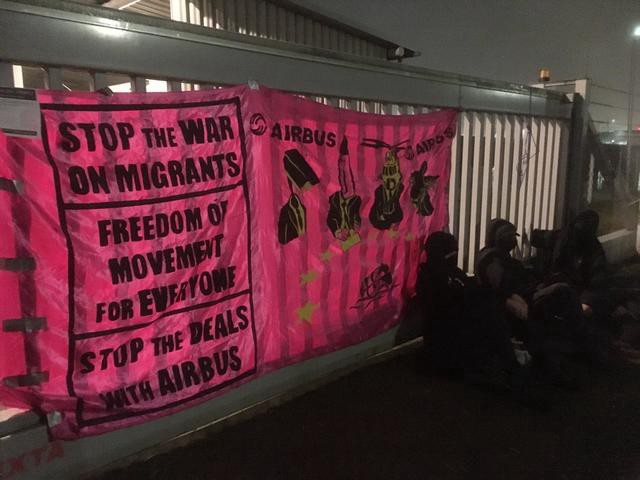
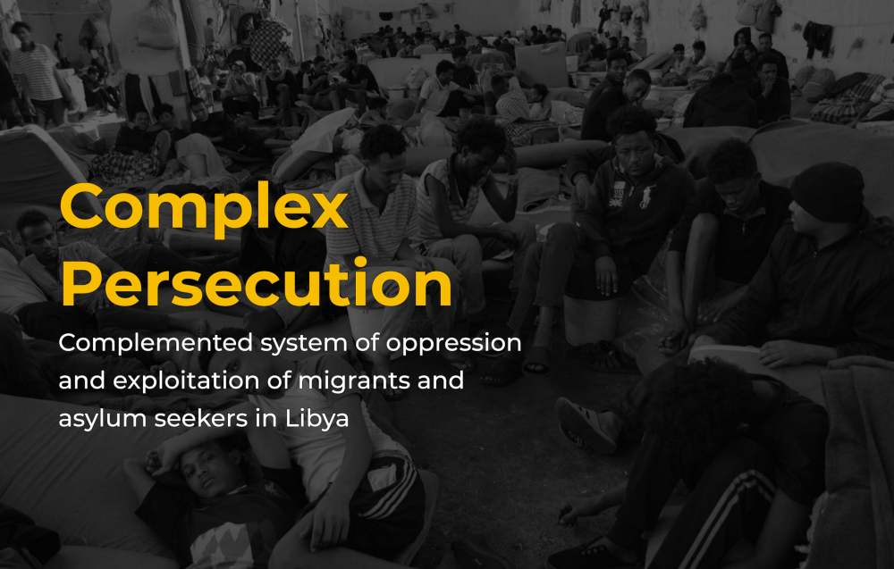
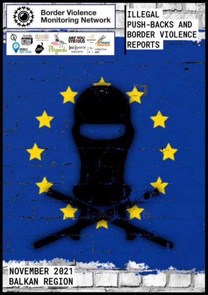

### AYS Weekend Digest 18–19/12/21: European Border AI forces people to take more deadly routes
#### 200 people rescued off Malta // 3 lives lost and 51 people missing in Atlantic // Persecution in Libya: Report // Protests in Athens against Pushbacks // New BVMN Report // Human Rights Violations in Barcelona // UK offshoring immigration and new Church Resettlement scheme // Updates from Abolish Frontex campaign and Belarus…

Photo: IndyMedia \(Blokkade Koningin Máxima Kazerne Koninklijke Marechaussee in Badhoevedorp\)

Lie detectors based on AI that scan people’s faces as they answer questions have so far been trialled in Hungary, Greece, and Latvia\. At the same time deterring strategies have been automatized in Poland, as the country sent automated texts telling people not to attempt entry from Belarus, as they were planning to build a 200km border wall\. As it’s been [reported](https://www.theguardian.com/global-development/2021/dec/06/fortress-europe-the-millions-spent-on-military-grade-tech-to-deter-refugees) , the EU continues pushing towards using technology on its borders, whether it has been bought by Frontex, or financing for member states through EU sources \(internal security fund or Horizon 2020\) \.

> _People trying to enter the EU by land or sea are watched from the air\. Border officers use drones and helicopters in the Balkans, while Greece has airships on its border with Turkey\. The most expensive tool is the long\-endurance Heron drone operating over the Mediterranean\._ 

One of the authors of the new report published by Spiegel \(available in English on Tuesday\), Jack Sapoch, says:

> _None of this stops people from crossing; having drones or helicopters doesn’t stop people from crossing, you just see people taking more risky ways_ 

In their report, the most recent in the series of Lighthouse Reports, they identified families, location of death, country of origin, etc\. of some of the people who have lost their lives along the Polish\-Belarus border\. They confirmed that at least 17 people lost their lives in the Poland\-Belarus borderlands\. “By combining OSint and ground reporting we were able to identify 12 of those who lost their lives,” the team said\.
### SEARCH AND RESCUE AT SEA

During a rescue operation off Lampedusa, a boat capsized and one woman died\. Also off Djerba, a shipwreck occurred on Thursday that cost the lives of 2 people — 4 others are still missing, AlarmPhone reported\.
They also reported missing people at sea:

During the past days the teams were in contact with more than 600 people on board 9 boats in distress:
### LIBYA
### Report: Complex persecution — Complemented system of oppression and exploitation of migrants and asylum seekers in Libya

The report reviews the violations against migrants and asylum seekers in Libya during the pushbacks and in prisons and detention centers\. It is based on months of field documentation and interviews with migrants and their families\. The researchers monitored the various Libyan agencies’ dealing with migrants, particularly the Libyan Coastguard, prison administrations and security forces\.

The report reviews the various human smuggling methods and the neighboring countries’ responses regarding file of migration and asylum in Libya\.

It compares the rights guaranteed to migrants in relevant international charters and agreements to their actual treatment on the ground\. It also makes recommendations that — if adopted — will contribute to restoring human dignity and safeguarding the basic rights of migrants\.

[**Full report in English**](https://euromedmonitor.org/uploads/reports/ENComplexPersecution1.pdf) 
**[Full report in Arabic](https://euromedmonitor.org/uploads/reports/ARComplexPersecution1.pdf)**
### GREECE

This Saturday in Athens, a gathering to protest against pushbacks and closed camps took place at Monastiraki square:

### BALKANS
### BVMN monthly report for November

In November the Border Violence Monitoring Network \(BVMN\) shared 34 testimonies of pushbacks impacting 1,289 people\-on\-the\-move across the Balkans\. This report brings together first\-hand accounts from a range of countries in the region to look at the way European Union states and other actors are affecting systemic violence towards people crossing borders\.

Among others, the report covers these topics:
- Pushbacks across the Korana River
- Abuse in Croatian Police Vehicles
- ECHR ruling on the case of Madina Hussiny
- Ongoing violence in the port of Patras

This report also explores several key developments in Greece, including increasing restrictions to accessing asylum and other support services through the termination of the Skype pre\-registration system, restrictions on mobility in the new camp on Samos, and ongoing issues with the cash assistance program\. It covers recent police raids in informal settlements as well as official accommodation centers in 8 different Serbian municipalities, where the authorities claimed to be searching for “irregular migrants and members of organized criminal groups involved in their smuggling”\. A final section covers updates from Italy, including a decrease in arrivals in Trieste\.

[Download](https://www.borderviolence.eu/wp-content/uploads/BVMN-Monthly-Report-November-2021.pdf-1.pdf) the report or [visit the website](https://www.borderviolence.eu/balkan-regional-report-november-2021/) to learn more\.
### SPAIN
### Denouncing human rights violations in Barcelona

Irídia — Center for the Defense of Human Rights , has presented the report ‘ [Human rights violations at the Barcelona Internment Center for Foreigners 2021](https://iridia.cat/wp-content/uploads/2021/12/INFORME-CIE-2021_web-1.pdf) ’, focusing, once again, on the main human rights violations detected in the immigration detention \(CIE\) in Barcelona located in the Zona Franca\. This year, since the outbreak of the pandemic, the human rights organization has warned of an unprecedented setback in guaranteeing the rights of people inside the CIE in Barcelona\.
### UK
### Offshoring immigration

The Former Immigration chief has suggested that people on the move be transferred to Ascension island, a British territory 4,400 miles away from the UK, in order to deter people from making the journey to Britain…
### Church of England resettlement scheme

The Church of England is setting up a new group to support [local churches resettling refugees](https://www.ekklesia.co.uk/2021/12/19/new-group-to-support-local-churches-resettling-refugees/?fbclid=IwAR2c6bXFXo-IyhaBul2rJu7zZOMsbCVGc7Oo_9_j1_6mZG5IUeftPVcAZHU) through the Home Office Community Sponsorship scheme but no figures have been given as to how many people this will support\.
### GENERAL

Updates and a reminder of the Abolish Frontex campaign:

In the Netherlands Stop the War on Migrants blocked the entrances of the Queen Máxima Kazerne of the Royal Marechaussee \(KMar\) in Badhoevedorp \(Sloterweg 400\) \. The Border Security Training Center, based there, is a training location for the Frontex border surveillance agency\. The action was a protest against Frontex, Dutch cooperation with Frontex, European migration policy and the role of the KMar in border control and deportations\. See more [here\.](https://indymedia.nl/node/51113?fbclid=IwAR04MX1QRygqek_rksnPJ-DLUBIvnmqBCZQBi8cChl5WhZ-0htG-8-G7r3M)
### BELARUS

> _Today is International Migrants Day\. Below [we publish a video](https://www.facebook.com/grupagranica/videos/1251961465272318/) showing the scandalous deportation of Syrians from Poland to Belarus\. We express our solidarity with the persecuted and our opposition to the deportations and violence\!_ 

> _Today, we want to remind you that migration is not a crime\. Every person, regardless of origin, skin colour, material status, religion or lack thereof, has the right to move\. All the more so if they seek safety\. As the Granica Group, in cooperation with the inhabitants of Podlasie and with the support of many people of good will, we help migrants on the Polish\-Belarusian border in solidarity\. This is our duty not only legally, but also morally\._ 

> _Below we publish a film recorded in a car of the Polish Border Guard during the transportation of a group of refugees to the border with Belarus\. On the film we can see how and under what conditions officers take desperate and frightened people back to the line of the border with Belarus, forcing them to cross to the other side and refusing to initiate procedures provided by law \(in this case proceedings for granting international protection\) \. This is what deportations are all about\. The elderly, women, children and men, as well as the sick, the hungry, the frozen and those on the verge of exhaustion are subjected to this procedure, accompanied by various forms of violence \(psychological or physical\) \._ 

### WORTH READING
- Channel tragedy highlights unfair family reunion policies for transnational families:

### [Channel tragedy highlights unfair family reunion policies for transnational families — Connecting…](https://research.reading.ac.uk/research-blog/channel-tragedy-highlights-unfair-family-reunion-policies-for-transnational-families/?fbclid=IwAR2TcvjeydkEJN_STFA3OvPfcd95lUzGZpfci8TgLhc-Bvs7adCEhx1Z6_0)
### [On International Migrants Day, 18 December 2021, we reflect on the recent Channel tragedy and the impacts of…](https://research.reading.ac.uk/research-blog/channel-tragedy-highlights-unfair-family-reunion-policies-for-transnational-families/?fbclid=IwAR2TcvjeydkEJN_STFA3OvPfcd95lUzGZpfci8TgLhc-Bvs7adCEhx1Z6_0)

[research\.reading\.ac\.uk](https://research.reading.ac.uk/research-blog/channel-tragedy-highlights-unfair-family-reunion-policies-for-transnational-families/?fbclid=IwAR2TcvjeydkEJN_STFA3OvPfcd95lUzGZpfci8TgLhc-Bvs7adCEhx1Z6_0)
- Harnessing the Potential of Human Mobility:

### [“Harnessing the Potential of Human Mobility”](https://www.getrevue.co/profile/wearesolomon/issues/harnessing-the-potential-of-human-mobility-927656?via=twitter-card-webview&client=DesktopWeb&element=issue-card)
### [On the occasion of the International Migrants Day, Stavros Malichudis and Iliana Papangeli were discussing yesterday on…](https://www.getrevue.co/profile/wearesolomon/issues/harnessing-the-potential-of-human-mobility-927656?via=twitter-card-webview&client=DesktopWeb&element=issue-card)

[www\.getrevue\.co](https://www.getrevue.co/profile/wearesolomon/issues/harnessing-the-potential-of-human-mobility-927656?via=twitter-card-webview&client=DesktopWeb&element=issue-card)
- Reports and critical commentary on the deportations from the Brest\-Terespol border crossing carried out by the Polish state in 2016–2018:

### [Granica praw człowieka](https://granicaprawczlowieka.amnesty.org.pl/)
### [Edit description](https://granicaprawczlowieka.amnesty.org.pl/)

[granicaprawczlowieka\.amnesty\.org\.pl](https://granicaprawczlowieka.amnesty.org.pl/)
- A series of podcasts on the mechanisms of criminalisation of migration, the prevalence of the use of the category ‘illegality’, the realities of the state of emergency and the shape of future changes proposed at the level of European regulation in the context of exportations:

### [STAN WYJĄTKOWY: Kiedy przemoc staje się prawem \| Marta Górczyńska, Katarzyna Czarnota](https://czaskultury.pl/artykul/stan-wyjatkowy-kiedy-przemoc-staje-sie-prawem/)
### [Katarzyna Czarnota rozmawia z Martą Górczyńską, prawniczką, współpracowniczką Helsińskiej Fundacji Praw Człowieka…](https://czaskultury.pl/artykul/stan-wyjatkowy-kiedy-przemoc-staje-sie-prawem/)

[czaskultury\.pl](https://czaskultury.pl/artykul/stan-wyjatkowy-kiedy-przemoc-staje-sie-prawem/)
- “Becoming refugees” — the perceived threat posed by Europe’s postwar “displaced persons” helped shape today’s international refugee regime:

### [Becoming refugees \* Klaus Neumann](https://insidestory.org.au/becoming-refugees/?fbclid=IwAR1sGzPd_qy7HKWztPCCNOeWxSwWjRrfWolfsiUeRX4cvGZszw1nFSGaQV4)
### [Just a few months ago the Refugee Convention — “a cornerstone of refugee protection,” according to the UN refugee…](https://insidestory.org.au/becoming-refugees/?fbclid=IwAR1sGzPd_qy7HKWztPCCNOeWxSwWjRrfWolfsiUeRX4cvGZszw1nFSGaQV4)

[insidestory\.org\.au](https://insidestory.org.au/becoming-refugees/?fbclid=IwAR1sGzPd_qy7HKWztPCCNOeWxSwWjRrfWolfsiUeRX4cvGZszw1nFSGaQV4)

**Find daily updates and special reports on our [Medium page](https://medium.com/are-you-syrious) \.**

**If you wish to contribute, either by writing a report or a story, or by joining the info gathering team, please let us know\.**

**We strive to echo correct news from the ground through collaboration and fairness\. Every effort has been made to credit organisations and individuals with regard to the supply of information, video, and photo material \(in cases where the source wanted to be accredited\) \. Please notify us regarding corrections\.**

**If there’s anything you want to share or comment, contact us through Facebook, Twitter or write to: areyousyrious@gmail\.com**

_Converted [Medium Post](https://medium.com/are-you-syrious/ays-weekend-digest-18-19-12-21-european-border-ai-forces-people-to-take-more-deadly-routes-936e2f17aba0) by [ZMediumToMarkdown](https://github.com/ZhgChgLi/ZMediumToMarkdown)._
