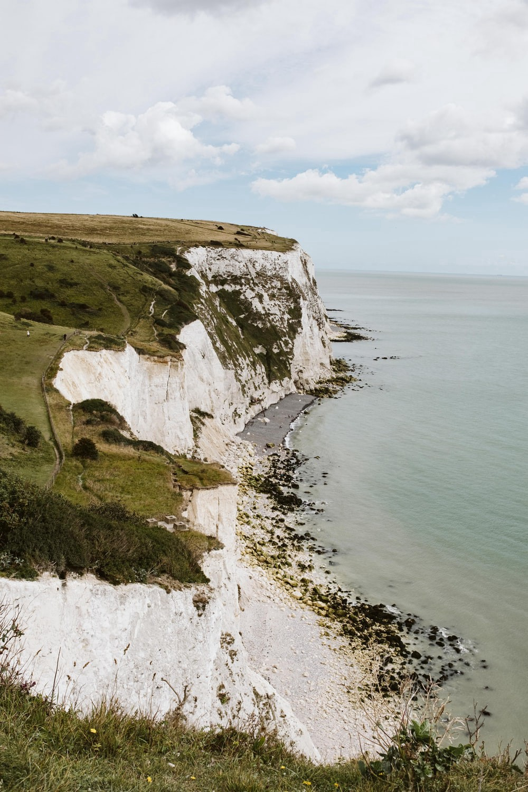
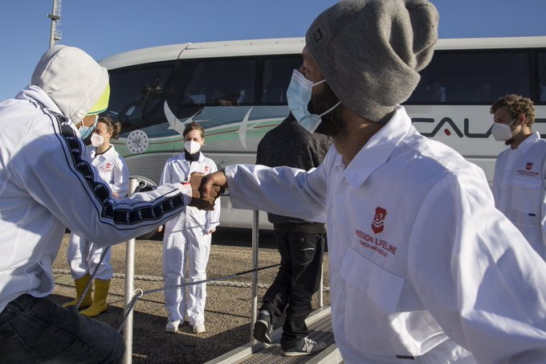
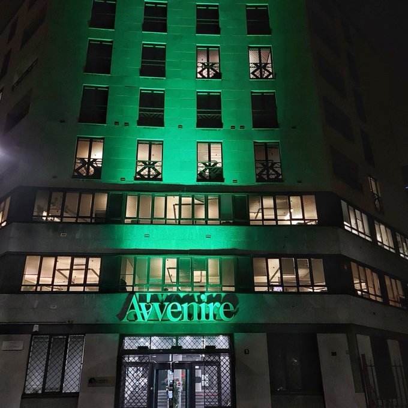

### AYS News Digest 20\.12\.2021: Legal Action Against French and British Authorities Launched
### Accusations against Malta as hundreds remain on Sea Eye 4 / Greek NGO registry violating international law / Amnesty International: torture and abuse by authorities at Pol/Bel border / Report on Slovenian Immigration Detention Center / Commission critical of gender equality measures in Austria / “No choice” but to use dangerous routes until UK gov open resettlement scheme / Europol target smugglers

[Are You Syrious?](?source=post_page-----34d00878be3e-----------------------------------)

[Dec 21](ays-news-digest-20-12-2021-legal-action-against-french-and-british-authorities-launched-34d00878be3e?source=post_page-----34d00878be3e-----------------------------------) · 9 min read
### FEATURE
### Legal Action Against French and British Authorities Launched

Photo Credit: White Cliffs of Dover Photo by [Peter Mason](https://unsplash.com/@pmason303?utm_source=unsplash&utm_medium=referral&utm_content=creditCopyText) on [Unsplash](https://unsplash.com/s/photos/dover?utm_source=unsplash&utm_medium=referral&utm_content=creditCopyText)

[The families of two people who lost their lives](https://www.theguardian.com/uk-news/2021/dec/20/channel-deaths-report-finds-failings-in-rescue-effort-as-legal-action-begins?fbclid=IwAR2xlsewU1McklFxwwXDXvtAE7ZQ9TEA6Xu_Gr7hyg-1ceGjjQO36lDhqdQ) when a boat sank in the Channel have launched legal action\. The accusation of manslaughter has been levelled on behalf of the families by the organisation [Utopia56](https://utopia56.org/2021/12/20/drame-dans-la-manche-utopia-56-depose-plainte-pour-homicide-involontaire-et-omission-de-porter-secours/?fbclid=IwAR3WQMrsv2zzmmvngx8ofMyVMfwz6MeqQq-78HgUmqeLj_aX3QPalxoawpk) against French and British rescue operations with the Prosecutor in Paris\. It is to establish if [“acts or omissions”](https://www.theguardian.com/uk-news/2021/dec/20/channel-deaths-report-finds-failings-in-rescue-effort-as-legal-action-begins?fbclid=IwAR2xlsewU1McklFxwwXDXvtAE7ZQ9TEA6Xu_Gr7hyg-1ceGjjQO36lDhqdQ) have occurred and the charges have [been levelled at Philippe Dutrieux, the coast prefect of Cherbourg, Marc Bonnafous, director of the French regional coastguard, and Claire Hughes, director of Her Majesty’s Coastguards\.](https://www.thelocal.fr/20211220/french-ngo-files-charges-against-authorities-over-channel-migrant-deaths/?fbclid=IwAR3c6jom3qxDg_xplpePwF6brkOl6nIq8wqTSzyrXcM7yMOdGgaCOQ16u-8)

Utopia56 claims that this is not the first time authorities have failed to act\. On 20th November, four days prior to the tragedy which claimed 27 lives, a volunteer was told by boat passengers that both national authorities had been contacted but [“No\-one wants to answer us\.”](https://morningstaronline.co.uk/article/b/britain-and-france-sued-over-channel-deaths?fbclid=IwAR3HOW6PMez5EabhFOILPObBYImwCwhYxbU0XsIZnDCU3OLPHQ-ZtCDdeeE)

Utopia56 hopes that the legal action will shed light on the circumstances of the shipwreck to give families “transparency” into the events\. French and British authorities have avoided responsibility, instead focusing on the role of human smugglers in such dangerous crossings\.

The UK law firm Duncan Lewis Solicitors has provided the British government with pre\-action correspondence on behalf of Zana Mamand Mohammad — whose brother is believed to have died — as well as another family\.

Describing the difficulties in pursuing any information about his brother, [Zana Mamand Mohammad said](https://morningstaronline.co.uk/article/b/britain-and-france-sued-over-channel-deaths?fbclid=IwAR3HOW6PMez5EabhFOILPObBYImwCwhYxbU0XsIZnDCU3OLPHQ-ZtCDdeeE) “Our passport is not like the European passport, it’s not easy to get a visa\. We hope we could travel to Europe and find our brother and the cause of this, but we cannot travel\.”
### LIBYA

Following the report “ [**Inhumane and illegal practices against asylum seekers at the EU’s external borders”**](https://www.europarl.europa.eu/doceo/document/P-9-2021-005519_EN.html?fbclid=IwAR0DffsQyeSSauSgzZS7Hamhc6g1PRAGi2YToWM-mN7X6MjhexproBZM7bI) , calls for action have been made\. This comes as the publication of the [story of Aliou Candé from Guinea\-Bissau](https://www.theoutlawocean.com/investigations/the-secretive-libyan-prisons-that-keep-migrants-out-of-europe/) who died imprisoned in Libya made the mainstream press\. Whilst the report highlights many important points, [it’s not new news\.](https://twitter.com/JFCrisp/status/1473039101146320904?fbclid=IwAR2SSge4DrmoYQNBkoiYkVWOZiNXfuOR8QbOWS17DE2sdTeDONSLl-1KTn0)

[A video by Libyan American Alliance who hosted a conversation on their recent policy paper, Trapped in a Cycle of Abuse: Migrants, Refugees Transnational Illicit Human Trafficking and Smuggling of Refugees, Migrants in Libya](https://www.youtube.com/watch?v=eaSjo_aeZGw)
### SEA — SAR
### Accusations against Malta as hundreds remain on Sea Eye 4

Photo Credit: [MISSION LIFELINE](https://twitter.com/SEENOTRETTUNG/status/1472967798548803591?fbclid=IwAR2xkYN2g7TSqsyRiJZ4VuXjB1Vqz7UEs9jYWfOCbTp6ykTW8raqNmDPQ-A)

The German sea rescue organisation [Mission Lifeline rescued 66 people from the sea,](https://twitter.com/SEENOTRETTUNG/status/1472967798548803591?fbclid=IwAR2xkYN2g7TSqsyRiJZ4VuXjB1Vqz7UEs9jYWfOCbTp6ykTW8raqNmDPQ-A) and were allowed to disembark in Italy following negative COVID test results\. The organisation also [levelled complaints](https://www.rnd.de/politik/mission-lifeline-deutsche-seenotretter-bringen-migranten-nach-italien-DENDINSQSDMCSMSPC2CNH62NHQ.html?fbclid=IwAR2Y2wuVJHY18QwfxacZjHBLQ-k0FEyuLCzWsB88tZ8wHp4tpAmzJhpi8FQ) at the Maltese authorities who [allegedly should have coordinated](https://www.euractiv.com/section/politics/short_news/maltese-government-leaves-223-migrants-stranded-at-sea/?fbclid=IwAR0MoDiYEAGz3lyDLJtA8v3SvsJAY3hJPTRmrcD5YLHs-qK3sVMq7z2ddcg) the rescue mission\.

SEA EYE 4 is [still waiting for a safe harbour after 4 days](https://www.facebook.com/seaeyeorg/posts/4248952681877263) \. The passengers on the rescue ship include a [five year old boy who can no longer walk\.](https://thecivilfleet.wordpress.com/2021/12/20/injured-five-year-old-boy-waits-for-europe-to-allow-him-to-come-ashore/?fbclid=IwAR3c6jom3qxDg_xplpePwF6brkOl6nIq8wqTSzyrXcM7yMOdGgaCOQ16u-8)

[Two people have already been airlifted](https://twitter.com/seaeyeorg/status/1472866845120212993?fbclid=IwAR0DffsQyeSSauSgzZS7Hamhc6g1PRAGi2YToWM-mN7X6MjhexproBZM7bI) due to emergency medical needs\.

[This report provides a round\-up of several recent rescues in the Med\.](https://www.facebook.com/SeebrueckeSchafftsichereHaefen/posts/1540371703001674)

[A boat with 40 people onboard](https://www.diariodelanzarote.com/noticia/rescatada-una-patera-rumbo-lanzarote-con-40-personas-bordo?fbclid=IwAR3Lizqvb8yu98luO_9_wgBTvMLyM7JzN6TVRu25aZ2CIEjr9tKtZ2Eg8NQ) was assisted off the coast of Lanzarote\. 37 men and 3 women are reported to be in a good condition\.
### GREECE
### Greek NGO registry violating international law

[The Greek NGO registry has been found to be in “clear violation”](https://rsaegean.org/en/greek-ngo-registry-ecre/?fbclid=IwAR3TataLLDInYgwIXjy1yb1ldxjH_U_dtyX-8U0DFCBLifNQkrnCzEmSc8Y) of international and EU law as well as the European Convention on Human Rights\. The European Council on Refugees and Exiles has found that the body entrusted with registering NGOs for helping people\-on\-the\-move has failed to do so in multiple ways\. Requests to register have recently been denied by several groups\.

The Greek authorities have [renewed their request for further EU funding](https://apnews.com/article/technology-business-greece-turkey-migration-9335b4619cef94f13b7831464d109741?fbclid=IwAR0VuVKvAhlw6Yq_Nx9WrOGQz6NT8kWxvZ60z2U5Q-1avex8lW09HwuEoBE) to extend the existing border wall between Greece and Turkey\. Citing the problems in Belarus as motivation, public order minister, Takis Theodorikakos, told a parliamentary committee that further threats to the EU would come from countries at the border who would exploit migrants for political gain\. The wall is currently 38 kilometres long\.

Concerns over the lack of vaccinations for refugees in Greece who are not staying in camps [have been shared\.](https://www.facebook.com/InfoMigrants/posts/4423967667724984) Restrictions make it impossible for unvaccinated people to take public transport or access other amenities\.

[This article show\-cases](https://wadi-online.de/2021/12/20/uber-fluchtlingsselbstorganisation-auf-lesbos/?fbclid=IwAR2jyr9boSDvMPHGLI2gD6K2azBsCyEFXFwgYN-wBUDxpxi_g3fdIr6gjeQ) the organisations working on Lesbos which are run by camp residents\. “If Europe leaves us to our fate, then we will take it into our own hands\. This is how we at least maintain our dignity,” says one man of a recycling exchange programme designed to increase cleanliness in the camp\.

One of those organisations, the Moria Corona Awareness Team has [expressed concerns over the Omicron variant](https://www.facebook.com/MoriaCoronaAwarenessTeam/posts/442738347355341) of the virus\. Camp residents have received the initial vaccination but no boosters\. They call for visitors to ensure they follow rules, especially after international travel\.

[A court has ruled](https://twitter.com/VassilisTsarnas/status/1473020290498187264?fbclid=IwAR3mKmQQDePjm0C5YAN4arsG5frduDIxC2rjGCP6eIDUDz16rsKJwt2e1Zo) that the “exit ban” imposed on a person from Afghanistan was illegal\. [The Hellenic Refugee Council represents](https://www.gcr.gr/el/news/press-releases-announcements/item/1867-paranomo-ekrine-to-dioikitiko-protodikeio-syrou-to-metro-apagorefsis-eksodou-se-afgano-aitoynta-asylo-apo-tin-nea-kleisti-elegxomeni-domi-k-e-d-zervoy-samo?fbclid=IwAR04J_i99FmXwpuY-vyI-dh-_OdsRjJNbWizKy32B4VHAT6c_TSgtoi-h-Y) the asylum seeker who was detained on Samos and is still awaiting the decision of his claim\.

[This Twitter thread](https://twitter.com/rspaegean/status/1472901447012524036?fbclid=IwAR1QRL39mDuwvxqZnBfa0hROLxEx5ytbIAthJIXlZuG1CB5LNVGN7vHuD1w) summarises [this report](https://www.hellenicparliament.gr/Vouli-ton-Ellinon/ToKtirio/Fotografiko-Archeio/#2647baa1-8410-409c-a58e-ae040003b6f7) by the Defence and Foreign Affairs Committee\. It includes numbers prevented from entering the country via the Evros region\. It also refers to [the article published by the New York Times](https://www.nytimes.com/2021/12/01/world/europe/greece-migrants-interpreter-expelled.html?fbclid=IwAR1dEI5yJBnmjN1WTA5fG3gqKD1xFXZNo5CNkOdDDpfR5NJU1miEoaz8Dkk) in which an EU interpreter was allegedly pushed back\. The Hellenic police found “no evidence” and the matter rests with The National Transparency Authority\.
### POLAND — BELARUS
### Amnesty International: torture and abuse by authorities at Pol/Bel border

Photo Credit: [Avvenire Newspaper](https://twitter.com/nelloscavo/status/1473019885525639183?fbclid=IwAR0X85UFENGqUeL_Rjn4oWIF1IUM0OyAOXxazEoy4v4IMrqnQJWE4qXp3-M) lit green in solidarity\.

People seeking safety are subject to torture and abuse, [according to a new investigation by Amnesty International](https://www.amnesty.org/en/latest/news/2021/12/belarus-eu-new-evidence-of-brutal-violence-from-belarusian-forces-against-asylum-seekers-and-migrants-facing-pushbacks-from-the-eu/?fbclid=IwAR33m5aevlS6W0R9YTqP8lAZglFDMIMw0eWZ8ab18py_uhdQQczFdFDOaM0) \. Testimonies of treatment by forces on both sides of the border include being forced to cross a fast\-flowing river, being beaten with batons and rifle butts and threatened with security dogs\. 75 people were interviewed who were from Iraq, Syria, Lebanon and Sudan and travelling with friends and families — resulting in 192 people being represented in the findings\.

The report also condemns the lack of action by the European Commission which has failed to carry out legal proceedings in order to uphold EU law\.

> **_“Belarus must immediately cease this violence, and EU member states must stop denying people the chance to escape these egregious violations let alone returning them to Belarus to face them again and again\.”_** _[Jennifer Foster, Amnesty International Refugees and Migrant Rights Researcher](https://www.amnesty.org/en/latest/news/2021/12/belarus-eu-new-evidence-of-brutal-violence-from-belarusian-forces-against-asylum-seekers-and-migrants-facing-pushbacks-from-the-eu/?fbclid=IwAR33m5aevlS6W0R9YTqP8lAZglFDMIMw0eWZ8ab18py_uhdQQczFdFDOaM0)_ 

Solidarity with people who remain trapped at the border is being shown far and wide\. Following journalist [Nello Scavo’s](https://twitter.com/nelloscavo/status/1473019885525639183?fbclid=IwAR0X85UFENGqUeL_Rjn4oWIF1IUM0OyAOXxazEoy4v4IMrqnQJWE4qXp3-M) visit to the border area to report on the situation, newspaper Avveire has [collected photos of buildings flooded in green light](https://www.avvenire.it/multimedia/Pagine/lanterne-verdi-la-solidarieta-delle-istituzioni) in solidarity, including their own building\. Locals have used green lights to indicate to people seeking help that they can access food or clothing from their houses\.
### SLOVENIA
### Report on Slovenian Immigration Detention Center

A report [has been published](https://ba.n1info.com/regija/centar-za-zastrasivanje-i-psihicki-slom/?fbclid=IwAR0X85UFENGqUeL_Rjn4oWIF1IUM0OyAOXxazEoy4v4IMrqnQJWE4qXp3-M) , detailing the continued detention of people due to be deported\. The article reveals the treatment of detainees at The Immigration Center in Postojna, including physical violence against one man with a previous history of physical and mental illness\. The Working Group for Asylum works at the Center and launched the investigation which revealed CCTV footage of the man in great distress for more than 2 hours before officers attended to him in his cell\. The incident was referred to the Ombudsman and the Senate, but due to the slow actions of the Ministry of the Interior, it has taken one year to publish this report\.
### AUSTRIA
### Commission critical of gender equality measures in Austria

A Commissioner for Human Rights [has criticised the lack of action](https://www.coe.int/en/web/commissioner/-/austria-should-step-up-efforts-to-protect-women-s-rights-and-gender-equality-and-improve-the-reception-and-integration-of-refugees-asylum-seekers-and-?fbclid=IwAR3x4AyGLq-pZSTwwioiviERozrTLSiagbf49dHPw1sjL9zgL2dc8HYELlE) against gender inequality in the Austrian system of reception and integration\. Whilst some measures have been taken, the Council of Europe Commissioner for Human Rights Dunja Mijatović visited Austria from 11th to 17th December and found many areas lacking\. The full report will be published in due course\.

> _“I was able to see that for many women living in Austria, in particular young and/or destitute women, the effective enjoyment of these rights is undermined by lack of access to affordable contraception and abortion services,” [Dunja Mijatović](https://www.coe.int/en/web/commissioner/-/austria-should-step-up-efforts-to-protect-women-s-rights-and-gender-equality-and-improve-the-reception-and-integration-of-refugees-asylum-seekers-and-?fbclid=IwAR3x4AyGLq-pZSTwwioiviERozrTLSiagbf49dHPw1sjL9zgL2dc8HYELlE) \._ 

### GERMANY

The district of Lüneburg supports the rescue ship ‘Ocean Viking’\. They are [requesting donations](https://uelzener-presse.de/2021/12/20/gemeinsam-fuer-die-ocean-viking-landkreis-lueneburg-und-sos-mediterranee-deutschland-rufen-zu-spenden-auf/?fbclid=IwAR3TataLLDInYgwIXjy1yb1ldxjH_U_dtyX-8U0DFCBLifNQkrnCzEmSc8Y) to continue their work\.
### FRANCE

[Solidarité migrants Wilson](https://www.facebook.com/Solidarit%C3%A9-migrants-Wilson-598228360377940/?__cft__[0]=AZXX2t0AIVJ1GCd7uT_QyEhKs8xvde74rGTo8xAH9U8MPcu--wjhHRF0SqLYYr88ZToBTtbKfZ0koeXsyEoJF4naQxEmdvoxF1P0z5Bo_YOrgo_MIszqzNON4gNScOrgx663205-amFY5h_avN-G1AbK&__tn__=-UC%2CP-R) are calling for [extra special food items for their distribution in Paris this week](https://www.facebook.com/permalink.php?story_fbid=1881661468701283&id=598228360377940) \. Bring dessert\!
### UK
### “No choice” but to use dangerous routes until UK gov open resettlement scheme

[At\-risk people from Afghanistan have “no choice”](https://www.refugeecouncil.org.uk/latest/news/lack-of-safe-routes-leaves-afghan-refugees-to-make-dangerous-journeys-to-uk-warns-refugee-council/?fbclid=IwAR3mKmQQDePjm0C5YAN4arsG5frduDIxC2rjGCP6eIDUDz16rsKJwt2e1Zo) but to turn to dangerous journeys seeking safety\. The Refugee Council have issued a statement responding to the fact that the government has yet to launch the Afghan Resettlement Scheme\. Along with opening the Scheme, the Refugee Council call for extensions to Family Reunification measures and fast\-tracking of Afghan asylum claims\. Most recent data shows that 4,000 Afghan people are awaiting their decision, 2,500 of whom have waited longer than 6 months\.

[Resettlement of refugees to Northern Ireland was stopped because of ‘racist attacks’\.](https://www.bbc.com/news/uk-northern-ireland-59654654?fbclid=IwAR04J_i99FmXwpuY-vyI-dh-_OdsRjJNbWizKy32B4VHAT6c_TSgtoi-h-Y) A report into events in 2009 shows that, when 120 people from the DR Congo were due to be resettled from Tanzania to Northern Ireland, racist attacks against members of the Roma community caused it to be stopped\. The group was instead moved to England\. This comes at a time when 800 people from Afghanistan are due to be moved to Northern Ireland\.

In some positive news, [University of Newcastle students](https://www.chroniclelive.co.uk/news/north-east-news/nest-teaches-english-to-refugees-22494330?fbclid=IwAR0VuVKvAhlw6Yq_Nx9WrOGQz6NT8kWxvZ60z2U5Q-1avex8lW09HwuEoBE) are conducting English lessons for asylum seekers and refugees aimed at creating a sense of community as well as providing education\.
### EU \+ FRONTEX
### Europol target smugglers

Europol — the EU’s law enforcement arm — [has carried out a coordinated operation](https://www.europol.europa.eu/media-press/newsroom/news/europol-coordinates-referral-action-targeting-migrant-smuggling-belarus) targeting smuggling from Belarus\. The operation involved authorities from Lithuania, Latvia, Estonia, Finland, Poland and Germany and resulted in 455 social media accounts being targeted\. The misinformation provided to people hoping for a better future has been widely circulated online, providing false hope and leading to tragedy at the Belarus border\.

The fact that mobile phones are regularly confiscated by authorities [is the subject of this piece\.](https://netzpolitik.org/2021/frontex-und-europol-wie-gefluechtete-digital-verfolgt-werden/?fbclid=IwAR34k0upHRU_TozPMr_9SFGZa7-tUirqtO8w3wCnu618pE1SSKRLM06kl5k) Frontex and Europol have published a [joint report](https://www.statewatch.org/news/2021/october/eu-joint-europol-frontex-report-on-digitalisation-of-migrant-smuggling/) which claims that there are specific apps used for “smuggling migrants”\. These include maps, social media and messaging apps\.

The Court of Justice of the European Union [has ruled that certain documents must be shared](https://edri.org/our-work/european-court-supports-transparency-in-risky-eu-border-tech-experiments/?fbclid=IwAR1Fgd2AZ-WHfyPmPBe6o0JwcufiR0u0qsvKU88BsX448KKydlq2UHpxXYg) in relation to border technology used at external EU borders\. The ‘lie\-detecting’, controversial project iBorderCtrl is one of the many hightech systems used at borders which the EU is struggling to regulate\. Not all documents have to be shared due to ‘commercial interest’\. [The EDRi network,](https://edri.org/our-work/european-court-supports-transparency-in-risky-eu-border-tech-experiments/?fbclid=IwAR1Fgd2AZ-WHfyPmPBe6o0JwcufiR0u0qsvKU88BsX448KKydlq2UHpxXYg) which works to protect digital rights, immediately responded to the ruling:

> _“Today’s ruling highlights the risky nature of border tech experiments such as AI\-powered lie detectors like iBorderCtrl\. We need stricter governance mechanisms that recognise the very real harms perpetuated by these experimental and harmful technologies\.”_ 

[Frontex have released numbers](https://frontex.europa.eu/media-centre/news/news-release/migratory-situation-november-the-highest-number-of-detections-in-november-since-2015-Vn2CSr) relating to [arrivals in the EU via the Mediterranean](https://twitter.com/ian_urbina/status/1472950459547664390?fbclid=IwAR1D0PrTxTaXo2J3zjtfnGoHT3OOaceJ3ThD6KRCUmItcXkaj-qZhlqFKHE) \. Disdain for the figure has been expressed,

Meanwhile, Ylva Johansson, the European commissioner for home affairs, has stated that a [deal between the UK and the EU over migration is ‘unlikely’](https://www.theguardian.com/politics/2021/dec/20/eu-has-limited-appetite-for-post-brexit-migration-deal-with-uk?fbclid=IwAR1Ii9Gmh1pbFGUViF6R65ldb17_tib51zPNByk9kBq9IaVLk5UmoDq58N4) \. Brexit led to an end of the previous agreements including the Dublin agreement\. Practical measures such as policing the French coast will be the focus of discussions\. This comes as the MP in charge of Brexit negotiations resigned last week\.
### FURTHER INTEREST

[This multimedia summary of ‘Fortress Europe’ provides an excellent overview\.](https://www.telegraph.co.uk/global-health/fortress-europe-borders-wall-fence-controls-eu-countries-migrants-crisis/?fbclid=IwAR1GyZYSfCfYat8BLtFgNMfDeeXbqCNNlM82vEatZ8d78q1YIUfOxrpV-qg)

[TODAY\! At 19:00 CET there will be a Facebook livestream discussing water and food with CalaisFoodCollective](https://www.facebook.com/calaisfoodcollective/posts/456323996020120)

[Artist Ammar Azzouz has used art to help cope with trauma\.](https://interactive.thenewhumanitarian.org/stories/2021/12/8/drawing-syrias-trauma/)

[Medyascope Plus](https://www.youtube.com/channel/UCKxe83LwUer2dxvNcIs4ooA) have [shared an interview\.](https://www.youtube.com/watch?v=wsFpF8d7Vnk) Begüm Başdaş talked with lawyer and researcher Petra Molnar who specializes in technology, migration, and human rights\.

[The illegal organ trade and refugees](https://scoopempire.com/egypt-is-in-the-front-line-of-organs-trading-and-refugees-are-the-target-what-can-we-do/?fbclid=IwAR2Y2wuVJHY18QwfxacZjHBLQ-k0FEyuLCzWsB88tZ8wHp4tpAmzJhpi8FQ)

[Podcast **Counter\-mapping pushbacks** with Rosa from Alarm Phone\.](https://podcasts.apple.com/us/podcast/ep-11-counter-mapping-pushbacks-with-rosa-from-alarm/id1588104215?i=1000545488603&fbclid=IwAR1QRL39mDuwvxqZnBfa0hROLxEx5ytbIAthJIXlZuG1CB5LNVGN7vHuD1w)

The latest edition of [Routed](https://www.routedmagazine.com/issue-18?fbclid=IwAR1qAYCaTO_lo672zaXjTt-o4DkfqTJbwKf-GRDb3jfKFrofBXCqIuHJEro) has been published — including migrants’ relationship with migration, factoring in migrants’ beliefs for building a more complete framework on [migrant decision\-making in the face of high\-risk journeys](https://www.routedmagazine.com/rationalising-migration-religion) \.

**Find daily updates and special reports on our [Medium page](https://medium.com/are-you-syrious) \.**

**If you wish to contribute, either by writing a report or a story, or by joining the info gathering team, please let us know\.**

**We strive to echo correct news from the ground through collaboration and fairness\. Every effort has been made to credit organisations and individuals with regard to the supply of information, video, and photo material \(in cases where the source wanted to be accredited\) \. Please notify us regarding corrections\.**

**If there’s anything you want to share or comment, contact us through Facebook, Twitter or write to: areyousyrious@gmail\.com**

_Converted [Medium Post](https://medium.com/are-you-syrious/ays-news-digest-20-12-2021-legal-action-against-french-and-british-authorities-launched-49cbb04e307e) by [ZMediumToMarkdown](https://github.com/ZhgChgLi/ZMediumToMarkdown)._
