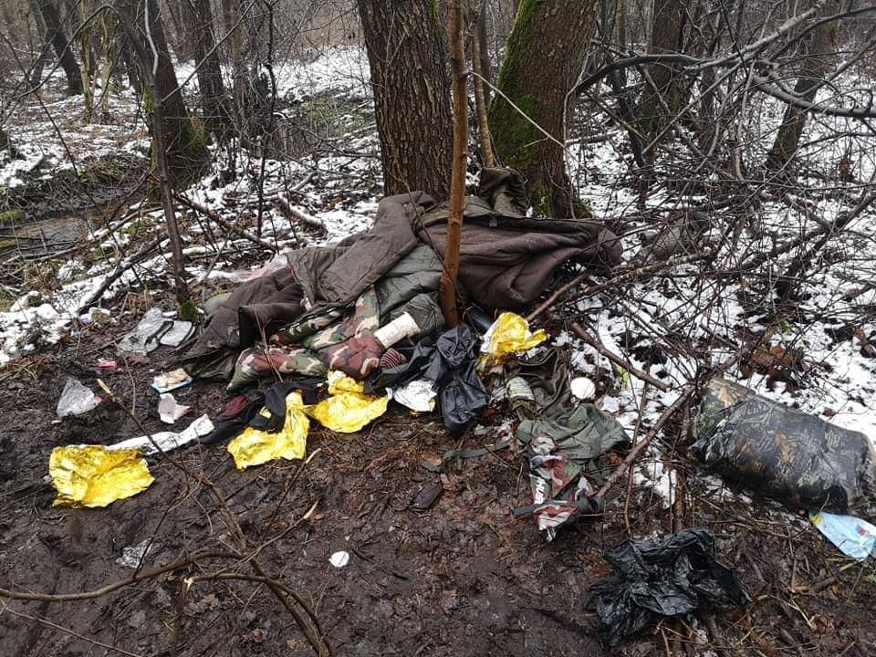
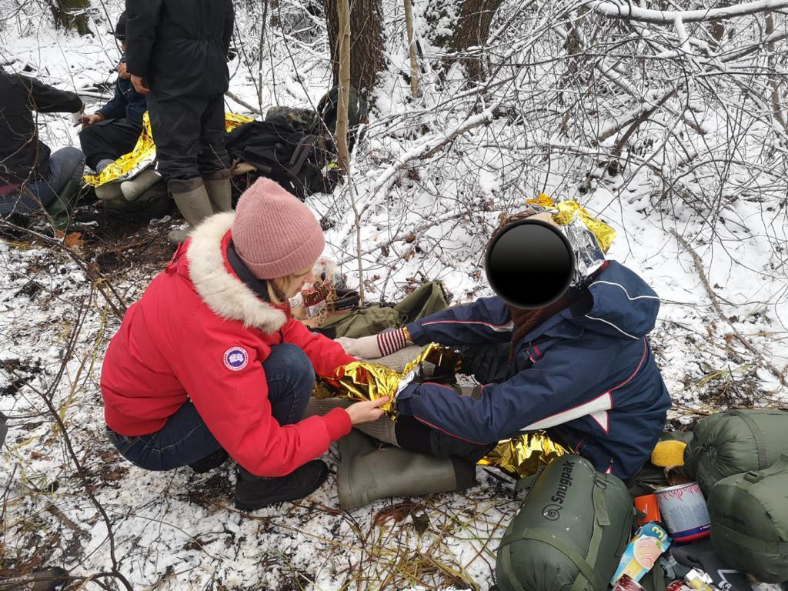
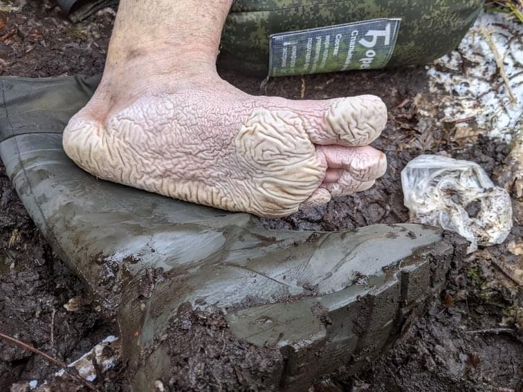
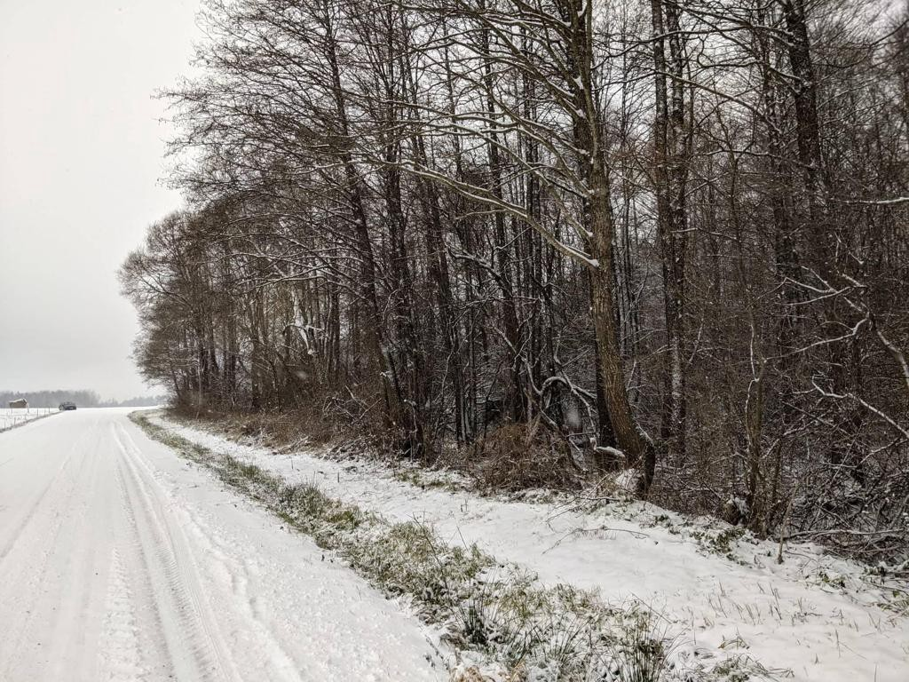
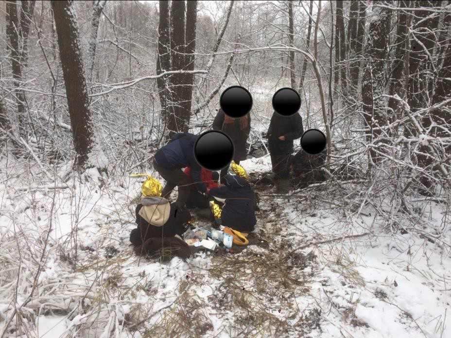

### AYS Special from Poland, Belarus, Lithuania: A Border Crisis Hell

_In November, Ruhi Loren Akhtar \(Founder & CEO of Refugee Biriyani & Bananas\) travelled to the Poland, Lithuania, and Belarus border to assess the situation, raise awareness, and provide humanitarian aid, where possible, to the people who were affected and displaced there\. This is their report on what they found\._

What we found was a border crisis zone like no other\. It seemed like a warzone, with tanks, checkpoints, and military professionals wherever we turned in Poland\. There was an emergency red area where the borders joined from Lithuania and Poland to Belarus, which meant volunteers, humanitarians, media, and journalists could not enter there\.

> We knew that people were being used as weapons in a hybrid war orchestrated by the Belarussian authorities and were being pushed into Lithuania and Poland\. 

The Lithuanian and Polish authorities were in turn pushing people back\. How many people are affected is difficult to tell but reports suggest it is more that 3000 people\. The ‘no go’ red zone meant that it was not possible for anyone to fully understand the magnitude of this crisis, let alone be a witness or document the violations against humans happening there\. All we had were the reports from people who were stuck there themselves and what they were reporting to organisations and posting on social media\.

This is an account of our time volunteering with a small NGO in Lithuania providing humanitarian assistance to people who successfully made it out of the red zone and were stuck in the forest\. The helpline was manned 24 hours by volunteers\. Most of the distress calls that came through we could not help with as they were either still in Belarus or in the red zone\.

There were distress calls for everything, from people needing food and water, to dry clothes and medicine, to people injured and needing shelter\.

> The most difficult of all, were calls when someone informed us that a friend or family member was missing for many days and asked if we could help locate them\. The reality was, we couldn’t\. 

One morning we got a distress call from four Syrian men who had made it out of the red zone and into the Lithuanian forest\. One of them was a boy 16 years old\. There had been heavy snow and the temperatures were far below zero\. They asked us to come quickly because they were so cold\.

We prepared an emergency backpack with items such as food, water, foil emergency blankets, sleeping bags suitable for extremely low temperatures, camping cooking stoves, gas, matches, thermal clothing, hats, scarves, gloves, a thermos with hot tea, medical dressings, and antiseptic\.

Lorenzo Leonardi \(Refugee Biriyani & Bananas Project Manager\) was the first person to the site:

> The forests are lethal\. Dark\. Cold\. Uneven, muddy, wet terrain\. Difficult for even an experienced camper to navigate or survive in, let alone people who had already been pushed back and forth between countries, beaten by authorities, without basic life necessities, dogs set upon them, with weakened bodies, minds, and immune systems\. 

Lorenzo reported that initially the people were scared to come out, hiding behind trees, until he reassured them that there were no police\. He put his arms out as they approached and one of the men came to give him a hug\. His friends joined and they ended up in a group hug\. The men cried\. They had been through so much\.

One of the men was elderly and was suffering from excruciating back pain\. Yet he did not want to call the medical services\. It is known that people have been pushed back after being in hospital\.

They were shaking from cold\. Their feet extremely macerated due to being in wet conditions for so long\. The team left the emergency pack and supplies with them and offered some words of comfort\. It broke our hearts knowing that we had to leave them in the forest to sleep that night\.

However, we could not do anything more than provide humanitarian assistance, as anything further would have been deemed illegal — volunteers have been increasingly criminalised\. We went back the next day and the men had gone\. We salvaged what resources we could for the next distress call\.

We later learnt — that after all they had been through — when this group managed to cross into Poland from Lithuania they were stopped by authorities and pushed back into Belarus\! Thousands of people have gone through similar experiences\.

> We know of people who have frozen to death\. 

We know of a child, four years old, who is missing in the Polish forest after she was separated from her family who were pushed back into Belarus\. Do you really think a four\-year\-old child can survive in a frozen forest alone?

I say that this border crisis zone is like no other I have volunteered in\. It was not like the old Idomeni camp in Northern Greece along the border with Macedonia, where I could see thousands of people in tents\. It was not like ‘The Belgrade Barracks’ in Serbia, where there were over a thousand people squatting in a squalid abandoned warehouse\.

> Here the people had been made invisible, as if they were ghosts to the outside world\. 

But we know they are still there, and we can still hear their silent cries\. Every day people are dying or going missing in this border crisis hell\. We urge all of Europe to provide a humanitarian corridor for these people\. This is not about being given the right to seek asylum, which they deserve, or a relocation programme and a country to house them\. Right now, it is about saving lives\.

**_Article and photos by Ruhi Loren Akhtar \(Founder & CEO of Refugee Biriyani & Bananas\)_**

**Find daily updates and special reports on our [Medium page](https://medium.com/are-you-syrious) \.**

**If you wish to contribute, either by writing a report or a story, or by joining the info gathering team, please let us know\.**

**We strive to echo correct news from the ground through collaboration and fairness\. Every effort has been made to credit organisations and individuals with regard to the supply of information, video, and photo material \(in cases where the source wanted to be accredited\) \. Please notify us regarding corrections\.**

**If there’s anything you want to share or comment, contact us through Facebook, Twitter or write to: areyousyrious@gmail\.com**

_Converted [Medium Post](https://medium.com/are-you-syrious/ays-special-from-poland-belarus-lithuania-a-border-crisis-hell-7f7019c3f26e) by [ZMediumToMarkdown](https://github.com/ZhgChgLi/ZMediumToMarkdown)._
