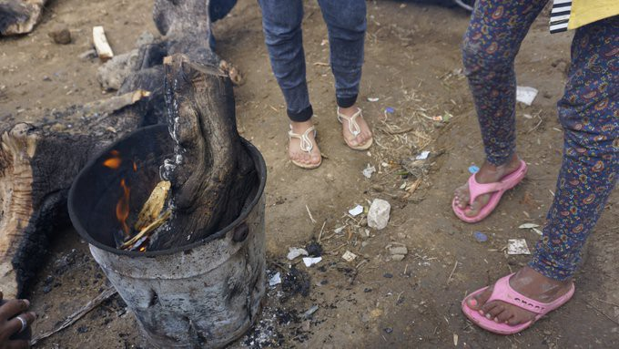
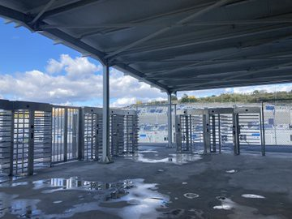
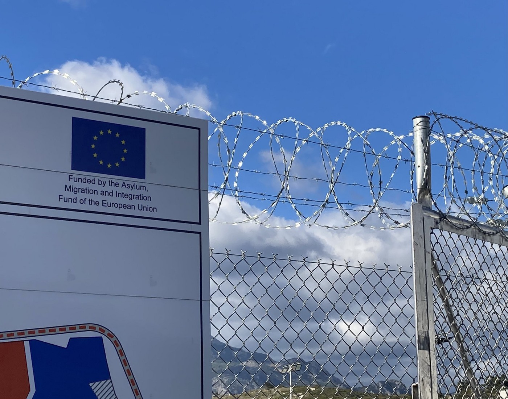
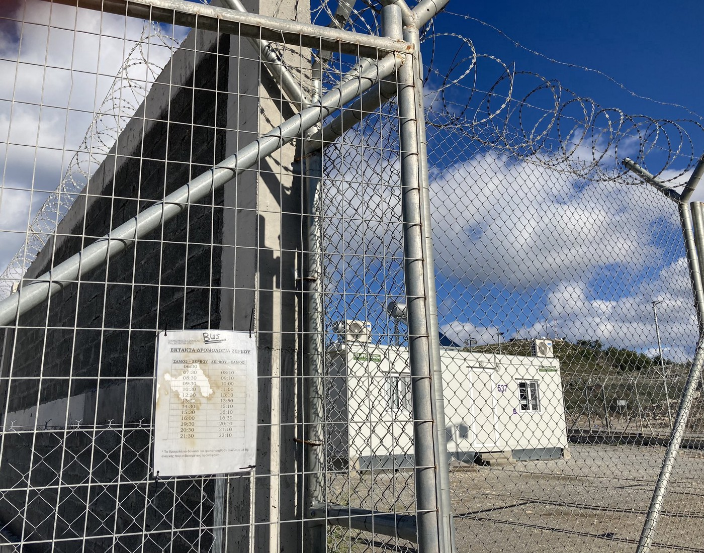
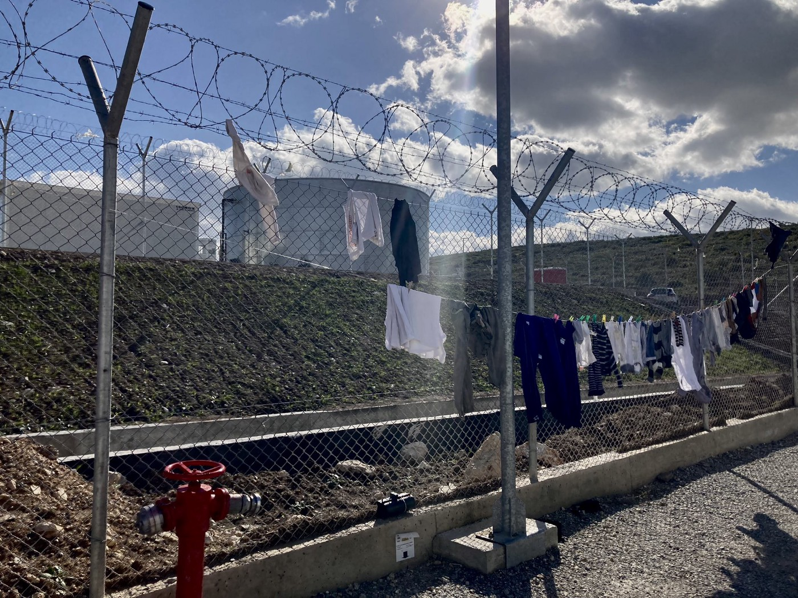

### AYS Special from Greece: How to live without money? Still no Cash Card\.

[Are You Syrious?](?source=post_page-----e3e5261e2d34-----------------------------------)

[Dec 26](ays-special-from-greece-how-to-live-without-money-still-no-cash-card-e3e5261e2d34?source=post_page-----e3e5261e2d34-----------------------------------) · 8 min read

_Khora Asylum Support Team on the situation for people on the move struggling to survive without cash assistance for the last three months\. The Catholic Relief Service has now taken over the distribution, but though cards have been given out, no money has been put on them\._

\(Trying to keep warm in Malakasa\. Photo Credit: [Franziska Grillmeier](https://twitter.com/f_grillmeier) \)

In 2017, a cash card assistance programme managed by the UNHCR was initiated in Greece\. It provided essential financial support to over 200,000 vulnerable asylum seekers while contributing to the local economy through [the purchase of goods and services](https://www.unhcr.org/gr/en/23535-unhcr-hands-over-the-management-of-the-cash-assistance-programme-for-asylum-seekers-in-greece-to-the-greek-government.html) \. Eligible asylum seekers received a monthly allowance calculated on the basis of family size and whether they were provided food in their accommodation\. According to the UNHCR’s 2020 report, “food remained the top expense, followed by hygiene items which increased significantly compared to pre\-COVID average hygiene expenditure”\. Other expenses include travel, communication, and school materials\.

**“Are you _ELIGIBLE?”_**

The cash card assistance programme was originally established to serve all asylum seekers in Greece\. However, from July 2021, access to this financial assistance was restricted to those housed in formal accommodation structures recognised by the Greek authorities\. This decision de facto excluded the ‘independent population’ living in rental flats, housed in shelters run by non\-governmental affiliated organisations, living with family or friends, and those who were left homeless if they were not lucky enough to have access to one of the aforementioned types of ´independent housing´\. Cash card assistance was paramount to the survival of this ‘independent population’ as they did not have access to the various goods and services provided by government\-approved humanitarian organisations inside the asylum seeker camps\. According to UNHCR data referred to by the media, [in March 2021 at least 25,000 asylum seekers fell into this category\.](https://www.news247.gr/koinonia/ypoyrgeio-metanasteysis-katargisi-voithimatos-aitoyntes-asylo-ektos-domon.9203591.html)

\(Samos Closed and Controlled Camp\. Photo Credit: [Petra Molnar](https://twitter.com/_PMolnar/status/1466133782755426309) \)

The paradox is that the majority of these asylum seekers have not chosen to live outside of official housing **— the demand far outweighs the supply** and it is therefore impossible for all asylum seekers to be eligible for the financial assistance that they _should_ be entitled to\. In addition to the shortage of supply, one must also take into consideration the well\-documented unwelcoming and inhumane [prison\-like](https://www.infomigrants.net/en/post/32834/greece-migrant-camps-surrounded-by-concrete-walls) conditions in the camps — overcrowding, [detention](https://www.aljazeera.com/news/2021/10/22/prisons-in-paradise) , tents during the bitter winter, and [increasing heavy surveillance](https://www.aljazeera.com/news/2021/5/25/concrete-walls-and-drones-greek-plans-for-refugee-camps-decried) \. The [new camps opened on Samos](https://www.aljazeera.com/news/2021/5/25/concrete-walls-and-drones-greek-plans-for-refugee-camps-decried) , Kos and Leros, with two more planned for Lesvos and Chios, do not offer solutions either\. Beyond the total lack of appropriate material comfort in camps, certain extremely vulnerable populations were left no choice but to find alternative accommodation, as they were met with the same persecutions which made them flee their country of origin while in the camp\.

> _The exclusion from the cash card assistance programme of this ‘independently housed’ population therefore had a direct detrimental effect on the physical and mental wellbeing of the most vulnerable asylum seekers\._ 

In addition, unacceptable delays also contribute to more people falling through the cracks\. When registering a first claim or subsequent claim in Athens, people wait months and months to get through on Skype to be given their registration appointment at the asylum office, leaving people ´ineligible´ for financial support to use for food and basic necessities\. _Why does it take so long?_ People are expected to call Skype within a weekly one\-hour slot corresponding to their native language — and these lines are understaffed and the demand too great\. For people who managed to get through on Skype and register their claim with the asylum office, they then needed to register for the cash card assistance programme via Viber, a process that sometimes took months due to … more understaffing\.

Furthermore, with the decision to restrict the cash card assistance to beneficiaries of government\-approved housing only, asylum\-seekers faced a new delay in reaching out to the handful of government\-approved organisations who are accredited to refer them to the waiting lists for appropriate housing that would make them eligible to receive cash assistance\. These inefficient systems are unacceptable, and have an impact on people’s physical and mental wellbeing\.

**The ´handover´ of the cash card assistance programme**

To make matters worse, the UNHCR announced the [handover of the management of the cash card programme to the Greek government](https://bit.ly/2YYajNc) \. The last money transfer that cash card holders received covered August and September 2021\. No new cards were issued after July 20th, so those who have become eligible to receive cash assistance since then have also been left with nothing, leaving families in impossible situations\.

> _Again we have no money to eat\. Where can we find the money to rent a house for [\#Helios](https://twitter.com/hashtag/Helios?src=hashtag_click) \(implemented by Greece in coop with [\#IOM](https://twitter.com/hashtag/IOM?src=hashtag_click) & funding of EU\-Commission\), I run in my wheelchair from one church to another, from one hum\. organisation to another to collect food & diapers\. — Testimony via [Franziska Grillmeier](https://twitter.com/f_grillmeier) from Malakasa Residents_ 

Under the EU Reception Conditions Directive \( [Directive 2013/33/EU of the European Parliament and of the Council of 26 June 2013](https://eur-lex.europa.eu/legal-content/EN/TXT/PDF/?uri=CELEX:32013L0033&from=EN) \), member states are to ensure that ‘material reception conditions’ provide an adequate standard of living for applicants, which guarantees their subsistence and protects their physical and mental health\. This can be provided as housing, food and clothing provided in kind, financial allowances, vouchers, or a combination of the three, as well as a daily expenses allowance\. It is clear for all to see that these needs are not being met in Greece\.

[As Mireille Girard, UNHCR´s representative in Greece said](https://www.keeptalkinggreece.com/2021/10/01/greece-government-cash-assistance-asylum-seekers-unhcr/) : “cash assistance reinforces the dignity of those who have been forced to flee, enabling them to meet their basic needs and to decide for themselves how they do so, \[and\] it is important that all asylum seekers in need of support continue to receive it without interruption and that they are informed about the new program during this transition\.”

More than three months have passed since the last cash card payment\. These delays from the Greek government in setting up the programme have left even more people in very desperate situations, relying on the support of grassroots organisations and NGOs trying to fill the significant gap in services\.

Khora is an association of community spaces supporting displaced people in Athens\. At Khora’s Asylum Support Team, many who have contacted us for support have been struggling because they cannot afford basic necessities\.

> _Where can they eat? Where can they sleep? Where can they get clothes?_ 

Without cash assistance, people rely on initiatives like Khora’s Social Kitchen for food, Khora Free shop for clothing and basic hygiene items — but this increase in demand has put an additional strain on already stretched resources\.

In addition, the backdrop of a pandemic complicates the situation further\. Those attempting to access medical and social services, or even attend an appointment at the asylum office, are now required to show a vaccination certificate or negative Covid 19 test\. Due to the lack of government outreach and inadequate distribution of information regarding the vaccine in languages used by the asylum seeking community, as well as the obstacles faced in obtaining a temporary social security number in order to get vaccinated, [a large proportion of the asylum seeking population remain unvaccinated](https://reliefweb.int/sites/reliefweb.int/files/resources/bp-peoples-vaccine-refugees-301121-en.pdf) \. _How can asylum seekers be expected to incur the costs of COVID 19 tests when their basic needs cannot be met?_

> _They are now being turned away from the asylum offices, hospitals, town halls, and Citizen Service Centres \(KEPs\) \. Once again, the system is failing those whom it has a duty to support\._ 

**Long awaited news**

Last week, the start of the new programme was announced and the distribution of cards to ESTIA sites, Reception and Identification Centres \(RICs\), and shelters cooperating with the Ministry, is underway in partnership with Catholic Relief Services \(CRS\) \. _When will all the cards be distributed?_ No one knows\. _When will the cards be loaded for the first time?_ No one knows\. _What are people supposed to do in the meantime?_

According to the CRS, those deemed eligible will be given a lump sum to cover October and November, the months during which they did not receive any assistance\. But until then… the situation in the camps, on the sites, and in ESTIA accommodation is worsening\. Organisations have been providing emergency food packets and vouchers for beneficiaries — but their waiting lists are full and more people need support\. People cannot be fed retrospectively, and this delay in providing this financial assistance has led to a hunger crisis\. Not to mention those who had already been, and will continue to be, excluded from the cash card assistance programme but desperately need this support too\.

However, none of this comes as a surprise\. This mismanagement is aligned with other policies, decisions, and approaches aimed at making Greece as unwelcoming and inhospitable as possible for those who seek asylum and are looking to rebuild their lives\.

> _How are people meant to survive when they don´t have the right to legally work and are not receiving any assistance?_ 

The answer is, they aren’t really\. The system is not here to take care of people, it is meant to deter those who are thinking of coming to Europe, and punish those who have\. But it is not a crime to seek safety and stability, it is a human right enshrined in international law \(Article 14 of the 1948 Universal Declaration of Human Rights and 1951 UN Convention relating to the Status of Refugees\) \. Until the goal of decision makers is to truly protect, welcome, and support, we sadly do not expect to see the shifts needed to address the problems created by the EU´s gross mishandling of the situation\.

**_Article by Veronica Lopes da Silva, volunteer at Khora asylum support team_**

**Find daily updates and special reports on our [Medium page](https://medium.com/are-you-syrious) \.**

**If you wish to contribute, either by writing a report or a story, or by joining the info gathering team, please let us know\.**

**We strive to echo correct news from the ground through collaboration and fairness\. Every effort has been made to credit organisations and individuals with regard to the supply of information, video, and photo material \(in cases where the source wanted to be accredited\) \. Please notify us regarding corrections\.**

**If there’s anything you want to share or comment, contact us through Facebook, Twitter or write to: areyousyrious@gmail\.com**

_Converted [Medium Post](https://medium.com/are-you-syrious/ays-special-from-greece-how-to-live-without-money-still-no-cash-card-6ff35c7ee017) by [ZMediumToMarkdown](https://github.com/ZhgChgLi/ZMediumToMarkdown)._
