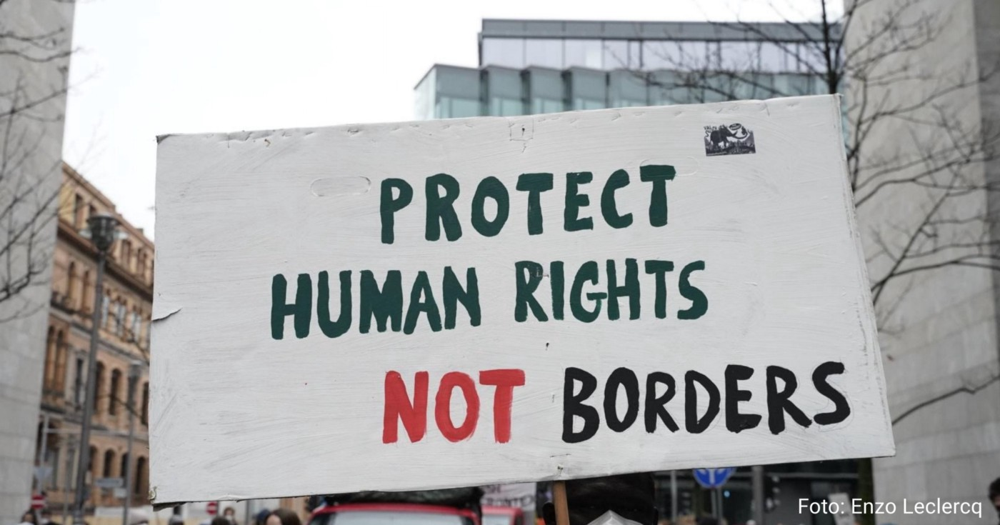
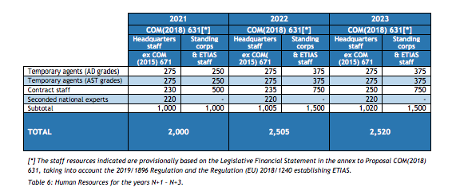
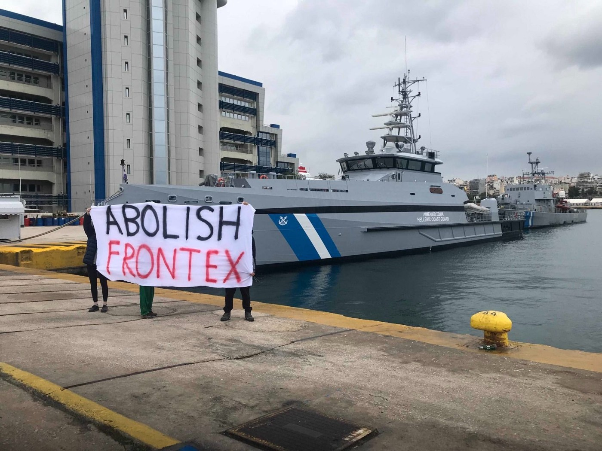
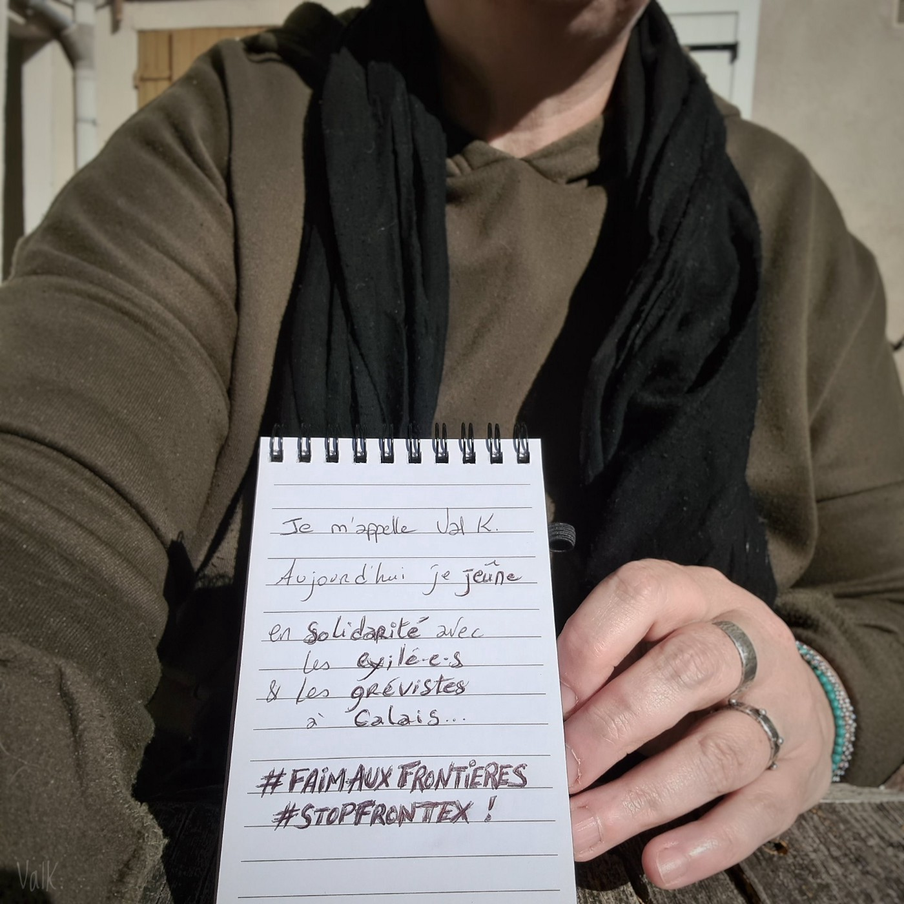
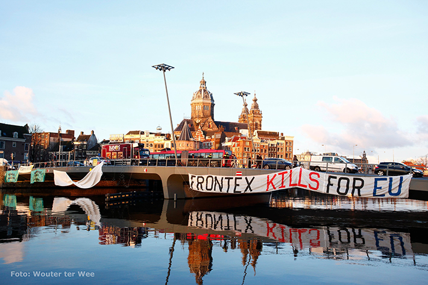
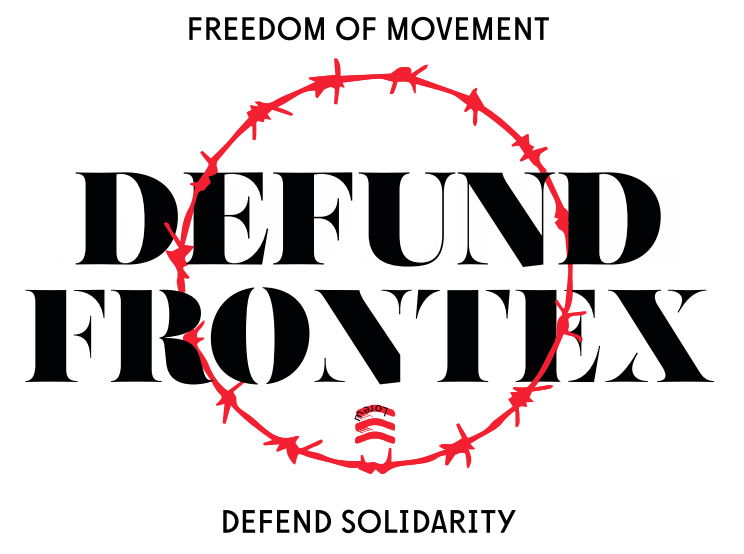
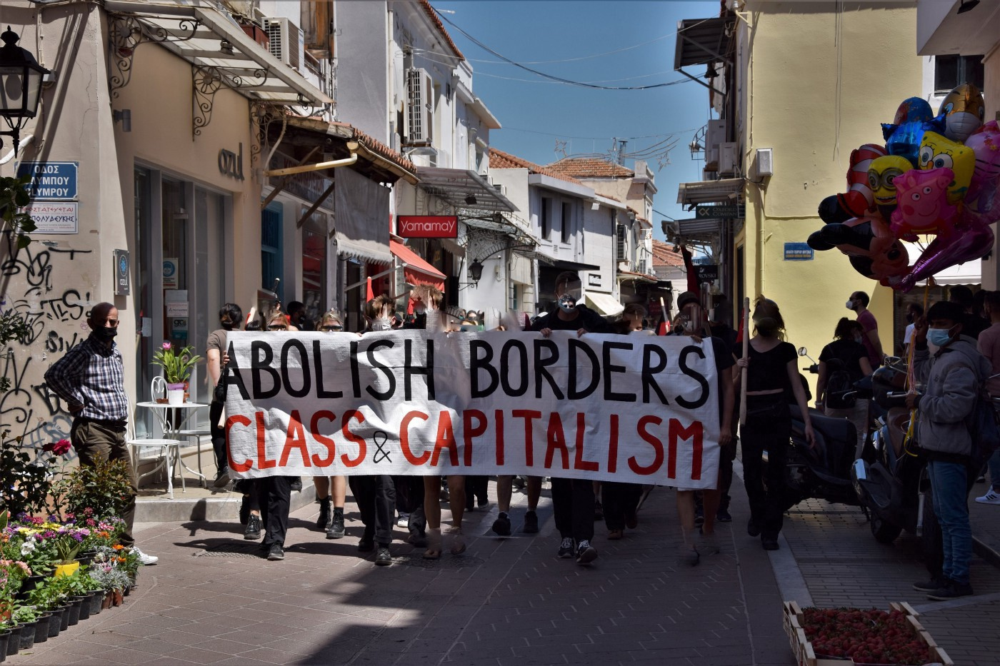
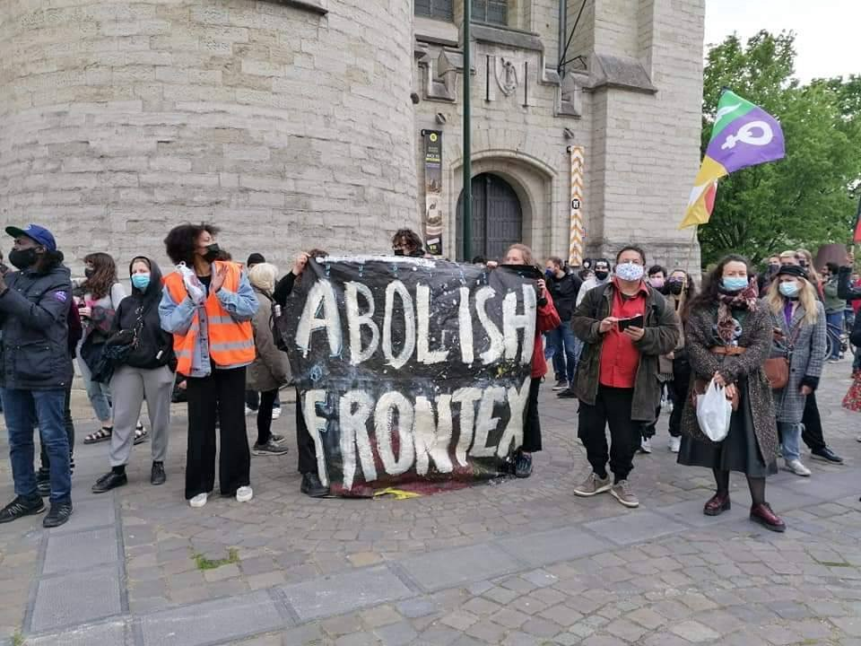
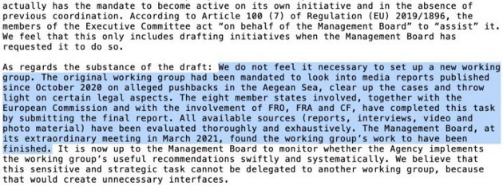
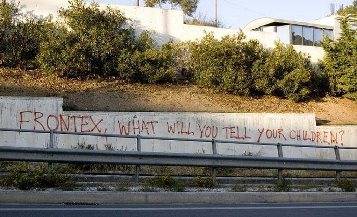

### AYS Special: Frontex and Human Rights — How did we arrive here? Part 4 \(2021\)

[Are You Syrious?](?source=post_page-----a357275afc3f-----------------------------------)

[Dec 28, 2021](ays-special-frontex-and-human-rights-how-did-we-arrive-here-part-4-2021-a357275afc3f?source=post_page-----a357275afc3f-----------------------------------) · 45 min read

_Working on an article about Frontex is not an easy task\. Information and allegations about the agency are piling up on a daily basis\. The purpose of this article is to give an overview of Frontex’s increasing role in EU border management — with no accountability or respect for fundamental rights in its operation\._

_This is the fourth part of the Frontex timeline, now covering the entirety of 2021\. Like the previous parts, it starts with the most recent entry\._

_Check out [PART 1 \(2004–2016\)](ays-special-frontex-and-human-rights-how-did-we-arrive-here-part-1-2004-2016-17cffb340c07)_ , [_PART 2 \(2017–2019\)_](ays-special-frontex-and-human-rights-how-did-we-arrive-here-part-2-2017-2019-83dbb24acb7f) and [_PART 3 \(2020\)_](ays-special-frontex-and-human-rights-how-did-we-arrive-here-part-3-2020-present-706438d8e29)
### 2021

Helsinki, December 2021 \(Credit: [Balkanbrücke](https://twitter.com/balkanbruecke/status/1472844388917477378/photo/1) \)

[**Provisional estimate of budget:**](https://frontex.europa.eu/assets/Key_Documents/MB_Decision/2021/MB_Decision_1_2021_adopting_SPD_2021-2023.pdf) €543\.5m \( \+18% from 2020\)
**Staff:** It was [envisaged](http://provisional%20estimate%20of%20budget/) that Frontex staff numbers will reach 2,000 in 2021, with 1,000 headquarters staff and 1,000 members of the agency’s standing corps\. \(See table below\) \. As of 17 December 2021, 500 Standing corps officers \(statutory staff\) were deployed\.

[Single Programming Document 2021–2023](https://frontex.europa.eu/assets/Key_Documents/MB_Decision/2021/MB_Decision_1_2021_adopting_SPD_2021-2023.pdf)
### Investigating Frontex \(up to the end of July 2021\)
1. Internal Management Board Working group: **Closed** \( [Summary](https://www.statewatch.org/observatories/frontex/frontex-under-scrutiny-inquiries-and-investigations-november-2020-onwards/frontex-management-board-working-group/) \) \. [Final report](https://www.statewatch.org/media/2024/agenda_point_wg_fralo_final_report.pdf) delivered on February 26 and released on March 1\.
2. OLAF, Anti\-Fraud European watchdog: **Ongoing** \(last update: January 11\) \.
3. EU Ombudsman:
◆ **CASE [OI/5/2020/MHZ](https://www.ombudsman.europa.eu/en/case/en/57955) on** how Frontex deals with complaints about alleged breaches of fundamental rights through its ‘Complaints Mechanism\.’ **Closed** \. [Decision](https://www.ombudsman.europa.eu/en/decision/en/143108) reached on June 15\.
◆ **CASE [2191/2020/VB](https://www.ombudsman.europa.eu/en/case/en/58432) on** Frontex’s failure to reply to an administrative complaint\. **Closed** \. Decision reached on April 12, 2021, but no details published\.
◆ **CASES [1261/2020/MAS](https://www.ombudsman.europa.eu/en/case/en/57481) and [1361/2020/MAS](https://www.ombudsman.europa.eu/en/case/en/57573) on** how Frontex deals with requests for public access to documents\. **Ongoing** \(last update: January 28\) \.
◆ **CASE [2273/2019/MIG](https://www.ombudsman.europa.eu/en/case/en/56157)** on Frontex’s failure to maintain a public register of documents and other issues related to public access to documents\. **Closed** \. [Decision](https://www.ombudsman.europa.eu/en/decision/en/137721) reached on February 3\.
◆ **CASE [233/2021/OAM](https://www.ombudsman.europa.eu/en/case/en/58688)** on how Frontex dealt with a request for public access to documents concerning tracking data of vessels used in Frontex maritime operations\. **Closed** \. [Decision](https://www.ombudsman.europa.eu/en/decision/en/139960) reached on March 30\.
4. Fact finding investigation regarding alleged violations of fundamental rights by Frontex of the European Parliament’s Frontex Scrutiny Working Group \(FSWG\) \. **Concluded** \. [Report and Annex submitted in July 2021](https://www.europarl.europa.eu/committees/en/frontex-scrutiny-working-group-/product-details/20210715CAN62641) \. While the report concludes the fact finding investigation, the FSWG mandate is to permanently monitor all aspects of the functioning of Frontex\.
5. Court of Justice of the European Union \(CJEU\) \. Legal action [submitted](https://www.front-lex.eu/) by Front\-Lex, Progress Lawyers Network and the Greek Helsinki Monitor on behalf of two applicants, for failing to cease all operations in the Aegean Sea\. **Ongoing** \. Last update May 25\.
6. Court of Justice of the European Union \(CJEU\) \. Legal action [submitted](https://www.notonourborderwatch.com/story/the-case) by Dutch human rights law firm on behalf of a family of 6, who were unjustly deported from Greece to Turkey in October 2016\. Last update October 20\.

\+ Syria Justice and Accountability Center \(SJAC\): [awaiting reply](https://syriaaccountability.org/updates/2021/01/28/sjac-calls-on-icc-prosecutor-to-investigate-crimes-against-humanity-committed-by-greece-against-refugees/) by International Criminal Court\. **Ongoing\.** Last update: November 12\.
### December

Pireaus Port, Athens \(Credit: [Abolish Frontex Athens](https://www.facebook.com/AbolishFrontexAthens/posts/109219618285824) \)

**17 December:** 109 officers from 16 European Member States [graduated](https://frontex.europa.eu/media-centre/news/news-release/109-new-standing-corps-cadets-graduate-RhqYEQ) from their basic border and coast guard training after a six\-month course in the Policia Nacional academy in Avila, Spain\. The next batch of 180 officers will start their basic training in January 2022\. Frontex currently deploys about 500 standing corps officers, all of whom are part of the agency’s statutory staff\. The standing corps will grow to up to 10,000 officers by 2027 and will also consist of officers on long\- and short\-term secondments from Member States\.

**15 December:** Asylum Protection Center [reports](https://twitter.com/APC_CZA/status/1470413209530159107) brutality and pushbacks on the Hungarian/Serbian border\.

> _Horgos, Increased brutality of the Hungarian army and police together with Frontex officers\. A week ago, several Czech members of Frontex together with the Hungarian police forcibly returned 5 minors from Afghanistan \(15–17\) to Serbia, previously hitting them with batons on their hands and backs\._ 

**14 December:** After a few months of campaigning against the contract signed by the Polytechnic University of Turin and Frontex for the production of maps for the agency, the university [votes](https://altreconomia.it/il-politecnico-di-torino-va-avanti-con-frontex-sui-diritti-umani-una-fragile-clausola/) to go ahead with the project\. This included a request to Frontex to use said maps “respecting human rights”, but did not foresee any control mechanism for this\.

**13 December:** Asylum Protection Center [report](https://twitter.com/APC_CZA/status/1470413209530159107) about testimonies gathered on the Serbian/Romanian border\.

> _According to the statements of the refugees, violent pushbacks have been happening for the last 3 months, in which the Frontex patrol, the Romanian police and the army are participating together\. O\. M\. from Egypt states that they took his money, phone and beat him on the legs with batons before the push back to Serbia\._ 

> Also on the same day, Frontex [renews](http://Today, Frontex, the European Border and Coast Guard Agency, renewed its cooperation plan with the Moldovan Border Police for the period 2022-2024) its cooperation plan with the Moldovan Border Police for the period 2022–2024\.

**9 December:** Frontex Executive Director [signs](https://frontex.europa.eu/media-centre/news/news-release/frontex-and-lithuania-agree-on-service-weapons-delivered-to-frontex-standing-corps-officers-y3iVzk) an agreement with Lithuania’s Minister of Interior Agnė Bilotaitė to deploy Frontex standing corps officers equipped with service weapons provided by Lithuania\. The agreement is signed in the presence of EU Commissioner for Home Affairs Ylva Johansson and Slovenia’s Minister of Interior Aleš Hojs\.

For the first time, the Frontex standing corps officers recruited as EU statutory staff \(category 1\) will be able to carry firearms for patrolling activities\. This agreement will be followed by similar agreements with other national authorities in the coming months\.

> _“This will give us more flexibility to continue our support to Lithuania after the end of the rapid intervention\.” \(Frontex Executive Director\)_ 

While the use of force by Frontex staff is governed by the [2019/1896 Regulation](https://eur02.safelinks.protection.outlook.com/?url=https%3A%2F%2Feur-lex.europa.eu%2Flegal-content%2FEN%2FTXT%2F%3Fqid%3D1573722151667%26uri%3DCELEX%3A32019R1896&data=04%7C01%7Cjustyna.jurczak%40frontex.europa.eu%7Ce5607cbf5bc34694442308d9bb0f70d4%7C1a17d6bf51554e22bf292ba5da77f037%7C0%7C0%7C637746497455925904%7CUnknown%7CTWFpbGZsb3d8eyJWIjoiMC4wLjAwMDAiLCJQIjoiV2luMzIiLCJBTiI6Ik1haWwiLCJXVCI6Mn0%3D%7C3000&sdata=QZhqU6rT%2F%2FStDkJnsH4I4%2BxfWQ%2FZNeq6Z%2FPaYG32KH8%3D&reserved=0) , previously this year concerns emerged about the [capability and monitoring over the use of weapons](https://digit.site36.net/2021/04/03/frontex-and-the-use-of-force/) and over the legality of procurements of fire arms\.

> On the same day, the International Centre for Migration Policy Development \(ICMPD\) and Frontex [conclude](https://frontex.europa.eu/media-centre/news/news-release/frontex-and-icmpd-conclude-project-on-developing-pool-of-forced-return-monitors-sQfjiY) the Forced\-Return Monitoring III \(FReM III\) project\.

> _…together with the previous FReM I and II projects, \[FREM III\] aims to contribute to a functioning EU Return System in line with the EU Return Directive \(2008/115/EC\), guaranteeing and protecting the fundamental rights of returnees through independent and transparent forced\-return monitoring based on a common European framework, standards, good practices and harmonised procedures\. The project supports the European Border and Coast Guard Agency \(Frontex\) to develop the pool of forced\-return monitors in line with European Border and Coast Guard \(EBCG\) Regulation \(2019/1896\) \. Furthermore, the project supports European Union \(EU\) Member States \(MSs\) with targeted needs\-based national activities, enhancing their monitoring capacity, and increasing the implementation of the EU Return Directive\. [\[ICMDP\]](https://www.icmpd.org/our-work/projects/forced-return-monitoring-iii-frem-iii)_ 

**6 December:** Jungle Of Calais/BorderMonitoring\.eu publish an [analysis](https://calais.bordermonitoring.eu/2021/12/06/kein-kurswechsel-in-sicht/) on the first week of Frontex reconnaissance flights in the Channel\. During the first 6 days, the Frontex plane was used twice\. Both the times of take off and landing \(flights were both in daytime, while crossing take place mainly at night\) and the area covered \(flightpaths show that the plane did fly only over the French and Belgian coast\) suggest the merely symbolic contributions of the European border agency\.

**1–2 December:** The first Euro\-Arab Border Security Conference [takes place](https://frontex.europa.eu/media-centre/news/news-release/first-euro-arab-border-security-conference-YS27S0) in Amman, Jordan\. Border management authorities of the European Union and the League of Arab States gather to discuss how to strengthen dialogue and cooperation in response to global challenges\. It was a joint initiative of Frontex and the General Secretariat of the Arab Interior Ministers’ Council \(AIMC\) of the League of Arab States \(LAS\), and was held under the patronage of the Prime Minister of Jordan, Mr Bisher Al Khasawneh, represented by Minister of Interior and the Public Security Directorate\. Representatives from over 40 states, relevant EU and the LAS bodies, as well as representatives of international organisations participated in the event\. The conference is a flagship activity of the EU4BorderSecurity project, funded by the European Neighbourhood Instrument \(ENI\) and implemented by Frontex, with an objective to enhance border security and integrated border management in the Southern Mediterranean\.

**1 December:** After a French and Belgian ministerial meeting on November 28, a Frontex aircraft lands in Lille to start operating in the Channel and North Sea coastal region\. The plane is equipped with modern sensors and radars to support border control at land and sea\. Frontex Executive Director states that the Agency is ready to increase their support\.
### November

Credit: [Sara Montesinos](https://twitter.com/SaraMMP/status/1459491904412868611/photo/1)

**25 November:** the Association for Juridical Studies on Immigration \(ASGI\) releases a press statement in which they describe how members of the association were [taken into custody](https://en.asgi.it/from-greece-to-north-macedonia-asgi-delegation-rejected-outside-the-european-union-during-a-technical-legal-visit/?fbclid=IwAR0juV-bR5llEBAWqZ3F8fqwpw9GC7ZU3-_9yvZEhu1BzQmdPK02PMmBQh0) by Greek police and Frontex officers near Idomeni, during a “technical\-legal” visit at the Greek\-Macedonian border\. They were verbally assaulted, brought to the border crossing point and forced to return on foot to Macedonian territory in early November\.

**23 November:** Frontex and eu\-LISA [sign](https://frontex.europa.eu/media-centre/news/news-release/frontex-and-eu-lisa-sign-cooperation-plan-2AkvQA) a new cooperation agreement to increase the cooperation between the two EU agencies\. eu\-LISA is the European Union Agency for the Operational Management of Large\-Scale IT Systems in the Area of Freedom, Security and Justice and its cooperation with Frontex has extended considerably over the past years\. Currently, the two agencies are working closely together to set up ETIAS\. Eu\-LISA is responsible for developing its large\-scale IT system, while Frontex hosts the ETIAS Central Unit, which will operate on a 24/7 basis to support travellers and carriers\.

The new agreement \(2021–23\) covers 10 thematic areas, including border and migration management, IT security, research and innovation as well as personal data protection\.

**16 November:** Frontex and the Slovenian Council Presidency organise a meeting with the heads of Border Police from the Western Balkans, to reaffirm partnership priorities\. Participants are gathering to [discuss](https://frontex.europa.eu/media-centre/news/news-release/frontex-and-slovenian-presidency-host-high-level-meeting-with-western-balkan-partners-tLLEDP) joint operations, information exchange and capacity building activities in the region\. They [pledge](https://frontex.europa.eu/assets/Images_News/2021/Joint_Conclusions.pdf) to:

> _◆ strengthen our cooperation through intensified dialogue and joint initiatives;_ 
 

> _◆ further invest into joint operational activities, including in the coast guard domain where relevant, making full use of the existing legal frameworks;_ 
 

> _◆ work together towards building capacities and capabilities in line with the standards and best practices of the European integrated border management\._ 

**12 November:** After the first submission in January 2021, the Syria Justice & Accountability Centre \(SJAC\) [submits](https://syriaaccountability.org/updates/2021/11/22/updated-submission-sjac-calls-on-icc-prosecutor-to-investigate-crimes-against-humanity-committed-by-greece-against-refugees/) to the International Criminal Court \(ICC\) prosecutor a [detailed update](https://syriaaccountability.org/wp-content/uploads/SJAC_ICC-Communique%CC%81.pdf) with new evidence from the ground, which provides a reasonable basis to believe that Greek and Frontex actions constitute crimes against humanity\.

_The ICC Prosecutor to open an investigation into the widespread and systematic attack by Greek authorities and their agents, as well as Frontex officials and their agents, on bona fide refugees\. This attack has occurred along the Greek\-Turkish border and on the Aegean islands since the start of the EU\-Turkey Deal in March 2016\. It is carried out by legislative, executive, and judicial practices intentionally coordinated to deny individuals with a well\-founded fear of persecution their right to seek asylum in Europe\._

**5 November:** Frontex publishes a [Call for Proposals for the establishment of Framework Partnership Agreements with Reintegration Partners providing reintegration services to non\-EU nationals returning to their countries of origin](https://frontex.europa.eu/media-centre/news/news-release/call-for-proposals-for-the-establishment-of-framework-partnership-agreements-with-reintegration-partners-providing-reintegration-services-to-non-eu-nationals-returning-to-their-countries-of-origin--fJLBOq) \. This is a further step towards consolidating the role of Frontex as the EU’s Return Agency\. By June 2022, the reintegration assistance provided by ERRIN \(European Return and Reintegration Network\) will be provided by Frontex\.

> On the same day, Frontex [concludes](https://frontex.europa.eu/media-centre/news/news-release/frontex-entry-exit-system-pilot-project-6FimQn) its Entry/Exit System \(EES\) pilot project at the Spanish border with the UK \(Gibraltar\) and at the Bulgarian border with Turkey\. When implemented, EES will centralise ID and biometric data of all non\-European travellers, gathered each time they cross an external EU border\.

**4 November:** Statewatch [releases](https://www.statewatch.org/news/2021/november/eu-tracking-the-pact-migration-action-plans-on-afghanistan-bosnia-and-herzegovina-iraq-and-nigeria/) 4 draft EU Action Plans dealing with Afghanistan, Bosnia and Herzegovina, Iraq and Nigeria\. They “show a chosen path of intensified externalisation of EU border management, and very little commitment to legal migration pathways\.” Statewatch had previously [released](http://draft%20action%20plan%20for%20niger%20was%20published%20by%20statewatch%20in%20september/) the EU Action Plan for Niger and [MigrationControl\.Info](https://migration-control.info/operationalisation-of-the-pact-niger-libya-morocco-tunisia/) released three more drafts regarding Libya, Tunisia and Morocco\. While these are not final versions, which were approved by the European Council in the 21–22 October meeting but not publicly released yet, they nonetheless paint a pretty stark pictures of the priorities of the European bloc\.
### October

[Credit: ValK\.](https://twitter.com/ValKphotos/status/1451895258409799685/photo/1)

**28–29 October:** Frontex awards contracts for the provision of [firearms](https://ted.europa.eu/udl?uri=TED:NOTICE:549089-2021:TEXT:EN:HTML&src=0) and [ammunition](https://ted.europa.eu/udl?uri=TED:NOTICE:548978-2021:TEXT:EN:HTML&src=0) for its new Standing Border Guard Corps\. Austrian arms giant Glock will receive €3\.76 million to supply [2,500](https://etendering.ted.europa.eu/document/document-file-download.html?docFileId=97573) semi\-automatic pistols \(plus accessories and training\) over the course of four years\. Over 3\.6 million rounds of ammunition will be provided by Polish companies Mildat and Parasnake Arkadiusz Szewczyk, which will earn €1\.24 million in total\. Read more [HERE](https://abolishfrontex.org/blog/2021/11/12/glock-will-provide-firearms-to-frontex-border-police-force/) \.

**27 October:** The European Parliament’s budget committee [agrees](https://www.thefirstnews.com/article/frontex-to-get-new-headquarters-in-warsaw-25645) to fund €140m to Frontex for the agency’s new offices in Warsaw\. “Based on preliminary analyses, the agency needs 70,000 square metres more space for more than 2,000 new employees”\. The building is slated to be finished by 2026, and the cost is covered by a loan from the European Investment Bank\. Find more info on Frontex headquarters and offices [HERE](https://www.asktheeu.org/en/request/headquarters_in_warsaw) \.

**25 October:** Statewatch [releases](https://www.statewatch.org/news/2021/october/eu-joint-europol-frontex-report-on-digitalisation-of-migrant-smuggling/) a joint report written by Europol and Frontex \(dated 29 September\) on the “digitalisation of migrant smuggling”, intended to provide state officials within the EU and Western Balkans “ _with a comprehensive intelligence picture on the use of digital tools and services’ \[sic\] in migrant smuggling and related document fraud, in order to raise awareness, consolidate existing knowledge and enforce opportunities to take appropriate measures to tackle emerging threats\._ ” The two EU agencies advise increased confiscation and extraction of asylum seekers’ mobile phones and now provide a manual on how to do so\. Apps to encrypt or disguise locations are described in the report as ‘countermeasures’ to surveillance\.

**24 October:** Michele Lancione, professor at the Polytechnic University of Turin, publishes an [article](https://altreconomia.it/non-a-fianco-di-frontex-chi-si-dissocia-dallaccordo-del-politecnico-di-torino/) in which he declares his, and other colleagues’, contrariety to the deal signed in July for the production of maps for Frontex and demanding the university to rescind its contract with the agency\.

> _I believe it is not possible to work with those like Frontex who reject, foment xenophobia, kill\._ 

**21 October:** Frontex’s Management Board convenes an extraordinary meeting to [appoint](https://frontex.europa.eu/media-centre/management-board-updates/the-appointment-of-the-3-deputy-executive-directors-9EUq7O) 3 Deputy Executive Directors of the agency\. Following the voting on the candidates shortlisted by the European Commission the Management Board decided to appoint:

> _◆ Mr Lars GERDES, as Deputy Executive Director for Returns and Operations_ 
 

> _◆ Ms Aija KALNAJA, as Deputy Executive Director for Standing Corps Management_ 
 

> _◆ Mr Uku SÄREKANNO, as Deputy Executive Director for EBCG Information Management and Processes\._ 

> On the same day, the European Parliament agrees on discharging the agency’s budget for 2019, which had been postponed pending responses from the Agency on the accusations of pushbacks and the agency’s failure to uphold its fundamental rights duties\. However, MEPs ask for €90m of the Frontex 2022 budget \(12%\) to be frozen and only made available once the agency has fulfilled a number of specific [conditions](https://www.europarl.europa.eu/news/en/press-room/20211014IPR14931/ep-asks-for-part-of-frontex-budget-to-be-frozen-until-key-improvements-are-made) \.

> _“These include recruiting 20 missing fundamental rights monitors and three deputy executive directors who must be sufficiently qualified to fill these positions, setting up a mechanism for reporting serious incidents on the EU’s external borders and a functioning fundamental rights monitoring system\.”_ 

**20 October:** A Dutch firm of human rights lawyers announces that it had filed a [lawsuit](https://www.notonourborderwatch.com/story/the-case) against Frontex at the CJEU\. They accuse the agency of being responsible for deporting a Syrian\-Kurdish family of 6 from Greece to Turkey in October 2016, despite having clearly stated their wish to apply for asylum\. Frontex was operating the flight through which they were deported\.

In January 2017 the same law firm filed a complaint against both Frontex and Greece within Frontex’s complaints mechanism\. Since then, and for 3 years and 9 months, Frontex refused to review its own role in the illegal push back of the family and limited itself to sending reminders to Greece, who ignored these\. Finally, Frontex concluded that the return of the family had been unlawful without offering any form of redress to the family\. Despite the fact that the flight was Frontex\-operated and Frontex staff had been on board, Frontex concluded that the Greek authorities are to blame\.

> _\[Now, the lawsuit\] intend to attain redress for the family that has suffered greatly by the illegal push back and to hold Frontex to account for its own actions\. It is no longer acceptable that Frontex, equipped with an ever wider mandate and a bigger budget, deems itself above the law\. It is time that Frontex respects fundamental rights and the rule of law\._ 

**> On the same day,** Frontex Consultative Forum on Fundamental Rights [publish](https://frontex.europa.eu/media-centre/news/news-release/frontex-consultative-forum-publishes-eighth-annual-report-85fI6p) its 8th [Annual Report](https://frontex.europa.eu/assets/Partners/Consultative_Forum_files/Frontex_Consultative_Forum_Annual_Report_2020.pdf) for the year 2020\. It covers various topics and expresses concerns regarding the priority given to the operational aspect of the agency over the safeguarding of human rights\. The recommendations of the CF cover three thematic areas and include:

> **_A\. Engagement of the Consultative Forum and the Fundamental Rights Officer_** 
 

> _◆ 1\. Promoting transparency, efficiency and predictability: Frontex should increase the transparency, efficiency and predictability of its processes for the development of new training courses and materials affecting fundamental rights\._ 

> _◆ 2\. Engaging meaningfully the Consultative Forum, …\._ 

> **_B\. Fundamental rights expertise for the development and delivery of training_** 
 

> _◆ 1\. Involving the necessary degree of fundamental rights expertise: Frontex should ensure that at least one person with the necessary degree of theoretical and practical expertise on fundamental rights is present in all activities related to the development and delivery of training\._ 
 

> _◆ 2\. Basing training materials on diversified sources: Frontex should define detailed criteria and/or terms of reference for the engagement of Member States experts, as well as external fundamental rights experts for the development, review and delivery of training courses and materials\._ 
 

> _◆ 3\. Providing different perspectives: Frontex should ensure that training products and experts involved in the development and delivery of training apply different perspectives on how to address fundamental rights risks and challenges, including from civil society, national human rights institutions, and international bodies with expertise on fundamental rights protection, migration or asylum, as well as migrants and refugees themselves\._ 
 

> _◆ 4\. Updating the list of fundamental rights risks: The Fundamental Rights Officer’s list of potential fundamental rights violations should be updated and included in Frontex training courses\._ 

> **_C\. Immediate interventions to enhance the quality of training that is currently being developed_** 
 

> _◆ 1\. Recruiting external fundamental rights expertise to review current developments: External fundamental rights expertise should be engaged from the external expert database to focus on the training of Category 1 staff, the pre\-deployment induction course, the Frontex profile course, the course design and the course to train the trainers\._ 

**17 October** : The Cypriot group [KISA — Action for Equality, Support, Antiracism](https://kisa.org.cy/) publishes a [press statement](https://kisa.org.cy/frontex-easo-assistants-to-the-violations-of-refugee-law-by-the-cypriot-government/) accusing European agencies Frontex and EASO of complicity in psychological abuses and violations against refugees in the Eastern Mediterranean island\. In particular they accuse “ _the Cypriot authorities, in cooperation unfortunately with EU institutions, are using every available means, legal or not, time, misinformation and psychological blackmail to force refugees to ‘voluntarily’ withdraw their applications for international protection and to return back to the conditions of insecurity and risk to themselves and their families\.”_ \(Read more [HERE](ays-daily-digest-25-10-2021-cyprus-psychological-violence-behind-voluntary-returns-1ab046e50226) \)

**13 October:** A press release over the role of Frontex in implementing ETIAS \(European Travel Authorisation and Information System\) [is published](https://frontex.europa.eu/media-centre/news/news-release/etias-the-european-travel-authorisation-and-information-system-hiltkW) today\. The new online and pre\-departure authorisation system for visa\-free travellers to Europe will only come into force at the end of 2022\. Over the first two weeks of October, 41 new staff members joined Frontex to work at the ETIAS Central Unit\. They include 28 ETIAS applications handlers, two team leaders, and 11 traveller & carrier support operators, who are currently testing the system developed by eu\-LISA\.

> _Once ETIAS becomes operational, they will process and screen applications from visa\-exempt travellers who apply for an ETIAS travel authorisation and perform helpdesk assistance functions to support ETIAS applicants and carriers\. It is expected that the number of ETIAS Central Unit staff will grow to over 200 in the coming years\._ 

**12 October:** Following the vote of the Swiss National Council on 1 October, the Swiss [Migrant Solidarity Network](https://migrant-solidarity-network.ch/en/2021/10/16/warum-ein-referendum/) launches today a [Referendum against Frontex](https://frontex-referendum.ch/) \.

> _We say YES to freedom of movement for everyone and NO to money for Frontex\. That is why we are starting a referendum\._ 

As per Swiss legislation, in order to have the referendum approved, activists must gather at least 50,000 signatures before the end of 2021\.

**4 October:** Luisa Izuzquiza and Arne Semsrott of FragDenStaat are forced to pay €10,520\.76 to Frontex, despite the fact the European Parliament had invited the agency to withdraw it request\. Izuzquiza and Semsrott lost a lawsuit against Frontex regarding the publication of location data of Frontex assets in the Mediterranean\. Frontex had initially requested more than €20,000, but the European Court ruled that excessive\.

Today, FragDenStaat activists are going to Frontex’s Strasbourg office to deliver the sum…

Today we tried to hand over 10,520\.76 euros in cash to the EU border police [@Frontex](https://twitter.com/Frontex) in Brussels\. But [\#Frontex](https://twitter.com/hashtag/Frontex?src=hashtag_click) did not open the door\. Apparently the entire building was evacuated after our announcement that the money would be handed over, and the police were on site\.

**1 October:** The Swiss National Council and the Council of States [vote](https://www.woz.ch/-be41) for Switzerland to increase threefold its contribution to Frontex \(up to CHF 61m, €58,6m\) and to provide more border guards in the future\. This contributes to the expansion of the European border protection agency Frontex\. Switzerland’s participation in the EU external border security is part of the Schengen Agreement\.

In a [written answer](https://www.europarl.europa.eu/doceo/document/P-9-2021-003756-ASW_EN.pdf) given by Ylva Johansson on behalf of the EU Commission, details of negotiations between the EU and the Iraqi government on reinforced migration controls are revealed: thanks to Frontex’s support, Lithuania has started deportation flights to Iraq\. By 1 August, 690 people were also deported to Iraq from Belarus\. Flights from Iraq to Belarus were suspended in the beginning of August, after the EU “insisted on better control of flights to Belarus and on the readmission of Iraqi nationals” in a July 30 meeting with Iraqi migration officials\.
### SEPTEMBER

Credit: [Abolish Frontex](https://abolishfrontex.org/)

**13 September:** According to [Euractive](https://www.euractiv.com/section/justice-home-affairs/news/commission-asks-greece-for-transparency-on-pushbacks-to-release-migration-funds/) , The European Commission has [asked](https://www.euractiv.com/section/justice-home-affairs/news/commission-asks-greece-for-transparency-on-pushbacks-to-release-migration-funds/) Greece to set up an “independent” mechanism to monitor and avoid pushbacks of migrants at its border as a condition to release an additional €15\.83 million in migration funding requested by Athens\.

**>On the same day:** An “international operation against serious and organised cross\-border crime in Central and South Eastern Europe” led by Frontex together with Austrian authorities [ends today](https://frontex.europa.eu/media-centre/news/news-release/144-people-smugglers-arrested-in-frontex-led-operation-gNacN4) \. It started on the 3 September\.

The operation is known as EMPACT Joint Action Day \(JAD\) Danube and saw the participation of national authorities of Hungary, Slovakia, Slovenia, Croatia, Romania, Greece, Serbia, Bosnia\-Herzegovina, Republic of North Macedonia, Montenegro and Albania, with the support of Europol and Interpol\. A coordination centre was set up in Vienna to support the exchange of information among the participants and to lead investigations into people smuggling and trafficking of human beings as a result of the operation\.

The operation led to the arrest of 144 suspected people smugglers; the detection of 6656 irregular migrants, 76 fraudulent documents and 13 stolen cars\.

**9 September:** In an [interview with Welt](https://www.welt.de/politik/ausland/article233694466/Frontex-Direktor-Es-gibt-EU-Laender-die-an-der-gruenen-Grenze-wegschauen.html) , Frontex Executive Director Leggeri announces that talks are underway with Pakistani officials for a cooperation agreement between the Agency and the country’s authorities\.
### AUGUST

Logo of the [Defund Frontex campaign](https://sea-watch.org/wp-content/uploads/2021/08/DefundFrontex_briefingpaper.pdf)

**27 August:** Frontex releases the first [Annual Report of the Fundamental Rights Officer](https://frontex.europa.eu/assets/Key_Documents/FRO_reports/FRO_Annual_Report_2020.pdf) \.

> _Originally introduced by [Regulation 1168/2011](https://zenodo.org/record/3967784#.YSpeqEvisdV) , Frontex has finally managed to hire a Fundamental Rights Officer and keep them in post long enough to [write a report](https://frontex.europa.eu/assets/Key_Documents/FRO_reports/FRO_Annual_Report_2020.pdf) \. To make the topic clear, and show that they have understood that Frontex should be doing something about Fundamental Rights, they’ve used the phrase 249 times in a 28 page document, despite the fact they have also listed and explained associated acronyms such as ‘Fundamental Rights Officer’ or FRO\._ 

Read our Special about it: [The First Frontex Fundamental Rights Report, only 10 years late](ays-special-the-first-frontex-fundamental-rights-report-only-10-years-late-e96ac201c64d) \.

**24 August:** 22 civil society organisations launch the campaign “Defund Frontex — Build a European Search and Rescue programme”, presented with a [background document](https://sea-watch.org/wp-content/uploads/2021/08/DefundFrontex_briefingpaper.pdf) researched and published by Frag Den Staat and Sea Watch\.

> _Frontex is currently the EU’s most powerful agency, with a € 5\.6 billion budget and its own army of 10,000 border guards due by 2027\. The neglectful growth and expansion of the EU border agency took place during the period in which the Mediterranean Sea became the world’s deadliest migration route\._ 

> _These events, which don’t merely coincide in time but are in fact closely intertwined, reveal a political choice being made as to where the EU’s priorities — and the valuable resources that come within — lie\._ 

> _… **Frontex cannot and will not guarantee safety — but its resources can\.** Frontex’s annual operational budget for the year 2021 is € 370,444,469; with merely a third of this figure, the EU can choose to refrain from causing harm and preserve life instead\. **We advocate for the creation of a European Search and Rescue Programme — a body with one mission only: to guarantee safety at sea, and to preserve the lives of those in danger\.** This body — the structures and resources that keep it in place — must be **public\-led** , by the EU and its Member States; it must be **run and operated by non\-military, non\-law enforcement actors only** \. It must deploy adequate and consistent resources in order to enable it to fulfill its mission\. The European Search and Rescue Programme must be the main and priority actor tasked with search and rescue operations throughout the Central and Eastern Mediterranean, where its fleet must be deployed on a permanent basis\._ 

> _Calculations made on the basis of publicly available information demonstrate that a European Search and Rescue Programme is an attainable reality which would require merely one third of Frontex’s annual operational budget\. **By defunding the Frontex operational branch, currently the border agency’s main instrument to enforce and promote violence and death at sea, the EU and its Member States can and must choose to protect life instead\.** They must divest these resources towards guaranteeing safety at sea, putting an end to the harm it continues to cause to date\. They must once and for all align with their obligations under international law\. The creation of such a European Search and Rescue Programme must, of course, be encompassed by additional and complementary measures: the EU and its Member States must immediately cease all cooperation with — and support to — the so\-called Libyan Coast Guard\. They must also cease all criminalisation efforts against NGOs, activists and all human rights defenders\. All rescued people must be brought to ports of safety, which unequivocally rest in European soil\._ 

**6 August:** 86 new standing corps officers [completed](https://frontex.europa.eu/media-centre/news/news-release/next-batch-of-standing-corps-officers-ready-to-be-deployed-AGMwr8) training and are now ready to be deployed in Frontex’s own uniformed corp\.

**4 August:** A €53\.6 million [contract](https://ted.europa.eu/udl?uri=TED:NOTICE:395424-2021:TEXT:EN:HTML) for ‘Mid\-Range Maritime Surveillance Missions’ was awarded by Frontex and EFCA to DEA Aviation \(UK\), EASP Air \(Netherlands\), 2\. Scotty Group Austria and 2Excel Aviation \(UK\) \. A second [contract](https://ted.europa.eu/udl?uri=TED:NOTICE:395423-2021:TEXT:EN:HTML) of €30\.9 million for ‘Long\-Range Maritime Surveillance Missions’ was awarded to the same companies with the addition of ISR Support Europe \(Netherlands\) \.

**3 August:** Frontex [launches](https://frontex.europa.eu/media-centre/news/news-release/frontex-to-recruit-new-standing-corps-officers-Zvz12o) a new recruitment for entry\-level positions in the European Border and Coast Guard standing corps\. With this, the Agency plan to hire about 200 basic\-level and around 100 intermediate\-level officers by 2022\. They will begin a 1 year training programme in January 2022, and will be ready to be deployed in 2023\.
### JULY

July 2021, Brussels \(Photo by: [Agir pour la paix](https://twitter.com/agirpourlapaix_/status/1414569175692021763) \)

**30 July:** A further 60 Frontex officers are being deployed today on the Lithuanian/Belarus border\. Frontex is now deploying 100 officers, 30 patrol cars and two helicopters\. “Experts from the Frontex European Centre for Return will also visit Vilnius next week to share information about types of return operations coordinated by the agency and discuss potential Frontex support\.”

**19 July:** According to local Greek media, Frontex’s air balloon Zeppelin has started its surveillance operations over the Evros border with Turkey\. It is equipped with long distance cameras and the surveillance operation will last up to six months, costing more than €3m\.

**15 July:** the Frontex Scrutiny Working Group \(FSWG\) within the European Parliament deliveres today its “ [Report on the fact\-finding investigation on Frontex concerning alleged fundamental rights violations](https://www.europarl.europa.eu/meetdocs/2014_2019/plmrep/COMMITTEES/LIBE/DV/2021/07-14/14072021FinalReportFSWG_EN.pdf) \.” The report ends this investigation, while the FSWG remains as a permanent body to monitor all Frontex activities\.

The report “did not find conclusive evidence on the direct performance of pushbacks and/or collective expulsions\.” This unsurprising conclusion is the product of the very limited scope that the FSWG gave itself\. As noted by [Abolish Frontex](https://abolishfrontex.org/blog/2021/07/16/frontex-off-the-hook/) , the FSWG “did not agree to hear the testimonies of those who have suffered human rights violations or even examine actual forensic evidence of pushbacks\.” As a result:

> _the report hardly gives attention to what [Frontex](https://abolishfrontex.org/frontex/) is actually doing at the borders and the harm and violence stemming from the agency’s actions\._ 

Nonetheless — as the media [reports](https://www.politico.eu/article/europe-migration-frontex-pushbacks-illegal-parliament-report/) — the findings highlight how Frontex has gathered “evidence in support of allegations of fundamental rights violations in \[EU\] member states with which it had a joint operation, but failed to address and follow up on these violations promptly, vigilantly and effectively,” Other observers went further, pointing directly at Frontex Executive Director Fabrice Leggeri’s responsibilities in covering up pushbacks in the Aegean\. According to [EUobserver](https://euobserver.com/migration/152459) , Leggeri “allegedly destroyed incriminating evidence of an illegal pushback by the Greek coast guard\.” And [Der Spiegel](https://www.spiegel.de/ausland/gefluechtete-in-griechenland-frontex-wusste-von-menschenrechtsverletzungen-und-tat-nichts-a-6efe96dc-b4f6-47e9-b4a9-f9b789d2da17) states, “Leggeri personally instructed the fundamental rights officer to delete all information she had collected about the incident\.”

The FSWG’s report focused on the [managerial mismanagement](https://twitter.com/Balkanizator/status/1415557428381421572) within Frontex, especially regarding the failure to hire 40 fundamental rights officers, for which several deadlines have been missed\. During the same time, however, the Executive Director has increased his own office staff to 63 people\. By now, months since the last deadline, only five fully\-fledged and independent fundamental rights monitors have been hired, together with 15 assistants\.

**14 July:** The Polytechnic University of Turin, together with the Ithaca association, [are awarded](https://poliflash.polito.it/in_ateneo/politecnico_e_ithaca_insieme_per_la_produzione_di_cartografia_per_l_agenzia_europea_frontex) €4m for “ [producing high\-quality cartographic and infographic maps based on Frontex corporate visual identity](https://ted.europa.eu/udl?uri=TED:NOTICE:401800-2020:TEXT:EN:HTML#id1-II.) \.” When [asked](https://altreconomia.it/il-politecnico-di-torino-a-fianco-di-frontex-sul-rispetto-dei-diritti-umani-intanto-cade-il-silenzio/) about the final use of said maps, Ithaca refused to provide answers, and the Polytechnic of Turin stated they had no information about how these maps will be used\.

**12 July:** The deployment of Frontex officers in Lithuania becomes a ‘ [rapid border intervention](https://frontex.europa.eu/media-centre/news/news-release/frontex-launches-rapid-intervention-in-lithuania-MwIEXJ) \.’ According to the agency, the number of officers and patrol cars [will more than double](https://frontex.europa.eu/media-centre/news/news-release/frontex-increases-its-support-to-lithuania-B1J0hv) \. On 4th July, Lithuanian authorities [declared](https://www.schengenvisainfo.com/news/lithuania-declares-state-of-emergency-due-to-influx-of-migrants-from-belarus/) a ‘state of emergency’ in the country\.

**7 July:** As foreseen in the Multiannual Financial Framework 2021–2027, the European Parliament [adopts](https://www.europarl.europa.eu/news/en/press-room/20210701IPR07514/eu-parliament-adopts-two-funds-for-asylum-and-border-policies) two funds, for a total of €16bn for the next 6 years, to strengthen and reinforce the European border regime:
- Asylum, Migration and Integration Fund: €9\.88bn to support asylum and migration policy\.
- Integrated Border Management Fund: €6\.24bn for external border management that respects fundamental rights\.

**1 July:** Frontex [deploys](https://frontex.europa.eu/media-centre/news/news-release/frontex-provides-support-for-lithuania-latvia-at-their-borders-with-belarus-hqTC5M) 10 officers in Lithuania and Latvia, following requests from the authorities of the two countries\. In this initial deployment, Frontex’s officers will support Latvia and Lithuania in border surveillance and other border management functions on the countries’ borders with Belarus\.
### JUNE

19 June 2021\. The Balkanroute calling caravan reach Maljevac, on the Croatian / Bosnian border\. \(Photo by: [Lesvos Calling](https://twitter.com/abolishfrontex/status/1406331004038565888) \)

**30 June:** The EU Commission [publishes](https://ec.europa.eu/info/funding-tenders/opportunities/portal/screen/opportunities/topic-details/horizon-cl3-2021-bm-01-01;callCode=HORIZON-CL3-2021-BM-01;freeTextSearchKeyword=;matchWholeText=true;typeCodes=1;statusCodes=31094501,31094502,31094503;programmePeriod=null;programCcm2Id=null;programDivisionCode=null;focusAreaCode=null;destination=null;mission=null;geographicalZonesCode=null;programmeDivisionProspect=null;startDateLte=null;startDateGte=null;crossCuttingPriorityCode=null;cpvCode=null;performanceOfDelivery=null;sortQuery=sortStatus;orderBy=asc;onlyTenders=false;topicListKey=callTopicSearchTableState) a tender within the program Border Management 2021, in which “ [systems are being sought for use in the stratosphere\. At an altitude of 20 kilometres, they are to close the gap between the aircraft, drones and satellites already in use](https://digit.site36.net/2021/08/16/frontex-closes-surveillance-gaps-in-the-air-and-in-space/) \.”

**23 June:** The final hearing of the Frontex Scrutiny Working group of the European Parliament takes place today\. Fabrice Leggeri is questioned and continues to show his unwillingness to comply with human rights and recommendations from EU institutions\. In brief:
- He [confirms](https://twitter.com/verheul_julia/status/1407704864889712643) that Frontex is still supporting Hungary with deportations to non\-EU countries, despite the decision of the European Court of Justice and the recommendation of the EU Commission to stop all operations in the country\.
- Asked about how he intends to follow up on pushbacks in Greece, he [replies](https://twitter.com/Tineke_Strik/status/1407716689790353409) that Frontex had already followed up\. Apparently “a denial by the Greek authorities is sufficient to ensure accountability\.”
- Asked if he still believes he is the right person to improve respect for human rights within Frontex, he [replies](https://twitter.com/verheul_julia/status/1407711859097194496) that “he still has not seen any evidence of involvement in pushbacks”\.

**22 June:** Joint Operation Minerva is [launched](https://frontex.europa.eu/media-centre/news/news-release/frontex-expands-its-support-in-spain-for-the-summer-khEp0h) \. This is Frontex’s and the Spanish National Police’s annual operation that takes place in three Spanish ports \(Algeciras, Tarifa and Ceuta\), mainly for checking people arriving from Morocco\. This year it will involve nearly 100 standing corps officers from 18 countries\. The operation will run until September\.

**16 June:** Frontex [launches](https://frontex.europa.eu/media-centre/news/news-release/frontex-expands-presence-in-western-balkans-with-operation-in-serbia-9WRMiW) its operation in Serbia, which becomes the third country in the Western Balkans to host a fully\-fledged Frontex operation, “with 44 standing corps officers from 14 countries…” Upon Serbia’s request, the number can rise to up to 87 officers\.

**15 June:** After having published the ‘phase 1’ on April 15, Frontex publishes today ‘ [phase 2](https://frontex.europa.eu/assets/Images_News/2021/Tech_Foresight_on_Biometrics_NS2.pdf) ’ and ‘ [phase 3](https://frontex.europa.eu/assets/Images_News/2021/Tech_Foresight_on_Biometrics_NS3.pdf) ’ of Technology Foresight on Biometrics, results of a workshop held on April 13 and 14\. These are analyses of scenarios for [the future of EU customs 2040](https://publications.jrc.ec.europa.eu/repository/handle/JRC121859) \. Despite the differences between the various scenarios analysed, Frontex’s priorities emerge clearly: so called ‘seamless’ border crossing, thanks to digital identities, multiple online checks against various shared databases, the cooperation of travel carriers in border security operations, the growth and specialisation of the agency towards handling exceptional irregular crossings\.

**9 June:** With an open letter and a series of actions in eight different countries, the [Abolish Frontex campaign](https://abolishfrontex.org/) is launched\.

**7 June:** The European Court of Auditors \(ECA\) [publishes](https://www.eca.europa.eu/Lists/ECADocuments/INSR21_08/INSR_Frontex_EN.pdf) the special report “ [Frontex’s support to external border management: not sufficiently effective to date\.](https://www.eca.europa.eu/Lists/ECADocuments/SR21_08/SR_Frontex_EN.pdf) ” The EU auditors have found that Frontex is still not satisfactorily supporting Member States in managing the EU’s external borders\. Several aspects of Frontex activities are found lacking:

> _\[…\] the auditors found gaps and inconsistencies in the information exchange framework, which hinders the capacity of Frontex and the Member States to monitor external borders and to respond when necessary;_ 
 

> _\[…\] risk analysis and vulnerability assessment activities are not always supported by complete and good\-quality data\._ 
 

> _\[…\] The auditors also point out an absence of reporting on Frontex’s efficiency and costs … Frontex rarely analyses its performance or the impact of its activities\. Nor does it provide information about the real cost of its joint operations\._ 

Regarding the expansion in staff and budget set in motion with the 2019 Regulation and mandate, the auditors comment that Frontex budget for the coming years is “a large figure which was decided without any attempt to determine what Frontex will need to carry out its new mandate, and without any assessment of its impact on Member States\.”

> _As a result of all this, given that Frontex has not yet adapted to the requirements of its 2016 mandate, the auditors consider that it is not yet ready to implement its 2019 mandate effectively\._ 

### MAY

7 May 2021\. Mytilene, Lesvos\. Photo by [No Border Kitchen](https://twitter.com/noborderkitchen/status/1390607382426828804)

**25 May:** Following the communication of February 15, Front\-Lex [submits](https://www.front-lex.eu/) a legal action against Frontex at the EU Court of Justice for human rights abuse against two asylum seekers “who, while seeking asylum on EU soil \(Lesvos\), were violently rounded up, assaulted, robbed, abducted, detained, forcibly transferred back to sea, collectively expelled, and ultimately abandoned on rafts with no means of navigation, food or water\.” In February, Front\-Lex had communicated to Frontex the demand to cease all operational activities in the Aegean Sea, following the emergence of overwhelming evidence of abuse and pushbacks\. With Frontex failing to answer or to act on such request, the case is now in the hands of the CJEU\.

**21 May:** Frontex Executive Director Fabrice Leggeri visits Greece today, meeting with Greek border guards officers, with PM K\. Mitsotachis and with interior minister M\. Chrysochoidis\. Reassuring Greek authorities that the agency is “committed to supporting Greece”, Frontex [noted](https://frontex.europa.eu/media-centre/news/news-release/greek-prime-minister-meets-frontex-executive-director-during-his-visit-to-athens-gblJrS) that Greece hosts the largest number of officers from the agency’s standing corps, “with 660 working shoulder\-to\-shoulder with their Greek counterparts at the sea, land and air borders\. Frontex also has 16 vessels in the Eastern Aegean and other heavy equipment on the Greek islands and land borders\.”
### APRIL

Brussels, Belgium — May Day Demonstration, 1 May 2021 \( [by Sans Papiers TV, via Carola Rackete](https://twitter.com/CaroRackete/status/1388548360068603909/photo/1) \)

**29 April:** The Frontex scrutiny group of the European Parliament’s LIBE committee [meets with](https://www.europarl.europa.eu/news/en/press-room/20210429IPR03103/frontex-scrutiny-group-meeting-with-border-officers-and-academics?xtor=AD-78-[Social_share_buttons]-[twitter]-[en]-[news]-[pressroom]-[frontex-scrutiny-group]-) officers working at EU borders and specialists in EU and international law \(Daniel Thym — Jean Monnet Chair of Public, European & International Law at the University of Konstanz, Melanie Fink — Assistant Professor, Europa Institute of Leiden University, Martin Cauchi Inglott — Retired Lt\. Col\. of Maritime Squadron, Armed Forces of Malta\) \. The session is recorded [HERE](https://multimedia.europarl.europa.eu/en/libe-working-group-on-frontex-scrutiny_20210429-1500-COMMITTEE-LIBE-1_vd) \.

**>On the same day,** Lighthouse Reports [authors](https://www.lighthousereports.nl/investigation/frontex-in-the-central-mediterranean/) a series of investigations that show the level of investment and engagement of Frontex in supporting the Libyan coast guard, which is acting as Europe’s interception force\.

> _Europe stands accused of creating a proxy force in the waters off Libya to do what its own member states and agencies cannot do themselves without openly violating international laws: intercept unwanted migrants and return them to Libya\. The EU and its border agency Frontex have long denied this accusation even as resources are channeled to the Libyan coast guard which has intercepted tens of thousands of people trying to reach Europe across the Central Mediterranean\._ 

**> On the same day,** In relation to its decision to postpone the discharge of Frontex’s budget, the European Parliament approves a [resolution](https://www.europarl.europa.eu/doceo/document/TA-9-2021-0191_EN.pdf) in which it criticises some aspects of Frontex’s procedures on advance payments, invoicing and reimbursements\. However, the resolution focuses on the agency’s failure to respond in a timely and convincing manner to widespread criticisms of its operations:
- The fundamental rights office still lacks adequate resources, staff and independence from the Executive Director and “is therefore clearly hampered to properly conduct the tasks that are entrusted to him or her”, a situation that has been defined by the commission as “plain and simply unlawful”\.

> _The executive leadership of the Agency did not take the necessary measures … resulting in repeated delays in the implementation of provisions concerning the respect for fundamental rights within the Agency\._ 

- Frontex Executive Director has bypassed the management board and standard procedures in the replacement of the fundamental rights officer in 2019, appointing ad interim a former member of the cabinet of the executive director\.
- Journalistic investigations on harassment within the agency — “insulting and disrespectful behaviour towards staff” — have not been addressed and “control mechanisms at the agency are becoming less effective”;
- The agency failed to respond to media reports stating that the executive director “repeatedly ignored reports and advice coming from the fundamental rights officer, concerning its operations in several Member States;”
- The Agency “failed to provide Parliament with correct information” regarding its meeting with lobbyists, many of which have failed to register in the Union transparency register\.

**28 April:** The European Parliament [postpones](https://www.europarl.europa.eu/doceo/document/TA-9-2021-0191_EN.pdf) its decision on granting the Executive Director of Frontex “discharge in respect of the implementation of the budget of the Agency for the financial year 2019” and it also postpones the closure of Frontex’s accounts for the financial year 2019\.

**27 April:** The EU Commission adopts ‘ [The EU strategy on voluntary return and reintegration](https://ec.europa.eu/home-affairs/sites/default/files/pdf/27042021-eu-strategy-voluntary-return-reintegration-com-2021-120_en.pdf) ’, which will effectively make Frontex “the EU’s return agency\.

> _On the basis of its reinforced mandate, the European Border and Coast Guard Agency \(Frontex\) is developing its capacity to support voluntary return and reintegration\. In 2020, the Agency started supporting Member States in the area of voluntary returns\. Around 18% of the Agency’s return operations organised in 2020 were voluntary returns, and this share is increasing\. In mid\-2022, Frontex will take over the activities of the European Return and Reintegration Network\._ 
 

> _…_ 
 

> _The role of Frontex as the operational arm of the common EU system of returns is key to improving the overall effectiveness of the system and to support — with new tools — the practical use of a consolidated EU framework on voluntary return and reintegration\. The Agency should support an increasing number of voluntary return operations and reinforce its capacity to provide operational assistance to Member States in all phases of the voluntary return and reintegration process, including on pre\-return counselling \(e\.g\. outreach campaigns to migrants\), post\-arrival support and monitoring the effectiveness of reintegration assistance\._ 

**23 April:** The Frontex scrutiny group of the European Parliament’s LIBE committee [meets with](https://www.europarl.europa.eu/news/en/press-room/20210422IPR02630/frontex-scrutiny-group-addressing-legal-aspects-of-investigation) academics and experts from NGOs active in Greece and Hungary \(Takis Tridimas — Professor of European Law, King’s College, Minos Mouzourakis — Legal Officer at Refugee Support Aegean, Jorrit Rijpma — Professor of European Law, Europa Institute of Leiden Law School, Andras Lederer — Senior advocacy officer, Hungarian Helsinki Committee\) \. The session is recorded [HERE](https://multimedia.europarl.europa.eu/en/libe-working-group-on-frontex-scrutiny_20210423-0900-COMMITTEE-LIBE_vd) \.

**21 April:** [130 people die in the Central Mediterranean](https://alarmphone.org/en/2021/04/22/coordinating-a-maritime-disaster-up-to-130-people-drown-off-libya/) , after their boat sunk\. As reported by Alarm Phone, whose volunteers were in contact with the people in distress for a period of 10 hours and had sent distress calls and GPS location to all authorities in the area, the only action taken was to send a Frontex surveillance plane \(Osprey1\) over the location — seven hours after the first emergency call — but no rescue was organised\.

**>** On the same day, as [reported](https://www.gnomionline.gr/apistefto-symvan-stin-orestiada-kratoumenos-stin-astynomia-o-d-skourellos-kathigitis-arthrografos/) by local Greek media, journalist Dimitris Skourellos is detained after asking two armed Frontex officers to identify themselves and leave a local supermarket in Orestiada, near the Turkish border\. The Frontex officers did not identify themselves and the Greek police was called\. Skourellos was one of the few local voices to denounce the actions of self\-organised ‘migrant hunting militias’ in the border area in February and March 2020\.

**15 April:** Frontex publishes [_Technology Foresight on Biometrics for the Future of Travel — Phase 1_](https://frontex.europa.eu/assets/Images_News/2021/Tech_Foresight_on_Biometrics_Phase_1.pdf) , the first report on the tender won by Steinbeis 2i for the provision of a Technology Foresight on Biometrics for the Future of Travel\. The project [regards](https://frontex.europa.eu/media-centre/news/news-release/technology-foresight-on-biometrics-update-EVJJfZ) the impact of emerging biometric technologies on facilitating border crossing at the EU external borders\. In this first update, you can read about the different stages of the study and the overarching methodology\.

**10 April:** Greek Cypriot Interior Minister Nouris [called for an increase](https://cyprus-mail.com/2021/04/10/cyprus-asks-frontex-to-stop-migrants-sailing-to-north/) of Frontex operations off the island, especially to halt people on the move from sailing from Turkish\-controlled side to the Republic of Cyprus\.

**1 April:** In an internal email to Frontex Management Board, German Federal Interior Minister Horst Seehofer pushes against the setting up of a new internal working group to carry on the investigation on pushbacks in the Aegean\. The email was later on published by [EMP Erik Marquardt](https://twitter.com/ErikMarquardt/status/1383396199525339136/photo/1) and [Der Spiegel](https://www.spiegel.de/politik/ausland/griechenland-wie-horst-seehofer-die-aufklaerung-im-frontex-skandal-behindert-a-042669cd-5d44-4060-a7ca-62efb60355fc) \.

Credit: [Erik Marquardt](https://twitter.com/ErikMarquardt/status/1383396199525339136/photo/1)
### MARCH

Photo by Bernd Sauer\-Dieter

**30 March:** 49 organisations based in Greece launch a “ [Joint Action for the creation of an initiative of organisations in relation to push\-backs\.](https://greekhelsinki.wordpress.com/2021/03/30/2-116/) ” The signatories point out that land and sea pushbacks are not a new phenomenon, but have “escalated in an unprecedented fashion over the last year, both in terms of frequency of incidents and of the means employed\.”

> _Of the utmost concern is the reported tolerance and/or involvement of FRONTEX as well as the inaction in conducting a substantial inquiry into the public allegations connected to it\._ 

Several of the organisations involved have already submitted reports and complaints to national, international and European bodies\. They now call on civil society organisations and bodies to come together in an initiative to address the below demands:

> _◆ The immediate end of illegal push\-back practices that endanger the Rule of Law and fundamental human rights\._ 

> _◆ The establishment of an independent mechanism for the systematic recording and substantiation of reported push\-back cases\._ 

> _◆ The protection of the victims and the facilitation of their access to justice for the substantial investigation of their complaints\._ 

> _◆ The protection of the organisations and citizens that record and publicise incidents of push\-backs\._ 

**> On the same day,** The EU Ombudsman closes the case [233/2021/OAM](https://www.ombudsman.europa.eu/en/decision/en/139960) on how the European Border and Coast Guard Agency \(Frontex\) dealt with a request for public access to documents concerning tracking data of vessels used in Frontex maritime operations, finding that there were no maladministration by Frontex and that:

_Frontex’s position that disclosing documents containing tracking data of vessels used in its maritime operations could undermine the protection of the public interest as regards public security is reasonable\._

**26 March:** Frontex is found guilty of inflating the court\-case between Frontex and Frag den Staat transparency activists Arne Semsrott and Luisa Izuzquiza, in which Frontex [requested](https://fragdenstaat.de/en/blog/2020/12/02/frontex-costs-court-transparency/) the activists to pay €23,700 legal fees after having lost a previous court case over the publication of internal documents\. Today, [the EU court has ruled](https://fragdenstaat.de/en/blog/2021/04/19/frontex-costs-eu-court/) that only €10,000 are justified expenses\. Frontex had already been exposed for spending difficult\-to\-justify amounts for reception costs during the Border Guards Days events\. The court [ruled](https://curia.europa.eu/juris/document/document.jsf?text=&docid=239744&pageIndex=0&doclang=en&mode=lst&dir=&occ=first&part=1) that the work hours put forward by Frontex’s lawyers “do not appear to be objectively necessary for the purpose of the proceedings before the Court” and that the agency had claimed more than €2,000 of travel expenses, “without, however, providing the slightest explanation as to its purpose or why it was necessary\.”

**24 March:** In the context of its open case on the functioning of Frontex’s “Complaints Mechanism for alleged breaches of fundamental rights” \(CASE [OI/5/2020/MHZ](https://www.ombudsman.europa.eu/en/case/en/57955) \), the EU Ombudsman publishes the [report](https://www.ombudsman.europa.eu/en/report/en/139670?utm_source=some_EO&utm_medium=tw_organic&utm_campaign=frontex_complaint_mechanism) of their remote inspection and meeting with FRONTEX representatives\.

> On the same day, three vacancies for Deputy Executive Directors at Frontex are published, according to the 2019 Regulation\. Each Deputy will have a specific role: [Returns and Operations](https://eur-lex.europa.eu/legal-content/EN/TXT/?uri=CELEX%3AC2021%2F102A%2F01&qid=1617462728314) , [Standing Corps Management](https://eur-lex.europa.eu/legal-content/EN/TXT/?uri=CELEX%3AC2021%2F102A%2F02&qid=1617462728314) , and [EBCG Information Management and Processes](https://eur-lex.europa.eu/legal-content/EN/TXT/?uri=CELEX%3AC2021%2F102A%2F03&qid=1617462728314) \.

**23 March:** Media outlet euobserver reveal that a Freedom of Information request regarding detailed expenses incurred by Frontex in organising its European Border and Coast Guard Day in 2016, 2017, 2018 and 2019 was answered with entirely redacted documents\.

Frontex had previously released a breakdown for the European Border and Coast Guard Day 2015; 94,000 euros were spent at one restaurant over one single day\. It has since refused to release detailed expenditure related to these events, which were discontinued after 2019\.

**22 March:** European Parliamentarians of the Budget Control Committee [decide to postpone](https://www.europarl.europa.eu/cmsdata/231341/Roll%20call%20Votes%2022-23%20March%202021.pdf) the [approval](https://www.europarl.europa.eu/doceo/document/CONT-AM-680801_EN.pdf) of Frontex’s 2019 budget, on the grounds of, among other things, concerns related to allegations of pushbacks, and investigations by OLAF, LIBE committee and EU Ombudsman\. [The Committee](https://www.europarl.europa.eu/meetdocs/2014_2019/plmrep/COMMITTEES/LIBE/AD/2021/03-22/1224507EN.pdf) :

> _Concludes that the increased competences and budget for the Agency need to be accompanied with a corresponding increase in accountability and transparency; stresses that the budget discharge for the Agency is conditional on such accountability and transparency, and especially on the Agency’s commitment to Union law; stresses in this context the need for a full clarification of the alleged violations of fundamental rights at the external borders; underlines that an action plan is required to improve the mechanisms for monitoring and reporting fundamental rights violations and complaints in the Agency, including the hiring of 40 fundamental rights monitors able to fulfil the tasks of Article 110 of the Frontex Regulation 2 ; recommends, on the facts available, the Committee on Budgetary Control to postpone the granting of discharge in respect of the implementation of the Agency’s budget for the financial year 2019 until these elements have been adequately clarified and presented by the Agency and until the OLAF investigation is completed\._ 

On the same day, an amendment presented to increase Frontex’s transparency is [rejected](https://twitter.com/Tineke_Strik/status/1374042803005710345) \. The amendment [called](https://www.access-info.org/2021-03-19/meps-frontex-legal-costs/) on the agency to refrain from seeking to recover the costs of external lawyers from applicants in access to documents court cases in the future\. The amendment would have forced Frontex to withdraw its demand for legal costs against the [FraagDerStat](https://fragdenstaat.de/en/blog/2020/12/02/frontex-costs-court-transparency/) transparency activists\.

**18 March:** Frontex, EFCA \(European Fisheries Control Agency\) and EMSA \(European Maritime Safety Agency\) sign a new [Tripartite Agreement](https://frontex.europa.eu/assets/Key_Documents/Working_Arrangements/WA_between_Frontex_EFCA_EMSA.pdf) , strengthening their cooperation on coast guard functions\. Among the purposes of this cooperation is maritime surveillance, within the EUROSUR framework:

> _Providing surveillance and communication services based on state\-of\-the\-art technology, including space\-based and ground infrastructure and sensors mounted on any kind of platform_ 

Unsurprisingly, this comes as the three agencies have been cooperating since 2017 and over the last year EMSA has stepped up its surveillance role, becoming the ‘ [EU drone agency](https://digit.site36.net/2021/03/13/eu-drones-permanent-permit-for-maritime-surveillance/) ’\.

**15 March:** [Second meeting](https://multimedia.europarl.europa.eu/en/libe-working-group-on-frontex-scrutiny_20210315-1345-COMMITTEE-LIBE_vd) of the European Parliament’s ‘Frontex Scrutiny Working Group’ \(FSWG\), with Marco Gašperlin, chairperson of Frontex Management Board, Patrick Engström, member of the Management Board for Sweden and Anna Cristina Jorge, Head of the Operational Response Division of the agency\.

**4 March:** The European Parliament’s ‘Frontex Scrutiny Working Group’ \(FSWG\) [meet](https://multimedia.europarl.europa.eu/en/libe-working-group-on-frontex-scrutiny-meeting-exchange-of-views-with-ylva-johansson-european-commissioner-for-home-affairs-and-fabrice-leggeri-frontex_I202902-V_v) with the agency’s Executive Director Fabrice Leggeri and Commissioner Ylva Johansson\.

**3 March:** FragDenStaat [obtains](https://fragdenstaat.de/anfrage/frontex-workshop-fur-kustenwache-aus-marokko/?fbclid=IwAR3LiL5H6t51ceMOjcoo9vQB84R7fUCysP411UiFYogJ2TGuB1uJcOmKVVs#nachricht-574070) documents revealing “what content was conveyed in the two \[Frontex\-led\] workshops in which Moroccan authorities in Chios, Greece \(June 2019\) and Valletta, Malta \(January 2020\) took part\.”

**1 March:** Frontex Management Board working groups’ own investigation ends\. The working group presents its [final report](https://www.statewatch.org/media/2024/agenda_point_wg_fralo_final_report.pdf) on 13 cases of alleged pushbacks:

> _In total \-8\- out of the examined incidents were clarified to the effect that no thirdcountry nationals were turned back in contravention of the principle of non\-refoulement, or otherwise in violation of Article 80\(2\) of Regulation \(EU\) 2019/1896\. In particular, 6 out of these 8 incidents took place entirely in Turkish Territorial Waters\._ 

Five more ‘incidents’ were investigated, but “it has not been possible to completely resolve the incidents beyond any reasonable doubt\.” As already stated in the previous Preliminary Report, the Working Group notes that “the deficits and the need for improvement of the reporting and monitoring system … lead \(inter alia\) to the outcome that the Working Group was not able to clarify completely the five further examined incidents\.”

The working group called on the EU to clarify the legal framework regarding border security measures at sea, and on Frontex to improve its monitoring and reporting mechanism\.
### FEBRUARY

Photo by [Ines Pousadela](https://twitter.com/inespousadela/status/1367488451340357640/photo/1)

**23 February:** Following the [decision](https://www.europarl.europa.eu/meetdocs/2014_2019/plmrep/COMMITTEES/LIBE/DV/2021/02-04/Outcomeofwrittenprocedureof29January_EN.pdf) of January 29, The European Parliament [**Frontex Scrutiny Working Group**](https://www.europarl.europa.eu/news/en/press-room/20210222IPR98303/frontex-meps-to-investigate-alleged-violations-of-fundamental-rights) holds its [constitutive meeting](https://www.europarl.europa.eu/news/en/press-room/20210223IPR98504/respect-of-fundamental-rights-by-frontex-european-parliament-inquiry-launched) \. Fourteen MEPs are part of the inquiry \(two per political group\), which is chaired by the Maltese MEP Roberta Metsola\.

**15 February:** A team of lawyers from [Front\-LEX](https://www.front-lex.eu/) and the [Legal Centre Lesvos](http://legalcentrelesvos.org/) communicates to the Executive Director of Frontex a [_preliminary action against the agency for failure to act_](https://www.front-lex.eu/english/legal-department/) , pursuant to Article 265 of the [Treaty on the Functioning of the European Union \(TFEU\)](https://eur-lex.europa.eu/legal-content/EN/TXT/HTML/?uri=CELEX:12012E/TXT&from=EN) \.

> _In the face of systematic serious and persistent violations of fundamental rights and international protection obligations related to acts and omissions of the Agency in the Aegean Sea, the lawyers request that the Agency immediately suspends or terminates all its border surveillance activities in the Aegean Sea Region\._ 

> _… Frontex is accused of structural failures to prevent violations, failure to fulfil its monitoring obligations and investigate serious reports of fundamental rights violations\. It is now called upon to respond for systematic, widespread and serious violations of its fundamental rights obligations **\.**_ 

As required by Article 265 TFEU, the Agency has to define its position within two months\. If it fails to do so, a legality review action may be brought before the Court of Justice of the European Union\.

**> On the same day,** Frontex’s Management Board [adopts](https://frontex.europa.eu/assets/Key_Documents/MB_Decision/2021/MB_Decision_12_2021_on_the_adoption_of_the_Fundamental_Rights_Strategy.pdf) the new Frontex Fundamental Rights Strategy\. Its previous one was adopted in 2011\. Since 2016, Frontex’s Consultative Forum had requested and provided inputs for its update, clashing with the unwillingness of the agency\.

**10 February:** Members of the European Parliament adopt the report on: “ [Implementation of Article 43 of the Asylum Procedures Directive](https://www.europarl.europa.eu/doceo/document/TA-9-2021-0042_EN.html) ” \(APD\) \. The report calls for respect for human rights at the EU’s external borders and comes after the revelations in the Frontex Files\. The discretionary nature of Article 43 of the APD has been analysed in a [detailed study](https://www.ecre.org/study-on-the-implementation-of-border-procedures-reveals-major-flaws-and-raises-human-rights-concerns/) co\-authored by ECRE\. [Article 43](https://eur-lex.europa.eu/legal-content/EN/TXT/HTML/?uri=CELEX:32013L0032&from=EN#d1e2586-60-1) regulates procedures at borders and transit zones\. [Commenting on the approval](https://www.greens-efa.eu/en/article/press/asylum-border-procedures/?fbclid=IwAR1gllfRausTpU4xnLOlwwoRhYDsvFQfBhkkcv-cUoYa30K6aTqEMiLzGHE) , rapporteur Eric Marquardt underlined the need for an independent monitoring of the EUs external borders given the widespread human rights abuse and pushbacks perpetrated by EU Member States\.

**> On the same day,** Amnesty International [publishes](https://www.amnesty.org/en/documents/ior40/3669/2021/en/?fbclid=IwAR0FQACW_kV4Y5Lq9Cx5AH_1Mw7k9O_b34hNDH2Zo4_GEdupLfVxGy6gUAE) its submission to the [Call for inputs for the report on pushback practices and their impact on the human rights of migrants](https://ohchr.org/EN/Issues/Migration/SRMigrants/Pages/Pushback-practices.aspx) of the [UN dedicated Special Rapporteur](https://ohchr.org/EN/Issues/Migration/SRMigrants/Pages/SRMigrantsIndex.aspx) \. The submission highlights patterns of pushbacks of people on the move in Europe with a focus on Bosnia and Herzegovina, Croatia, Cyprus, France, Greece, Italy, Malta, Slovenia and Spain\.

**> On the same day,** The EU Commission publishes a [communication](https://ec.europa.eu/home-affairs/sites/homeaffairs/files/pdf/10022021_communication_on_enhancing_cooperation_on_return_and_readmission_com-2021-56_en.pdf) on the **first factual assessment of readmission cooperation** , based on data on return and irregular arrivals\. This assessment stems from the changes to the Visa Code in 2019 \(art\. 25a\) \. The assessment itself is not made public\. The communication summarises its finding, lamenting “the unsatisfactory performance on return and readmission:”

> _The return of those who have no right to stay remains a challenge\. Out of those that need to be returned, only one third effectively return, and of those less than 30% do so voluntarily\._ 

One point of contention is the diversity of legal and administrative return frameworks of the Member States, “with gaps and good practices in each national system\.”

The communication praises voluntary returns and wishes for an increase of such programs, “combined with effective reintegration strategies\.” Regarding cooperation with non\-EU countries, the communication states that “obstacles may appear at different stages of the process — for example, when Member States follow\-up with a readmission request, or a request for identification and re\-documentation to the third country concerned\.” It also laments the “refusal by certain countries of non\-voluntary returnees is also an issue of concern\.”

The implementation of new measures is also envisaged, in the form of a return sponsorship mechanism between Member States and the selection of a Return Coordinator\. It also envisages the strengthening of readmissions bilateral agreements and more third countries\. [Read the comment by ECRE\.](https://www.ecre.org/european-commission-publishes-findings-of-the-first-annual-assessment-of-third-countries-cooperation-on-readmission/?fbclid=IwAR3rwCPjYvF7eikFJ4aVUPNC_OFFiADkvxX3iXv1Uy5nOaHO2qRckqHIkn8)

**> On the same day,** EU Ombudsman opens a new case \( [233/2021/OAM](https://www.ombudsman.europa.eu/en/case/en/58688) \) on how Frontex dealt with a request for public access to documents concerning tracking data of vessels used in Frontex maritime operations\. The complaint is launched by Spanish MEP Sira Rego, after the agency denied a request for information from [Light House Reports](https://www.lighthousereports.nl/#home) concerning the positions of 16 vessels used in Frontex’s maritime operations on the Aegean\. In its initial response, Frontex denied access on the grounds that it involved sharing personal data and sensitive information and alleged [risks of such information](https://euobserver.com/migration/150918?fbclid=IwAR3PU_y7e5yrwLiP2hHI5b28v4aL6o9xUqGSR2UfIOziuO_QUtABGb1HWow) being used by human smugglers\. Upon additional requests by Rego, the agency replied stating that the required documents did not exist or were not accessible\.

**7 February:** Tracking the flight of Frontex’s aircraft Eagle 1, Moonbird — SeaWatch’s aircraft — spots a [burning boat](https://twitter.com/seawatch_intl/status/1358787869909921793) where the agency’s craft had orbited for around 1 hour\.

**6 February:** German Pro Asyl [publishes a statement](https://www.proasyl.de/pressemitteilung/pro-asyl-zum-frontexskandal-totalabriss-statt-personaltausch-noetig/) calling for the ‘total demolition’ of Frontex\.

> _The agency is a parody of a rule of law police\. We demand a total demolition\. In the European Union there must be no state within a state that can cross the borders of illegality in an uncontrolled manner\. Exchanging someone at the top would be an alibi\. The Frontex architecture made it possible to act ‘legally free’ at the EU border\. The failure of the EU Commission and the interior ministries of the EU countries must also be clarified\. You have known the illegal practices for years, not just pushbacks on land and at sea, without taking any action\._ 

**5 February:** Researchers Myriam Douo, Luisa Izuzquiza and Margarida Silva publish the report ‘ [Lobbying Fortress Europe\. The making of a border\-industrial complex](https://corporateeurope.org/en/lobbying-fortress-europe?fbclid=IwAR2Pggy2djHLC_NL6xBI1oz20POPWs-RtBLeYDxmOrclhpTPSOGvs4bAhrE) ’: an extensive account of the European border agency’s close ties with lobbyists and corporate leaders from the security industry\. The three researchers have obtained over 130 documents, dated 2017–2019, detailing Frontex’s meetings with companies from the security sector, during which new technologies were discussed, but their effect on people’s rights was not discussed at all\. These documents are now publicly available as [The Frontex Files](https://fragdenstaat.de/dokumente/sammlung/49-fx-files/) \.

The report finds that:

> _◆ Frontex holds special events for security industry lobbyists where they work hand in hand to promote ‘solutions’ based on techno\-fixes, from biometric surveillance to firepower\._ 
 

> _◆ These corporate interests are not neutral parties but de facto seek to shape Frontex’s approach to border control in their interests, and benefit from procurement contracts\._ 
 

> _◆ Meanwhile the agency has no real transparency or lobbying accountability mechanisms in place, and indeed denies that it is a target for lobbyists at all\._ 
 

> _◆ At the same time as the agency has open doors for corporate lobbyists selling defence and surveillance solutions which have major human rights implications, groups working to defend human rights are left on the sidelines\._ 

Frontex, when contacted by the researchers stated that the agency _“does not meet with lobbyists\. Given our mandate \(contribute to the implementation of integrated border management at the external borders of the EU\) and the fact that the agency does not play a role in the EU decision\-/law\-making process, Frontex does not attract the interest of lobbyists\.”_

> _The conclusions of our analysis are extremely worrying as they depict a migration policy moving towards ever more reliance \(even more than now\) on armed policing at the borders and biometric surveillance of people, whether EU citizens or not\._ 

**3 February:** The EU Ombudsman [publishes a decision for the case 2273/2019/MIG](https://www.ombudsman.europa.eu/en/decision/en/137721) on Frontex‘s public register of documents\. In it, the Ombudsman commends Frontex for the steps the Agency took — despite the delay — to implement an up\-to\-date public register of documents;
requires Frontex to include the number of sensitive documents it holds \(which are not included in the register\) in every Annual Report;
\- decides that Frontex has a [right to refuse requests](https://www.statewatch.org/news/2021/february/ombudsman-fails-non-eu-citizens-in-frontex-access-to-documents-decision/) for documents to non\-EU citizens, as accorded by EU laws\.

Commenting the decision, Statewatch argued that it makes no sense because “it is non\-EU nationals who are most significantly affected by Frontex’s work\.”
### JANUARY

**29 January:** Extremely busy day for Frontex\.

**>** The agency [deploys its first Standing Corps Return Team](https://frontex.europa.eu/media-centre/news/news-release/frontex-deploys-first-return-team-at-rome-fiumicino-airport-VVAv7f) to support return activities at Italy’s Fiumicino Airport, Rome\. The 11\-strong Return Team consists of Frontex Standing Corps officers performing ground support in returns, including those transiting from other EU Member States, and occasionally escorting tasks in return operations\.

**>** On the same day, Frontex and Spanish authorities [agree](https://frontex.europa.eu/media-centre/news/news-release/frontex-continues-its-support-for-spain-nOvbKi) to “the operational and legal framework for all activities in Spain for the next 12 months\.” The agency has 257 officers deployed in the Western Mediterranean as part of Operation INDALO and on the Canary Islands, including 11 members of its own standing corps\. Frontex’s role in the Canary islands has been expanding recently, with 26 officers supporting the registration and identification process and collecting information about criminal groups involved in people smuggling\. The agency also intends to relaunch operation Minerva, in which Frontex officers assist Spain in handling the large number of travellers arriving by ferries from Africa during the summer months each year\.

**>** Also, on January 29, MEPs from the Civil Liberties, Justice and Home Affairs \(LIBE\) Committee [agree to set up a ‘Frontex Scrutiny Working Group’](https://www.greens-efa.eu/en/article/news/new-frontex-scrutiny-working-group-quote-from-tineke-strik-mep/) , to look into allegations around the EU’s border security agency’s role in illegal pushbacks of refugees\. The working group will carry out a fact\-finding investigation, gathering all relevant information and evidence regarding alleged violations of fundamental rights in which Frontex was involved\. The final report will also come up with recommendations on how to prevent fundamental rights violations in the future\.

**>** Furthermore, The Platform for International Cooperation on Undocumented Migrants \(PICUM\) [releases a statement](https://picum.org/picum-is-no-longer-part-of-the-frontex-consultative-forum/?fbclid=IwAR2G_H26VWnSbeL_CQrWbBpdGsV12iYzEjfPiGseddZYdFbQ08SezpbRVBY) in which it announces it will no longer be a member of the Frontex Consultative Forum\.

> _After seven years of membership in the Consultative Forum \(between 2012 and 2019\), and after long discussions internally, PICUM came to the conclusion that the Consultative Forum’s working methods did not allow for our meaningful participation\._ 

The organisation laments a lack of transparency, limitations based on a strict confidentiality agreement, and Frontex’s involvement in illegal pushbacks among of the reasons for their withdrawal\.

> Finally — following the [enquiry](https://www.ombudsman.europa.eu/en/case/en/57955) of European Ombudswoman, Emily O’Reilly, on how Frontex deals with complaints about alleged fundamental rights breaches through its ‘Complaints Mechanism’, opened on November 10, 2020 — the Agency replies to her question in a 55\-page document\.

**28 January:** Following the recent ruling of the Court of Justice of the EU, Frontex finally [suspends](https://www.euractiv.com/section/justice-home-affairs/news/eu-border-agency-suspends-operations-in-hungary/) all its operations in Hungary\.

**> On the same day,** the Syria Justice and Accountability Center \(SJAC\) [calls on](https://syriaaccountability.org/updates/2021/01/28/sjac-calls-on-icc-prosecutor-to-investigate-crimes-against-humanity-committed-by-greece-against-refugees/) the International Criminal Court \(ICC\) Prosecutor to investigate Greek authorities and Frontex officers for abuses against people on the move in the Aegean, and on the Greek\-Turkish land border, which could amount to crimes against humanity\. SJAC [identifies](https://syriaaccountability.org/wp-content/uploads/SJAC_ICC-Communique%CC%81.pdf) Frontex’s role in assisting the Greek coastguard in carrying out illegal pushbacks:

> _Greek government officials, Frontex officials and their agents have engaged in a **policy of Unlawful pushbacks of refugees at sea and from Greek territory** \[and of\] **Intentional deprivation of humanitarian assistance to refugees on the Aegean islands since the commencement of the EU\-Turkey Deal\.**_ 

SJAC urges the ICC Prosecutor to open an investigation into this widespread and systematic attack on refugees:

> _The attack is evident through unlawful pushbacks performed by Greek government officials and their agents, Frontex officials and their agents, and any other third\-party contractors hired by Greece or the European Union in furtherance of pushbacks\. The attack is also carried out by Greek government officials and their agents who persecute refugees, deprive them of humanitarian aid, commit acts of sexual violence against them, and torture them\. These policies and practices support Greece’s broader goal of suppressing refugees and deterring them from coming to Europe\._ 

**27 January:** [Joint Operation Montenegro 2020 ends today](https://oezlem-alev-demirel.de/wp-content/uploads/2021/01/Annexe-2_R_5792_20_EN.pdf?fbclid=IwAR3lD5U-NL_TOZcL6fKfyF-RUZ-3xF4-RZntdPZc2j0_mGGLZzb7Aj00P0g) \. Started on October 14, 2020, Frontex Surveillance Aircraft \(FASS\) has provided aerial surveillance in the operational area\.

**20–21 January:** Frontex Management Board hold a series of meetings\. Concluding their [meeting on the preliminary report of its Working Group on Fundamental Rights and Legal Operational Aspects of Operations in the Aegean Sea](https://frontex.europa.eu/media-centre/management-board-updates/conclusions-of-the-management-board-s-meeting-on-20-21-january-2021-on-the-preliminary-report-of-its-working-group-on-fundamental-rights-and-legal-operational-aspects-of-operations-in-the-aegean-sea-GnFaIc) , the Board ask the Working Group to deliver its final report by February 26 and it:

> _◆ takes note that five out of 13 incidents that have been examined still require further inquiry by the Working Group and additional clarifications\._ 
 

> _◆ takes note that on the eight incidents that the Working Group could close at this stage and, on the basis of the information provided, it could not establish evidence of fundamental rights violations\._ 
 

> _◆ is very concerned that the Agency missed to provide information on three incidents identified by the Working Group in time, so that the Working Group could not yet draw any conclusions with a view to certain cases\._ 
 

> _◆ invites the Executive Director of the Agency to immediately provide the missing information and to implement the recommendations made in the report for the improvement of the Agency’s internal process and procedures\._ 

The [preliminary report](https://www.statewatch.org/media/1814/frontex-wg-push-backs-preliminary-report.pdf) \(made publicly available by Statewatch\) shows that “unclear data” was provided by Frontex\. Among them, contradictory statements and Serious Incident Reports which are still ongoing\.

> _as regards the incident of 28 April 2020, the Working Group notes that, despite repeated requests, Frontex provided some information only at the last stage of the group’s work\._ 

Many observers noted that the inquiry of this internal Working Group is relying on the untrustworthy excuses of the Greek coast guard and poorly detailed information from Frontex itself, and drawing its conclusion without further inquiries\.

Concluding the [meeting on Frontex Standing Corps](https://frontex.europa.eu/media-centre/management-board-updates/conclusions-of-the-management-board-s-meeting-on-20-21-january-2021-on-the-standing-corps-in-particular-category-1-IIzzvh) , the Board:

> _◆ complains that only 419 officers have been recruited for the standing corps ‘category 1’ officers \[statutory staff deployed as members of the teams in operational areas … as well as staff responsible for the functioning of the ETIAS Central Unit\], of which only 255 have completed their training and are ready to be deployed, instead of the planned 700 officers\._ 
 

> _◆ call for the recruitment of 40 Fundamental Rights “without any further delay\.”_ 

At the conclusion of the meetings the media [reports](https://www.euractiv.com/section/justice-home-affairs/news/eu-border-chief-refuses-to-quit-over-pushback-claims/?fbclid=IwAR3vPOiT51IWlRwVNbJrEfdwprFG5OPJE6R81iIgEr9LDyi8K-AJEGYRqaE) the Board has not raised any objection to the current Frontex leadership, and despite many calls for his resignation, the Executive Director “has no plans to resign and remains determined to lead the agency in these challenging times\.”

**19 January:** Frontex and Europol [commit to improving public access to documents](https://twitter.com/StatewatchEU/status/1351466046029500417) , in response to complaints filed with the European Ombudsman in December 2019 by Statewatch\. Europol agreed to improve and expand its existing document register, and Frontex to set one up — “something that it should have done over 15 years ago\.”

**18 January:** Statewatch publish a [letter](https://www.statewatch.org/media/1708/eu-com-letter-to-frontex-18-12-20.pdf?fbclid=IwAR14H1b_PvarVIuirIAggSSq77yYN-LBjq3y21DXuhEsXu29XeG_cSanno4) by the Director\-General of the EU Commission’s migration and home affairs department Monique Pariat to Frontex Executive Director, dated December 18, 2020, in which the head of the agency is accused of having misled the LIBE committee of the European Parliament\. Pariat expresses dismay, and rebukes point for point the justifications given by the Frontex Executive Director for the late implementation of the agency’s new fundamental rights obligations\.

**13 January:** Following the formal expiry of a previous agreement in October 2020, a new [Joint Declaration on Migration Cooperation between Afghanistan and the EU](https://www.statewatch.org/media/1801/eu-council-joint-declaration-afghanistan-5223-21-add1.pdf) is signed today\. This new declaration lasts for an indefinite period of time\.

**11 January:** The media [reports](https://www.politico.eu/article/olaf-opens-investigation-on-frontex-for-allegations-of-pushbacks-and-misconduct/) that the EU’s anti\-fraud watchdog, OLAF, has opened an investigation into Frontex, the bloc’s border agency\. Both agencies confirm the running investigation, which reportedly started at the beginning of December 2020\. The investigators are looking into allegations of harassment and misconduct that have led some officials, including at a very senior level, to leave the agency in recent months\. However, the probe also involves allegations of pushbacks\. The offices of the Executive Director and his head of Cabinet Thibauld de La Haye Jousselin were searched by OLAF investigators on December 7\.

A Greek media outlet [suggests](https://www.ekathimerini.com/261205/article/ekathimerini/news/olaf-raided-eu-border-chiefs-office-over-migrant-pushback-claims) that the investigation points at the behaviour of Frontex Executive Director, who “actively resisted” the recruitment of the required 40 fundamental rights officers provided for in the 2019 Regulation, describing it as “not a priority\.” He also “repeatedly made it clear to staff” that “reporting pushbacks involving Frontex personnel is not a route to popularity or promotion” within the agency\.

**8 January:** The Hungarian Helsinki Committee published a [note evaluating the Frontex’s human rights mechanisms related to Hungary](https://www.helsinki.hu/wp-content/uploads/Frontex-human-rights-mechanisms.pdf) \.

> _The evidence, including previously unpublished documents presented in this paper show shockingly ineffective human rights compliance mechanisms within the Agency\. As serious allegations have surfaced regarding the role and responsibility of Frontex in fundamental rights violations at other sections of the external Schengen Borders, recommendations included at the end aim to strengthen the weak mechanisms pending changes are introduced to the current legal framework of Frontex\._ 

**7 January:** The Hungarian Helsinki Committee writes a [public letter](https://www.helsinki.hu/wp-content/uploads/HHC_Frontex_07012021.pdf) to Frontex Executive Director, demanding Frontex to cease its support to Hungarian authorities, especially after the ruling of the Court of Justice of the EU of December 17, 2020, which states that “the Hungarian legalisation of push\-backs is in breach of EU law, more specifically the Return Directive and the EU Charter of Fundamental Rights\.” The letter also details how the agency has constantly turned a blind eye to human rights violations since 2016, despite being fully aware of the situation\.

**6 January:** German media outlet Deutsche Welle publishes a [detailed article](ays-daily-digest-07-01-2021-frontex-involved-in-pushbacks-from-albania-bbced8d36527) explaining how more and more people on the move are reporting Frontex complicity with pushbacks from Albania to Greece\. As quoted in the article, a Frontex spokesperson reiterated that the agency “has checked some of the allegations and found no credible evidence that would support them\.”

**Find daily updates and special reports on our [Medium page](https://medium.com/are-you-syrious) \.**

**If you wish to contribute, either by writing a report or a story, or by joining the info gathering team, please let us know\.**

**We strive to echo correct news from the ground through collaboration and fairness\. Every effort has been made to credit organisations and individuals with regard to the supply of information, video, and photo material \(in cases where the source wanted to be accredited\) \. Please notify us regarding corrections\.**

**If there’s anything you want to share or comment, contact us through Facebook, Twitter or write to: areyousyrious@gmail\.com**

_Converted [Medium Post](https://medium.com/are-you-syrious/ays-special-frontex-and-human-rights-how-did-we-arrive-here-part-4-2021-7fb861cce232) by [ZMediumToMarkdown](https://github.com/ZhgChgLi/ZMediumToMarkdown)._
