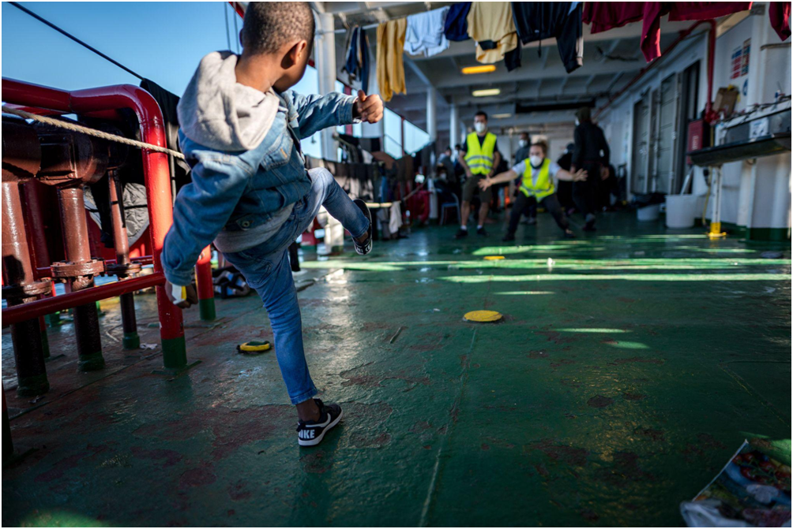
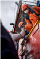
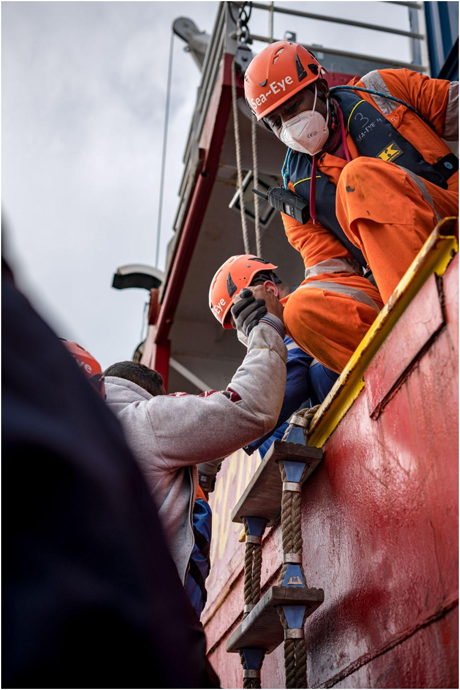
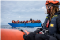
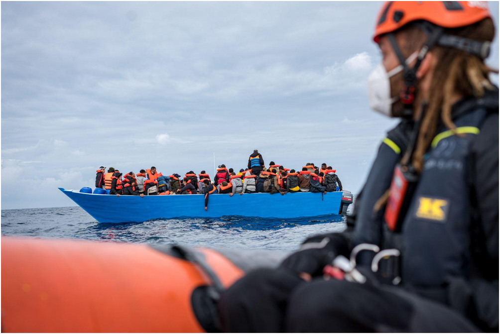
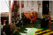
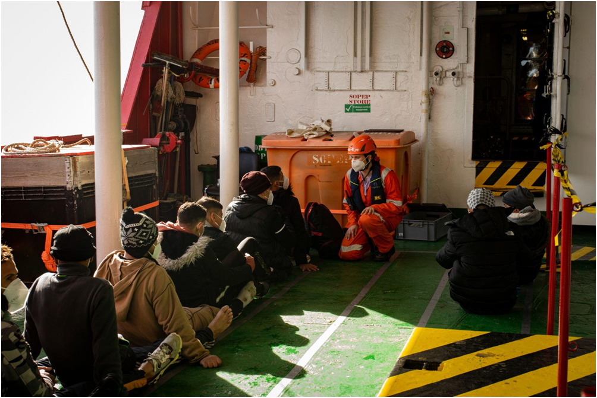
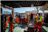
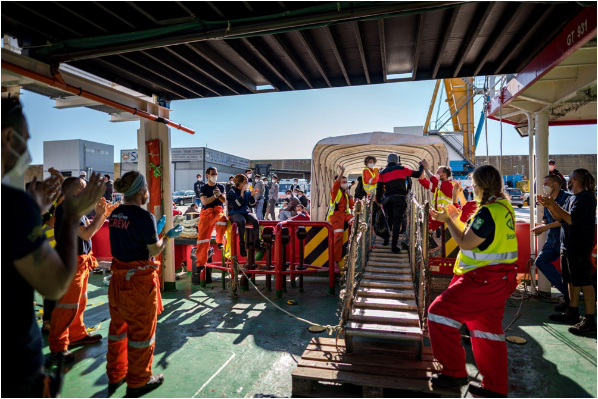

### AYS Special: ‘Salut, camarade’: Solidarity and inequality in the Central Mediterranean

[Are You Syrious?](?source=post_page-----7d8524a1737a-----------------------------------)

[Jan 9](ays-special-salut-camarade-solidarity-and-inequality-in-the-central-mediterranean-7d8524a1737a?source=post_page-----7d8524a1737a-----------------------------------) · 7 min read

_Tigs Louis\-Puttick recounts her experience as the Post\-Rescue Assistance Team Coordinator on the most recent mission of the Sea\-Eye 4, a civil search and rescue mission in the Central Mediterranean\._

Abu, a young boy, kicks a football\. When he arrived onboard, he could not walk due to the physical trauma of the long boat journey\. \(Photo credit: Camilla Kranzusch, Sea\-Eye\)

It was December 21st, 2021, the fifth day of waiting for Italian authorities to assign a port of safety for the civil sea rescue ship Sea\-Eye 4\. Although I could see the faint outline of the Sicilian coast from my position on deck, it took days for the Italian authorities to disembark our 223 rescued passengers\. They stated that the four rescues we had carried out took place in the Maltese Search and Rescue zone, and pointed out that the responsibility therefore lay with Malta to disembark the people so they could start their asylum processes\. The Maltese authorities, however, did not respond to our requests for aid from the very beginning\.

I served as the Post\-Rescue Assistance Team Coordinator on this most recent mission of the Sea\-Eye 4, a civil search and rescue mission in the Central Mediterranean\. My job was to care for rescued people once they were brought on our ship, working to organize food distribution, provide information, and come up with activities to try to reduce the boredom and tensions that inevitably arose with so many people crammed into such a tight space\.

My twenty\-five fellow crew members and I spent a total of thirty days at sea aboard the Sea\-Eye 4, an ex\-offshore supply vessel that has been used as a search and rescue ship by the German nonprofit Sea\-Eye since 2021\. In less than thirty\-six hours, our crew had located and rescued 223 people from four boats in distress in the Central Mediterranean Sea\.

The mission crew came from all walks of life\. I’m a 22\-year\-old recent graduate from the UK, and I worked alongside a 38\-year\-old professional sailor from Ghana, a 32\-year\-old German doctor, and a 48\-year\-old Italian telecommunications worker\.

The people we rescued were similarly diverse: from Ethiopia, Cameroon, Palestine, and a myriad other countries\. They comprised people of all ages, many of whom had never seen the sea before a smuggler loaded them onto a rickety wooden boat on the Libyan or Tunisian coast and told them to drive north\. These experiences were traumatic for all the people on these unseaworthy boats, even for the children, who are still too young to understand what was happening\.

When Europeans in pleasure vessels find themselves in distress at sea, multiple rescue authorities rush to save them\. Yet when a boat carrying hundreds of people from less privileged backgrounds — predominantly people of colour — calls for help, they are usually at first ignored\.

If the people on the move are lucky, civil rescue ships like those operated by Sea\-Eye are able to locate them, and eventually, begrudgingly, European states allow them to disembark on their shores\.

But many find their journeys to safety in Europe cut short by the so\-called Libyan Coastguard, who capture their boats at sea and return them to Libya, where they face [unspeakable abuse in detention centres](https://www.newyorker.com/magazine/2021/12/06/the-secretive-libyan-prisons-that-keep-migrants-out-of-europe) \.

Too many voyages end with death\. [Over 1,800 people](https://data2.unhcr.org/en/situations/mediterranean) either drowned or went missing in the Central Mediterranean in 2021\.

With thoughts of the tragic deaths at sea present in my mind, I looked away from the bittersweet sight of Sicily and turned to the task at hand — distributing food for everyone onboard\. As one woman, Nadège, came towards me to receive the lunch of lentils and rice, she said ‘Salut, camarade’ — Hello, comrade\.

Her greeting rendered me temporarily speechless\. At first I was overwhelmed by the simple sentiment of connection, that she felt comfortable to address me as an ally, which many of us working in civil search and rescue strive to be\. As I reflected later, I also felt glad that the crew were able to convey some sense of solidarity to those we had rescued\. On rescue missions, we actively seek to communicate that we stand side by side with people on the move searching for safe, secure futures in an increasingly hostile Europe\.

But civil actors and people fleeing struggle from unequal positions\. Myself and my fellow volunteers join the fight out of political and personal convictions\. The people we rescued crossing from North Africa to Italy are fighting for safety and better futures for themselves and their family members, some of whom are left behind at home\.

Throughout the mission, we strove to convey to the people onboard that they deserve more than simple survival\. Life on board the ship resists the pattern of struggle that characterized people’s experiences in Libya as well as their futures in Europe\. In Libya, people are in a perpetual battle for their lives\. In Europe, they must negotiate a complex asylum process that could take years\.

We wanted to create an environment on board where they felt they could dance and laugh; suggest recipes for spicier food onboard; and request a bigger blanket when the one we gave them doesn’t quite cover their toes\.

Each person deserves to be recognised by name, not simply by the number on their wristband\. At every meal distribution I scribbled down people’s names and the languages they spoke on scraps of paper so I could greet them personally at the next meal\. As days went by, numbers became faces became names became stories\.

Mamadu: whose gentle, calm manner made him seem older than his fifteen years, and who had survived three months of brutality in detention centres in Libya, yet smiled more than most people I know\.

Tenneh: who had made the long journey to Libya from Sierra Leone with her siblings, all of them under sixteen — the youngest only five\.

Aboubakar: a man from Cameroon who always helped with the washing up, despite his exhaustion after spending three long days and nights at sea\.

Salman: who offered to cook us all a Pakistani rice dish as his stomach disagreed with the couscous we served him\. He told us it was the first time in his life he’d ever eaten couscous\.

Aya, Fatima and Ife: who asked me every hour when we would arrive as they felt seasick, but still wanted to dance and wished me good night every evening\.

During the long days at sea, we played music on deck to help pass the time and put the rescued people at ease\. We invited people to select the songs so that everyone else could hear the music from their country and dance along\.

On the last day of the stand\-off with the Italian authorities, we brought out the crew’s electric hair clippers so two people who had trained as barbers could give haircuts\. People wanted to look their best when they arrived in Europe\.

Yet although we shared stories and danced together, glaring disparities in privilege between the crew and those on the deck remained\. When our shifts on deck ended, we took warm showers\. We didn’t have to queue for food — we opened the fridge and chose what we wanted\. While the people slept in crowded containers on deck, the roaring waves of the winter sea providing a nighttime soundtrack, we retreated below to the comfort of cabins shared with only one roommate\.

These inequalities hung over us throughout and after the mission as we discussed ways to improve the quality of life on the ship for those we rescued\. At the root of the inequality onboard is one crucial difference between crews and the people they rescue: their passports, which bestow or deny the privilege of mobility\.

We arrived in the port of Pozzallo, Sicily on Christmas Eve, after a week of waiting for permission from Italy\. It’s now been just over two weeks since the 223 people left the ship\. Despite the persistent inequalities playing on my mind, the ‘salut, camarade’ greeting from Nadège stays with me\. If not as a reality, then as a goal, that one day we could greet one another as true equals, with shared rights and possibilities\.

**_Article By Tigs Louis\-Puttick_**

**_Note: All names and background stories have been modified to protect the identities of the people mentioned in this article\._**

**Find daily updates and special reports on our [Medium page](https://medium.com/are-you-syrious) \.**

**If you wish to contribute, either by writing a report or a story, or by joining the info gathering team, please let us know\.**

**We strive to echo correct news from the ground through collaboration and fairness\. Every effort has been made to credit organisations and individuals with regard to the supply of information, video, and photo material \(in cases where the source wanted to be accredited\) \. Please notify us regarding corrections\.**

**If there’s anything you want to share or comment, contact us through Facebook, Twitter or write to: areyousyrious@gmail\.com**

_Converted [Medium Post](https://medium.com/are-you-syrious/ays-special-salut-camarade-solidarity-and-inequality-in-the-central-mediterranean-a7ae805465f3) by [ZMediumToMarkdown](https://github.com/ZhgChgLi/ZMediumToMarkdown)._
