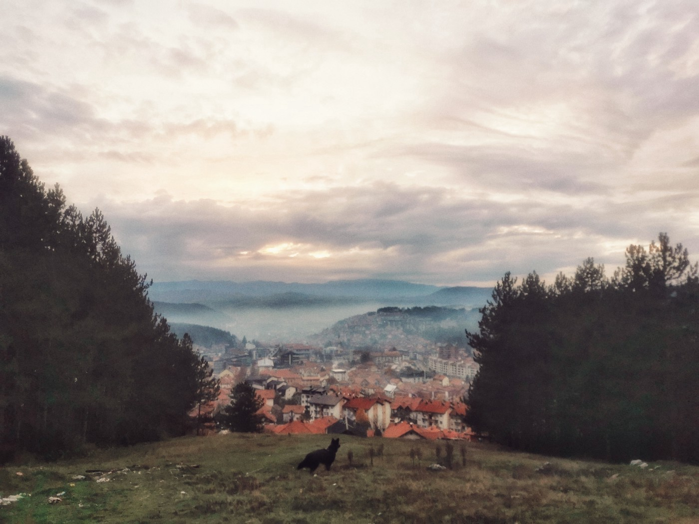
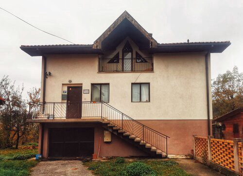
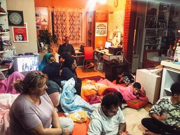
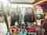
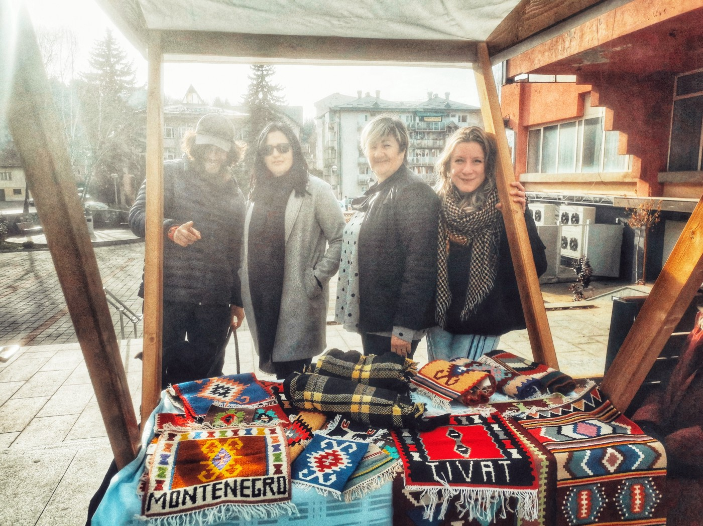

### AYS Special from Montenegro: Bona Fide, Safety in Vukojebina

[Are You Syrious?](?source=post_page-----cf18bd4a9099-----------------------------------)

[Dec 22, 2021](ays-special-from-montenegro-bona-fide-safety-in-vukojebina-cf18bd4a9099?source=post_page-----cf18bd4a9099-----------------------------------) · 8 min read

**_This is the first of our Winter Break Specials: a report by Helen Tennyson on the Bona Fide safe house in northern Montenegro\. A long\-lasting sanctuary open to everyone in need, in the face of mounting fascism and xenophobia in the region and all over Europe\._**

Photo Credit: Helen Tennyson

Pljevlja is a town high up in the northern mountains of Montenegro\. The climate is wet and heavy; smog and fog blanket the roads and visibility remains low even at midday\. It has a kind of bleak charm that I find appealing — the houses are reddish and dotted about quaintly, and every road leads to the mountains\. Outside the houses, huge piles of logs lean against the walls to fuel the furnaces over the coming months, and smoke from the fires leave a slight sulphuric taste in the mouth\. Snow can be up to four feet high and bears and wolves live in the mountains\. Pljevlja is known as Vukojebina — ‘where the wolves fuck’ — or the arse\-end of nowhere\.

> _The region shares a border with Serbia and Bosnia and the environment is harsh and remote\. The summer has both excessive rain and heat but in contrast winter hits mercilessly\. Temperatures as low as \-40°C and waist\-high snow plague travellers passing through\._ 

The city has been a thoroughfare for hundreds of years, having had Ottoman and Austro\-Hungarian occupation, as well as being part of former Yugoslavia\. The mosque in the city was the first in the Balkans; its minaret is 500 years old\.

People arrive here most days, migrating from various countries, and they must travel on foot over the mountains into Bosnia and eventually further on to the EU\. Since 2017, there have been more and more people coming this way through the Balkans, as other migration routes have become impassable due to horrific [pushbacks and border violence](https://www.borderviolence.eu/background/) in countries like [Hungary](https://balkaninsight.com/2020/11/10/lost-in-transit-how-hungary-scrapped-asylum/) and Romania\. The Balkans are notoriously difficult for people fleeing persecution\. Fascist factions have taken hold in almost every region and, as a result, the persecution of people on the move, perceived as ‘the other’, has become frighteningly commonplace\.

On a small street near the centre of town, slightly set back from the road, a small house sits unassumingly\. ‘Bona Fide’ is a safe house run by Sabina \(Mama Sabina to those who have met her for she is a mother to all\) that does whatever it can to help people in the region; working to provide shelter, safety, food, hot showers and medical attention\. There are no stipulations\. Anyone in need can access these services at any time, for as long as they need\. If there is no room in the bedrooms, people sleep on the floor\. If the floor is full, people go to her brother’s house\. The only time she has to say no to anyone is due to political and police pressure, or when there is no money to provide anything\.

Montenegro has been trying to gain EU membership since it became a country in 2008, and so government funding has been directed to the improvement of more ‘touristy’ areas along the Adriatic coastline\. Through attracting more tourists, the coastal economy is relatively booming as the rest of the country struggles comparatively\. Poverty often brings with it social unrest and Pljevlja is no exception\. Fascist sympathies run deep in the region, with many people looking back nostalgically to the days of a greater Serbia\. Muslims have been long persecuted here and with fewer and fewer people passing through, those who look different \(and those who help them\) become scapegoats and targets of vigilante nationalism\.

Socially, due to the shared borders and shared histories, there are strong Serbian nationalist sentiments in Pljevlja that have been expressed in Islamophobic action, more publicly so after the Montenegrin parliamentary elections in September 2020\. The current Montenegrin government is pro Serb and nationalist, and the dark shadow of fascism is beginning to creep into well\-lit areas of life in the town\. Bona Fide has had all funding to the organisation cut, including access to coal, without which they cannot heat the house\. There are [reports of the expansion of Serbian controlled media](https://balkaninsight.com/2021/12/06/serbian-media-step-up-presence-in-montenegro-causing-concern/) in the country, which is worrying for those who do not see eye\-to\-eye with the Serb agenda\.

The most concerning element to me is the public acceptance of demonstrations in support of fascism\. Nationalist rallies and banners are becoming more and more frequent\. In November, [someone used physical violence and language](https://www.standard.co.me/hronika/video-provokacija-u-pljevljima-mahao-srpskom-zastavom-ispred-dzamije-pa-napao-aktivistkinju-sigurne-zenske-kuce) to project their political agenda at a festival day, resulting in a physical assault on Sabina\. The perpetrator, who also attempted to grab a police weapon, was arrested but not prosecuted\. Although an isolated incident, actions like this are commonplace across the Balkans and increasingly Montenegro, and specifically target and intimidate Muslim and Bosniak peoples\. Nationalist graffiti are common across the city and local activists have experienced significant repression by the local community — Sabina herself having been specifically targeted numerous times\. She has been accused of housing terrorists by her neighbours\. The political climate here has driven Muslims almost entirely out of the area, which leaves those transiting through more exposed to harm\.

Before, there were a few long term residents at Bona Fide — nowadays, there are up to 60 people at any one time, everywhere in the house, and the immediate needs are greater\. Over 7,000 people have passed through Sabina’s house in the last three and a half years\. People’s needs are urgent and so space and time for long\-term creative projects is limited\. The reserves of rugs and blankets that once took up every corner of the house are running low, having been used in emergencies to send people on their way with some form of protection from the cold in the mountains\. These and other possessions are often [taken and burnt on arrival in Croatia by border police](https://www.amnesty.org/en/latest/news/2020/11/eu-inquiry-into-european-complicity-in-croatian-border-violence-against-migrants-and-refugees-significant/) \.

Bona Fide, and specifically Sabina and her daughter Azra are examples of the constant fight that rages in the Balkans\. Everywhere, everyone has the memory of war, and old divisions and prejudices do not die quietly\. The battle for equality and the need to be heard has been a constant effort, be it for women, Muslims or Montenegro itself\. Fascism takes no prisoners\. It glorifies racism, champions violence and breeds extremism\. In the Balkans it is long\-since known: “All my life”, Sabina said to me with regard to her recent attack\. To those of us on the other side of Europe it seems far away, both physically and in memory\. Talk of fascism in Western Europe is almost cold\-war\-esque, and yet the wolf is nipping at our heels as we speak\. In Austria and Poland the response to the crisis in Afghanistan has been a [firm, hard no](https://www.euractiv.com/section/global-europe/news/austria-calls-for-deportation-centres-to-host-afghans-near-afghanistan/) , and in Britain our Government is ripping our rights out by the roots every day\. Continued action, in the face of an overwhelming and powerful oppressor is exhausting and frightening, and yet increasingly necessary\. Oppression is why people move, why people fight, and why Bona Fide exists\.

Since it opened, Bona Fide has expanded exponentially, however its core values remain the same\. It is a safe house\. A space for those in need without question, discrimination or expectation\. Principles of equality, trust, and sanctuary run deep\. It is small, but its work is invaluable\. Most importantly, its resourcefulness is unparalleled\. ‘Economic and domestic’ is how Sabina describes it to me, jokingly\. They cook from scratch and reuse everything until it’s useless\. It’s almost impossible to imagine coming from Western Europe, but the whole operation runs for just over £5000 a year\.

The first day I arrived here, I sat with Sabina as she showed me pictures from hundreds of files on her desktop\. We had coffee after coffee as she recounted her memories for me, her voice cracking through painful episodes\. Language was no barrier\. I can see every journey, every fall, every pushback, the fear, the shelter and the warmth here\. Sabina holds a story from every human who has passed through her home\. She relives them for us, crying through the horrors and crying again with joy at their endings of safety in Holland, Germany, England\. I wanted to share some but they aren’t mine to share\. They live with the people who’ve experienced them\. I hope honestly that the horror stops, and that the overall need for a place like Bona Fide diminishes\. Until then I know that Sabina and Azra will continue to fight for those unseen and unheard, and will inspire others — through their actions and words — to do the same\.

**To support the work of Bona Fide — [donate here](https://gogetfunding.com/bona-fide/) \.**

**_Helen Tennyson has helped out with various projects in France and Serbia as well as Montenegro and also co\-founded solidarity group [OUI](https://www.instagram.com/oui.support/) \._**

Further Readings:
- [Border Violence Monitoring Network](https://www.borderviolence.eu/about/)
- [Border Violence and Covid\-19 Balkans](https://www.ecre.org/bvmn-special-report-on-violence-along-the-balkan-route-during-covid-19/)
- [History of Organised Fascism in Serbia](https://theanarchistlibrary.org/library/sava-devuric-history-of-organized-fascism-in-serbia)
- [The Balkans in Right\-wing Mythology](https://antidotezine.com/2019/06/10/the-balkans-in-rightwing-mythology/)
- [Right\-wing extremist’s fascination with the Balkans — NBC News](https://www.nbcnews.com/news/world/new-zealand-attack-exposes-right-wing-extremists-fascination-balkans-n984721)
- [Croatia denies border violence claims — Guardian](https://www.theguardian.com/global-development/2020/oct/23/croatia-denies-migrant-border-attacks-after-new-reports-of-brutal-pushbacks#:~:text=Croatia%20has%20dismissed%20allegations%20of,the%20allegations%20%E2%80%9Cvery%20seriously%E2%80%9D.)

**Balkan Insight Articles**
- [Tensions on the Bosnian border](https://balkaninsight.com/2020/08/19/on-bosnias-border-with-croatia-tensions-build-over-migrants-refugees/)
- [How Hungary Scrapped Asylum](https://balkaninsight.com/2020/11/10/lost-in-transit-how-hungary-scrapped-asylum/)
- [Serbia Restricts Migrant Movement](https://balkaninsight.com/2020/03/17/serbia-restricts-movement-for-migrants-asylum-seekers/)
- [Croatian Response to Accusations of Border Violence](https://balkaninsight.com/2020/05/14/croatia-accused-of-slurring-watchdogs-in-police-violence-dispute/)

**Longer Reads:**
- [Struggling to Survive: Unaccompanied and Separated Children Travelling the Balkans Route — Save the Children](https://resourcecentre.savethechildren.net/node/16944/pdf/struggling_to_survive_uasc_travelling_the_western_balkans_route_0.pdf)
- [The Western Balkans: Between the EU and a Hard Place — Srećko Latal](https://6e7a0e8d-d938-46ff-832d-a1d2166bc3a6.filesusr.com/ugd/2fb84c_12af27dc01df43a4b204595d7f0f1352.pdf)
- [The Rise of Ethnic Nationalism in the Former Socialist Federation of Yugoslavia: An Examination of the Use of History — Daniel Ryan Van Winkle](https://wou.edu/history/files/2015/08/Daniel-Van-Winkle.pdf) e

**Find daily updates and special reports on our [Medium page](https://medium.com/are-you-syrious) \.**

**If you wish to contribute, either by writing a report or a story, or by joining the info gathering team, please let us know\.**

**We strive to echo correct news from the ground through collaboration and fairness\. Every effort has been made to credit organisations and individuals with regard to the supply of information, video, and photo material \(in cases where the source wanted to be accredited\) \. Please notify us regarding corrections\.**

**If there’s anything you want to share or comment, contact us through Facebook, Twitter or write to: areyousyrious@gmail\.com**

_Converted [Medium Post](https://medium.com/are-you-syrious/ays-special-from-montenegro-bona-fide-safety-in-vukojebina-6ef8c2c1c737) by [ZMediumToMarkdown](https://github.com/ZhgChgLi/ZMediumToMarkdown)._
