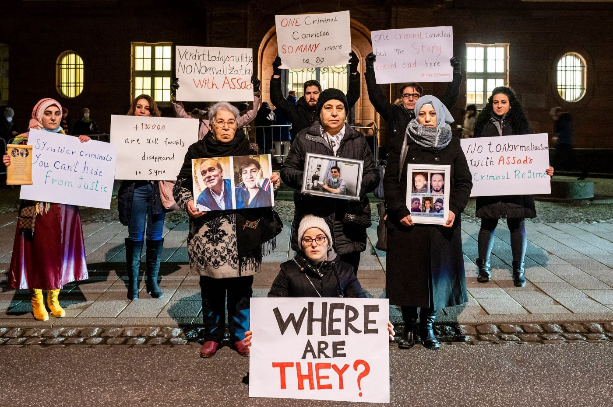

### AYS News Digest 14/01/2021: Former Syrian colonel guilty of crimes against humanity
### Ocean Viking rescue ship detained in Italy // More violent pushbacks, drownings and fire in Greece // Agreement made over Moroccan workers’ rights in Portugal // Another death in the Channel as UK gov face legal actions again // Greater powers for data collection and storage for Europol one step closer

[Are You Syrious?](?source=post_page-----d6a535a74226-----------------------------------)

[Jan 15](ays-news-digest-14-01-2021-former-syrian-colonel-guilty-of-crimes-against-humanity-d6a535a74226?source=post_page-----d6a535a74226-----------------------------------) · 8 min read

Photo Credit: [Paul Wagner/ The Syria Campaign](https://diary.thesyriacampaign.org/koblenz-verdict-jan-22-press-release/?fbclid=IwAR2J3XrikQuP7qe8z8GtW5S1YFVoSke0BKwfMBICZxFWdezySL1fF3fv-HA)
### FEATURE

A historic, landmark verdict: former Syrian colonel Answar Raslan was convicted of crimes against humanity and sentenced to life in prison by a court in Koblenz, Germany\. In the world’s first criminal case over state\-led torture in Syria, Raslan was found guilty of 27 counts of murder, rape and sexual assault and at least 4000 cases of torture\. He was the head of the investigation unit at Al\-Khatib prison, near Damascus, between 2011 and 2012\. His conviction could be a turning point for the international prosecution of war crimes\.

Raslan’s trial was only possible thanks to decades of efforts by activists and lawyers to smuggle thousands of documents and photographs out of Syria to serve as evidence of the crimes of the Assad regime\. More than 80 witnesses testified in front of the court about the conditions of detention in Al\-Khatib\. The accused had denied all the charges against him\.

In 2012, Answar Raslan defected from the Syrian regime and fled to Germany\. By chance, he was recognized at a refugee center in Berlin by Anwar al\-Bunni, a Syrian human rights lawyer who had been arrested by Raslan in 2006 and then spent five years in prison\. Al\-Bunni lodged a complaint with the police which led to Raslan’s arrest in 2019\. After the conviction, al\-Bunni told [CNN](https://edition.cnn.com/2022/01/13/europe/syria-assad-regime-trial-intl-cmd/index.html) : “I’m happy because this is a victory for justice\. I’m happy because it’s a victory for the victims sitting inside \[the courtroom\] \. I’m happy because it’s a victory for the victims in Syria who couldn’t make it here\.”

The German court was able to put Raslan on trial because it applies the legal principle of universal jurisdiction, which allows the prosecution of perpetrators of serious crimes no matter their nationality or where the crimes took place\. He could not have been tried at the International Criminal Court, as Syria is not party to the ICC\. This landmark case raises hopes that this principle can be used for future prosecutions: this month in Frankfurt the trial will begin of Alaa Mousa, a Syrian regime doctor accused of torture by at least one prisoner\.

Dozens of campaigners waited for the verdict outside the courtroom, holding photos of their disappeared loved ones\. Over 100,000 have been abducted, detained or disappeared in Syria since the start of the war\.

[Find out more](https://harpers.org/archive/2020/08/in-plain-sight-syrian-war-criminals-in-europe/) about Raslan’s arrest and the search for Syrian war criminals in Europe\.
### SEA/SAR
### Ocean Viking rescue ship detained in Italy

[The Ocean Viking has been detained in Italy due to a technicality\.](https://thecivilfleet.wordpress.com/2022/01/12/italy-detains-ocean-viking-refugee-rescue-ship-on-a-technicality/?fbclid=IwAR0DpLs5ycm7A4q0oNCmNwFpzbMawww8t11lZjHIib_eTT9ftFLKDgylKsw) The rescue ship of [SOS Mediterranee](https://thecivilfleet.wordpress.com/tag/SOS-Mediterranee/) has been detained in the Sicilian port of Tripani due to containers on the deck of the ship being incorrectly registered\. On their last mission, 114 people were rescued, and delays to their work could lead to more deaths in the sea\.

> _“Last month only, at least 240 people drowned at Europe’s doorstep\. Humanitarian vessels such as the Ocean Viking, filling the gap left by European states, are vital to prevent these repeated shipwrecks\.” [Director of operations Frédéric Penard](https://thecivilfleet.wordpress.com/2022/01/12/italy-detains-ocean-viking-refugee-rescue-ship-on-a-technicality/?fbclid=IwAR0DpLs5ycm7A4q0oNCmNwFpzbMawww8t11lZjHIib_eTT9ftFLKDgylKsw)_ 

MSF’s ship the Geo Barrents is returning to Mediterranean waters\.

Meanwhile, [58 people from sub\-Saharan Africa](https://www.laprovincia.es/canarias/2022/01/14/rescatan-patera-30-magrebies-tres-61564159.html?fbclid=IwAR2wWOseYJ0Y18CboKWFMYrtf9PSpW7uZYI6_7RVbXXQoXxEmqMtBtzKLTk) were rescued off the coast of Fuerteventura\. The group were discovered by plane and rescued 92 kilometers off shore\. This was the third such operation on Friday, with a group of approximately 60 arriving on Gran Canaria and a group of around 30 on Lanzerote\.
### GREECE
### More violent pushbacks, drownings and fire in Greece

A group of [25 people including 17 small children were violently pushed back from the island of Lesvos after several days hiding on the island](https://aegeanboatreport.com/2022/01/13/17-children-left-drifting-at-sea/?fbclid=IwAR0U7z_-LZssySvpIHEEkHpdDYaqOYZU08yurvXWvOS7t0t6xmNYcl7olDE) \. The group landed on Sunday 9 January and were hiding in the woods in fear of the police\. Despite several posts and calls for help, no help came: aiding new arrivals has been heavily criminalized in the Greek islands in the past years, with activists, volunteers and journalists being arrested and charged with facilitating illegal entry into Greece\.

The 25 people stayed in hiding the whole night, in freezing temperatures and without any dry clothes, food or water\. They expressed their desire to apply for asylum, which was forwarded to the authorities, the Greek Ombudsman and UNHCR\. Despite all these efforts, as countless times before, the group was arrested by masked policemen the next day and all contact with them was lost\. They were held at gunpoint, beaten by the police and all their belongings and phones were taken away\.

On Monday night, the 25 people were found drifting in a liferaft outside Seferihisar, Turkey — 200 kilometers from Lesvos\. Placed in quarantine in Turkey, they detailed their horrific treatment by the Hellenic Coastguard\. Two babies and a 13\-year\-old girl had to be taken to hospital: the girl’s foot was broken when she was thrown into the liferaft by the Coastguard\. [Read more](https://aegeanboatreport.com/2022/01/13/17-children-left-drifting-at-sea/?fbclid=IwAR0BRVIqcB2VjFl4DNxzrqUb4mz7r72ICsanDy-skrCPRjfPitTgvgAbW64) about this pushback\.

Particularly ironic in this context, NGOs in Greece have spoken out after the minister of maritime affairs and the Prime Minister announced widely differing numbers concerning immigration\. While the former said Greece had rescued over 29,000 people last year, Notis Mitarakis announced only 8,616 new arrivals — numbers that reinforce accusations of systematic pushbacks\.

Meanwhile, [two Kurdish Iranian people \(a married couple\) drowned in Northern Greece](https://www.keeptalkinggreece.com/2022/01/13/migrants-dead-serres-northern-greece/) on Wednesday as they tried to cross a swollen torrent with a group to avoid police patrols\.

[A large fire broke out on Friday in a big tent at Mavronouni refugee camp on Lesvos](https://www.facebook.com/MoriaWhiteHelmets/posts/480106270299104) \. According to an aid team on the ground, the fire was caused by an electrical short circuit\. No injuries were reported and firefighters put out the fire\.

According to the Greek ombudsman for children’s rights, only one in seven asylum\-seeking children living in camps on the mainland was able to attend school in the 2020–2021 school year — and none on the islands\. And the Greek government [just awarded](https://twitter.com/MarthaRoussou/status/1481912490397257731?fbclid=IwAR0NsoETB53CP9JBCeT6VlpE8JX72B1PTvPr283WgtVmY9-CxRKdd-bOV6A) a four\-year contract to Catering Consortia to provide food to people residing in camps, replacing the allowance \(and the agency …\) that people previously received\.
### BULGARIA

[A post published this week](https://www.facebook.com/josoor.international/posts/293126452847179) gives details of a pushback in December 2021 from the EU nation of Bulgaria to Turkey\. The 34 people who were involved in the illegal deportation, including minors, were subject to violence by the seven officers\.
### SPAIN

The National Police arrested 202 people as alleged “boat drivers” in the Canary Islands in 2021, with sentences up to 2017\. This past year has also been the most deadly on the Atlantic route: 4,016 people have died on their way to the Canary islands\. Borderline Europe [says](https://www.facebook.com/borderlineeurope/posts/4903932906296029) boat drivers are being “used as scapegoats for the high number of victims that the EU’s policy of deterrence is responsible for”\.
### PORTUGAL
### Agreement made over Moroccan workers’ rights

The Portuguese government has [signed an agreement](https://www.infomigrants.net/en/post/37857/portugal-signs-immigration-deal-with-morocco?fbclid=IwAR3Gzta1CuyfZGHW8g2cttACZfKH_CTWLY0m4nxPDbRxya9-I_9vFGj-DYo) with the Moroccan government to allow Moroccan nationals to live and work in Portugal\. The agreement means businesses can hire Moroccan workers who will then receive the same rights as native employees\. This comes as arrivals by boat to Portugal have increased and as Portugal faces worker shortages\. It is hoped that the measures will prevent human traffickers from capitalising on using a sea route to the Portuguese coast\.
### ITALY

A ruling by the Italian Constitutional Court is [set to make the government baby bonus and maternity allowance available to more people\.](https://www.infomigrants.net/en/post/37869/italy-baby-bonus-for-migrants-no-more-longterm-stay-requirement?fbclid=IwAR0PB-Fc6C0DC23ZDMNXTlDOs2BHB-CtqVq69bRK6TDwoHfxU40mbY2UFJI) Previously, refugees were required to have a long\-term permit to receive these benefits, but they will now be extended to those with work permits for 6 months or longer\.
### UNITED KINGDOM
### Another death in the Channel as the UK government face legal actions again

[A man from Sudan has sadly drowned in the Channel](https://www.independent.co.uk/news/world/europe/channel-death-latest-france-update-b1993127.html) , whilst more than 30 others were rescued\. [The man, in his 20s,](https://www.facebook.com/care4calais/photos/a.1046164975416459/5129958163703766/) fell overboard when the boat encountered difficulties near the French coast\. This comes as [over 300 people](https://www.infomigrants.net/en/post/37887/hundreds-make-it-across-english-channel-to-the-uk?fbclid=IwAR3V5qbZ2D1MPiUzuzAqqryyYo-mhLcilxwYzAyc9qDoWhq_ZTfdGR5qxhM) have successfully reached the UK from France since Monday 10th January\.

The UK Home Office has come under further criticism as [a man from Afghanistan and a man from Yemen](https://www.theguardian.com/uk-news/2022/jan/13/home-office-tells-afghan-and-yemeni-asylum-seekers-they-can-return-safely?fbclid=IwAR2ZEUAhlqP81VzLCWTNomEVLFGWioJUYg6yK4oaeQocc__cJbWO4_0A0lw) both had their asylum claims rejected\. The reason for the rejection was that their home countries were safe to return to, despite both countries being conflict zones\. These cases came to attention after a similar incident involving an asylum seeker from Syria\. All three countries are part of the guidance of the Home Office and UNHCR which state that they are not safe countries\.The case of the Syrian man [seems to have been resolved](https://www.infomigrants.net/en/post/37834/uk-home-office-backs-down-on-syrian-asylum-seekers-case?fbclid=IwAR2JbiTZQNJBYVCSo2QHK0t2rOVmaJKjSpekLMT4VFTlEymgYSoZMdhoNPs) , as a Tweet from the UK Home Office states:

[Legal measures](https://thecivilfleet.wordpress.com/2022/01/14/uk-border-force-may-have-begun-attempts-to-push-refugees-back-across-the-channel-already-evidence-suggests/?fbclid=IwAR1ZH37OoU2Nh0kSck-mL7kgZS-nyweeICPjmxf2_6ObxC3Pu-GqQviDXMA) are being taken against the UK government over alleged pushbacks in the Channel, with group Channel Rescuing claiming to have collected evidence of these events\.
### IRELAND

[A citizenship scheme is due to open in Ireland](https://www.irishexaminer.com/news/politics/arid-40783827.html?fbclid=IwAR1ZH37OoU2Nh0kSck-mL7kgZS-nyweeICPjmxf2_6ObxC3Pu-GqQviDXMA) \. Justice Minister Helen McEntee has announced that the scheme, which is due to open on 31st January 2022, will allow those who are currently undocmented to receive citizenship\. The estimated number of people this could apply to is 17,000 including 3,000 children\.
### EU \+ FRONTEX
### Greater powers for data collection and storage for Europol one step closer

[“Significant progress” has been made](https://www.statewatch.org/news/2022/january/eu-europol-significant-progress-on-legalising-illegal-data-practices/?fbclid=IwAR3q60d9XqzfnJbDvx5s7G_KkBftVnefOi8e5W-lyQwOcpNT8weP37cLxgs) in allowing policing entity Europol greater control of data\. In a move which began in December 2020, the European Commision are attempting to give more power over “big datasets”\. Europol were asked this week to delete data that they have collected from EU member states without seeking to establish if it was permitted\.

European Union and UNHCR officials have announced that Latvia, Lithuania and Poland are still using illegal pushbacks at their respective borders with Belarus\. EU Home Affairs Commissioner Ylva Johansson criticised the use of illegal tactics, saying:

> _“People still have the right to apply for asylum,they still have the right to have access to the asylum process\. We still have to be true to our values and to our treaty,” [EU Commissioner Johansson](https://www.infomigrants.net/en/post/37885/eu-and-unhcr-raise-alarm-over-pushback-methods-in-poland-latvia-and-lithuania?fbclid=IwAR2iRxx4MmEaWfvuWpnRTKMRs0574QvGN5rVymAtw8QIubdzhoLCwYurrUU)_ 

The fact that illegal tactics are acknowledged, but no action taken is highlighted by various parties\. MEP Tineke Strik states:

The EU has ‘infringement procedures’ in place for if a country breaks EU law\. [This article explains about these procedures](https://www.politico.eu/article/curious-case-eu-disappearing-infringements/?fbclid=IwAR0u7AWM8D8-G28Jm9K2AEqHjzPtWPrxL8u1ty46GtzlFHfVIL44CY1geBk) and examines why they are not being used\.

[Human Rights Watch](https://www.hrw.org/news/2022/01/13/eu-commitment-rights-falters-under-stress?fbclid=IwAR2ZEUAhlqP81VzLCWTNomEVLFGWioJUYg6yK4oaeQocc__cJbWO4_0A0lw) has published the annual [World Report 2022\.](https://www.hrw.org/world-report/2022) It heavily criticises the response of the EU to migrants and asylum seekers in what it describes as [“the yawning distance between the bloc’s rhetoric on human rights and its actual practice,”](https://www.hrw.org/news/2022/01/13/eu-commitment-rights-falters-under-stress?fbclid=IwAR2ZEUAhlqP81VzLCWTNomEVLFGWioJUYg6yK4oaeQocc__cJbWO4_0A0lw)

[Transparency has been requested](https://fragdenstaat.de/anfrage/auf-den-virtuellen-thematischen-industrietagen-airborne-maritime-surveillance-solutions-am-26-und-27-januar-2021-gehaltene-prasentationen/?fbclid=IwAR0cOcesz2Lsc63zvpei8YRZK1l9HfkltFYaMJZSxABbB5O9rsr3ojVvw4A) over a Frontex presentation\. “Airborne Maritime Surveillance” that took place on 26th and 27th January 2021\. The event allegedly invited arms dealers to discuss surveillance planes, drones and other methods\.
### FURTHER INTEREST

[This report in German is a collaboration with ProAsyl and Mare Liberum on pushbacks\.](https://www.paxchristi.de/file/download/AMIfv97GA9avOEaI5LA8z3puxTig-z3MsoAlf5bUGSR3s7HUlO-w9Lae4tdNCUvmwCV4z2tfodIvPOcsXYYAJ5A9rahBDYigKa2pmgJkAY1fYt07oXbgrsxJNxdmBG4VScSeQ0U8OVjfeJvaRny0bAXVKJ2jQdLiTXXCaijjxlIO_Pv7tOKK7JqgelW1OXEPiBIOS0ubFSlIs-ym-Kd01Naach4am5tm-rQj8QxBc2UJ3KYpRraYK83309NxlcjdfekFhp1e5cMWEsmcgm7eQ2rYiTMYfMrsB9NJ5pVmOu9jgl6HpY_FWmY/eak_borschure_migration_ruestungsexport_dina4_freigabe.pdf)

[The newsletter of the European Council of Refugees and Exiles \(ECRE\)](https://mailchi.mp/ecre/ecre-weekly-bulletin-14012022?e=1fd2db1ebf&fbclid=IwAR0GqJ6nb5-fKigUGZM94NZhv0fWkSLz268C55owto96QN3iH9L_wSgcdBQ)

[The newsletter of ELENA legal update](https://us1.campaign-archive.com/?u=8e3ebd297b1510becc6d6d690&id=43bc035302&fbclid=IwAR15Ut5WuKFwJoSqKZR5GSPiZeLW8BRq4gw1Clxg44iW_U3QsjC5gA8gE4o)

[An argument for an expulsion mechanism from the EU](https://twitter.com/TomTheuns/status/1481518125602545668?fbclid=IwAR21Ix6S2fjR9MI0k4_N8nqepr0CfRNg2QDtWxe1Fw5RriwUAC6o_erda-I)

[A new open access book Thematic Focus: ICTs & Other Technologies](https://fm-cab.blogspot.com/2022/01/thematic-focus-icts-other-technologies.html?fbclid=IwAR1knBsHhXEK9uuyseY8r5Tto6lzXxWWUfMjTbXDEOgzHUdkXlat2uN9hPI)

[Between Belarus and Poland: the story of a family who a paid a smuggler, spent days in the woods, only to return to nothing\.](https://www.theglobeandmail.com/world/article-between-belarus-and-poland-yazidi-refugees-found-only-cold-and-hunger/?fbclid=IwAR3Gzta1CuyfZGHW8g2cttACZfKH_CTWLY0m4nxPDbRxya9-I_9vFGj-DYo)

[An article about the link between climate change and the rise in migration](https://theconversation.com/environmental-disasters-are-fuelling-migration-heres-why-international-law-must-recognize-climate-refugees-173714?fbclid=IwAR3Gzta1CuyfZGHW8g2cttACZfKH_CTWLY0m4nxPDbRxya9-I_9vFGj-DYo)

**Find daily updates and special reports on our [Medium page](https://medium.com/are-you-syrious) \.**

**If you wish to contribute, either by writing a report or a story, or by joining the info gathering team, please let us know\.**

**We strive to echo correct news from the ground through collaboration and fairness\. Every effort has been made to credit organisations and individuals with regard to the supply of information, video, and photo material \(in cases where the source wanted to be accredited\) \. Please notify us regarding corrections\.**

**If there’s anything you want to share or comment, contact us through Facebook, Twitter or write to: areyousyrious@gmail\.com**

_Converted [Medium Post](https://medium.com/are-you-syrious/ays-news-digest-14-01-2021-former-syrian-colonel-guilty-of-crimes-against-humanity-eb01ae6c398) by [ZMediumToMarkdown](https://github.com/ZhgChgLi/ZMediumToMarkdown)._
